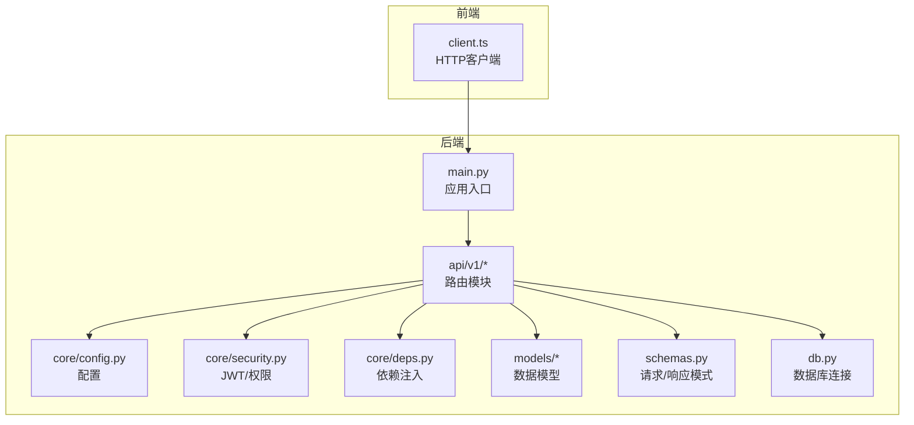
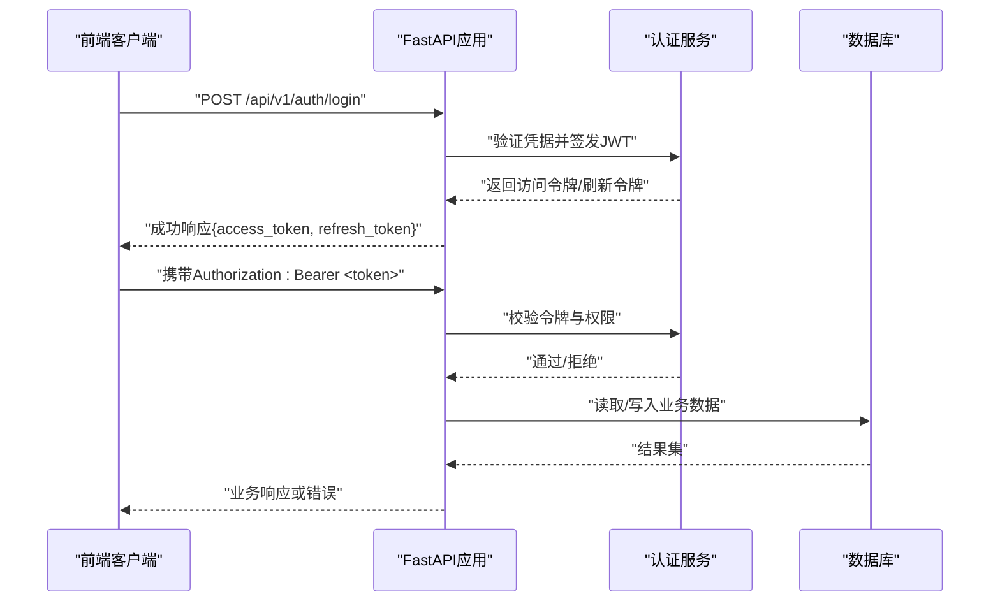
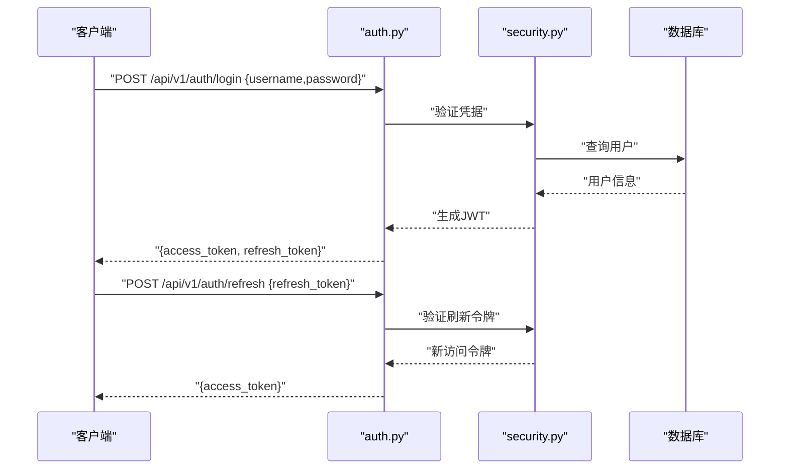
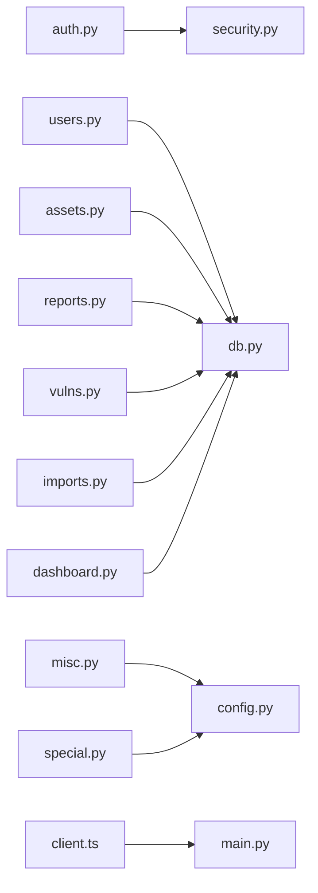

# API参考手册

<cite>
**本文档引用的文件**
- [backend/app/main.py](file://backend/app/main.py)
- [backend/app/api/v1/__init__.py](file://backend/app/api/v1/__init__.py)
- [backend/app/api/v1/auth.py](file://backend/app/api/v1/auth.py)
- [backend/app/api/v1/users.py](file://backend/app/api/v1/users.py)
- [backend/app/api/v1/assets.py](file://backend/app/api/v1/assets.py)
- [backend/app/api/v1/reports.py](file://backend/app/api/v1/reports.py)
- [backend/app/api/v1/vulns.py](file://backend/app/api/v1/vulns.py)
- [backend/app/api/v1/imports.py](file://backend/app/api/v1/imports.py)
- [backend/app/api/v1/dashboard.py](file://backend/app/api/v1/dashboard.py)
- [backend/app/api/v1/misc.py](file://backend/app/api/v1/misc.py)
- [backend/app/api/v1/special.py](file://backend/app/api/v1/special.py)
- [backend/app/core/config.py](file://backend/app/core/config.py)
- [backend/app/core/security.py](file://backend/app/core/security.py)
- [backend/app/core/deps.py](file://backend/app/core/deps.py)
- [backend/app/models/user.py](file://backend/app/models/user.py)
- [backend/app/models/business.py](file://backend/app/models/business.py)
- [backend/app/models/report.py](file://backend/app/models/report.py)
- [backend/app/models/imports.py](file://backend/app/models/imports.py)
- [backend/app/models/special.py](file://backend/app/models/special.py)
- [backend/app/schemas.py](file://backend/app/schemas.py)
- [backend/app/db.py](file://backend/app/db.py)
- [frontend/src/api/client.ts](file://frontend/src/api/client.ts)
</cite>

## 目录
1. [简介](#简介)
2. [项目结构](#项目结构)
3. [核心组件](#核心组件)
4. [架构总览](#架构总览)
5. [详细组件分析](#详细组件分析)
6. [依赖关系分析](#依赖关系分析)
7. [性能考虑](#性能考虑)
8. [故障排查指南](#故障排查指南)
9. [结论](#结论)
10. [附录](#附录)

## 简介
本手册为Talos RESTful API的完整参考，涵盖认证与授权、API端点规范、请求/响应格式、错误码与异常处理、版本控制与兼容性策略、调用频率限制与安全措施、SDK集成示例以及测试与调试方法。读者可据此快速完成前后端对接与系统集成。

## 项目结构
后端采用FastAPI框架，按功能模块划分API路由（v1），核心配置与安全逻辑位于core层，数据模型位于models层，数据库连接与迁移在db与alembic中管理。前端使用TypeScript客户端封装HTTP调用，便于统一鉴权与错误处理。

图表来源
- [backend/app/main.py](file://backend/app/main.py)
- [backend/app/api/v1/__init__.py](file://backend/app/api/v1/__init__.py)
- [backend/app/core/config.py](file://backend/app/core/config.py)
- [backend/app/core/security.py](file://backend/app/core/security.py)
- [backend/app/core/deps.py](file://backend/app/core/deps.py)
- [backend/app/db.py](file://backend/app/db.py)
- [frontend/src/api/client.ts](file://frontend/src/api/client.ts)

章节来源
- [backend/app/main.py](file://backend/app/main.py)
- [backend/app/api/v1/__init__.py](file://backend/app/api/v1/__init__.py)
- [backend/app/core/config.py](file://backend/app/core/config.py)
- [backend/app/core/security.py](file://backend/app/core/security.py)
- [backend/app/core/deps.py](file://backend/app/core/deps.py)
- [backend/app/db.py](file://backend/app/db.py)
- [frontend/src/api/client.ts](file://frontend/src/api/client.ts)

## 核心组件
- 应用入口与路由挂载：定义API前缀、中间件、文档路径等。
- 认证与授权：基于JWT的登录、令牌刷新、权限校验。
- 资源路由：用户、资产、报告、漏洞、导入任务、仪表盘、杂项与特殊接口。
- 数据模型与Schema：ORM模型与Pydantic请求/响应模式。
- 依赖注入：数据库会话、配置、安全上下文等。

章节来源
- [backend/app/main.py](file://backend/app/main.py)
- [backend/app/api/v1/auth.py](file://backend/app/api/v1/auth.py)
- [backend/app/api/v1/users.py](file://backend/app/api/v1/users.py)
- [backend/app/api/v1/assets.py](file://backend/app/api/v1/assets.py)
- [backend/app/api/v1/reports.py](file://backend/app/api/v1/reports.py)
- [backend/app/api/v1/vulns.py](file://backend/app/api/v1/vulns.py)
- [backend/app/api/v1/imports.py](file://backend/app/api/v1/imports.py)
- [backend/app/api/v1/dashboard.py](file://backend/app/api/v1/dashboard.py)
- [backend/app/api/v1/misc.py](file://backend/app/api/v1/misc.py)
- [backend/app/api/v1/special.py](file://backend/app/api/v1/special.py)
- [backend/app/core/security.py](file://backend/app/core/security.py)
- [backend/app/core/deps.py](file://backend/app/core/deps.py)
- [backend/app/schemas.py](file://backend/app/schemas.py)
- [backend/app/models/user.py](file://backend/app/models/user.py)
- [backend/app/models/business.py](file://backend/app/models/business.py)
- [backend/app/models/report.py](file://backend/app/models/report.py)
- [backend/app/models/imports.py](file://backend/app/models/imports.py)
- [backend/app/models/special.py](file://backend/app/models/special.py)

## 架构总览
系统采用分层架构：
- 表现层：FastAPI路由与请求/响应Schema。
- 业务层：服务与处理器（如报告构建、漏洞服务）。
- 数据层：SQLAlchemy模型与数据库连接。
- 安全层：JWT签发与验证、角色权限控制。
- 客户端：前端HTTP客户端统一封装鉴权与重试。

图表来源
- [backend/app/api/v1/auth.py](file://backend/app/api/v1/auth.py)
- [backend/app/core/security.py](file://backend/app/core/security.py)
- [backend/app/db.py](file://backend/app/db.py)

## 详细组件分析

### 认证与授权（Auth）
- 登录：提交用户名与密码，返回访问令牌与刷新令牌。
- 刷新：使用刷新令牌获取新的访问令牌。
- 注销：使当前令牌失效（若实现）。
- 权限：基于角色的访问控制（RBAC），在受保护路由中校验。

典型流程

图表来源
- [backend/app/api/v1/auth.py](file://backend/app/api/v1/auth.py)
- [backend/app/core/security.py](file://backend/app/core/security.py)

章节来源
- [backend/app/api/v1/auth.py](file://backend/app/api/v1/auth.py)
- [backend/app/core/security.py](file://backend/app/core/security.py)
- [backend/app/models/user.py](file://backend/app/models/user.py)

### 用户管理（Users）
- 列表：分页查询用户，支持筛选与排序。
- 详情：根据ID获取用户信息。
- 创建：新增用户，包含角色与状态字段。
- 更新：修改用户属性。
- 删除：禁用或删除用户。

章节来源
- [backend/app/api/v1/users.py](file://backend/app/api/v1/users.py)
- [backend/app/models/user.py](file://backend/app/models/user.py)
- [backend/app/schemas.py](file://backend/app/schemas.py)

### 资产管理（Assets）
- 列表：分页查询资产，支持按类型、状态、标签过滤。
- 详情：获取资产详细信息。
- 创建：新增资产，关联组织与负责人。
- 更新：编辑资产属性。
- 删除：移除资产记录。

章节来源
- [backend/app/api/v1/assets.py](file://backend/app/api/v1/assets.py)
- [backend/app/models/business.py](file://backend/app/models/business.py)
- [backend/app/schemas.py](file://backend/app/schemas.py)

### 报告管理（Reports）
- 列表：分页查询报告，支持按项目、时间范围筛选。
- 详情：查看报告内容与元数据。
- 创建：生成报告（同步或异步任务）。
- 导出：下载PDF/Word等格式。
- 更新/删除：编辑或移除报告。

章节来源
- [backend/app/api/v1/reports.py](file://backend/app/api/v1/reports.py)
- [backend/app/models/report.py](file://backend/app/models/report.py)
- [backend/app/services/report_builder.py](file://backend/app/services/report_builder.py)
- [backend/app/schemas.py](file://backend/app/schemas.py)

### 漏洞管理（Vulns）
- 列表：分页查询漏洞，支持按严重级别、状态、扫描源筛选。
- 详情：查看漏洞详情与修复建议。
- 创建：录入漏洞信息。
- 更新：变更状态或备注。
- 删除：移除漏洞条目。

章节来源
- [backend/app/api/v1/vulns.py](file://backend/app/api/v1/vulns.py)
- [backend/app/models/business.py](file://backend/app/models/business.py)
- [backend/app/services/vuln_service.py](file://backend/app/services/vuln_service.py)
- [backend/app/schemas.py](file://backend/app/schemas.py)

### 导入任务（Imports）
- 列表：查询导入任务状态与进度。
- 详情：查看导入结果与错误日志。
- 创建：上传文件或触发导入任务。
- 取消：中止正在进行的导入。

章节来源
- [backend/app/api/v1/imports.py](file://backend/app/api/v1/imports.py)
- [backend/app/models/imports.py](file://backend/app/models/imports.py)
- [backend/app/schemas.py](file://backend/app/schemas.py)

### 仪表盘（Dashboard）
- 概览：统计关键指标（资产数、漏洞数、报告数等）。
- 趋势：时间序列数据（近7/30天）。
- 排行：Top漏洞、Top资产等。

章节来源
- [backend/app/api/v1/dashboard.py](file://backend/app/api/v1/dashboard.py)
- [backend/app/schemas.py](file://backend/app/schemas.py)

### 杂项与特殊接口（Misc & Special）
- 健康检查：服务可用性探测。
- 配置查询：公开的配置项（非敏感）。
- 特殊接口：内部工具或第三方集成接口。

章节来源
- [backend/app/api/v1/misc.py](file://backend/app/api/v1/misc.py)
- [backend/app/api/v1/special.py](file://backend/app/api/v1/special.py)

## 依赖关系分析
- 路由模块依赖core层的配置与安全组件。
- 所有业务路由依赖数据库会话与模型。
- 前端客户端统一封装HTTP请求，注入Authorization头。

图表来源
- [backend/app/api/v1/auth.py](file://backend/app/api/v1/auth.py)
- [backend/app/api/v1/users.py](file://backend/app/api/v1/users.py)
- [backend/app/api/v1/assets.py](file://backend/app/api/v1/assets.py)
- [backend/app/api/v1/reports.py](file://backend/app/api/v1/reports.py)
- [backend/app/api/v1/vulns.py](file://backend/app/api/v1/vulns.py)
- [backend/app/api/v1/imports.py](file://backend/app/api/v1/imports.py)
- [backend/app/api/v1/dashboard.py](file://backend/app/api/v1/dashboard.py)
- [backend/app/api/v1/misc.py](file://backend/app/api/v1/misc.py)
- [backend/app/api/v1/special.py](file://backend/app/api/v1/special.py)
- [backend/app/core/security.py](file://backend/app/core/security.py)
- [backend/app/core/config.py](file://backend/app/core/config.py)
- [backend/app/db.py](file://backend/app/db.py)
- [frontend/src/api/client.ts](file://frontend/src/api/client.ts)

章节来源
- [backend/app/api/v1/__init__.py](file://backend/app/api/v1/__init__.py)
- [backend/app/core/deps.py](file://backend/app/core/deps.py)
- [backend/app/db.py](file://backend/app/db.py)
- [frontend/src/api/client.ts](file://frontend/src/api/client.ts)

## 性能考虑
- 分页与限页：所有列表接口默认分页，避免一次性加载大量数据。
- 缓存策略：对热点数据（如仪表盘统计）引入缓存层。
- 异步任务：报告生成、导入任务采用后台队列，避免阻塞请求。
- 数据库优化：合理使用索引与查询条件，减少全表扫描。
- 连接池：数据库连接池配置需根据并发量调优。

[本节为通用指导，不直接分析具体文件]

## 故障排查指南
- 常见错误码
  - 400：请求参数校验失败。
  - 401：未认证或令牌无效。
  - 403：权限不足。
  - 404：资源不存在。
  - 422：请求体格式错误。
  - 500：服务器内部错误。
- 错误响应格式
  - 统一JSON结构：包含code、message、details等字段。
- 调试方法
  - 启用详细日志与请求追踪。
  - 使用OpenAPI/Swagger文档进行接口验证。
  - 前端客户端增加重试与退避策略。

章节来源
- [backend/app/core/security.py](file://backend/app/core/security.py)
- [backend/app/schemas.py](file://backend/app/schemas.py)
- [frontend/src/api/client.ts](file://frontend/src/api/client.ts)

## 结论
本手册系统化梳理了Talos RESTful API的架构、端点规范、认证授权机制、错误处理与性能优化建议。结合前端客户端封装与测试调试方法，可高效完成系统集成与问题定位。建议在开发过程中严格遵循Schema定义与错误码规范，确保前后端一致性与可维护性。

[本节为总结，不直接分析具体文件]

## 附录

### API端点规范总览
- 基础URL：/api/v1
- 认证方式：Bearer JWT
- 内容类型：application/json
- 字符编码：UTF-8

章节来源
- [backend/app/main.py](file://backend/app/main.py)
- [backend/app/api/v1/__init__.py](file://backend/app/api/v1/__init__.py)

### 认证与授权流程
- 登录：POST /api/v1/auth/login
- 刷新：POST /api/v1/auth/refresh
- 注销：POST /api/v1/auth/logout（若实现）
- 权限：基于角色的访问控制，需在受保护路由中声明。

章节来源
- [backend/app/api/v1/auth.py](file://backend/app/api/v1/auth.py)
- [backend/app/core/security.py](file://backend/app/core/security.py)

### 资源接口清单
- 用户：GET/POST /api/v1/users，GET/PUT/DELETE /api/v1/users/{id}
- 资产：GET/POST /api/v1/assets，GET/PUT/DELETE /api/v1/assets/{id}
- 报告：GET/POST /api/v1/reports，GET/PUT/DELETE /api/v1/reports/{id}
- 漏洞：GET/POST /api/v1/vulns，GET/PUT/DELETE /api/v1/vulns/{id}
- 导入：GET/POST /api/v1/imports，GET/DELETE /api/v1/imports/{id}
- 仪表盘：GET /api/v1/dashboard/*
- 杂项：GET /api/v1/misc/*
- 特殊：GET/POST /api/v1/special/*

章节来源
- [backend/app/api/v1/users.py](file://backend/app/api/v1/users.py)
- [backend/app/api/v1/assets.py](file://backend/app/api/v1/assets.py)
- [backend/app/api/v1/reports.py](file://backend/app/api/v1/reports.py)
- [backend/app/api/v1/vulns.py](file://backend/app/api/v1/vulns.py)
- [backend/app/api/v1/imports.py](file://backend/app/api/v1/imports.py)
- [backend/app/api/v1/dashboard.py](file://backend/app/api/v1/dashboard.py)
- [backend/app/api/v1/misc.py](file://backend/app/api/v1/misc.py)
- [backend/app/api/v1/special.py](file://backend/app/api/v1/special.py)

### 请求/响应示例（说明）
- 登录成功：返回访问令牌与刷新令牌。
- 刷新成功：返回新的访问令牌。
- 资源操作：返回对应资源的JSON对象或集合。
- 错误响应：包含错误码、消息与可选细节。

章节来源
- [backend/app/api/v1/auth.py](file://backend/app/api/v1/auth.py)
- [backend/app/schemas.py](file://backend/app/schemas.py)

### SDK使用示例与客户端集成
- 前端客户端封装：统一设置Base URL、拦截器、错误处理与重试。
- 初始化：传入认证令牌，自动附加到请求头。
- 错误处理：捕获网络与业务错误，提供友好提示。

章节来源
- [frontend/src/api/client.ts](file://frontend/src/api/client.ts)

### 测试与调试
- OpenAPI/Swagger：自动生成接口文档，支持在线测试。
- 单元测试：针对核心逻辑编写用例。
- 集成测试：模拟HTTP请求验证端到端流程。

章节来源
- [backend/tests/test_api.py](file://backend/tests/test_api.py)
- [backend/app/main.py](file://backend/app/main.py)