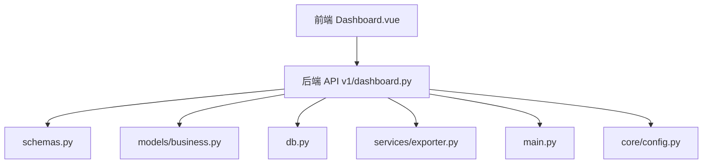
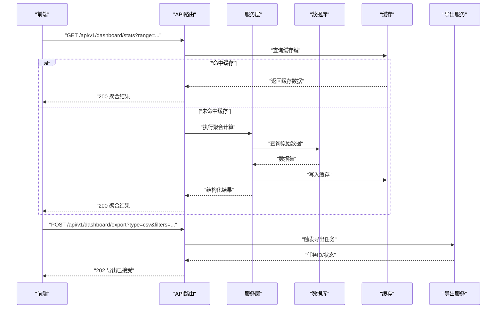
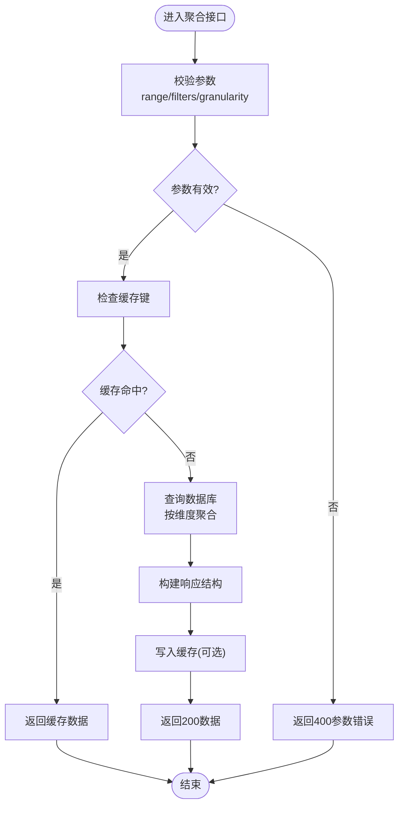
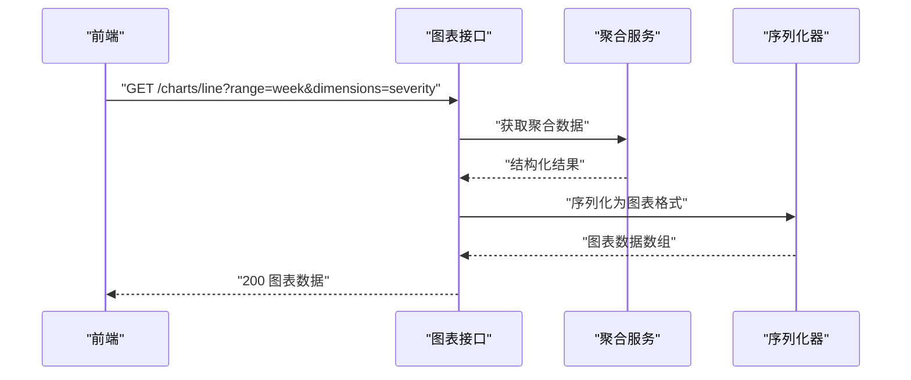
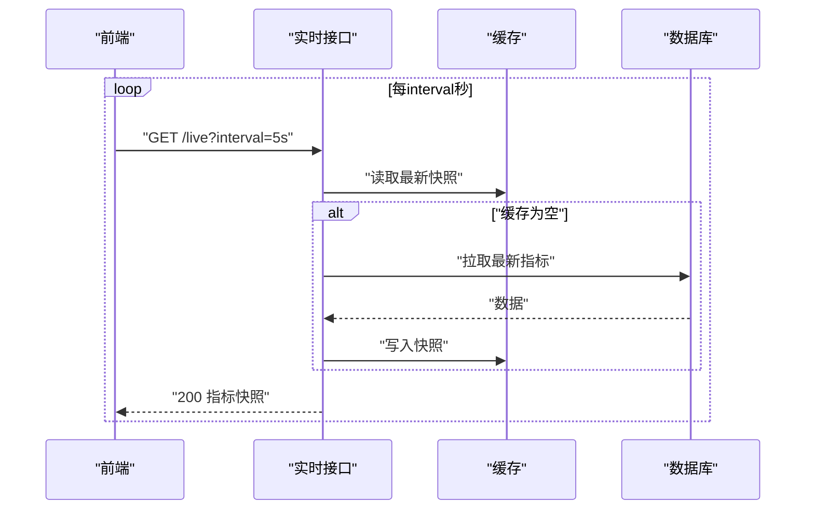
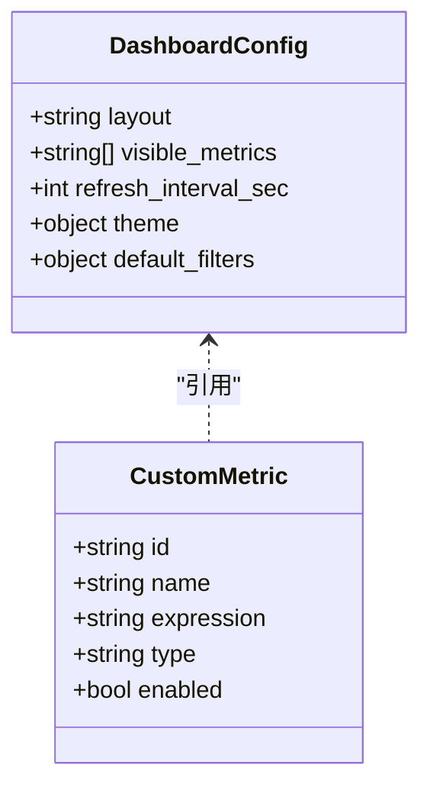
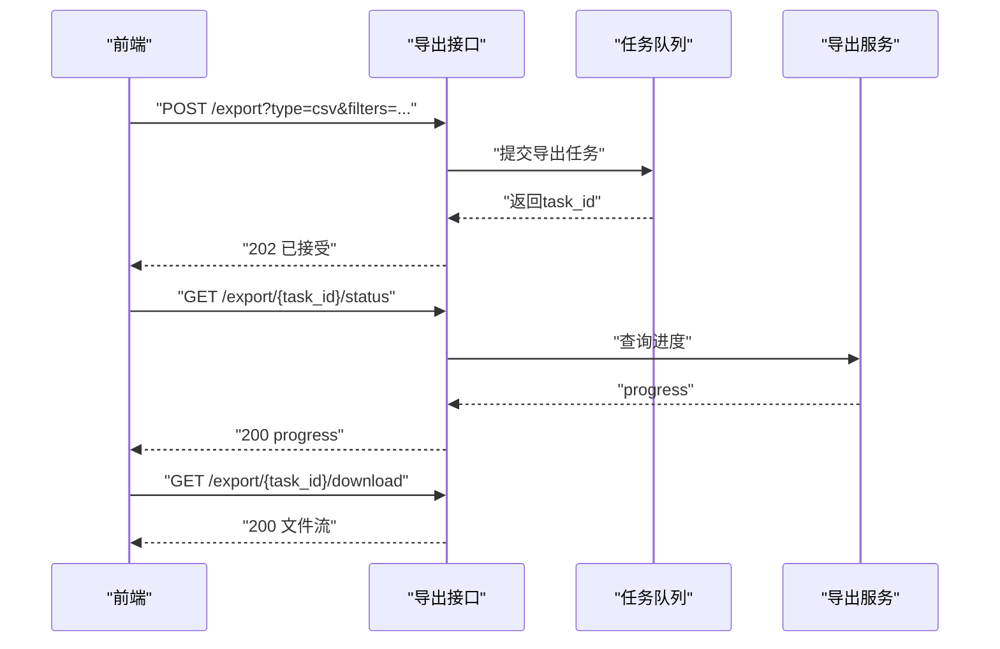
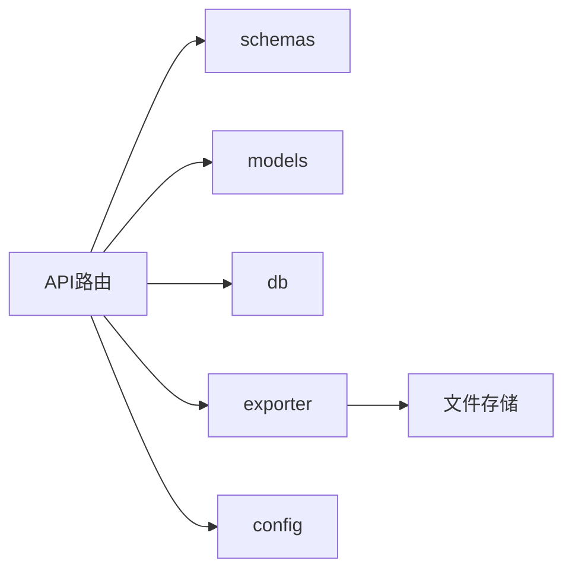

# 仪表板分析API

<cite>
**本文引用的文件**
- [backend/app/api/v1/dashboard.py](file://backend/app/api/v1/dashboard.py)
- [backend/app/schemas.py](file://backend/app/schemas.py)
- [backend/app/models/business.py](file://backend/app/models/business.py)
- [backend/app/services/exporter.py](file://backend/app/services/exporter.py)
- [backend/app/main.py](file://backend/app/main.py)
- [backend/app/core/config.py](file://backend/app/core/config.py)
- [backend/app/db.py](file://backend/app/db.py)
- [frontend/src/views/Dashboard.vue](file://frontend/src/views/Dashboard.vue)
- [frontend/src/api/client.ts](file://frontend/src/api/client.ts)
</cite>

## 目录
1. [简介](#简介)
2. [项目结构](#项目结构)
3. [核心组件](#核心组件)
4. [架构总览](#架构总览)
5. [详细组件分析](#详细组件分析)
6. [依赖关系分析](#依赖关系分析)
7. [性能考虑](#性能考虑)
8. [故障排查指南](#故障排查指南)
9. [结论](#结论)
10. [附录](#附录)

## 简介
本文件为“仪表板与数据分析模块”的完整API文档，覆盖统计数据聚合、图表数据生成、实时数据更新、仪表盘配置与自定义指标支持、数据缓存与性能优化策略，以及数据导出与分析工具接口。文档面向后端开发者、前端集成方与运维人员，提供清晰的请求参数、响应格式、错误码说明与最佳实践建议。

## 项目结构
该模块位于后端FastAPI应用中，主要包含：
- API路由层：dashboard相关端点定义
- 数据模型层：业务实体（资产、漏洞、报告等）
- 服务层：导出器、报表构建器等
- 数据库访问：SQLAlchemy会话与连接管理
- 配置与安全：应用配置、鉴权依赖
- 前端视图与客户端：Dashboard页面与API调用封装

**图示来源**
- [backend/app/api/v1/dashboard.py](file://backend/app/api/v1/dashboard.py)
- [backend/app/schemas.py](file://backend/app/schemas.py)
- [backend/app/models/business.py](file://backend/app/models/business.py)
- [backend/app/services/exporter.py](file://backend/app/services/exporter.py)
- [backend/app/main.py](file://backend/app/main.py)
- [backend/app/core/config.py](file://backend/app/core/config.py)
- [backend/app/db.py](file://backend/app/db.py)

**章节来源**
- [backend/app/api/v1/dashboard.py](file://backend/app/api/v1/dashboard.py)
- [backend/app/main.py](file://backend/app/main.py)

## 核心组件
- 仪表板统计聚合：按时间范围、维度（如资产类型、漏洞等级、区域等）聚合关键指标，返回用于图表渲染的结构化数据。
- 图表数据生成：将聚合结果转换为前端图表所需的序列/时序数据格式。
- 实时数据更新：通过轮询或事件推送机制获取最新指标变化。
- 仪表盘配置：保存/读取用户级或全局级布局、指标选择、刷新频率等。
- 自定义指标：允许扩展新的计算指标并纳入聚合流程。
- 数据导出：支持CSV/Excel/PDF等格式的批量导出与分析。
- 缓存与性能：基于内存/Redis的热点数据缓存、分页与限流、异步任务处理。

**章节来源**
- [backend/app/api/v1/dashboard.py](file://backend/app/api/v1/dashboard.py)
- [backend/app/schemas.py](file://backend/app/schemas.py)
- [backend/app/services/exporter.py](file://backend/app/services/exporter.py)

## 架构总览
整体采用分层架构：前端通过REST API调用后端；后端路由层负责参数校验、权限控制与编排；服务层实现业务逻辑；数据访问层对接数据库；导出服务提供离线分析能力；配置与安全模块统一管控。

**图示来源**
- [backend/app/api/v1/dashboard.py](file://backend/app/api/v1/dashboard.py)
- [backend/app/services/exporter.py](file://backend/app/services/exporter.py)
- [backend/app/db.py](file://backend/app/db.py)
- [backend/app/core/config.py](file://backend/app/core/config.py)

## 详细组件分析

### 仪表板统计聚合API
- 功能：按时间范围与维度聚合关键指标，返回图表所需的数据结构。
- 典型端点：
  - GET /api/v1/dashboard/stats
  - GET /api/v1/dashboard/trends
  - GET /api/v1/dashboard/breakdown
- 查询参数：
  - range: 时间范围（如 today, week, month, custom）
  - start/end: 自定义起止时间（ISO 8601）
  - dimensions: 维度列表（如 asset_type, severity, region）
  - filters: 过滤条件（JSON字符串或键值对）
  - granularity: 粒度（day, hour, minute）
  - limit: 返回条数上限
- 响应格式：
  - code: 状态码
  - data: 聚合结果对象（含时间序列、分组统计、汇总指标）
  - meta: 元信息（分页、缓存命中、耗时）
- 错误码：
  - 400: 参数校验失败
  - 401/403: 未认证/无权限
  - 500: 服务器内部错误

**图示来源**
- [backend/app/api/v1/dashboard.py](file://backend/app/api/v1/dashboard.py)
- [backend/app/schemas.py](file://backend/app/schemas.py)
- [backend/app/db.py](file://backend/app/db.py)

**章节来源**
- [backend/app/api/v1/dashboard.py](file://backend/app/api/v1/dashboard.py)
- [backend/app/schemas.py](file://backend/app/schemas.py)

### 图表数据生成API
- 功能：将聚合结果转换为前端图表所需的序列化格式（折线图、柱状图、饼图等）。
- 典型端点：
  - GET /api/v1/dashboard/charts/line
  - GET /api/v1/dashboard/charts/bar
  - GET /api/v1/dashboard/charts/pie
- 输入：复用统计聚合的参数，并可附加图表特定选项（如颜色映射、排序规则）。
- 输出：标准化图表数据数组，包含x轴标签、y轴数值、系列名等。

**图示来源**
- [backend/app/api/v1/dashboard.py](file://backend/app/api/v1/dashboard.py)
- [backend/app/schemas.py](file://backend/app/schemas.py)

**章节来源**
- [backend/app/api/v1/dashboard.py](file://backend/app/api/v1/dashboard.py)
- [backend/app/schemas.py](file://backend/app/schemas.py)

### 实时数据更新
- 模式：短轮询（推荐）或WebSocket（可选扩展）。
- 典型端点：
  - GET /api/v1/dashboard/live?interval=5s&metrics=key1,key2
- 行为：根据interval周期性返回增量或全量指标快照；支持断线重连与幂等性。
- 注意：需结合缓存与限流避免过载。

**图示来源**
- [backend/app/api/v1/dashboard.py](file://backend/app/api/v1/dashboard.py)
- [backend/app/db.py](file://backend/app/db.py)
- [backend/app/core/config.py](file://backend/app/core/config.py)

**章节来源**
- [backend/app/api/v1/dashboard.py](file://backend/app/api/v1/dashboard.py)

### 仪表盘配置与自定义指标
- 配置项：布局、可见指标、刷新频率、主题、默认过滤器等。
- 典型端点：
  - GET /api/v1/dashboard/config
  - PUT /api/v1/dashboard/config
  - POST /api/v1/dashboard/metrics/custom
  - DELETE /api/v1/dashboard/metrics/custom/{id}
- 自定义指标：支持表达式或脚本式计算，需经过安全沙箱与权限校验。

**图示来源**
- [backend/app/schemas.py](file://backend/app/schemas.py)
- [backend/app/api/v1/dashboard.py](file://backend/app/api/v1/dashboard.py)

**章节来源**
- [backend/app/api/v1/dashboard.py](file://backend/app/api/v1/dashboard.py)
- [backend/app/schemas.py](file://backend/app/schemas.py)

### 数据导出与分析工具
- 功能：将聚合结果或原始数据导出为CSV/Excel/PDF，支持异步任务与进度查询。
- 典型端点：
  - POST /api/v1/dashboard/export?type=csv|excel|pdf
  - GET /api/v1/dashboard/export/{task_id}/status
  - GET /api/v1/dashboard/export/{task_id}/download
- 参数：type、filters、granularity、limit、filename等。
- 响应：任务创建返回202与task_id；状态查询返回progress；下载返回二进制流。

**图示来源**
- [backend/app/api/v1/dashboard.py](file://backend/app/api/v1/dashboard.py)
- [backend/app/services/exporter.py](file://backend/app/services/exporter.py)

**章节来源**
- [backend/app/api/v1/dashboard.py](file://backend/app/api/v1/dashboard.py)
- [backend/app/services/exporter.py](file://backend/app/services/exporter.py)

## 依赖关系分析
- API路由依赖：
  - schemas：请求/响应模型校验
  - models：业务实体映射
  - db：数据库会话与查询
  - exporter：导出服务
  - config：应用配置（缓存、限流、超时）
- 外部依赖：
  - 缓存系统（内存/Redis）
  - 任务队列（Celery/RQ等）
  - 文件存储（本地/S3）

**图示来源**
- [backend/app/api/v1/dashboard.py](file://backend/app/api/v1/dashboard.py)
- [backend/app/schemas.py](file://backend/app/schemas.py)
- [backend/app/models/business.py](file://backend/app/models/business.py)
- [backend/app/services/exporter.py](file://backend/app/services/exporter.py)
- [backend/app/core/config.py](file://backend/app/core/config.py)
- [backend/app/db.py](file://backend/app/db.py)

**章节来源**
- [backend/app/api/v1/dashboard.py](file://backend/app/api/v1/dashboard.py)
- [backend/app/core/config.py](file://backend/app/core/config.py)

## 性能考虑
- 缓存策略：
  - 热点聚合结果按“范围+维度+过滤器”生成缓存键
  - 设置合理TTL与失效策略（写后失效/定时刷新）
- 查询优化：
  - 使用索引字段（时间戳、维度列）
  - 分批查询与惰性加载
- 限流与降级：
  - 对高频接口实施令牌桶/滑动窗口限流
  - 超时时返回部分数据或缓存兜底
- 异步处理：
  - 导出与重型计算放入任务队列
  - 前端轮询任务状态，避免阻塞

[本节为通用指导，不直接分析具体文件]

## 故障排查指南
- 常见问题：
  - 参数校验失败：检查range、start/end、filters格式
  - 权限不足：确认用户角色与资源访问策略
  - 缓存异常：验证缓存连接与键冲突
  - 导出失败：检查任务队列状态与存储空间
- 调试建议：
  - 启用详细日志记录（请求参数、耗时、错误堆栈）
  - 监控数据库慢查询与锁等待
  - 观察缓存命中率与任务队列积压

**章节来源**
- [backend/app/api/v1/dashboard.py](file://backend/app/api/v1/dashboard.py)
- [backend/app/core/config.py](file://backend/app/core/config.py)

## 结论
本模块提供了完整的仪表板与数据分析API，涵盖统计聚合、图表生成、实时更新、配置管理与数据导出。通过合理的缓存、限流与异步策略，确保在高并发场景下的稳定性与性能。建议在生产环境启用监控与告警，持续优化查询与缓存策略。

[本节为总结性内容，不直接分析具体文件]

## 附录
- 前端集成要点：
  - 使用统一的API客户端封装，处理鉴权与重试
  - 图表库适配标准化数据结构
- 示例路径：
  - 前端视图：[frontend/src/views/Dashboard.vue](file://frontend/src/views/Dashboard.vue)
  - API客户端：[frontend/src/api/client.ts](file://frontend/src/api/client.ts)

**章节来源**
- [frontend/src/views/Dashboard.vue](file://frontend/src/views/Dashboard.vue)
- [frontend/src/api/client.ts](file://frontend/src/api/client.ts)