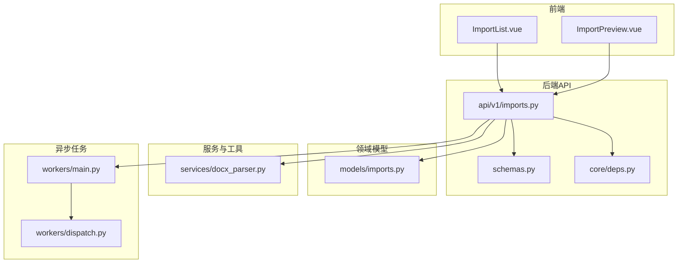
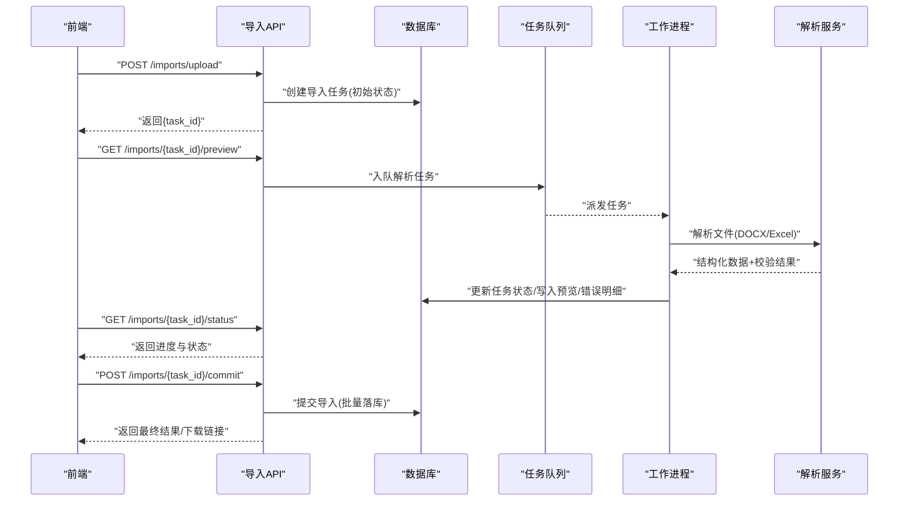
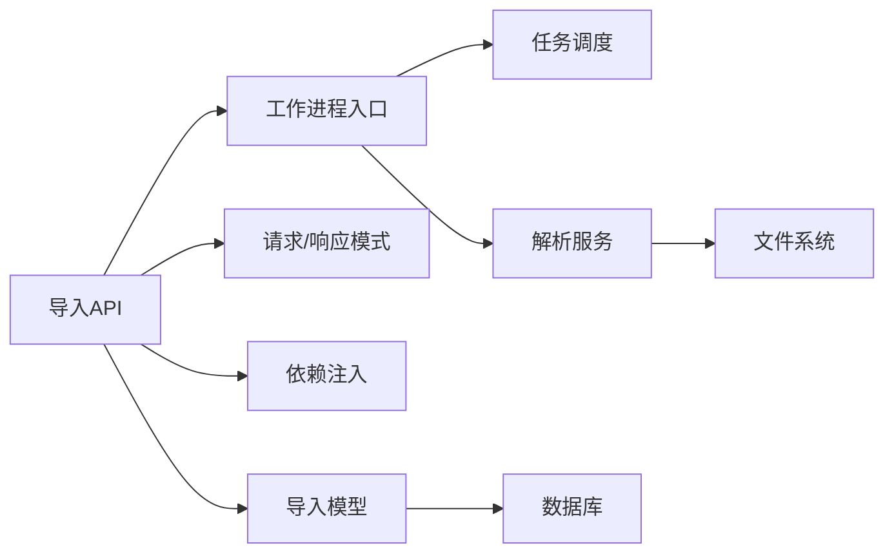
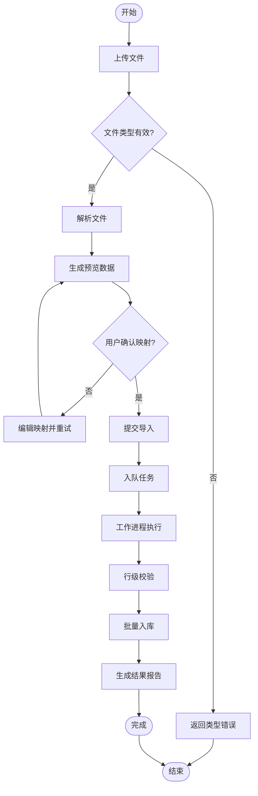
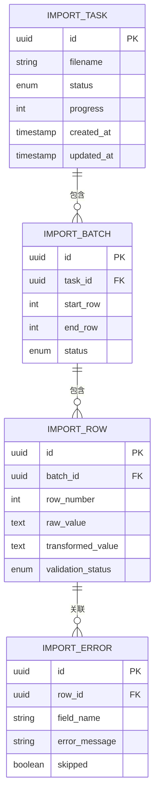

# 导入导出API

<cite>
**本文引用的文件**   
- [backend/app/api/v1/imports.py](file://backend/app/api/v1/imports.py)
- [backend/app/models/imports.py](file://backend/app/models/imports.py)
- [backend/app/services/docx_parser.py](file://backend/app/services/docx_parser.py)
- [backend/app/workers/main.py](file://backend/app/workers/main.py)
- [backend/app/workers/dispatch.py](file://backend/app/workers/dispatch.py)
- [backend/app/schemas.py](file://backend/app/schemas.py)
- [backend/app/core/deps.py](file://backend/app/core/deps.py)
- [frontend/src/views/ImportList.vue](file://frontend/src/views/ImportList.vue)
- [frontend/src/views/ImportPreview.vue](file://frontend/src/views/ImportPreview.vue)
</cite>

## 目录
1. [简介](#简介)
2. [项目结构](#项目结构)
3. [核心组件](#核心组件)
4. [架构总览](#架构总览)
5. [详细组件分析](#详细组件分析)
6. [依赖关系分析](#依赖关系分析)
7. [性能考虑](#性能考虑)
8. [故障排查指南](#故障排查指南)
9. [结论](#结论)
10. [附录](#附录)

## 简介
本文件为数据导入导出模块的完整API文档，覆盖文件上传、解析、验证、批量导入、任务状态跟踪与错误处理等能力。支持DOCX、Excel等常见文件格式，提供数据映射与转换的配置选项，并给出完整的文件处理流程与异常处理说明。前端页面包含导入列表与预览界面，便于用户操作与问题定位。

## 项目结构
导入导出相关代码主要位于后端API层、模型层、服务层与异步工作进程；前端通过视图组件调用API完成上传、预览与导入操作。

图表来源 
- [backend/app/api/v1/imports.py](file://backend/app/api/v1/imports.py)
- [backend/app/schemas.py](file://backend/app/schemas.py)
- [backend/app/core/deps.py](file://backend/app/core/deps.py)
- [backend/app/models/imports.py](file://backend/app/models/imports.py)
- [backend/app/services/docx_parser.py](file://backend/app/services/docx_parser.py)
- [backend/app/workers/main.py](file://backend/app/workers/main.py)
- [backend/app/workers/dispatch.py](file://backend/app/workers/dispatch.py)
- [frontend/src/views/ImportList.vue](file://frontend/src/views/ImportList.vue)
- [frontend/src/views/ImportPreview.vue](file://frontend/src/views/ImportPreview.vue)

章节来源
- [backend/app/api/v1/imports.py](file://backend/app/api/v1/imports.py)
- [backend/app/models/imports.py](file://backend/app/models/imports.py)
- [backend/app/services/docx_parser.py](file://backend/app/services/docx_parser.py)
- [backend/app/workers/main.py](file://backend/app/workers/main.py)
- [backend/app/workers/dispatch.py](file://backend/app/workers/dispatch.py)
- [backend/app/schemas.py](file://backend/app/schemas.py)
- [backend/app/core/deps.py](file://backend/app/core/deps.py)
- [frontend/src/views/ImportList.vue](file://frontend/src/views/ImportList.vue)
- [frontend/src/views/ImportPreview.vue](file://frontend/src/views/ImportPreview.vue)

## 核心组件
- 导入API接口：提供文件上传、预览、校验、提交导入、查询任务状态与结果下载等端点。
- 导入模型：持久化导入任务、批次、行级记录及错误信息。
- 解析服务：负责DOCX、Excel等格式的文件内容提取与结构化。
- 异步工作进程：接收导入任务，执行解析、校验、落库与结果生成。
- 请求与响应模式：统一的数据结构与校验规则定义。
- 依赖注入：数据库会话、配置、认证与安全策略等。

章节来源
- [backend/app/api/v1/imports.py](file://backend/app/api/v1/imports.py)
- [backend/app/models/imports.py](file://backend/app/models/imports.py)
- [backend/app/services/docx_parser.py](file://backend/app/services/docx_parser.py)
- [backend/app/workers/main.py](file://backend/app/workers/main.py)
- [backend/app/workers/dispatch.py](file://backend/app/workers/dispatch.py)
- [backend/app/schemas.py](file://backend/app/schemas/schemas.py)
- [backend/app/core/deps.py](file://backend/app/core/deps.py)

## 架构总览
导入导出采用“同步API + 异步任务”的架构：前端发起上传与预览请求，后端立即返回任务ID；实际解析、校验与落库由工作进程异步执行，前端轮询或长连接获取进度与结果。

图表来源 
- [backend/app/api/v1/imports.py](file://backend/app/api/v1/imports.py)
- [backend/app/workers/main.py](file://backend/app/workers/main.py)
- [backend/app/workers/dispatch.py](file://backend/app/workers/dispatch.py)
- [backend/app/services/docx_parser.py](file://backend/app/services/docx_parser.py)
- [backend/app/models/imports.py](file://backend/app/models/imports.py)

## 详细组件分析

### 导入API（文件上传、预览、提交、状态）
- 功能要点
  - 文件上传：支持多格式（DOCX、Excel），限制大小与类型，保存临时文件。
  - 预览：解析前N行数据，返回字段映射建议与校验错误摘要。
  - 提交导入：根据映射配置进行数据转换与批量入库。
  - 状态查询：返回任务阶段（待处理、解析中、校验中、入库中、已完成、失败）、进度百分比、错误统计。
  - 结果下载：导出成功/失败报告（CSV/Excel）。
- 关键参数与返回
  - 上传：multipart/form-data，字段包括文件、映射配置、是否仅预览等。
  - 预览：返回列名映射、样例数据、字段级错误提示。
  - 提交：返回任务ID与预计耗时。
  - 状态：包含当前阶段、已处理行数、错误数、详情URL。
- 错误处理
  - 文件非法（类型/大小/损坏）：返回明确错误码与修复建议。
  - 解析失败：返回失败原因与可重试标识。
  - 业务校验失败：逐行错误明细，支持下载错误报告。

章节来源
- [backend/app/api/v1/imports.py](file://backend/app/api/v1/imports.py)
- [backend/app/schemas.py](file://backend/app/schemas.py)

### 导入模型（任务、批次、行记录、错误）
- 实体关系
  - 导入任务：唯一ID、文件名、状态、进度、创建时间、更新时间。
  - 导入批次：关联任务，表示一次批次的处理范围。
  - 行记录：每条数据的原始值、转换后值、校验结果。
  - 错误明细：行号、字段、错误消息、是否跳过。
- 复杂度与索引
  - 以任务ID、批次ID建立索引，提升查询效率。
  - 行记录按任务分片存储，避免单表过大。

章节来源
- [backend/app/models/imports.py](file://backend/app/models/imports.py)

### 解析服务（DOCX、Excel）
- 功能要点
  - DOCX：提取表格/段落文本，识别标题与层级，构建结构化数据。
  - Excel：读取工作表、合并单元格、日期/数值类型转换。
  - 清洗：去除空白、统一编码、规范化字段名。
- 输出结构
  - 列名映射建议、样例数据、字段类型推断、缺失值标记。
- 异常处理
  - 文件损坏、密码保护、加密压缩、超大工作表等场景的错误分类与提示。

章节来源
- [backend/app/services/docx_parser.py](file://backend/app/services/docx_parser.py)

### 异步工作进程（任务调度与执行）
- 功能要点
  - 监听队列，拉取导入任务。
  - 顺序执行：解析→校验→预览写入→提交入库→结果归档。
  - 进度上报：每处理一定行数更新任务状态与进度。
- 容错与重试
  - 解析失败可重试次数上限，超过则标记失败并通知前端。
  - 部分失败：允许跳过错误行继续处理，最终生成差异报告。

章节来源
- [backend/app/workers/main.py](file://backend/app/workers/main.py)
- [backend/app/workers/dispatch.py](file://backend/app/workers/dispatch.py)

### 请求与响应模式（Schemas）
- 输入模式
  - 上传请求：文件、映射配置、预览开关、并发控制。
  - 提交导入：确认映射、去重策略、冲突处理（跳过/覆盖/报错）。
- 输出模式
  - 任务状态：阶段、进度、错误计数、详情链接。
  - 预览数据：样例行、字段类型、校验摘要。
  - 结果报告：成功/失败统计、下载链接。

章节来源
- [backend/app/schemas.py](file://backend/app/schemas.py)

### 依赖注入（数据库、配置、安全）
- 数据库会话：事务边界与回滚策略。
- 配置项：文件大小限制、支持的MIME类型、解析超时、队列参数。
- 安全：鉴权、权限校验、敏感字段脱敏。

章节来源
- [backend/app/core/deps.py](file://backend/app/core/deps.py)

### 前端集成（导入列表与预览）
- ImportList.vue
  - 展示导入任务列表、状态、进度条、操作按钮（预览、提交、下载报告）。
  - 轮询任务状态，实时更新UI。
- ImportPreview.vue
  - 展示预览数据、字段映射编辑、错误明细高亮。
  - 支持一键修正映射并提交导入。

章节来源
- [frontend/src/views/ImportList.vue](file://frontend/src/views/ImportList.vue)
- [frontend/src/views/ImportPreview.vue](file://frontend/src/views/ImportPreview.vue)

## 依赖关系分析
导入模块依赖关系如下：API层依赖模型、服务与依赖注入；工作进程依赖调度器与解析服务；前端依赖API与状态管理。

图表来源 
- [backend/app/api/v1/imports.py](file://backend/app/api/v1/imports.py)
- [backend/app/models/imports.py](file://backend/app/models/imports.py)
- [backend/app/schemas.py](file://backend/app/schemas.py)
- [backend/app/core/deps.py](file://backend/app/core/deps.py)
- [backend/app/workers/main.py](file://backend/app/workers/main.py)
- [backend/app/workers/dispatch.py](file://backend/app/workers/dispatch.py)
- [backend/app/services/docx_parser.py](file://backend/app/services/docx_parser.py)

章节来源
- [backend/app/api/v1/imports.py](file://backend/app/api/v1/imports.py)
- [backend/app/models/imports.py](file://backend/app/models/imports.py)
- [backend/app/schemas.py](file://backend/app/schemas.py)
- [backend/app/core/deps.py](file://backend/app/core/deps.py)
- [backend/app/workers/main.py](file://backend/app/workers/main.py)
- [backend/app/workers/dispatch.py](file://backend/app/workers/dispatch.py)
- [backend/app/services/docx_parser.py](file://backend/app/services/docx_parser.py)

## 性能考虑
- 大文件处理
  - 流式解析与分页读取，避免一次性加载到内存。
  - 设置合理的最大行数与工作表数量限制。
- 并发与限流
  - 限制同时处理的导入任务数，防止资源争用。
  - 对解析与入库阶段设置超时与重试上限。
- 缓存与复用
  - 字段映射建议缓存，减少重复解析成本。
  - 预览数据缓存短时效，提高刷新体验。
- 存储优化
  - 行记录分表或分区，定期归档历史任务。
  - 错误报告增量生成，避免全量重写。

[本节为通用指导，不直接分析具体文件]

## 故障排查指南
- 常见问题
  - 文件无法解析：检查文件格式、编码、是否加密或受保护。
  - 预览为空：确认工作表名称、表格区域选择是否正确。
  - 校验失败率高：核对字段映射、数据类型与必填规则。
  - 任务卡住：检查工作进程是否运行、队列是否堆积、数据库连接是否正常。
- 定位方法
  - 查看任务状态与进度，关注最近一次失败的阶段。
  - 下载错误报告，定位具体行与字段错误。
  - 检查日志中的解析异常与重试次数。
- 恢复策略
  - 修正映射后重新提交导入，启用“跳过错误行”继续处理。
  - 调整文件大小或行数限制，分批导入。

章节来源
- [backend/app/api/v1/imports.py](file://backend/app/api/v1/imports.py)
- [backend/app/workers/main.py](file://backend/app/workers/main.py)
- [backend/app/workers/dispatch.py](file://backend/app/workers/dispatch.py)
- [backend/app/services/docx_parser.py](file://backend/app/services/docx_parser.py)

## 结论
导入导出模块通过清晰的API设计、稳健的异步处理与完善的错误机制，提供了稳定高效的批量数据处理能力。结合前端可视化操作，用户可以轻松完成从上传、预览、映射到提交的完整流程。建议在大规模数据场景下关注性能与稳定性优化，确保系统在高负载下的可靠性。

[本节为总结性内容，不直接分析具体文件]

## 附录

### 文件处理流程图

图表来源 
- [backend/app/api/v1/imports.py](file://backend/app/api/v1/imports.py)
- [backend/app/workers/main.py](file://backend/app/workers/main.py)
- [backend/app/workers/dispatch.py](file://backend/app/workers/dispatch.py)
- [backend/app/services/docx_parser.py](file://backend/app/services/docx_parser.py)
- [backend/app/models/imports.py](file://backend/app/models/imports.py)

### 数据模型关系图

图表来源 
- [backend/app/models/imports.py](file://backend/app/models/imports.py)