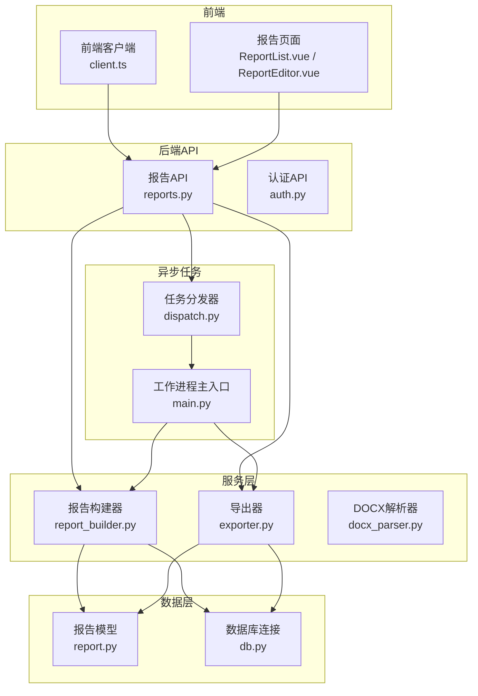
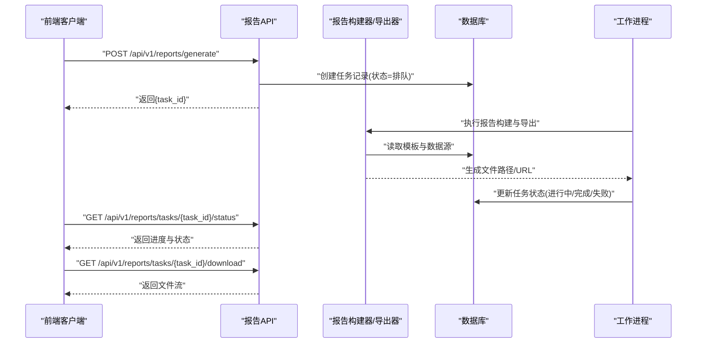
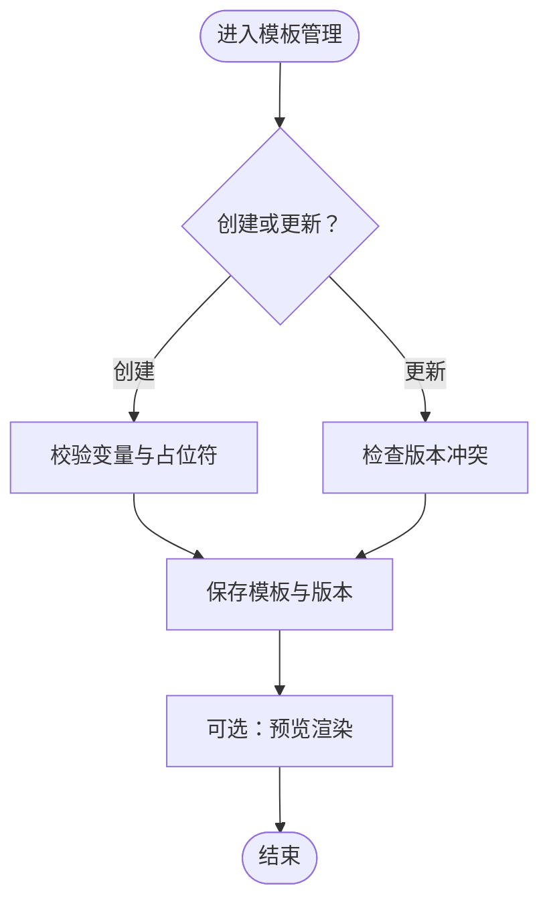
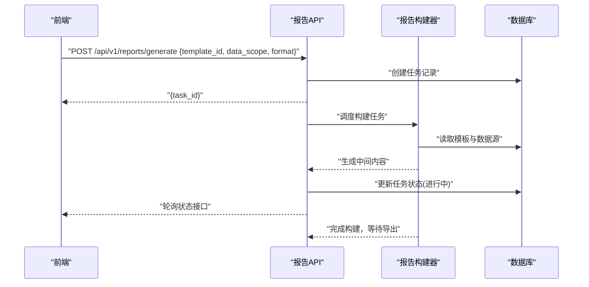
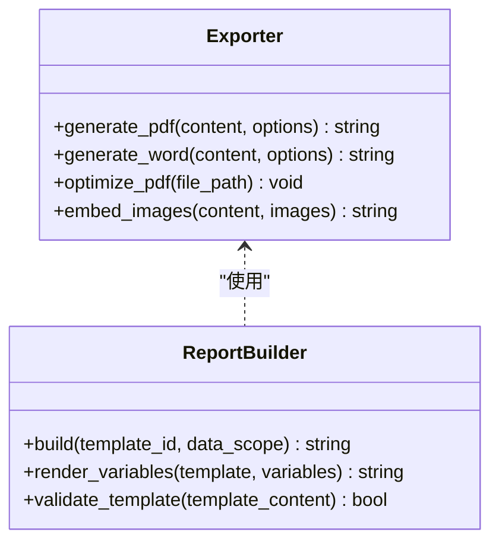
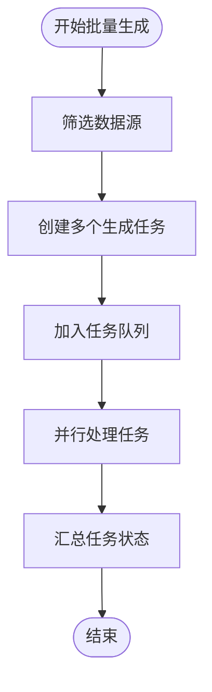
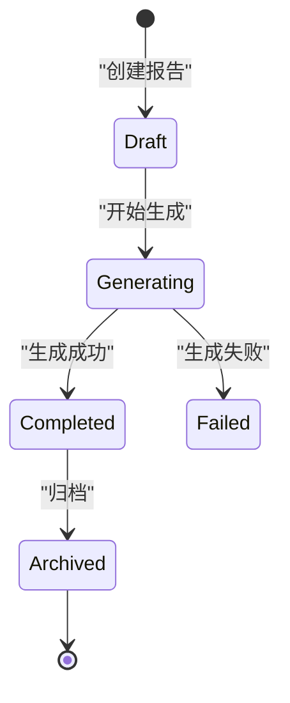
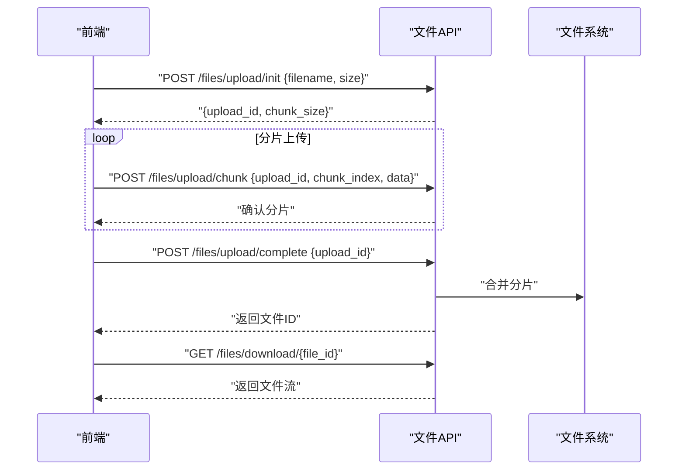
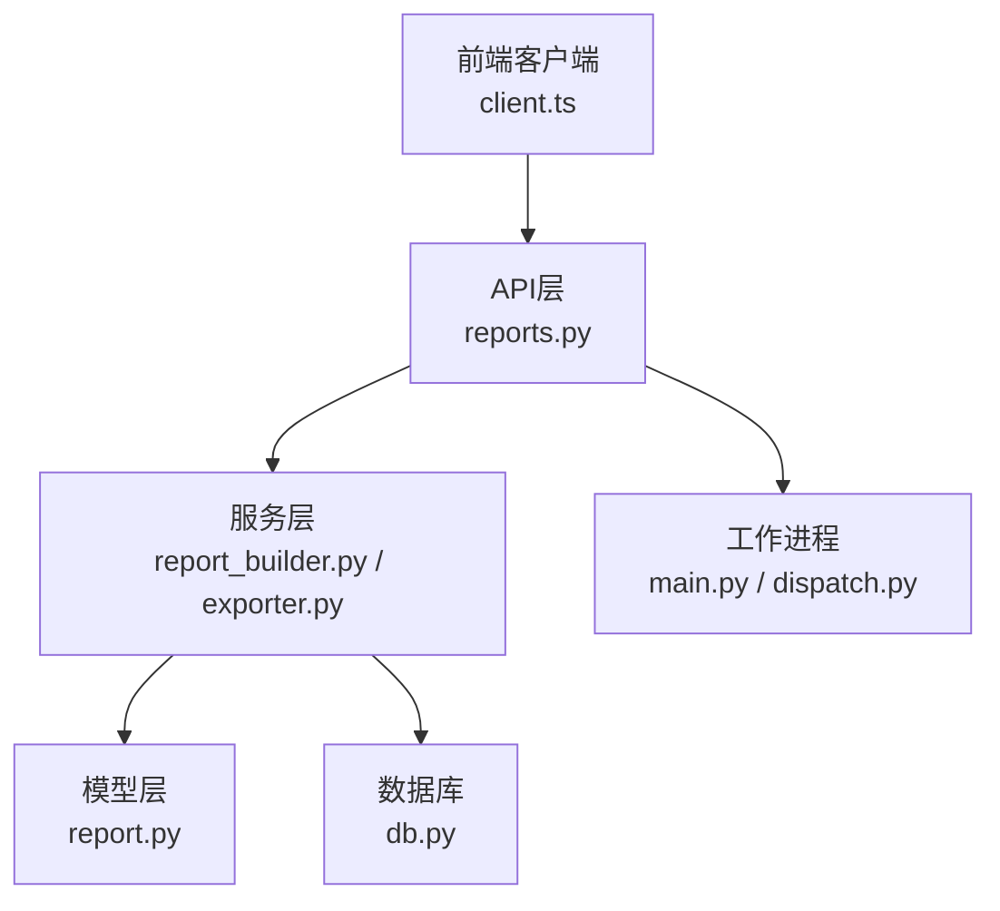

# 报告生成API

<cite>
**本文档引用的文件**
- [backend/app/api/v1/reports.py](file://backend/app/api/v1/reports.py)
- [backend/app/services/report_builder.py](file://backend/app/services/report_builder.py)
- [backend/app/services/exporter.py](file://backend/app/services/exporter.py)
- [backend/app/models/report.py](file://backend/app/models/report.py)
- [backend/app/schemas.py](file://backend/app/schemas.py)
- [backend/app/workers/main.py](file://backend/app/workers/main.py)
- [backend/app/workers/dispatch.py](file://backend/app/workers/dispatch.py)
- [backend/app/db.py](file://backend/app/db.py)
- [frontend/src/api/client.ts](file://frontend/src/api/client.ts)
</cite>

## 目录
1. [简介](#简介)
2. [项目结构](#项目结构)
3. [核心组件](#核心组件)
4. [架构总览](#架构总览)
5. [详细组件分析](#详细组件分析)
6. [依赖关系分析](#依赖关系分析)
7. [性能考虑](#性能考虑)
8. [故障排查指南](#故障排查指南)
9. [结论](#结论)
10. [附录：API参考](#附录api参考)

## 简介
本文件为“报告生成模块”的完整API文档，覆盖以下能力：
- 模板管理：创建、更新、删除、查询报告模板，支持富文本与变量占位。
- 内容生成：基于模板与数据源（资产、漏洞、测试计划等）生成报告内容。
- 格式转换与导出：支持PDF、Word等格式的导出，提供下载接口。
- 定制化和批量生成：支持按条件批量生成报告，支持模板变量替换与样式定制。
- 版本管理与历史查询：报告版本化存储，支持历史版本查看与回滚。
- 文件上传/下载与进度跟踪：支持大文件分片上传、断点续传、任务进度查询与回调。

该模块采用前后端分离架构，后端使用FastAPI暴露REST API，异步任务通过工作进程处理耗时操作（如报告生成与导出），前端通过TypeScript客户端调用API并展示进度。

## 项目结构
报告相关代码主要分布在后端API层、服务层、模型层、工作进程以及前端客户端中：
- API层：定义HTTP路由与请求校验，协调业务服务。
- 服务层：实现报告构建、导出、模板管理等核心逻辑。
- 模型层：定义数据库实体（报告、模板、版本等）。
- 工作进程：异步执行报告生成与导出任务，提供进度查询。
- 前端客户端：封装API调用，处理上传下载与进度展示。

**图表来源**
- [backend/app/api/v1/reports.py](file://backend/app/api/v1/reports.py)
- [backend/app/services/report_builder.py](file://backend/app/services/report_builder.py)
- [backend/app/services/exporter.py](file://backend/app/services/exporter.py)
- [backend/app/models/report.py](file://backend/app/models/report.py)
- [backend/app/workers/main.py](file://backend/app/workers/main.py)
- [backend/app/workers/dispatch.py](file://backend/app/workers/dispatch.py)
- [backend/app/db.py](file://backend/app/db.py)
- [frontend/src/api/client.ts](file://frontend/src/api/client.ts)

**章节来源**
- [backend/app/api/v1/reports.py](file://backend/app/api/v1/reports.py)
- [backend/app/services/report_builder.py](file://backend/app/services/report_builder.py)
- [backend/app/services/exporter.py](file://backend/app/services/exporter.py)
- [backend/app/models/report.py](file://backend/app/models/report.py)
- [backend/app/workers/main.py](file://backend/app/workers/main.py)
- [backend/app/workers/dispatch.py](file://backend/app/workers/dispatch.py)
- [backend/app/db.py](file://backend/app/db.py)
- [frontend/src/api/client.ts](file://frontend/src/api/client.ts)

## 核心组件
- 报告模板管理：提供模板CRUD、预览、变量提取与校验。
- 报告内容生成：根据模板与数据源渲染报告内容，支持富文本与图表。
- 导出与格式转换：将渲染结果转换为PDF或Word，支持分页、页眉页脚、样式定制。
- 版本管理：每次生成新版本，保留历史版本，支持切换与回滚。
- 批量生成：按筛选条件批量触发生成任务，支持并发控制与进度汇总。
- 文件上传下载：支持分片上传、断点续传、下载流式传输与进度回调。

**章节来源**
- [backend/app/api/v1/reports.py](file://backend/app/api/v1/reports.py)
- [backend/app/services/report_builder.py](file://backend/app/services/report_builder.py)
- [backend/app/services/exporter.py](file://backend/app/services/exporter.py)
- [backend/app/models/report.py](file://backend/app/models/report.py)

## 架构总览
报告生成流程涉及API路由、服务层、数据层与异步工作进程。典型调用链如下：
- 前端发起报告生成请求（含模板ID、数据范围、导出格式）。
- API层校验参数并创建任务，返回任务ID。
- 工作进程接收任务，调用报告构建器与导出器完成生成。
- 生成完成后，前端轮询任务状态与进度，最终下载文件。

**图表来源**
- [backend/app/api/v1/reports.py](file://backend/app/api/v1/reports.py)
- [backend/app/services/report_builder.py](file://backend/app/services/report_builder.py)
- [backend/app/services/exporter.py](file://backend/app/services/exporter.py)
- [backend/app/models/report.py](file://backend/app/models/report.py)
- [backend/app/workers/main.py](file://backend/app/workers/main.py)
- [backend/app/workers/dispatch.py](file://backend/app/workers/dispatch.py)

## 详细组件分析

### 模板管理（Template Management）
- 功能要点：
  - 模板CRUD：创建、更新、删除、查询模板列表与详情。
  - 模板预览：渲染模板变量与占位符，输出HTML预览。
  - 变量提取：自动扫描模板中的变量，返回变量清单用于表单校验。
  - 模板版本：模板变更时自动生成新版本，支持回滚到指定版本。
- 关键接口：
  - 创建模板：POST /api/v1/reports/templates
  - 更新模板：PUT /api/v1/reports/templates/{template_id}
  - 删除模板：DELETE /api/v1/reports/templates/{template_id}
  - 获取模板列表：GET /api/v1/reports/templates
  - 获取模板详情：GET /api/v1/reports/templates/{template_id}
  - 模板预览：POST /api/v1/reports/templates/{template_id}/preview
  - 模板变量提取：GET /api/v1/reports/templates/{template_id}/variables
  - 模板版本列表：GET /api/v1/reports/templates/{template_id}/versions
  - 切换模板版本：POST /api/v1/reports/templates/{template_id}/versions/{version}/activate
- 错误处理：
  - 模板不存在、权限不足、变量缺失、渲染失败等错误码与消息。
- 数据模型：
  - 模板实体包含名称、描述、内容、变量清单、版本信息、创建时间等字段。

**图表来源**
- [backend/app/api/v1/reports.py](file://backend/app/api/v1/reports.py)
- [backend/app/services/report_builder.py](file://backend/app/services/report_builder.py)
- [backend/app/models/report.py](file://backend/app/models/report.py)

**章节来源**
- [backend/app/api/v1/reports.py](file://backend/app/api/v1/reports.py)
- [backend/app/services/report_builder.py](file://backend/app/services/report_builder.py)
- [backend/app/models/report.py](file://backend/app/models/report.py)

### 内容生成（Content Generation）
- 功能要点：
  - 基于模板与数据源（资产、漏洞、测试计划）生成报告内容。
  - 支持富文本渲染、图表插入、分页与样式定制。
  - 支持变量替换与条件渲染。
- 关键接口：
  - 生成报告：POST /api/v1/reports/generate
  - 查询生成任务状态：GET /api/v1/reports/tasks/{task_id}/status
  - 取消生成任务：POST /api/v1/reports/tasks/{task_id}/cancel
- 数据处理：
  - 数据源聚合、去重、排序、过滤。
  - 渲染引擎将数据注入模板，生成中间表示（HTML/Markdown）。
- 错误处理：
  - 数据源缺失、渲染失败、内存不足、超时等异常。

**图表来源**
- [backend/app/api/v1/reports.py](file://backend/app/api/v1/reports.py)
- [backend/app/services/report_builder.py](file://backend/app/services/report_builder.py)
- [backend/app/models/report.py](file://backend/app/models/report.py)

**章节来源**
- [backend/app/api/v1/reports.py](file://backend/app/api/v1/reports.py)
- [backend/app/services/report_builder.py](file://backend/app/services/report_builder.py)
- [backend/app/models/report.py](file://backend/app/models/report.py)

### 格式转换与导出（Format Conversion & Export）
- 功能要点：
  - 将中间内容转换为PDF或Word格式。
  - 支持分页、页眉页脚、样式表、图片嵌入。
  - 导出完成后提供下载链接或流式响应。
- 关键接口：
  - 导出报告：POST /api/v1/reports/tasks/{task_id}/export
  - 下载报告：GET /api/v1/reports/tasks/{task_id}/download
- 导出策略：
  - PDF：使用渲染引擎生成PDF，优化字体与图片压缩。
  - Word：生成DOCX，支持表格、列表、图片与样式。
- 错误处理：
  - 渲染失败、资源不足、文件格式不支持等。

**图表来源**
- [backend/app/services/exporter.py](file://backend/app/services/exporter.py)
- [backend/app/services/report_builder.py](file://backend/app/services/report_builder.py)

**章节来源**
- [backend/app/api/v1/reports.py](file://backend/app/api/v1/reports.py)
- [backend/app/services/exporter.py](file://backend/app/services/exporter.py)
- [backend/app/services/report_builder.py](file://backend/app/services/report_builder.py)

### 定制化与批量生成（Customization & Batch Generation）
- 功能要点：
  - 定制化：支持模板变量映射、样式主题切换、章节顺序调整。
  - 批量生成：按条件筛选数据源，批量触发生成任务，支持并发限制。
- 关键接口：
  - 批量生成：POST /api/v1/reports/batch-generate
  - 批量任务状态：GET /api/v1/reports/batch-tasks/{batch_id}/status
  - 定制化配置：POST /api/v1/reports/customize
- 并发控制：
  - 队列长度限制、任务优先级、重试机制。
- 错误处理：
  - 部分任务失败、资源不足、队列溢出等。

**图表来源**
- [backend/app/api/v1/reports.py](file://backend/app/api/v1/reports.py)
- [backend/app/workers/dispatch.py](file://backend/app/workers/dispatch.py)
- [backend/app/workers/main.py](file://backend/app/workers/main.py)

**章节来源**
- [backend/app/api/v1/reports.py](file://backend/app/api/v1/reports.py)
- [backend/app/workers/dispatch.py](file://backend/app/workers/dispatch.py)
- [backend/app/workers/main.py](file://backend/app/workers/main.py)

### 版本管理与历史查询（Versioning & History）
- 功能要点：
  - 每次生成报告创建新版本，保留历史版本。
  - 支持版本列表、详情查看、切换默认版本、回滚。
- 关键接口：
  - 版本列表：GET /api/v1/reports/{report_id}/versions
  - 版本详情：GET /api/v1/reports/{report_id}/versions/{version}
  - 切换默认版本：POST /api/v1/reports/{report_id}/versions/{version}/activate
  - 回滚到历史版本：POST /api/v1/reports/{report_id}/rollback/{version}
- 数据模型：
  - 报告实体包含版本号、创建时间、状态、文件路径等。

**图表来源**
- [backend/app/models/report.py](file://backend/app/models/report.py)
- [backend/app/api/v1/reports.py](file://backend/app/api/v1/reports.py)

**章节来源**
- [backend/app/models/report.py](file://backend/app/models/report.py)
- [backend/app/api/v1/reports.py](file://backend/app/api/v1/reports.py)

### 文件上传下载与进度跟踪（Upload/Download & Progress Tracking）
- 功能要点：
  - 分片上传：支持大文件分片、断点续传、并发上传。
  - 进度跟踪：实时查询上传/生成/导出任务的进度。
  - 下载支持：流式下载、分块下载、进度回调。
- 关键接口：
  - 初始化上传：POST /api/v1/files/upload/init
  - 上传分片：POST /api/v1/files/upload/chunk
  - 合并分片：POST /api/v1/files/upload/complete
  - 查询进度：GET /api/v1/tasks/{task_id}/progress
  - 下载文件：GET /api/v1/files/download/{file_id}
- 错误处理：
  - 分片丢失、网络中断、磁盘空间不足等。

**图表来源**
- [backend/app/api/v1/reports.py](file://backend/app/api/v1/reports.py)
- [backend/app/workers/main.py](file://backend/app/workers/main.py)

**章节来源**
- [backend/app/api/v1/reports.py](file://backend/app/api/v1/reports.py)
- [backend/app/workers/main.py](file://backend/app/workers/main.py)

## 依赖关系分析
- API层依赖服务层进行业务处理，服务层依赖数据层进行持久化。
- 工作进程独立于API层，通过任务队列接收任务并执行。
- 前端客户端依赖API层提供的REST接口，处理上传下载与进度展示。

**图表来源**
- [backend/app/api/v1/reports.py](file://backend/app/api/v1/reports.py)
- [backend/app/services/report_builder.py](file://backend/app/services/report_builder.py)
- [backend/app/services/exporter.py](file://backend/app/services/exporter.py)
- [backend/app/models/report.py](file://backend/app/models/report.py)
- [backend/app/workers/main.py](file://backend/app/workers/main.py)
- [backend/app/workers/dispatch.py](file://backend/app/workers/dispatch.py)
- [backend/app/db.py](file://backend/app/db.py)
- [frontend/src/api/client.ts](file://frontend/src/api/client.ts)

**章节来源**
- [backend/app/api/v1/reports.py](file://backend/app/api/v1/reports.py)
- [backend/app/services/report_builder.py](file://backend/app/services/report_builder.py)
- [backend/app/services/exporter.py](file://backend/app/services/exporter.py)
- [backend/app/models/report.py](file://backend/app/models/report.py)
- [backend/app/workers/main.py](file://backend/app/workers/main.py)
- [backend/app/workers/dispatch.py](file://backend/app/workers/dispatch.py)
- [backend/app/db.py](file://backend/app/db.py)
- [frontend/src/api/client.ts](file://frontend/src/api/client.ts)

## 性能考虑
- 异步任务：报告生成与导出使用异步工作进程，避免阻塞API线程。
- 并发控制：限制并发任务数量，防止资源耗尽。
- 缓存策略：对模板与常用数据源进行缓存，减少重复计算。
- 文件处理：使用流式处理与分片上传，降低内存占用。
- 数据库优化：索引查询字段，分页加载大数据集。

[本节为通用指导，不直接分析具体文件]

## 故障排查指南
- 常见问题：
  - 模板变量缺失：检查模板变量清单与数据源字段是否匹配。
  - 渲染失败：检查模板语法与数据格式，查看日志输出。
  - 导出失败：检查系统依赖（如PDF/Word库）是否安装正确。
  - 上传中断：检查网络稳定性与分片完整性。
- 调试建议：
  - 启用详细日志，记录任务状态与错误堆栈。
  - 使用任务ID追踪整个生命周期。
  - 验证模板预览功能，确保变量替换正常。

**章节来源**
- [backend/app/api/v1/reports.py](file://backend/app/api/v1/reports.py)
- [backend/app/workers/main.py](file://backend/app/workers/main.py)

## 结论
报告生成模块提供了完整的模板管理、内容生成、格式转换、版本管理与文件处理能力。通过异步工作进程与流式处理，确保了高并发与大文件场景下的稳定性与性能。前端客户端提供了友好的交互体验，支持进度跟踪与错误提示。

[本节为总结性内容，不直接分析具体文件]

## 附录：API参考
- 模板管理：
  - POST /api/v1/reports/templates
  - PUT /api/v1/reports/templates/{template_id}
  - DELETE /api/v1/reports/templates/{template_id}
  - GET /api/v1/reports/templates
  - GET /api/v1/reports/templates/{template_id}
  - POST /api/v1/reports/templates/{template_id}/preview
  - GET /api/v1/reports/templates/{template_id}/variables
  - GET /api/v1/reports/templates/{template_id}/versions
  - POST /api/v1/reports/templates/{template_id}/versions/{version}/activate
- 报告生成：
  - POST /api/v1/reports/generate
  - GET /api/v1/reports/tasks/{task_id}/status
  - POST /api/v1/reports/tasks/{task_id}/cancel
- 导出与下载：
  - POST /api/v1/reports/tasks/{task_id}/export
  - GET /api/v1/reports/tasks/{task_id}/download
- 批量生成：
  - POST /api/v1/reports/batch-generate
  - GET /api/v1/reports/batch-tasks/{batch_id}/status
- 版本管理：
  - GET /api/v1/reports/{report_id}/versions
  - GET /api/v1/reports/{report_id}/versions/{version}
  - POST /api/v1/reports/{report_id}/versions/{version}/activate
  - POST /api/v1/reports/{report_id}/rollback/{version}
- 文件上传下载：
  - POST /api/v1/files/upload/init
  - POST /api/v1/files/upload/chunk
  - POST /api/v1/files/upload/complete
  - GET /api/v1/tasks/{task_id}/progress
  - GET /api/v1/files/download/{file_id}

**章节来源**
- [backend/app/api/v1/reports.py](file://backend/app/api/v1/reports.py)
- [frontend/src/api/client.ts](file://frontend/src/api/client.ts)