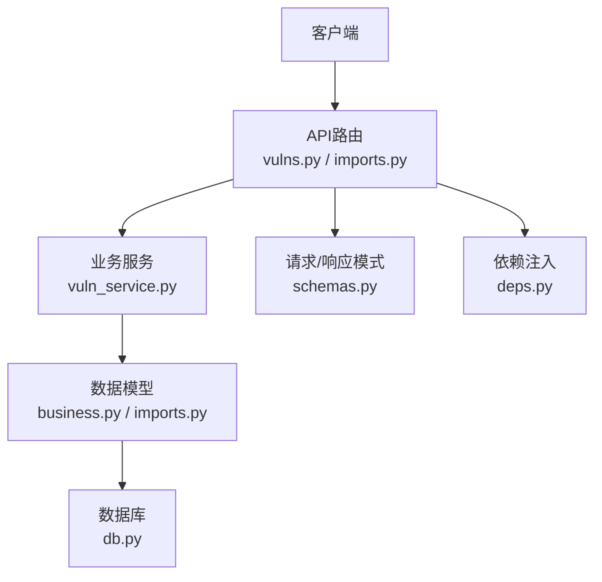
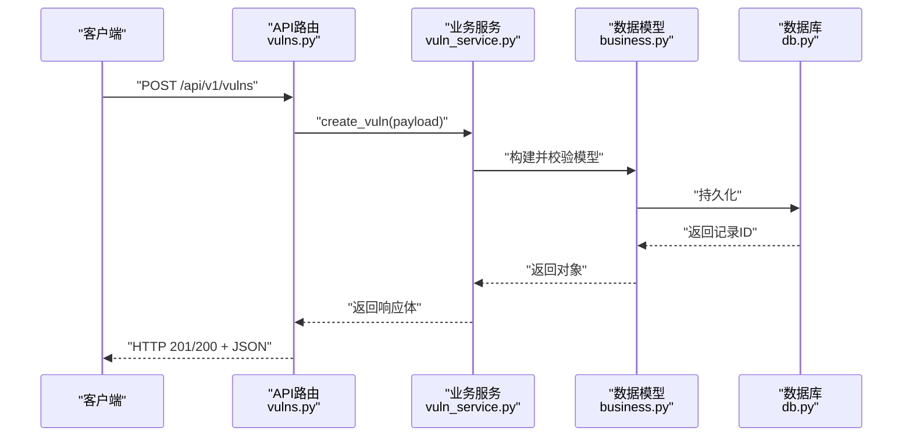
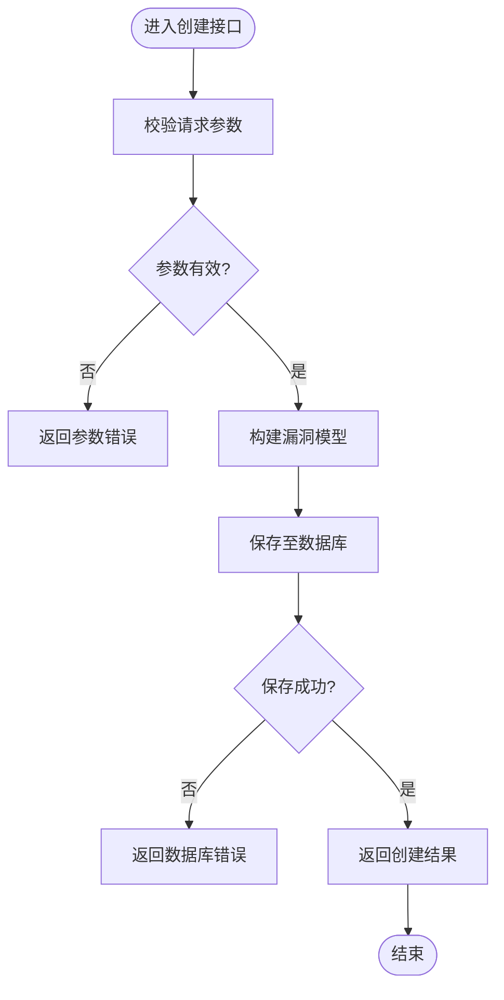
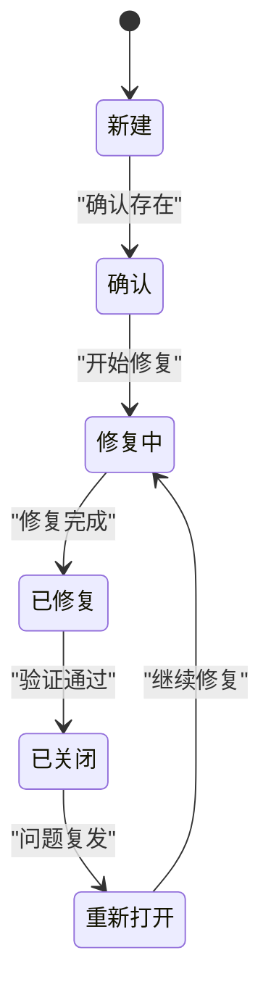
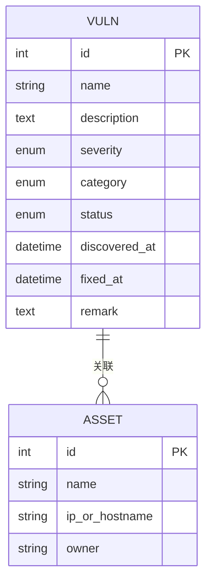
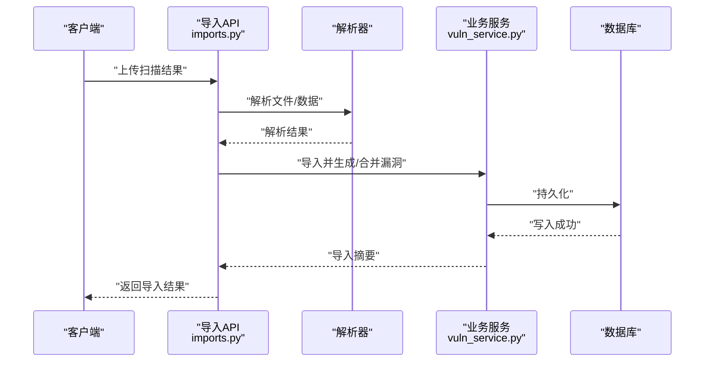
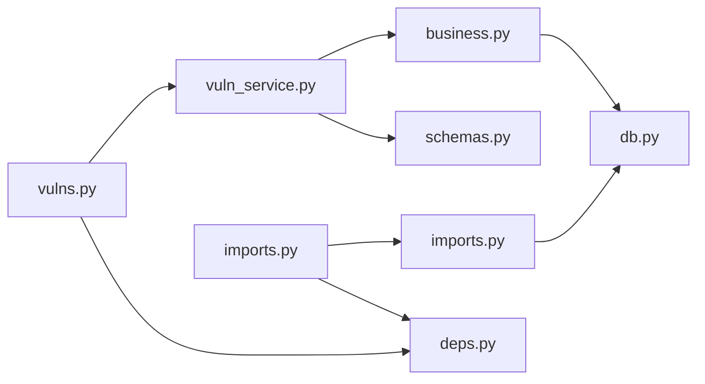

# 漏洞管理API

<cite>
**本文档引用的文件**   
- [backend/app/api/v1/vulns.py](file://backend/app/api/v1/vulns.py)
- [backend/app/services/vuln_service.py](file://backend/app/services/vuln_service.py)
- [backend/app/models/business.py](file://backend/app/models/business.py)
- [backend/app/schemas.py](file://backend/app/schemas.py)
- [backend/app/api/v1/imports.py](file://backend/app/api/v1/imports.py)
- [backend/app/models/imports.py](file://backend/app/models/imports.py)
- [backend/app/core/deps.py](file://backend/app/core/deps.py)
- [backend/app/db.py](file://backend/app/db.py)
- [backend/app/main.py](file://backend/app/main.py)
</cite>

## 目录
1. [简介](#简介)
2. [项目结构](#项目结构)
3. [核心组件](#核心组件)
4. [架构总览](#架构总览)
5. [详细组件分析](#详细组件分析)
6. [依赖关系分析](#依赖关系分析)
7. [性能考虑](#性能考虑)
8. [故障排查指南](#故障排查指南)
9. [结论](#结论)
10. [附录](#附录)

## 简介
本文件为“漏洞管理模块”的完整API文档，覆盖漏洞的创建、编辑、查询、删除等核心操作，以及漏洞分类、严重级别、状态管理等能力。同时文档化漏洞与资产的关联关系与管理方式，并提供漏洞扫描结果导入与处理的相关接口。文档包含请求参数说明、响应格式示例及常见错误处理建议，帮助前后端开发者快速集成与排障。

## 项目结构
后端采用分层架构：路由层（API）→ 服务层（业务逻辑）→ 数据模型（ORM）→ 数据库。漏洞管理相关代码主要分布在以下位置：
- API路由：backend/app/api/v1/vulns.py
- 业务服务：backend/app/services/vuln_service.py
- 数据模型：backend/app/models/business.py
- 请求/响应模式定义：backend/app/schemas.py
- 导入相关API与模型：backend/app/api/v1/imports.py、backend/app/models/imports.py
- 依赖注入与数据库会话：backend/app/core/deps.py、backend/app/db.py
- 应用入口与路由注册：backend/app/main.py

**图示来源** 
- [backend/app/api/v1/vulns.py](file://backend/app/api/v1/vulns.py)
- [backend/app/services/vuln_service.py](file://backend/app/services/vuln_service.py)
- [backend/app/models/business.py](file://backend/app/models/business.py)
- [backend/app/schemas.py](file://backend/app/schemas.py)
- [backend/app/api/v1/imports.py](file://backend/app/api/v1/imports.py)
- [backend/app/models/imports.py](file://backend/app/models/imports.py)
- [backend/app/core/deps.py](file://backend/app/core/deps.py)
- [backend/app/db.py](file://backend/app/db.py)

**章节来源**
- [backend/app/main.py](file://backend/app/main.py)
- [backend/app/api/v1/vulns.py](file://backend/app/api/v1/vulns.py)
- [backend/app/services/vuln_service.py](file://backend/app/services/vuln_service.py)
- [backend/app/models/business.py](file://backend/app/models/business.py)
- [backend/app/schemas.py](file://backend/app/schemas.py)
- [backend/app/api/v1/imports.py](file://backend/app/api/v1/imports.py)
- [backend/app/models/imports.py](file://backend/app/models/imports.py)
- [backend/app/core/deps.py](file://backend/app/core/deps.py)
- [backend/app/db.py](file://backend/app/db.py)

## 核心组件
- 漏洞实体与字段
  - 标识与基础信息：名称、描述、发现时间、修复时间、备注等
  - 分类与严重级别：分类枚举、严重级别枚举
  - 状态管理：新建、确认、修复中、已修复、已关闭、重新打开等
  - 资产关联：多对一或多对多关联到资产
  - 扫描来源：记录扫描任务或报告来源
- 服务层能力
  - 创建/更新/删除漏洞
  - 按条件查询与分页
  - 批量导入扫描结果并生成/合并漏洞条目
  - 状态流转校验与审计字段维护
- 数据模型
  - 使用ORM映射数据库表，定义约束、索引与关系
- 请求/响应模式
  - 统一的输入输出Schema，确保字段校验与类型安全

**章节来源**
- [backend/app/models/business.py](file://backend/app/models/business.py)
- [backend/app/schemas.py](file://backend/app/schemas.py)
- [backend/app/services/vuln_service.py](file://backend/app/services/vuln_service.py)

## 架构总览
漏洞管理的调用链路遵循“路由→服务→模型→数据库”的标准流程，导入功能通过独立的导入API触发异步或同步处理，最终落库并返回统一响应。

**图示来源** 
- [backend/app/api/v1/vulns.py](file://backend/app/api/v1/vulns.py)
- [backend/app/services/vuln_service.py](file://backend/app/services/vuln_service.py)
- [backend/app/models/business.py](file://backend/app/models/business.py)
- [backend/app/db.py](file://backend/app/db.py)

## 详细组件分析

### 漏洞CRUD接口
- 创建漏洞
  - 方法：POST
  - 路径：/api/v1/vulns
  - 请求体字段（来自Schema）：名称、描述、严重级别、分类、状态、资产ID列表、发现时间、修复时间、备注、扫描来源等
  - 成功响应：返回创建的漏洞对象（含ID、时间戳等）
  - 失败响应：参数校验错误、资产不存在、权限不足等
- 更新漏洞
  - 方法：PUT/PATCH
  - 路径：/api/v1/vulns/{id}
  - 请求体字段：可更新的字段集合（如状态、严重级别、分类、资产关联、修复信息等）
  - 成功响应：返回更新后的漏洞对象
  - 失败响应：资源不存在、非法状态流转、资产关联冲突等
- 查询漏洞
  - 方法：GET
  - 路径：/api/v1/vulns
  - 查询参数：分页（page、size）、排序（sort）、过滤（severity、category、status、asset_id、keyword等）
  - 成功响应：分页结果（items、total、page、size）
  - 失败响应：参数校验错误
- 删除漏洞
  - 方法：DELETE
  - 路径：/api/v1/vulns/{id}
  - 成功响应：删除确认
  - 失败响应：资源不存在、权限不足

**图示来源** 
- [backend/app/api/v1/vulns.py](file://backend/app/api/v1/vulns.py)
- [backend/app/services/vuln_service.py](file://backend/app/services/vuln_service.py)
- [backend/app/schemas.py](file://backend/app/schemas.py)

**章节来源**
- [backend/app/api/v1/vulns.py](file://backend/app/api/v1/vulns.py)
- [backend/app/services/vuln_service.py](file://backend/app/services/vuln_service.py)
- [backend/app/schemas.py](file://backend/app/schemas.py)

### 漏洞分类、严重级别与状态管理
- 分类（Category）
  - 用于对漏洞进行归类，例如：Web、系统、网络、应用等
  - 支持在创建/更新时指定分类
- 严重级别（Severity）
  - 通常包括：低、中、高、危急等
  - 影响告警策略与报表统计
- 状态（Status）
  - 典型状态机：新建 → 确认 → 修复中 → 已修复 → 已关闭；允许重新打开
  - 状态变更需符合规则，避免非法跳转

**图示来源** 
- [backend/app/models/business.py](file://backend/app/models/business.py)
- [backend/app/schemas.py](file://backend/app/schemas.py)

**章节来源**
- [backend/app/models/business.py](file://backend/app/models/business.py)
- [backend/app/schemas.py](file://backend/app/schemas.py)

### 漏洞与资产的关联关系
- 关联方式
  - 漏洞与资产通常为多对多或一对多关系，支持在创建/更新时批量绑定资产
- 管理方式
  - 新增资产：将资产ID加入关联列表
  - 移除资产：从关联列表中剔除
  - 查询过滤：可按资产ID筛选漏洞
- 约束与一致性
  - 资产必须存在且属于当前租户/组织
  - 关联变更需记录审计信息（可选）

**图示来源** 
- [backend/app/models/business.py](file://backend/app/models/business.py)

**章节来源**
- [backend/app/models/business.py](file://backend/app/models/business.py)

### 漏洞扫描结果导入与处理
- 导入接口
  - 方法：POST
  - 路径：/api/v1/imports/vuln-scan
  - 请求体：扫描结果文件（JSON/YAML/XML等）或结构化数据
  - 处理逻辑：解析扫描结果 → 去重与匹配 → 生成/合并漏洞条目 → 更新资产关联 → 返回导入摘要
- 导入结果
  - 成功：返回导入数量、新增/更新计数、失败明细
  - 失败：返回解析错误、数据不一致、权限限制等

**图示来源** 
- [backend/app/api/v1/imports.py](file://backend/app/api/v1/imports.py)
- [backend/app/models/imports.py](file://backend/app/models/imports.py)
- [backend/app/services/vuln_service.py](file://backend/app/services/vuln_service.py)

**章节来源**
- [backend/app/api/v1/imports.py](file://backend/app/api/v1/imports.py)
- [backend/app/models/imports.py](file://backend/app/models/imports.py)
- [backend/app/services/vuln_service.py](file://backend/app/services/vuln_service.py)

### 请求与响应规范
- 通用请求头
  - Content-Type：application/json（或multipart/form-data用于文件上传）
  - Authorization：Bearer Token（如需鉴权）
- 通用响应结构
  - 成功：{ code, message, data }
  - 失败：{ code, message, errors? }
- 分页响应
  - items：数组
  - total：总数
  - page：页码
  - size：每页大小

**章节来源**
- [backend/app/schemas.py](file://backend/app/schemas.py)

## 依赖关系分析
- 路由层依赖服务层进行业务编排
- 服务层依赖数据模型进行数据访问
- 依赖注入提供数据库会话与配置
- 导入模块依赖解析器与业务服务

**图示来源** 
- [backend/app/api/v1/vulns.py](file://backend/app/api/v1/vulns.py)
- [backend/app/api/v1/imports.py](file://backend/app/api/v1/imports.py)
- [backend/app/services/vuln_service.py](file://backend/app/services/vuln_service.py)
- [backend/app/models/business.py](file://backend/app/models/business.py)
- [backend/app/models/imports.py](file://backend/app/models/imports.py)
- [backend/app/schemas.py](file://backend/app/schemas.py)
- [backend/app/core/deps.py](file://backend/app/core/deps.py)
- [backend/app/db.py](file://backend/app/db.py)

**章节来源**
- [backend/app/api/v1/vulns.py](file://backend/app/api/v1/vulns.py)
- [backend/app/api/v1/imports.py](file://backend/app/api/v1/imports.py)
- [backend/app/services/vuln_service.py](file://backend/app/services/vuln_service.py)
- [backend/app/models/business.py](file://backend/app/models/business.py)
- [backend/app/models/imports.py](file://backend/app/models/imports.py)
- [backend/app/schemas.py](file://backend/app/schemas.py)
- [backend/app/core/deps.py](file://backend/app/core/deps.py)
- [backend/app/db.py](file://backend/app/db.py)

## 性能考虑
- 分页与过滤：查询接口应支持分页与常用过滤条件，减少大数据量传输
- 索引优化：对高频查询字段（如severity、category、status、asset_id）建立索引
- 批量操作：导入与关联更新尽量使用批量插入/更新，降低事务次数
- 缓存策略：对字典类数据（分类、严重级别、状态）进行缓存，提升读取性能
- 异步处理：大文件导入与复杂解析建议使用异步任务队列，避免阻塞请求

[本节为通用指导，不直接分析具体文件]

## 故障排查指南
- 参数校验错误
  - 检查请求体字段是否符合Schema定义
  - 确认必填字段是否齐全、类型是否正确
- 资源不存在
  - 确认ID是否存在于数据库
  - 检查权限与租户隔离
- 状态流转异常
  - 检查状态机规则，避免非法跳转
- 导入失败
  - 检查文件格式与编码
  - 查看解析日志与失败明细
- 数据库连接问题
  - 检查数据库配置与连接池设置
  - 查看慢查询与锁等待

**章节来源**
- [backend/app/schemas.py](file://backend/app/schemas.py)
- [backend/app/core/deps.py](file://backend/app/core/deps.py)
- [backend/app/db.py](file://backend/app/db.py)

## 结论
本API文档系统化梳理了漏洞管理模块的核心能力与接口规范，涵盖CRUD、分类与严重级别、状态机、资产关联以及扫描结果导入。通过分层架构与清晰的依赖关系，确保了系统的可维护性与扩展性。建议在实施过程中结合性能优化与故障排查指南，保障稳定运行。

[本节为总结性内容，不直接分析具体文件]

## 附录
- 术语表
  - 漏洞（Vuln）：系统中存在的安全缺陷
  - 资产（Asset）：被扫描与管理的目标对象
  - 严重级别（Severity）：漏洞危害程度分级
  - 分类（Category）：漏洞类型归类
  - 状态（Status）：漏洞生命周期阶段
- 参考实现
  - 路由层：backend/app/api/v1/vulns.py、backend/app/api/v1/imports.py
  - 服务层：backend/app/services/vuln_service.py
  - 数据模型：backend/app/models/business.py、backend/app/models/imports.py
  - 模式定义：backend/app/schemas.py
  - 依赖注入与数据库：backend/app/core/deps.py、backend/app/db.py

**章节来源**
- [backend/app/api/v1/vulns.py](file://backend/app/api/v1/vulns.py)
- [backend/app/api/v1/imports.py](file://backend/app/api/v1/imports.py)
- [backend/app/services/vuln_service.py](file://backend/app/services/vuln_service.py)
- [backend/app/models/business.py](file://backend/app/models/business.py)
- [backend/app/models/imports.py](file://backend/app/models/imports.py)
- [backend/app/schemas.py](file://backend/app/schemas.py)
- [backend/app/core/deps.py](file://backend/app/core/deps.py)
- [backend/app/db.py](file://backend/app/db.py)