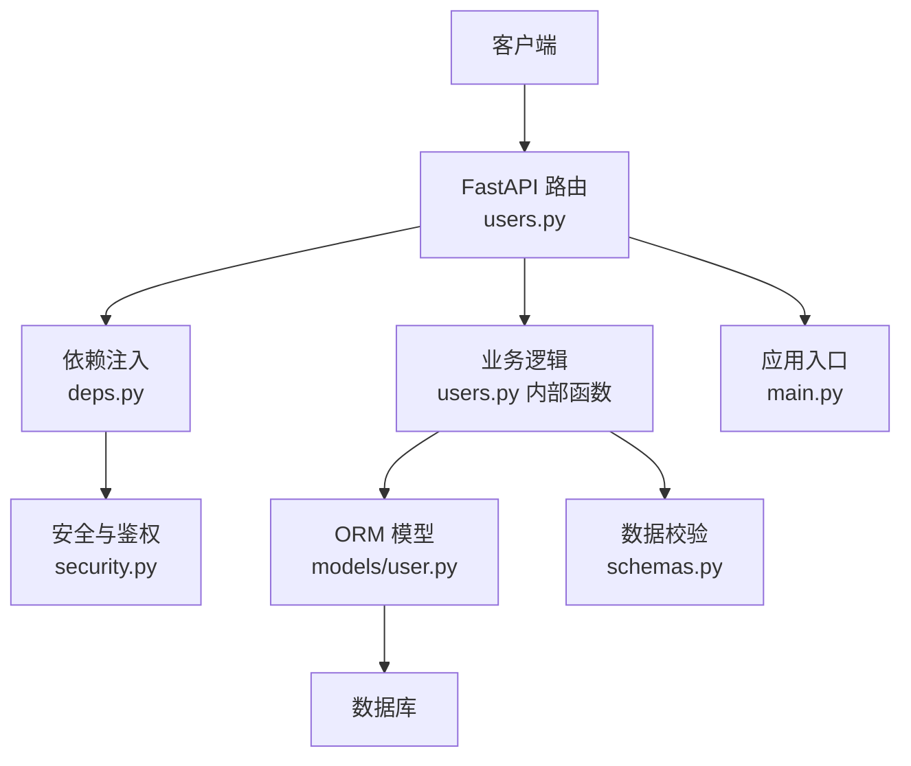
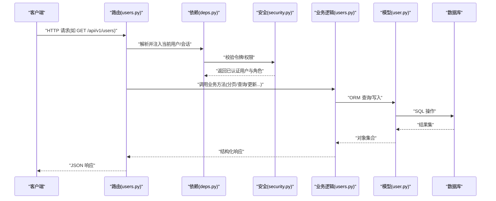
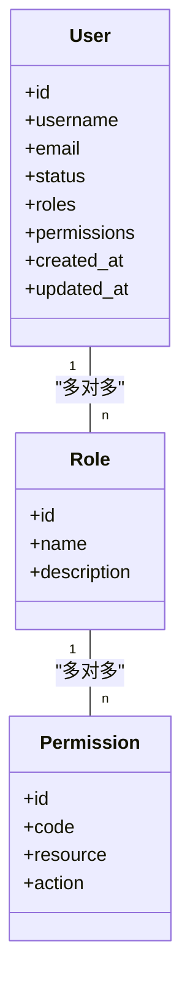
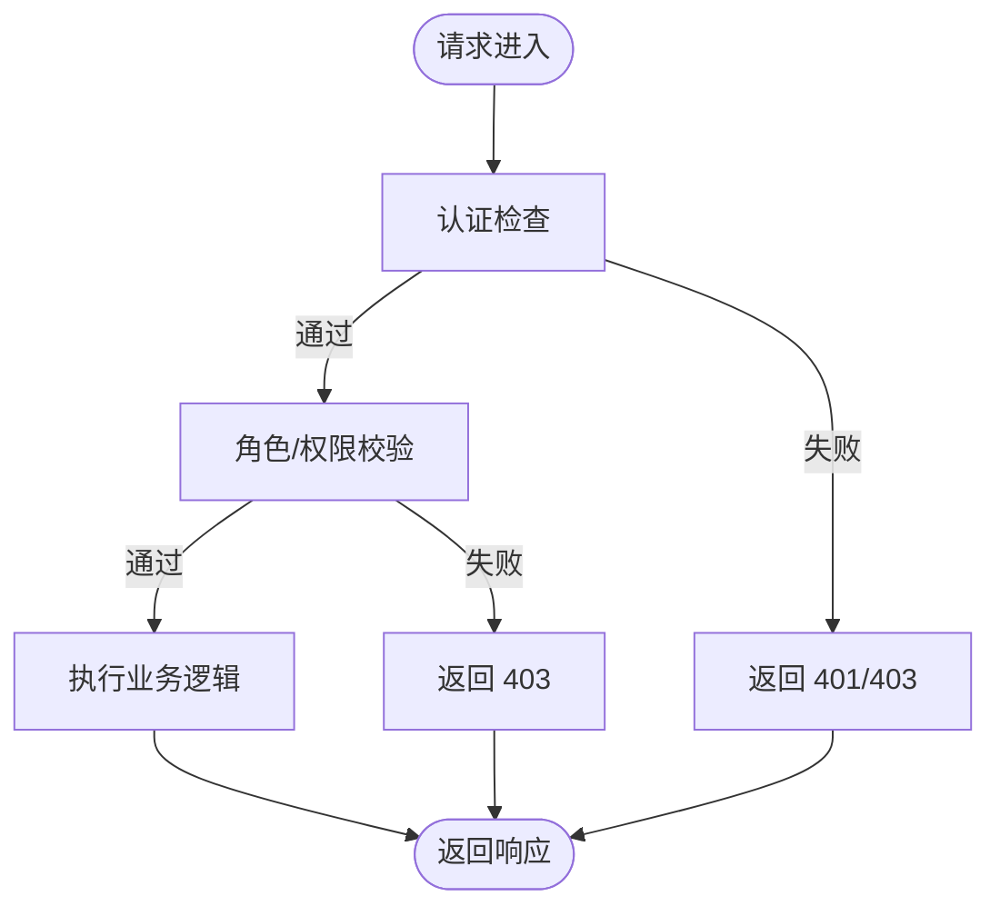
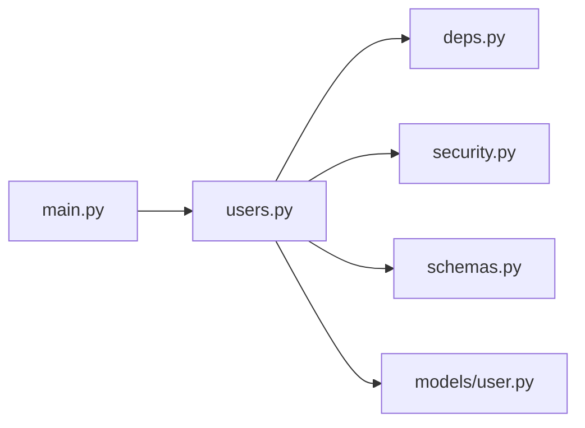

# 用户管理API

<cite>
**本文引用的文件**   
- [backend/app/api/v1/users.py](file://backend/app/api/v1/users.py)
- [backend/app/models/user.py](file://backend/app/models/user.py)
- [backend/app/schemas.py](file://backend/app/schemas.py)
- [backend/app/core/deps.py](file://backend/app/core/deps.py)
- [backend/app/core/security.py](file://backend/app/core/security.py)
- [backend/app/main.py](file://backend/app/main.py)
- [backend/tests/test_api.py](file://backend/tests/test_api.py)
</cite>

## 目录
1. [简介](#简介)
2. [项目结构](#项目结构)
3. [核心组件](#核心组件)
4. [架构总览](#架构总览)
5. [详细组件分析](#详细组件分析)
6. [依赖分析](#依赖分析)
7. [性能考虑](#性能考虑)
8. [故障排查指南](#故障排查指南)
9. [结论](#结论)
10. [附录：接口清单与示例](#附录接口清单与示例)

## 简介
本文件为 Talos 后端“用户管理模块”的完整 API 文档，覆盖用户的增删改查、权限与角色分配、批量操作、分页查询、状态管理与审计日志等。文档面向开发者与集成方，提供清晰的请求/响应规范、数据校验规则、错误码说明以及最佳实践建议。

## 项目结构
用户管理相关代码主要位于后端应用目录中，采用 FastAPI + SQLAlchemy 的典型分层：
- API 层：路由定义与参数校验（users.py）
- 模型层：数据库实体与关系（user.py）
- 模式层：Pydantic 数据模型与校验（schemas.py）
- 依赖与安全：鉴权、权限检查、依赖注入（deps.py, security.py）
- 应用入口：路由挂载与中间件（main.py）
- 测试：API 行为验证（test_api.py）

图表来源
- [backend/app/api/v1/users.py](file://backend/app/api/v1/users.py)
- [backend/app/models/user.py](file://backend/app/models/user.py)
- [backend/app/schemas.py](file://backend/app/schemas.py)
- [backend/app/core/deps.py](file://backend/app/core/deps.py)
- [backend/app/core/security.py](file://backend/app/core/security.py)
- [backend/app/main.py](file://backend/app/main.py)

章节来源
- [backend/app/api/v1/users.py](file://backend/app/api/v1/users.py)
- [backend/app/models/user.py](file://backend/app/models/user.py)
- [backend/app/schemas.py](file://backend/app/schemas.py)
- [backend/app/core/deps.py](file://backend/app/core/deps.py)
- [backend/app/core/security.py](file://backend/app/core/security.py)
- [backend/app/main.py](file://backend/app/main.py)

## 核心组件
- 路由与控制器：定义用户管理的 RESTful 端点，包括创建、读取、更新、删除、批量操作、分页查询、状态切换、角色分配与审计日志查询。
- 数据模型与校验：使用 Pydantic 模型对请求/响应进行严格校验，确保字段类型、长度、格式与业务约束。
- ORM 模型：映射数据库表结构，定义用户、角色、权限等实体及关系。
- 安全与鉴权：基于令牌或会话的认证机制，结合依赖注入实现细粒度权限控制。
- 依赖注入：统一获取当前用户、数据库会话、配置等上下文信息。

章节来源
- [backend/app/api/v1/users.py](file://backend/app/api/v1/users.py)
- [backend/app/schemas.py](file://backend/app/schemas.py)
- [backend/app/models/user.py](file://backend/app/models/user.py)
- [backend/app/core/deps.py](file://backend/app/core/deps.py)
- [backend/app/core/security.py](file://backend/app/core/security.py)

## 架构总览
下图展示了用户管理 API 的请求处理流程，从 HTTP 请求进入 FastAPI 路由，到依赖注入获取当前用户与权限，再到业务逻辑执行与数据库交互，最后返回标准化响应。

图表来源
- [backend/app/api/v1/users.py](file://backend/app/api/v1/users.py)
- [backend/app/core/deps.py](file://backend/app/core/deps.py)
- [backend/app/core/security.py](file://backend/app/core/security.py)
- [backend/app/models/user.py](file://backend/app/models/user.py)

## 详细组件分析

### 用户实体与数据模型
- 用户实体包含基础身份信息、状态、角色与权限集合、时间戳等字段。
- 通过 ORM 模型定义与数据库表的映射关系，支持关联查询（如角色、权限）。
- Pydantic 模式用于请求体与响应体的强类型校验，确保输入合法性与输出一致性。

图表来源
- [backend/app/models/user.py](file://backend/app/models/user.py)
- [backend/app/schemas.py](file://backend/app/schemas.py)

章节来源
- [backend/app/models/user.py](file://backend/app/models/user.py)
- [backend/app/schemas.py](file://backend/app/schemas.py)

### 认证与权限控制
- 认证：通过安全模块生成与验证访问令牌，依赖注入将当前用户上下文注入到路由处理器。
- 授权：基于角色的访问控制（RBAC），在路由层或依赖层检查用户是否具备所需权限。
- 安全策略：密码哈希、令牌过期、最小权限原则等。

图表来源
- [backend/app/core/security.py](file://backend/app/core/security.py)
- [backend/app/core/deps.py](file://backend/app/core/deps.py)
- [backend/app/api/v1/users.py](file://backend/app/api/v1/users.py)

章节来源
- [backend/app/core/security.py](file://backend/app/core/security.py)
- [backend/app/core/deps.py](file://backend/app/core/deps.py)
- [backend/app/api/v1/users.py](file://backend/app/api/v1/users.py)

### 用户 CRUD 接口
- 创建用户：POST /api/v1/users
  - 请求体：用户名、邮箱、初始密码、角色列表、权限集合、状态等。
  - 校验规则：用户名唯一、邮箱格式正确、密码强度要求、角色存在性检查。
  - 成功响应：返回用户基本信息与时间戳。
  - 错误处理：重复用户名、无效邮箱、角色不存在等返回 400/409。
- 读取用户：GET /api/v1/users/{user_id}
  - 路径参数：用户 ID。
  - 成功响应：用户详情。
  - 错误处理：用户不存在返回 404。
- 更新用户：PUT /api/v1/users/{user_id}
  - 请求体：可更新的字段（如邮箱、状态、角色、权限）。
  - 校验规则：字段可选但需满足类型与约束。
  - 成功响应：更新后的用户信息。
  - 错误处理：冲突或非法输入返回 400/409。
- 删除用户：DELETE /api/v1/users/{user_id}
  - 路径参数：用户 ID。
  - 成功响应：确认删除。
  - 错误处理：用户不存在返回 404。

章节来源
- [backend/app/api/v1/users.py](file://backend/app/api/v1/users.py)
- [backend/app/schemas.py](file://backend/app/schemas.py)
- [backend/app/models/user.py](file://backend/app/models/user.py)

### 分页查询与过滤
- 列表查询：GET /api/v1/users
  - 查询参数：page、per_page、sort_by、order、filter（如 status、role、email_like）。
  - 响应结构：data（用户列表）、total、page、per_page、has_next、has_prev。
  - 排序与过滤：支持按创建时间、用户名等字段排序；支持模糊匹配邮箱。
- 性能优化：使用分页限制返回数量，避免全表扫描；索引常用过滤字段。

章节来源
- [backend/app/api/v1/users.py](file://backend/app/api/v1/users.py)
- [backend/app/schemas.py](file://backend/app/schemas.py)

### 批量操作
- 批量创建：POST /api/v1/users/batch
  - 请求体：用户数组，每个元素遵循创建用户校验规则。
  - 事务处理：部分失败回滚或记录失败项。
  - 响应：成功数、失败数、失败明细。
- 批量更新：PATCH /api/v1/users/batch
  - 请求体：用户 ID 与要更新的字段映射。
  - 响应：更新统计与错误列表。
- 批量删除：DELETE /api/v1/users/batch
  - 请求体：用户 ID 数组。
  - 响应：删除统计与错误列表。

章节来源
- [backend/app/api/v1/users.py](file://backend/app/api/v1/users.py)
- [backend/app/schemas.py](file://backend/app/schemas.py)

### 权限与角色分配
- 角色管理：
  - 列出角色：GET /api/v1/roles
  - 创建/更新/删除角色：POST/PUT/DELETE /api/v1/roles/{role_id}
- 权限管理：
  - 列出权限：GET /api/v1/permissions
  - 创建/更新/删除权限：POST/PUT/DELETE /api/v1/permissions/{permission_id}
- 用户角色分配：
  - 分配角色：PATCH /api/v1/users/{user_id}/roles
  - 移除角色：DELETE /api/v1/users/{user_id}/roles/{role_id}
- 用户权限分配：
  - 分配权限：PATCH /api/v1/users/{user_id}/permissions
  - 移除权限：DELETE /api/v1/users/{user_id}/permissions/{permission_id}

章节来源
- [backend/app/api/v1/users.py](file://backend/app/api/v1/users.py)
- [backend/app/models/user.py](file://backend/app/models/user.py)
- [backend/app/schemas.py](file://backend/app/schemas.py)

### 用户状态管理
- 启用/禁用用户：PATCH /api/v1/users/{user_id}/status
  - 请求体：新状态（active/inactive/suspended）。
  - 校验：状态值合法且允许转换。
  - 响应：更新后的状态与时间戳。
- 状态历史：审计日志中记录状态变更轨迹。

章节来源
- [backend/app/api/v1/users.py](file://backend/app/api/v1/users.py)
- [backend/app/schemas.py](file://backend/app/schemas.py)

### 审计日志
- 查询审计日志：GET /api/v1/users/{user_id}/audit
  - 查询参数：start_time、end_time、action_type、operator。
  - 响应：日志条目列表（操作类型、时间、操作者、前后值等）。
- 常见操作类型：create、update、delete、role_assign、role_remove、permission_assign、permission_remove、status_change。

章节来源
- [backend/app/api/v1/users.py](file://backend/app/api/v1/users.py)
- [backend/app/models/user.py](file://backend/app/models/user.py)

## 依赖分析
- 路由依赖：users.py 依赖 deps.py 获取当前用户与数据库会话，依赖 security.py 进行认证与权限检查。
- 模型依赖：user.py 定义用户、角色、权限的 ORM 关系，供业务逻辑使用。
- 模式依赖：schemas.py 定义所有请求/响应的数据结构与校验规则。
- 应用入口：main.py 挂载路由与全局配置。

图表来源
- [backend/app/api/v1/users.py](file://backend/app/api/v1/users.py)
- [backend/app/core/deps.py](file://backend/app/core/deps.py)
- [backend/app/core/security.py](file://backend/app/core/security.py)
- [backend/app/schemas.py](file://backend/app/schemas.py)
- [backend/app/models/user.py](file://backend/app/models/user.py)
- [backend/app/main.py](file://backend/app/main.py)

章节来源
- [backend/app/api/v1/users.py](file://backend/app/api/v1/users.py)
- [backend/app/core/deps.py](file://backend/app/core/deps.py)
- [backend/app/core/security.py](file://backend/app/core/security.py)
- [backend/app/schemas.py](file://backend/app/schemas.py)
- [backend/app/models/user.py](file://backend/app/models/user.py)
- [backend/app/main.py](file://backend/app/main.py)

## 性能考虑
- 分页查询：默认限制 per_page 最大值，避免大结果集传输。
- 索引优化：对用户名字段、邮箱字段、状态字段建立索引以加速查询。
- 批量操作：使用事务减少数据库往返，失败时回滚保证一致性。
- 缓存策略：对只读列表与角色/权限元数据可引入缓存层（如 Redis）。
- 异步处理：耗时操作（如批量导入）建议使用任务队列异步执行。

[本节为通用性能建议，不直接分析具体文件]

## 故障排查指南
- 认证失败：检查令牌有效性、过期时间与签名；确认依赖注入是否正确获取当前用户。
- 权限不足：确认用户角色与权限配置；检查路由层的权限装饰器或依赖检查。
- 数据校验错误：核对请求体字段类型、必填项与格式；查看 schemas.py 中的校验规则。
- 数据库错误：检查连接池、事务状态与 SQL 语句；查看 ORM 模型定义与关系映射。
- 审计日志缺失：确认操作是否触发日志记录；检查日志写入服务与存储。

章节来源
- [backend/app/core/security.py](file://backend/app/core/security.py)
- [backend/app/core/deps.py](file://backend/app/core/deps.py)
- [backend/app/schemas.py](file://backend/app/schemas.py)
- [backend/app/models/user.py](file://backend/app/models/user.py)
- [backend/tests/test_api.py](file://backend/tests/test_api.py)

## 结论
用户管理模块提供了完整的 CRUD、权限与角色管理、批量操作、分页查询、状态管理与审计日志能力。通过清晰的分层架构与严格的校验机制，确保了系统的安全性与可维护性。建议在集成时遵循本文档的接口规范与错误处理约定，并结合性能与故障排查建议进行优化与排错。

[本节为总结性内容，不直接分析具体文件]

## 附录：接口清单与示例

### 接口清单
- 用户管理
  - POST /api/v1/users：创建用户
  - GET /api/v1/users：分页查询用户列表
  - GET /api/v1/users/{user_id}：获取用户详情
  - PUT /api/v1/users/{user_id}：更新用户信息
  - DELETE /api/v1/users/{user_id}：删除用户
  - PATCH /api/v1/users/{user_id}/status：更新用户状态
  - POST /api/v1/users/batch：批量创建用户
  - PATCH /api/v1/users/batch：批量更新用户
  - DELETE /api/v1/users/batch：批量删除用户
- 角色与权限
  - GET /api/v1/roles：列出角色
  - POST /api/v1/roles：创建角色
  - PUT /api/v1/roles/{role_id}：更新角色
  - DELETE /api/v1/roles/{role_id}：删除角色
  - GET /api/v1/permissions：列出权限
  - POST /api/v1/permissions：创建权限
  - PUT /api/v1/permissions/{permission_id}：更新权限
  - DELETE /api/v1/permissions/{permission_id}：删除权限
  - PATCH /api/v1/users/{user_id}/roles：分配角色
  - DELETE /api/v1/users/{user_id}/roles/{role_id}：移除角色
  - PATCH /api/v1/users/{user_id}/permissions：分配权限
  - DELETE /api/v1/users/{user_id}/permissions/{permission_id}：移除权限
- 审计日志
  - GET /api/v1/users/{user_id}/audit：查询用户审计日志

### 请求/响应示例（描述性）
- 创建用户
  - 请求体字段：username、email、password、roles、permissions、status
  - 成功响应：返回用户 id、username、email、status、created_at、updated_at
  - 错误响应：400（校验失败）、409（重复用户名）
- 分页查询用户
  - 查询参数：page、per_page、sort_by、order、filter.status、filter.role、filter.email_like
  - 成功响应：data 数组、total、page、per_page、has_next、has_prev
  - 错误响应：400（参数非法）
- 更新用户状态
  - 请求体字段：status（active/inactive/suspended）
  - 成功响应：返回更新后的 status 与 updated_at
  - 错误响应：400（状态值非法）、404（用户不存在）
- 批量创建用户
  - 请求体字段：users（数组，元素同创建用户）
  - 成功响应：success_count、failure_count、failures（含 user_index、error_message）
  - 错误响应：400（批量数据校验失败）

### 错误处理说明
- 400 Bad Request：请求体校验失败或参数非法
- 401 Unauthorized：未认证或令牌无效
- 403 Forbidden：无权限执行操作
- 404 Not Found：资源不存在
- 409 Conflict：资源冲突（如重复用户名）
- 500 Internal Server Error：服务器内部错误

章节来源
- [backend/app/api/v1/users.py](file://backend/app/api/v1/users.py)
- [backend/app/schemas.py](file://backend/app/schemas.py)
- [backend/tests/test_api.py](file://backend/tests/test_api.py)