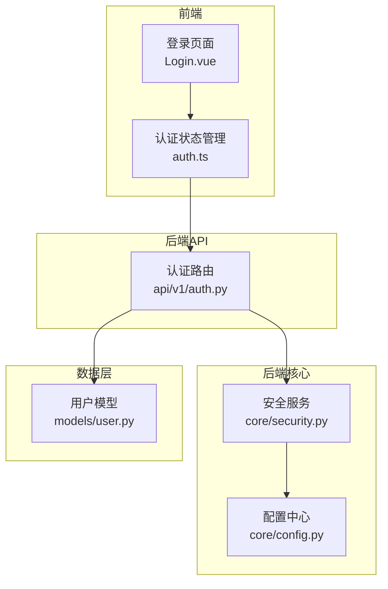
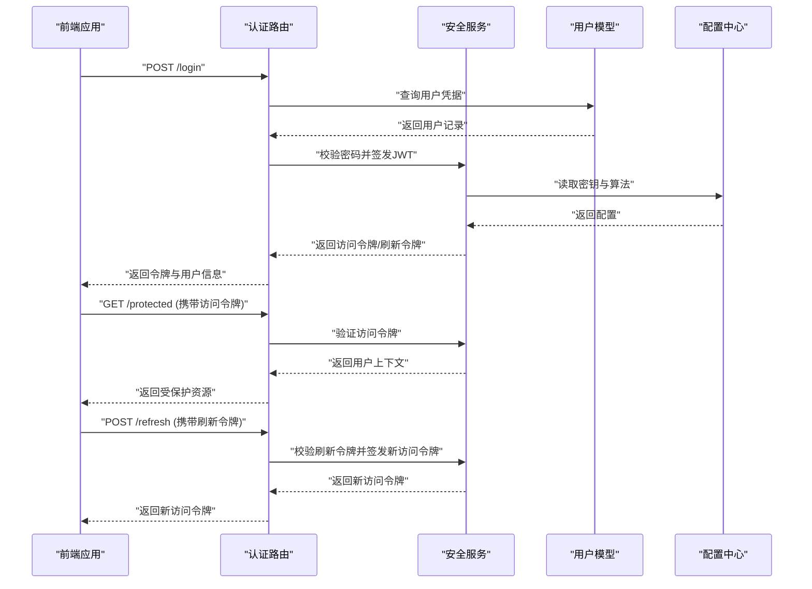
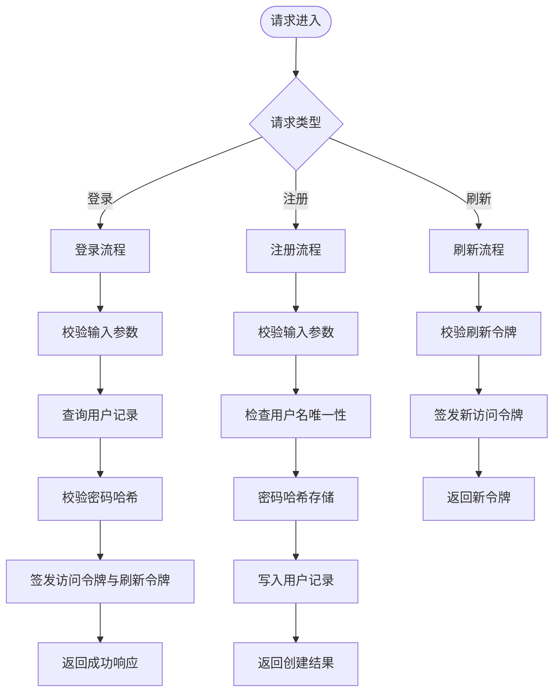
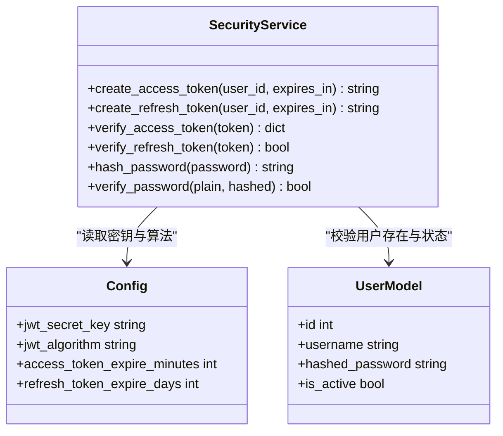
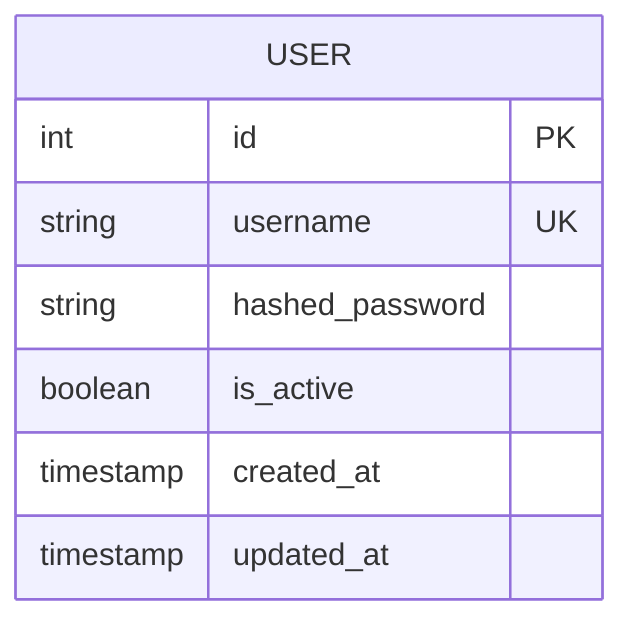
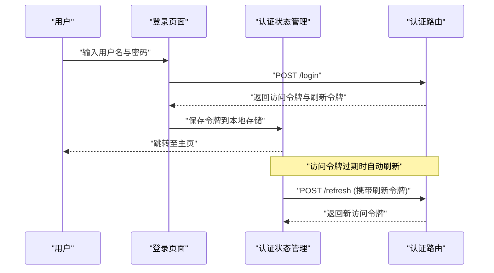
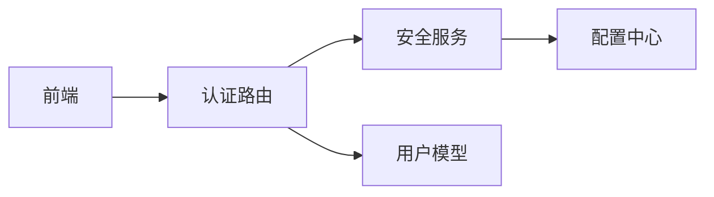

# 认证API

<cite>
**本文档引用的文件**
- [backend/app/api/v1/auth.py](file://backend/app/api/v1/auth.py)
- [backend/app/core/security.py](file://backend/app/core/security.py)
- [backend/app/models/user.py](file://backend/app/models/user.py)
- [backend/app/schemas.py](file://backend/app/schemas.py)
- [backend/app/core/config.py](file://backend/app/core/config.py)
- [frontend/src/stores/auth.ts](file://frontend/src/stores/auth.ts)
- [frontend/src/views/Login.vue](file://frontend/src/views/Login.vue)
</cite>

## 目录
1. [简介](#简介)
2. [项目结构](#项目结构)
3. [核心组件](#核心组件)
4. [架构总览](#架构总览)
5. [详细组件分析](#详细组件分析)
6. [依赖关系分析](#依赖关系分析)
7. [性能考虑](#性能考虑)
8. [故障排查指南](#故障排查指南)
9. [结论](#结论)
10. [附录](#附录)

## 简介
本文件为Talos系统的认证子系统提供完整的API文档，覆盖用户登录、注册、令牌获取与刷新等关键流程。内容包含JWT令牌的生成与验证机制、密码加密存储策略与安全最佳实践、请求/响应示例（成功与失败）、会话管理与安全配置选项，以及认证错误处理与调试方法。读者可据此快速集成前端或第三方客户端，并遵循安全规范进行部署与维护。

## 项目结构
认证相关代码主要位于后端模块中：
- API路由层：定义认证相关的HTTP端点
- 安全层：负责JWT签发、校验、刷新及密码哈希
- 数据模型层：用户实体与字段约束
- 配置层：密钥、过期时间、算法等安全参数
- 前端：登录页面与认证状态管理

**图表来源**
- [backend/app/api/v1/auth.py](file://backend/app/api/v1/auth.py)
- [backend/app/core/security.py](file://backend/app/core/security.py)
- [backend/app/core/config.py](file://backend/app/core/config.py)
- [backend/app/models/user.py](file://backend/app/models/user.py)
- [frontend/src/views/Login.vue](file://frontend/src/views/Login.vue)
- [frontend/src/stores/auth.ts](file://frontend/src/stores/auth.ts)

**章节来源**
- [backend/app/api/v1/auth.py](file://backend/app/api/v1/auth.py)
- [backend/app/core/security.py](file://backend/app/core/security.py)
- [backend/app/core/config.py](file://backend/app/core/config.py)
- [backend/app/models/user.py](file://backend/app/models/user.py)
- [frontend/src/views/Login.vue](file://frontend/src/views/Login.vue)
- [frontend/src/stores/auth.ts](file://frontend/src/stores/auth.ts)

## 核心组件
- 认证路由：暴露登录、注册、令牌刷新等接口，统一输入校验与响应格式
- 安全服务：实现JWT的创建、解析、刷新；密码哈希与校验；敏感配置读取
- 用户模型：定义用户表结构与字段约束，支撑注册与登录查询
- 配置中心：集中管理JWT密钥、算法、过期时间、刷新策略等安全参数
- 前端认证：封装登录请求、令牌存储与自动刷新逻辑

**章节来源**
- [backend/app/api/v1/auth.py](file://backend/app/api/v1/auth.py)
- [backend/app/core/security.py](file://backend/app/core/security.py)
- [backend/app/models/user.py](file://backend/app/models/user.py)
- [backend/app/core/config.py](file://backend/app/core/config.py)
- [frontend/src/stores/auth.ts](file://frontend/src/stores/auth.ts)

## 架构总览
认证流程采用“无状态JWT + 可选刷新令牌”的模式。前端在登录成功后保存访问令牌，后续请求携带令牌以通过鉴权中间件；当访问令牌即将过期时，使用刷新令牌换取新的访问令牌，避免频繁重新登录。

**图表来源**
- [backend/app/api/v1/auth.py](file://backend/app/api/v1/auth.py)
- [backend/app/core/security.py](file://backend/app/core/security.py)
- [backend/app/core/config.py](file://backend/app/core/config.py)
- [backend/app/models/user.py](file://backend/app/models/user.py)

## 详细组件分析

### 认证路由（登录、注册、刷新）
- 登录接口：接收用户名与密码，校验后返回访问令牌与刷新令牌
- 注册接口：接收新用户信息，校验唯一性与密码强度，写入数据库并返回用户标识
- 刷新接口：接收刷新令牌，校验后返回新的访问令牌

**图表来源**
- [backend/app/api/v1/auth.py](file://backend/app/api/v1/auth.py)
- [backend/app/core/security.py](file://backend/app/core/security.py)
- [backend/app/models/user.py](file://backend/app/models/user.py)

**章节来源**
- [backend/app/api/v1/auth.py](file://backend/app/api/v1/auth.py)
- [backend/app/schemas.py](file://backend/app/schemas.py)

### 安全服务（JWT与密码）
- JWT签发：基于配置中的密钥与算法生成访问令牌，附加用户身份与过期时间
- JWT验证：解析并验签访问令牌，提取用户上下文供下游使用
- 刷新令牌：校验刷新令牌有效性，签发新的访问令牌
- 密码哈希：使用强哈希算法对密码进行不可逆加密存储与校验

**图表来源**
- [backend/app/core/security.py](file://backend/app/core/security.py)
- [backend/app/core/config.py](file://backend/app/core/config.py)
- [backend/app/models/user.py](file://backend/app/models/user.py)

**章节来源**
- [backend/app/core/security.py](file://backend/app/core/security.py)
- [backend/app/core/config.py](file://backend/app/core/config.py)
- [backend/app/models/user.py](file://backend/app/models/user.py)

### 用户模型（注册与登录数据）
- 字段说明：用户ID、用户名、密码哈希、激活状态等
- 约束规则：用户名唯一、密码长度与复杂度要求、激活状态控制登录权限

**图表来源**
- [backend/app/models/user.py](file://backend/app/models/user.py)

**章节来源**
- [backend/app/models/user.py](file://backend/app/models/user.py)
- [backend/app/schemas.py](file://backend/app/schemas.py)

### 前端认证（登录与令牌管理）
- 登录页面：收集用户名与密码，调用登录接口并保存令牌
- 认证状态管理：维护访问令牌与刷新令牌，自动处理过期与刷新

**图表来源**
- [frontend/src/views/Login.vue](file://frontend/src/views/Login.vue)
- [frontend/src/stores/auth.ts](file://frontend/src/stores/auth.ts)
- [backend/app/api/v1/auth.py](file://backend/app/api/v1/auth.py)

**章节来源**
- [frontend/src/views/Login.vue](file://frontend/src/views/Login.vue)
- [frontend/src/stores/auth.ts](file://frontend/src/stores/auth.ts)

## 依赖关系分析
- 认证路由依赖安全服务进行令牌操作与密码校验
- 安全服务依赖配置中心获取密钥与算法
- 认证路由依赖用户模型进行用户数据读写
- 前端依赖认证路由进行登录与刷新

**图表来源**
- [backend/app/api/v1/auth.py](file://backend/app/api/v1/auth.py)
- [backend/app/core/security.py](file://backend/app/core/security.py)
- [backend/app/core/config.py](file://backend/app/core/config.py)
- [backend/app/models/user.py](file://backend/app/models/user.py)
- [frontend/src/stores/auth.ts](file://frontend/src/stores/auth.ts)

**章节来源**
- [backend/app/api/v1/auth.py](file://backend/app/api/v1/auth.py)
- [backend/app/core/security.py](file://backend/app/core/security.py)
- [backend/app/core/config.py](file://backend/app/core/config.py)
- [backend/app/models/user.py](file://backend/app/models/user.py)
- [frontend/src/stores/auth.ts](file://frontend/src/stores/auth.ts)

## 性能考虑
- 令牌签发与验证应使用高效算法，避免阻塞主线程
- 刷新令牌建议设置合理过期时间，减少频繁刷新开销
- 密码哈希计算成本适中，兼顾安全性与性能
- 前端缓存访问令牌，仅在必要时发起刷新请求

[本节为通用指导，不直接分析具体文件]

## 故障排查指南
- 登录失败：检查用户名是否存在、密码是否正确、用户是否被禁用
- 令牌无效：确认令牌未过期、签名正确、传输过程中未被篡改
- 刷新失败：检查刷新令牌是否有效、是否已被撤销或过期
- 调试建议：启用详细日志记录，输出关键步骤的输入输出摘要

**章节来源**
- [backend/app/api/v1/auth.py](file://backend/app/api/v1/auth.py)
- [backend/app/core/security.py](file://backend/app/core/security.py)

## 结论
Talos认证系统采用标准的JWT无状态认证模式，结合刷新令牌提升用户体验。通过严格的安全配置与密码哈希策略，保障用户数据安全。前端与后端的清晰分工使得集成与维护更加便捷。建议在生产环境中启用HTTPS、定期轮换密钥，并实施最小权限原则。

[本节为总结性内容，不直接分析具体文件]

## 附录
- 请求/响应示例：请参考各接口对应的路由定义与数据模型
- 安全配置项：包括JWT密钥、算法、过期时间等，详见配置中心
- 最佳实践：使用强密码策略、限制登录尝试次数、监控异常行为

[本节为补充信息，不直接分析具体文件]