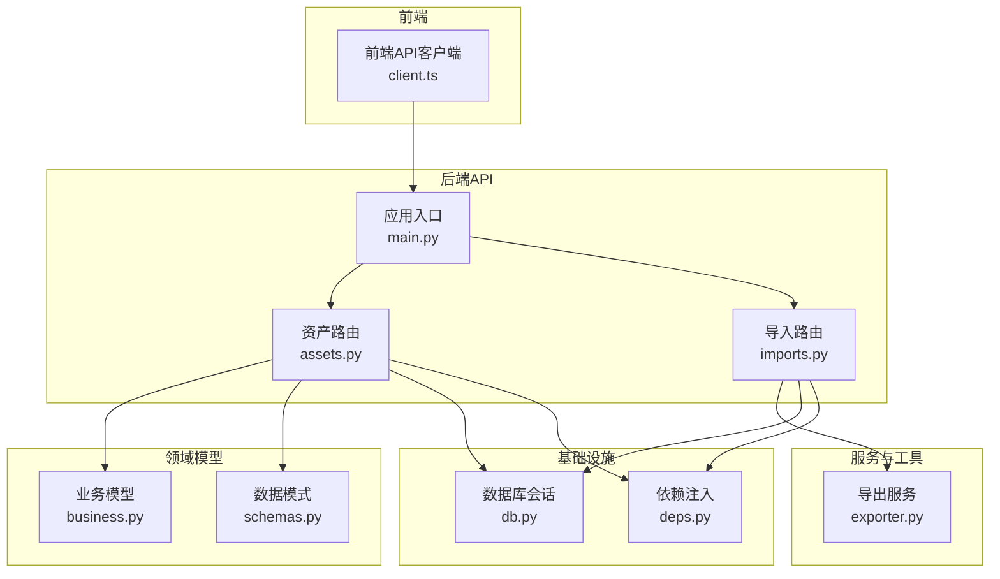
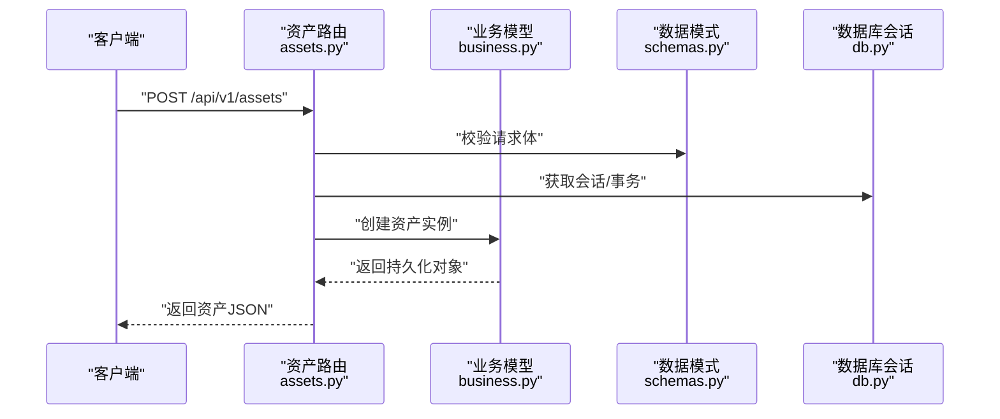
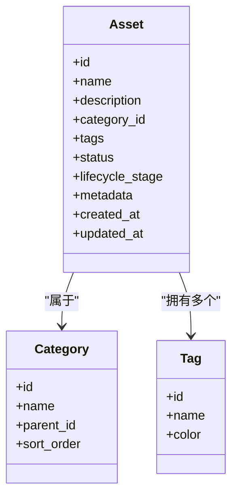
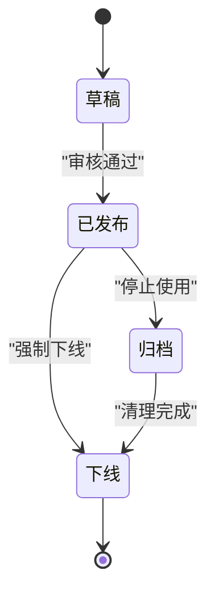
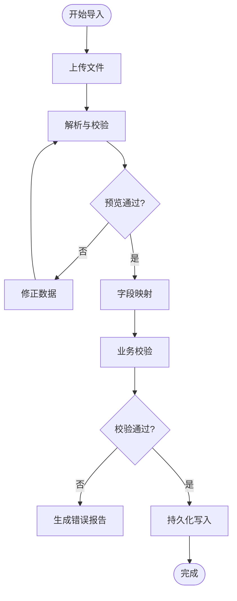
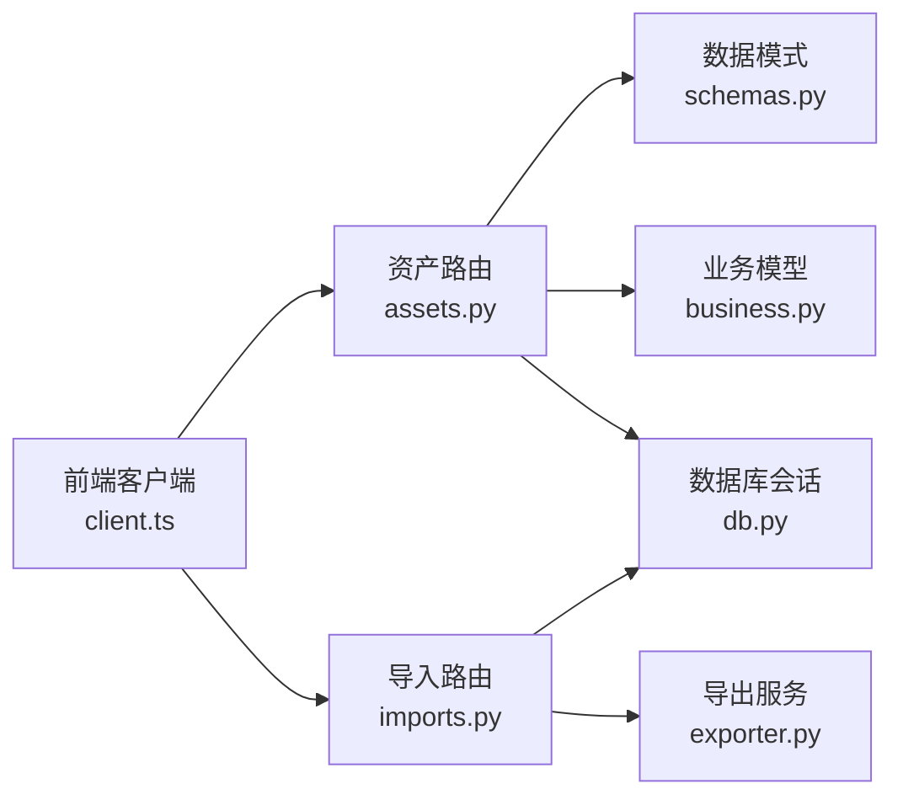

# 资产管理API

<cite>
**本文引用的文件**   
- [backend/app/api/v1/assets.py](file://backend/app/api/v1/assets.py)
- [backend/app/models/business.py](file://backend/app/models/business.py)
- [backend/app/schemas.py](file://backend/app/schemas.py)
- [backend/app/db.py](file://backend/app/db.py)
- [backend/app/core/deps.py](file://backend/app/core/deps.py)
- [backend/app/main.py](file://backend/app/main.py)
- [backend/app/api/v1/imports.py](file://backend/app/api/v1/imports.py)
- [backend/app/services/exporter.py](file://backend/app/services/exporter.py)
- [frontend/src/api/client.ts](file://frontend/src/api/client.ts)
</cite>

## 目录
1. [简介](#简介)
2. [项目结构](#项目结构)
3. [核心组件](#核心组件)
4. [架构总览](#架构总览)
5. [详细组件分析](#详细组件分析)
6. [依赖关系分析](#依赖关系分析)
7. [性能考虑](#性能考虑)
8. [故障排查指南](#故障排查指南)
9. [结论](#结论)
10. [附录](#附录)

## 简介
本文件为“资产管理”模块的完整API文档，覆盖资产的增删改查、分类管理、标签系统、导入导出、批量操作、状态与生命周期管理、搜索过滤排序等能力。文档面向后端开发者与前端集成者，提供接口定义、数据模型、调用示例与最佳实践，帮助快速对接并稳定使用。

## 项目结构
资产相关功能主要位于后端FastAPI应用中：
- API路由层：backend/app/api/v1/assets.py
- 数据模型与业务实体：backend/app/models/business.py
- Pydantic请求/响应模式：backend/app/schemas.py
- 数据库会话与连接：backend/app/db.py
- 依赖注入与安全校验：backend/app/core/deps.py
- 应用入口与路由挂载：backend/app/main.py
- 导入导出：backend/app/api/v1/imports.py、backend/app/services/exporter.py
- 前端API客户端：frontend/src/api/client.ts

图表来源
- [backend/app/main.py](file://backend/app/main.py)
- [backend/app/api/v1/assets.py](file://backend/app/api/v1/assets.py)
- [backend/app/api/v1/imports.py](file://backend/app/api/v1/imports.py)
- [backend/app/services/exporter.py](file://backend/app/services/exporter.py)
- [backend/app/models/business.py](file://backend/app/models/business.py)
- [backend/app/schemas.py](file://backend/app/schemas.py)
- [backend/app/db.py](file://backend/app/db.py)
- [backend/app/core/deps.py](file://backend/app/core/deps.py)

章节来源
- [backend/app/main.py](file://backend/app/main.py)
- [backend/app/api/v1/assets.py](file://backend/app/api/v1/assets.py)
- [backend/app/models/business.py](file://backend/app/models/business.py)
- [backend/app/schemas.py](file://backend/app/schemas.py)
- [backend/app/db.py](file://backend/app/db.py)
- [backend/app/core/deps.py](file://backend/app/core/deps.py)
- [backend/app/api/v1/imports.py](file://backend/app/api/v1/imports.py)
- [backend/app/services/exporter.py](file://backend/app/services/exporter.py)
- [frontend/src/api/client.ts](file://frontend/src/api/client.ts)

## 核心组件
- 资产路由（CRUD）：提供资产的新建、查询、更新、删除、批量操作、搜索过滤排序等接口。
- 资产模型：定义资产实体的字段、约束与关联关系。
- 数据模式：统一请求/响应体结构与校验规则。
- 导入导出：支持从外部源导入资产、将资产导出为常用格式。
- 依赖注入：提供数据库会话、权限校验、分页参数解析等通用能力。

章节来源
- [backend/app/api/v1/assets.py](file://backend/app/api/v1/assets.py)
- [backend/app/models/business.py](file://backend/app/models/business.py)
- [backend/app/schemas.py](file://backend/app/schemas.py)
- [backend/app/core/deps.py](file://backend/app/core/deps.py)

## 架构总览
资产API采用分层设计：
- 表现层：FastAPI路由处理HTTP请求与响应，进行参数校验与错误处理。
- 领域层：业务模型定义资产、分类、标签等实体及其关系。
- 数据层：通过SQLAlchemy会话访问数据库。
- 服务层：封装导入/导出等跨域逻辑。
- 支撑层：依赖注入、配置、安全策略。

图表来源
- [backend/app/api/v1/assets.py](file://backend/app/api/v1/assets.py)
- [backend/app/models/business.py](file://backend/app/models/business.py)
- [backend/app/schemas.py](file://backend/app/schemas.py)
- [backend/app/db.py](file://backend/app/db.py)

## 详细组件分析

### 资产实体与数据模型
- 资产实体包含基础信息、分类、标签、状态、生命周期阶段、元数据等字段。
- 分类用于对资产进行分组管理，支持层级或扁平结构。
- 标签用于灵活标注资产属性，支持多值与组合筛选。
- 状态与生命周期控制资产流转，如草稿、已发布、归档、下线等。

图表来源
- [backend/app/models/business.py](file://backend/app/models/business.py)
- [backend/app/schemas.py](file://backend/app/schemas.py)

章节来源
- [backend/app/models/business.py](file://backend/app/models/business.py)
- [backend/app/schemas.py](file://backend/app/schemas.py)

### 资产CRUD接口
- 新建资产：提交资产基本信息、分类、标签、状态与生命周期阶段。
- 查询资产：支持按ID获取、列表分页、条件过滤、排序。
- 更新资产：部分或全量更新资产字段。
- 删除资产：软删除或硬删除，受权限与状态约束。
- 批量操作：批量新增、更新、删除、打标签、切换状态。

典型请求与响应要点：
- 请求体遵循Pydantic模式，包含必填字段校验与默认值。
- 响应体包含资产对象及元数据（如分页信息）。
- 错误码与消息明确，便于前端处理。

章节来源
- [backend/app/api/v1/assets.py](file://backend/app/api/v1/assets.py)
- [backend/app/schemas.py](file://backend/app/schemas.py)

### 分类管理接口
- 分类CRUD：创建、读取、更新、删除分类。
- 层级关系：支持父子分类，限制循环引用。
- 排序与可见性：支持排序权重与显示控制。

章节来源
- [backend/app/api/v1/assets.py](file://backend/app/api/v1/assets.py)
- [backend/app/models/business.py](file://backend/app/models/business.py)

### 标签系统接口
- 标签CRUD：创建、读取、更新、删除标签。
- 资产标签绑定：为资产添加/移除标签，支持批量操作。
- 标签统计：统计标签使用频次与关联资产数量。

章节来源
- [backend/app/api/v1/assets.py](file://backend/app/api/v1/assets.py)
- [backend/app/models/business.py](file://backend/app/models/business.py)

### 状态管理与生命周期控制
- 状态机：定义资产可迁移的状态集合与允许转换。
- 生命周期阶段：如规划、开发、测试、上线、维护、下线。
- 变更审计：记录状态与生命周期变更历史，支持回滚策略。

图表来源
- [backend/app/models/business.py](file://backend/app/models/business.py)
- [backend/app/schemas.py](file://backend/app/schemas.py)

章节来源
- [backend/app/models/business.py](file://backend/app/models/business.py)
- [backend/app/schemas.py](file://backend/app/schemas.py)

### 搜索、过滤与排序
- 搜索：支持关键词模糊匹配、全文检索（可选）。
- 过滤：按分类、标签、状态、生命周期阶段、时间范围等维度过滤。
- 排序：支持按创建时间、更新时间、名称、优先级等多字段排序，支持升/降序。
- 分页：统一分页参数与响应结构，避免大结果集导致性能问题。

章节来源
- [backend/app/api/v1/assets.py](file://backend/app/api/v1/assets.py)
- [backend/app/schemas.py](file://backend/app/schemas.py)

### 导入与导出
- 导入：支持CSV/Excel/JSON等格式，提供预览与映射配置，支持增量更新与冲突处理。
- 导出：支持按条件导出资产清单，输出CSV/Excel/JSON，支持字段选择与模板。
- 任务队列：异步处理大批量导入导出，提供进度查询与结果下载。

图表来源
- [backend/app/api/v1/imports.py](file://backend/app/api/v1/imports.py)
- [backend/app/services/exporter.py](file://backend/app/services/exporter.py)

章节来源
- [backend/app/api/v1/imports.py](file://backend/app/api/v1/imports.py)
- [backend/app/services/exporter.py](file://backend/app/services/exporter.py)

### 批量操作接口
- 批量新增：一次性提交多条资产记录，支持去重与冲突策略。
- 批量更新：按条件批量更新字段，支持幂等与事务保障。
- 批量删除：按ID列表或条件删除，支持软删除与回收站恢复。
- 批量打标签：为多条资产统一添加/移除标签。
- 批量状态切换：按条件批量切换状态与生命周期阶段。

章节来源
- [backend/app/api/v1/assets.py](file://backend/app/api/v1/assets.py)
- [backend/app/schemas.py](file://backend/app/schemas.py)

### JSON数据格式示例
以下为常见接口的请求/响应结构说明（以路径引用代替具体代码内容）：
- 新建资产请求体：参考[backend/app/schemas.py](file://backend/app/schemas.py)中的资产创建模式。
- 资产列表响应体：参考[backend/app/schemas.py](file://backend/app/schemas.py)中的资产列表与分页模式。
- 分类与标签请求/响应：参考[backend/app/schemas.py](file://backend/app/schemas.py)中的分类与标签模式。
- 导入任务请求/响应：参考[backend/app/api/v1/imports.py](file://backend/app/api/v1/imports.py)中的导入模式。
- 导出任务请求/响应：参考[backend/app/services/exporter.py](file://backend/app/services/exporter.py)中的导出模式。

章节来源
- [backend/app/schemas.py](file://backend/app/schemas.py)
- [backend/app/api/v1/imports.py](file://backend/app/api/v1/imports.py)
- [backend/app/services/exporter.py](file://backend/app/services/exporter.py)

### API调用示例
- 新建资产：POST /api/v1/assets，请求体包含资产名称、描述、分类ID、标签ID列表、状态与生命周期阶段。
- 查询资产列表：GET /api/v1/assets?category_id=&tag_ids=&status=&page=1&size=20&order_by=created_at&order_dir=desc。
- 更新资产：PUT /api/v1/assets/{id}，提交需要更新的字段。
- 删除资产：DELETE /api/v1/assets/{id}，支持软删除标志。
- 批量新增：POST /api/v1/assets/batch，提交资产数组。
- 批量打标签：PATCH /api/v1/assets/batch/tags，提交资产ID列表与标签操作。
- 导入资产：POST /api/v1/imports/assets，上传文件并指定映射。
- 导出资产：POST /api/v1/exports/assets，选择字段与过滤条件。

章节来源
- [backend/app/api/v1/assets.py](file://backend/app/api/v1/assets.py)
- [backend/app/api/v1/imports.py](file://backend/app/api/v1/imports.py)
- [backend/app/services/exporter.py](file://backend/app/services/exporter.py)

## 依赖关系分析
- 路由层依赖数据模式进行输入校验，依赖业务模型进行实体操作，依赖数据库会话进行持久化。
- 导入导出服务依赖数据库与会话，必要时依赖任务队列进行异步处理。
- 前端客户端通过HTTP调用后端API，遵循统一的鉴权与错误处理规范。

图表来源
- [backend/app/api/v1/assets.py](file://backend/app/api/v1/assets.py)
- [backend/app/schemas.py](file://backend/app/schemas.py)
- [backend/app/models/business.py](file://backend/app/models/business.py)
- [backend/app/db.py](file://backend/app/db.py)
- [backend/app/api/v1/imports.py](file://backend/app/api/v1/imports.py)
- [backend/app/services/exporter.py](file://backend/app/services/exporter.py)
- [frontend/src/api/client.ts](file://frontend/src/api/client.ts)

章节来源
- [backend/app/api/v1/assets.py](file://backend/app/api/v1/assets.py)
- [backend/app/schemas.py](file://backend/app/schemas.py)
- [backend/app/models/business.py](file://backend/app/models/business.py)
- [backend/app/db.py](file://backend/app/db.py)
- [backend/app/api/v1/imports.py](file://backend/app/api/v1/imports.py)
- [backend/app/services/exporter.py](file://backend/app/services/exporter.py)
- [frontend/src/api/client.ts](file://frontend/src/api/client.ts)

## 性能考虑
- 分页与限流：列表接口必须分页，避免一次性返回大量数据；对高频接口实施限流。
- 索引优化：对常用过滤字段（分类ID、标签ID、状态、生命周期阶段、时间戳）建立索引。
- 批量操作：使用事务与批量插入/更新，减少数据库往返次数。
- 导入导出：异步处理大文件，避免阻塞主线程；分块读写与流式处理。
- 缓存策略：对热点查询（如分类树、标签字典）进行缓存，降低数据库压力。

## 故障排查指南
- 参数校验失败：检查请求体是否符合Pydantic模式，关注必填字段与类型约束。
- 权限不足：确认用户角色与资源权限，检查依赖注入中的鉴权逻辑。
- 数据库异常：查看会话与事务状态，检查外键约束与唯一性约束。
- 导入失败：核对文件格式与字段映射，查看错误报告定位问题数据。
- 导出超时：调整导出批次大小与并发度，监控任务队列负载。

章节来源
- [backend/app/schemas.py](file://backend/app/schemas.py)
- [backend/app/core/deps.py](file://backend/app/core/deps.py)
- [backend/app/db.py](file://backend/app/db.py)
- [backend/app/api/v1/imports.py](file://backend/app/api/v1/imports.py)

## 结论
资产管理API提供了完整的资产生命周期管理能力，涵盖CRUD、分类与标签、状态与生命周期、搜索过滤排序、导入导出与批量操作。通过分层架构与清晰的依赖关系，系统具备良好的扩展性与可维护性。建议在生产环境启用索引、缓存与异步任务，以提升性能与稳定性。

## 附录
- 前端集成：参考frontend/src/api/client.ts中的API客户端实现，确保请求头、鉴权与错误处理一致。
- 版本兼容：API版本前缀为/api/v1，后续演进需保持向后兼容。
- 文档更新：当模型或模式变更时，同步更新本档与前端契约。

章节来源
- [frontend/src/api/client.ts](file://frontend/src/api/client.ts)
- [backend/app/main.py](file://backend/app/main.py)