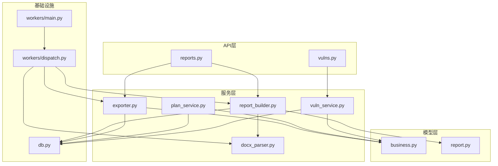
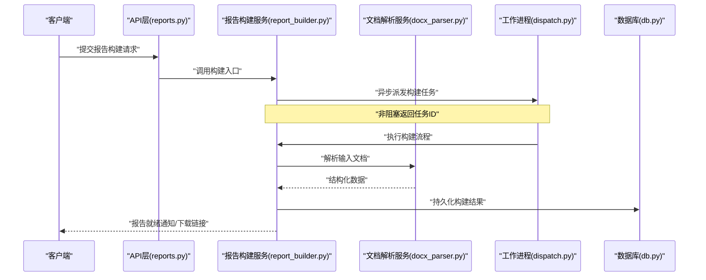
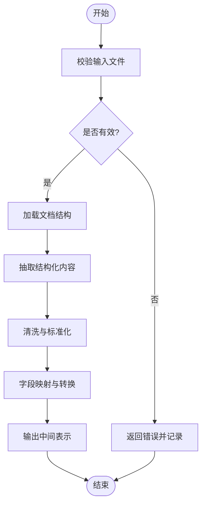
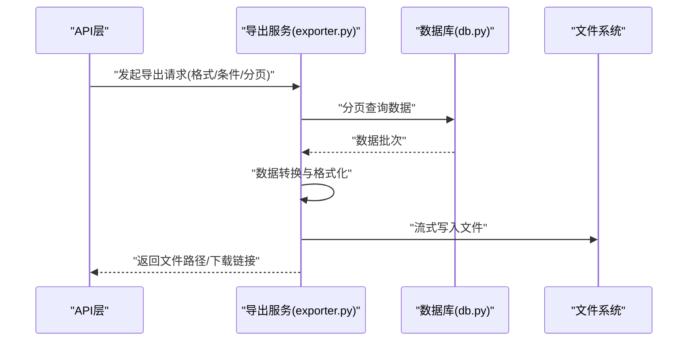
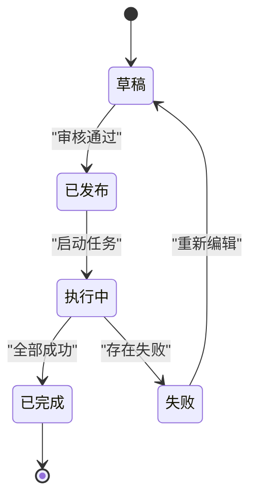
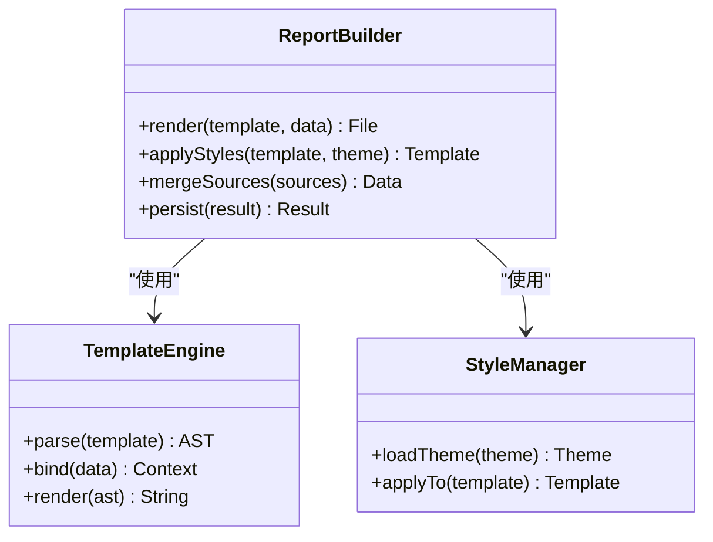
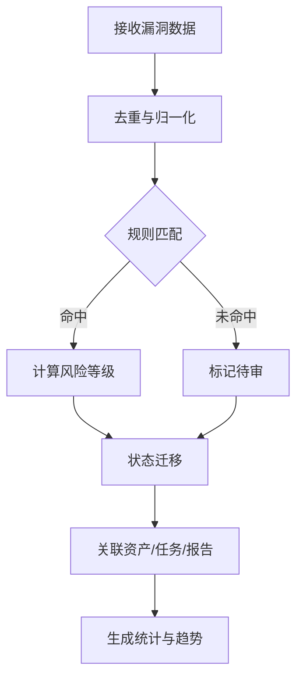
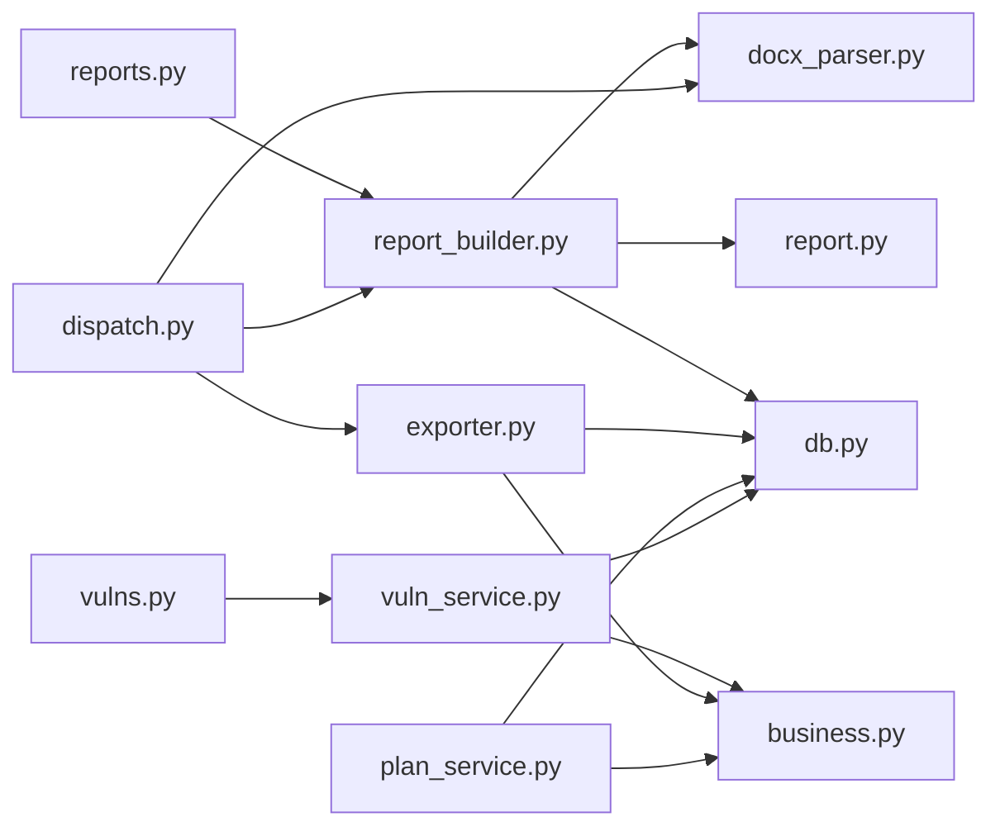

# 业务服务层

<cite>
**本文档引用的文件**   
- [backend/app/services/docx_parser.py](file://backend/app/services/docx_parser.py)
- [backend/app/services/exporter.py](file://backend/app/services/exporter.py)
- [backend/app/services/plan_service.py](file://backend/app/services/plan_service.py)
- [backend/app/services/report_builder.py](file://backend/app/services/report_builder.py)
- [backend/app/services/vuln_service.py](file://backend/app/services/vuln_service.py)
- [backend/app/models/business.py](file://backend/app/models/business.py)
- [backend/app/models/report.py](file://backend/app/models/report.py)
- [backend/app/api/v1/reports.py](file://backend/app/api/v1/reports.py)
- [backend/app/api/v1/vulns.py](file://backend/app/api/v1/vulns.py)
- [backend/app/db.py](file://backend/app/db.py)
- [backend/app/workers/main.py](file://backend/app/workers/main.py)
- [backend/app/workers/dispatch.py](file://backend/app/workers/dispatch.py)
</cite>

## 目录
1. [简介](#简介)
2. [项目结构](#项目结构)
3. [核心组件](#核心组件)
4. [架构总览](#架构总览)
5. [详细组件分析](#详细组件分析)
6. [依赖关系分析](#依赖关系分析)
7. [性能考量](#性能考量)
8. [故障排查指南](#故障排查指南)
9. [结论](#结论)
10. [附录](#附录)

## 简介
本文件面向Talos后端“业务服务层”的设计与实现，聚焦以下目标：
- 说明服务层的设计模式与职责划分原则
- 详解文档解析服务（Word解析、数据提取、格式转换）
- 详解导出服务（数据格式化、文件生成、批量处理）
- 详解测试计划服务（计划创建、任务调度、进度跟踪）
- 详解报告构建服务（模板引擎、内容组装、样式应用）
- 详解漏洞服务（业务规则、状态流转、关联分析）
- 梳理服务间依赖与调用模式
- 提供扩展与自定义开发指导

## 项目结构
后端采用分层架构：API层负责请求路由与参数校验，服务层封装业务逻辑，模型层定义数据实体与关系，数据库访问通过ORM进行。异步任务由工作进程承担，用于耗时操作（如文档解析、报告生成、批量导出）。

图表来源
- [backend/app/api/v1/reports.py](file://backend/app/api/v1/reports.py)
- [backend/app/api/v1/vulns.py](file://backend/app/api/v1/vulns.py)
- [backend/app/services/docx_parser.py](file://backend/app/services/docx_parser.py)
- [backend/app/services/exporter.py](file://backend/app/services/exporter.py)
- [backend/app/services/plan_service.py](file://backend/app/services/plan_service.py)
- [backend/app/services/report_builder.py](file://backend/app/services/report_builder.py)
- [backend/app/services/vuln_service.py](file://backend/app/services/vuln_service.py)
- [backend/app/models/business.py](file://backend/app/models/business.py)
- [backend/app/models/report.py](file://backend/app/models/report.py)
- [backend/app/db.py](file://backend/app/db.py)
- [backend/app/workers/main.py](file://backend/app/workers/main.py)
- [backend/app/workers/dispatch.py](file://backend/app/workers/dispatch.py)

章节来源
- [backend/app/api/v1/reports.py](file://backend/app/api/v1/reports.py)
- [backend/app/api/v1/vulns.py](file://backend/app/api/v1/vulns.py)
- [backend/app/services/docx_parser.py](file://backend/app/services/docx_parser.py)
- [backend/app/services/exporter.py](file://backend/app/services/exporter.py)
- [backend/app/services/plan_service.py](file://backend/app/services/plan_service.py)
- [backend/app/services/report_builder.py](file://backend/app/services/report_builder.py)
- [backend/app/services/vuln_service.py](file://backend/app/services/vuln_service.py)
- [backend/app/models/business.py](file://backend/app/models/business.py)
- [backend/app/models/report.py](file://backend/app/models/report.py)
- [backend/app/db.py](file://backend/app/db.py)
- [backend/app/workers/main.py](file://backend/app/workers/main.py)
- [backend/app/workers/dispatch.py](file://backend/app/workers/dispatch.py)

## 核心组件
- 文档解析服务：负责Word文档的读取、结构化抽取、字段映射与清洗，输出标准化中间表示供下游使用。
- 导出服务：将业务数据按模板或规则转换为多种格式（如CSV、Excel、PDF等），支持批量与分页。
- 测试计划服务：管理测试计划的创建、任务编排、执行状态与进度追踪，并与工作进程协作完成异步任务。
- 报告构建服务：基于模板引擎组装报告内容，应用样式与布局，生成最终可交付的报告文件。
- 漏洞服务：维护漏洞生命周期、状态机流转、关联资产与证据，提供聚合分析与统计。

章节来源
- [backend/app/services/docx_parser.py](file://backend/app/services/docx_parser.py)
- [backend/app/services/exporter.py](file://backend/app/services/exporter.py)
- [backend/app/services/plan_service.py](file://backend/app/services/plan_service.py)
- [backend/app/services/report_builder.py](file://backend/app/services/report_builder.py)
- [backend/app/services/vuln_service.py](file://backend/app/services/vuln_service.py)

## 架构总览
服务层遵循“单一职责+接口清晰”的原则，API层仅做参数校验与响应包装，复杂业务下沉至服务层；数据持久化统一通过模型与数据库访问层；耗时任务通过工作进程队列派发，避免阻塞HTTP请求。

图表来源
- [backend/app/api/v1/reports.py](file://backend/app/api/v1/reports.py)
- [backend/app/services/report_builder.py](file://backend/app/services/report_builder.py)
- [backend/app/services/docx_parser.py](file://backend/app/services/docx_parser.py)
- [backend/app/workers/dispatch.py](file://backend/app/workers/dispatch.py)
- [backend/app/db.py](file://backend/app/db.py)

## 详细组件分析

### 文档解析服务（Word解析、数据提取、格式转换）
- 职责边界
  - 解析Word文档结构与文本
  - 抽取关键信息（标题、段落、表格、列表等）
  - 清洗与规范化（去噪、编码统一、单位换算等）
  - 输出标准中间表示（JSON/对象图）供其他服务消费
- 关键流程
  - 输入校验（文件类型、大小限制）
  - 文档加载与分块
  - 规则匹配与字段映射
  - 错误回退与重试策略
  - 结果缓存与增量更新
- 异常与容错
  - 损坏文档检测与提示
  - 部分失败时的降级策略
  - 日志记录与指标上报

图表来源
- [backend/app/services/docx_parser.py](file://backend/app/services/docx_parser.py)

章节来源
- [backend/app/services/docx_parser.py](file://backend/app/services/docx_parser.py)

### 导出服务（数据格式化、文件生成、批量处理）
- 职责边界
  - 将业务数据序列化为指定格式（CSV/Excel/PDF等）
  - 支持分页与流式写入，降低内存占用
  - 批量任务编排与并发控制
  - 模板渲染与样式应用
- 关键流程
  - 查询与过滤（条件、排序、分页）
  - 数据转换（类型转换、单位换算、字典映射）
  - 文件生成（流式写入、压缩打包）
  - 结果落库与元数据记录
- 性能优化
  - 分批查询与惰性加载
  - 并行导出与限流
  - 临时文件清理与磁盘监控

图表来源
- [backend/app/services/exporter.py](file://backend/app/services/exporter.py)
- [backend/app/db.py](file://backend/app/db.py)

章节来源
- [backend/app/services/exporter.py](file://backend/app/services/exporter.py)

### 测试计划服务（计划创建、任务调度、进度跟踪）
- 职责边界
  - 创建与管理测试计划
  - 任务编排与依赖解析
  - 执行状态管理与进度汇总
  - 与工作进程协作触发异步任务
- 关键流程
  - 计划建模（范围、目标、资源）
  - 任务分解（子任务、顺序/并行）
  - 调度执行（队列派发、重试、超时）
  - 进度聚合（完成率、耗时、失败率）
- 状态机
  - 草稿→已发布→执行中→已完成/失败
  - 事件驱动的状态变更与审计

图表来源
- [backend/app/services/plan_service.py](file://backend/app/services/plan_service.py)
- [backend/app/workers/dispatch.py](file://backend/app/workers/dispatch.py)

章节来源
- [backend/app/services/plan_service.py](file://backend/app/services/plan_service.py)

### 报告构建服务（模板引擎、内容组装、样式应用）
- 职责边界
  - 模板解析与变量注入
  - 多源数据组装（文档解析结果、业务数据）
  - 样式与布局应用（主题、字体、页眉页脚）
  - 输出多格式报告（PDF/DOCX/HTML）
- 关键流程
  - 模板选择与校验
  - 数据绑定与渲染
  - 资源合并与优化
  - 结果持久化与版本管理
- 扩展点
  - 自定义模板语言/语法
  - 插件式渲染器
  - 样式主题注册

图表来源
- [backend/app/services/report_builder.py](file://backend/app/services/report_builder.py)

章节来源
- [backend/app/services/report_builder.py](file://backend/app/services/report_builder.py)

### 漏洞服务（业务规则、状态流转、关联分析）
- 职责边界
  - 漏洞生命周期管理（新建、验证、修复、关闭）
  - 风险评级与规则引擎
  - 与资产、任务、报告的关联分析
  - 统计聚合与趋势分析
- 关键流程
  - 漏洞入库与去重
  - 规则匹配与评分
  - 状态迁移与审计
  - 关联图谱构建（资产-漏洞-证据）
- 数据模型
  - 漏洞实体、证据、标签、分类
  - 关联表（资产、任务、报告）

图表来源
- [backend/app/services/vuln_service.py](file://backend/app/services/vuln_service.py)
- [backend/app/models/business.py](file://backend/app/models/business.py)

章节来源
- [backend/app/services/vuln_service.py](file://backend/app/services/vuln_service.py)
- [backend/app/models/business.py](file://backend/app/models/business.py)

## 依赖关系分析
- 内聚性
  - 各服务模块职责清晰，内部方法围绕单一目标组织
- 耦合度
  - API层与服务层松耦合，通过接口契约交互
  - 服务层与模型层通过ORM解耦，避免直接SQL
  - 工作进程与主服务通过消息队列/任务派发解耦
- 外部依赖
  - 数据库访问集中管理
  - 文件存储与模板引擎作为可插拔组件

图表来源
- [backend/app/api/v1/reports.py](file://backend/app/api/v1/reports.py)
- [backend/app/api/v1/vulns.py](file://backend/app/api/v1/vulns.py)
- [backend/app/services/report_builder.py](file://backend/app/services/report_builder.py)
- [backend/app/services/docx_parser.py](file://backend/app/services/docx_parser.py)
- [backend/app/services/exporter.py](file://backend/app/services/exporter.py)
- [backend/app/services/plan_service.py](file://backend/app/services/plan_service.py)
- [backend/app/services/vuln_service.py](file://backend/app/services/vuln_service.py)
- [backend/app/models/business.py](file://backend/app/models/business.py)
- [backend/app/models/report.py](file://backend/app/models/report.py)
- [backend/app/db.py](file://backend/app/db.py)
- [backend/app/workers/dispatch.py](file://backend/app/workers/dispatch.py)

章节来源
- [backend/app/api/v1/reports.py](file://backend/app/api/v1/reports.py)
- [backend/app/api/v1/vulns.py](file://backend/app/api/v1/vulns.py)
- [backend/app/services/report_builder.py](file://backend/app/services/report_builder.py)
- [backend/app/services/docx_parser.py](file://backend/app/services/docx_parser.py)
- [backend/app/services/exporter.py](file://backend/app/services/exporter.py)
- [backend/app/services/plan_service.py](file://backend/app/services/plan_service.py)
- [backend/app/services/vuln_service.py](file://backend/app/services/vuln_service.py)
- [backend/app/models/business.py](file://backend/app/models/business.py)
- [backend/app/models/report.py](file://backend/app/models/report.py)
- [backend/app/db.py](file://backend/app/db.py)
- [backend/app/workers/dispatch.py](file://backend/app/workers/dispatch.py)

## 性能考量
- 文档解析
  - 大文档分块处理，避免内存峰值
  - 解析结果缓存与增量更新
- 导出服务
  - 流式写入与分页查询，降低内存占用
  - 并发导出与限流保护
- 报告构建
  - 模板预编译与资源复用
  - 渲染过程异步化，减少请求延迟
- 计划服务
  - 任务批量化与优先级队列
  - 失败重试与死信队列
- 漏洞服务
  - 规则引擎索引与缓存
  - 关联分析离线批处理

[本节为通用性能建议，不直接分析具体文件]

## 故障排查指南
- 常见问题定位
  - 文档解析失败：检查文件格式、大小限制、编码问题
  - 导出超时：确认数据量、分页大小、并发配置
  - 报告构建失败：模板语法校验、资源缺失、权限问题
  - 计划任务卡住：队列积压、工作进程健康检查、重试策略
- 诊断手段
  - 查看服务日志与指标
  - 检查数据库连接与慢查询
  - 监控工作进程负载与队列长度
  - 启用调试模式与详细日志

章节来源
- [backend/app/workers/main.py](file://backend/app/workers/main.py)
- [backend/app/workers/dispatch.py](file://backend/app/workers/dispatch.py)

## 结论
Talos业务服务层以清晰的职责划分与松耦合设计为基础，结合异步任务与模板引擎，实现了文档解析、导出、计划管理、报告构建与漏洞管理等核心能力。通过可扩展的接口与插件机制，便于后续功能增强与定制开发。

[本节为总结性内容，不直接分析具体文件]

## 附录
- 扩展与自定义开发指导
  - 新增解析器：在文档解析服务中注册新的解析策略，实现统一的输入输出接口
  - 扩展导出格式：在导出服务中实现新的渲染器，并接入模板系统
  - 自定义报告模板：在报告构建服务中注册新模板与样式主题
  - 漏洞规则扩展：在漏洞服务中新增规则与评分策略，保持状态机一致性
  - 任务扩展：在工作进程中注册新任务类型，确保幂等性与可恢复性

[本节为概念性指导，不直接分析具体文件]