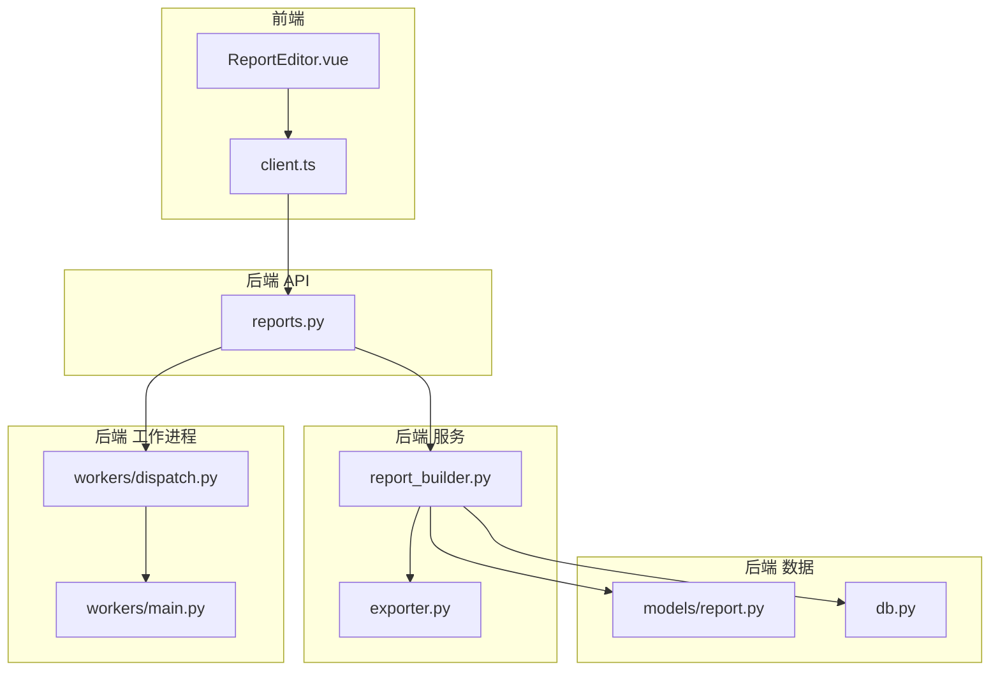
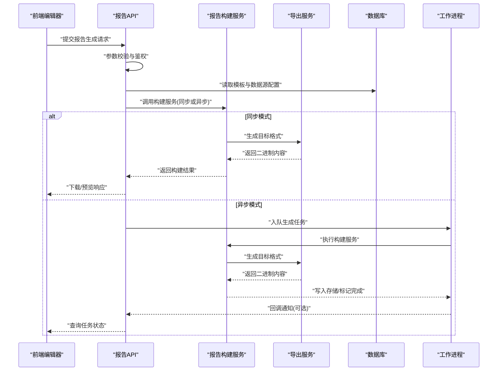
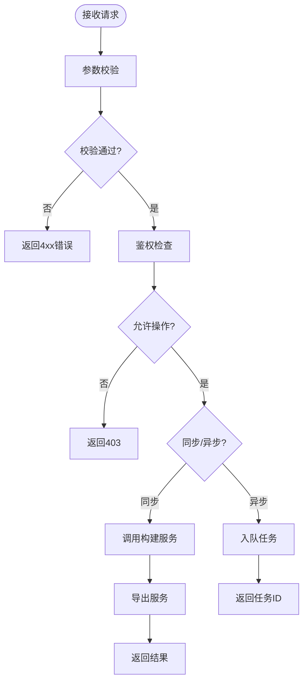
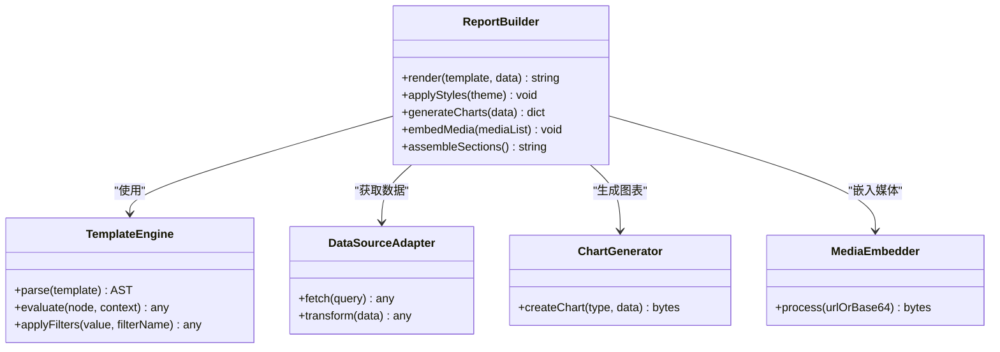
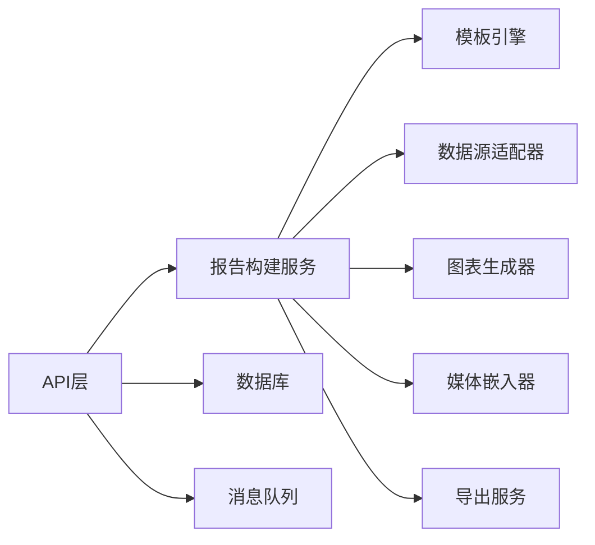

# 报告构建服务

<cite>
**本文引用的文件**   
- [backend/app/api/v1/reports.py](file://backend/app/api/v1/reports.py)
- [backend/app/services/report_builder.py](file://backend/app/services/report_builder.py)
- [backend/app/models/report.py](file://backend/app/models/report.py)
- [backend/app/schemas.py](file://backend/app/schemas.py)
- [backend/app/core/config.py](file://backend/app/core/config.py)
- [backend/app/workers/main.py](file://backend/app/workers/main.py)
- [backend/app/workers/dispatch.py](file://backend/app/workers/dispatch.py)
- [backend/app/services/exporter.py](file://backend/app/services/exporter.py)
- [backend/app/db.py](file://backend/app/db.py)
- [frontend/src/views/ReportEditor.vue](file://frontend/src/views/ReportEditor.vue)
- [frontend/src/api/client.ts](file://frontend/src/api/client.ts)
</cite>

## 目录
1. [简介](#简介)
2. [项目结构](#项目结构)
3. [核心组件](#核心组件)
4. [架构总览](#架构总览)
5. [详细组件分析](#详细组件分析)
6. [依赖关系分析](#依赖关系分析)
7. [性能考虑](#性能考虑)
8. [故障排查指南](#故障排查指南)
9. [结论](#结论)
10. [附录](#附录)

## 简介
本报告构建服务面向企业级安全与合规场景，提供从模板渲染、数据组装到多格式导出的完整能力。系统采用前后端分离架构：前端负责可视化编辑与交互，后端通过API暴露接口，并由工作进程异步执行耗时任务（如大型报告生成）。文档重点阐述模板引擎语法与变量替换、条件渲染、样式应用、图表与多媒体嵌入机制；同时覆盖版本管理、草稿保存、协作编辑支持、性能优化与缓存策略，并提供API使用示例与模板开发最佳实践。

## 项目结构
后端以FastAPI为核心，按功能划分API、服务、模型与配置；报告构建相关逻辑集中在API层与report_builder服务中，导出由exporter服务完成，异步任务由workers模块调度。前端通过Vue与TypeScript实现报告编辑器与列表页，并通过client.ts调用后端API。

**图示来源** 
- [backend/app/api/v1/reports.py](file://backend/app/api/v1/reports.py)
- [backend/app/services/report_builder.py](file://backend/app/services/report_builder.py)
- [backend/app/services/exporter.py](file://backend/app/services/exporter.py)
- [backend/app/models/report.py](file://backend/app/models/report.py)
- [backend/app/db.py](file://backend/app/db.py)
- [backend/app/workers/main.py](file://backend/app/workers/main.py)
- [backend/app/workers/dispatch.py](file://backend/app/workers/dispatch.py)
- [frontend/src/views/ReportEditor.vue](file://frontend/src/views/ReportEditor.vue)
- [frontend/src/api/client.ts](file://frontend/src/api/client.ts)

**章节来源**
- [backend/app/api/v1/reports.py](file://backend/app/api/v1/reports.py)
- [backend/app/services/report_builder.py](file://backend/app/services/report_builder.py)
- [backend/app/services/exporter.py](file://backend/app/services/exporter.py)
- [backend/app/models/report.py](file://backend/app/models/report.py)
- [backend/app/db.py](file://backend/app/db.py)
- [backend/app/workers/main.py](file://backend/app/workers/main.py)
- [backend/app/workers/dispatch.py](file://backend/app/workers/dispatch.py)
- [frontend/src/views/ReportEditor.vue](file://frontend/src/views/ReportEditor.vue)
- [frontend/src/api/client.ts](file://frontend/src/api/client.ts)

## 核心组件
- 报告API层：定义报告创建、更新、预览、导出等REST接口，负责参数校验、权限控制与任务调度。
- 报告构建服务：封装模板解析、变量替换、条件渲染、样式注入、图表与多媒体处理，以及最终内容组装。
- 导出服务：将构建好的内容序列化为PDF、DOCX、HTML等目标格式。
- 数据模型与数据库：持久化报告元数据、版本信息、草稿状态与关联资源。
- 工作进程：异步执行耗时任务，避免阻塞HTTP请求。
- 前端编辑器：可视化编辑报告内容与模板，实时预览并保存草稿。

**章节来源**
- [backend/app/api/v1/reports.py](file://backend/app/api/v1/reports.py)
- [backend/app/services/report_builder.py](file://backend/app/services/report_builder.py)
- [backend/app/services/exporter.py](file://backend/app/services/exporter.py)
- [backend/app/models/report.py](file://backend/app/models/report.py)
- [backend/app/workers/main.py](file://backend/app/workers/main.py)
- [backend/app/workers/dispatch.py](file://backend/app/workers/dispatch.py)
- [frontend/src/views/ReportEditor.vue](file://frontend/src/views/ReportEditor.vue)

## 架构总览
报告构建服务采用“API + 服务 + 工作进程”的分层架构。前端通过REST API触发报告生成，API层进行参数校验后，调用报告构建服务完成模板渲染与内容组装；如需长时间运行，则通过工作进程队列异步执行。导出服务统一处理多格式输出。

**图示来源** 
- [backend/app/api/v1/reports.py](file://backend/app/api/v1/reports.py)
- [backend/app/services/report_builder.py](file://backend/app/services/report_builder.py)
- [backend/app/services/exporter.py](file://backend/app/services/exporter.py)
- [backend/app/db.py](file://backend/app/db.py)
- [backend/app/workers/main.py](file://backend/app/workers/main.py)
- [backend/app/workers/dispatch.py](file://backend/app/workers/dispatch.py)

## 详细组件分析

### 报告API层（reports.py）
- 职责：定义报告相关的REST接口，包括创建、更新、预览、导出、版本切换、草稿保存与协作锁定。
- 关键点：
  - 输入校验：基于Pydantic模型对请求体进行严格校验，确保模板ID、数据源ID、输出格式等必填字段存在且合法。
  - 权限控制：结合用户角色与资源归属，限制非授权访问。
  - 任务调度：对耗时操作（如大型报告导出）采用异步队列，避免阻塞主线程。
  - 错误处理：统一异常映射为HTTP状态码与结构化错误消息。

**图示来源** 
- [backend/app/api/v1/reports.py](file://backend/app/api/v1/reports.py)
- [backend/app/services/report_builder.py](file://backend/app/services/report_builder.py)
- [backend/app/services/exporter.py](file://backend/app/services/exporter.py)

**章节来源**
- [backend/app/api/v1/reports.py](file://backend/app/api/v1/reports.py)

### 报告构建服务（report_builder.py）
- 职责：解析模板、加载数据源、执行变量替换与条件渲染、注入样式、生成图表与嵌入多媒体，最终组装成可导出的内容。
- 模板语法要点：
  - 变量替换：使用占位符语法，如{{ variable }}，支持嵌套对象与数组遍历。
  - 条件渲染：支持if/else分支，根据数据布尔值或空值控制段落显示。
  - 循环渲染：支持for循环遍历集合，动态生成表格行或列表项。
  - 过滤器：内置日期格式化、数值精度、文本截断等常用过滤器。
- 数据源集成：
  - 支持多种数据源（数据库查询、外部API、CSV/Excel导入），通过适配器模式统一接入。
  - 数据预处理：类型转换、缺失值填充、敏感字段脱敏。
- 样式应用：
  - 主题变量：颜色、字体、间距等通过主题配置注入。
  - 局部样式：模板片段内联CSS，支持响应式布局。
- 图表与多媒体：
  - 图表：基于数据生成SVG/PNG，支持折线、柱状、饼图等常见类型。
  - 多媒体：图片、视频、音频的URL或Base64嵌入，自动压缩与懒加载。
- 内容组装：
  - 分块渲染：按章节分块生成，便于增量更新与缓存命中。
  - 版本快照：每次构建生成不可变快照，记录变更摘要与时间戳。

**图示来源** 
- [backend/app/services/report_builder.py](file://backend/app/services/report_builder.py)

**章节来源**
- [backend/app/services/report_builder.py](file://backend/app/services/report_builder.py)

### 导出服务（exporter.py）
- 职责：将构建好的内容转换为PDF、DOCX、HTML等目标格式，处理分页、页眉页脚、目录生成与附件打包。
- 关键点：
  - 格式适配：针对不同目标格式选择合适渲染器（如WeasyPrint用于PDF，python-docx用于DOCX）。
  - 资源优化：图片压缩、字体子集化、外链资源本地化。
  - 错误恢复：渲染失败时回滚中间状态，保证一致性。

**章节来源**
- [backend/app/services/exporter.py](file://backend/app/services/exporter.py)

### 数据模型与数据库（models/report.py, db.py）
- 报告模型：包含标题、描述、模板ID、数据源ID、状态、版本、创建者、更新时间等字段。
- 版本管理：每次成功构建生成新版本记录，支持回滚与对比。
- 草稿与协作：
  - 草稿：未发布的临时版本，支持多人编辑与冲突检测。
  - 协作锁定：编辑时加锁，防止并发修改导致数据不一致。
- 数据库连接：通过SQLAlchemy管理连接池与事务。

**章节来源**
- [backend/app/models/report.py](file://backend/app/models/report.py)
- [backend/app/db.py](file://backend/app/db.py)

### 工作进程（workers/main.py, workers/dispatch.py）
- 职责：消费任务队列，执行报告构建与导出任务，监控任务状态与重试策略。
- 关键点：
  - 任务调度：基于Redis/RabbitMQ等消息队列分发任务。
  - 健康检查：心跳机制与超时处理，失败任务自动重试。
  - 日志与追踪：结构化日志与链路追踪，便于问题定位。

**章节来源**
- [backend/app/workers/main.py](file://backend/app/workers/main.py)
- [backend/app/workers/dispatch.py](file://backend/app/workers/dispatch.py)

### 前端编辑器（ReportEditor.vue, client.ts）
- 职责：提供可视化模板编辑、数据绑定、实时预览、草稿保存与协作编辑界面。
- 关键点：
  - 模板编辑器：语法高亮、自动补全、错误提示。
  - 预览面板：实时渲染模板片段，支持缩放与导出预览。
  - 协作编辑：WebSocket实时更新，冲突解决策略（如最后写入优先或合并策略）。
  - API客户端：封装HTTP请求，统一错误处理与重试逻辑。

**章节来源**
- [frontend/src/views/ReportEditor.vue](file://frontend/src/views/ReportEditor.vue)
- [frontend/src/api/client.ts](file://frontend/src/api/client.ts)

## 依赖关系分析
- 组件耦合：
  - API层依赖构建服务与导出服务，低耦合设计便于扩展新格式与新渲染逻辑。
  - 构建服务依赖模板引擎、数据源适配器、图表生成器与媒体嵌入器，通过接口隔离实现高内聚。
- 外部依赖：
  - 数据库驱动（SQLAlchemy）、消息队列（Redis/RabbitMQ）、渲染引擎（WeasyPrint/python-docx）。
- 潜在循环依赖：
  - 通过分层与接口抽象避免循环引用，确保模块边界清晰。

**图示来源** 
- [backend/app/api/v1/reports.py](file://backend/app/api/v1/reports.py)
- [backend/app/services/report_builder.py](file://backend/app/services/report_builder.py)
- [backend/app/services/exporter.py](file://backend/app/services/exporter.py)
- [backend/app/db.py](file://backend/app/db.py)
- [backend/app/workers/dispatch.py](file://backend/app/workers/dispatch.py)

**章节来源**
- [backend/app/api/v1/reports.py](file://backend/app/api/v1/reports.py)
- [backend/app/services/report_builder.py](file://backend/app/services/report_builder.py)
- [backend/app/services/exporter.py](file://backend/app/services/exporter.py)
- [backend/app/db.py](file://backend/app/db.py)
- [backend/app/workers/dispatch.py](file://backend/app/workers/dispatch.py)

## 性能考虑
- 模板渲染优化：
  - 预编译模板：启动时缓存AST，减少解析开销。
  - 增量渲染：仅重新计算变更节点，利用Diff算法最小化重绘。
- 数据源优化：
  - 查询缓存：对热点数据设置TTL缓存，降低数据库压力。
  - 批量加载：合并多次查询为批量操作，减少网络往返。
- 导出优化：
  - 流式生成：大文件分块写入，避免内存峰值过高。
  - 资源压缩：图片自适应分辨率与格式转换，减小体积。
- 缓存策略：
  - 多级缓存：浏览器缓存、CDN缓存、服务端Redis缓存。
  - 版本化缓存键：基于模板版本与数据指纹生成唯一键，避免脏读。
- 异步与并行：
  - 任务拆分：将报告拆分为多个章节并行构建，提升吞吐。
  - 限流与降级：在高负载下启用排队与优先级队列，保障核心功能可用。

[本节为通用性能指导，不直接分析具体文件]

## 故障排查指南
- 常见问题：
  - 模板语法错误：检查占位符拼写与嵌套层级，确认变量路径正确。
  - 数据源连接失败：验证数据库凭据与网络连通性，检查防火墙规则。
  - 导出失败：确认渲染引擎依赖安装完整，检查系统字体与权限。
  - 协作冲突：查看锁定状态与编辑历史，必要时强制解锁。
- 调试技巧：
  - 启用详细日志：记录模板解析、数据加载、渲染步骤的关键信息。
  - 单元测试：针对模板片段与数据转换器编写用例，快速定位问题。
  - 性能剖析：使用APM工具监控慢查询与渲染瓶颈。

**章节来源**
- [backend/app/api/v1/reports.py](file://backend/app/api/v1/reports.py)
- [backend/app/services/report_builder.py](file://backend/app/services/report_builder.py)
- [backend/app/services/exporter.py](file://backend/app/services/exporter.py)

## 结论
报告构建服务通过模块化设计与异步处理，实现了高效、可扩展的报告生成能力。模板引擎支持丰富的语法与样式定制，数据源集成灵活，导出格式多样。配合版本管理、草稿保存与协作编辑，满足复杂业务场景需求。建议在生产环境中启用缓存与监控，持续优化性能与稳定性。

[本节为总结性内容，不直接分析具体文件]

## 附录

### API使用示例
- 创建报告：POST /api/v1/reports，请求体包含模板ID、数据源ID、输出格式。
- 预览报告：GET /api/v1/reports/{id}/preview，返回HTML预览内容。
- 导出报告：POST /api/v1/reports/{id}/export，返回二进制文件或下载链接。
- 保存草稿：PUT /api/v1/reports/{id}/draft，保存未发布版本。
- 版本切换：PATCH /api/v1/reports/{id}/version，切换到指定版本。

**章节来源**
- [backend/app/api/v1/reports.py](file://backend/app/api/v1/reports.py)
- [frontend/src/api/client.ts](file://frontend/src/api/client.ts)

### 模板开发最佳实践
- 命名规范：变量与函数名使用小写下划线，保持语义清晰。
- 错误处理：在模板中使用默认值与空值检查，避免渲染崩溃。
- 性能优化：避免在循环中进行复杂计算，提前准备数据。
- 样式隔离：使用CSS类名与作用域，避免全局污染。
- 测试驱动：为每个模板片段编写测试用例，确保稳定性。

**章节来源**
- [backend/app/services/report_builder.py](file://backend/app/services/report_builder.py)

### 自定义组件创建方法
- 定义组件接口：明确输入参数、输出格式与副作用。
- 注册组件：在模板引擎中注册自定义标签或过滤器。
- 单元测试：验证组件在不同输入下的行为一致性。
- 文档化：提供使用说明与示例，便于团队协作。

**章节来源**
- [backend/app/services/report_builder.py](file://backend/app/services/report_builder.py)