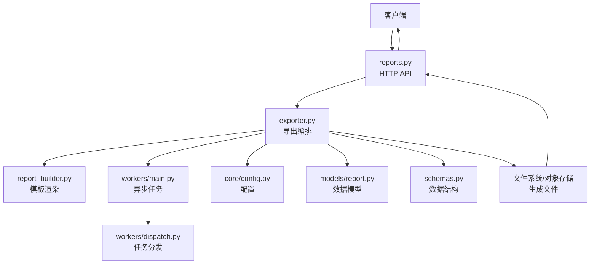
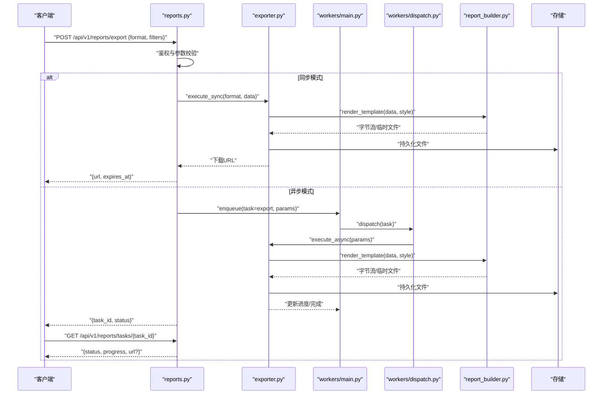
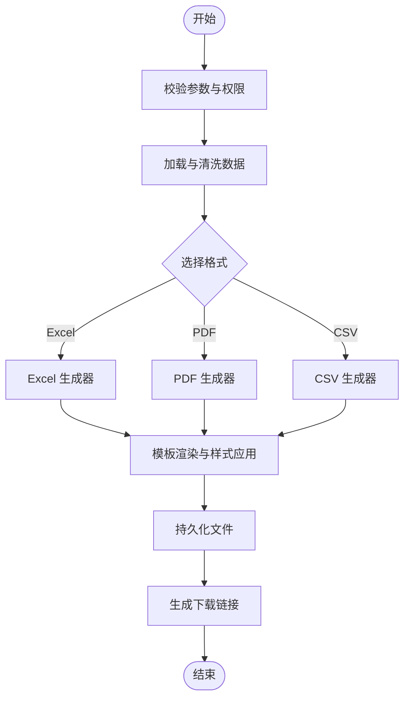
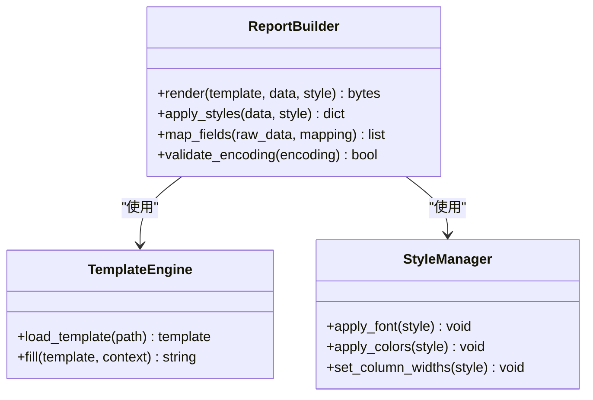
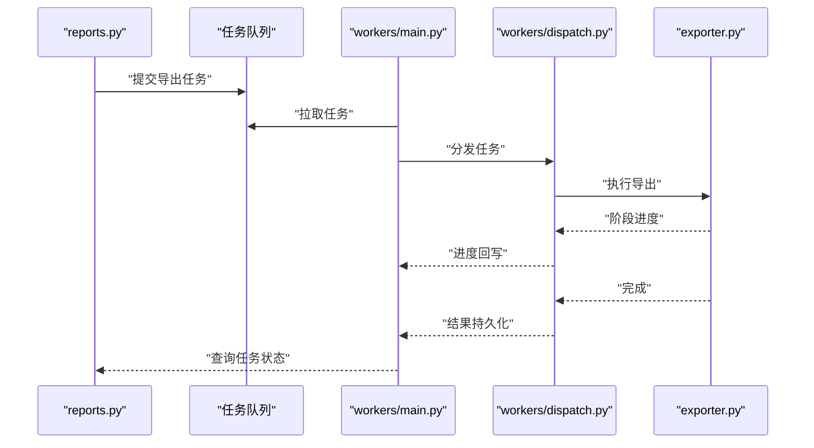
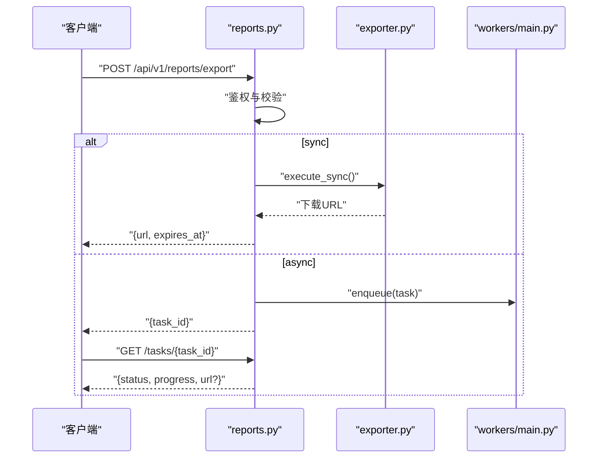
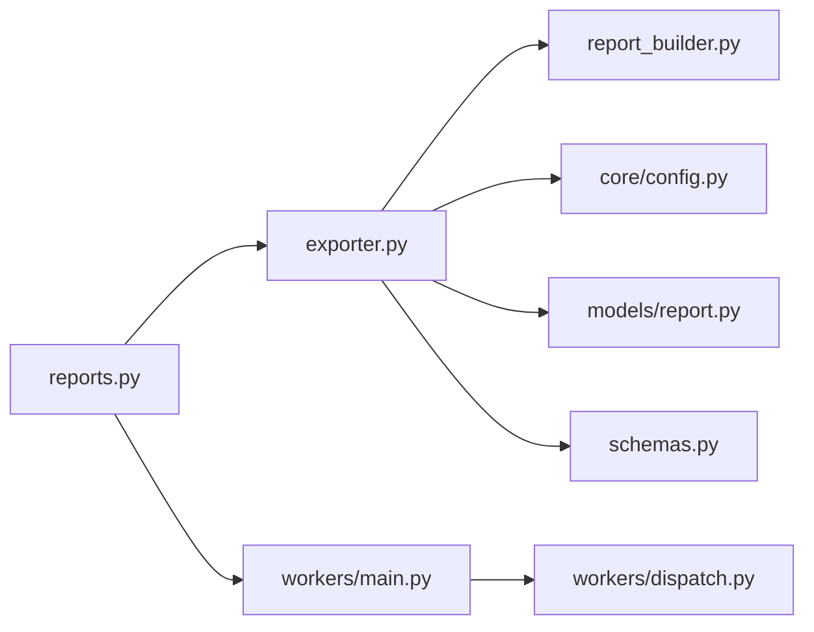

# 数据导出服务

<cite>
**本文引用的文件**   
- [backend/app/services/exporter.py](file://backend/app/services/exporter.py)
- [backend/app/services/report_builder.py](file://backend/app/services/report_builder.py)
- [backend/app/api/v1/reports.py](file://backend/app/api/v1/reports.py)
- [backend/app/workers/main.py](file://backend/app/workers/main.py)
- [backend/app/workers/dispatch.py](file://backend/app/workers/dispatch.py)
- [backend/app/core/config.py](file://backend/app/core/config.py)
- [backend/app/models/report.py](file://backend/app/models/report.py)
- [backend/app/schemas.py](file://backend/app/schemas.py)
</cite>

## 目录
1. [简介](#简介)
2. [项目结构](#项目结构)
3. [核心组件](#核心组件)
4. [架构总览](#架构总览)
5. [详细组件分析](#详细组件分析)
6. [依赖关系分析](#依赖关系分析)
7. [性能考虑](#性能考虑)
8. [故障排查指南](#故障排查指南)
9. [结论](#结论)
10. [附录](#附录) 

## 简介
本文件面向数据导出服务的实现与使用，覆盖以下关键主题：
- 多格式生成：Excel、PDF、CSV 的生成逻辑与适用场景
- 模板引擎与样式定制：模板变量、映射规则与样式配置
- 批量处理与异步任务：队列化执行、进度跟踪与结果回写
- 配置管理与存储策略：导出配置项、文件落盘与下载链接生成
- API 调用示例与自定义模板开发指南
- 大文件处理优化与内存管理最佳实践

## 项目结构
后端采用 FastAPI + Celery（或同类任务队列）架构。导出相关代码主要分布在 services、workers、api 与 core 层：
- services/exporter.py：导出编排与格式生成入口
- services/report_builder.py：报告构建与模板渲染
- api/v1/reports.py：导出相关的 HTTP API
- workers/main.py、dispatch.py：异步任务调度与执行
- core/config.py：系统与环境配置
- models/report.py、schemas.py：数据模型与请求/响应结构

图表来源 
- [backend/app/api/v1/reports.py](file://backend/app/api/v1/reports.py)
- [backend/app/services/exporter.py](file://backend/app/services/exporter.py)
- [backend/app/services/report_builder.py](file://backend/app/services/report_builder.py)
- [backend/app/workers/main.py](file://backend/app/workers/main.py)
- [backend/app/workers/dispatch.py](file://backend/app/workers/dispatch.py)
- [backend/app/core/config.py](file://backend/app/core/config.py)
- [backend/app/models/report.py](file://backend/app/models/report.py)
- [backend/app/schemas.py](file://backend/app/schemas.py)

章节来源
- [backend/app/api/v1/reports.py](file://backend/app/api/v1/reports.py)
- [backend/app/services/exporter.py](file://backend/app/services/exporter.py)
- [backend/app/services/report_builder.py](file://backend/app/services/report_builder.py)
- [backend/app/workers/main.py](file://backend/app/workers/main.py)
- [backend/app/workers/dispatch.py](file://backend/app/workers/dispatch.py)
- [backend/app/core/config.py](file://backend/app/core/config.py)
- [backend/app/models/report.py](file://backend/app/models/report.py)
- [backend/app/schemas.py](file://backend/app/schemas.py)

## 核心组件
- 导出编排器（exporter.py）
  - 职责：接收导出请求参数，选择目标格式，组装数据源，驱动模板渲染，输出文件并返回下载链接
  - 关键点：支持同步与异步两种模式；对大文件采用流式写入；统一错误码与日志
- 报告构建器（report_builder.py）
  - 职责：基于模板引擎渲染内容，应用样式配置，生成 Excel/PDF/CSV 等格式
  - 关键点：模板变量映射、分页/分片渲染、样式注入、编码与字体处理
- 异步任务（workers/main.py、dispatch.py）
  - 职责：将耗时导出任务入队，执行时拉取任务上下文，调用 exporter，更新任务状态与进度
  - 关键点：重试机制、超时控制、进度回写、失败告警
- API 接口（api/v1/reports.py）
  - 职责：校验请求体、鉴权、路由到同步或异步导出流程，返回任务 ID 或文件流
  - 关键点：分页参数、过滤条件、格式选择、限流与配额
- 配置与模型（core/config.py、models/report.py、schemas.py）
  - 职责：集中管理导出相关配置（如存储路径、并发度、模板目录），定义数据模型与校验结构

章节来源
- [backend/app/services/exporter.py](file://backend/app/services/exporter.py)
- [backend/app/services/report_builder.py](file://backend/app/services/report_builder.py)
- [backend/app/workers/main.py](file://backend/app/workers/main.py)
- [backend/app/workers/dispatch.py](file://backend/app/workers/dispatch.py)
- [backend/app/api/v1/reports.py](file://backend/app/api/v1/reports.py)
- [backend/app/core/config.py](file://backend/app/core/config.py)
- [backend/app/models/report.py](file://backend/app/models/report.py)
- [backend/app/schemas.py](file://backend/app/schemas.py)

## 架构总览
导出服务采用“API 编排 + 模板渲染 + 异步任务”的分层设计。同步导出适用于小数据集快速返回；异步导出用于大数据集与复杂报表，通过任务队列保证稳定性与可观测性。

图表来源 
- [backend/app/api/v1/reports.py](file://backend/app/api/v1/reports.py)
- [backend/app/services/exporter.py](file://backend/app/services/exporter.py)
- [backend/app/services/report_builder.py](file://backend/app/services/report_builder.py)
- [backend/app/workers/main.py](file://backend/app/workers/main.py)
- [backend/app/workers/dispatch.py](file://backend/app/workers/dispatch.py)

## 详细组件分析

### 导出编排器（exporter.py）
- 功能要点
  - 根据 format 选择生成器：Excel、PDF、CSV
  - 数据源装配：从数据库/缓存/外部接口聚合数据，支持分页与过滤
  - 模板渲染：调用 report_builder 进行渲染，支持样式注入
  - 文件输出：流式写入磁盘或对象存储，生成下载链接
  - 错误处理：统一异常封装、重试与降级策略
- 关键流程
  - 输入校验 -> 数据加载 -> 模板渲染 -> 文件落盘 -> 链接生成 -> 返回结果
  - 异步模式下，周期性更新任务进度并持久化结果

图表来源 
- [backend/app/services/exporter.py](file://backend/app/services/exporter.py)
- [backend/app/services/report_builder.py](file://backend/app/services/report_builder.py)

章节来源
- [backend/app/services/exporter.py](file://backend/app/services/exporter.py)
- [backend/app/services/report_builder.py](file://backend/app/services/report_builder.py)

### 报告构建器（report_builder.py）
- 功能要点
  - 模板引擎：支持变量替换、循环、条件、格式化函数
  - 数据映射：字段名映射、类型转换、空值处理、单位换算
  - 样式定制：字体、颜色、列宽、表头样式、页眉页脚
  - 格式适配：Excel 单元格类型、PDF 分页与字体嵌入、CSV 编码与分隔符
- 关键流程
  - 解析模板 -> 绑定数据 -> 应用样式 -> 生成目标格式 -> 输出流

图表来源 
- [backend/app/services/report_builder.py](file://backend/app/services/report_builder.py)

章节来源
- [backend/app/services/report_builder.py](file://backend/app/services/report_builder.py)

### 异步任务与调度（workers/main.py、dispatch.py）
- 功能要点
  - 任务入队：API 层将导出任务序列化后入队
  - 任务执行：worker 拉取任务，调用 exporter 执行导出
  - 进度跟踪：周期性上报进度，支持中断与重试
  - 结果回写：完成后更新任务状态与文件 URL
- 关键流程
  - 入队 -> 调度 -> 执行 -> 进度更新 -> 完成回调

图表来源 
- [backend/app/workers/main.py](file://backend/app/workers/main.py)
- [backend/app/workers/dispatch.py](file://backend/app/workers/dispatch.py)
- [backend/app/services/exporter.py](file://backend/app/services/exporter.py)

章节来源
- [backend/app/workers/main.py](file://backend/app/workers/main.py)
- [backend/app/workers/dispatch.py](file://backend/app/workers/dispatch.py)
- [backend/app/services/exporter.py](file://backend/app/services/exporter.py)

### API 接口（api/v1/reports.py）
- 功能要点
  - 导出入口：POST /api/v1/reports/export，支持 format、filters、mode（sync/async）
  - 任务查询：GET /api/v1/reports/tasks/{task_id}，返回状态与进度
  - 下载链接：GET /api/v1/reports/download/{file_id}，带过期时间
- 关键流程
  - 鉴权 -> 参数校验 -> 同步/异步分支 -> 返回结果或任务 ID

图表来源 
- [backend/app/api/v1/reports.py](file://backend/app/api/v1/reports.py)
- [backend/app/services/exporter.py](file://backend/app/services/exporter.py)
- [backend/app/workers/main.py](file://backend/app/workers/main.py)

章节来源
- [backend/app/api/v1/reports.py](file://backend/app/api/v1/reports.py)

### 配置与模型（core/config.py、models/report.py、schemas.py）
- 配置项
  - 存储路径、最大文件大小、并发 worker 数、模板目录、默认样式
- 数据模型
  - 导出任务、文件元信息、模板版本、样式配置
- 请求/响应结构
  - 导出请求体、任务状态、下载链接有效期

章节来源
- [backend/app/core/config.py](file://backend/app/core/config.py)
- [backend/app/models/report.py](file://backend/app/models/report.py)
- [backend/app/schemas.py](file://backend/app/schemas.py)

## 依赖关系分析
- 模块耦合
  - API 层仅依赖 exporter 与 worker 抽象，保持低耦合
  - exporter 依赖 report_builder 与配置/模型，不直接访问数据库
  - workers 通过 dispatch 解耦任务执行细节
- 外部依赖
  - 模板引擎、Excel/PDF/CSV 库、任务队列、对象存储
- 潜在风险
  - 模板渲染阻塞、大文件内存占用、队列积压

图表来源 
- [backend/app/api/v1/reports.py](file://backend/app/api/v1/reports.py)
- [backend/app/services/exporter.py](file://backend/app/services/exporter.py)
- [backend/app/services/report_builder.py](file://backend/app/services/report_builder.py)
- [backend/app/core/config.py](file://backend/app/core/config.py)
- [backend/app/models/report.py](file://backend/app/models/report.py)
- [backend/app/schemas.py](file://backend/app/schemas.py)
- [backend/app/workers/main.py](file://backend/app/workers/main.py)
- [backend/app/workers/dispatch.py](file://backend/app/workers/dispatch.py)

章节来源
- [backend/app/api/v1/reports.py](file://backend/app/api/v1/reports.py)
- [backend/app/services/exporter.py](file://backend/app/services/exporter.py)
- [backend/app/services/report_builder.py](file://backend/app/services/report_builder.py)
- [backend/app/core/config.py](file://backend/app/core/config.py)
- [backend/app/models/report.py](file://backend/app/models/report.py)
- [backend/app/schemas.py](file://backend/app/schemas.py)
- [backend/app/workers/main.py](file://backend/app/workers/main.py)
- [backend/app/workers/dispatch.py](file://backend/app/workers/dispatch.py)

## 性能考虑
- 大文件处理
  - 流式写入：避免一次性加载全部数据到内存
  - 分块渲染：按页/分片渲染模板，降低峰值内存
  - 压缩与延迟上传：先落盘再上传至对象存储
- 并发与队列
  - 合理设置 worker 数量与队列长度，避免资源争用
  - 任务优先级与超时控制，保障关键任务优先
- 模板与样式
  - 预编译模板，减少重复解析开销
  - 样式复用与最小化 CSS/字体，提升渲染速度
- 存储与网络
  - 就近存储与 CDN 加速下载链接
  - 分片下载与断点续传（可选）

[本节为通用指导，无需特定文件引用]

## 故障排查指南
- 常见问题
  - 模板渲染失败：检查模板语法、变量映射与编码
  - 导出超时：增大超时阈值或拆分任务
  - 内存溢出：启用流式写入与分片渲染
  - 下载链接失效：确认过期时间与存储可用性
- 诊断步骤
  - 查看任务状态与进度日志
  - 检查 worker 健康与队列堆积
  - 验证模板与样式配置一致性
  - 核对存储路径与权限

章节来源
- [backend/app/workers/main.py](file://backend/app/workers/main.py)
- [backend/app/workers/dispatch.py](file://backend/app/workers/dispatch.py)
- [backend/app/services/exporter.py](file://backend/app/services/exporter.py)
- [backend/app/services/report_builder.py](file://backend/app/services/report_builder.py)

## 结论
数据导出服务通过清晰的模块化设计与异步任务机制，实现了多格式、可配置、可扩展的导出能力。结合模板引擎与样式定制，满足多样化报表需求；通过流式与大文件优化策略，保障高负载下的稳定性与性能。建议在生产环境完善监控与告警，持续优化模板与渲染路径。

[本节为总结性内容，无需特定文件引用]

## 附录

### API 调用示例（概念性说明）
- 同步导出
  - POST /api/v1/reports/export
  - 请求体包含：format（excel/pdf/csv）、filters（过滤条件）、mode（sync）
  - 响应：{url, expires_at}
- 异步导出
  - POST /api/v1/reports/export
  - 请求体包含：format、filters、mode（async）
  - 响应：{task_id}
  - 查询状态：GET /api/v1/reports/tasks/{task_id}
  - 下载文件：GET /api/v1/reports/download/{file_id}

[本节为概念性说明，无需特定文件引用]

### 自定义导出模板开发指南
- 模板结构
  - 定义变量占位符、循环与条件语句
  - 指定表头、列顺序与数据类型
- 数据映射
  - 建立字段映射表，处理空值与单位换算
  - 支持日期、货币、百分比等格式化
- 样式定制
  - 设置字体、颜色、边框、对齐方式
  - 配置页眉页脚与分页规则
- 测试与验证
  - 使用小样本数据进行端到端测试
  - 校验输出格式与样式一致性

[本节为概念性说明，无需特定文件引用]

### 数据格式与映射规则（概念性说明）
- Excel
  - 单元格类型：文本、数字、日期、公式
  - 样式：列宽、冻结首行、条件格式
- PDF
  - 字体嵌入、分页、页边距、水印
- CSV
  - 编码（UTF-8/BOM）、分隔符、转义字符

[本节为概念性说明，无需特定文件引用]

### 导出配置管理（概念性说明）
- 存储策略
  - 本地磁盘或对象存储，路径命名规范
  - 生命周期管理（自动清理过期文件）
- 并发与限制
  - 最大并发导出数、单任务大小上限
  - 用户级配额与速率限制

[本节为概念性说明，无需特定文件引用]