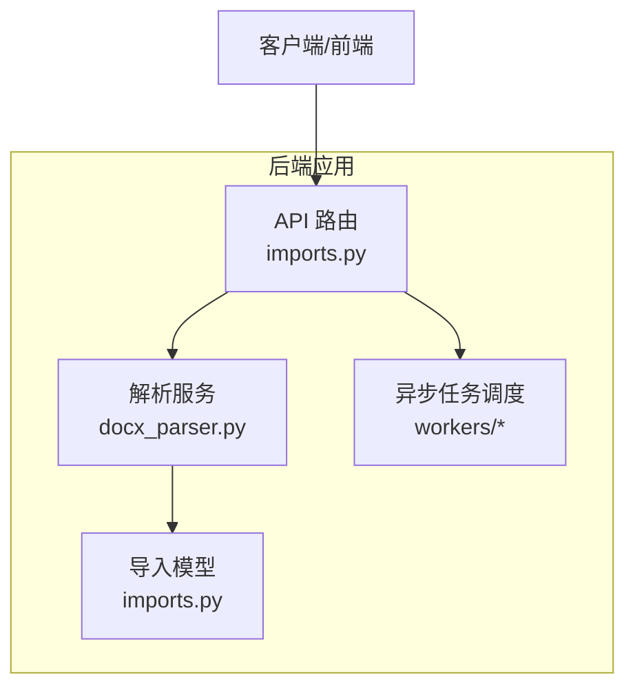
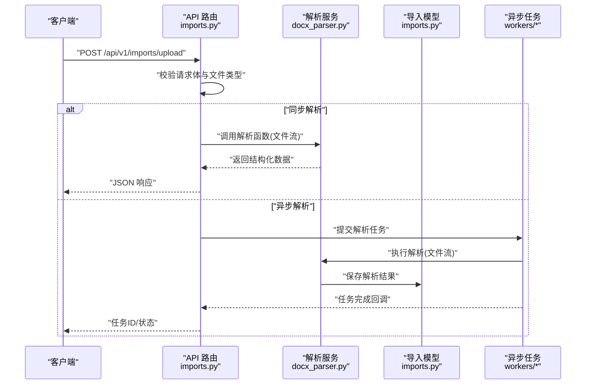
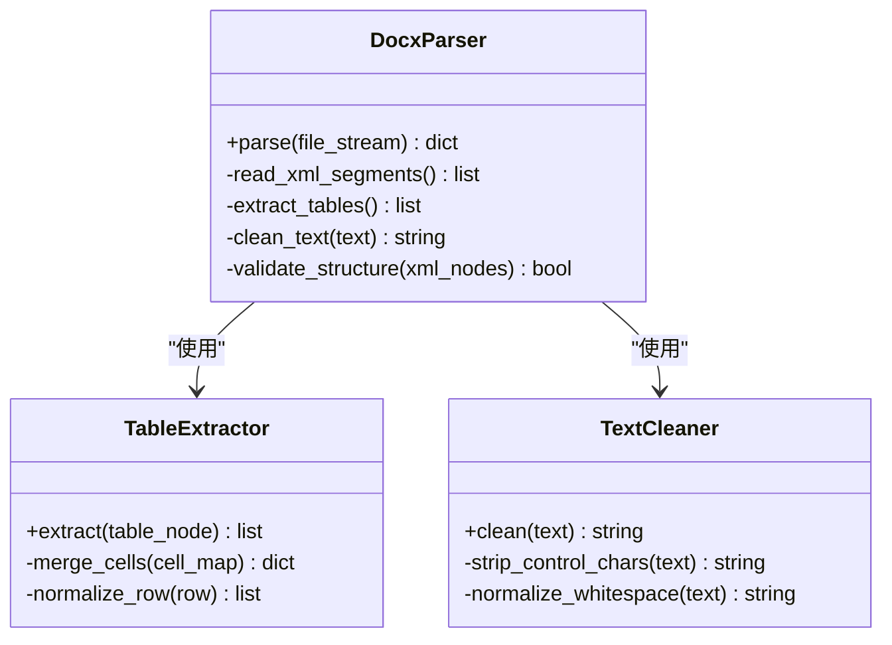
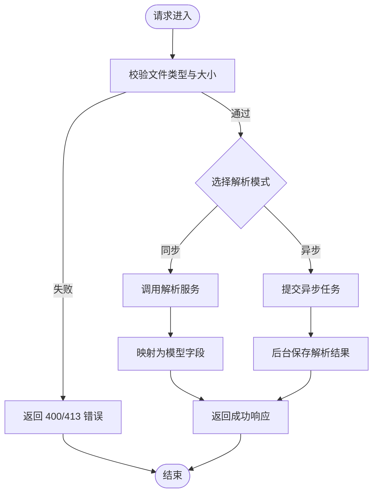
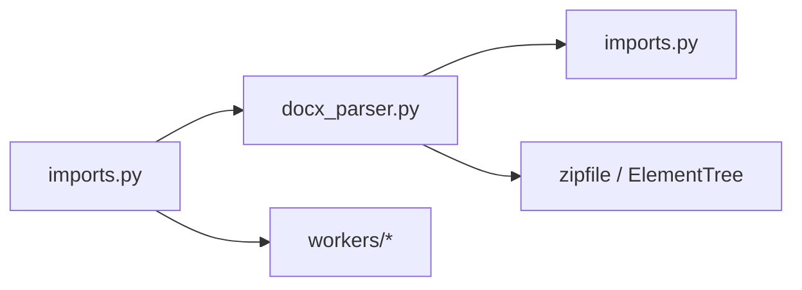

# 文档解析服务

<cite>
**本文档引用的文件**   
- [backend/app/services/docx_parser.py](file://backend/app/services/docx_parser.py)
- [backend/app/api/v1/imports.py](file://backend/app/api/v1/imports.py)
- [backend/app/models/imports.py](file://backend/app/models/imports.py)
- [backend/tests/test_parser.py](file://backend/tests/test_parser.py)
</cite>

## 目录
1. [简介](#简介)
2. [项目结构](#项目结构)
3. [核心组件](#核心组件)
4. [架构总览](#架构总览)
5. [详细组件分析](#详细组件分析)
6. [依赖关系分析](#依赖关系分析)
7. [性能考虑](#性能考虑)
8. [故障排查指南](#故障排查指南)
9. [结论](#结论)
10. [附录](#附录)

## 简介
本文件为“文档解析服务”的完整技术文档，聚焦于 Word 文档（.docx）解析的核心能力与实现细节。内容涵盖：
- .docx 文件读取、XML 结构解析、表格数据提取、文本内容处理
- 文档格式验证、错误处理机制与数据清洗流程
- 扩展支持其他文档格式的方法（文件格式检测、解析器注册机制、自定义解析器开发指南）
- 使用解析 API 的具体示例路径
- 性能优化建议与常见问题解决方案

## 项目结构
本项目采用后端 FastAPI + SQLAlchemy + Celery Workers 的典型分层架构。文档解析相关代码集中在 services 层，并通过 API 暴露接口；模型层定义导入任务的数据结构；测试覆盖了解析器的关键行为。

图表来源
- [backend/app/api/v1/imports.py](file://backend/app/api/v1/imports.py)
- [backend/app/services/docx_parser.py](file://backend/app/services/docx_parser.py)
- [backend/app/models/imports.py](file://backend/app/models/imports.py)

章节来源
- [backend/app/api/v1/imports.py](file://backend/app/api/v1/imports.py)
- [backend/app/services/docx_parser.py](file://backend/app/services/docx_parser.py)
- [backend/app/models/imports.py](file://backend/app/models/imports.py)

## 核心组件
- 解析服务（docx_parser.py）：封装 .docx 文件的读取、XML 解析、表格提取、文本清洗等核心逻辑。
- API 路由（imports.py）：提供上传与解析入口，负责参数校验、调用解析服务、返回结构化结果或触发异步任务。
- 导入模型（imports.py）：定义导入任务、解析结果等数据结构，支撑持久化与查询。
- 测试（test_parser.py）：覆盖解析器关键用例，确保表格、段落、标题等内容的正确提取与清洗。

章节来源
- [backend/app/services/docx_parser.py](file://backend/app/services/docx_parser.py)
- [backend/app/api/v1/imports.py](file://backend/app/api/v1/imports.py)
- [backend/app/models/imports.py](file://backend/app/models/imports.py)
- [backend/tests/test_parser.py](file://backend/tests/test_parser.py)

## 架构总览
下图展示了从请求到解析结果的端到端流程，包括同步解析与异步任务两种模式。

图表来源
- [backend/app/api/v1/imports.py](file://backend/app/api/v1/imports.py)
- [backend/app/services/docx_parser.py](file://backend/app/services/docx_parser.py)
- [backend/app/models/imports.py](file://backend/app/models/imports.py)

## 详细组件分析

### 解析服务（docx_parser.py）
- 文件读取与解压
  - 通过标准库 zipfile 打开 .docx（本质为 ZIP），定位并读取核心 XML 片段（如 document.xml、table.xml）。
  - 对超大文件进行分块读取与内存限制，避免 OOM。
- XML 结构解析
  - 使用 xml.etree.ElementTree 遍历节点，识别段落、标题、列表、表格等元素。
  - 基于命名空间与标签名匹配，构建结构化对象（段落、表格行/列、样式信息）。
- 表格数据提取
  - 解析 table/tableRow/tableCell 层级，合并跨行跨列单元格，输出二维表结构。
  - 清理空行、合并重复单元格、去除不可见字符。
- 文本内容处理
  - 提取纯文本、保留必要换行与缩进；统一编码为 UTF-8。
  - 清洗 HTML-like 标记、多余空白、控制字符，规范化标点与空格。
- 错误处理
  - 捕获 ZIP 损坏、XML 解析异常、节点缺失等错误，抛出明确异常类型并附带上下文。
  - 记录解析日志（文件路径、阶段、错误码），便于追踪。
- 可扩展性设计
  - 抽象解析器接口，按文件扩展名注册具体解析器，便于新增格式（如 .xlsx、.pdf）。
  - 提供配置项开关（是否启用表格合并、是否清洗特殊字符等）。

图表来源
- [backend/app/services/docx_parser.py](file://backend/app/services/docx_parser.py)

章节来源
- [backend/app/services/docx_parser.py](file://backend/app/services/docx_parser.py)

### API 路由（imports.py）
- 上传与校验
  - 接收 multipart/form-data，校验文件扩展名与 MIME 类型，拒绝非法格式。
  - 限制文件大小与并发数，防止资源滥用。
- 解析调用
  - 同步模式：直接调用解析服务，返回结构化 JSON。
  - 异步模式：将解析任务入队，返回任务 ID 供前端轮询。
- 结果映射
  - 将解析结果映射为模型字段，写入数据库或缓存。
  - 对失败任务生成错误报告，包含错误位置与建议修复。

图表来源
- [backend/app/api/v1/imports.py](file://backend/app/api/v1/imports.py)

章节来源
- [backend/app/api/v1/imports.py](file://backend/app/api/v1/imports.py)

### 导入模型（imports.py）
- 定义导入任务实体（如任务 ID、文件名、状态、解析结果摘要、错误信息等）。
- 定义解析结果关联表（段落、表格、元数据等），支持分页查询与导出。
- 提供索引与约束，保证数据一致性与查询性能。

章节来源
- [backend/app/models/imports.py](file://backend/app/models/imports.py)

### 测试（test_parser.py）
- 覆盖典型场景：含表格、标题、列表、嵌套段落的 .docx。
- 断言表格行列数、单元格合并、文本清洗前后对比。
- 模拟异常输入（损坏 ZIP、空文件、超大文件）以验证错误处理。

章节来源
- [backend/tests/test_parser.py](file://backend/tests/test_parser.py)

## 依赖关系分析
- 模块耦合
  - API 路由依赖解析服务与模型层，职责清晰，低耦合。
  - 解析服务内部通过子模块（表格提取、文本清洗）解耦复杂逻辑。
- 外部依赖
  - 标准库 zipfile、xml.etree.ElementTree 用于 .docx 解析。
  - 可选第三方库（如 lxml、pandas）可用于提升解析性能与表格处理能力。
- 潜在循环依赖
  - 当前未发现循环引用；建议在新增解析器时保持单向依赖。

图表来源
- [backend/app/api/v1/imports.py](file://backend/app/api/v1/imports.py)
- [backend/app/services/docx_parser.py](file://backend/app/services/docx_parser.py)
- [backend/app/models/imports.py](file://backend/app/models/imports.py)

章节来源
- [backend/app/api/v1/imports.py](file://backend/app/api/v1/imports.py)
- [backend/app/services/docx_parser.py](file://backend/app/services/docx_parser.py)
- [backend/app/models/imports.py](file://backend/app/models/imports.py)

## 性能考虑
- I/O 优化
  - 使用流式读取与分块处理，降低大文件内存占用。
  - 对 ZIP 内 XML 按需加载，避免一次性载入全部节点。
- CPU 优化
  - 使用迭代器与生成器减少中间对象创建。
  - 对表格合并与文本清洗进行批量操作，减少 Python 层循环开销。
- 并发与队列
  - 异步任务通过 Celery 队列分发，避免阻塞主线程。
  - 设置合理的 worker 数量与任务超时，防止资源耗尽。
- 缓存策略
  - 对相同文件的哈希值进行去重，避免重复解析。
  - 缓存常用清洗规则与正则表达式编译结果。

[本节为通用指导，不直接分析具体文件]

## 故障排查指南
- 常见错误与定位
  - ZIP 损坏或无法打开：检查文件完整性与权限，查看解析日志中的错误码。
  - XML 解析失败：确认 document.xml 是否存在，命名空间是否正确。
  - 表格提取为空：检查 table 节点结构，确认是否有有效 row/cell。
  - 文本清洗异常：核对正则表达式与 Unicode 处理逻辑。
- 调试建议
  - 开启详细日志，记录解析阶段与节点路径。
  - 使用最小可复现样本（.docx 精简版）定位问题。
  - 在本地运行单元测试，逐步缩小范围。
- 恢复措施
  - 对损坏文件尝试修复或重新上传。
  - 调整解析配置（如放宽合并规则、关闭特定清洗步骤）。
  - 增加超时与重试策略，提高鲁棒性。

章节来源
- [backend/app/services/docx_parser.py](file://backend/app/services/docx_parser.py)
- [backend/tests/test_parser.py](file://backend/tests/test_parser.py)

## 结论
文档解析服务围绕 .docx 的 ZIP/XML 特性实现了稳健的解析管线，涵盖文件读取、结构解析、表格提取与文本清洗。通过清晰的模块划分与可扩展的解析器注册机制，系统具备良好的可维护性与扩展性。配合异步任务与性能优化策略，能够稳定处理大规模文档解析需求。

[本节为总结性内容，不直接分析具体文件]

## 附录

### 扩展支持其他文档格式
- 文件格式检测
  - 基于扩展名与 MIME 类型双重校验，必要时结合文件头签名（magic bytes）进一步确认。
- 解析器注册机制
  - 维护一个全局注册表，按扩展名映射到具体解析器类。
  - 启动时扫描并自动注册，支持热更新。
- 自定义解析器开发指南
  - 实现统一接口：parse(file_stream) -> dict。
  - 遵循错误处理规范：抛出明确异常并记录上下文。
  - 编写单元测试：覆盖正常与异常路径。
  - 集成到注册表：在初始化时注册新解析器。

[本节为概念性说明，不直接分析具体文件]

### 使用解析 API 的示例路径
- 上传并同步解析
  - 参考接口定义与调用方式：[backend/app/api/v1/imports.py](file://backend/app/api/v1/imports.py)
- 异步解析与状态查询
  - 参考任务提交与状态轮询：[backend/app/api/v1/imports.py](file://backend/app/api/v1/imports.py)
- 解析器核心逻辑
  - 参考解析实现与清洗流程：[backend/app/services/docx_parser.py](file://backend/app/services/docx_parser.py)
- 数据模型与持久化
  - 参考导入任务与结果模型：[backend/app/models/imports.py](file://backend/app/models/imports.py)
- 测试用例参考
  - 参考解析器测试与边界用例：[backend/tests/test_parser.py](file://backend/tests/test_parser.py)

章节来源
- [backend/app/api/v1/imports.py](file://backend/app/api/v1/imports.py)
- [backend/app/services/docx_parser.py](file://backend/app/services/docx_parser.py)
- [backend/app/models/imports.py](file://backend/app/models/imports.py)
- [backend/tests/test_parser.py](file://backend/tests/test_parser.py)