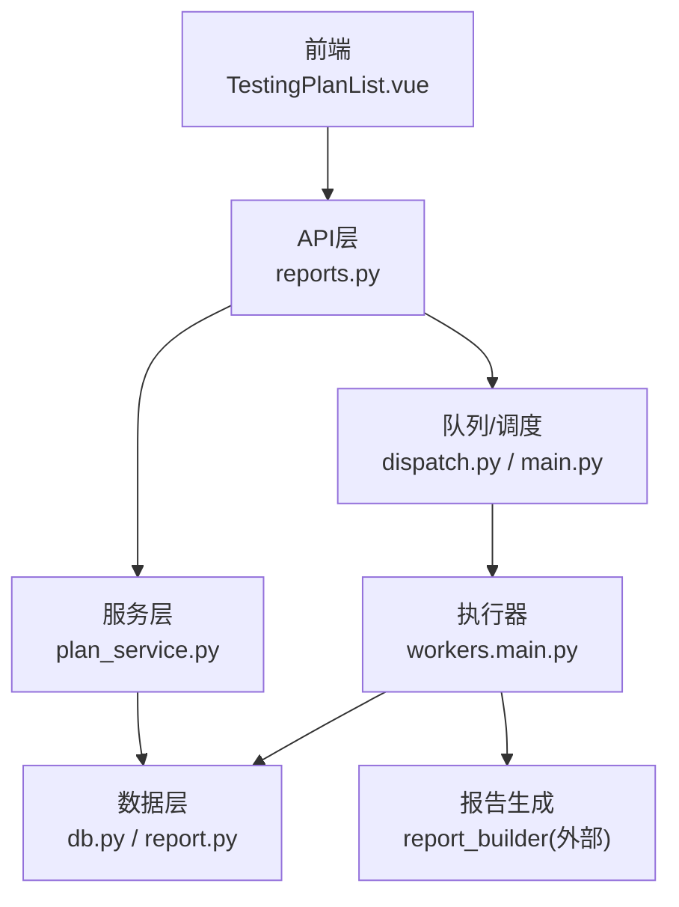
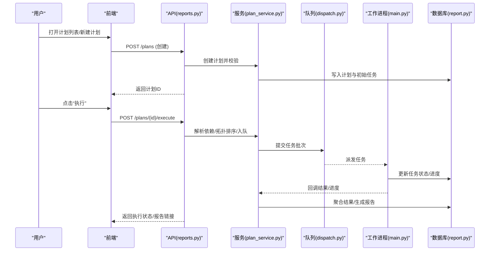
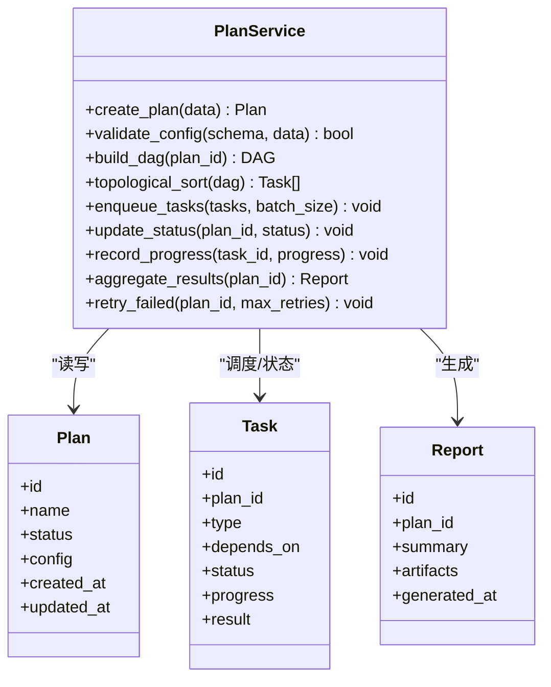
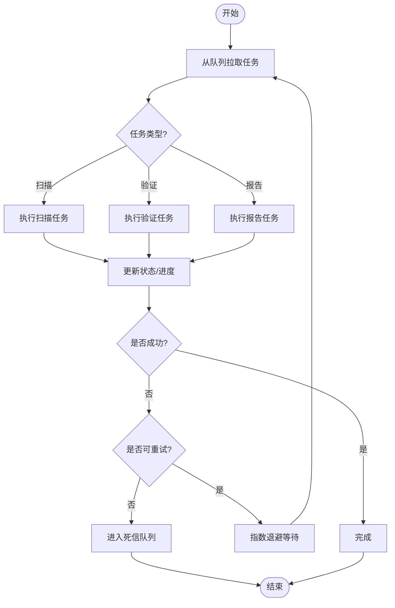
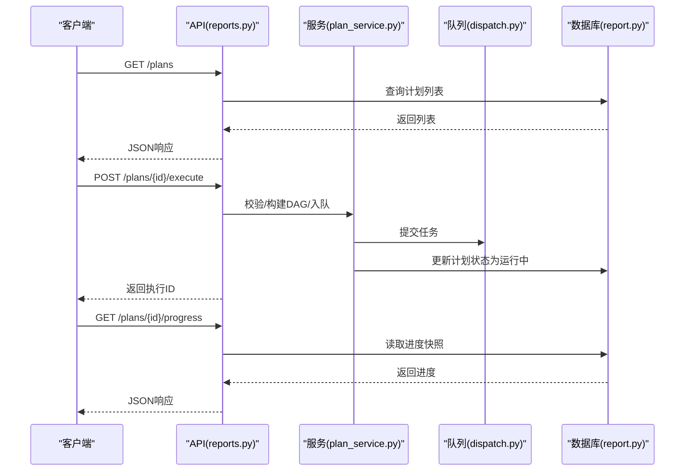
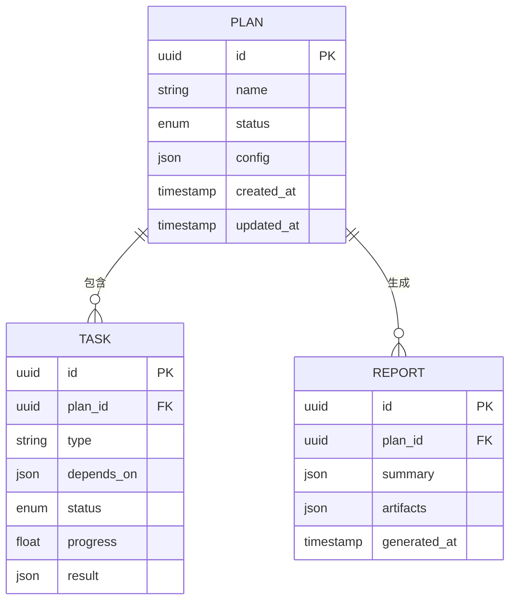
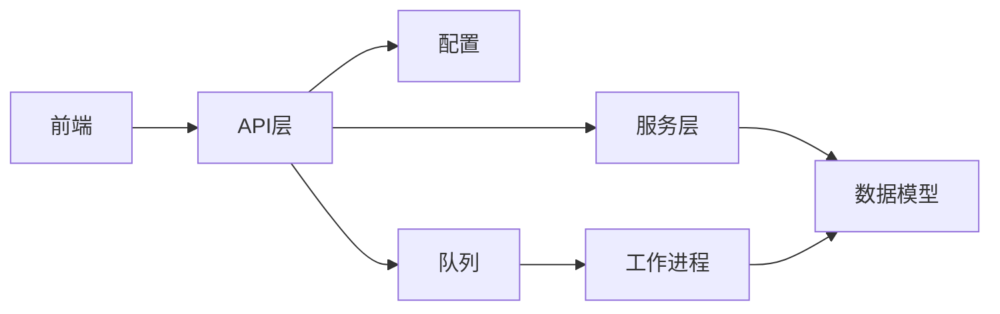

# 测试计划服务

<cite>
**本文档引用的文件**   
- [backend/app/services/plan_service.py](file://backend/app/services/plan_service.py)
- [backend/app/workers/main.py](file://backend/app/workers/main.py)
- [backend/app/workers/dispatch.py](file://backend/app/workers/dispatch.py)
- [backend/app/api/v1/reports.py](file://backend/app/api/v1/reports.py)
- [backend/app/models/report.py](file://backend/app/models/report.py)
- [backend/app/schemas.py](file://backend/app/schemas.py)
- [backend/app/core/config.py](file://backend/app/core/config.py)
- [backend/app/db.py](file://backend/app/db.py)
- [frontend/src/views/TestingPlanList.vue](file://frontend/src/views/TestingPlanList.vue)
- [frontend/src/api/client.ts](file://frontend/src/api/client.ts)
</cite>

## 目录
1. [简介](#简介)
2. [项目结构](#项目结构)
3. [核心组件](#核心组件)
4. [架构总览](#架构总览)
5. [详细组件分析](#详细组件分析)
6. [依赖关系分析](#依赖关系分析)
7. [性能考虑](#性能考虑)
8. [故障排查指南](#故障排查指南)
9. [结论](#结论)
10. [附录](#附录)

## 简介
本文件面向“测试计划服务”的完整技术文档，覆盖计划创建、任务调度、执行状态管理、生命周期管理、依赖处理、并发控制、队列集成、重试与失败处理、进度跟踪、结果收集与报告生成、配置校验（JSON Schema）、分布式执行与负载均衡策略，以及使用示例与扩展开发指南。读者可据此快速理解系统设计与落地实现，并在此基础上进行二次开发与优化。

## 项目结构
后端采用分层架构：API层暴露接口，服务层封装业务逻辑，数据模型与数据库访问分离，工作进程负责异步任务调度与执行；前端提供计划管理与报告查看界面。关键路径如下：
- API层：计划相关接口由报表模块统一对外暴露
- 服务层：测试计划服务负责计划生命周期、依赖解析、调度编排与状态机流转
- 工作进程：基于消息队列的任务分发与执行器
- 数据层：ORM模型与数据库迁移
- 前端：Vue页面与TypeScript客户端调用API

图表来源
- [backend/app/api/v1/reports.py](file://backend/app/api/v1/reports.py)
- [backend/app/services/plan_service.py](file://backend/app/services/plan_service.py)
- [backend/app/workers/dispatch.py](file://backend/app/workers/dispatch.py)
- [backend/app/workers/main.py](file://backend/app/workers/main.py)
- [backend/app/models/report.py](file://backend/app/models/report.py)
- [backend/app/db.py](file://backend/app/db.py)

章节来源
- [backend/app/api/v1/reports.py](file://backend/app/api/v1/reports.py)
- [backend/app/services/plan_service.py](file://backend/app/services/plan_service.py)
- [backend/app/workers/dispatch.py](file://backend/app/workers/dispatch.py)
- [backend/app/workers/main.py](file://backend/app/workers/main.py)
- [backend/app/models/report.py](file://backend/app/models/report.py)
- [backend/app/db.py](file://backend/app/db.py)
- [frontend/src/views/TestingPlanList.vue](file://frontend/src/views/TestingPlanList.vue)
- [frontend/src/api/client.ts](file://frontend/src/api/client.ts)

## 核心组件
- 测试计划服务（plan_service）：定义计划的CRUD、依赖图构建、拓扑排序、调度策略、状态机转换、重试与失败处理、进度上报与结果聚合。
- 工作进程（workers）：消费队列任务，按调度策略执行子任务，更新执行状态与进度，产出结果。
- 报告模块（reports）：对外提供计划查询、触发执行、进度查询、结果下载等接口。
- 数据模型（models）：计划、任务、执行记录、结果等持久化实体。
- 配置（core.config）：队列连接、并发度、重试策略、超时、分片与路由策略等。
- 前端（TestingPlanList.vue + client.ts）：计划列表、创建表单、触发执行、进度轮询、结果展示。

章节来源
- [backend/app/services/plan_service.py](file://backend/app/services/plan_service.py)
- [backend/app/workers/main.py](file://backend/app/workers/main.py)
- [backend/app/workers/dispatch.py](file://backend/app/workers/dispatch.py)
- [backend/app/api/v1/reports.py](file://backend/app/api/v1/reports.py)
- [backend/app/models/report.py](file://backend/app/models/report.py)
- [backend/app/core/config.py](file://backend/app/core/config.py)
- [frontend/src/views/TestingPlanList.vue](file://frontend/src/views/TestingPlanList.vue)
- [frontend/src/api/client.ts](file://frontend/src/api/client.ts)

## 架构总览
测试计划服务采用“API + 服务 + 队列 + 工作进程”的异步架构，支持高并发与可扩展性。计划创建后，服务层将任务拆分为有向无环图（DAG），通过调度器入队，工作进程拉取并执行，期间持续上报进度与结果，最终汇总生成报告。

图表来源
- [backend/app/api/v1/reports.py](file://backend/app/api/v1/reports.py)
- [backend/app/services/plan_service.py](file://backend/app/services/plan_service.py)
- [backend/app/workers/dispatch.py](file://backend/app/workers/dispatch.py)
- [backend/app/workers/main.py](file://backend/app/workers/main.py)
- [backend/app/models/report.py](file://backend/app/models/report.py)

## 详细组件分析

### 计划服务（plan_service）
职责
- 计划生命周期：草稿、待调度、运行中、成功、失败、已取消
- 依赖关系：解析任务依赖，构建DAG，拓扑排序，循环依赖检测
- 调度策略：批大小、并行度、延迟启动、优先级
- 执行状态机：状态转换规则与幂等性保证
- 重试与失败：指数退避、最大重试次数、死信队列
- 进度与结果：增量上报、汇总聚合、断点续跑
- 配置校验：JSON Schema验证输入参数

图表来源
- [backend/app/services/plan_service.py](file://backend/app/services/plan_service.py)
- [backend/app/models/report.py](file://backend/app/models/report.py)

章节来源
- [backend/app/services/plan_service.py](file://backend/app/services/plan_service.py)
- [backend/app/models/report.py](file://backend/app/models/report.py)

### 工作进程与调度（workers）
职责
- 任务分发：从队列拉取任务，按策略路由到执行器
- 执行器：执行具体任务类型，更新状态与进度，处理异常
- 重试策略：失败自动重试，达到上限转入失败分支
- 并发控制：限制并发数，避免资源争用

图表来源
- [backend/app/workers/dispatch.py](file://backend/app/workers/dispatch.py)
- [backend/app/workers/main.py](file://backend/app/workers/main.py)

章节来源
- [backend/app/workers/dispatch.py](file://backend/app/workers/dispatch.py)
- [backend/app/workers/main.py](file://backend/app/workers/main.py)

### API层（reports）
职责
- 计划CRUD：创建、查询、更新、删除
- 执行控制：触发执行、暂停、恢复、取消
- 进度查询：实时获取计划与任务进度
- 结果导出：下载报告、查看摘要

图表来源
- [backend/app/api/v1/reports.py](file://backend/app/api/v1/reports.py)
- [backend/app/services/plan_service.py](file://backend/app/services/plan_service.py)
- [backend/app/workers/dispatch.py](file://backend/app/workers/dispatch.py)
- [backend/app/models/report.py](file://backend/app/models/report.py)

章节来源
- [backend/app/api/v1/reports.py](file://backend/app/api/v1/reports.py)
- [backend/app/services/plan_service.py](file://backend/app/services/plan_service.py)
- [backend/app/models/report.py](file://backend/app/models/report.py)

### 数据模型（models）
- 计划：标识、名称、状态、配置、时间戳
- 任务：所属计划、类型、依赖、状态、进度、结果
- 报告：所属计划、摘要、产物、生成时间

图表来源
- [backend/app/models/report.py](file://backend/app/models/report.py)

章节来源
- [backend/app/models/report.py](file://backend/app/models/report.py)

### 配置与校验（schemas）
- JSON Schema用于计划配置的强类型校验，包括必填字段、枚举值、范围约束、依赖合法性检查
- 校验失败时返回明确错误信息，便于前端提示与调试

章节来源
- [backend/app/schemas.py](file://backend/app/schemas.py)

### 前端交互（TestingPlanList.vue + client.ts）
- 计划列表展示、筛选、分页
- 新建计划表单，绑定Schema校验
- 触发执行与进度轮询
- 结果查看与下载

章节来源
- [frontend/src/views/TestingPlanList.vue](file://frontend/src/views/TestingPlanList.vue)
- [frontend/src/api/client.ts](file://frontend/src/api/client.ts)

## 依赖关系分析
- API层依赖服务层与数据层，服务层依赖模型与配置
- 工作进程依赖调度器与数据库
- 前端依赖API客户端

图表来源
- [backend/app/api/v1/reports.py](file://backend/app/api/v1/reports.py)
- [backend/app/services/plan_service.py](file://backend/app/services/plan_service.py)
- [backend/app/models/report.py](file://backend/app/models/report.py)
- [backend/app/core/config.py](file://backend/app/core/config.py)
- [backend/app/workers/dispatch.py](file://backend/app/workers/dispatch.py)
- [backend/app/workers/main.py](file://backend/app/workers/main.py)

章节来源
- [backend/app/api/v1/reports.py](file://backend/app/api/v1/reports.py)
- [backend/app/services/plan_service.py](file://backend/app/services/plan_service.py)
- [backend/app/models/report.py](file://backend/app/models/report.py)
- [backend/app/core/config.py](file://backend/app/core/config.py)
- [backend/app/workers/dispatch.py](file://backend/app/workers/dispatch.py)
- [backend/app/workers/main.py](file://backend/app/workers/main.py)

## 性能考虑
- 并发控制：通过队列消费者数量与任务批大小调节吞吐
- 依赖优化：DAG拓扑排序减少阻塞，优先执行无依赖任务
- 重试策略：指数退避降低瞬时压力，避免雪崩
- 进度上报：增量更新，避免全量写库
- 结果聚合：批量合并，减少IO开销
- 缓存与索引：对高频查询字段建立索引，必要时引入缓存

[本节为通用指导，不直接分析具体文件]

## 故障排查指南
常见问题与定位步骤
- 计划无法创建：检查JSON Schema校验错误与必填字段
- 执行卡住：查看任务状态与依赖是否满足，确认队列是否有积压
- 任务频繁失败：检查重试次数与死信队列，定位异常日志
- 进度不更新：核对进度上报接口与数据库写入事务
- 报告缺失：确认报告生成任务是否执行成功，产物路径是否正确

建议工具
- 查看队列消费速率与堆积情况
- 监控工作进程健康状态与CPU/内存占用
- 审计数据库事务与锁等待

章节来源
- [backend/app/workers/dispatch.py](file://backend/app/workers/dispatch.py)
- [backend/app/workers/main.py](file://backend/app/workers/main.py)
- [backend/app/models/report.py](file://backend/app/models/report.py)

## 结论
测试计划服务通过清晰的分层与异步调度机制，实现了计划生命周期管理、依赖处理、并发控制与结果聚合。配合JSON Schema校验与完善的重试策略，系统在稳定性与可扩展性方面具备良好基础。后续可在分布式执行、负载均衡与可观测性方面进一步增强。

[本节为总结性内容，不直接分析具体文件]

## 附录

### 使用示例
- 创建计划：调用API提交计划配置，确保符合JSON Schema
- 触发执行：提交执行请求，服务层构建DAG并入队
- 进度查询：轮询进度接口，前端渲染进度条
- 结果下载：报告生成完成后，获取下载链接

章节来源
- [backend/app/api/v1/reports.py](file://backend/app/api/v1/reports.py)
- [frontend/src/api/client.ts](file://frontend/src/api/client.ts)

### 扩展开发指南
- 新增任务类型：在工作进程中注册新的执行器，并在服务层声明依赖关系
- 调整调度策略：修改批大小、并行度与优先级策略
- 增强重试策略：配置最大重试次数与退避算法
- 自定义报告格式：在报告生成模块扩展模板与产物结构

章节来源
- [backend/app/workers/main.py](file://backend/app/workers/main.py)
- [backend/app/services/plan_service.py](file://backend/app/services/plan_service.py)
- [backend/app/schemas.py](file://backend/app/schemas.py)