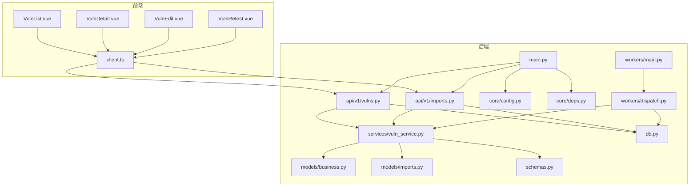
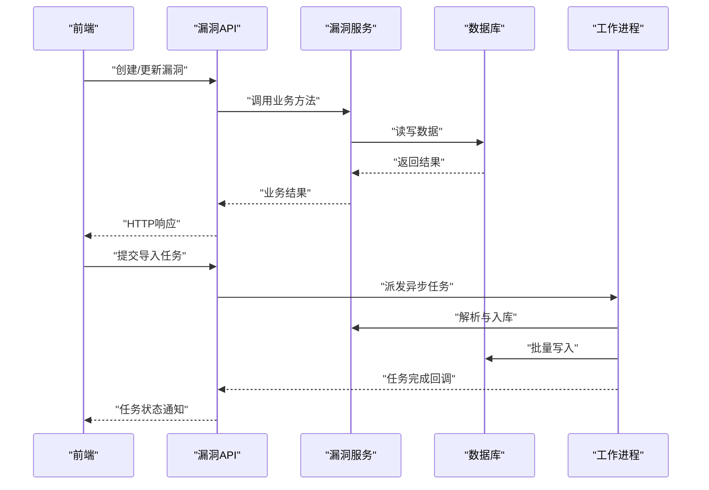
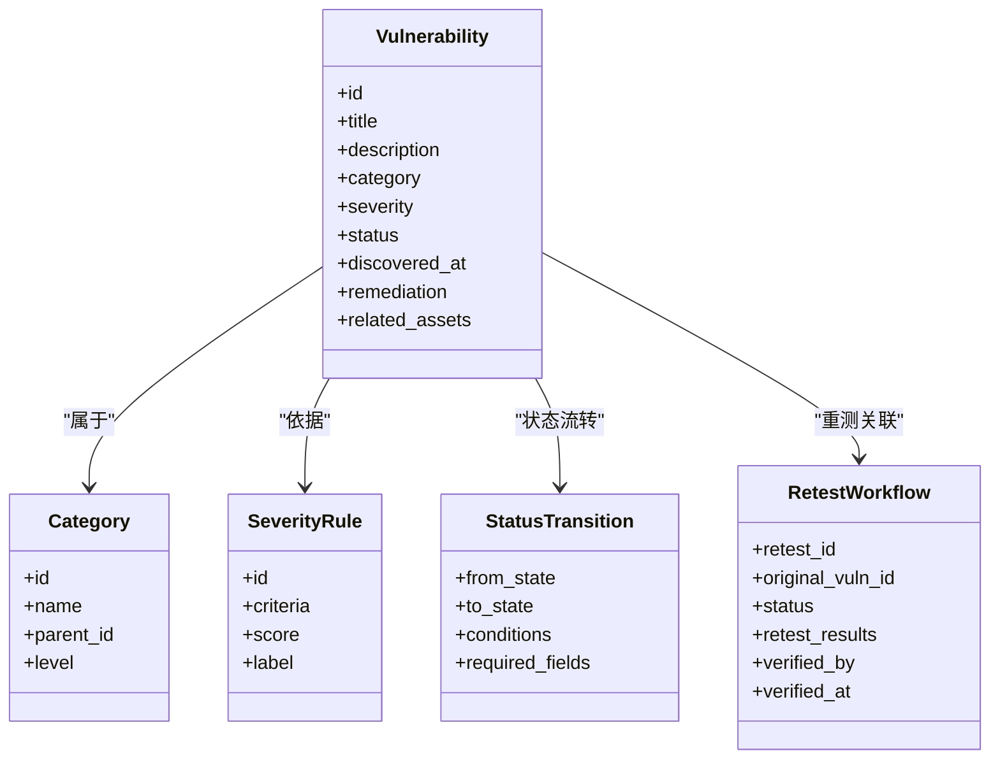
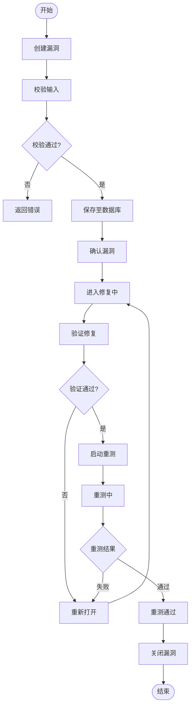
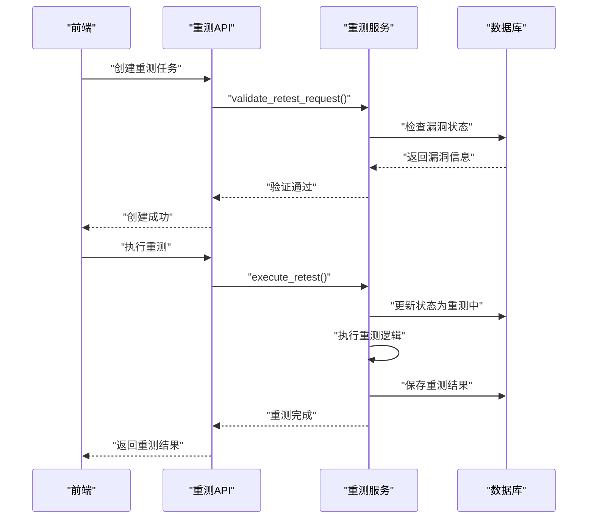
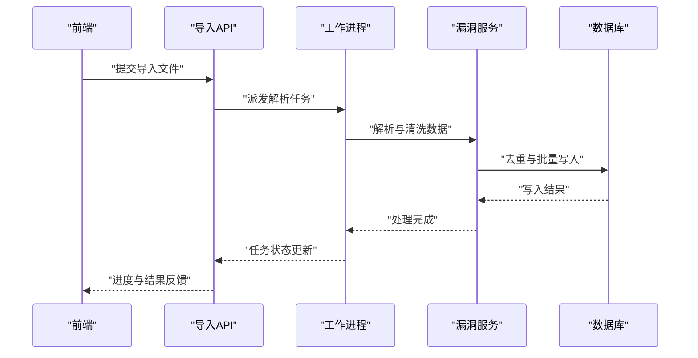
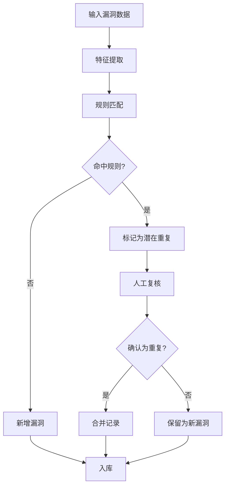
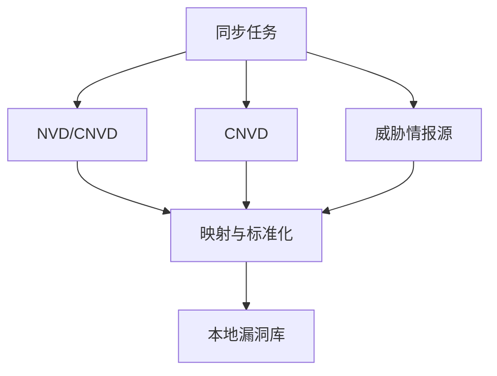
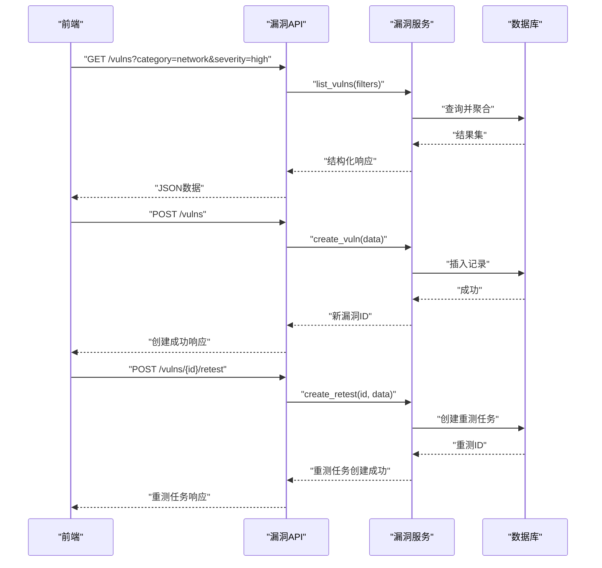
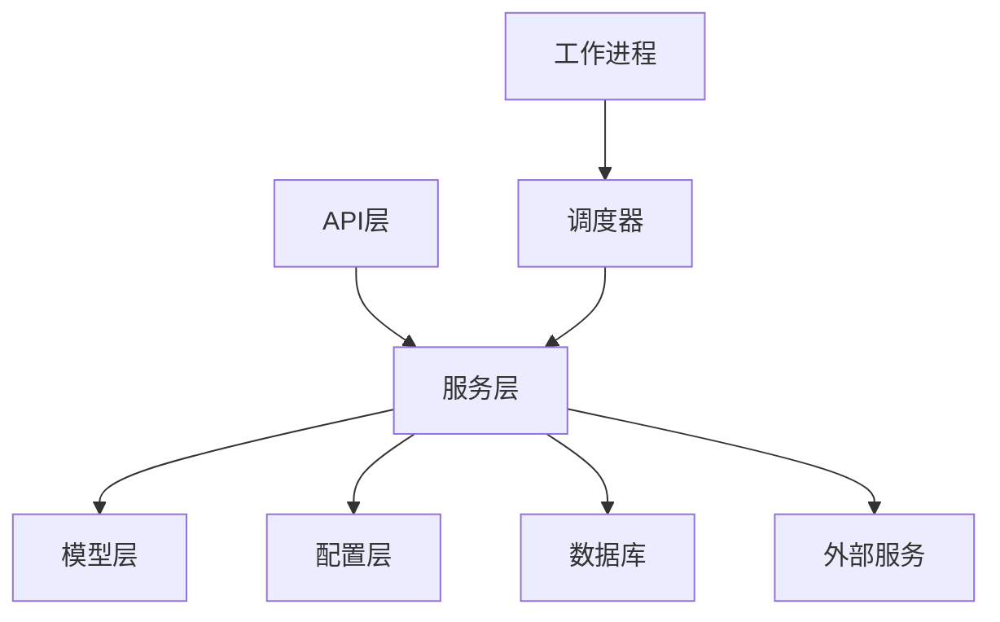

# 漏洞管理服务

<cite>
**本文引用的文件**   
- [backend/app/main.py](file://backend/app/main.py)
- [backend/app/api/v1/vulns.py](file://backend/app/api/v1/vulns.py)
- [backend/app/services/vuln_service.py](file://backend/app/services/vuln_service.py)
- [backend/app/models/business.py](file://backend/app/models/business.py)
- [backend/app/schemas.py](file://backend/app/schemas.py)
- [backend/app/core/config.py](file://backend/app/core/config.py)
- [backend/app/core/deps.py](file://backend/app/core/deps.py)
- [backend/app/db.py](file://backend/app/db.py)
- [backend/app/workers/main.py](file://backend/app/workers/main.py)
- [backend/app/workers/dispatch.py](file://backend/app/workers/dispatch.py)
- [backend/app/api/v1/imports.py](file://backend/app/api/v1/imports.py)
- [backend/app/models/imports.py](file://backend/app/models/imports.py)
- [frontend/src/views/VulnList.vue](file://frontend/src/views/VulnList.vue)
- [frontend/src/views/VulnDetail.vue](file://frontend/src/views/VulnDetail.vue)
- [frontend/src/views/VulnEdit.vue](file://frontend/src/views/VulnEdit.vue)
- [frontend/src/views/VulnRetest.vue](file://frontend/src/views/VulnRetest.vue)
- [frontend/src/api/client.ts](file://frontend/src/api/client.ts)
</cite>

## 更新摘要
**所做更改**   
- 新增重测工作流功能，支持漏洞修复后的重新验证流程
- 增强漏洞状态流转机制，添加"重测中"和"重测通过"状态
- 扩展API接口以支持重测任务的创建、跟踪和管理
- 前端新增重测管理界面，提供完整的重测操作体验

## 目录
1. [简介](#简介)
2. [项目结构](#项目结构)
3. [核心组件](#核心组件)
4. [架构总览](#架构总览)
5. [详细组件分析](#详细组件分析)
6. [依赖关系分析](#依赖关系分析)
7. [性能考虑](#性能考虑)
8. [故障排查指南](#故障排查指南)
9. [结论](#结论)
10. [附录](#附录)

## 简介
本文件面向"漏洞管理服务"的完整文档，围绕漏洞数据的业务逻辑与系统实现展开。内容涵盖：
- 漏洞信息录入、分类管理与严重性评估
- 漏洞状态流转、修复跟踪与验证流程
- **新增：重测工作流，支持漏洞修复后的重新验证**
- 漏洞关联分析、重复检测与智能匹配机制
- 漏洞库同步、CVE集成与威胁情报对接
- 数据模型定义与业务规则配置
- 扫描结果导入与自动化处理流程
- API使用示例与自定义漏洞类型扩展指南

该服务采用前后端分离架构：后端基于FastAPI提供RESTful API，结合SQLAlchemy进行数据持久化；前端基于Vue3+TypeScript构建用户界面，通过HTTP客户端调用后端接口。异步任务由后台工作进程处理导入、同步与批量操作。

## 项目结构
- 后端模块
  - API层：按功能划分路由（如vulns、imports等）
  - 服务层：封装业务逻辑（如vuln_service）
  - 模型层：数据库实体与关系（business、imports等）
  - 配置与安全：应用配置、依赖注入、安全策略
  - 数据库：连接与迁移管理
  - 工作进程：异步任务调度与执行
- 前端模块
  - 视图：漏洞列表、详情、编辑、**重测**等页面
  - 客户端：统一HTTP请求封装
  - 路由与布局：页面导航与整体布局

**图表来源** 
- [backend/app/main.py](file://backend/app/main.py)
- [backend/app/api/v1/vulns.py](file://backend/app/api/v1/vulns.py)
- [backend/app/api/v1/imports.py](file://backend/app/api/v1/imports.py)
- [backend/app/services/vuln_service.py](file://backend/app/services/vuln_service.py)
- [backend/app/models/business.py](file://backend/app/models/business.py)
- [backend/app/models/imports.py](file://backend/app/models/imports.py)
- [backend/app/schemas.py](file://backend/app/schemas.py)
- [backend/app/core/config.py](file://backend/app/core/config.py)
- [backend/app/core/deps.py](file://backend/app/core/deps.py)
- [backend/app/db.py](file://backend/app/db.py)
- [backend/app/workers/main.py](file://backend/app/workers/main.py)
- [backend/app/workers/dispatch.py](file://backend/app/workers/dispatch.py)

**章节来源**
- [backend/app/main.py](file://backend/app/main.py)
- [backend/app/api/v1/vulns.py](file://backend/app/api/v1/vulns.py)
- [backend/app/api/v1/imports.py](file://backend/app/api/v1/imports.py)
- [backend/app/services/vuln_service.py](file://backend/app/services/vuln_service.py)
- [backend/app/models/business.py](file://backend/app/models/business.py)
- [backend/app/models/imports.py](file://backend/app/models/imports.py)
- [backend/app/schemas.py](file://backend/app/schemas.py)
- [backend/app/core/config.py](file://backend/app/core/config.py)
- [backend/app/core/deps.py](file://backend/app/core/deps.py)
- [backend/app/db.py](file://backend/app/db.py)
- [backend/app/workers/main.py](file://backend/app/workers/main.py)
- [backend/app/workers/dispatch.py](file://backend/app/workers/dispatch.py)

## 核心组件
- 漏洞API路由：提供漏洞CRUD、查询过滤、批量操作、状态更新等接口
- 漏洞服务：封装漏洞领域逻辑，包括分类、严重性评估、状态机、去重匹配、关联分析
- **重测工作流：支持漏洞修复后的重新验证流程，包括重测任务创建、执行与结果处理**
- 数据模型：定义漏洞实体、分类、严重性等级、状态枚举、导入记录等
- 导入API与工作进程：接收扫描结果或外部数据，解析并入库，触发后续处理
- 配置与依赖注入：集中管理环境变量、数据库连接、第三方服务接入点
- 前端视图与客户端：展示漏洞列表、详情、编辑表单，发起API请求

**章节来源**
- [backend/app/api/v1/vulns.py](file://backend/app/api/v1/vulns.py)
- [backend/app/services/vuln_service.py](file://backend/app/services/vuln_service.py)
- [backend/app/models/business.py](file://backend/app/models/business.py)
- [backend/app/models/imports.py](file://backend/app/models/imports.py)
- [backend/app/schemas.py](file://backend/app/schemas.py)
- [backend/app/core/config.py](file://backend/app/core/config.py)
- [backend/app/core/deps.py](file://backend/app/core/deps.py)
- [backend/app/db.py](file://backend/app/db.py)
- [backend/app/workers/main.py](file://backend/app/workers/main.py)
- [backend/app/workers/dispatch.py](file://backend/app/workers/dispatch.py)
- [frontend/src/views/VulnList.vue](file://frontend/src/views/VulnList.vue)
- [frontend/src/views/VulnDetail.vue](file://frontend/src/views/VulnDetail.vue)
- [frontend/src/views/VulnEdit.vue](file://frontend/src/views/VulnEdit.vue)
- [frontend/src/views/VulnRetest.vue](file://frontend/src/views/VulnRetest.vue)
- [frontend/src/api/client.ts](file://frontend/src/api/client.ts)

## 架构总览
系统采用分层架构与事件驱动相结合的模式：
- 表现层：前端页面通过HTTP客户端调用后端API
- 控制层：FastAPI路由负责参数校验、权限检查、响应格式化
- 服务层：业务逻辑集中在服务模块，保证高内聚与可测试性
- 数据层：SQLAlchemy模型映射数据库表，支持事务与约束
- 异步层：工作进程处理耗时任务（导入、同步、批量更新），避免阻塞请求

**图表来源** 
- [backend/app/api/v1/vulns.py](file://backend/app/api/v1/vulns.py)
- [backend/app/services/vuln_service.py](file://backend/app/services/vuln_service.py)
- [backend/app/db.py](file://backend/app/db.py)
- [backend/app/workers/main.py](file://backend/app/workers/main.py)
- [backend/app/workers/dispatch.py](file://backend/app/workers/dispatch.py)

## 详细组件分析

### 漏洞数据模型与业务规则
- 漏洞实体：包含标识、标题、描述、分类、严重性等级、状态、发现时间、修复建议、关联资产等字段
- 分类管理：支持多级分类（如网络、应用、配置、供应链），可扩展自定义分类
- 严重性评估：基于CVSS或内部评分规则计算，支持手动调整与审批流程
- 状态机：定义"新建、确认、修复中、已修复、已关闭、作废"等状态及转换条件
- **重测状态：新增"重测中"和"重测通过"状态，支持修复后的重新验证流程**
- 业务规则：可通过配置项控制是否允许覆盖、是否强制填写修复建议、是否启用自动去重等

**图表来源** 
- [backend/app/models/business.py](file://backend/app/models/business.py)
- [backend/app/schemas.py](file://backend/app/schemas.py)

**章节来源**
- [backend/app/models/business.py](file://backend/app/models/business.py)
- [backend/app/schemas.py](file://backend/app/schemas.py)

### 漏洞API与状态流转
- 创建与更新：支持单条与批量操作，包含必填字段校验与默认值填充
- 查询与过滤：按分类、严重性、状态、时间范围、关键词等维度筛选
- 状态流转：提供状态变更接口，内置转换规则校验与审计日志
- 修复跟踪：记录修复动作、责任人、计划完成时间与实际完成时间
- 验证流程：支持标记为"已验证修复"，并可附加证据材料
- **重测流程：新增重测任务创建、执行跟踪与结果验证功能**

**图表来源** 
- [backend/app/api/v1/vulns.py](file://backend/app/api/v1/vulns.py)
- [backend/app/services/vuln_service.py](file://backend/app/services/vuln_service.py)
- [backend/app/models/business.py](file://backend/app/models/business.py)

**章节来源**
- [backend/app/api/v1/vulns.py](file://backend/app/api/v1/vulns.py)
- [backend/app/services/vuln_service.py](file://backend/app/services/vuln_service.py)
- [backend/app/models/business.py](file://backend/app/models/business.py)

### 重测工作流详解
**新增功能**：重测工作流支持漏洞修复后的系统性重新验证，确保修复措施的有效性。

- 重测任务创建：从已修复漏洞创建重测任务，指定重测范围和验证标准
- 重测执行：自动或手动触发重测过程，收集测试结果和证据
- 结果评估：对比重测结果与预期标准，判断修复是否有效
- 状态更新：根据重测结果更新漏洞状态，支持通过或失败两种路径
- 审计追踪：记录完整的重测历史，包括执行人、时间和结果

**图表来源** 
- [backend/app/api/v1/vulns.py](file://backend/app/api/v1/vulns.py)
- [backend/app/services/vuln_service.py](file://backend/app/services/vuln_service.py)
- [backend/app/models/business.py](file://backend/app/models/business.py)

**章节来源**
- [backend/app/api/v1/vulns.py](file://backend/app/api/v1/vulns.py)
- [backend/app/services/vuln_service.py](file://backend/app/services/vuln_service.py)
- [backend/app/models/business.py](file://backend/app/models/business.py)

### 导入与自动化处理流程
- 导入入口：支持上传扫描报告（如JSON/YAML/CSV）、粘贴文本或调用API提交
- 解析器：根据格式选择对应解析器，提取漏洞条目与元数据
- 入库与去重：批量写入前执行重复检测，合并已知漏洞信息
- 任务调度：导入任务交由工作进程异步处理，前端轮询或WebSocket获取进度
- 后续处理：触发分类、严重性评估、关联分析与通知

**图表来源** 
- [backend/app/api/v1/imports.py](file://backend/app/api/v1/imports.py)
- [backend/app/workers/main.py](file://backend/app/workers/main.py)
- [backend/app/workers/dispatch.py](file://backend/app/workers/dispatch.py)
- [backend/app/services/vuln_service.py](file://backend/app/services/vuln_service.py)
- [backend/app/models/imports.py](file://backend/app/models/imports.py)

**章节来源**
- [backend/app/api/v1/imports.py](file://backend/app/api/v1/imports.py)
- [backend/app/workers/main.py](file://backend/app/workers/main.py)
- [backend/app/workers/dispatch.py](file://backend/app/workers/dispatch.py)
- [backend/app/services/vuln_service.py](file://backend/app/services/vuln_service.py)
- [backend/app/models/imports.py](file://backend/app/models/imports.py)

### 关联分析、重复检测与智能匹配
- 关联分析：基于资产、组件版本、技术栈、攻击面等特征建立关联图
- 重复检测：通过CVE编号、标题相似度、指纹哈希、影响范围等多维匹配
- 智能匹配：引入规则引擎与阈值策略，降低误报率，支持人工复核
- 输出结果：生成关联报告与去重建议，供管理员决策

**图表来源** 
- [backend/app/services/vuln_service.py](file://backend/app/services/vuln_service.py)
- [backend/app/models/business.py](file://backend/app/models/business.py)

**章节来源**
- [backend/app/services/vuln_service.py](file://backend/app/services/vuln_service.py)
- [backend/app/models/business.py](file://backend/app/models/business.py)

### 漏洞库同步、CVE集成与威胁情报对接
- 漏洞库同步：定时拉取公开漏洞库（如NVD、CNVD），增量更新本地库
- CVE集成：解析CVE条目，映射到内部分类与严重性规则
- 威胁情报：对接外部情报源，补充攻击手法、IoC、缓解措施
- 一致性保障：冲突解决策略与回滚机制，确保数据完整性

**图表来源** 
- [backend/app/services/vuln_service.py](file://backend/app/services/vuln_service.py)
- [backend/app/core/config.py](file://backend/app/core/config.py)

**章节来源**
- [backend/app/services/vuln_service.py](file://backend/app/services/vuln_service.py)
- [backend/app/core/config.py](file://backend/app/core/config.py)

### API使用示例与前端交互
- 漏洞CRUD：创建、更新、删除、查询、分页、排序、过滤
- 状态操作：确认、修复、验证、关闭、作废
- **重测操作：创建重测任务、执行重测、查看重测结果**
- 导入接口：上传文件、提交URL、查看任务状态
- 前端视图：列表页展示、详情页编辑、批量操作与导出

**图表来源** 
- [backend/app/api/v1/vulns.py](file://backend/app/api/v1/vulns.py)
- [backend/app/services/vuln_service.py](file://backend/app/services/vuln_service.py)
- [backend/app/db.py](file://backend/app/db.py)
- [frontend/src/api/client.ts](file://frontend/src/api/client.ts)
- [frontend/src/views/VulnList.vue](file://frontend/src/views/VulnList.vue)
- [frontend/src/views/VulnDetail.vue](file://frontend/src/views/VulnDetail.vue)
- [frontend/src/views/VulnEdit.vue](file://frontend/src/views/VulnEdit.vue)
- [frontend/src/views/VulnRetest.vue](file://frontend/src/views/VulnRetest.vue)

**章节来源**
- [backend/app/api/v1/vulns.py](file://backend/app/api/v1/vulns.py)
- [backend/app/services/vuln_service.py](file://backend/app/services/vuln_service.py)
- [backend/app/db.py](file://backend/app/db.py)
- [frontend/src/api/client.ts](file://frontend/src/api/client.ts)
- [frontend/src/views/VulnList.vue](file://frontend/src/views/VulnList.vue)
- [frontend/src/views/VulnDetail.vue](file://frontend/src/views/VulnDetail.vue)
- [frontend/src/views/VulnEdit.vue](file://frontend/src/views/VulnEdit.vue)
- [frontend/src/views/VulnRetest.vue](file://frontend/src/views/VulnRetest.vue)

### 自定义漏洞类型扩展指南
- 扩展点：在分类与严重性规则中新增类型与评分策略
- 配置项：通过配置文件或数据库字典注册新类型
- 解析器：为新的导入格式编写解析器并注册到调度器
- 前端适配：在表单与列表中增加字段与展示逻辑
- 测试用例：覆盖新增类型的边界条件与异常路径

**章节来源**
- [backend/app/models/business.py](file://backend/app/models/business.py)
- [backend/app/schemas.py](file://backend/app/schemas.py)
- [backend/app/core/config.py](file://backend/app/core/config.py)
- [backend/app/api/v1/imports.py](file://backend/app/api/v1/imports.py)
- [backend/app/workers/dispatch.py](file://backend/app/workers/dispatch.py)
- [frontend/src/views/VulnEdit.vue](file://frontend/src/views/VulnEdit.vue)

## 依赖关系分析
- 模块耦合
  - API层依赖服务层，服务层依赖模型与配置
  - 工作进程依赖调度器与服务层，解耦主线程
- 外部依赖
  - 数据库：SQLAlchemy与迁移工具
  - 第三方服务：漏洞库、CVE、威胁情报源的HTTP客户端
- 循环依赖
  - 通过依赖注入与接口抽象避免循环引用

**图表来源** 
- [backend/app/api/v1/vulns.py](file://backend/app/api/v1/vulns.py)
- [backend/app/services/vuln_service.py](file://backend/app/services/vuln_service.py)
- [backend/app/models/business.py](file://backend/app/models/business.py)
- [backend/app/core/config.py](file://backend/app/core/config.py)
- [backend/app/workers/main.py](file://backend/app/workers/main.py)
- [backend/app/workers/dispatch.py](file://backend/app/workers/dispatch.py)
- [backend/app/db.py](file://backend/app/db.py)

**章节来源**
- [backend/app/api/v1/vulns.py](file://backend/app/api/v1/vulns.py)
- [backend/app/services/vuln_service.py](file://backend/app/services/vuln_service.py)
- [backend/app/models/business.py](file://backend/app/models/business.py)
- [backend/app/core/config.py](file://backend/app/core/config.py)
- [backend/app/workers/main.py](file://backend/app/workers/main.py)
- [backend/app/workers/dispatch.py](file://backend/app/workers/dispatch.py)
- [backend/app/db.py](file://backend/app/db.py)

## 性能考虑
- 数据库优化：合理使用索引、分页查询、批量写入与事务合并
- 异步处理：将耗时任务（导入、同步、分析）放入工作进程，避免阻塞
- 缓存策略：对热点数据（分类、严重性规则）进行缓存
- 资源限制：设置并发上限、超时与重试策略，防止雪崩
- 监控告警：关键指标采集与异常告警，便于定位瓶颈

## 故障排查指南
- 常见错误
  - 导入失败：检查文件格式、编码、字段映射与解析器配置
  - 状态流转异常：核对状态机规则与权限控制
  - 重复检测误报：调整匹配阈值与规则优先级
  - **重测失败：检查漏洞状态、重测配置和执行权限**
- 调试手段
  - 启用详细日志，关注服务层与数据库层日志
  - 使用测试用例复现问题，逐步缩小范围
  - 检查外部服务连通性与限流策略
- 恢复策略
  - 数据回滚与补偿任务
  - 清理脏数据与重建索引
  - 重启工作进程与清理队列

**章节来源**
- [backend/app/services/vuln_service.py](file://backend/app/services/vuln_service.py)
- [backend/app/workers/dispatch.py](file://backend/app/workers/dispatch.py)
- [backend/app/db.py](file://backend/app/db.py)

## 结论
本漏洞管理服务以清晰的层次结构与模块化设计，实现了从数据录入、分类与严重性评估，到状态流转、修复跟踪与验证的全流程管理。**新增的重测工作流功能进一步增强了系统的完整性，确保漏洞修复的有效性和可靠性**。通过导入与自动化处理、关联分析与去重、以及漏洞库与情报集成，提升了运营效率与准确性。未来可在智能匹配、可视化分析与合规报表方面持续演进。

## 附录
- 术语表
  - 漏洞：指系统中存在的安全缺陷或风险点
  - 严重性：衡量漏洞危害程度的指标，通常基于CVSS或内部规则
  - 状态机：定义漏洞生命周期各状态及其转换规则
  - 导入：将外部扫描结果或数据源转换为内部标准格式并入库的过程
  - **重测：漏洞修复后进行的系统性重新验证过程**
- 最佳实践
  - 统一数据模型与命名规范
  - 严格校验输入与输出
  - 保持状态流转的可追溯性
  - 定期同步与校验外部数据源
  - **建立完善的重测流程和验证标准**