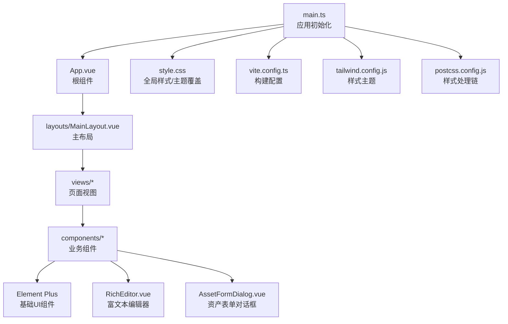
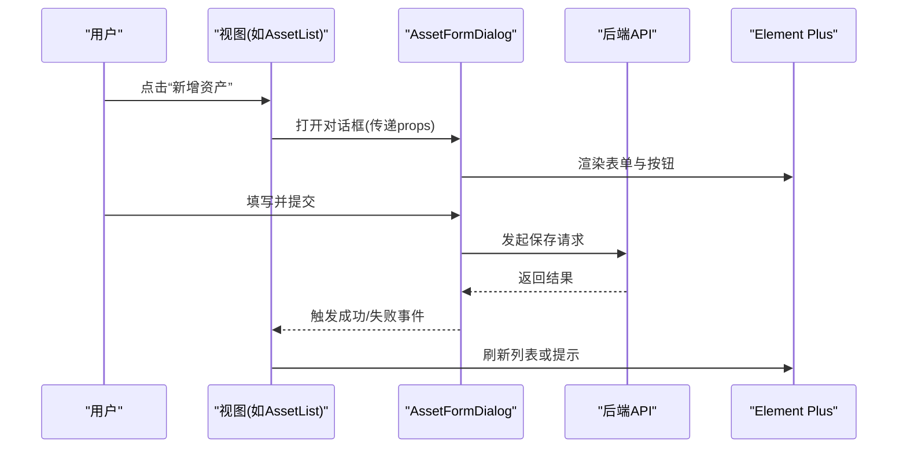
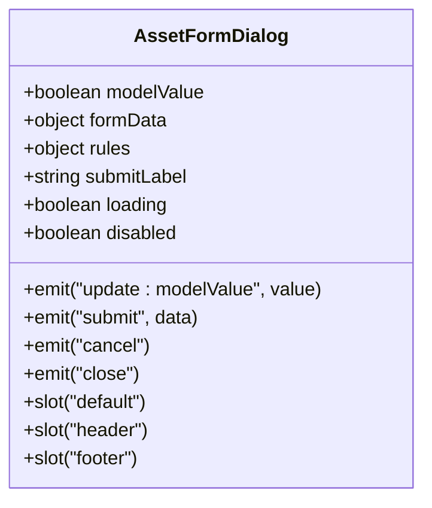
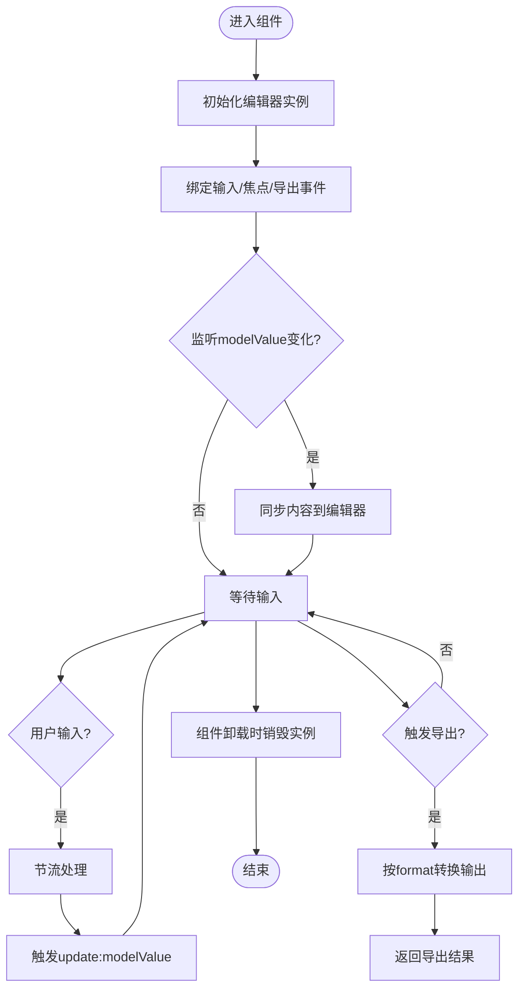
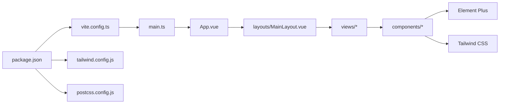

# UI组件库使用

<cite>
**本文档引用的文件**   
- [frontend/src/components/AssetFormDialog.vue](file://frontend/src/components/AssetFormDialog.vue)
- [frontend/src/components/RichEditor.vue](file://frontend/src/components/RichEditor.vue)
- [frontend/src/layouts/MainLayout.vue](file://frontend/src/layouts/MainLayout.vue)
- [frontend/src/views/AssetList.vue](file://frontend/src/views/AssetList.vue)
- [frontend/src/views/Dashboard.vue](file://frontend/src/views/Dashboard.vue)
- [frontend/src/views/Login.vue](file://frontend/src/views/Login.vue)
- [frontend/src/views/ReportEditor.vue](file://frontend/src/views/ReportEditor.vue)
- [frontend/src/App.vue](file://frontend/src/App.vue)
- [frontend/src/main.ts](file://frontend/src/main.ts)
- [frontend/src/style.css](file://frontend/src/style.css)
- [frontend/vite.config.ts](file://frontend/vite.config.ts)
- [frontend/tailwind.config.js](file://frontend/tailwind.config.js)
- [frontend/postcss.config.js](file://frontend/postcss.config.js)
- [frontend/package.json](file://frontend/package.json)
</cite>

## 目录
1. [简介](#简介)
2. [项目结构](#项目结构)
3. [核心组件](#核心组件)
4. [架构总览](#架构总览)
5. [详细组件分析](#详细组件分析)
6. [依赖分析](#依赖分析)
7. [性能考虑](#性能考虑)
8. [故障排查指南](#故障排查指南)
9. [结论](#结论)
10. [附录](#附录)

## 简介
本文件面向Talos前端UI组件库的使用与扩展，聚焦基于Element Plus的UI配置、主题定制、样式覆盖与组件扩展。文档围绕项目中自定义组件的开发规范展开，包括AssetFormDialog对话框组件与RichEditor富文本编辑器的实现模式，系统说明props定义、事件处理、插槽使用与生命周期管理，并给出响应式设计与移动端适配的最佳实践，以及组件复用与组合模式的示例路径。

## 项目结构
前端采用Vue 3 + TypeScript + Vite构建，UI框架为Element Plus，样式体系由Tailwind CSS与PostCSS协同。核心目录：
- components：业务级可复用组件（如AssetFormDialog、RichEditor）
- layouts：页面布局容器（MainLayout）
- views：页面视图（登录、资产列表、报告编辑器等）
- main.ts：应用入口，负责初始化Element Plus、路由、状态与全局样式
- style.css：全局样式与主题变量覆盖
- vite.config.ts：Vite构建配置
- tailwind.config.js：Tailwind主题与插件配置
- postcss.config.js：PostCSS处理链

图表来源
- [frontend/src/main.ts](file://frontend/src/main.ts)
- [frontend/src/App.vue](file://frontend/src/App.vue)
- [frontend/src/layouts/MainLayout.vue](file://frontend/src/layouts/MainLayout.vue)
- [frontend/src/style.css](file://frontend/src/style.css)
- [frontend/vite.config.ts](file://frontend/vite.config.ts)
- [frontend/tailwind.config.js](file://frontend/tailwind.config.js)
- [frontend/postcss.config.js](file://frontend/postcss.config.js)

章节来源
- [frontend/src/main.ts](file://frontend/src/main.ts)
- [frontend/src/App.vue](file://frontend/src/App.vue)
- [frontend/src/style.css](file://frontend/src/style.css)
- [frontend/vite.config.ts](file://frontend/vite.config.ts)
- [frontend/tailwind.config.js](file://frontend/tailwind.config.js)
- [frontend/postcss.config.js](file://frontend/postcss.config.js)

## 核心组件
- AssetFormDialog：封装资产新增/编辑的对话框，包含表单校验、提交回调、取消与关闭事件、加载态控制。
- RichEditor：基于Element Plus的富文本编辑器封装，提供工具栏配置、内容双向绑定、输入事件、导出HTML/Markdown能力。

章节来源
- [frontend/src/components/AssetFormDialog.vue](file://frontend/src/components/AssetFormDialog.vue)
- [frontend/src/components/RichEditor.vue](file://frontend/src/components/RichEditor.vue)

## 架构总览
整体采用“页面视图 -> 布局容器 -> 业务组件 -> Element Plus”的分层结构。main.ts统一注册Element Plus与全局样式；App.vue作为根组件挂载路由与布局；各视图通过组合业务组件完成交互；样式通过style.css与Tailwind进行主题化与覆盖。

图表来源
- [frontend/src/views/AssetList.vue](file://frontend/src/views/AssetList.vue)
- [frontend/src/components/AssetFormDialog.vue](file://frontend/src/components/AssetFormDialog.vue)

## 详细组件分析

### AssetFormDialog 组件
职责与边界
- 负责资产数据的录入与校验，向上暴露提交与关闭事件，向下调用API或服务层。
- 通过Element Plus的表单与消息组件完成交互反馈。

Props设计建议
- modelValue：是否显示对话框
- formData：表单数据对象（支持v-model双向绑定）
- rules：表单校验规则
- submitLabel：提交按钮文案
- loading：提交中状态
- disabled：禁用提交按钮

事件设计建议
- update:modelValue：控制对话框显隐
- submit：提交成功后回传数据
- cancel：取消操作
- close：对话框关闭时触发

插槽设计建议
- 默认插槽：用于插入额外表单字段或操作区
- 顶部/底部插槽：用于标题与操作按钮区域

生命周期与副作用
- onMounted：初始化表单数据或加载字典
- onUnmounted：清理定时器、订阅与事件监听

响应式与移动端适配
- 使用Element Plus栅格与表单布局，在小屏下自动堆叠
- 对话框宽度在移动端自适应，必要时切换全屏模式

图表来源
- [frontend/src/components/AssetFormDialog.vue](file://frontend/src/components/AssetFormDialog.vue)

章节来源
- [frontend/src/components/AssetFormDialog.vue](file://frontend/src/components/AssetFormDialog.vue)

### RichEditor 组件
职责与边界
- 封装富文本编辑能力，统一工具栏配置、内容同步、输入节流与导出格式。
- 对外暴露value、事件与导出方法，便于上层页面集成。

Props设计建议
- modelValue：编辑器内容（支持v-model）
- placeholder：占位符
- height：编辑器高度
- toolbarOptions：工具栏配置项
- readOnly：只读模式
- exportFormat：导出格式（HTML/Markdown）

事件设计建议
- update:modelValue：内容变化事件
- input：原始输入事件
- blur/focus：焦点事件
- export：导出回调

插槽设计建议
- 默认插槽：用于插入自定义工具栏或辅助控件

生命周期与副作用
- onMounted：初始化编辑器实例
- onUnmounted：销毁实例、移除事件监听
- watch(modelValue)：外部更新内容时的同步策略

响应式与移动端适配
- 小屏设备隐藏部分工具栏按钮，保留常用功能
- 编辑器高度根据屏幕尺寸动态调整

图表来源
- [frontend/src/components/RichEditor.vue](file://frontend/src/components/RichEditor.vue)

章节来源
- [frontend/src/components/RichEditor.vue](file://frontend/src/components/RichEditor.vue)

### MainLayout 布局组件
职责与边界
- 提供侧边导航、顶部栏与内容区域的布局骨架
- 统一管理路由跳转、面包屑与页面标题

响应式与移动端适配
- 侧边栏在小屏折叠为抽屉
- 内容区域自适应宽度，保证可读性

章节来源
- [frontend/src/layouts/MainLayout.vue](file://frontend/src/layouts/MainLayout.vue)

### 视图与页面集成
- AssetList：展示资产列表，集成AssetFormDialog进行新增/编辑
- ReportEditor：集成RichEditor进行报告内容编辑
- Login/Dashboard：演示Element Plus基础组件与布局用法

章节来源
- [frontend/src/views/AssetList.vue](file://frontend/src/views/AssetList.vue)
- [frontend/src/views/ReportEditor.vue](file://frontend/src/views/ReportEditor.vue)
- [frontend/src/views/Login.vue](file://frontend/src/views/Login.vue)
- [frontend/src/views/Dashboard.vue](file://frontend/src/views/Dashboard.vue)

## 依赖分析
- 运行时依赖
  - Vue 3 + TypeScript：组件与类型安全
  - Element Plus：UI组件库与主题系统
  - Tailwind CSS：原子化样式与响应式
  - PostCSS：样式预处理链
- 构建依赖
  - Vite：开发与构建工具
  - package.json：脚本与依赖声明

图表来源
- [frontend/package.json](file://frontend/package.json)
- [frontend/vite.config.ts](file://frontend/vite.config.ts)
- [frontend/tailwind.config.js](file://frontend/tailwind.config.js)
- [frontend/postcss.config.js](file://frontend/postcss.config.js)
- [frontend/src/main.ts](file://frontend/src/main.ts)
- [frontend/src/App.vue](file://frontend/src/App.vue)
- [frontend/src/layouts/MainLayout.vue](file://frontend/src/layouts/MainLayout.vue)
- [frontend/src/components/AssetFormDialog.vue](file://frontend/src/components/AssetFormDialog.vue)
- [frontend/src/components/RichEditor.vue](file://frontend/src/components/RichEditor.vue)

章节来源
- [frontend/package.json](file://frontend/package.json)
- [frontend/vite.config.ts](file://frontend/vite.config.ts)
- [frontend/tailwind.config.js](file://frontend/tailwind.config.js)
- [frontend/postcss.config.js](file://frontend/postcss.config.js)
- [frontend/src/main.ts](file://frontend/src/main.ts)
- [frontend/src/App.vue](file://frontend/src/App.vue)

## 性能考虑
- 组件懒加载：对重型组件（如富文本编辑器）按需引入与懒加载，减少首屏体积
- 事件节流与防抖：富文本输入与搜索场景使用节流/防抖降低渲染压力
- 虚拟滚动：大数据列表使用虚拟滚动提升渲染性能
- 图片与资源优化：启用压缩与CDN缓存，避免阻塞渲染
- 样式隔离：使用Scoped样式与CSS变量，减少重排重绘

[本节为通用指导，不直接分析具体文件]

## 故障排查指南
常见问题与定位思路
- Element Plus主题未生效
  - 检查main.ts是否正确注册Element Plus与主题变量
  - 确认style.css中的CSS变量覆盖优先级
- 表单校验无效
  - 检查rules定义与表单字段绑定
  - 确保调用validate前表单已挂载
- 富文本编辑器内容不同步
  - 检查watch与内部状态同步逻辑
  - 确认只读模式与disabled状态影响
- 移动端布局错乱
  - 检查栅格与断点设置
  - 验证Tailwind响应式类名与媒体查询

章节来源
- [frontend/src/main.ts](file://frontend/src/main.ts)
- [frontend/src/style.css](file://frontend/src/style.css)
- [frontend/src/components/AssetFormDialog.vue](file://frontend/src/components/AssetFormDialog.vue)
- [frontend/src/components/RichEditor.vue](file://frontend/src/components/RichEditor.vue)

## 结论
通过统一的Element Plus主题与Tailwind样式体系，结合Vue 3的组合式API，Talos前端实现了高内聚、低耦合的组件库。AssetFormDialog与RichEditor展示了标准的组件开发范式：清晰的props与事件、合理的插槽设计、完善的生命周期管理与响应式适配。遵循本文档的规范与最佳实践，可快速扩展更多可复用组件，提升开发效率与一致性。

[本节为总结性内容，不直接分析具体文件]

## 附录
- 主题定制要点
  - 在style.css中覆盖Element Plus CSS变量，统一品牌色与字体
  - 在tailwind.config.js中扩展颜色与间距，保持设计一致性
- 组件复用模式
  - 表单型组件：以modelValue与update:modelValue为核心，配合rules与插槽扩展
  - 编辑器型组件：以value与input事件为核心，提供导出方法与工具栏配置
- 组合模式示例路径
  - 视图层组合：在AssetList中组合AssetFormDialog与列表组件
  - 编辑器组合：在ReportEditor中组合RichEditor与导出按钮

章节来源
- [frontend/src/style.css](file://frontend/src/style.css)
- [frontend/tailwind.config.js](file://frontend/tailwind.config.js)
- [frontend/src/views/AssetList.vue](file://frontend/src/views/AssetList.vue)
- [frontend/src/views/ReportEditor.vue](file://frontend/src/views/ReportEditor.vue)
- [frontend/src/components/AssetFormDialog.vue](file://frontend/src/components/AssetFormDialog.vue)
- [frontend/src/components/RichEditor.vue](file://frontend/src/components/RichEditor.vue)