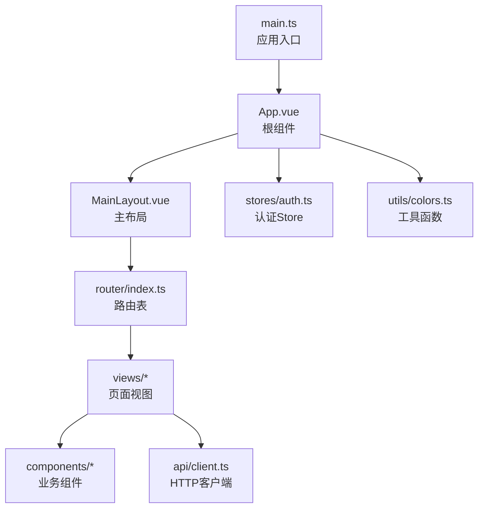
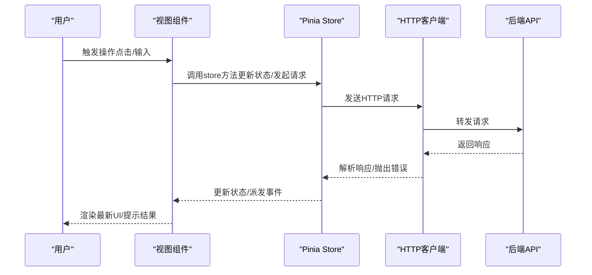
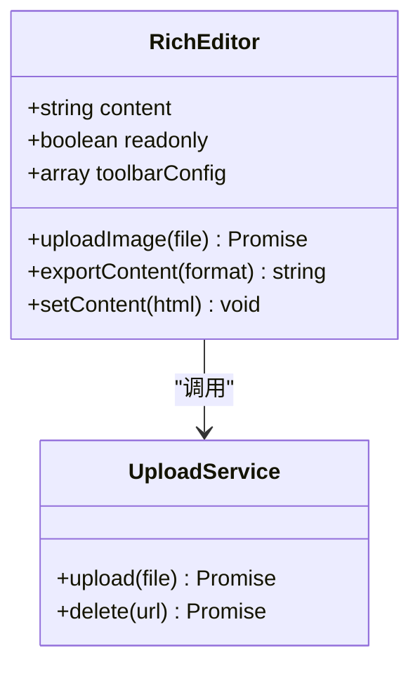
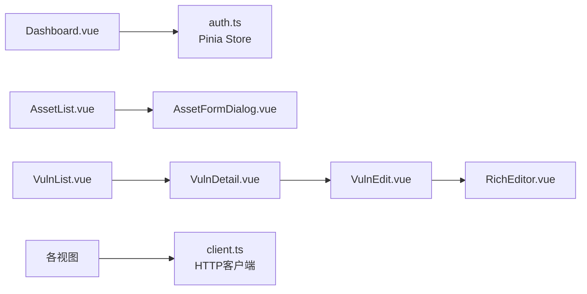
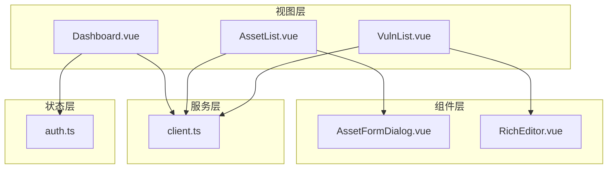

# 前端组件

<cite>
**本文引用的文件**   
- [frontend/src/main.ts](file://frontend/src/main.ts)
- [frontend/src/App.vue](file://frontend/src/App.vue)
- [frontend/src/layouts/MainLayout.vue](file://frontend/src/layouts/MainLayout.vue)
- [frontend/src/router/index.ts](file://frontend/src/router/index.ts)
- [frontend/src/stores/auth.ts](file://frontend/src/stores/auth.ts)
- [frontend/src/api/client.ts](file://frontend/src/api/client.ts)
- [frontend/src/components/AssetFormDialog.vue](file://frontend/src/components/AssetFormDialog.vue)
- [frontend/src/components/RichEditor.vue](file://frontend/src/components/RichEditor.vue)
- [frontend/src/views/Dashboard.vue](file://frontend/src/views/Dashboard.vue)
- [frontend/src/views/AssetList.vue](file://frontend/src/views/AssetList.vue)
- [frontend/src/views/VulnList.vue](file://frontend/src/views/VulnList.vue)
- [frontend/src/views/VulnDetail.vue](file://frontend/src/views/VulnDetail.vue)
- [frontend/src/views/VulnEdit.vue](file://frontend/src/views/VulnEdit.vue)
- [frontend/src/views/Login.vue](file://frontend/src/views/Login.vue)
- [frontend/src/views/ReportList.vue](file://frontend/src/views/ReportList.vue)
- [frontend/src/views/ImportList.vue](file://frontend/src/views/ImportList.vue)
- [frontend/src/views/ImportPreview.vue](file://frontend/src/views/ImportPreview.vue)
- [frontend/src/views/RemoteTestingList.vue](file://frontend/src/views/RemoteTestingList.vue)
- [frontend/src/views/TestingPlanList.vue](file://frontend/src/views/TestingPlanList.vue)
- [frontend/src/views/SpringActionList.vue](file://frontend/src/views/SpringActionList.vue)
- [frontend/src/views/UserList.vue](file://frontend/src/views/UserList.vue)
- [frontend/src/utils/colors.ts](file://frontend/src/utils/colors.ts)
- [frontend/package.json](file://frontend/package.json)
</cite>

## 目录
1. [简介](#简介)
2. [项目结构](#项目结构)
3. [核心组件](#核心组件)
4. [架构总览](#架构总览)
5. [详细组件分析](#详细组件分析)
6. [依赖关系分析](#依赖关系分析)
7. [性能考虑](#性能考虑)
8. [故障排查指南](#故障排查指南)
9. [结论](#结论)
10. [附录](#附录)

## 简介
本文件面向Talos前端Vue3项目的组件与页面开发，聚焦基于Element Plus的UI使用规范、自定义组件开发约定、核心业务组件（资产表单对话框、富文本编辑器）的实现与用法、页面级组件的组织方式（仪表盘、资产列表、漏洞管理等）、状态管理（Pinia store）与数据流、路由配置与导航逻辑、组件通信与事件处理、样式定制与主题配置、响应式设计与移动端适配最佳实践。文档力求在技术深度与可读性之间取得平衡，帮助初学者快速上手，同时为有经验的开发者提供可追溯的代码级参考。

## 项目结构
前端采用Vue3 + TypeScript + Vite构建，UI库使用Element Plus，样式体系结合Tailwind CSS进行原子化布局与主题扩展。整体目录按“功能域”划分：
- src/main.ts：应用入口，初始化Vue实例、插件、全局样式与主题
- src/App.vue：根组件，承载路由视图与全局布局
- src/layouts/MainLayout.vue：主布局，包含侧边栏、顶部导航、内容区等
- src/router/index.ts：路由表定义与守卫逻辑
- src/stores/auth.ts：认证相关Pinia Store
- src/api/client.ts：HTTP客户端封装（请求拦截、错误处理、统一响应）
- src/components：通用业务组件（如资产表单对话框、富文本编辑器）
- src/views：页面级视图（仪表盘、资产列表、漏洞管理等）
- src/utils：工具函数（颜色、格式化等）
- package.json：依赖与脚本

图表来源
- [frontend/src/main.ts](file://frontend/src/main.ts)
- [frontend/src/App.vue](file://frontend/src/App.vue)
- [frontend/src/layouts/MainLayout.vue](file://frontend/src/layouts/MainLayout.vue)
- [frontend/src/router/index.ts](file://frontend/src/router/index.ts)
- [frontend/src/stores/auth.ts](file://frontend/src/stores/auth.ts)
- [frontend/src/api/client.ts](file://frontend/src/api/client.ts)
- [frontend/src/utils/colors.ts](file://frontend/src/utils/colors.ts)

章节来源
- [frontend/src/main.ts](file://frontend/src/main.ts)
- [frontend/src/App.vue](file://frontend/src/App.vue)
- [frontend/src/layouts/MainLayout.vue](file://frontend/src/layouts/MainLayout.vue)
- [frontend/src/router/index.ts](file://frontend/src/router/index.ts)
- [frontend/package.json](file://frontend/package.json)

## 核心组件
本节聚焦两个关键业务组件：资产表单对话框与富文本编辑器。它们体现了Element Plus的使用范式与自定义组件的开发约定。

- 资产表单对话框（AssetFormDialog.vue）
  - 职责：以对话框形式展示资产的新增/编辑表单，负责字段校验、提交与结果回传
  - 输入输出：通过props接收初始数据与模式（新增/编辑），通过emits触发保存成功或取消事件
  - Element Plus使用：el-dialog、el-form、el-form-item、el-input、el-select、el-date-picker等；表单校验规则集中定义
  - 交互流程：打开对话框→填充数据→用户编辑→校验→提交→关闭并回调父组件
  - 错误处理：网络异常与业务错误统一提示；表单校验失败时定位到首个错误项

- 富文本编辑器（RichEditor.vue）
  - 职责：提供富文本编辑能力，用于报告、说明等内容的编辑与预览
  - 输入输出：v-model双向绑定内容；支持工具栏配置、图片上传、导出HTML/Markdown
  - Element Plus集成：可与el-upload配合实现图片上传；与主题系统联动
  - 性能优化：防抖保存、按需加载编辑器资源、懒渲染大内容
  - 可访问性：键盘导航、ARIA属性、屏幕阅读器友好

章节来源
- [frontend/src/components/AssetFormDialog.vue](file://frontend/src/components/AssetFormDialog.vue)
- [frontend/src/components/RichEditor.vue](file://frontend/src/components/RichEditor.vue)

## 架构总览
前端采用“视图-组件-状态-服务”的分层架构：
- 视图层（views）：页面级组件，组合多个业务组件，处理路由参数与页面状态
- 组件层（components）：可复用的业务组件，遵循单一职责与明确接口
- 状态层（stores）：Pinia管理全局与模块状态，提供响应式数据与副作用方法
- 服务层（api）：HTTP客户端封装，统一请求/响应处理与错误策略

图表来源
- [frontend/src/views/Dashboard.vue](file://frontend/src/views/Dashboard.vue)
- [frontend/src/stores/auth.ts](file://frontend/src/stores/auth.ts)
- [frontend/src/api/client.ts](file://frontend/src/api/client.ts)

章节来源
- [frontend/src/views/Dashboard.vue](file://frontend/src/views/Dashboard.vue)
- [frontend/src/stores/auth.ts](file://frontend/src/stores/auth.ts)
- [frontend/src/api/client.ts](file://frontend/src/api/client.ts)

## 详细组件分析

### 资产表单对话框（AssetFormDialog.vue）
- 设计要点
  - 表单结构：字段分组、标签对齐、必填标记、帮助文本
  - 校验策略：同步校验（格式）与异步校验（唯一性）结合
  - 提交策略：防重复提交、乐观更新与回滚
  - 可复用性：通过插槽扩展额外字段，支持多场景复用
- 与Element Plus的集成
  - 使用el-form的rules与validate进行校验
  - 使用el-message与el-notification进行反馈
  - 使用el-descriptions展示只读详情
- 事件与通信
  - emits：save、cancel、open、close
  - props：visible、formData、mode、readonly
- 错误处理
  - 网络错误：重试机制与降级提示
  - 业务错误：错误码映射与用户友好消息

图表来源
- [frontend/src/components/AssetFormDialog.vue](file://frontend/src/components/AssetFormDialog.vue)

章节来源
- [frontend/src/components/AssetFormDialog.vue](file://frontend/src/components/AssetFormDialog.vue)

### 富文本编辑器（RichEditor.vue）
- 设计要点
  - 工具栏配置：按需启用插入图片、表格、代码块等功能
  - 内容持久化：本地缓存与自动保存
  - 导出能力：HTML/Markdown导出，兼容后端存储格式
- 与Element Plus的集成
  - el-upload对接图片上传，支持拖拽与预览
  - 与主题系统联动，保持视觉一致性
- 性能优化
  - 懒加载编辑器资源，首屏不阻塞
  - 大内容分片渲染与虚拟滚动
- 可访问性
  - 键盘快捷键、焦点管理、语义化标签

图表来源
- [frontend/src/components/RichEditor.vue](file://frontend/src/components/RichEditor.vue)

章节来源
- [frontend/src/components/RichEditor.vue](file://frontend/src/components/RichEditor.vue)

### 页面级组件组织（Dashboard、AssetList、VulnList等）
- 仪表盘（Dashboard.vue）
  - 聚合统计卡片、趋势图、最近活动列表
  - 数据源：Pinia store拉取，支持刷新与缓存
  - 交互：筛选、时间范围选择、导出报表
- 资产列表（AssetList.vue）
  - 表格展示、分页、排序、搜索、批量操作
  - 行内编辑与批量导入导出
  - 与资产表单对话框联动，支持新增/编辑
- 漏洞管理（VulnList.vue、VulnDetail.vue、VulnEdit.vue）
  - 列表页：条件筛选、状态标签、操作菜单
  - 详情页：结构化展示、关联资产、修复建议
  - 编辑页：富文本编辑器嵌入、版本历史对比

图表来源
- [frontend/src/views/Dashboard.vue](file://frontend/src/views/Dashboard.vue)
- [frontend/src/views/AssetList.vue](file://frontend/src/views/AssetList.vue)
- [frontend/src/views/VulnList.vue](file://frontend/src/views/VulnList.vue)
- [frontend/src/views/VulnDetail.vue](file://frontend/src/views/VulnDetail.vue)
- [frontend/src/views/VulnEdit.vue](file://frontend/src/views/VulnEdit.vue)
- [frontend/src/components/AssetFormDialog.vue](file://frontend/src/components/AssetFormDialog.vue)
- [frontend/src/components/RichEditor.vue](file://frontend/src/components/RichEditor.vue)
- [frontend/src/stores/auth.ts](file://frontend/src/stores/auth.ts)
- [frontend/src/api/client.ts](file://frontend/src/api/client.ts)

章节来源
- [frontend/src/views/Dashboard.vue](file://frontend/src/views/Dashboard.vue)
- [frontend/src/views/AssetList.vue](file://frontend/src/views/AssetList.vue)
- [frontend/src/views/VulnList.vue](file://frontend/src/views/VulnList.vue)
- [frontend/src/views/VulnDetail.vue](file://frontend/src/views/VulnDetail.vue)
- [frontend/src/views/VulnEdit.vue](file://frontend/src/views/VulnEdit.vue)

## 依赖关系分析
- 组件耦合度
  - 视图与组件：松耦合，通过props与emits通信
  - 组件与Store：通过action与state解耦，避免直接操作DOM
  - 组件与API：通过client封装，屏蔽底层细节
- 外部依赖
  - Element Plus：UI组件与主题变量
  - Tailwind CSS：原子化样式与响应式断点
  - Vue Router：路由与导航守卫
  - Pinia：状态管理与副作用
- 潜在循环依赖
  - 避免组件间相互import；通过事件总线或Store中转

图表来源
- [frontend/src/views/Dashboard.vue](file://frontend/src/views/Dashboard.vue)
- [frontend/src/views/AssetList.vue](file://frontend/src/views/AssetList.vue)
- [frontend/src/views/VulnList.vue](file://frontend/src/views/VulnList.vue)
- [frontend/src/components/AssetFormDialog.vue](file://frontend/src/components/AssetFormDialog.vue)
- [frontend/src/components/RichEditor.vue](file://frontend/src/components/RichEditor.vue)
- [frontend/src/stores/auth.ts](file://frontend/src/stores/auth.ts)
- [frontend/src/api/client.ts](file://frontend/src/api/client.ts)

章节来源
- [frontend/src/views/Dashboard.vue](file://frontend/src/views/Dashboard.vue)
- [frontend/src/views/AssetList.vue](file://frontend/src/views/AssetList.vue)
- [frontend/src/views/VulnList.vue](file://frontend/src/views/VulnList.vue)
- [frontend/src/components/AssetFormDialog.vue](file://frontend/src/components/AssetFormDialog.vue)
- [frontend/src/components/RichEditor.vue](file://frontend/src/components/RichEditor.vue)
- [frontend/src/stores/auth.ts](file://frontend/src/stores/auth.ts)
- [frontend/src/api/client.ts](file://frontend/src/api/client.ts)

## 性能考虑
- 首屏优化
  - 路由懒加载与组件按需引入
  - 静态资源压缩与CDN加速
- 运行时优化
  - 列表虚拟化与分页加载
  - 防抖与节流（搜索、滚动、输入）
  - 图片懒加载与WebP格式
- 内存管理
  - 及时销毁监听器与定时器
  - 避免大对象常驻内存
- 可观测性
  - 埋点与错误上报
  - 性能指标采集（FCP、LCP、CLS）

[本节为通用指导，无需特定文件引用]

## 故障排查指南
- 常见问题
  - 表单校验不生效：检查rules定义与el-form-item绑定
  - 图片上传失败：确认上传接口权限与跨域配置
  - 路由跳转无效：检查路由表与导航守卫逻辑
  - 状态不同步：确认Store action与组件订阅是否正确
- 调试技巧
  - 使用浏览器开发者工具查看网络请求与响应
  - 打印Store状态变化与组件生命周期
  - 使用Vue DevTools检查组件树与状态
- 错误处理策略
  - 统一错误码映射与用户提示
  - 网络异常重试与降级方案
  - 日志记录与问题追踪

章节来源
- [frontend/src/api/client.ts](file://frontend/src/api/client.ts)
- [frontend/src/stores/auth.ts](file://frontend/src/stores/auth.ts)
- [frontend/src/router/index.ts](file://frontend/src/router/index.ts)

## 结论
Talos前端采用清晰的Vue3分层架构，结合Element Plus与Tailwind CSS构建高效、可维护的用户界面。通过Pinia统一管理状态，组件间通信简洁明确，路由与导航逻辑清晰。核心业务组件（资产表单对话框、富文本编辑器）提供了良好的复用性与扩展性。遵循本文档的规范与实践，可进一步提升开发效率与用户体验。

[本节为总结性内容，无需特定文件引用]

## 附录
- 样式定制与主题配置
  - 使用Element Plus主题变量覆盖默认样式
  - 结合Tailwind CSS自定义断点与颜色
  - 通过CSS变量实现动态主题切换
- 响应式设计与移动端适配
  - 使用Tailwind响应式前缀（sm、md、lg）
  - 移动端优先的布局策略
  - 触摸友好的交互设计（大按钮、滑动操作）
- 组件开发规范
  - 单一职责与明确接口
  - Props与Emits命名约定
  - 错误处理与用户反馈
- 路由与导航
  - 路由懒加载与权限控制
  - 面包屑与历史记录管理
  - 查询参数与状态同步

[本节为补充信息，无需特定文件引用]