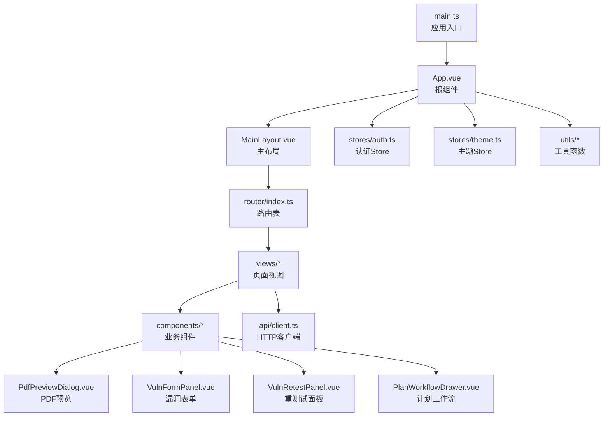
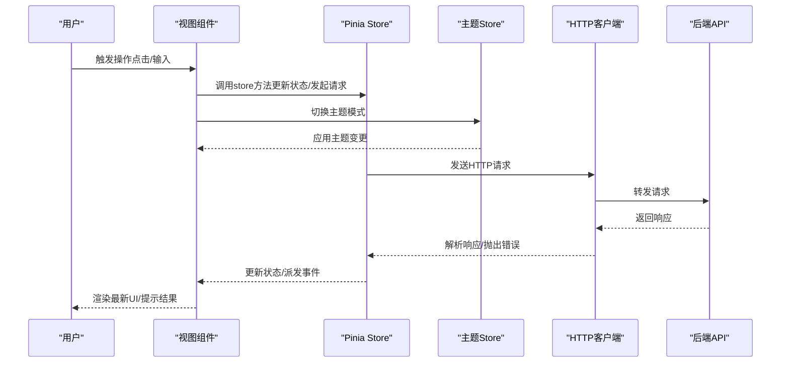
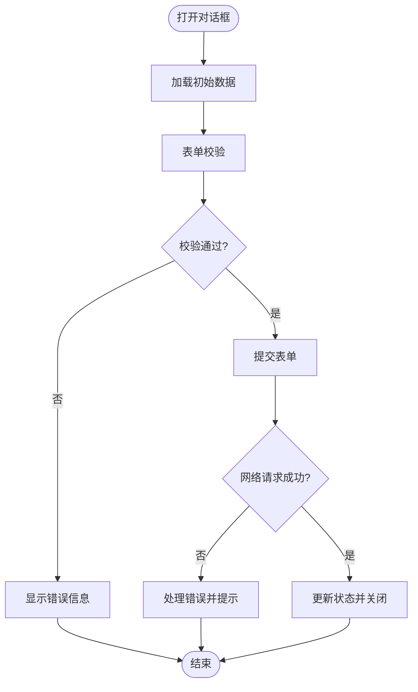
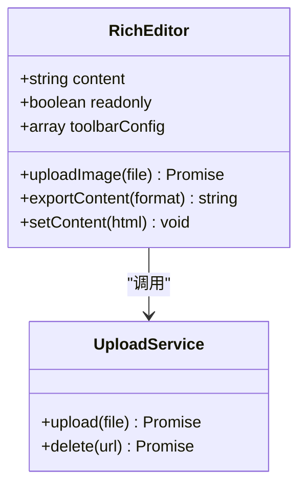
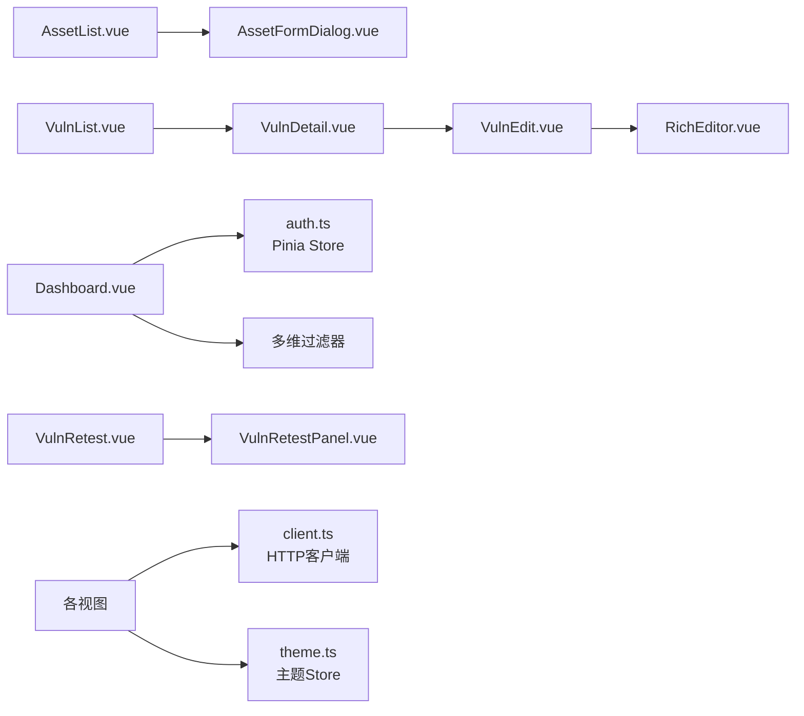
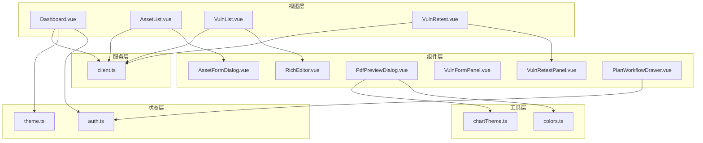

# 前端组件

<cite>
**本文引用的文件**   
- [frontend/src/main.ts](file://frontend/src/main.ts)
- [frontend/src/App.vue](file://frontend/src/App.vue)
- [frontend/src/layouts/MainLayout.vue](file://frontend/src/layouts/MainLayout.vue)
- [frontend/src/router/index.ts](file://frontend/src/router/index.ts)
- [frontend/src/stores/auth.ts](file://frontend/src/stores/auth.ts)
- [frontend/src/stores/theme.ts](file://frontend/src/stores/theme.ts)
- [frontend/src/api/client.ts](file://frontend/src/api/client.ts)
- [frontend/src/components/AssetFormDialog.vue](file://frontend/src/components/AssetFormDialog.vue)
- [frontend/src/components/RichEditor.vue](file://frontend/src/components/RichEditor.vue)
- [frontend/src/components/PdfPreviewDialog.vue](file://frontend/src/components/PdfPreviewDialog.vue)
- [frontend/src/components/VulnFormPanel.vue](file://frontend/src/components/VulnFormPanel.vue)
- [frontend/src/components/VulnRetestPanel.vue](file://frontend/src/components/VulnRetestPanel.vue)
- [frontend/src/components/PlanWorkflowDrawer.vue](file://frontend/src/components/PlanWorkflowDrawer.vue)
- [frontend/src/views/Dashboard.vue](file://frontend/src/views/Dashboard.vue)
- [frontend/src/views/AssetList.vue](file://frontend/src/views/AssetList.vue)
- [frontend/src/views/VulnList.vue](file://frontend/src/views/VulnList.vue)
- [frontend/src/views/VulnDetail.vue](file://frontend/src/views/VulnDetail.vue)
- [frontend/src/views/VulnEdit.vue](file://frontend/src/views/VulnEdit.vue)
- [frontend/src/views/Login.vue](file://frontend/src/views/Login.vue)
- [frontend/src/views/ReportList.vue](file://frontend/src/views/ReportList.vue)
- [frontend/src/views/ImportList.vue](file://frontend/src/views/ImportList.vue)
- [frontend/src/views/ImportPreview.vue](file://frontend/src/views/ImportPreview.vue)
- [frontend/src/views/RemoteTestingList.vue](file://frontend/src/views/RemoteTestingList.vue)
- [frontend/src/views/TestingPlanList.vue](file://frontend/src/views/TestingPlanList.vue)
- [frontend/src/views/SpringActionList.vue](file://frontend/src/views/SpringActionList.vue)
- [frontend/src/views/UserList.vue](file://frontend/src/views/UserList.vue)
- [frontend/src/views/VulnRetest.vue](file://frontend/src/views/VulnRetest.vue)
- [frontend/src/utils/colors.ts](file://frontend/src/utils/colors.ts)
- [frontend/src/utils/chartTheme.ts](file://frontend/src/utils/chartTheme.ts)
- [frontend/package.json](file://frontend/package.json)
- [frontend/pnpm-workspace.yaml](file://frontend/pnpm-workspace.yaml)
</cite>

## 更新摘要
**所做更改**   
- 新增pnpm workspace现代化架构支持，优化包管理效率
- 添加深色主题支持与主题切换功能，提升用户体验
- 新增PDF预览对话框组件，支持在线文档查看
- 新增漏洞表单面板和重测试面板组件，完善漏洞管理流程
- 新增计划工作流抽屉组件，增强测试计划管理功能
- 更新状态管理以支持主题切换与多维过滤
- 增强UI组件库集成与样式系统，优化响应式设计

## 目录
1. [简介](#简介)
2. [项目结构](#项目结构)
3. [核心组件](#核心组件)
4. [架构总览](#架构总览)
5. [详细组件分析](#详细组件分析)
6. [依赖关系分析](#依赖关系分析)
7. [性能考虑](#性能考虑)
8. [故障排查指南](#故障排查指南)
9. [结论](#结论)
10. [附录](#附录)

## 简介
本文件面向Talos前端Vue3项目的组件与页面开发，聚焦基于Element Plus的UI使用规范、自定义组件开发约定、核心业务组件（资产表单对话框、富文本编辑器、PDF预览、漏洞表单面板、重测试界面、计划工作流）的实现与用法、页面级组件的组织方式（仪表盘、资产列表、漏洞管理等）、状态管理（Pinia store）与数据流、路由配置与导航逻辑、组件通信与事件处理、样式定制与主题配置、响应式设计与移动端适配最佳实践。文档力求在技术深度与可读性之间取得平衡，帮助初学者快速上手，同时为有经验的开发者提供可追溯的代码级参考。

**更新** 本项目现已采用pnpm workspace现代化架构，支持深色主题切换，并新增了多个专业UI组件以提升用户体验。

## 项目结构
前端采用Vue3 + TypeScript + Vite构建，UI库使用Element Plus，样式体系结合Tailwind CSS进行原子化布局与主题扩展。整体目录按"功能域"划分：
- src/main.ts：应用入口，初始化Vue实例、插件、全局样式与主题
- src/App.vue：根组件，承载路由视图与全局布局
- src/layouts/MainLayout.vue：主布局，包含侧边栏、顶部导航、内容区等
- src/router/index.ts：路由表定义与守卫逻辑
- src/stores/auth.ts：认证相关Pinia Store
- src/stores/theme.ts：主题管理Pinia Store，支持深色/浅色模式切换
- src/api/client.ts：HTTP客户端封装（请求拦截、错误处理、统一响应）
- src/components：通用业务组件（如资产表单对话框、富文本编辑器、PDF预览、漏洞表单面板、计划工作流抽屉等）
- src/views：页面级视图（仪表盘、资产列表、漏洞管理等）
- src/utils：工具函数（颜色、格式化、图表主题等）
- package.json：依赖与脚本
- pnpm-workspace.yaml：pnpm工作空间配置

**图表来源**
- [frontend/src/main.ts](file://frontend/src/main.ts)
- [frontend/src/App.vue](file://frontend/src/App.vue)
- [frontend/src/layouts/MainLayout.vue](file://frontend/src/layouts/MainLayout.vue)
- [frontend/src/router/index.ts](file://frontend/src/router/index.ts)
- [frontend/src/stores/auth.ts](file://frontend/src/stores/auth.ts)
- [frontend/src/stores/theme.ts](file://frontend/src/stores/theme.ts)
- [frontend/src/api/client.ts](file://frontend/src/api/client.ts)
- [frontend/src/components/PdfPreviewDialog.vue](file://frontend/src/components/PdfPreviewDialog.vue)
- [frontend/src/components/VulnFormPanel.vue](file://frontend/src/components/VulnFormPanel.vue)
- [frontend/src/components/VulnRetestPanel.vue](file://frontend/src/components/VulnRetestPanel.vue)
- [frontend/src/components/PlanWorkflowDrawer.vue](file://frontend/src/components/PlanWorkflowDrawer.vue)

**章节来源**
- [frontend/src/main.ts](file://frontend/src/main.ts)
- [frontend/src/App.vue](file://frontend/src/App.vue)
- [frontend/src/layouts/MainLayout.vue](file://frontend/src/layouts/MainLayout.vue)
- [frontend/src/router/index.ts](file://frontend/src/router/index.ts)
- [frontend/package.json](file://frontend/package.json)
- [frontend/pnpm-workspace.yaml](file://frontend/pnpm-workspace.yaml)

## 核心组件
本节聚焦关键业务组件：资产表单对话框、富文本编辑器、PDF预览对话框、漏洞表单面板、重测试面板和计划工作流抽屉。它们体现了Element Plus的使用范式与自定义组件的开发约定。

- 资产表单对话框（AssetFormDialog.vue）
  - 职责：以对话框形式展示资产的新增/编辑表单，负责字段校验、提交与结果回传
  - 输入输出：通过props接收初始数据与模式（新增/编辑），通过emits触发保存成功或取消事件
  - Element Plus使用：el-dialog、el-form、el-form-item、el-input、el-select、el-date-picker等；表单校验规则集中定义
  - 交互流程：打开对话框→填充数据→用户编辑→校验→提交→关闭并回调父组件
  - 错误处理：网络异常与业务错误统一提示；表单校验失败时定位到首个错误项

- 富文本编辑器（RichEditor.vue）
  - 职责：提供富文本编辑能力，用于报告、说明等内容的编辑与预览
  - 输入输出：v-model双向绑定内容；支持工具栏配置、图片上传、导出HTML/Markdown
  - Element Plus集成：可与el-upload配合实现图片上传；与主题系统联动
  - 性能优化：防抖保存、按需加载编辑器资源、懒渲染大内容
  - 可访问性：键盘导航、ARIA属性、屏幕阅读器友好

- PDF预览对话框（PdfPreviewDialog.vue）
  - 职责：提供PDF文件的在线预览功能，支持缩放、旋转、全屏查看
  - 输入输出：通过props接收PDF文件URL或Base64数据，支持预览模式配置
  - 功能特性：分页浏览、书签导航、打印导出、下载功能
  - 性能优化：虚拟滚动、按需加载PDF页面、内存管理

- 漏洞表单面板（VulnFormPanel.vue）
  - 职责：专业的漏洞信息录入与管理界面，支持复杂表单结构与动态字段
  - 输入输出：完整的漏洞CRUD操作，支持批量导入导出
  - 高级功能：关联资产选择、影响程度评估、修复建议模板
  - 数据验证：复杂的业务规则校验与实时反馈

- 重测试面板（VulnRetestPanel.vue）
  - 职责：漏洞修复后的重新测试管理，支持测试用例配置与结果记录
  - 工作流程：测试计划创建、执行跟踪、结果对比分析
  - 集成能力：与自动化测试工具对接、测试结果可视化

- 计划工作流抽屉（PlanWorkflowDrawer.vue）
  - 职责：测试计划的创建工作流管理，支持多步骤任务编排与进度跟踪
  - 功能特性：步骤导航、任务分配、状态监控、批量操作
  - 交互设计：抽屉式界面，不干扰主页面操作
  - 数据同步：实时更新计划状态，支持撤销与恢复

**章节来源**
- [frontend/src/components/AssetFormDialog.vue](file://frontend/src/components/AssetFormDialog.vue)
- [frontend/src/components/RichEditor.vue](file://frontend/src/components/RichEditor.vue)
- [frontend/src/components/PdfPreviewDialog.vue](file://frontend/src/components/PdfPreviewDialog.vue)
- [frontend/src/components/VulnFormPanel.vue](file://frontend/src/components/VulnFormPanel.vue)
- [frontend/src/components/VulnRetestPanel.vue](file://frontend/src/components/VulnRetestPanel.vue)
- [frontend/src/components/PlanWorkflowDrawer.vue](file://frontend/src/components/PlanWorkflowDrawer.vue)

## 架构总览
前端采用"视图-组件-状态-服务"的分层架构：
- 视图层（views）：页面级组件，组合多个业务组件，处理路由参数与页面状态
- 组件层（components）：可复用的业务组件，遵循单一职责与明确接口
- 状态层（stores）：Pinia管理全局与模块状态，提供响应式数据与副作用方法
- 服务层（api）：HTTP客户端封装，统一请求/响应处理与错误策略

**更新** 新增主题状态管理，支持运行时主题切换与持久化存储；增强仪表盘多维过滤功能。

**图表来源**
- [frontend/src/views/Dashboard.vue](file://frontend/src/views/Dashboard.vue)
- [frontend/src/stores/auth.ts](file://frontend/src/stores/auth.ts)
- [frontend/src/stores/theme.ts](file://frontend/src/stores/theme.ts)
- [frontend/src/api/client.ts](file://frontend/src/api/client.ts)

**章节来源**
- [frontend/src/views/Dashboard.vue](file://frontend/src/views/Dashboard.vue)
- [frontend/src/stores/auth.ts](file://frontend/src/stores/auth.ts)
- [frontend/src/stores/theme.ts](file://frontend/src/stores/theme.ts)
- [frontend/src/api/client.ts](file://frontend/src/api/client.ts)

## 详细组件分析

### 资产表单对话框（AssetFormDialog.vue）
- 设计要点
  - 表单结构：字段分组、标签对齐、必填标记、帮助文本
  - 校验策略：同步校验（格式）与异步校验（唯一性）结合
  - 提交策略：防重复提交、乐观更新与回滚
  - 可复用性：通过插槽扩展额外字段，支持多场景复用
- 与Element Plus的集成
  - 使用el-form的rules与validate进行校验
  - 使用el-message与el-notification进行反馈
  - 使用el-descriptions展示只读详情
- 事件与通信
  - emits：save、cancel、open、close
  - props：visible、formData、mode、readonly
- 错误处理
  - 网络错误：重试机制与降级提示
  - 业务错误：错误码映射与用户友好消息

**图表来源**
- [frontend/src/components/AssetFormDialog.vue](file://frontend/src/components/AssetFormDialog.vue)

**章节来源**
- [frontend/src/components/AssetFormDialog.vue](file://frontend/src/components/AssetFormDialog.vue)

### 富文本编辑器（RichEditor.vue）
- 设计要点
  - 工具栏配置：按需启用插入图片、表格、代码块等功能
  - 内容持久化：本地缓存与自动保存
  - 导出能力：HTML/Markdown导出，兼容后端存储格式
- 与Element Plus的集成
  - el-upload对接图片上传，支持拖拽与预览
  - 与主题系统联动，保持视觉一致性
- 性能优化
  - 懒加载编辑器资源，首屏不阻塞
  - 大内容分片渲染与虚拟滚动
- 可访问性
  - 键盘快捷键、焦点管理、语义化标签

**图表来源**
- [frontend/src/components/RichEditor.vue](file://frontend/src/components/RichEditor.vue)

**章节来源**
- [frontend/src/components/RichEditor.vue](file://frontend/src/components/RichEditor.vue)

### PDF预览对话框（PdfPreviewDialog.vue）
- 设计要点
  - 文件加载：支持URL、Base64、文件对象等多种输入格式
  - 渲染引擎：基于PDF.js的高性能渲染，支持大文件处理
  - 交互功能：缩放控制、页面导航、搜索高亮、注释标注
- 与Element Plus的集成
  - el-dialog作为容器，el-progress显示加载进度
  - 响应式设计，适配不同屏幕尺寸
- 性能优化
  - 虚拟滚动分页加载，避免内存溢出
  - 图片缓存与预加载策略
- 安全考虑
  - XSS防护与内容过滤
  - 文件大小限制与类型验证

**章节来源**
- [frontend/src/components/PdfPreviewDialog.vue](file://frontend/src/components/PdfPreviewDialog.vue)

### 漏洞表单面板（VulnFormPanel.vue）
- 设计要点
  - 复杂表单：多级嵌套字段、动态表单生成、条件显示逻辑
  - 数据关联：资产选择器、知识库引用、历史版本对比
  - 验证规则：业务规则引擎、实时校验、批量验证
- 与Element Plus的集成
  - el-form的动态表单功能
  - el-transfer组件用于资产选择
  - el-timeline展示修复历史
- 用户体验
  - 分步表单引导
  - 智能默认值填充
  - 草稿自动保存

**章节来源**
- [frontend/src/components/VulnFormPanel.vue](file://frontend/src/components/VulnFormPanel.vue)

### 重测试面板（VulnRetestPanel.vue）
- 设计要点
  - 测试流程：测试计划创建、用例配置、执行监控
  - 结果对比：修复前后差异对比、回归测试验证
  - 自动化集成：CI/CD流水线对接、测试结果上报
- 与Element Plus的集成
  - el-steps展示测试流程
  - el-table展示测试结果
  - el-chart可视化测试指标
- 数据管理
  - 测试用例模板库
  - 批量测试任务调度
  - 测试报告自动生成

**章节来源**
- [frontend/src/components/VulnRetestPanel.vue](file://frontend/src/components/VulnRetestPanel.vue)

### 计划工作流抽屉（PlanWorkflowDrawer.vue）
- 设计要点
  - 工作流管理：多步骤任务编排、进度跟踪、状态管理
  - 任务分配：人员选择、优先级设置、截止日期管理
  - 协作功能：任务评论、文件附件、版本控制
- 与Element Plus的集成
  - el-drawer作为容器，el-steps展示流程步骤
  - el-form进行任务配置，el-table展示任务列表
  - el-progress显示完成进度
- 交互设计
  - 抽屉式界面，不影响主页面操作
  - 实时状态同步与通知提醒
  - 批量操作与快捷操作

**章节来源**
- [frontend/src/components/PlanWorkflowDrawer.vue](file://frontend/src/components/PlanWorkflowDrawer.vue)

### 页面级组件组织（Dashboard、AssetList、VulnList等）
- 仪表盘（Dashboard.vue）
  - 聚合统计卡片、趋势图、最近活动列表
  - 数据源：Pinia store拉取，支持刷新与缓存
  - 交互：筛选、时间范围选择、导出报表
  - **更新** 增强多维过滤功能，支持多维度数据筛选与组合查询
- 资产列表（AssetList.vue）
  - 表格展示、分页、排序、搜索、批量操作
  - 行内编辑与批量导入导出
  - 与资产表单对话框联动，支持新增/编辑
- 漏洞管理（VulnList.vue、VulnDetail.vue、VulnEdit.vue）
  - 列表页：条件筛选、状态标签、操作菜单
  - 详情页：结构化展示、关联资产、修复建议
  - 编辑页：富文本编辑器嵌入、版本历史对比
- 重测试页面（VulnRetest.vue）
  - 测试任务管理、执行监控、结果分析
  - 与重测试面板组件集成

**图表来源**
- [frontend/src/views/Dashboard.vue](file://frontend/src/views/Dashboard.vue)
- [frontend/src/views/AssetList.vue](file://frontend/src/views/AssetList.vue)
- [frontend/src/views/VulnList.vue](file://frontend/src/views/VulnList.vue)
- [frontend/src/views/VulnDetail.vue](file://frontend/src/views/VulnDetail.vue)
- [frontend/src/views/VulnEdit.vue](file://frontend/src/views/VulnEdit.vue)
- [frontend/src/views/VulnRetest.vue](file://frontend/src/views/VulnRetest.vue)
- [frontend/src/components/AssetFormDialog.vue](file://frontend/src/components/AssetFormDialog.vue)
- [frontend/src/components/RichEditor.vue](file://frontend/src/components/RichEditor.vue)
- [frontend/src/components/VulnRetestPanel.vue](file://frontend/src/components/VulnRetestPanel.vue)
- [frontend/src/stores/auth.ts](file://frontend/src/stores/auth.ts)
- [frontend/src/stores/theme.ts](file://frontend/src/stores/theme.ts)
- [frontend/src/api/client.ts](file://frontend/src/api/client.ts)

**章节来源**
- [frontend/src/views/Dashboard.vue](file://frontend/src/views/Dashboard.vue)
- [frontend/src/views/AssetList.vue](file://frontend/src/views/AssetList.vue)
- [frontend/src/views/VulnList.vue](file://frontend/src/views/VulnList.vue)
- [frontend/src/views/VulnDetail.vue](file://frontend/src/views/VulnDetail.vue)
- [frontend/src/views/VulnEdit.vue](file://frontend/src/views/VulnEdit.vue)
- [frontend/src/views/VulnRetest.vue](file://frontend/src/views/VulnRetest.vue)

## 依赖关系分析
- 组件耦合度
  - 视图与组件：松耦合，通过props与emits通信
  - 组件与Store：通过action与state解耦，避免直接操作DOM
  - 组件与API：通过client封装，屏蔽底层细节
- 外部依赖
  - Element Plus：UI组件与主题变量
  - Tailwind CSS：原子化样式与响应式断点
  - Vue Router：路由与导航守卫
  - Pinia：状态管理与副作用
  - PDF.js：PDF文件渲染与处理
- 潜在循环依赖
  - 避免组件间相互import；通过事件总线或Store中转

**更新** 新增PDF.js依赖用于PDF预览功能，增强主题管理系统，引入pnpm workspace优化依赖管理。

**图表来源**
- [frontend/src/views/Dashboard.vue](file://frontend/src/views/Dashboard.vue)
- [frontend/src/views/AssetList.vue](file://frontend/src/views/AssetList.vue)
- [frontend/src/views/VulnList.vue](file://frontend/src/views/VulnList.vue)
- [frontend/src/views/VulnRetest.vue](file://frontend/src/views/VulnRetest.vue)
- [frontend/src/components/AssetFormDialog.vue](file://frontend/src/components/AssetFormDialog.vue)
- [frontend/src/components/RichEditor.vue](file://frontend/src/components/RichEditor.vue)
- [frontend/src/components/PdfPreviewDialog.vue](file://frontend/src/components/PdfPreviewDialog.vue)
- [frontend/src/components/VulnFormPanel.vue](file://frontend/src/components/VulnFormPanel.vue)
- [frontend/src/components/VulnRetestPanel.vue](file://frontend/src/components/VulnRetestPanel.vue)
- [frontend/src/components/PlanWorkflowDrawer.vue](file://frontend/src/components/PlanWorkflowDrawer.vue)
- [frontend/src/stores/auth.ts](file://frontend/src/stores/auth.ts)
- [frontend/src/stores/theme.ts](file://frontend/src/stores/theme.ts)
- [frontend/src/api/client.ts](file://frontend/src/api/client.ts)
- [frontend/src/utils/colors.ts](file://frontend/src/utils/colors.ts)
- [frontend/src/utils/chartTheme.ts](file://frontend/src/utils/chartTheme.ts)

**章节来源**
- [frontend/src/views/Dashboard.vue](file://frontend/src/views/Dashboard.vue)
- [frontend/src/views/AssetList.vue](file://frontend/src/views/AssetList.vue)
- [frontend/src/views/VulnList.vue](file://frontend/src/views/VulnList.vue)
- [frontend/src/views/VulnRetest.vue](file://frontend/src/views/VulnRetest.vue)
- [frontend/src/components/AssetFormDialog.vue](file://frontend/src/components/AssetFormDialog.vue)
- [frontend/src/components/RichEditor.vue](file://frontend/src/components/RichEditor.vue)
- [frontend/src/components/PdfPreviewDialog.vue](file://frontend/src/components/PdfPreviewDialog.vue)
- [frontend/src/components/VulnFormPanel.vue](file://frontend/src/components/VulnFormPanel.vue)
- [frontend/src/components/VulnRetestPanel.vue](file://frontend/src/components/VulnRetestPanel.vue)
- [frontend/src/components/PlanWorkflowDrawer.vue](file://frontend/src/components/PlanWorkflowDrawer.vue)
- [frontend/src/stores/auth.ts](file://frontend/src/stores/auth.ts)
- [frontend/src/stores/theme.ts](file://frontend/src/stores/theme.ts)
- [frontend/src/api/client.ts](file://frontend/src/api/client.ts)
- [frontend/src/utils/colors.ts](file://frontend/src/utils/colors.ts)
- [frontend/src/utils/chartTheme.ts](file://frontend/src/utils/chartTheme.ts)

## 性能考虑
- 首屏优化
  - 路由懒加载与组件按需引入
  - 静态资源压缩与CDN加速
  - 主题资源预加载与缓存
- 运行时优化
  - 列表虚拟化与分页加载
  - 防抖与节流（搜索、滚动、输入）
  - 图片懒加载与WebP格式
  - PDF文件分片加载与内存管理
- 内存管理
  - 及时销毁监听器与定时器
  - 避免大对象常驻内存
  - PDF渲染资源清理
- 可观测性
  - 埋点与错误上报
  - 性能指标采集（FCP、LCP、CLS）

**更新** 新增PDF文件性能优化策略，包括分片加载、内存管理和资源清理；优化pnpm workspace依赖管理，提升构建效率。

## 故障排查指南
- 常见问题
  - 表单校验不生效：检查rules定义与el-form-item绑定
  - 图片上传失败：确认上传接口权限与跨域配置
  - 路由跳转无效：检查路由表与导航守卫逻辑
  - 状态不同步：确认Store action与组件订阅是否正确
  - 主题切换失效：检查CSS变量覆盖与浏览器兼容性
  - PDF预览失败：确认文件格式支持与加载权限
  - 工作流抽屉不显示：检查drawer状态与z-index层级
- 调试技巧
  - 使用浏览器开发者工具查看网络请求与响应
  - 打印Store状态变化与组件生命周期
  - 使用Vue DevTools检查组件树与状态
  - 检查主题变量的CSS继承链
  - 使用pnpm命令检查依赖冲突
- 错误处理策略
  - 统一错误码映射与用户提示
  - 网络异常重试与降级方案
  - 日志记录与问题追踪

**更新** 新增主题切换和PDF预览相关的故障排查指导，增加pnpm workspace相关问题的解决方案。

**章节来源**
- [frontend/src/api/client.ts](file://frontend/src/api/client.ts)
- [frontend/src/stores/auth.ts](file://frontend/src/stores/auth.ts)
- [frontend/src/stores/theme.ts](file://frontend/src/stores/theme.ts)
- [frontend/src/router/index.ts](file://frontend/src/router/index.ts)

## 结论
Talos前端采用清晰的Vue3分层架构，结合Element Plus与Tailwind CSS构建高效、可维护的用户界面。通过Pinia统一管理状态，组件间通信简洁明确，路由与导航逻辑清晰。核心业务组件（资产表单对话框、富文本编辑器、PDF预览、漏洞表单面板、重测试面板、计划工作流抽屉）提供了良好的复用性与扩展性。项目现已支持pnpm workspace现代化架构和深色主题切换，进一步提升了开发效率和用户体验。遵循本文档的规范与实践，可进一步提升开发效率与用户体验。

**更新** 项目架构已现代化，新增的专业UI组件显著增强了功能完整性和用户体验，pnpm workspace优化了依赖管理效率。

## 附录
- 样式定制与主题配置
  - 使用Element Plus主题变量覆盖默认样式
  - 结合Tailwind CSS自定义断点与颜色
  - 通过CSS变量实现动态主题切换
  - 深色主题配色方案与对比度优化
- 响应式设计与移动端适配
  - 使用Tailwind响应式前缀（sm、md、lg）
  - 移动端优先的布局策略
  - 触摸友好的交互设计（大按钮、滑动操作）
  - PDF预览的移动端适配优化
- 组件开发规范
  - 单一职责与明确接口
  - Props与Emits命名约定
  - 错误处理与用户反馈
  - 主题感知组件开发
- 路由与导航
  - 路由懒加载与权限控制
  - 面包屑与历史记录管理
  - 查询参数与状态同步
- pnpm workspace配置
  - 工作空间依赖管理
  - 包版本锁定与升级策略
  - 开发环境优化配置
  - 多包项目管理最佳实践

**更新** 新增深色主题配置、PDF预览适配和pnpm workspace配置相关内容，完善开发环境配置指导。