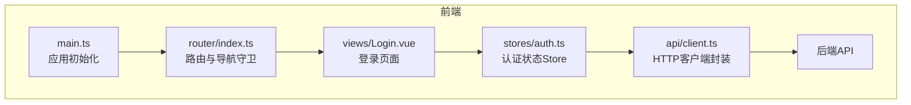
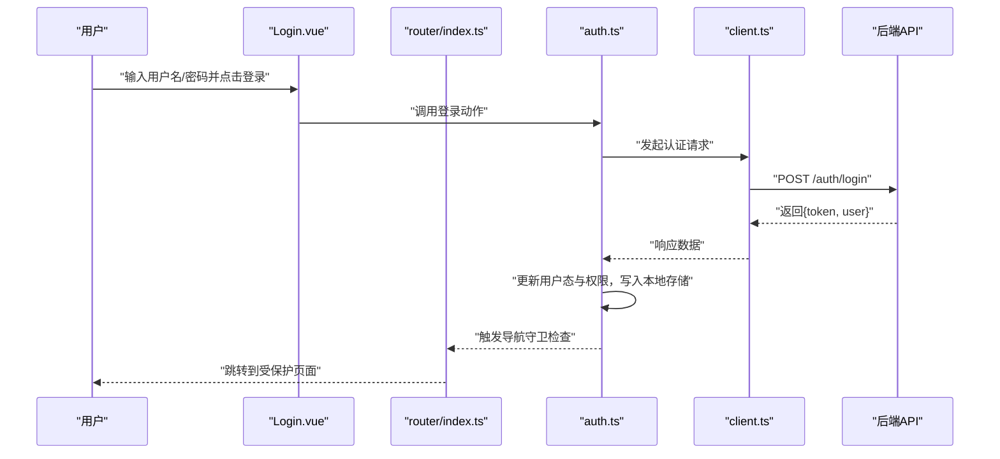
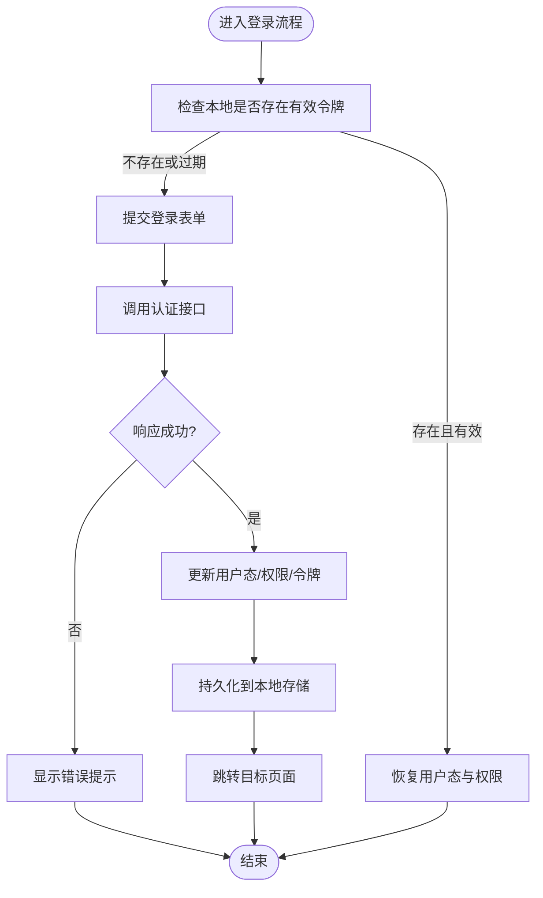
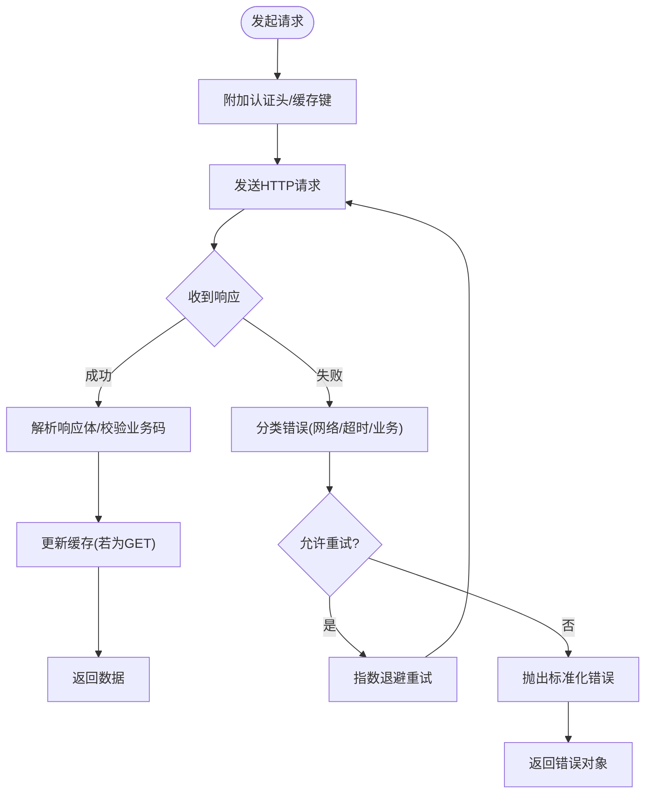
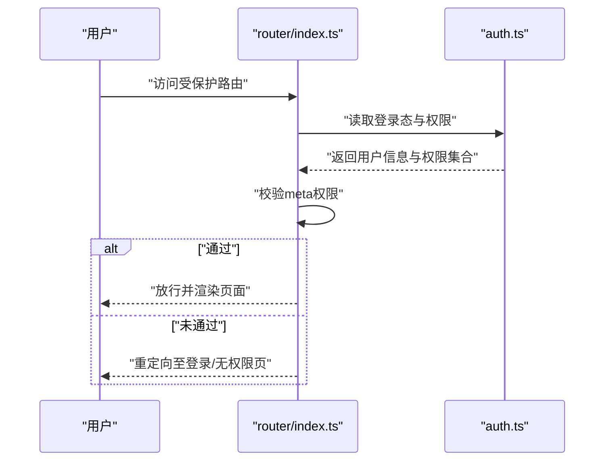
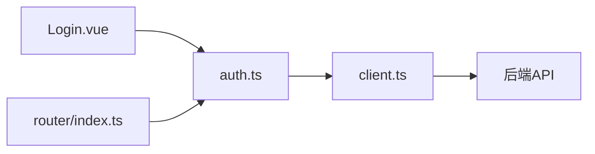

# 状态管理

<cite>
**本文引用的文件**   
- [frontend/src/stores/auth.ts](file://frontend/src/stores/auth.ts)
- [frontend/src/api/client.ts](file://frontend/src/api/client.ts)
- [frontend/src/router/index.ts](file://frontend/src/router/index.ts)
- [frontend/src/views/Login.vue](file://frontend/src/views/Login.vue)
- [frontend/src/main.ts](file://frontend/src/main.ts)
</cite>

## 目录
1. [简介](#简介)
2. [项目结构](#项目结构)
3. [核心组件](#核心组件)
4. [架构总览](#架构总览)
5. [详细组件分析](#详细组件分析)
6. [依赖分析](#依赖分析)
7. [性能考虑](#性能考虑)
8. [故障排查指南](#故障排查指南)
9. [结论](#结论)
10. [附录](#附录)

## 简介
本文件面向Talos前端的状态管理，聚焦基于Pinia的store组织与认证流程。内容涵盖：
- 认证状态auth store的职责边界、用户登录态、token存储与权限控制
- API客户端client.ts的请求拦截、响应处理与错误统一处理
- 状态持久化策略与数据同步机制
- 异步操作处理、缓存策略与性能优化
- 状态调试与监控最佳实践

## 项目结构
前端采用按功能域划分的目录组织，状态相关代码集中在stores目录，API请求封装在api目录，路由守卫负责鉴权跳转，视图层触发登录与业务操作。

图表来源
- [frontend/src/main.ts](file://frontend/src/main.ts)
- [frontend/src/router/index.ts](file://frontend/src/router/index.ts)
- [frontend/src/views/Login.vue](file://frontend/src/views/Login.vue)
- [frontend/src/stores/auth.ts](file://frontend/src/stores/auth.ts)
- [frontend/src/api/client.ts](file://frontend/src/api/client.ts)

章节来源
- [frontend/src/main.ts](file://frontend/src/main.ts)
- [frontend/src/router/index.ts](file://frontend/src/router/index.ts)
- [frontend/src/views/Login.vue](file://frontend/src/views/Login.vue)
- [frontend/src/stores/auth.ts](file://frontend/src/stores/auth.ts)
- [frontend/src/api/client.ts](file://frontend/src/api/client.ts)

## 核心组件
- Pinia Store（认证）：集中管理用户登录态、令牌与权限信息，提供登录、登出、刷新等动作，并负责与本地存储同步。
- API客户端：封装HTTP请求，统一设置请求头、处理响应、捕获并上报错误，支持重试与缓存策略。
- 路由守卫：根据认证状态决定访问权限，未登录时重定向至登录页。
- 登录视图：收集用户凭据，调用认证接口，成功后更新store并跳转。

章节来源
- [frontend/src/stores/auth.ts](file://frontend/src/stores/auth.ts)
- [frontend/src/api/client.ts](file://frontend/src/api/client.ts)
- [frontend/src/router/index.ts](file://frontend/src/router/index.ts)
- [frontend/src/views/Login.vue](file://frontend/src/views/Login.vue)

## 架构总览
下图展示从用户交互到后端响应的完整链路，以及状态如何被更新与持久化。

图表来源
- [frontend/src/views/Login.vue](file://frontend/src/views/Login.vue)
- [frontend/src/stores/auth.ts](file://frontend/src/stores/auth.ts)
- [frontend/src/api/client.ts](file://frontend/src/api/client.ts)
- [frontend/src/router/index.ts](file://frontend/src/router/index.ts)

## 详细组件分析

### 认证状态Store（auth.ts）
职责与能力
- 状态字段：用户基本信息、角色/权限集合、登录态标志、加载态、错误消息等。
- 动作方法：登录、登出、刷新令牌、校验权限、重置状态。
- 计算属性：是否已登录、是否具有某权限、当前用户信息等。
- 副作用：与本地存储同步（如localStorage或sessionStorage），在应用启动时恢复状态。

典型流程
- 登录：提交凭据→调用API→成功则更新状态并持久化→失败则记录错误。
- 登出：清除本地存储中的敏感信息→重置状态→跳转登录页。
- 权限控制：通过计算属性判断是否具备访问某资源所需的角色或权限。

图表来源
- [frontend/src/stores/auth.ts](file://frontend/src/stores/auth.ts)
- [frontend/src/views/Login.vue](file://frontend/src/views/Login.vue)

章节来源
- [frontend/src/stores/auth.ts](file://frontend/src/stores/auth.ts)
- [frontend/src/views/Login.vue](file://frontend/src/views/Login.vue)

### API客户端（client.ts）
职责与能力
- 基础配置：baseUrl、超时、默认请求头等。
- 请求拦截器：自动附加认证令牌、请求去重、可选缓存标记。
- 响应拦截器：统一解析响应体、处理业务错误码、转换数据结构。
- 错误处理：网络异常、超时、业务错误分类与上报；支持重试与退避。
- 缓存策略：对GET请求进行内存级缓存，可配置过期时间与失效条件。

典型流程
- 发起请求→拦截器附加令牌→发送→接收响应→解析与校验→返回数据或抛出错误。

图表来源
- [frontend/src/api/client.ts](file://frontend/src/api/client.ts)

章节来源
- [frontend/src/api/client.ts](file://frontend/src/api/client.ts)

### 路由守卫与权限控制（router/index.ts）
职责与能力
- 全局前置守卫：检查用户登录态与所需权限，未通过则重定向至登录页或无权限页。
- 动态路由：根据用户角色生成可访问的路由表。
- 元信息：在路由meta中声明权限要求，便于守卫统一校验。

图表来源
- [frontend/src/router/index.ts](file://frontend/src/router/index.ts)
- [frontend/src/stores/auth.ts](file://frontend/src/stores/auth.ts)

章节来源
- [frontend/src/router/index.ts](file://frontend/src/router/index.ts)
- [frontend/src/stores/auth.ts](file://frontend/src/stores/auth.ts)

### 登录视图（Login.vue）
职责与能力
- 表单校验：用户名、密码非空与格式校验。
- 调用store登录动作：提交后等待结果并处理成功/失败分支。
- 成功后跳转：根据用户角色或查询参数决定目标页面。

章节来源
- [frontend/src/views/Login.vue](file://frontend/src/views/Login.vue)
- [frontend/src/stores/auth.ts](file://frontend/src/stores/auth.ts)

## 依赖分析
- auth.ts依赖client.ts进行网络请求，依赖本地存储进行状态持久化。
- router/index.ts依赖auth.ts获取当前用户态与权限，用于导航决策。
- Login.vue依赖auth.ts的动作方法完成登录流程。
- client.ts作为底层HTTP封装，被所有需要网络请求的模块复用。

图表来源
- [frontend/src/views/Login.vue](file://frontend/src/views/Login.vue)
- [frontend/src/stores/auth.ts](file://frontend/src/stores/auth.ts)
- [frontend/src/api/client.ts](file://frontend/src/api/client.ts)
- [frontend/src/router/index.ts](file://frontend/src/router/index.ts)

章节来源
- [frontend/src/stores/auth.ts](file://frontend/src/stores/auth.ts)
- [frontend/src/api/client.ts](file://frontend/src/api/client.ts)
- [frontend/src/router/index.ts](file://frontend/src/router/index.ts)
- [frontend/src/views/Login.vue](file://frontend/src/views/Login.vue)

## 性能考虑
- 减少不必要的状态更新：仅在必要字段变化时触发响应式更新，避免大面积state重建。
- 请求去重与合并：对相同请求进行去重，避免重复网络开销。
- 缓存策略：对高频只读数据使用内存缓存，合理设置过期时间；必要时结合浏览器缓存。
- 懒加载与按需引入：路由与组件懒加载，降低首屏体积。
- 错误快速失败：超时与网络错误尽早返回，避免长时间阻塞。
- 批量更新：将多次状态变更合并为一次更新，减少渲染次数。

[本节为通用指导，不直接分析具体文件]

## 故障排查指南
常见问题与定位思路
- 登录后仍被重定向：检查本地存储是否写入成功、路由守卫权限校验逻辑是否正确。
- 请求携带令牌失败：确认请求拦截器是否正确附加Authorization头，跨域与Token格式是否符合后端要求。
- 权限不足：核对用户角色/权限集合是否与路由meta定义一致。
- 频繁刷新导致重复请求：启用请求去重与缓存，检查缓存键生成规则。
- 错误信息不明确：查看client.ts的错误分类与上报，定位具体错误类型与堆栈。

建议的调试手段
- 在store中打印关键状态变化与动作执行日志。
- 在client.ts中记录请求/响应摘要（脱敏）。
- 使用浏览器开发者工具的网络面板与存储面板验证令牌与缓存。
- 在路由守卫中输出权限判定结果，辅助定位跳转问题。

章节来源
- [frontend/src/stores/auth.ts](file://frontend/src/stores/auth.ts)
- [frontend/src/api/client.ts](file://frontend/src/api/client.ts)
- [frontend/src/router/index.ts](file://frontend/src/router/index.ts)

## 结论
通过Pinia集中管理认证状态，配合统一的HTTP客户端封装与路由守卫，Talos前端实现了清晰的鉴权流程与良好的可维护性。合理的持久化、缓存与错误处理策略进一步提升了用户体验与系统稳定性。建议在后续迭代中持续完善权限模型、增强缓存策略与监控能力。

[本节为总结性内容，不直接分析具体文件]

## 附录
- 术语说明
  - Store：Pinia的状态容器，包含状态、动作与计算属性。
  - 拦截器：在请求发出前与响应返回后执行的钩子函数。
  - 权限控制：基于用户角色或权限集合限制资源访问。
- 最佳实践清单
  - 将敏感信息最小化持久化，优先使用会话存储。
  - 统一错误码与错误消息规范，便于前端展示与后端排查。
  - 为关键路径添加埋点与监控，关注失败率与耗时。
  - 定期清理过期缓存与无效令牌，避免存储膨胀。

[本节为补充信息，不直接分析具体文件]