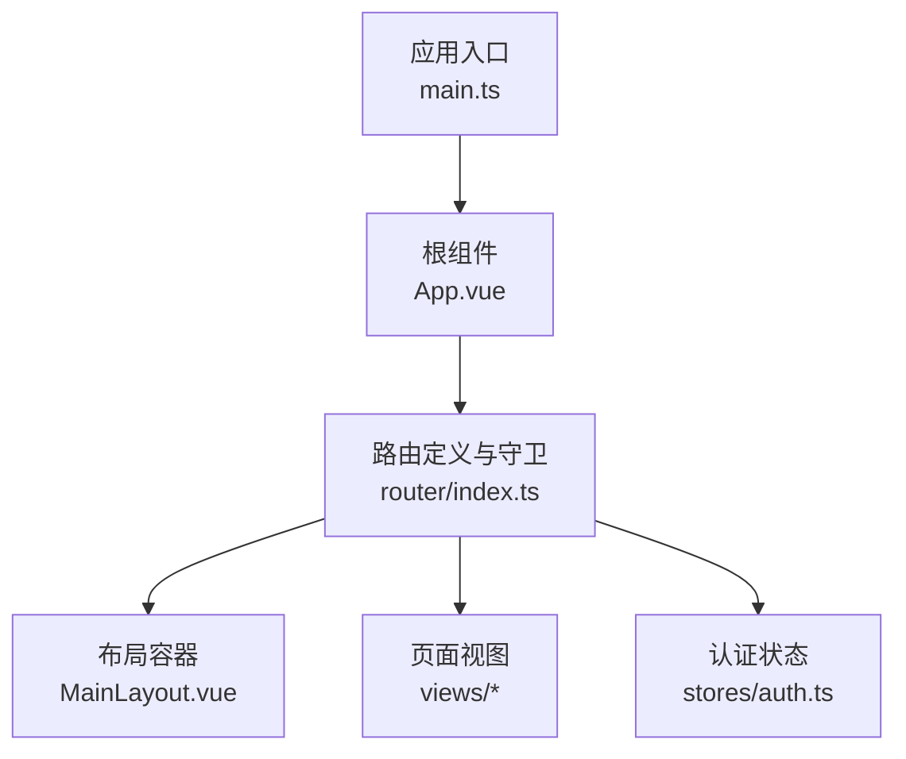
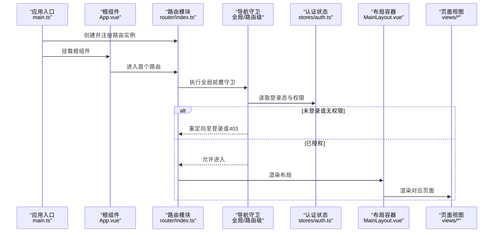
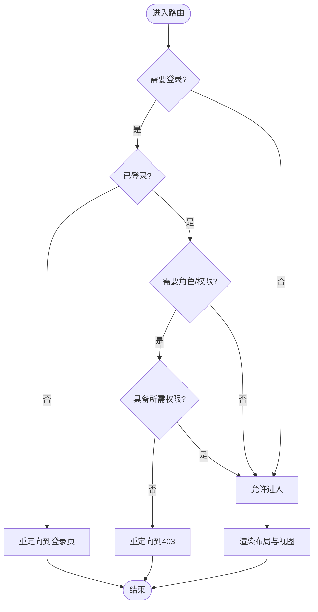
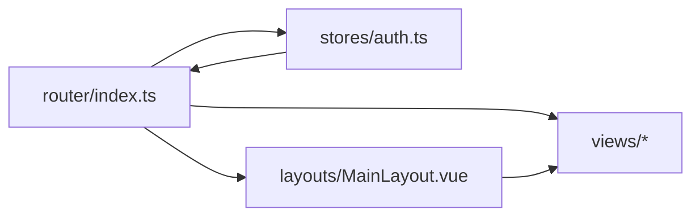

# 路由与导航

<cite>
**本文引用的文件**   
- [frontend/src/router/index.ts](file://frontend/src/router/index.ts)
- [frontend/src/views/Login.vue](file://frontend/src/views/Login.vue)
- [frontend/src/views/Dashboard.vue](file://frontend/src/views/Dashboard.vue)
- [frontend/src/layouts/MainLayout.vue](file://frontend/src/layouts/MainLayout.vue)
- [frontend/src/stores/auth.ts](file://frontend/src/stores/auth.ts)
- [frontend/src/App.vue](file://frontend/src/App.vue)
- [frontend/src/main.ts](file://frontend/src/main.ts)
</cite>

## 目录
1. [简介](#简介)
2. [项目结构](#项目结构)
3. [核心组件](#核心组件)
4. [架构总览](#架构总览)
5. [详细组件分析](#详细组件分析)
6. [依赖分析](#依赖分析)
7. [性能考虑](#性能考虑)
8. [故障排查指南](#故障排查指南)
9. [结论](#结论)
10. [附录](#附录)

## 简介
本文件面向Talos前端的路由与导航系统，聚焦基于Vue Router的配置、导航守卫、元信息、动态路由生成、权限控制、页面跳转与参数传递、查询字符串处理、嵌套路由、懒加载、路由动画、404处理、面包屑导航与菜单自动生成机制，以及性能优化与SEO友好的最佳实践。文档以仓库中的实际代码为依据，提供循序渐进的说明与可视化图示，帮助读者快速理解并扩展路由能力。

## 项目结构
Talos前端采用典型的前后端分离结构，路由相关代码集中在src/router目录下，视图与布局分别位于views与layouts目录，认证状态通过Pinia store管理，应用入口在main.ts中初始化路由与全局配置。

**图表来源** 
- [frontend/src/main.ts](file://frontend/src/main.ts)
- [frontend/src/App.vue](file://frontend/src/App.vue)
- [frontend/src/router/index.ts](file://frontend/src/router/index.ts)
- [frontend/src/layouts/MainLayout.vue](file://frontend/src/layouts/MainLayout.vue)
- [frontend/src/stores/auth.ts](file://frontend/src/stores/auth.ts)

**章节来源**
- [frontend/src/main.ts](file://frontend/src/main.ts)
- [frontend/src/App.vue](file://frontend/src/App.vue)
- [frontend/src/router/index.ts](file://frontend/src/router/index.ts)
- [frontend/src/layouts/MainLayout.vue](file://frontend/src/layouts/MainLayout.vue)
- [frontend/src/stores/auth.ts](file://frontend/src/stores/auth.ts)

## 核心组件
- 路由定义与守卫：集中管理路由表、元信息与全局导航守卫，实现鉴权、重定向与错误页处理。
- 布局容器：统一侧边栏、顶部导航与内容区渲染，支持根据路由元信息生成菜单与面包屑。
- 视图组件：各业务页面按功能划分，按需懒加载以提升首屏性能。
- 认证状态：通过Pinia维护登录态与用户权限，供路由守卫判断访问权限。

**章节来源**
- [frontend/src/router/index.ts](file://frontend/src/router/index.ts)
- [frontend/src/layouts/MainLayout.vue](file://frontend/src/layouts/MainLayout.vue)
- [frontend/src/stores/auth.ts](file://frontend/src/stores/auth.ts)

## 架构总览
下图展示了从应用启动到页面渲染的关键流程，包括路由初始化、导航守卫执行、布局与视图渲染，以及与认证状态的交互。

**图表来源** 
- [frontend/src/main.ts](file://frontend/src/main.ts)
- [frontend/src/App.vue](file://frontend/src/App.vue)
- [frontend/src/router/index.ts](file://frontend/src/router/index.ts)
- [frontend/src/stores/auth.ts](file://frontend/src/stores/auth.ts)
- [frontend/src/layouts/MainLayout.vue](file://frontend/src/layouts/MainLayout.vue)

## 详细组件分析

### 路由定义与导航守卫（router/index.ts）
- 路由表组织：按功能模块划分，使用命名路由与路径参数，便于菜单与面包屑生成。
- 元信息配置：为每个路由设置title、requiresAuth、roles、breadcrumb等元数据，用于权限校验与UI展示。
- 动态路由生成：根据用户角色或权限动态注入子路由，避免硬编码敏感路径。
- 导航守卫：
  - 全局前置守卫：检查登录态与权限，未授权时重定向至登录或403。
  - 路由级守卫：针对特定路由进行细粒度权限控制。
  - 后置守卫：记录访问日志或更新页面标题。
- 404处理：捕获未知路径，统一跳转到404页面，提升用户体验。
- 懒加载：使用动态导入将视图组件拆分为独立块，减少初始包体积。
- 路由动画：结合Vue Transition与路由切换钩子，实现平滑过渡效果。

**图表来源** 
- [frontend/src/router/index.ts](file://frontend/src/router/index.ts)
- [frontend/src/stores/auth.ts](file://frontend/src/stores/auth.ts)

**章节来源**
- [frontend/src/router/index.ts](file://frontend/src/router/index.ts)
- [frontend/src/stores/auth.ts](file://frontend/src/stores/auth.ts)

### 布局容器（MainLayout.vue）
- 菜单自动生成：遍历路由元信息，构建侧边栏菜单，支持多级嵌套与图标配置。
- 面包屑导航：根据当前路由层级与元信息动态生成面包屑，支持点击跳转。
- 内容区渲染：通过<router-view>渲染页面，支持嵌套路由与过渡动画。
- 响应式适配：在不同屏幕尺寸下调整布局样式与交互行为。

**章节来源**
- [frontend/src/layouts/MainLayout.vue](file://frontend/src/layouts/MainLayout.vue)

### 认证状态（auth.ts）
- 登录态管理：维护token、用户信息与过期时间，提供登录、登出与刷新接口。
- 权限模型：基于角色的访问控制（RBAC），支持资源级权限校验。
- 持久化存储：将关键状态同步到localStorage/sessionStorage，确保刷新后状态不丢失。
- 事件总线：监听登录态变化，触发路由守卫重新评估。

**章节来源**
- [frontend/src/stores/auth.ts](file://frontend/src/stores/auth.ts)

### 页面视图示例
- 登录页（Login.vue）：处理用户输入、调用认证API、成功后跳转首页或上次访问页面。
- 仪表盘（Dashboard.vue）：作为默认首页，展示关键指标与快捷入口。

**章节来源**
- [frontend/src/views/Login.vue](file://frontend/src/views/Login.vue)
- [frontend/src/views/Dashboard.vue](file://frontend/src/views/Dashboard.vue)

## 依赖分析
路由模块依赖认证状态与布局组件，视图组件按需加载，整体耦合度低、内聚性高。

**图表来源** 
- [frontend/src/router/index.ts](file://frontend/src/router/index.ts)
- [frontend/src/stores/auth.ts](file://frontend/src/stores/auth.ts)
- [frontend/src/layouts/MainLayout.vue](file://frontend/src/layouts/MainLayout.vue)

**章节来源**
- [frontend/src/router/index.ts](file://frontend/src/router/index.ts)
- [frontend/src/stores/auth.ts](file://frontend/src/stores/auth.ts)
- [frontend/src/layouts/MainLayout.vue](file://frontend/src/layouts/MainLayout.vue)

## 性能考虑
- 路由懒加载：对非首屏页面使用动态导入，减少初始包大小，提升首屏加载速度。
- 路由缓存：合理使用keep-alive缓存常用页面，避免重复渲染。
- 预取策略：对高频访问页面进行预加载，缩短用户等待时间。
- 路由动画优化：避免复杂动画导致卡顿，优先使用CSS过渡与GPU加速。
- SEO友好：为静态页面提供SSR或预渲染，确保搜索引擎可抓取；为动态页面添加meta标签与结构化数据。

[本节为通用指导，无需引用具体文件]

## 故障排查指南
- 无法进入受保护路由：检查全局前置守卫逻辑与认证状态是否正确初始化。
- 菜单或面包屑不显示：确认路由元信息是否完整，布局组件是否正确解析元数据。
- 404页面频繁出现：核对路由表是否包含所有必要路径，是否存在拼写错误或大小写问题。
- 路由动画异常：检查Transition配置与CSS类名是否正确绑定。
- 权限误判：验证角色与权限映射关系，确保后端返回的权限数据格式一致。

**章节来源**
- [frontend/src/router/index.ts](file://frontend/src/router/index.ts)
- [frontend/src/layouts/MainLayout.vue](file://frontend/src/layouts/MainLayout.vue)
- [frontend/src/stores/auth.ts](file://frontend/src/stores/auth.ts)

## 结论
Talos前端的路由与导航系统以Vue Router为核心，结合导航守卫、元信息与动态路由生成，实现了灵活的权限控制与可扩展的菜单/面包屑机制。通过懒加载、缓存与动画优化，系统在性能与用户体验之间取得良好平衡。建议持续完善SEO支持与错误监控，进一步提升可维护性与可观测性。

[本节为总结性内容，无需引用具体文件]

## 附录
- 最佳实践清单：
  - 使用命名路由与路径参数，提高可读性与可维护性。
  - 为每个路由设置清晰的元信息，便于权限与UI控制。
  - 将敏感路由动态生成，避免硬编码暴露。
  - 使用懒加载与预取策略优化加载性能。
  - 为SEO关键页面启用SSR或预渲染。
  - 统一错误处理与404页面，提升用户体验。

[本节为补充信息，无需引用具体文件]