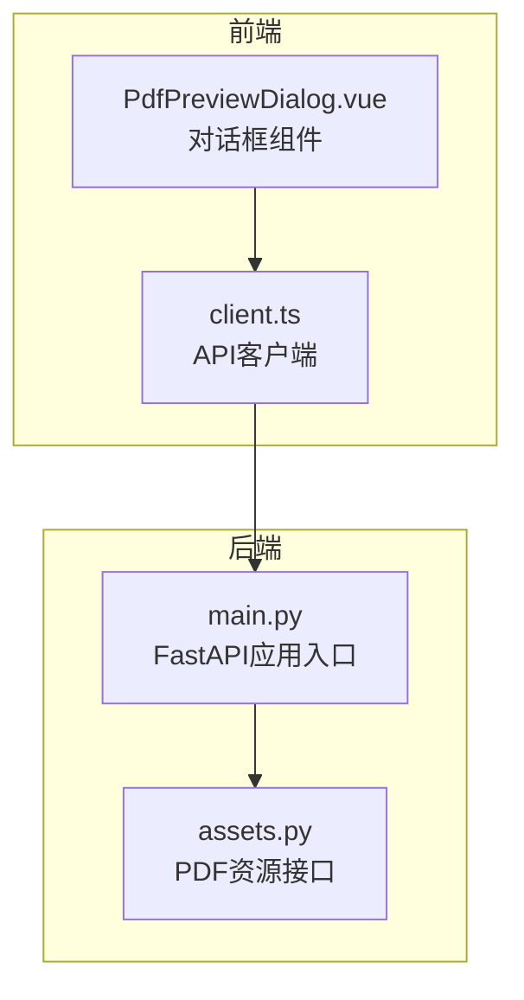
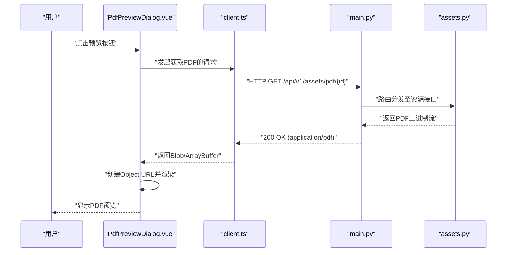
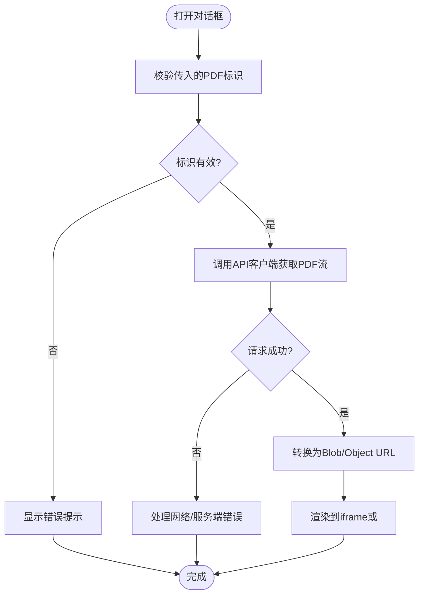
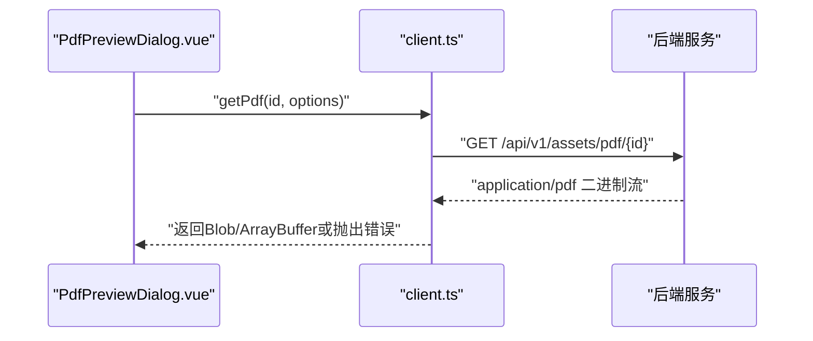
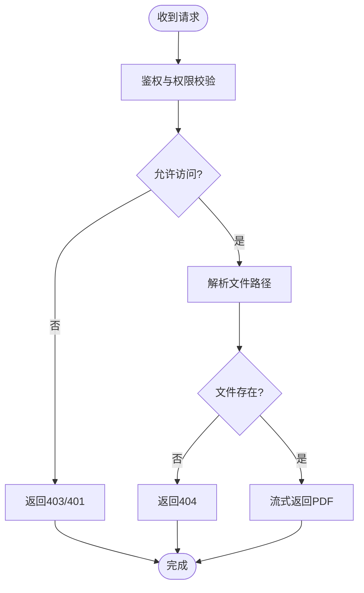
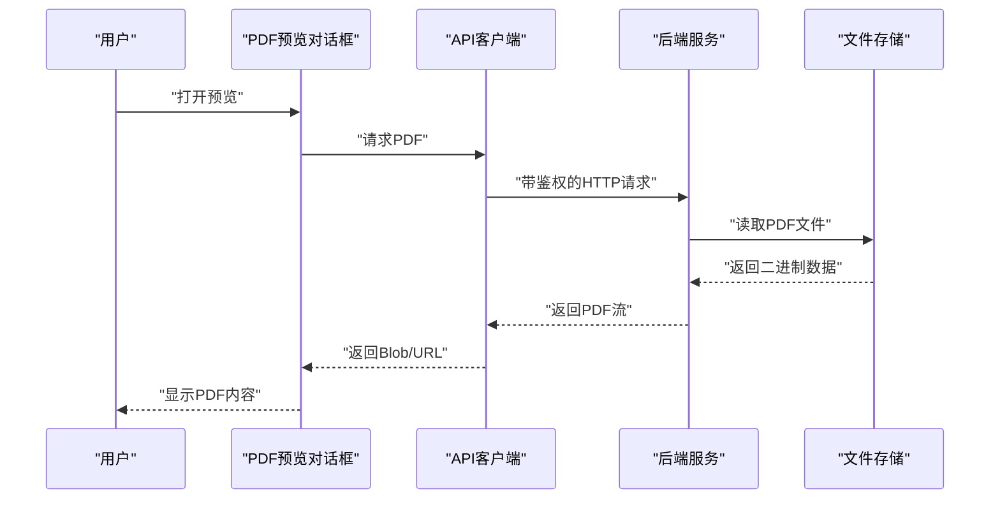
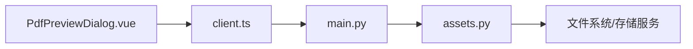

# PDF预览对话框

<cite>
**本文档引用的文件**   
- [PdfPreviewDialog.vue](file://frontend/src/components/PdfPreviewDialog.vue)
- [client.ts](file://frontend/src/api/client.ts)
- [assets.py](file://backend/app/api/v1/assets.py)
- [main.py](file://backend/app/main.py)
- [Dockerfile](file://backend/Dockerfile)
</cite>

## 目录
1. [简介](#简介)
2. [项目结构](#项目结构)
3. [核心组件](#核心组件)
4. [架构总览](#架构总览)
5. [详细组件分析](#详细组件分析)
6. [依赖关系分析](#依赖关系分析)
7. [性能考虑](#性能考虑)
8. [故障排查指南](#故障排查指南)
9. [结论](#结论)
10. [附录](#附录)

## 简介
本文件围绕“PDF预览对话框”功能，梳理前端与后端的交互流程、数据流转与关键实现要点。该功能通常用于在报告或资产详情中打开一个对话框，在线预览PDF文档内容，支持加载状态、错误提示、全屏/关闭等交互。

## 项目结构
本项目采用前后端分离架构：
- 前端使用 Vue + TypeScript，通过 API 客户端调用后端接口获取PDF二进制流并在浏览器内渲染。
- 后端基于 FastAPI，提供受保护的接口返回PDF文件或相关元信息。

**图表来源** 
- [PdfPreviewDialog.vue](file://frontend/src/components/PdfPreviewDialog.vue)
- [client.ts](file://frontend/src/api/client.ts)
- [main.py](file://backend/app/main.py)
- [assets.py](file://backend/app/api/v1/assets.py)

**章节来源**
- [PdfPreviewDialog.vue](file://frontend/src/components/PdfPreviewDialog.vue)
- [client.ts](file://frontend/src/api/client.ts)
- [assets.py](file://backend/app/api/v1/assets.py)
- [main.py](file://backend/app/main.py)

## 核心组件
- 前端对话框组件：负责展示PDF预览、控制显示/隐藏、处理加载与错误状态、触发下载或全屏查看。
- API客户端：封装HTTP请求，设置响应类型为二进制流，并处理鉴权头（如Token）。
- 后端接口：校验权限、定位PDF文件路径、以流式方式返回二进制数据，设置合适的Content-Type与文件名。

**章节来源**
- [PdfPreviewDialog.vue](file://frontend/src/components/PdfPreviewDialog.vue)
- [client.ts](file://frontend/src/api/client.ts)
- [assets.py](file://backend/app/api/v1/assets.py)

## 架构总览
PDF预览的整体流程如下：用户触发打开对话框 → 组件调用API客户端 → 后端验证权限并返回PDF二进制流 → 前端将流转换为Blob/URL并渲染到iframe或对象标签中。

**图表来源** 
- [client.ts](file://frontend/src/api/client.ts)
- [main.py](file://backend/app/main.py)
- [assets.py](file://backend/app/api/v1/assets.py)
- [PdfPreviewDialog.vue](file://frontend/src/components/PdfPreviewDialog.vue)

## 详细组件分析

### 前端对话框组件（PdfPreviewDialog.vue）
职责与行为：
- 控制对话框的可见性与遮罩层。
- 管理加载状态与错误消息。
- 接收PDF标识（如ID或URL），调用API客户端获取二进制数据。
- 将二进制数据转换为可渲染的URL并嵌入iframe或<object>标签。
- 提供关闭、下载、全屏等操作。

交互时序（从用户操作到渲染完成）：

**图表来源** 
- [PdfPreviewDialog.vue](file://frontend/src/components/PdfPreviewDialog.vue)
- [client.ts](file://frontend/src/api/client.ts)

**章节来源**
- [PdfPreviewDialog.vue](file://frontend/src/components/PdfPreviewDialog.vue)

### API客户端（client.ts）
职责与行为：
- 统一封装HTTP请求，注入鉴权头（如Authorization）。
- 针对PDF接口设置响应类型为arraybuffer或blob，避免文本解码错误。
- 处理常见异常（超时、网络错误、非2xx状态码），向上抛出结构化错误。

典型调用链：

**图表来源** 
- [client.ts](file://frontend/src/api/client.ts)
- [assets.py](file://backend/app/api/v1/assets.py)

**章节来源**
- [client.ts](file://frontend/src/api/client.ts)

### 后端接口（assets.py）
职责与行为：
- 定义PDF资源的路由与参数校验。
- 校验当前用户权限（如是否属于对应资产或报告的所有者）。
- 根据ID解析实际文件路径，检查文件存在性。
- 以流式方式返回PDF二进制数据，设置正确的Content-Type与Content-Disposition。

权限与文件查找流程：

**图表来源** 
- [assets.py](file://backend/app/api/v1/assets.py)
- [main.py](file://backend/app/main.py)

**章节来源**
- [assets.py](file://backend/app/api/v1/assets.py)
- [main.py](file://backend/app/main.py)

### 概念总览
下图为概念层面的端到端流程，帮助理解整体交互而不绑定具体代码文件：

[本图为概念流程图，不直接映射具体源码文件]

## 依赖关系分析
- 前端依赖：Vue组件、TypeScript、浏览器原生API（Blob、URL.createObjectURL）、HTTP客户端库（如axios/fetch）。
- 后端依赖：FastAPI框架、文件系统访问、鉴权中间件、可能的存储服务（本地磁盘或对象存储）。

**图表来源** 
- [PdfPreviewDialog.vue](file://frontend/src/components/PdfPreviewDialog.vue)
- [client.ts](file://frontend/src/api/client.ts)
- [main.py](file://backend/app/main.py)
- [assets.py](file://backend/app/api/v1/assets.py)

**章节来源**
- [PdfPreviewDialog.vue](file://frontend/src/components/PdfPreviewDialog.vue)
- [client.ts](file://frontend/src/api/client.ts)
- [assets.py](file://backend/app/api/v1/assets.py)
- [main.py](file://backend/app/main.py)

## 性能考虑
- 流式传输：后端应使用流式响应，避免一次性加载大文件到内存。
- 缓存策略：对频繁访问的PDF可启用浏览器缓存（Cache-Control）或CDN加速。
- 前端渲染：优先使用iframe或<object>标签直接渲染PDF，减少额外解析开销。
- 错误重试：对网络抖动场景增加有限次重试与退避策略。
- 容器化部署：确保后端容器具备足够的I/O能力与合理的超时配置。

[本节为通用指导，不直接分析具体文件]

## 故障排查指南
常见问题与定位方法：
- 无法加载PDF：检查网络请求是否返回200与application/pdf；确认鉴权头是否正确传递。
- 权限错误：核对用户角色与资源归属关系；检查后端权限逻辑。
- 文件不存在：确认ID到文件路径的映射是否正确；检查存储路径与权限。
- 前端渲染失败：检查Blob转换与URL生成；确认浏览器兼容性。
- 容器问题：检查后端Docker镜像构建与运行时环境变量（如文件挂载路径）。

**章节来源**
- [assets.py](file://backend/app/api/v1/assets.py)
- [client.ts](file://frontend/src/api/client.ts)
- [PdfPreviewDialog.vue](file://frontend/src/components/PdfPreviewDialog.vue)
- [Dockerfile](file://backend/Dockerfile)

## 结论
PDF预览对话框通过清晰的前后端分工实现了安全的文件访问与流畅的用户体验。关键在于：
- 前端正确设置响应类型与渲染方式。
- 后端严格鉴权并以流式返回二进制数据。
- 完善的错误处理与用户体验反馈。

[本节为总结，不直接分析具体文件]

## 附录
- 建议的接口命名规范：/api/v1/assets/pdf/{id}
- 建议的响应头：Content-Type: application/pdf；Content-Disposition: inline; filename="xxx.pdf"
- 安全建议：限制文件大小、校验文件类型、启用访问审计日志

[本节为补充说明，不直接分析具体文件]