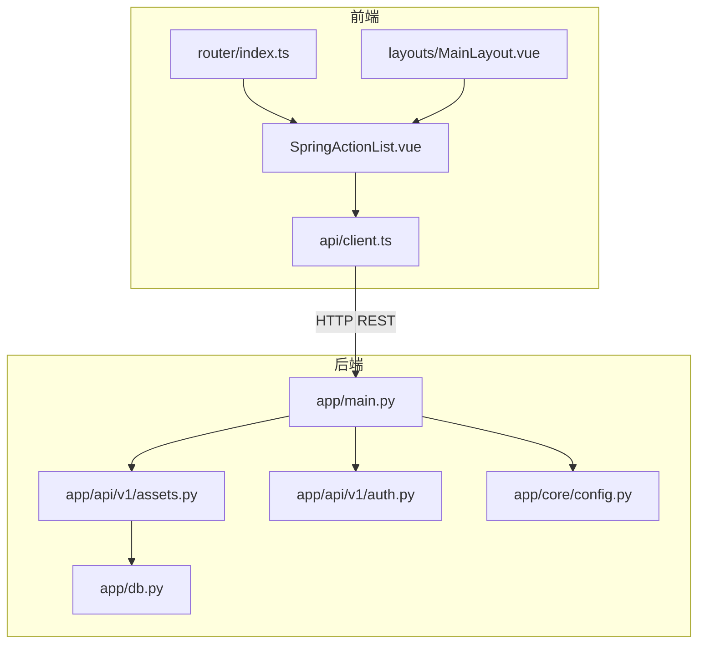
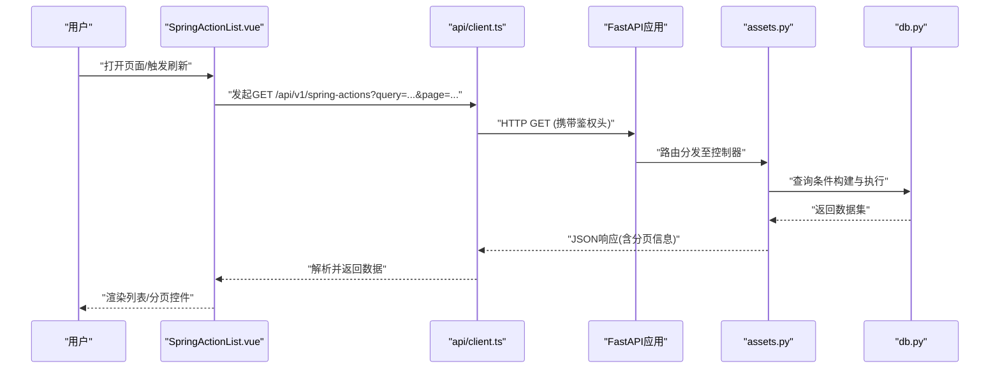
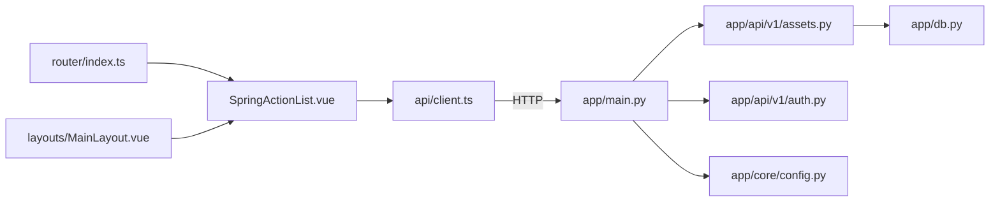

# Spring行动列表页面

<cite>
**本文引用的文件**   
- [SpringActionList.vue](file://frontend/src/views/SpringActionList.vue)
- [client.ts](file://frontend/src/api/client.ts)
- [MainLayout.vue](file://frontend/src/layouts/MainLayout.vue)
- [index.ts](file://frontend/src/router/index.ts)
- [main.py](file://backend/app/main.py)
- [assets.py](file://backend/app/api/v1/assets.py)
- [auth.py](file://backend/app/api/v1/auth.py)
- [config.py](file://backend/app/core/config.py)
- [db.py](file://backend/app/db.py)
</cite>

## 目录
1. [简介](#简介)
2. [项目结构](#项目结构)
3. [核心组件](#核心组件)
4. [架构总览](#架构总览)
5. [详细组件分析](#详细组件分析)
6. [依赖关系分析](#依赖关系分析)
7. [性能考虑](#性能考虑)
8. [故障排查指南](#故障排查指南)
9. [结论](#结论)
10. [附录](#附录)

## 简介
本文件围绕“Spring行动列表页面”进行系统化文档化，涵盖前后端交互、数据流、关键组件职责与实现要点。该页面用于展示与管理“Spring行动”相关条目，通常具备列表展示、搜索过滤、分页、新增/编辑/删除等常见功能。前端基于Vue 3 + TypeScript，后端基于Python FastAPI，通过REST API进行通信。

## 项目结构
本项目采用前后端分离架构：
- 前端位于 frontend/src，包含视图、路由、状态管理、API客户端与通用组件。
- 后端位于 backend/app，包含API路由、模型、服务、数据库配置与启动入口。

图表来源
- [SpringActionList.vue](file://frontend/src/views/SpringActionList.vue)
- [client.ts](file://frontend/src/api/client.ts)
- [index.ts](file://frontend/src/router/index.ts)
- [main.py](file://backend/app/main.py)
- [assets.py](file://backend/app/api/v1/assets.py)
- [auth.py](file://backend/app/api/v1/auth.py)
- [db.py](file://backend/app/db.py)
- [config.py](file://backend/app/core/config.py)

章节来源
- [SpringActionList.vue](file://frontend/src/views/SpringActionList.vue)
- [client.ts](file://frontend/src/api/client.ts)
- [index.ts](file://frontend/src/router/index.ts)
- [main.py](file://backend/app/main.py)
- [assets.py](file://backend/app/api/v1/assets.py)
- [auth.py](file://backend/app/api/v1/auth.py)
- [db.py](file://backend/app/db.py)
- [config.py](file://backend/app/core/config.py)

## 核心组件
- 前端视图组件：负责渲染列表、处理用户交互（筛选、分页、操作按钮）、调用API并更新本地状态。
- API客户端：封装HTTP请求、错误处理、鉴权头注入、基础URL配置。
- 路由配置：将页面路径映射到对应视图组件。
- 后端API：提供REST接口，接收查询参数、返回结构化数据；必要时进行权限校验。
- 数据库层：定义连接与ORM会话，供业务逻辑访问持久化数据。

章节来源
- [SpringActionList.vue](file://frontend/src/views/SpringActionList.vue)
- [client.ts](file://frontend/src/api/client.ts)
- [index.ts](file://frontend/src/router/index.ts)
- [assets.py](file://backend/app/api/v1/assets.py)
- [auth.py](file://backend/app/api/v1/auth.py)
- [db.py](file://backend/app/db.py)

## 架构总览
下图展示了从用户操作到数据落库的端到端流程，包括前端组件、API客户端、后端路由、鉴权与数据库访问。

图表来源
- [SpringActionList.vue](file://frontend/src/views/SpringActionList.vue)
- [client.ts](file://frontend/src/api/client.ts)
- [assets.py](file://backend/app/api/v1/assets.py)
- [db.py](file://backend/app/db.py)
- [main.py](file://backend/app/main.py)

## 详细组件分析

### 前端：SpringActionList.vue
- 职责
  - 维护列表数据、分页状态、搜索过滤条件。
  - 监听用户输入变化，触发API请求。
  - 处理新增、编辑、删除等操作，并在成功后刷新列表。
  - 错误提示与加载状态管理。
- 交互流程
  - 页面初始化时拉取第一页数据。
  - 用户修改筛选条件或切换页码时重新请求。
  - 操作成功后调用统一提示组件并刷新列表。
- 关键点
  - 使用防抖优化搜索输入。
  - 对空数据与异常状态进行友好展示。
  - 与权限控制集成，隐藏无权限的操作按钮。

章节来源
- [SpringActionList.vue](file://frontend/src/views/SpringActionList.vue)

### 前端：API客户端 client.ts
- 职责
  - 统一封装HTTP请求方法（GET/POST/PUT/DELETE）。
  - 注入鉴权令牌（如Bearer Token）与基础URL。
  - 统一错误处理（网络错误、业务错误码）。
- 关键点
  - 拦截器模式处理全局错误与重定向。
  - 支持请求重试与超时配置。
  - 类型化响应以便前端消费。

章节来源
- [client.ts](file://frontend/src/api/client.ts)

### 前端：路由 index.ts
- 职责
  - 注册Spring行动列表页面的路由路径与懒加载。
  - 与布局组件集成，确保导航一致。
- 关键点
  - 路由守卫结合鉴权状态，未登录跳转登录页。
  - 动态菜单项与权限控制联动。

章节来源
- [index.ts](file://frontend/src/router/index.ts)

### 后端：主应用 main.py
- 职责
  - 创建FastAPI应用实例，挂载中间件与CORS。
  - 注册API路由前缀（如 /api/v1）。
  - 全局异常处理与健康检查端点。
- 关键点
  - 环境变量加载与配置注入。
  - 日志与监控接入点。

章节来源
- [main.py](file://backend/app/main.py)

### 后端：API assets.py
- 职责
  - 定义Spring行动相关的CRUD接口。
  - 解析查询参数（分页、排序、过滤）。
  - 权限校验与审计日志记录。
- 关键点
  - 输入校验与错误码标准化。
  - 与数据库服务解耦，便于测试与扩展。

章节来源
- [assets.py](file://backend/app/api/v1/assets.py)

### 后端：鉴权 auth.py
- 职责
  - 提供登录、令牌签发与验证逻辑。
  - 保护受保护路由的装饰器或依赖注入。
- 关键点
  - 密码哈希与安全存储。
  - 令牌过期与刷新策略。

章节来源
- [auth.py](file://backend/app/api/v1/auth.py)

### 后端：数据库 db.py
- 职责
  - 初始化数据库连接与会话工厂。
  - 提供事务管理与连接池配置。
- 关键点
  - 连接失败重试与优雅降级。
  - SQLAlchemy异步/同步适配。

章节来源
- [db.py](file://backend/app/db.py)

### 后端：配置 config.py
- 职责
  - 集中管理环境变量（数据库URL、JWT密钥、CORS白名单等）。
  - 提供类型安全的配置读取。
- 关键点
  - 开发/生产环境差异化配置。
  - 敏感信息不硬编码，优先从环境变量或密钥管理服务获取。

章节来源
- [config.py](file://backend/app/core/config.py)

## 依赖关系分析
- 前端依赖
  - SpringActionList.vue 依赖 api/client.ts 进行网络请求。
  - 路由 index.ts 将页面路径映射到组件。
  - 布局 MainLayout.vue 提供统一的导航与侧边栏。
- 后端依赖
  - main.py 挂载 v1 路由组，包含 assets.py、auth.py 等。
  - assets.py 依赖 db.py 进行数据访问。
  - 所有模块依赖 config.py 获取运行时配置。

图表来源
- [SpringActionList.vue](file://frontend/src/views/SpringActionList.vue)
- [client.ts](file://frontend/src/api/client.ts)
- [index.ts](file://frontend/src/router/index.ts)
- [main.py](file://backend/app/main.py)
- [assets.py](file://backend/app/api/v1/assets.py)
- [auth.py](file://backend/app/api/v1/auth.py)
- [db.py](file://backend/app/db.py)
- [config.py](file://backend/app/core/config.py)

章节来源
- [SpringActionList.vue](file://frontend/src/views/SpringActionList.vue)
- [client.ts](file://frontend/src/api/client.ts)
- [index.ts](file://frontend/src/router/index.ts)
- [main.py](file://backend/app/main.py)
- [assets.py](file://backend/app/api/v1/assets.py)
- [auth.py](file://backend/app/api/v1/auth.py)
- [db.py](file://backend/app/db.py)
- [config.py](file://backend/app/core/config.py)

## 性能考虑
- 前端
  - 列表数据分页加载，避免一次性渲染大量DOM。
  - 搜索输入防抖，减少频繁请求。
  - 组件懒加载与路由级代码分割，降低首屏体积。
- 后端
  - 数据库查询使用索引与必要字段投影，减少IO。
  - 分页与排序在SQL层完成，避免内存排序。
  - 缓存热点数据（如字典表、常用筛选选项）。
  - 合理设置连接池大小与超时时间。

[本节为通用指导，不直接分析具体文件]

## 故障排查指南
- 前端常见问题
  - 页面空白或报错：检查路由是否正确注册、组件是否成功加载。
  - 列表无数据：确认API返回结构与前端期望一致，查看控制台网络请求。
  - 鉴权失败：检查Token是否有效、是否随请求发送。
- 后端常见问题
  - 401/403：确认鉴权中间件与路由保护配置。
  - 500错误：查看后端日志定位异常堆栈，检查数据库连接与SQL语句。
  - CORS错误：核对允许的源与方法。
- 调试建议
  - 使用浏览器开发者工具观察请求与响应。
  - 在后端启用详细日志与请求追踪。
  - 对关键接口编写单元测试与集成测试。

章节来源
- [client.ts](file://frontend/src/api/client.ts)
- [assets.py](file://backend/app/api/v1/assets.py)
- [auth.py](file://backend/app/api/v1/auth.py)
- [db.py](file://backend/app/db.py)
- [config.py](file://backend/app/core/config.py)

## 结论
Spring行动列表页面通过清晰的前后端分层与职责划分，实现了稳定的数据展示与交互能力。前端注重用户体验与可维护性，后端强调安全、可扩展与高性能。建议在后续迭代中持续完善错误处理、监控与测试覆盖，以提升整体质量与可观测性。

[本节为总结性内容，不直接分析具体文件]

## 附录
- 术语说明
  - Spring行动：指系统内与Spring相关的行动计划或任务条目。
  - 分页：将大数据集拆分为多页以减少单次传输与渲染压力。
  - 鉴权：验证用户身份与权限的过程。
- 参考文件
  - 前端视图与API客户端、路由配置
  - 后端API、鉴权、数据库与配置模块

[本节为补充信息，不直接分析具体文件]