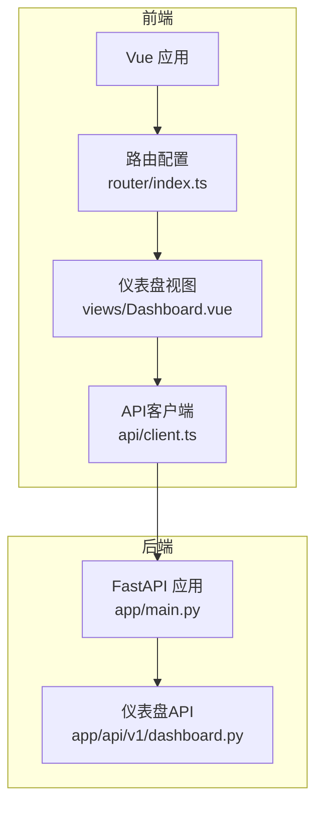
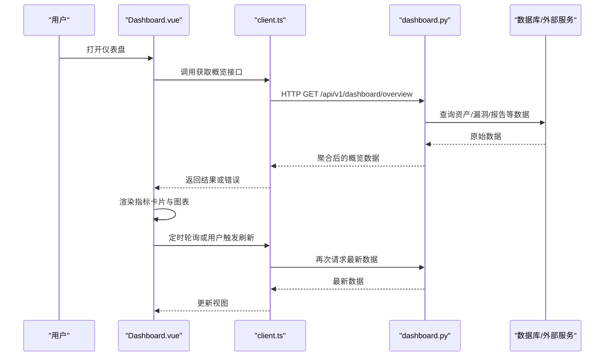
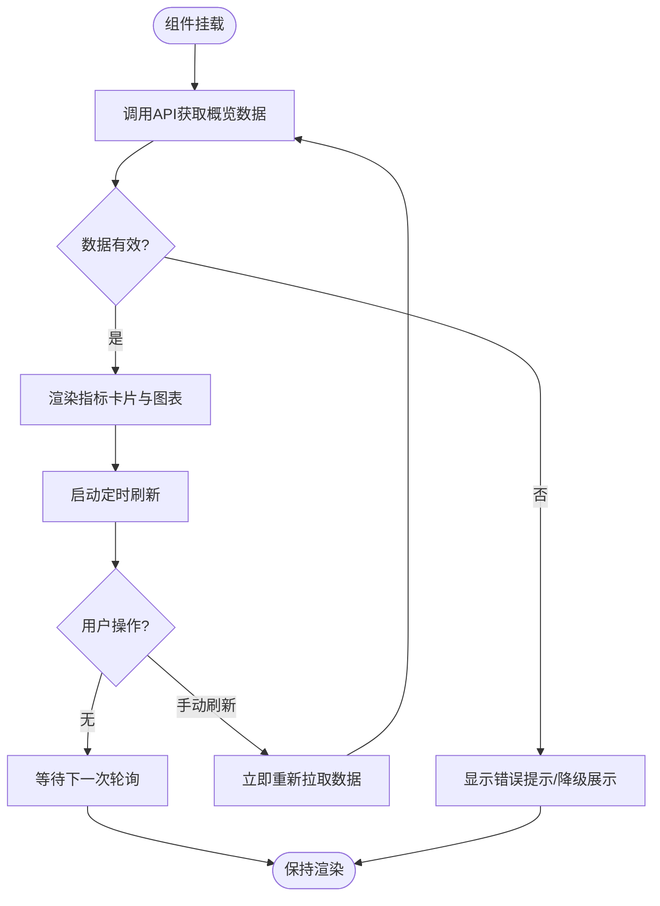
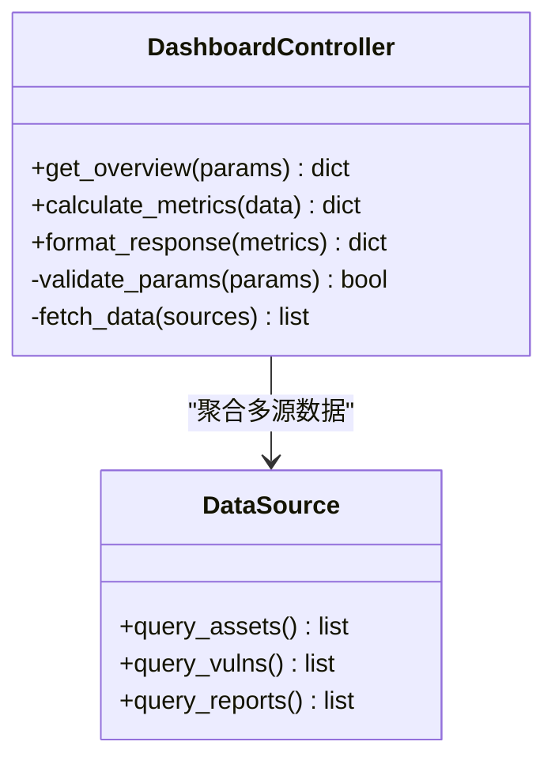
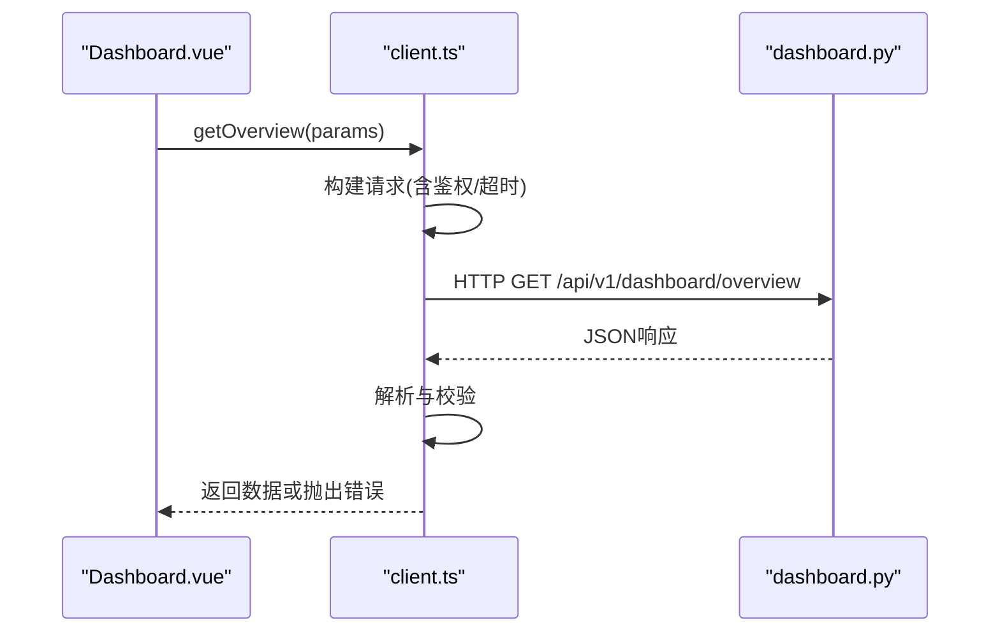
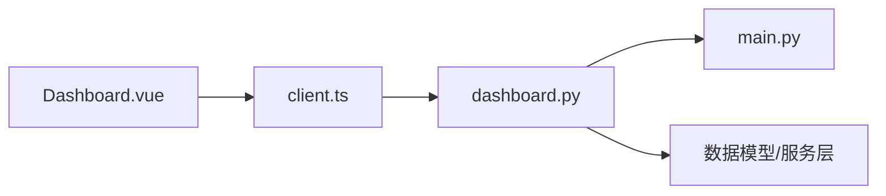

# 仪表盘页面

<cite>
**本文引用的文件**   
- [Dashboard.vue](file://frontend/src/views/Dashboard.vue)
- [client.ts](file://frontend/src/api/client.ts)
- [dashboard.py](file://backend/app/api/v1/dashboard.py)
- [main.py](file://backend/app/main.py)
- [router/index.ts](file://frontend/src/router/index.ts)
</cite>

## 目录
1. [简介](#简介)
2. [项目结构](#项目结构)
3. [核心组件](#核心组件)
4. [架构总览](#架构总览)
5. [详细组件分析](#详细组件分析)
6. [依赖关系分析](#依赖关系分析)
7. [性能考虑](#性能考虑)
8. [故障排查指南](#故障排查指南)
9. [结论](#结论)
10. [附录](#附录)

## 简介
本文件面向Talos项目的仪表盘页面，聚焦前端Dashboard.vue组件的实现与后端API的集成方式。文档涵盖系统概览数据展示、关键指标可视化图表、实时状态监控、数据获取与更新机制、错误处理策略、性能优化建议以及自定义仪表板配置的扩展方法。读者无需深入代码即可理解整体设计与使用方式。

## 项目结构
仪表盘功能由前后端协同实现：
- 前端：Vue单页应用中的Dashboard视图负责渲染UI、发起请求、管理本地状态与图表渲染。
- 后端：FastAPI提供REST API接口，聚合业务数据并返回给前端。
- 路由：前端通过路由将URL映射到Dashboard视图；后端通过API路由注册仪表盘相关接口。

**图示来源**
- [router/index.ts](file://frontend/src/router/index.ts)
- [Dashboard.vue](file://frontend/src/views/Dashboard.vue)
- [client.ts](file://frontend/src/api/client.ts)
- [main.py](file://backend/app/main.py)
- [dashboard.py](file://backend/app/api/v1/dashboard.py)

**章节来源**
- [router/index.ts](file://frontend/src/router/index.ts)
- [Dashboard.vue](file://frontend/src/views/Dashboard.vue)
- [client.ts](file://frontend/src/api/client.ts)
- [main.py](file://backend/app/main.py)
- [dashboard.py](file://backend/app/api/v1/dashboard.py)

## 核心组件
- Dashboard.vue：仪表盘主视图，负责加载系统概览数据、渲染关键指标卡片与图表、维护刷新周期与用户交互。
- client.ts：统一HTTP客户端封装，集中处理请求拦截、响应解析、错误处理与重试策略。
- dashboard.py（后端）：仪表盘API控制器，聚合多源数据（如资产、漏洞、报告等），计算统计指标并返回结构化JSON。
- main.py（后端）：FastAPI应用入口，挂载API路由与中间件，暴露/health等基础能力。

**章节来源**
- [Dashboard.vue](file://frontend/src/views/Dashboard.vue)
- [client.ts](file://frontend/src/api/client.ts)
- [dashboard.py](file://backend/app/api/v1/dashboard.py)
- [main.py](file://backend/app/main.py)

## 架构总览
仪表盘的数据流遵循“视图→客户端→后端API→数据源”的标准模式，支持定时刷新与手动刷新。

**图示来源**
- [Dashboard.vue](file://frontend/src/views/Dashboard.vue)
- [client.ts](file://frontend/src/api/client.ts)
- [dashboard.py](file://backend/app/api/v1/dashboard.py)
- [main.py](file://backend/app/main.py)

## 详细组件分析

### Dashboard.vue 组件分析
- 功能职责
  - 初始化时拉取系统概览数据，包括资产总数、漏洞分布、报告数量、最近活动等。
  - 渲染关键指标卡片（如总数、趋势、健康度）。
  - 渲染可视化图表（如折线图、柱状图、饼图），展示时间序列与分类占比。
  - 提供刷新按钮与自动轮询，支持按时间范围筛选。
  - 处理加载态、错误态与空数据态。
- 数据获取逻辑
  - 通过client.ts调用后端仪表盘API，获取结构化数据。
  - 对响应进行校验与转换，确保字段一致性与类型安全。
  - 失败时执行降级策略（显示缓存数据或友好提示）。
- 图表渲染与交互
  - 根据数据动态生成图表，支持缩放、图例切换、工具提示。
  - 点击图表项可跳转至详情页面或过滤列表。
- 实时更新机制
  - 使用定时器周期性拉取最新数据，避免频繁刷新导致性能问题。
  - 支持用户手动刷新，优先于自动刷新。
- 错误处理
  - 网络异常、服务端错误、数据格式不一致均被捕获并提示。
  - 提供重试与回退逻辑，保证用户体验。

**图示来源**
- [Dashboard.vue](file://frontend/src/views/Dashboard.vue)
- [client.ts](file://frontend/src/api/client.ts)

**章节来源**
- [Dashboard.vue](file://frontend/src/views/Dashboard.vue)
- [client.ts](file://frontend/src/api/client.ts)

### 后端仪表盘API（dashboard.py）分析
- 接口设计
  - 提供概览聚合接口，返回资产、漏洞、报告等关键指标的汇总数据。
  - 支持可选参数（如时间范围、分组维度），便于前端灵活展示。
- 数据处理
  - 从数据库或外部服务读取原始数据，进行聚合计算与格式化。
  - 对缺失数据进行默认值填充，保证前端渲染稳定。
- 错误与边界
  - 对非法参数进行校验，返回明确的错误信息。
  - 对超时与异常进行捕获，避免影响整体服务稳定性。

**图示来源**
- [dashboard.py](file://backend/app/api/v1/dashboard.py)

**章节来源**
- [dashboard.py](file://backend/app/api/v1/dashboard.py)

### API客户端（client.ts）分析
- 职责
  - 封装HTTP请求，统一设置请求头、超时、重试策略。
  - 处理响应数据与错误，提供统一的错误码与消息。
  - 为仪表盘API提供专用方法，简化调用。
- 特性
  - 支持请求拦截（如鉴权令牌注入）。
  - 支持响应拦截（如数据解包、错误映射）。
  - 提供取消重复请求的能力，避免竞态条件。

**图示来源**
- [client.ts](file://frontend/src/api/client.ts)
- [dashboard.py](file://backend/app/api/v1/dashboard.py)

**章节来源**
- [client.ts](file://frontend/src/api/client.ts)
- [dashboard.py](file://backend/app/api/v1/dashboard.py)

## 依赖关系分析
- 前端依赖
  - Dashboard.vue依赖client.ts进行数据获取，依赖路由进行页面导航。
  - 图表库依赖（如ECharts/AntV）用于渲染可视化图表。
- 后端依赖
  - dashboard.py依赖数据库模型与服务层，聚合多源数据。
  - main.py挂载API路由，提供全局中间件（如CORS、日志、鉴权）。

**图示来源**
- [Dashboard.vue](file://frontend/src/views/Dashboard.vue)
- [client.ts](file://frontend/src/api/client.ts)
- [dashboard.py](file://backend/app/api/v1/dashboard.py)
- [main.py](file://backend/app/main.py)

**章节来源**
- [Dashboard.vue](file://frontend/src/views/Dashboard.vue)
- [client.ts](file://frontend/src/api/client.ts)
- [dashboard.py](file://backend/app/api/v1/dashboard.py)
- [main.py](file://backend/app/main.py)

## 性能考虑
- 前端优化
  - 使用防抖与节流控制刷新频率，避免频繁请求。
  - 图表按需渲染，仅在可见区域或激活标签页中绘制。
  - 缓存历史数据，减少重复计算与渲染开销。
- 后端优化
  - 对聚合查询进行索引优化，减少数据库扫描。
  - 使用分页与增量更新，降低单次响应体积。
  - 启用响应压缩与缓存头，提升传输效率。
- 网络优化
  - 合并多个小请求为大请求，减少握手开销。
  - 使用HTTP/2与CDN加速静态资源。

[本节为通用指导，不直接分析具体文件]

## 故障排查指南
- 常见问题
  - 数据为空：检查后端聚合逻辑与数据源可用性。
  - 图表不显示：确认数据结构与图表库期望格式一致。
  - 刷新卡顿：调整轮询间隔与请求去重策略。
  - 权限错误：检查鉴权令牌与后端权限校验。
- 调试步骤
  - 查看浏览器控制台与网络面板，定位请求与响应。
  - 在后端日志中搜索对应接口的错误堆栈。
  - 使用Mock数据验证前端渲染逻辑。

**章节来源**
- [Dashboard.vue](file://frontend/src/views/Dashboard.vue)
- [client.ts](file://frontend/src/api/client.ts)
- [dashboard.py](file://backend/app/api/v1/dashboard.py)

## 结论
仪表盘页面通过清晰的前后端分离架构，实现了系统概览数据的可视化与实时监控。Dashboard.vue负责渲染与交互，client.ts统一数据访问，后端dashboard.py提供聚合接口。通过合理的性能优化与错误处理策略，保障了用户体验与系统稳定性。未来可扩展更多指标与自定义配置，满足多样化监控需求。

[本节为总结性内容，不直接分析具体文件]

## 附录
- 自定义仪表板配置扩展方法
  - 在前端增加配置项（如指标开关、时间范围、图表类型），通过localStorage或后端配置中心持久化。
  - 在Dashboard.vue中读取配置，动态渲染对应组件。
  - 在后端dashboard.py中支持按配置过滤与聚合数据。
  - 提供配置导入/导出功能，便于团队协作与复用。

[本节为概念性内容，不直接分析具体文件]