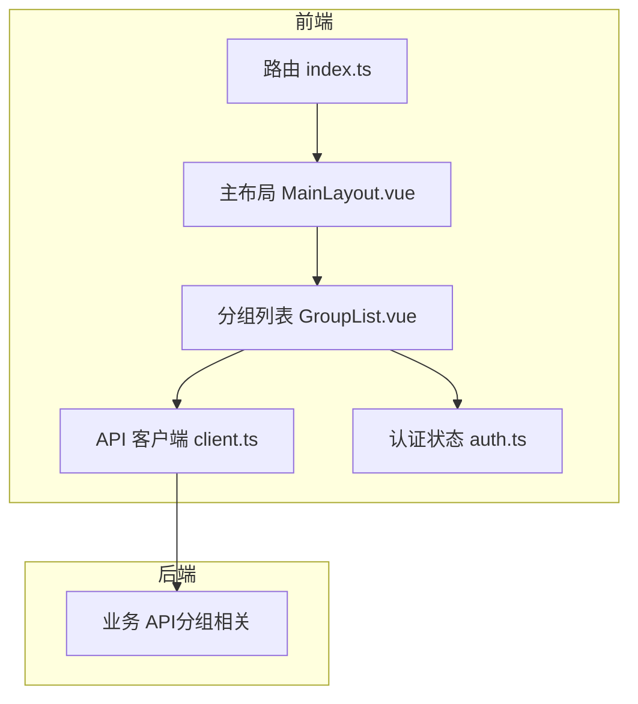
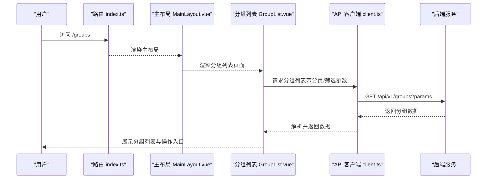
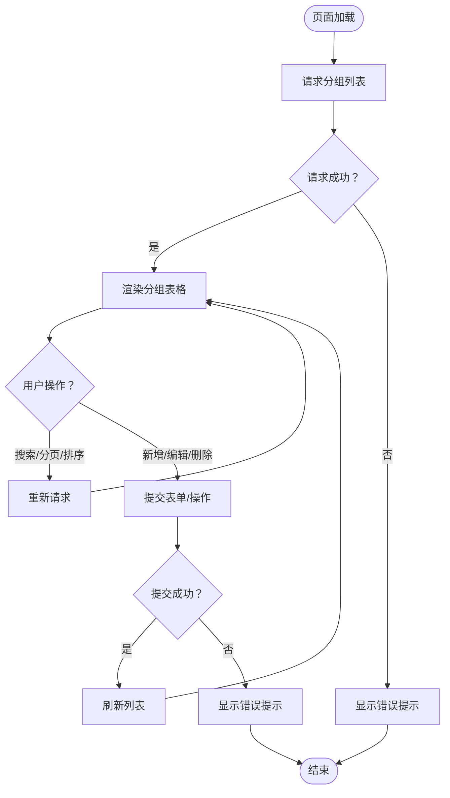
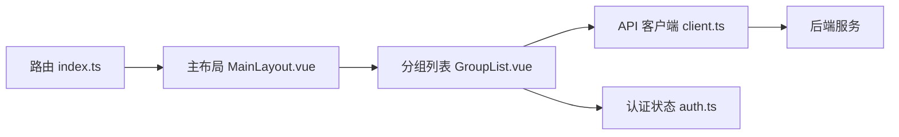

# 分组列表页面

<cite>
**本文引用的文件**   
- [GroupList.vue](file://frontend/src/views/GroupList.vue)
- [client.ts](file://frontend/src/api/client.ts)
- [router/index.ts](file://frontend/src/router/index.ts)
- [MainLayout.vue](file://frontend/src/layouts/MainLayout.vue)
- [auth.ts](file://frontend/src/stores/auth.ts)
</cite>

## 目录
1. [简介](#简介)
2. [项目结构](#项目结构)
3. [核心组件](#核心组件)
4. [架构总览](#架构总览)
5. [详细组件分析](#详细组件分析)
6. [依赖分析](#依赖分析)
7. [性能考虑](#性能考虑)
8. [故障排查指南](#故障排查指南)
9. [结论](#结论)
10. [附录](#附录)

## 简介
本文件面向“分组列表页面”的前端实现，聚焦于该页面的功能、交互流程、数据流以及与后端 API 的集成方式。文档以循序渐进的方式展开，既适合初学者快速上手，也便于有经验的开发者深入理解实现细节与优化点。

## 项目结构
前端采用 Vue 3 + TypeScript 的单页应用结构，分组列表页面位于 views 目录下，通过路由注册进入，使用统一的布局 MainLayout，并通过 api/client.ts 发起 HTTP 请求。认证状态由 stores/auth.ts 管理。

图表来源
- [router/index.ts](file://frontend/src/router/index.ts)
- [MainLayout.vue](file://frontend/src/layouts/MainLayout.vue)
- [GroupList.vue](file://frontend/src/views/GroupList.vue)
- [client.ts](file://frontend/src/api/client.ts)
- [auth.ts](file://frontend/src/stores/auth.ts)

章节来源
- [router/index.ts](file://frontend/src/router/index.ts)
- [MainLayout.vue](file://frontend/src/layouts/MainLayout.vue)
- [GroupList.vue](file://frontend/src/views/GroupList.vue)
- [client.ts](file://frontend/src/api/client.ts)
- [auth.ts](file://frontend/src/stores/auth.ts)

## 核心组件
- 分组列表页面（GroupList.vue）：负责展示分组数据、分页、搜索过滤、排序、新增/编辑/删除等交互。
- API 客户端（client.ts）：封装 HTTP 请求方法，统一处理鉴权头、错误响应与重试策略。
- 路由（router/index.ts）：定义分组列表页面的路由路径与权限守卫。
- 主布局（MainLayout.vue）：提供侧边栏、顶部导航与页面容器。
- 认证状态（auth.ts）：维护登录态、用户信息与 Token，为 API 调用提供鉴权上下文。

章节来源
- [GroupList.vue](file://frontend/src/views/GroupList.vue)
- [client.ts](file://frontend/src/api/client.ts)
- [router/index.ts](file://frontend/src/router/index.ts)
- [MainLayout.vue](file://frontend/src/layouts/MainLayout.vue)
- [auth.ts](file://frontend/src/stores/auth.ts)

## 架构总览
分组列表页面遵循典型的前后端分离架构：前端通过 API 客户端向后端发送 RESTful 请求，获取分组数据并进行渲染；同时利用认证状态进行权限控制与 Token 注入。

图表来源
- [router/index.ts](file://frontend/src/router/index.ts)
- [MainLayout.vue](file://frontend/src/layouts/MainLayout.vue)
- [GroupList.vue](file://frontend/src/views/GroupList.vue)
- [client.ts](file://frontend/src/api/client.ts)

## 详细组件分析

### 分组列表页面（GroupList.vue）
- 职责
  - 加载并展示分组数据，支持分页、搜索、排序与批量操作。
  - 提供新增、编辑、删除等交互入口，并在成功后刷新列表。
  - 根据认证状态控制操作按钮的可见性与可用性。
- 数据流
  - 初始化时从 API 拉取分组列表，结合本地状态渲染表格。
  - 用户触发搜索或分页时，重新构造查询参数并再次请求。
  - 表单提交后调用更新接口，成功后刷新列表并提示结果。
- 错误处理
  - 对网络异常与业务错误进行捕获，向用户反馈友好提示。
  - 在 Token 过期或无权限时引导重新登录或跳转授权页。
- 性能优化
  - 防抖搜索输入，避免频繁请求。
  - 分页加载减少首屏数据量。
  - 列表项虚拟化（如数据量大）可进一步降低渲染压力。

图表来源
- [GroupList.vue](file://frontend/src/views/GroupList.vue)
- [client.ts](file://frontend/src/api/client.ts)

章节来源
- [GroupList.vue](file://frontend/src/views/GroupList.vue)
- [client.ts](file://frontend/src/api/client.ts)

### API 客户端（client.ts）
- 职责
  - 封装统一的 HTTP 请求方法（GET/POST/PUT/DELETE）。
  - 自动附加鉴权头（如 Authorization），处理响应码与错误信息。
  - 提供拦截器用于日志记录、超时与重试策略。
- 关键特性
  - 错误分类：网络错误、业务错误、权限错误分别处理。
  - 请求去重与缓存：针对相同参数避免重复请求。
  - 类型安全：基于 TypeScript 定义请求与响应类型。

章节来源
- [client.ts](file://frontend/src/api/client.ts)

### 路由（router/index.ts）
- 职责
  - 定义分组列表页面的路由路径与元信息（标题、权限标识）。
  - 配置全局前置守卫，校验登录态与角色权限。
- 关键点
  - 路由懒加载，提升首屏性能。
  - 动态菜单生成与权限控制联动。

章节来源
- [router/index.ts](file://frontend/src/router/index.ts)

### 主布局（MainLayout.vue）
- 职责
  - 提供页面骨架：侧边栏、顶部导航、内容区域。
  - 集成面包屑、通知与全局设置。
- 关键点
  - 响应式布局适配不同屏幕尺寸。
  - 与路由保持同步，高亮当前菜单项。

章节来源
- [MainLayout.vue](file://frontend/src/layouts/MainLayout.vue)

### 认证状态（auth.ts）
- 职责
  - 管理用户登录态、Token 存储与过期刷新。
  - 暴露用户信息与权限集合，供页面与 API 客户端使用。
- 关键点
  - 持久化存储（localStorage/sessionStorage）。
  - 监听 Token 变化，自动更新请求头。

章节来源
- [auth.ts](file://frontend/src/stores/auth.ts)

## 依赖分析
分组列表页面依赖以下模块：
- 路由模块：决定页面是否可访问及权限校验。
- 布局模块：提供页面容器与导航上下文。
- API 客户端：负责与后端通信。
- 认证状态：提供鉴权上下文与用户信息。

图表来源
- [router/index.ts](file://frontend/src/router/index.ts)
- [MainLayout.vue](file://frontend/src/layouts/MainLayout.vue)
- [GroupList.vue](file://frontend/src/views/GroupList.vue)
- [client.ts](file://frontend/src/api/client.ts)
- [auth.ts](file://frontend/src/stores/auth.ts)

章节来源
- [router/index.ts](file://frontend/src/router/index.ts)
- [MainLayout.vue](file://frontend/src/layouts/MainLayout.vue)
- [GroupList.vue](file://frontend/src/views/GroupList.vue)
- [client.ts](file://frontend/src/api/client.ts)
- [auth.ts](file://frontend/src/stores/auth.ts)

## 性能考虑
- 首屏优化：路由懒加载、按需引入组件与样式。
- 列表渲染：分页加载、虚拟滚动（大数据集）、防抖搜索。
- 网络优化：请求去重、缓存策略、合理超时与重试。
- 内存管理：及时销毁监听器与定时器，避免泄漏。

[本节为通用指导，不直接分析具体文件]

## 故障排查指南
- 无法加载分组列表
  - 检查网络连通性与后端服务状态。
  - 确认 Token 有效且未过期。
  - 查看浏览器控制台与网络面板的错误信息。
- 操作失败（新增/编辑/删除）
  - 验证表单字段是否符合后端校验规则。
  - 检查权限是否足够执行对应操作。
  - 查看 API 客户端的错误分类与提示逻辑。
- 权限问题
  - 确认用户角色与路由守卫配置一致。
  - 检查认证状态是否正确持久化与刷新。

章节来源
- [client.ts](file://frontend/src/api/client.ts)
- [auth.ts](file://frontend/src/stores/auth.ts)
- [router/index.ts](file://frontend/src/router/index.ts)

## 结论
分组列表页面作为系统的基础功能之一，具备清晰的数据流与良好的模块化设计。通过统一的 API 客户端与认证状态管理，实现了稳定的前后端交互与权限控制。在实际使用中，建议持续关注性能优化与错误处理体验，以提升用户满意度与系统稳定性。

[本节为总结性内容，不直接分析具体文件]

## 附录
- 术语表
  - 分组：系统中用于归类资产或资源的实体。
  - 分页：将大量数据拆分为多页展示，提升加载性能。
  - 鉴权：验证用户身份与权限的过程。
- 参考链接
  - 前端工程规范与最佳实践
  - Vue 3 官方文档
  - TypeScript 类型系统指南

[本节为补充信息，不直接分析具体文件]