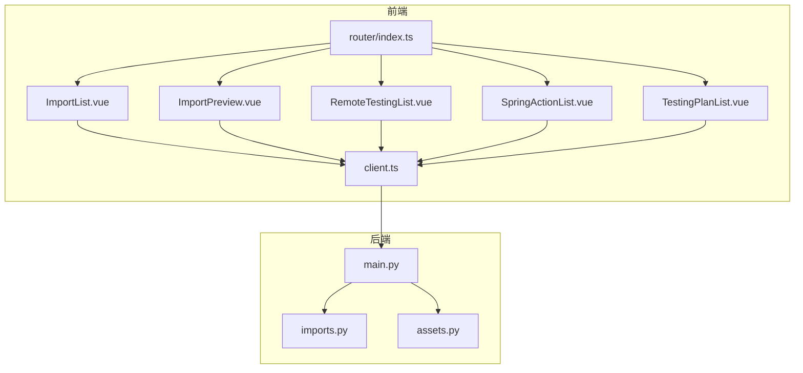
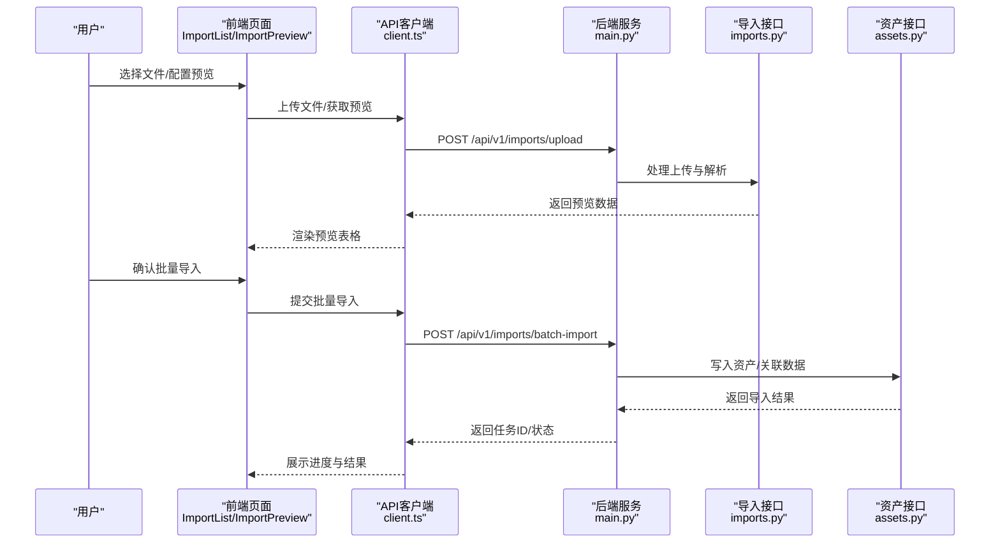
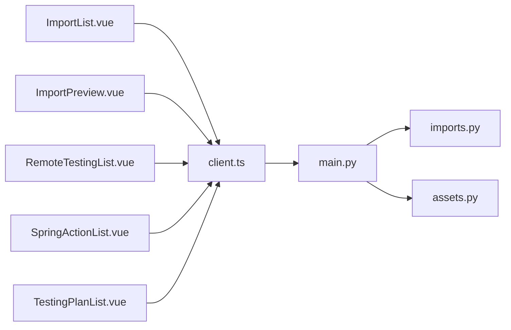

# 导入测试页面

<cite>
**本文档引用的文件**   
- [ImportList.vue](file://frontend/src/views/ImportList.vue)
- [ImportPreview.vue](file://frontend/src/views/ImportPreview.vue)
- [RemoteTestingList.vue](file://frontend/src/views/RemoteTestingList.vue)
- [SpringActionList.vue](file://frontend/src/views/SpringActionList.vue)
- [TestingPlanList.vue](file://frontend/src/views/TestingPlanList.vue)
- [imports.py](file://backend/app/api/v1/imports.py)
- [assets.py](file://backend/app/api/v1/assets.py)
- [main.py](file://backend/app/main.py)
- [client.ts](file://frontend/src/api/client.ts)
- [router/index.ts](file://frontend/src/router/index.ts)
</cite>

## 目录
1. [简介](#简介)
2. [项目结构](#项目结构)
3. [核心组件](#核心组件)
4. [架构总览](#架构总览)
5. [详细组件分析](#详细组件分析)
6. [依赖关系分析](#依赖关系分析)
7. [性能考虑](#性能考虑)
8. [故障排查指南](#故障排查指南)
9. [结论](#结论)
10. [附录](#附录)

## 简介
本文件面向Talos项目的“导入与测试”相关前端页面与后端接口，系统性说明以下能力：
- 导入列表与预览：ImportList.vue、ImportPreview.vue 的文件上传、数据预览与批量导入流程。
- 远程测试与动作管理：RemoteTestingList.vue、SpringActionList.vue 的远程测试任务管理与动作编排。
- 测试计划：TestingPlanList.vue 的计划创建、调度与执行监控。
- 异步任务处理：任务调度、进度跟踪、错误恢复策略。
- 工作流自定义与自动化集成方案。

## 项目结构
围绕导入与测试功能，前后端关键文件分布如下：
- 前端视图层：ImportList.vue、ImportPreview.vue、RemoteTestingList.vue、SpringActionList.vue、TestingPlanList.vue。
- 前端API客户端：client.ts（统一HTTP封装）。
- 路由配置：router/index.ts（页面路由与权限控制）。
- 后端API：imports.py（导入相关接口）、assets.py（资产相关接口，常与导入结果联动）。
- 应用入口：main.py（FastAPI应用注册、中间件、定时任务等）。

图表来源
- [ImportList.vue](file://frontend/src/views/ImportList.vue)
- [ImportPreview.vue](file://frontend/src/views/ImportPreview.vue)
- [RemoteTestingList.vue](file://frontend/src/views/RemoteTestingList.vue)
- [SpringActionList.vue](file://frontend/src/views/SpringActionList.vue)
- [TestingPlanList.vue](file://frontend/src/views/TestingPlanList.vue)
- [client.ts](file://frontend/src/api/client.ts)
- [router/index.ts](file://frontend/src/router/index.ts)
- [imports.py](file://backend/app/api/v1/imports.py)
- [assets.py](file://backend/app/api/v1/assets.py)
- [main.py](file://backend/app/main.py)

章节来源
- [main.py](file://backend/app/main.py)
- [imports.py](file://backend/app/api/v1/imports.py)
- [assets.py](file://backend/app/api/v1/assets.py)
- [client.ts](file://frontend/src/api/client.ts)
- [router/index.ts](file://frontend/src/router/index.ts)

## 核心组件
- ImportList.vue：负责文件选择、分片/直传、上传状态展示、失败重试、批量提交前的校验。
- ImportPreview.vue：解析并展示导入数据的预览表格，支持字段映射、过滤、去重、批量确认导入。
- RemoteTestingList.vue：远程测试任务列表，支持创建、启动、暂停、停止、查看日志与结果。
- SpringActionList.vue：动作管理，定义可复用的测试动作（如扫描、探测、验证），支持参数化与顺序编排。
- TestingPlanList.vue：测试计划管理，将多个动作组合为计划，支持定时调度、执行历史与结果汇总。

章节来源
- [ImportList.vue](file://frontend/src/views/ImportList.vue)
- [ImportPreview.vue](file://frontend/src/views/ImportPreview.vue)
- [RemoteTestingList.vue](file://frontend/src/views/RemoteTestingList.vue)
- [SpringActionList.vue](file://frontend/src/views/SpringActionList.vue)
- [TestingPlanList.vue](file://frontend/src/views/TestingPlanList.vue)

## 架构总览
导入与测试的整体调用链如下：
- 前端通过 client.ts 发起HTTP请求至后端API。
- 后端在 main.py 中注册路由与中间件，将导入与测试相关请求分发到 imports.py、assets.py 等模块。
- 导入流程涉及文件存储、解析、预览、批量入库；测试流程涉及动作编排、任务调度、执行监控与结果聚合。

图表来源
- [ImportList.vue](file://frontend/src/views/ImportList.vue)
- [ImportPreview.vue](file://frontend/src/views/ImportPreview.vue)
- [client.ts](file://frontend/src/api/client.ts)
- [main.py](file://backend/app/main.py)
- [imports.py](file://backend/app/api/v1/imports.py)
- [assets.py](file://backend/app/api/v1/assets.py)

## 详细组件分析

### ImportList.vue（导入列表）
- 功能要点
  - 文件选择与拖拽上传，支持多文件与格式校验。
  - 上传状态与进度条，失败自动重试与手动重试。
  - 批量导入前校验（必填字段、重复项、格式规范）。
  - 与后端导入接口对接，返回任务ID用于后续进度查询。
- 交互流程
  - 选择文件 -> 调用上传接口 -> 返回预览ID或任务ID -> 跳转预览页或进入批量确认。
- 错误处理
  - 网络异常重试、文件大小限制提示、格式不合法提示。
- 性能优化
  - 大文件分块上传、并发限制、取消上传。

章节来源
- [ImportList.vue](file://frontend/src/views/ImportList.vue)
- [client.ts](file://frontend/src/api/client.ts)
- [imports.py](file://backend/app/api/v1/imports.py)

### ImportPreview.vue（导入预览）
- 功能要点
  - 展示解析后的数据表格，支持列筛选、排序、分页。
  - 字段映射与类型转换，去重规则与冲突处理。
  - 批量确认导入，提交后生成导入任务并轮询进度。
- 数据处理
  - 前端本地校验与后端二次校验结合，确保数据一致性。
- 用户体验
  - 实时反馈导入进度、成功/失败统计、错误行定位。

章节来源
- [ImportPreview.vue](file://frontend/src/views/ImportPreview.vue)
- [client.ts](file://frontend/src/api/client.ts)
- [imports.py](file://backend/app/api/v1/imports.py)

### RemoteTestingList.vue（远程测试列表）
- 功能要点
  - 远程测试任务列表，显示目标、状态、开始时间、耗时、结果摘要。
  - 支持创建新任务、启动/暂停/停止、查看日志与结果详情。
  - 任务状态机：待执行、运行中、已完成、失败、已取消。
- 调度与监控
  - 前端轮询或WebSocket推送更新任务状态。
  - 后端基于任务队列或调度器执行远程测试。
- 错误恢复
  - 失败任务支持重试、断点续跑、部分结果保留。

章节来源
- [RemoteTestingList.vue](file://frontend/src/views/RemoteTestingList.vue)
- [client.ts](file://frontend/src/api/client.ts)
- [main.py](file://backend/app/main.py)

### SpringActionList.vue（动作管理）
- 功能要点
  - 动作定义与参数化，支持脚本/命令/HTTP请求等多种类型。
  - 动作模板库，便于复用与版本管理。
  - 动作执行上下文注入（环境变量、凭据、输入数据）。
- 编排与依赖
  - 动作间依赖关系与条件分支，支持串行/并行执行。
- 安全与审计
  - 敏感信息脱敏、执行日志审计、访问控制。

章节来源
- [SpringActionList.vue](file://frontend/src/views/SpringActionList.vue)
- [client.ts](file://frontend/src/api/client.ts)

### TestingPlanList.vue（测试计划）
- 功能要点
  - 计划创建：选择多个动作，设置执行顺序、参数与环境。
  - 调度策略：立即执行、定时执行、周期执行、事件触发。
  - 执行历史与结果汇总：成功率、失败原因、资源消耗。
- 自动化集成
  - 提供Webhook与回调机制，与CI/CD流水线集成。
  - 支持外部系统触发计划执行与结果回传。

章节来源
- [TestingPlanList.vue](file://frontend/src/views/TestingPlanList.vue)
- [client.ts](file://frontend/src/api/client.ts)
- [main.py](file://backend/app/main.py)

## 依赖关系分析
- 前端依赖
  - 所有视图组件依赖 client.ts 进行HTTP通信。
  - router/index.ts 管理页面路由与导航守卫。
- 后端依赖
  - main.py 作为应用入口，注册路由与中间件。
  - imports.py 处理导入相关逻辑，assets.py 处理资产数据持久化。
- 组件耦合
  - ImportList.vue 与 ImportPreview.vue 共享上传与预览数据模型。
  - RemoteTestingList.vue、SpringActionList.vue、TestingPlanList.vue 共享任务与动作模型。

图表来源
- [ImportList.vue](file://frontend/src/views/ImportList.vue)
- [ImportPreview.vue](file://frontend/src/views/ImportPreview.vue)
- [RemoteTestingList.vue](file://frontend/src/views/RemoteTestingList.vue)
- [SpringActionList.vue](file://frontend/src/views/SpringActionList.vue)
- [TestingPlanList.vue](file://frontend/src/views/TestingPlanList.vue)
- [client.ts](file://frontend/src/api/client.ts)
- [main.py](file://backend/app/main.py)
- [imports.py](file://backend/app/api/v1/imports.py)
- [assets.py](file://backend/app/api/v1/assets.py)

章节来源
- [client.ts](file://frontend/src/api/client.ts)
- [router/index.ts](file://frontend/src/router/index.ts)
- [main.py](file://backend/app/main.py)
- [imports.py](file://backend/app/api/v1/imports.py)
- [assets.py](file://backend/app/api/v1/assets.py)

## 性能考虑
- 导入性能
  - 大文件分块上传与并发限制，避免阻塞主线程。
  - 预览数据分页加载与虚拟滚动，提升渲染性能。
- 测试性能
  - 任务队列与限流，防止资源争用。
  - 结果增量更新与缓存，减少重复计算。
- 网络优化
  - 请求合并与防抖，减少频繁轮询。
  - 使用WebSocket替代长轮询，降低服务器压力。

[本节为通用指导，无需特定文件引用]

## 故障排查指南
- 导入失败
  - 检查文件格式与大小限制，确认字段映射正确。
  - 查看后端日志与错误响应，定位具体失败行。
- 预览不更新
  - 确认上传接口返回预览ID，前端是否正确轮询。
  - 检查网络请求是否被拦截或跨域限制。
- 测试任务卡住
  - 查看任务状态与日志，确认依赖资源可用。
  - 检查调度器与队列服务是否正常运行。
- 结果不一致
  - 对比前后端数据模型，确保字段一致。
  - 检查去重与冲突处理逻辑是否符合预期。

章节来源
- [imports.py](file://backend/app/api/v1/imports.py)
- [assets.py](file://backend/app/api/v1/assets.py)
- [client.ts](file://frontend/src/api/client.ts)

## 结论
Talos的导入与测试模块通过清晰的前后端分离架构，实现了从文件上传、数据预览、批量导入到远程测试、动作编排、计划调度的完整闭环。借助异步任务、进度跟踪与错误恢复机制，系统在易用性、稳定性与可扩展性方面具备良好基础。建议在生产环境中进一步完善监控告警、权限控制与审计日志，以提升整体运维能力。

[本节为总结性内容，无需特定文件引用]

## 附录
- 常用接口路径（示例）
  - 上传文件：POST /api/v1/imports/upload
  - 获取预览：GET /api/v1/imports/{id}/preview
  - 批量导入：POST /api/v1/imports/batch-import
  - 任务状态：GET /api/v1/testing/tasks/{id}
  - 动作管理：GET/POST /api/v1/actions
  - 计划管理：GET/POST /api/v1/plans
- 最佳实践
  - 前端增加请求超时与重试策略。
  - 后端对导入数据进行严格校验与事务控制。
  - 测试任务支持幂等性与断点续跑。
  - 提供导出与备份能力，保障数据安全。

[本节为补充信息，无需特定文件引用]