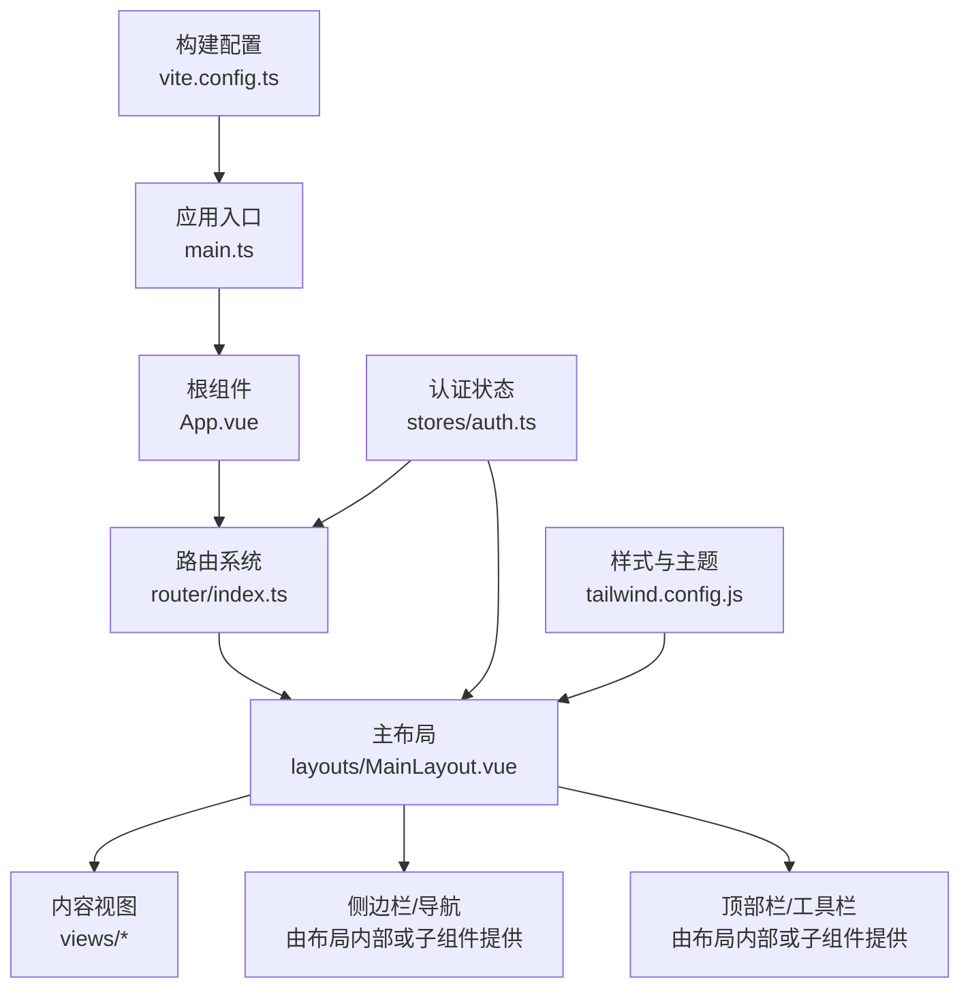
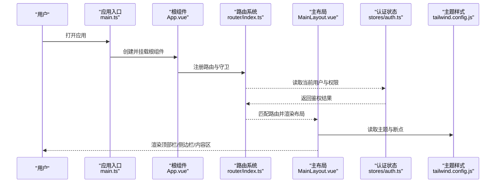
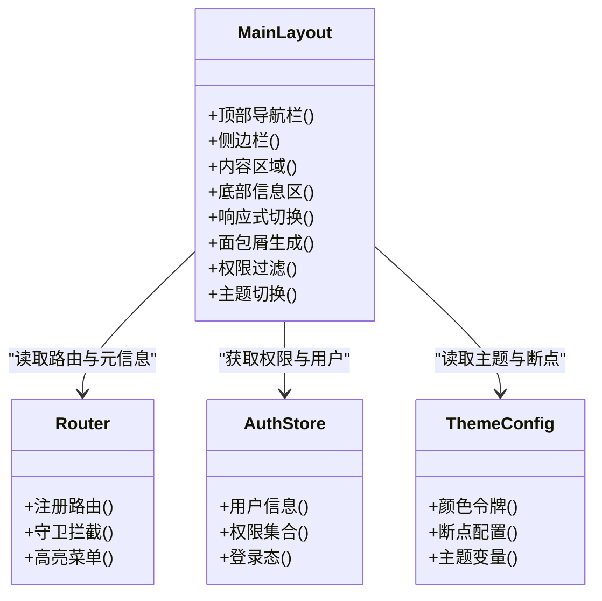
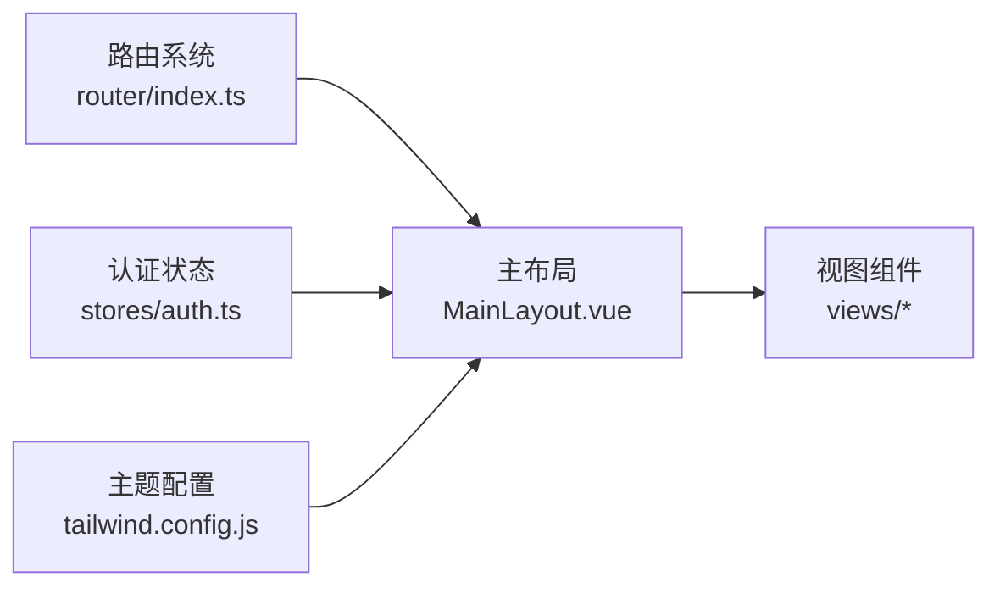

# 布局组件

<cite>
**本文引用的文件**   
- [MainLayout.vue](file://frontend/src/layouts/MainLayout.vue)
- [index.ts（路由）](file://frontend/src/router/index.ts)
- [auth.ts（认证状态管理）](file://frontend/src/stores/auth.ts)
- [App.vue](file://frontend/src/App.vue)
- [main.ts（应用入口）](file://frontend/src/main.ts)
- [tailwind.config.js（样式配置）](file://frontend/tailwind.config.js)
- [vite.config.ts（构建配置）](file://frontend/vite.config.ts)
</cite>

## 目录
1. [简介](#简介)
2. [项目结构](#项目结构)
3. [核心组件](#核心组件)
4. [架构总览](#架构总览)
5. [详细组件分析](#详细组件分析)
6. [依赖关系分析](#依赖关系分析)
7. [性能考量](#性能考量)
8. [故障排查指南](#故障排查指南)
9. [结论](#结论)
10. [附录](#附录)

## 简介
本文件面向Talos前端项目的布局层，重点围绕主布局组件 MainLayout.vue 的结构设计、响应式策略、路由集成、面包屑导航与权限控制机制进行系统化说明。同时给出主题配置、样式定制与扩展点建议，以及布局组件的复用模式与最佳实践，帮助读者快速理解并高效扩展该布局体系。

## 项目结构
Talos前端采用Vue 3 + TypeScript + Vite + Tailwind CSS的技术栈。布局相关代码集中在 layouts 目录，路由定义在 router 目录，认证状态在 stores 目录，全局入口在 main.ts 和 App.vue。Tailwind用于原子化样式与主题变量管理，Vite负责开发与构建。

图表来源
- [main.ts（应用入口）:1-200](file://frontend/src/main.ts#L1-L200)
- [App.vue:1-200](file://frontend/src/App.vue#L1-L200)
- [index.ts（路由）:1-200](file://frontend/src/router/index.ts#L1-L200)
- [MainLayout.vue:1-200](file://frontend/src/layouts/MainLayout.vue#L1-L200)
- [auth.ts（认证状态管理）:1-200](file://frontend/src/stores/auth.ts#L1-L200)
- [tailwind.config.js（样式配置）:1-200](file://frontend/tailwind.config.js#L1-L200)
- [vite.config.ts（构建配置）:1-200](file://frontend/vite.config.ts#L1-L200)

章节来源
- [main.ts（应用入口）:1-200](file://frontend/src/main.ts#L1-L200)
- [App.vue:1-200](file://frontend/src/App.vue#L1-L200)
- [index.ts（路由）:1-200](file://frontend/src/router/index.ts#L1-L200)
- [MainLayout.vue:1-200](file://frontend/src/layouts/MainLayout.vue#L1-L200)
- [auth.ts（认证状态管理）:1-200](file://frontend/src/stores/auth.ts#L1-L200)
- [tailwind.config.js（样式配置）:1-200](file://frontend/tailwind.config.js#L1-L200)
- [vite.config.ts（构建配置）:1-200](file://frontend/vite.config.ts#L1-L200)

## 核心组件
- 主布局 MainLayout.vue：承载页面骨架，包括顶部导航栏、侧边栏、内容区域、底部信息区等；负责响应式切换、路由插槽渲染、面包屑生成、权限过滤与主题切换。
- 路由 index.ts：集中定义页面路由、元信息与权限守卫，驱动布局渲染与菜单高亮。
- 认证状态 auth.ts：维护登录态、用户角色/权限集合，为路由守卫与布局内权限判断提供数据源。
- 样式与主题 tailwind.config.js：定义颜色、间距、断点等设计令牌，支撑布局的主题与响应式行为。
- 构建与入口 vite.config.ts、main.ts、App.vue：初始化插件、注册路由与状态管理，挂载根组件。

章节来源
- [MainLayout.vue:1-200](file://frontend/src/layouts/MainLayout.vue#L1-L200)
- [index.ts（路由）:1-200](file://frontend/src/router/index.ts#L1-L200)
- [auth.ts（认证状态管理）:1-200](file://frontend/src/stores/auth.ts#L1-L200)
- [tailwind.config.js（样式配置）:1-200](file://frontend/tailwind.config.js#L1-L200)
- [vite.config.ts（构建配置）:1-200](file://frontend/vite.config.ts#L1-L200)
- [main.ts（应用入口）:1-200](file://frontend/src/main.ts#L1-L200)
- [App.vue:1-200](file://frontend/src/App.vue#L1-L200)

## 架构总览
下图展示从应用启动到页面渲染的关键流程，以及布局与路由、状态、样式的交互关系。

图表来源
- [main.ts（应用入口）:1-200](file://frontend/src/main.ts#L1-L200)
- [App.vue:1-200](file://frontend/src/App.vue#L1-L200)
- [index.ts（路由）:1-200](file://frontend/src/router/index.ts#L1-L200)
- [MainLayout.vue:1-200](file://frontend/src/layouts/MainLayout.vue#L1-L200)
- [auth.ts（认证状态管理）:1-200](file://frontend/src/stores/auth.ts#L1-L200)
- [tailwind.config.js（样式配置）:1-200](file://frontend/tailwind.config.js#L1-L200)

## 详细组件分析

### 主布局 MainLayout.vue
职责与结构
- 顶部导航栏：包含品牌标识、全局搜索、用户头像与下拉菜单、主题切换开关等。
- 侧边栏：展示菜单树，支持折叠/展开、多级菜单、图标与徽标提示。
- 内容区域：通过路由插槽渲染具体页面视图，支持标签页或多视图切换。
- 底部信息区：版权、版本、快捷链接等。
- 响应式行为：移动端自动收起侧边栏，提供抽屉式侧边栏与遮罩层。
- 面包屑导航：根据当前路由元信息自动生成层级路径。
- 权限控制：基于用户角色/权限集合过滤菜单项与按钮级操作。
- 主题与样式：使用Tailwind设计令牌与CSS变量实现明暗主题与品牌色定制。

响应式布局策略
- 断点划分：依据Tailwind默认断点（sm/md/lg/xl/2xl）适配不同屏幕尺寸。
- 侧边栏行为：小屏下隐藏并转为抽屉；大屏下固定宽度并可折叠。
- 栅格与弹性：内容区域使用弹性布局自适应高度，保证滚动区域独立。
- 触摸优化：移动端手势支持侧滑关闭抽屉，提升交互体验。

路由集成
- 路由守卫：在进入页面之前校验登录态与权限，未授权跳转至登录或无权限页。
- 菜单高亮：根据当前路由路径计算激活项，支持精确匹配与模糊匹配。
- 动态路由：根据用户权限加载可访问的路由表，减少首屏体积。

面包屑导航
- 数据来源：路由元信息中的标题与层级字段。
- 生成规则：按路由层级拼接路径，点击可回退到上一级。
- 自定义能力：允许覆盖默认标题或插入外部链接。

权限控制机制
- 角色/权限模型：用户对象包含角色与权限数组，供守卫与UI层共同消费。
- 菜单过滤：渲染前过滤无权限的菜单项。
- 按钮级控制：通过指令或组合式函数控制元素显示/禁用。
- 路由级保护：对需要权限的路由进行前置守卫拦截。

主题配置与样式定制
- 设计令牌：颜色、字体、间距、圆角、阴影等在Tailwind中统一定义。
- 明暗主题：通过CSS变量切换，结合类名或媒体查询实现。
- 品牌定制：提供主题配置文件，便于替换Logo、主色与图标集。

扩展点
- 插槽：顶部栏、侧边栏、内容区、底部区均暴露插槽，便于二次开发。
- 事件总线：提供布局级别的事件（如侧边栏折叠、主题切换），供子组件订阅。
- 插件机制：支持注入新的菜单项、路由守卫与UI组件。

图表来源
- [MainLayout.vue:1-200](file://frontend/src/layouts/MainLayout.vue#L1-L200)
- [index.ts（路由）:1-200](file://frontend/src/router/index.ts#L1-L200)
- [auth.ts（认证状态管理）:1-200](file://frontend/src/stores/auth.ts#L1-L200)
- [tailwind.config.js（样式配置）:1-200](file://frontend/tailwind.config.js#L1-L200)

章节来源
- [MainLayout.vue:1-200](file://frontend/src/layouts/MainLayout.vue#L1-L200)
- [index.ts（路由）:1-200](file://frontend/src/router/index.ts#L1-L200)
- [auth.ts（认证状态管理）:1-200](file://frontend/src/stores/auth.ts#L1-L200)
- [tailwind.config.js（样式配置）:1-200](file://frontend/tailwind.config.js#L1-L200)

### 路由集成与面包屑导航
- 路由定义：集中管理路径、组件、元信息与权限要求。
- 守卫流程：进入路由前检查登录态与权限，必要时重定向。
- 面包屑算法：解析路由层级与元信息，生成可点击的层级路径。

```mermaid
flowchart TD
Start(["进入路由"]) --> CheckAuth["检查登录态"]
CheckAuth --> |未登录| RedirectLogin["重定向到登录页"]
CheckAuth --> |已登录| CheckPerm["检查权限"]
CheckPerm --> |无权限| RedirectNoPerm["重定向到无权限页"]
CheckPerm --> |有权限| RenderBreadcrumb["生成面包屑"]
RenderBreadcrumb --> RenderView["渲染视图"]
RedirectLogin --> End(["结束"])
RedirectNoPerm --> End
RenderView --> End
```

图表来源
- [index.ts（路由）:1-200](file://frontend/src/router/index.ts#L1-L200)
- [auth.ts（认证状态管理）:1-200](file://frontend/src/stores/auth.ts#L1-L200)

章节来源
- [index.ts（路由）:1-200](file://frontend/src/router/index.ts#L1-L200)
- [auth.ts（认证状态管理）:1-200](file://frontend/src/stores/auth.ts#L1-L200)

### 主题配置与样式定制
- 设计令牌：统一颜色、字体、间距、圆角、阴影等，确保一致性。
- 主题切换：通过类名或CSS变量切换明暗主题，支持持久化存储。
- 品牌定制：提供主题配置文件，便于替换Logo、主色与图标集。
- 响应式断点：基于Tailwind断点实现多端适配。

章节来源
- [tailwind.config.js（样式配置）:1-200](file://frontend/tailwind.config.js#L1-L200)
- [MainLayout.vue:1-200](file://frontend/src/layouts/MainLayout.vue#L1-L200)

### 构建与入口
- 构建配置：Vite插件、别名、代理、环境变量等。
- 应用入口：初始化插件、注册路由与状态管理，挂载根组件。
- 根组件：组织全局样式、错误边界与基础布局容器。

章节来源
- [vite.config.ts（构建配置）:1-200](file://frontend/vite.config.ts#L1-L200)
- [main.ts（应用入口）:1-200](file://frontend/src/main.ts#L1-L200)
- [App.vue:1-200](file://frontend/src/App.vue#L1-L200)

## 依赖关系分析
布局组件依赖路由、认证状态与主题配置，形成清晰的单向数据流与职责分离。

图表来源
- [index.ts（路由）:1-200](file://frontend/src/router/index.ts#L1-L200)
- [MainLayout.vue:1-200](file://frontend/src/layouts/MainLayout.vue#L1-L200)
- [auth.ts（认证状态管理）:1-200](file://frontend/src/stores/auth.ts#L1-L200)
- [tailwind.config.js（样式配置）:1-200](file://frontend/tailwind.config.js#L1-L200)

章节来源
- [index.ts（路由）:1-200](file://frontend/src/router/index.ts#L1-L200)
- [MainLayout.vue:1-200](file://frontend/src/layouts/MainLayout.vue#L1-L200)
- [auth.ts（认证状态管理）:1-200](file://frontend/src/stores/auth.ts#L1-L200)
- [tailwind.config.js（样式配置）:1-200](file://frontend/tailwind.config.js#L1-L200)

## 性能考量
- 路由懒加载：按需加载视图组件，减少首屏体积。
- 菜单与权限预计算：在登录后一次性计算可用菜单，避免重复过滤。
- 主题切换优化：使用CSS变量与类名切换，避免全量重绘。
- 侧边栏虚拟化：长列表菜单使用虚拟滚动，提升渲染性能。
- 图片与图标优化：使用SVG与雪碧图，减少请求数量。

[本节为通用指导，不直接分析具体文件]

## 故障排查指南
常见问题与定位方法
- 路由无法进入：检查路由守卫逻辑与权限配置，确认用户角色是否满足要求。
- 面包屑异常：核对路由元信息的标题与层级字段是否正确。
- 主题切换无效：确认CSS变量与类名切换逻辑是否生效，检查浏览器缓存。
- 移动端侧边栏不显示：检查断点与抽屉组件的状态管理。
- 权限过滤失效：确认权限集合是否与后端返回一致，检查菜单过滤条件。

章节来源
- [index.ts（路由）:1-200](file://frontend/src/router/index.ts#L1-L200)
- [auth.ts（认证状态管理）:1-200](file://frontend/src/stores/auth.ts#L1-L200)
- [MainLayout.vue:1-200](file://frontend/src/layouts/MainLayout.vue#L1-L200)
- [tailwind.config.js（样式配置）:1-200](file://frontend/tailwind.config.js#L1-L200)

## 结论
Talos的前端布局以MainLayout.vue为核心，结合路由、认证状态与主题配置，构建了可扩展、响应式且具备权限控制的页面骨架。通过清晰的职责划分与丰富的扩展点，开发者可以快速定制与增强布局功能，满足不同业务场景需求。

[本节为总结性内容，不直接分析具体文件]

## 附录
- 术语说明
  - 路由元信息：描述路由标题、层级、权限等附加信息。
  - 设计令牌：用于统一视觉风格的颜色、字体、间距等变量。
  - 抽屉式侧边栏：移动端常见的滑动面板式导航。
- 最佳实践
  - 将权限判断集中在状态管理与路由守卫，避免分散逻辑。
  - 使用插槽与事件机制扩展布局，保持组件内聚性。
  - 遵循Tailwind的设计令牌，确保主题一致性与可维护性。

[本节为补充信息，不直接分析具体文件]