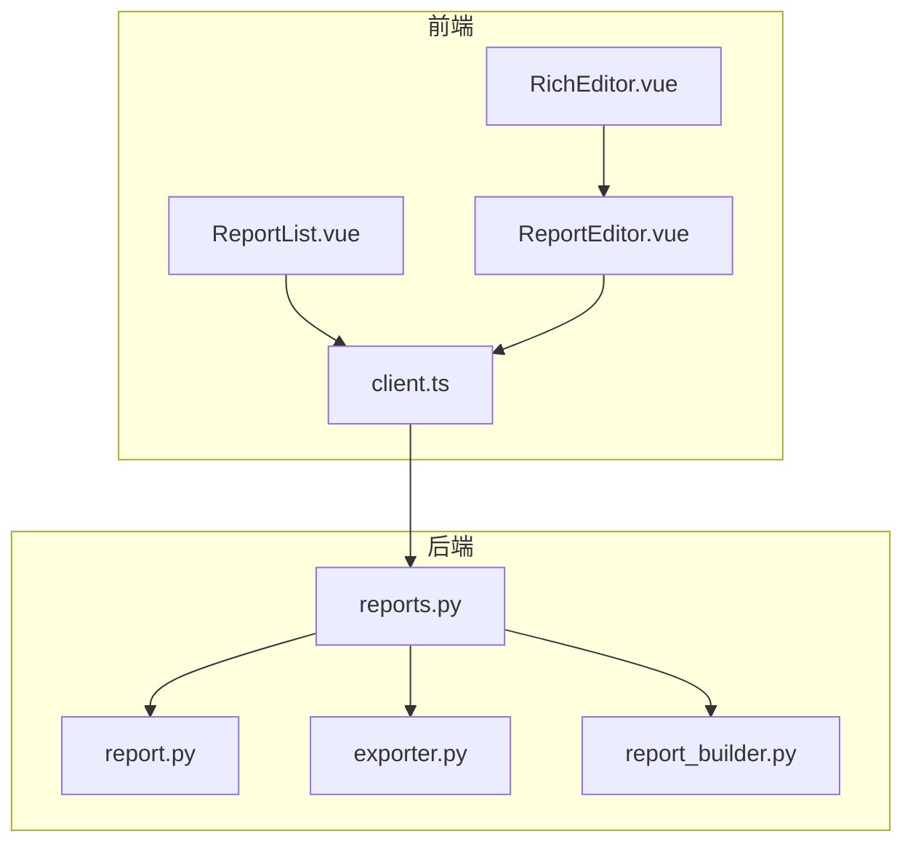
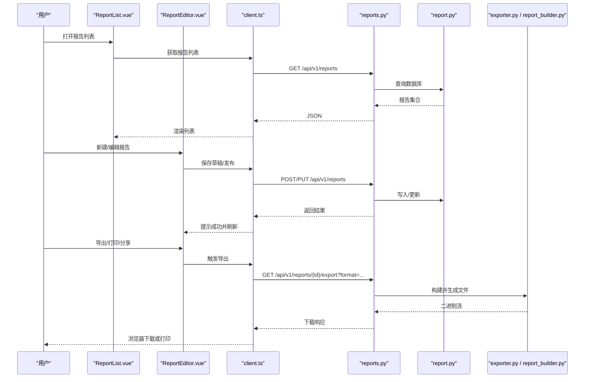
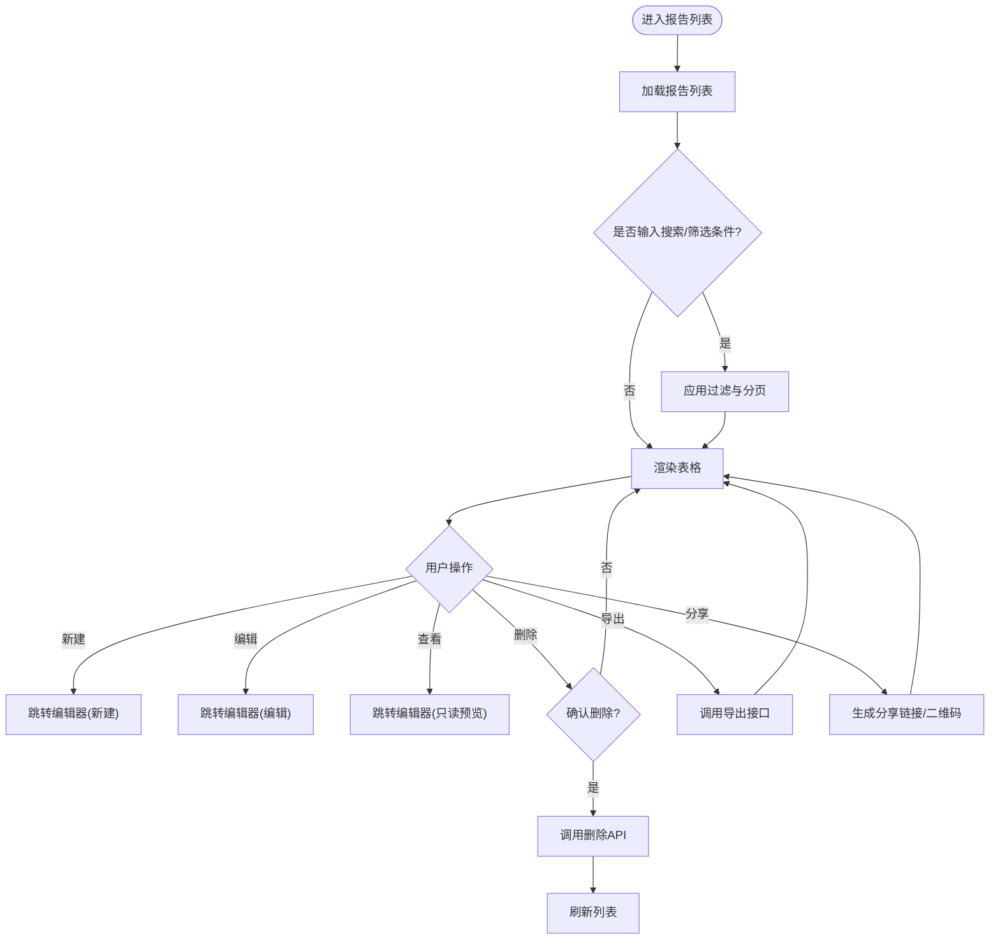
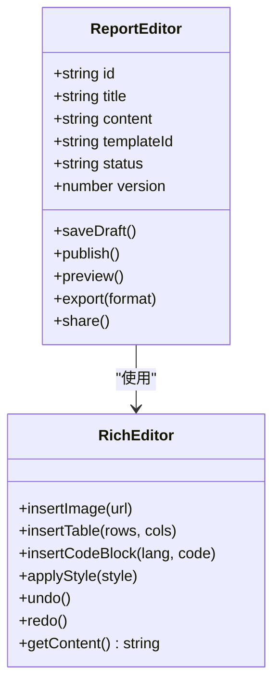
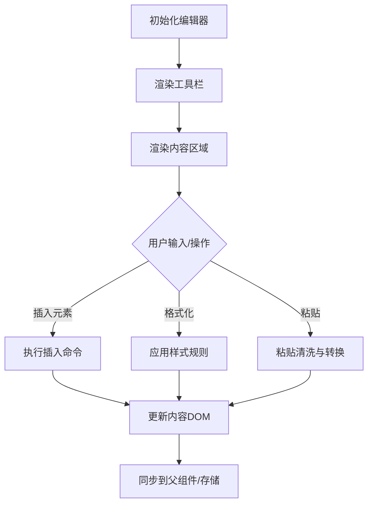
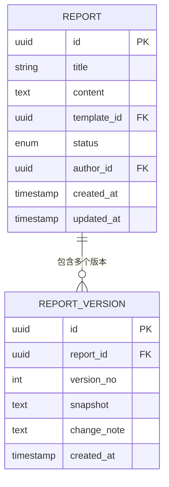
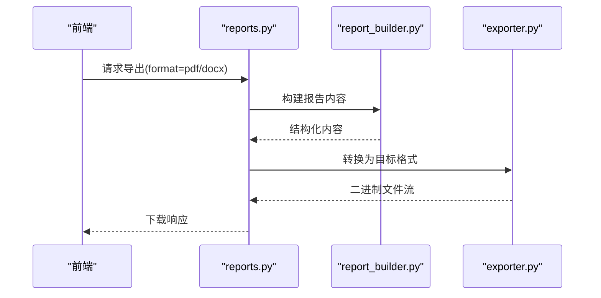
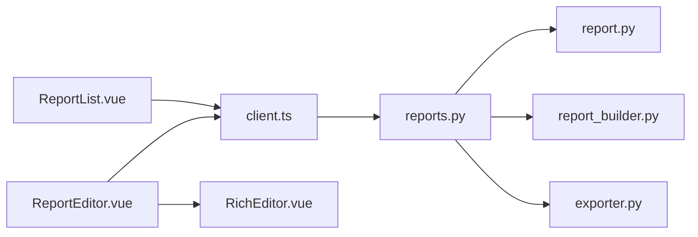

# 报告管理页面

<cite>
**本文档引用的文件**
- [ReportList.vue](file://frontend/src/views/ReportList.vue)
- [ReportEditor.vue](file://frontend/src/views/ReportEditor.vue)
- [RichEditor.vue](file://frontend/src/components/RichEditor.vue)
- [reports.py](file://backend/app/api/v1/reports.py)
- [report.py](file://backend/app/models/report.py)
- [exporter.py](file://backend/app/services/exporter.py)
- [report_builder.py](file://backend/app/services/report_builder.py)
- [client.ts](file://frontend/src/api/client.ts)
</cite>

## 目录
1. [简介](#简介)
2. [项目结构](#项目结构)
3. [核心组件](#核心组件)
4. [架构总览](#架构总览)
5. [详细组件分析](#详细组件分析)
6. [依赖关系分析](#依赖关系分析)
7. [性能考虑](#性能考虑)
8. [故障排查指南](#故障排查指南)
9. [结论](#结论)
10. [附录](#附录)

## 简介
本文件面向Talos项目的“报告管理”功能，聚焦前端报告列表与编辑器页面以及后端API、数据模型与服务层实现。内容涵盖：
- ReportList.vue 报告列表的创建、查看、编辑、删除流程
- ReportEditor.vue 富文本编辑能力（模板支持、格式化、协作编辑）
- 版本控制、草稿保存与发布流程
- 导出、打印与分享功能
- 模板定制与工作流扩展方法

## 项目结构
报告管理相关的前端位于 frontend/src/views 与 components，后端API在 backend/app/api/v1/reports.py，数据模型在 backend/app/models/report.py，导出与构建服务在 backend/app/services 下。

**图表来源**
- [ReportList.vue](file://frontend/src/views/ReportList.vue)
- [ReportEditor.vue](file://frontend/src/views/ReportEditor.vue)
- [RichEditor.vue](file://frontend/src/components/RichEditor.vue)
- [client.ts](file://frontend/src/api/client.ts)
- [reports.py](file://backend/app/api/v1/reports.py)
- [report.py](file://backend/app/models/report.py)
- [exporter.py](file://backend/app/services/exporter.py)
- [report_builder.py](file://backend/app/services/report_builder.py)

**章节来源**
- [ReportList.vue](file://frontend/src/views/ReportList.vue)
- [ReportEditor.vue](file://frontend/src/views/ReportEditor.vue)
- [RichEditor.vue](file://frontend/src/components/RichEditor.vue)
- [client.ts](file://frontend/src/api/client.ts)
- [reports.py](file://backend/app/api/v1/reports.py)
- [report.py](file://backend/app/models/report.py)
- [exporter.py](file://backend/app/services/exporter.py)
- [report_builder.py](file://backend/app/services/report_builder.py)

## 核心组件
- 报告列表页 ReportList.vue：负责报告的增删改查、分页、搜索、筛选、批量操作、跳转至编辑器等。
- 报告编辑器 ReportEditor.vue：承载富文本编辑、模板选择、草稿保存、发布提交、预览与导出入口。
- 富文本编辑器 RichEditor.vue：封装富文本能力（插入图片、表格、代码块、样式、撤销重做等）。
- 后端API reports.py：提供报告CRUD、版本化、草稿/发布状态流转、导出接口。
- 数据模型 report.py：定义报告实体、版本、状态、关联字段等。
- 导出服务 exporter.py：生成PDF/Word等格式。
- 报告构建器 report_builder.py：根据模板与数据组装报告内容。

**章节来源**
- [ReportList.vue](file://frontend/src/views/ReportList.vue)
- [ReportEditor.vue](file://frontend/src/views/ReportEditor.vue)
- [RichEditor.vue](file://frontend/src/components/RichEditor.vue)
- [reports.py](file://backend/app/api/v1/reports.py)
- [report.py](file://backend/app/models/report.py)
- [exporter.py](file://backend/app/services/exporter.py)
- [report_builder.py](file://backend/app/services/report_builder.py)

## 架构总览
前后端通过REST风格API交互，前端使用统一HTTP客户端发起请求；后端基于FastAPI路由处理业务逻辑，调用模型与服务完成数据持久化与报告构建导出。

**图表来源**
- [ReportList.vue](file://frontend/src/views/ReportList.vue)
- [ReportEditor.vue](file://frontend/src/views/ReportEditor.vue)
- [client.ts](file://frontend/src/api/client.ts)
- [reports.py](file://backend/app/api/v1/reports.py)
- [report.py](file://backend/app/models/report.py)
- [exporter.py](file://backend/app/services/exporter.py)
- [report_builder.py](file://backend/app/services/report_builder.py)

## 详细组件分析

### ReportList.vue 报告列表
- 功能要点
  - 列表展示：分页、排序、搜索、按状态筛选（草稿/已发布/归档等）。
  - 操作按钮：新建、查看、编辑、复制、删除、导出、打印、分享。
  - 批量操作：批量删除、批量导出。
  - 跳转逻辑：点击条目进入 ReportEditor.vue 进行查看或编辑。
- 数据流
  - 初始化时调用 client.ts 的请求函数拉取列表。
  - 搜索/筛选条件变化后重新请求。
  - 删除前二次确认，成功后刷新列表。
- 关键交互
  - 新建：跳转到编辑器并携带空模板参数。
  - 编辑：携带报告ID与当前版本信息。
  - 导出：调用后端导出接口，根据格式参数决定返回类型。

**图表来源**
- [ReportList.vue](file://frontend/src/views/ReportList.vue)
- [client.ts](file://frontend/src/api/client.ts)
- [reports.py](file://backend/app/api/v1/reports.py)

**章节来源**
- [ReportList.vue](file://frontend/src/views/ReportList.vue)
- [client.ts](file://frontend/src/api/client.ts)
- [reports.py](file://backend/app/api/v1/reports.py)

### ReportEditor.vue 报告编辑器
- 功能要点
  - 富文本编辑：基于 RichEditor.vue 提供插入图片、表格、代码块、标题层级、列表、超链接、引用、高亮等。
  - 模板支持：选择内置模板或自定义模板，动态填充占位符与结构化区块。
  - 草稿保存：自动/手动保存草稿，保留历史版本。
  - 发布流程：校验必填项与格式，提交为正式版本，标记状态为已发布。
  - 预览与导出：实时预览、导出PDF/Word、打印、分享链接。
- 数据流
  - 进入编辑器时根据ID加载报告内容与版本信息。
  - 编辑过程中监听变更，定时或失焦触发草稿保存。
  - 发布时调用发布接口，后端创建新版本并更新状态。
- 协作编辑特性
  - 支持多人同时编辑时的冲突检测与合并策略（如最后写入优先或差异合并）。
  - 显示在线用户与光标位置（可选）。

**图表来源**
- [ReportEditor.vue](file://frontend/src/views/ReportEditor.vue)
- [RichEditor.vue](file://frontend/src/components/RichEditor.vue)

**章节来源**
- [ReportEditor.vue](file://frontend/src/views/ReportEditor.vue)
- [RichEditor.vue](file://frontend/src/components/RichEditor.vue)

### RichEditor.vue 富文本编辑器
- 能力清单
  - 基础排版：标题、段落、加粗、斜体、下划线、删除线、颜色、背景色。
  - 结构化元素：有序/无序列表、任务列表、表格、代码块、引用块、分割线。
  - 媒体与链接：插入图片/视频、超链接、锚点。
  - 工具栏与快捷键：撤销/重做、全屏、导出HTML/Markdown。
  - 可访问性：ARIA标签、键盘导航、屏幕阅读器友好。
- 扩展方式
  - 插件机制：新增工具栏按钮与命令。
  - 主题定制：覆盖样式变量与配色。
  - 内容校验：对粘贴内容进行清洗与规范化。

**图表来源**
- [RichEditor.vue](file://frontend/src/components/RichEditor.vue)

**章节来源**
- [RichEditor.vue](file://frontend/src/components/RichEditor.vue)

### 后端API与数据模型
- API 设计
  - 报告CRUD：创建、读取、更新、删除。
  - 版本控制：获取版本列表、切换版本、回滚。
  - 草稿与发布：保存草稿、提交发布、状态校验。
  - 导出与分享：按格式导出、生成分享链接。
- 数据模型
  - 报告实体：标题、摘要、内容、模板ID、状态、作者、时间戳等。
  - 版本记录：版本号、快照内容、变更说明、创建时间。
  - 关联关系：与资产、漏洞、计划等实体的关联（按需扩展）。

**图表来源**
- [report.py](file://backend/app/models/report.py)

**章节来源**
- [reports.py](file://backend/app/api/v1/reports.py)
- [report.py](file://backend/app/models/report.py)

### 导出、打印与分享
- 导出
  - 支持PDF、Word等格式，后端根据模板与数据生成文件流返回。
  - 前端接收二进制流并触发浏览器下载。
- 打印
  - 使用浏览器打印对话框，适配A4纸张与边距设置。
- 分享
  - 生成一次性或长期有效的分享链接，支持权限控制与访问统计。

**图表来源**
- [reports.py](file://backend/app/api/v1/reports.py)
- [report_builder.py](file://backend/app/services/report_builder.py)
- [exporter.py](file://backend/app/services/exporter.py)

**章节来源**
- [reports.py](file://backend/app/api/v1/reports.py)
- [exporter.py](file://backend/app/services/exporter.py)
- [report_builder.py](file://backend/app/services/report_builder.py)

## 依赖关系分析
- 前端依赖
  - ReportList.vue 依赖 client.ts 进行网络请求。
  - ReportEditor.vue 依赖 RichEditor.vue 提供富文本能力。
- 后端依赖
  - reports.py 依赖 report.py 数据模型。
  - 导出流程依赖 report_builder.py 与 exporter.py。

**图表来源**
- [ReportList.vue](file://frontend/src/views/ReportList.vue)
- [ReportEditor.vue](file://frontend/src/views/ReportEditor.vue)
- [RichEditor.vue](file://frontend/src/components/RichEditor.vue)
- [client.ts](file://frontend/src/api/client.ts)
- [reports.py](file://backend/app/api/v1/reports.py)
- [report.py](file://backend/app/models/report.py)
- [exporter.py](file://backend/app/services/exporter.py)
- [report_builder.py](file://backend/app/services/report_builder.py)

**章节来源**
- [ReportList.vue](file://frontend/src/views/ReportList.vue)
- [ReportEditor.vue](file://frontend/src/views/ReportEditor.vue)
- [RichEditor.vue](file://frontend/src/components/RichEditor.vue)
- [client.ts](file://frontend/src/api/client.ts)
- [reports.py](file://backend/app/api/v1/reports.py)
- [report.py](file://backend/app/models/report.py)
- [exporter.py](file://backend/app/services/exporter.py)
- [report_builder.py](file://backend/app/services/report_builder.py)

## 性能考虑
- 前端
  - 列表分页与虚拟滚动，避免大数据量渲染卡顿。
  - 编辑器内容增量保存，减少频繁全量提交。
  - 图片与资源懒加载与压缩。
- 后端
  - 导出任务异步化，避免阻塞请求。
  - 模板缓存与内容片段复用，降低构建开销。
  - 数据库索引优化（标题、状态、更新时间等常用查询字段）。

[本节为通用指导，不直接分析具体文件]

## 故障排查指南
- 常见问题
  - 富文本粘贴异常：检查粘贴清洗规则与内容合法性。
  - 导出失败：确认模板存在、数据完整、文件格式支持。
  - 版本冲突：多人编辑时采用乐观锁或合并策略，提示冲突解决。
  - 分享链接无效：检查权限配置与过期策略。
- 调试建议
  - 前端：开启网络面板查看请求与响应，捕获错误堆栈。
  - 后端：启用日志输出，定位导入/导出与版本流转问题。

**章节来源**
- [ReportEditor.vue](file://frontend/src/views/ReportEditor.vue)
- [RichEditor.vue](file://frontend/src/components/RichEditor.vue)
- [reports.py](file://backend/app/api/v1/reports.py)

## 结论
Talos的报告管理模块以清晰的职责划分与模块化设计实现了完整的报告生命周期管理。前端通过ReportList与ReportEditor提供直观的操作界面，RichEditor增强富文本能力；后端通过API、模型与服务层支撑版本控制、草稿与发布、导出与分享。整体架构可扩展性强，便于模板定制与工作流集成。

[本节为总结性内容，不直接分析具体文件]

## 附录
- 模板定制
  - 新增模板：定义模板结构与占位符，注册到模板库。
  - 动态字段：根据上下文注入数据，支持条件渲染。
- 工作流集成
  - 审批流程：在发布前引入审核节点，通过后才能发布。
  - 通知机制：草稿保存、发布成功、导出完成等事件触发通知。
  - 审计追踪：记录关键操作的变更历史与责任人。

[本节为概念性内容，不直接分析具体文件]