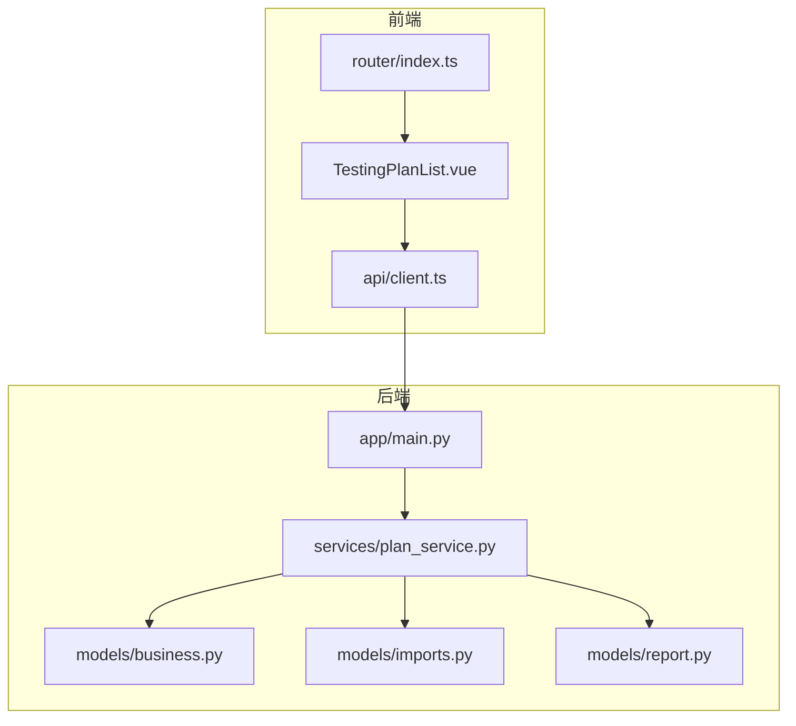
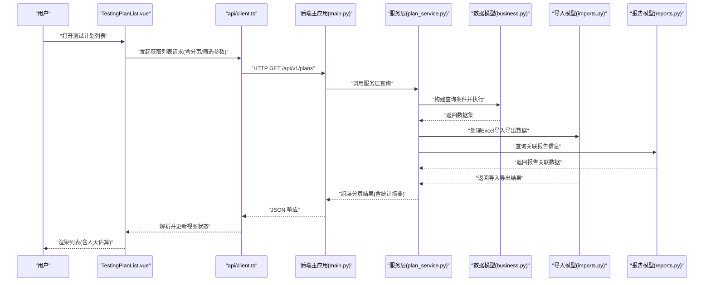
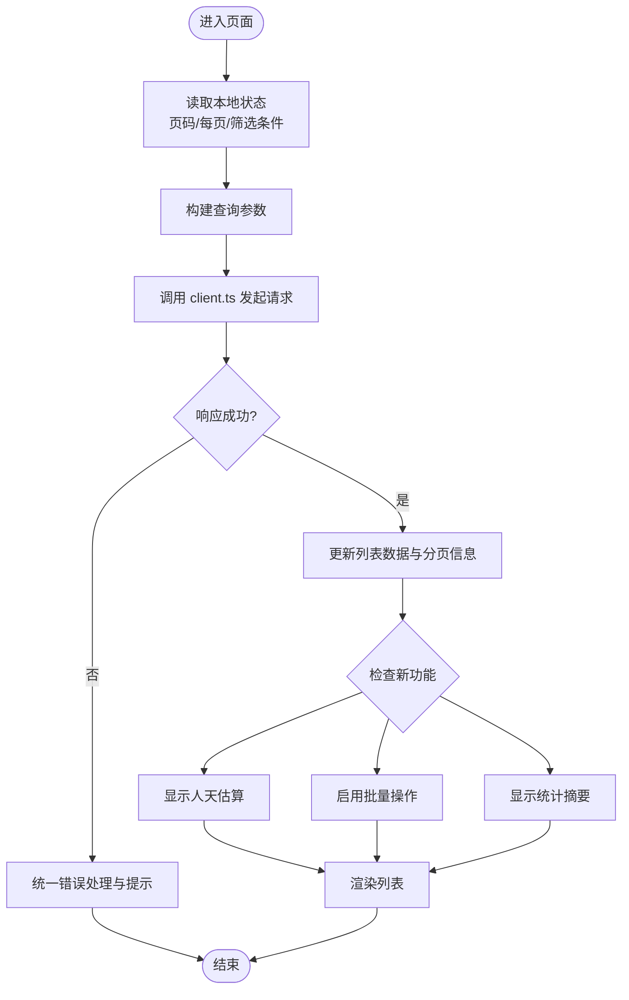
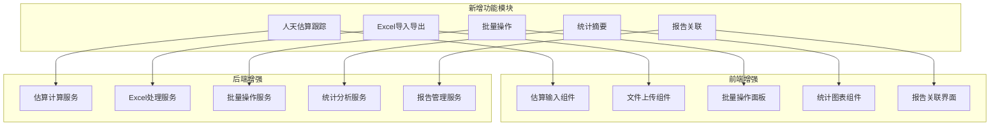
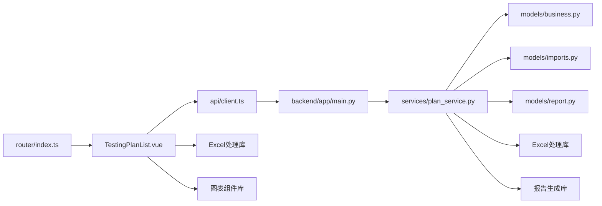

# 测试计划列表页面

<cite>
**本文引用的文件**   
- [TestingPlanList.vue](file://frontend/src/views/TestingPlanList.vue)
- [client.ts](file://frontend/src/api/client.ts)
- [router/index.ts](file://frontend/src/router/index.ts)
- [main.py](file://backend/app/main.py)
- [plan_service.py](file://backend/app/services/plan_service.py)
- [business.py](file://backend/app/models/business.py)
- [imports.py](file://backend/app/models/imports.py)
- [reports.py](file://backend/app/models/report.py)
</cite>

## 更新摘要
**变更内容**   
- 新增人天估算跟踪功能，支持工作量统计与追踪
- 增强Excel导入导出能力，支持批量数据操作
- 完善批量操作功能，提升数据处理效率
- 新增统计摘要功能，提供数据分析视图
- 强化报告关联功能，实现测试计划与报告的无缝集成

## 目录
1. [简介](#简介)
2. [项目结构](#项目结构)
3. [核心组件](#核心组件)
4. [架构总览](#架构总览)
5. [详细组件分析](#详细组件分析)
6. [新增功能详解](#新增功能详解)
7. [依赖分析](#依赖分析)
8. [性能考虑](#性能考虑)
9. [故障排查指南](#故障排查指南)
10. [结论](#结论)
11. [附录](#附录) 

## 简介
本章节面向"测试计划列表页面"的实现与使用，涵盖前端视图、API 客户端调用、后端服务与数据模型之间的关系，以及典型的数据流与交互流程。该页面用于展示测试计划条目，支持分页、搜索过滤、状态筛选等常见操作，并通过后端服务访问业务数据。**最新更新**增强了人天估算跟踪、Excel导入导出、批量操作、统计摘要和报告关联功能，为测试管理提供了更强大的工具支持。

## 项目结构
围绕"测试计划列表页面"，前后端的关键文件如下：
- 前端视图：负责渲染列表、处理用户交互（分页、筛选、排序）
- API 客户端：封装 HTTP 请求，统一错误处理与鉴权
- 路由配置：定义页面路由与导航
- 后端主应用：注册路由、挂载中间件
- 后端服务层：实现查询、过滤、分页等业务逻辑
- 数据模型：定义测试计划相关字段与约束
- **新增**：导入导出模型、报告关联模型

图表来源
- [TestingPlanList.vue](file://frontend/src/views/TestingPlanList.vue)
- [client.ts](file://frontend/src/api/client.ts)
- [router/index.ts](file://frontend/src/router/index.ts)
- [main.py](file://backend/app/main.py)
- [plan_service.py](file://backend/app/services/plan_service.py)
- [business.py](file://backend/app/models/business.py)
- [imports.py](file://backend/app/models/imports.py)
- [reports.py](file://backend/app/models/report.py)

章节来源
- [TestingPlanList.vue](file://frontend/src/views/TestingPlanList.vue)
- [client.ts](file://frontend/src/api/client.ts)
- [router/index.ts](file://frontend/src/router/index.ts)
- [main.py](file://backend/app/main.py)
- [plan_service.py](file://backend/app/services/plan_service.py)
- [business.py](file://backend/app/models/business.py)
- [imports.py](file://backend/app/models/imports.py)
- [reports.py](file://backend/app/models/report.py)

## 核心组件
- 前端视图 TestingPlanList.vue
  - 职责：渲染测试计划列表、管理分页与筛选状态、触发 API 请求、处理响应与错误
  - 关键交互：页码切换、每页条数调整、关键词搜索、状态筛选、刷新
  - **新增**：人天估算显示、批量操作入口、Excel导入导出按钮、统计摘要查看
- API 客户端 client.ts
  - 职责：封装 HTTP 方法、统一请求头（如鉴权）、错误拦截与提示
  - **新增**：Excel文件上传、批量操作接口、统计数据获取接口
- 后端服务 plan_service.py
  - 职责：实现测试计划的查询、过滤、排序、分页等逻辑
  - **新增**：人天估算计算、Excel数据处理、批量操作执行、统计摘要生成、报告关联查询
- 数据模型 business.py
  - 职责：定义测试计划实体字段、关系与校验规则
  - **新增**：人天估算字段、状态枚举扩展
- **新增**：导入导出模型 imports.py
  - 职责：定义Excel导入导出的数据结构与验证规则
- **新增**：报告关联模型 reports.py
  - 职责：管理测试计划与报告的关联关系

章节来源
- [TestingPlanList.vue](file://frontend/src/views/TestingPlanList.vue)
- [client.ts](file://frontend/src/api/client.ts)
- [plan_service.py](file://backend/app/services/plan_service.py)
- [business.py](file://backend/app/models/business.py)
- [main.py](file://backend/app/main.py)
- [imports.py](file://backend/app/models/imports.py)
- [reports.py](file://backend/app/models/report.py)

## 架构总览
下图展示了从前端到后端的完整调用链：用户在列表中执行操作，前端通过客户端发起请求，后端主应用将请求分发至服务层，服务层基于数据模型进行查询并返回结果。**新增功能**包括人天估算跟踪、Excel导入导出、批量操作、统计摘要和报告关联的完整数据流。

图表来源
- [TestingPlanList.vue](file://frontend/src/views/TestingPlanList.vue)
- [client.ts](file://frontend/src/api/client.ts)
- [main.py](file://backend/app/main.py)
- [plan_service.py](file://backend/app/services/plan_service.py)
- [business.py](file://backend/app/models/business.py)
- [imports.py](file://backend/app/models/imports.py)
- [reports.py](file://backend/app/models/report.py)

## 详细组件分析

### 前端视图 TestingPlanList.vue
- 功能要点
  - 列表渲染：根据服务端返回的测试计划数据渲染表格或卡片
  - 分页控制：页码、每页条数、总条数显示
  - 筛选与搜索：按名称、状态、时间范围等条件过滤
  - 交互行为：点击行查看详情、批量操作入口（如有）
  - 错误处理：网络异常、权限不足、空数据的友好提示
  - **新增**：人天估算显示列、Excel导入导出按钮、批量操作对话框、统计摘要面板
- 数据绑定与状态管理
  - 本地状态：当前页码、每页大小、搜索词、筛选条件
  - 响应式更新：当参数变化时自动触发重新请求
  - **新增**：人天估算数据、批量操作状态、导入导出进度
- 与 API 客户端集成
  - 调用统一的请求方法，携带鉴权头与查询参数
  - 统一错误捕获与用户提示
  - **新增**：文件上传处理、批量操作回调、统计数据订阅

图表来源
- [TestingPlanList.vue](file://frontend/src/views/TestingPlanList.vue)
- [client.ts](file://frontend/src/api/client.ts)

章节来源
- [TestingPlanList.vue](file://frontend/src/views/TestingPlanList.vue)
- [client.ts](file://frontend/src/api/client.ts)

### API 客户端 client.ts
- 职责
  - 封装 HTTP 方法（GET/POST/PUT/DELETE）
  - 统一设置请求头（如 Authorization）
  - 统一错误拦截与提示
  - 提供类型化的请求/响应接口
  - **新增**：Excel文件上传、批量操作接口、统计数据获取接口
- 与前端视图集成
  - 被 TestingPlanList.vue 调用以获取测试计划列表
  - 在失败时抛出可被上层捕获的错误对象
  - **新增**：文件上传进度监听、批量操作状态同步

章节来源
- [client.ts](file://frontend/src/api/client.ts)

### 后端主应用 main.py
- 职责
  - 注册 API 路由（如 /api/v1/plans）
  - 挂载全局中间件（日志、异常处理、跨域等）
  - 启动服务与生命周期管理
  - **新增**：Excel导入导出路由、批量操作路由、统计摘要路由
- 与路由分发
  - 将请求转发给对应的控制器或服务层

章节来源
- [main.py](file://backend/app/main.py)

### 服务层 plan_service.py
- 职责
  - 实现测试计划查询、过滤、排序、分页等核心逻辑
  - 聚合多条件查询，构造数据库查询语句
  - 返回标准化分页数据结构
  - **新增**：人天估算计算、Excel数据处理、批量操作执行、统计摘要生成、报告关联查询
- 与数据模型协作
  - 基于 business.py 定义的模型进行查询与映射
  - **新增**：与 imports.py 和 reports.py 模型的协作

章节来源
- [plan_service.py](file://backend/app/services/plan_service.py)
- [business.py](file://backend/app/models/business.py)
- [imports.py](file://backend/app/models/imports.py)
- [reports.py](file://backend/app/models/report.py)

### 数据模型 business.py
- 职责
  - 定义测试计划实体的字段、关系与约束
  - 为服务层提供稳定的数据抽象
  - **新增**：人天估算字段、状态枚举扩展
- 字段示例（概念性说明）
  - 标识、名称、状态、创建时间、更新时间、人天估算、预计完成时间等

章节来源
- [business.py](file://backend/app/models/business.py)

### 新增：导入导出模型 imports.py
- 职责
  - 定义Excel导入导出的数据结构与验证规则
  - 处理文件格式转换与数据清洗
  - 支持批量数据导入与导出模板管理
- 功能特性
  - Excel文件解析与验证
  - 数据格式标准化
  - 错误处理与回滚机制

章节来源
- [imports.py](file://backend/app/models/imports.py)

### 新增：报告关联模型 reports.py
- 职责
  - 管理测试计划与报告的关联关系
  - 支持报告自动生成与版本管理
  - 提供报告查询与统计分析功能
- 功能特性
  - 一对一或多对一关联
  - 报告状态跟踪
  - 关联关系维护

章节来源
- [reports.py](file://backend/app/models/report.py)

## 新增功能详解

### 人天估算跟踪功能
- 功能概述
  - 支持测试计划的人天估算录入与跟踪
  - 实时显示实际工作量与估算对比
  - 提供工作量统计与分析报表
- 技术实现
  - 前端：新增人天估算输入框与显示列
  - 后端：估算数据持久化与计算逻辑
  - 数据库：新增估算相关字段与索引优化

### Excel导入导出功能
- 功能概述
  - 支持测试计划的批量Excel导入
  - 提供标准模板下载与数据验证
  - 支持测试计划数据的Excel导出
- 技术实现
  - 前端：文件选择器与进度显示
  - 后端：Excel解析引擎与数据验证
  - 异步处理：大文件处理的队列机制

### 批量操作功能
- 功能概述
  - 支持测试计划的批量状态更新
  - 批量删除与批量分配操作
  - 操作预览与确认机制
- 技术实现
  - 前端：多选框与批量操作面板
  - 后端：事务性批量操作处理
  - 错误处理：部分失败的回滚机制

### 统计摘要功能
- 功能概述
  - 提供测试计划的统计概览
  - 支持按状态、负责人、时间维度统计
  - 可视化图表展示
- 技术实现
  - 前端：统计面板与图表组件
  - 后端：聚合查询与缓存机制
  - 实时更新：WebSocket推送统计更新

### 报告关联功能
- 功能概述
  - 测试计划与测试报告的自动关联
  - 报告生成与版本管理
  - 关联关系的可视化展示
- 技术实现
  - 前端：报告关联界面与预览
  - 后端：报告生成引擎与关联管理
  - 存储：报告文件的组织与管理

图表来源
- [TestingPlanList.vue](file://frontend/src/views/TestingPlanList.vue)
- [plan_service.py](file://backend/app/services/plan_service.py)
- [imports.py](file://backend/app/models/imports.py)
- [reports.py](file://backend/app/models/report.py)

## 依赖分析
- 前端依赖
  - TestingPlanList.vue 依赖 api/client.ts 进行网络请求
  - router/index.ts 将路径映射到 TestingPlanList.vue
  - **新增**：依赖Excel处理库、图表组件库、文件上传组件
- 后端依赖
  - main.py 依赖 plan_service.py 实现业务逻辑
  - plan_service.py 依赖 business.py 作为数据模型
  - **新增**：依赖Excel处理库、报告生成库、统计分析库

图表来源
- [TestingPlanList.vue](file://frontend/src/views/TestingPlanList.vue)
- [client.ts](file://frontend/src/api/client.ts)
- [router/index.ts](file://frontend/src/router/index.ts)
- [main.py](file://backend/app/main.py)
- [plan_service.py](file://backend/app/services/plan_service.py)
- [business.py](file://backend/app/models/business.py)
- [imports.py](file://backend/app/models/imports.py)
- [reports.py](file://backend/app/models/report.py)

章节来源
- [TestingPlanList.vue](file://frontend/src/views/TestingPlanList.vue)
- [client.ts](file://frontend/src/api/client.ts)
- [router/index.ts](file://frontend/src/router/index.ts)
- [main.py](file://backend/app/main.py)
- [plan_service.py](file://backend/app/services/plan_service.py)
- [business.py](file://backend/app/models/business.py)
- [imports.py](file://backend/app/models/imports.py)
- [reports.py](file://backend/app/models/report.py)

## 性能考虑
- 前端优化
  - 防抖/节流：对搜索输入进行防抖，减少频繁请求
  - 分页加载：默认合理分页大小，避免一次性加载过多数据
  - 缓存策略：对不常变化的筛选条件做本地缓存
  - **新增**：虚拟滚动优化大数据列表、懒加载图表数据、文件上传分片处理
- 后端优化
  - 查询优化：合理使用索引、避免 N+1 查询
  - 分页限制：限制最大每页条数，防止过大响应体
  - 缓存层：对热点查询引入缓存（如 Redis）
  - **新增**：Excel处理异步化、批量操作事务优化、统计查询预计算

## 故障排查指南
- 常见问题
  - 列表为空：检查筛选条件是否过严；确认后端返回数据是否为空
  - 分页异常：核对页码与每页条数参数是否正确传递
  - 权限错误：确认鉴权头是否包含有效令牌
  - 网络错误：检查后端服务是否正常运行、端口与跨域配置
  - **新增**：Excel导入失败、批量操作超时、统计数据显示异常、报告关联丢失
- 定位步骤
  - 前端控制台查看请求与响应
  - 后端日志查看异常堆栈与入参
  - 数据库查询验证数据是否存在
  - **新增**：检查Excel文件格式与数据完整性、验证批量操作的事务状态、监控统计查询的性能指标

章节来源
- [TestingPlanList.vue](file://frontend/src/views/TestingPlanList.vue)
- [client.ts](file://frontend/src/api/client.ts)
- [main.py](file://backend/app/main.py)
- [plan_service.py](file://backend/app/services/plan_service.py)

## 结论
测试计划列表页面通过清晰的前后端分层实现了高效的列表展示与交互。**最新增强**的人天估算跟踪、Excel导入导出、批量操作、统计摘要和报告关联功能，显著提升了测试管理的效率和用户体验。前端聚焦于用户体验与状态管理，后端服务层专注业务逻辑与数据访问。遵循上述架构与最佳实践，可在保证稳定性的同时提升性能与可维护性。

## 附录
- 术语
  - 测试计划：用于组织与管理测试任务的业务实体
  - 分页：将大量数据拆分为多页展示以提升性能
  - 筛选：根据条件缩小数据范围
  - 人天估算：测试工作量的预估与实际跟踪
  - Excel导入导出：批量数据的文件交换功能
  - 批量操作：对多个测试计划执行相同操作的机制
  - 统计摘要：测试计划数据的汇总与分析
  - 报告关联：测试计划与测试报告之间的关联关系
- 参考
  - 前端路由配置与页面跳转
  - API 客户端统一封装规范
  - 后端服务层查询与分页模式
  - Excel文件处理最佳实践
  - 批量操作事务管理
  - 数据统计与可视化方案