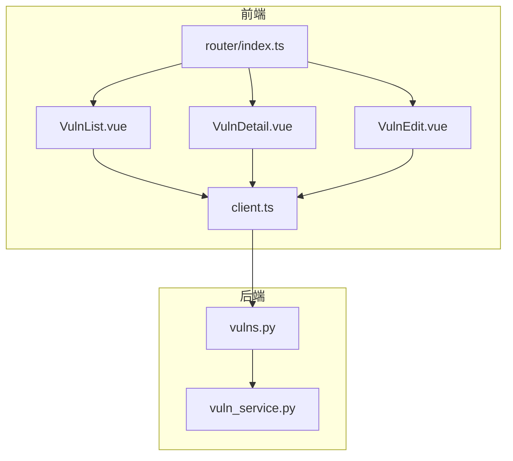
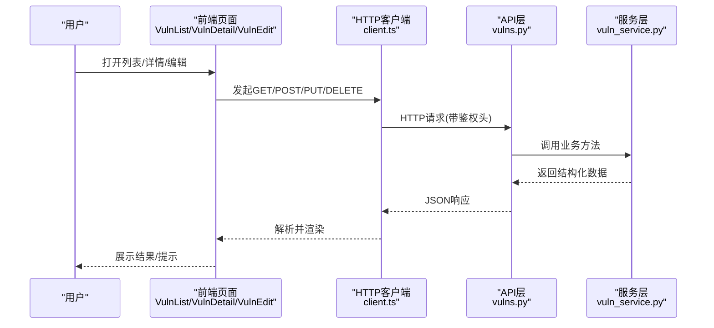
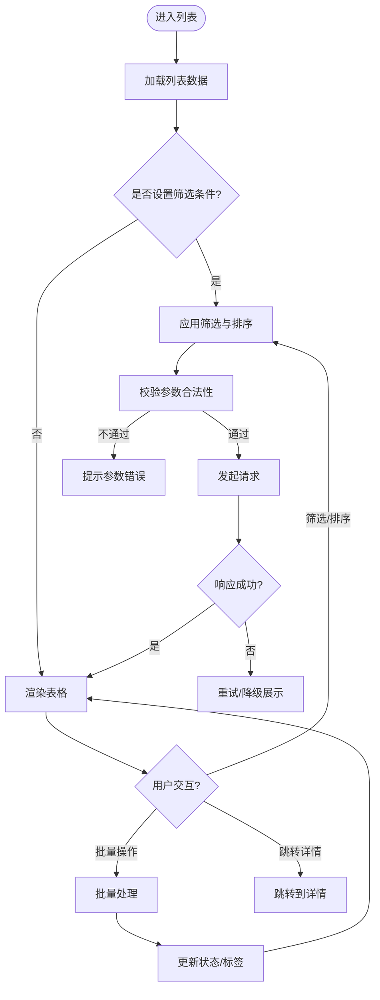
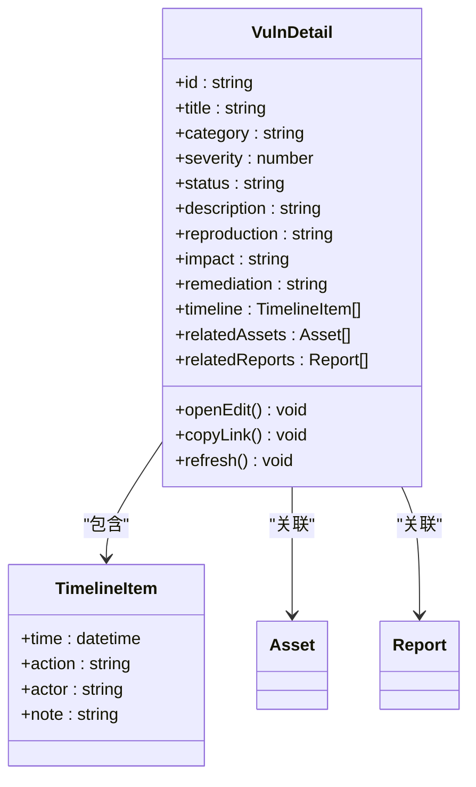
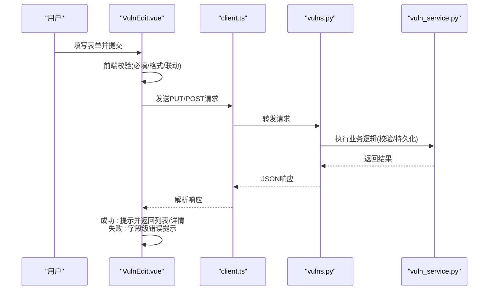
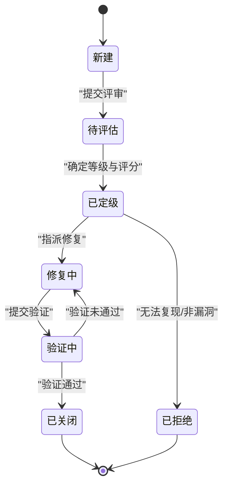
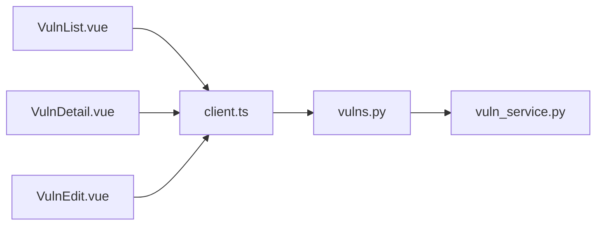

# 漏洞管理页面

<cite>
**本文引用的文件**   
- [VulnList.vue](file://frontend/src/views/VulnList.vue)
- [VulnDetail.vue](file://frontend/src/views/VulnDetail.vue)
- [VulnEdit.vue](file://frontend/src/views/VulnEdit.vue)
- [vulns.py](file://backend/app/api/v1/vulns.py)
- [vuln_service.py](file://backend/app/services/vuln_service.py)
- [client.ts](file://frontend/src/api/client.ts)
- [router/index.ts](file://frontend/src/router/index.ts)
</cite>

## 目录
1. [简介](#简介)
2. [项目结构](#项目结构)
3. [核心组件](#核心组件)
4. [架构总览](#架构总览)
5. [详细组件分析](#详细组件分析)
6. [依赖关系分析](#依赖关系分析)
7. [性能考虑](#性能考虑)
8. [故障排查指南](#故障排查指南)
9. [结论](#结论)
10. [附录](#附录)

## 简介
本文件面向Talos项目的“漏洞管理”相关前端页面与后端接口，系统性说明以下能力：
- 漏洞列表页（VulnList.vue）：展示、分类筛选、状态管理、排序与批量操作。
- 漏洞详情页（VulnDetail.vue）：完整信息展示、时间线与关联资产/报告等上下文。
- 漏洞编辑页（VulnEdit.vue）：表单校验、提交流程、错误处理与回滚策略。
- 数据生命周期：从发现、定级、修复到关闭的全流程管理。
- 评分与优先级：评分模型、排序规则与批量调整。
- 工作流与自动化：状态流转配置、事件触发与外部系统集成方案。

## 项目结构
围绕漏洞管理的代码主要分布在前后端：
- 前端视图：views 下的 VulnList.vue、VulnDetail.vue、VulnEdit.vue
- 前端API客户端：api/client.ts
- 路由：router/index.ts
- 后端API：app/api/v1/vulns.py
- 后端服务：app/services/vuln_service.py

图表来源
- [VulnList.vue](file://frontend/src/views/VulnList.vue)
- [VulnDetail.vue](file://frontend/src/views/VulnDetail.vue)
- [VulnEdit.vue](file://frontend/src/views/VulnEdit.vue)
- [client.ts](file://frontend/src/api/client.ts)
- [vulns.py](file://backend/app/api/v1/vulns.py)
- [vuln_service.py](file://backend/app/services/vuln_service.py)
- [router/index.ts](file://frontend/src/router/index.ts)

章节来源
- [VulnList.vue](file://frontend/src/views/VulnList.vue)
- [VulnDetail.vue](file://frontend/src/views/VulnDetail.vue)
- [VulnEdit.vue](file://frontend/src/views/VulnEdit.vue)
- [client.ts](file://frontend/src/api/client.ts)
- [vulns.py](file://backend/app/api/v1/vulns.py)
- [vuln_service.py](file://backend/app/services/vuln_service.py)
- [router/index.ts](file://frontend/src/router/index.ts)

## 核心组件
- 漏洞列表（VulnList.vue）
  - 功能要点：分页加载、关键词搜索、按分类/严重等级/状态筛选、多列排序、全选与批量操作（如批量修改状态、批量打标签）。
  - 交互要点：行内快速编辑（如状态切换）、空态提示、加载骨架屏、错误重试。
- 漏洞详情（VulnDetail.vue）
  - 功能要点：基础信息、描述与复现步骤、影响范围、修复建议、时间线（创建/更新/评论/修复记录）、关联资产与报告。
  - 交互要点：只读模式与编辑入口分离、附件预览、复制链接分享。
- 漏洞编辑（VulnEdit.vue）
  - 功能要点：表单字段定义、必填校验、富文本编辑器集成、草稿保存、提交与冲突检测、失败回滚。
  - 交互要点：防重复提交、乐观更新与回退、字段级错误提示。

章节来源
- [VulnList.vue](file://frontend/src/views/VulnList.vue)
- [VulnDetail.vue](file://frontend/src/views/VulnDetail.vue)
- [VulnEdit.vue](file://frontend/src/views/VulnEdit.vue)

## 架构总览
前后端通过REST风格API进行交互，前端使用统一HTTP客户端封装请求与响应拦截；后端以FastAPI提供接口，业务逻辑下沉至服务层，保证可测试性与扩展性。

图表来源
- [client.ts](file://frontend/src/api/client.ts)
- [vulns.py](file://backend/app/api/v1/vulns.py)
- [vuln_service.py](file://backend/app/services/vuln_service.py)

## 详细组件分析

### 漏洞列表（VulnList.vue）
- 数据获取与缓存
  - 首次进入时拉取列表数据，支持分页参数与查询条件；本地缓存最近一次查询结果以提升体验。
- 筛选与排序
  - 支持按分类、严重等级、状态、标签等多维筛选；支持多列排序（升/降序），保持URL同步便于分享。
- 状态管理与交互
  - 行级状态切换（如“待修复/修复中/已关闭”），批量选择后执行批量操作；操作成功刷新局部或整页。
- 错误与边界
  - 网络异常重试、空数据占位、权限不足提示、字段缺失降级显示。

图表来源
- [VulnList.vue](file://frontend/src/views/VulnList.vue)

章节来源
- [VulnList.vue](file://frontend/src/views/VulnList.vue)

### 漏洞详情（VulnDetail.vue）
- 信息组织
  - 基础信息区（编号、标题、分类、严重等级、状态、创建/更新时间）
  - 内容区（描述、复现步骤、影响面、修复建议）
  - 时间线（关键事件节点、评论、修复记录）
  - 关联上下文（关联资产、报告、任务）
- 交互设计
  - 只读为主，提供“编辑”入口；支持一键复制分享链接；附件在线预览。
- 数据一致性
  - 进入时拉取最新详情；编辑后自动刷新；并发冲突提示。

图表来源
- [VulnDetail.vue](file://frontend/src/views/VulnDetail.vue)

章节来源
- [VulnDetail.vue](file://frontend/src/views/VulnDetail.vue)

### 漏洞编辑（VulnEdit.vue）
- 表单设计
  - 字段分组：基本信息、技术细节、修复建议、标签与分类、优先级与评分。
  - 校验规则：必填项、格式校验、长度限制、语义校验（如严重等级与评分的联动）。
- 提交流程
  - 草稿保存（可选）、提交前二次确认、防重复提交、乐观更新+失败回滚。
- 错误处理
  - 服务端校验错误映射到字段级提示；网络异常重试；版本冲突提示。

图表来源
- [VulnEdit.vue](file://frontend/src/views/VulnEdit.vue)
- [client.ts](file://frontend/src/api/client.ts)
- [vulns.py](file://backend/app/api/v1/vulns.py)
- [vuln_service.py](file://backend/app/services/vuln_service.py)

章节来源
- [VulnEdit.vue](file://frontend/src/views/VulnEdit.vue)

### 数据生命周期与工作流
- 生命周期阶段
  - 新建/草稿 -> 待评估 -> 已定级 -> 修复中 -> 验证中 -> 已关闭/已拒绝
- 状态流转
  - 支持单条与批量状态变更；关键状态变更需填写原因与修复证据。
- 评分与优先级
  - 评分维度：可利用性、影响面、修复成本、业务重要性；根据权重计算综合评分，驱动优先级排序。
- 审计与追踪
  - 所有变更写入时间线，支持导出与报表生成。

图表来源
- [vuln_service.py](file://backend/app/services/vuln_service.py)
- [vulns.py](file://backend/app/api/v1/vulns.py)

章节来源
- [vuln_service.py](file://backend/app/services/vuln_service.py)
- [vulns.py](file://backend/app/api/v1/vulns.py)

## 依赖关系分析
- 前端依赖
  - 视图组件依赖API客户端进行网络请求；路由负责页面导航与参数传递。
- 后端依赖
  - API层依赖服务层完成业务编排；服务层可能依赖数据库ORM、消息队列、对象存储等（由服务实现决定）。
- 耦合与解耦
  - 通过清晰的接口契约（请求/响应结构）降低前后端耦合；服务层抽象出领域逻辑，便于替换实现。

图表来源
- [VulnList.vue](file://frontend/src/views/VulnList.vue)
- [VulnDetail.vue](file://frontend/src/views/VulnDetail.vue)
- [VulnEdit.vue](file://frontend/src/views/VulnEdit.vue)
- [client.ts](file://frontend/src/api/client.ts)
- [vulns.py](file://backend/app/api/v1/vulns.py)
- [vuln_service.py](file://backend/app/services/vuln_service.py)

章节来源
- [client.ts](file://frontend/src/api/client.ts)
- [vulns.py](file://backend/app/api/v1/vulns.py)
- [vuln_service.py](file://backend/app/services/vuln_service.py)

## 性能考虑
- 列表加载
  - 分页与懒加载、服务端排序与过滤、索引优化（分类/状态/严重等级）。
- 缓存策略
  - 前端对热点数据做短期缓存；详情页面采用按需加载与增量更新。
- 批量操作
  - 分批提交、进度反馈、失败重试与幂等设计。
- 渲染优化
  - 虚拟滚动（大数据量）、骨架屏与占位图、避免不必要的重排重绘。

[本节为通用指导，无需特定文件引用]

## 故障排查指南
- 常见问题
  - 列表为空：检查筛选条件与分页参数；查看网络请求与响应码。
  - 编辑失败：核对字段校验规则与服务端返回的错误信息；检查并发冲突与版本控制。
  - 状态流转异常：确认当前状态允许的目标状态与前置条件。
- 定位手段
  - 浏览器开发者工具查看请求/响应；后端日志定位服务层异常；数据库事务与锁等待排查。
- 恢复策略
  - 重试机制、草稿恢复、回滚到上一版本；必要时人工介入修正。

章节来源
- [vulns.py](file://backend/app/api/v1/vulns.py)
- [vuln_service.py](file://backend/app/services/vuln_service.py)

## 结论
Talos的漏洞管理模块以清晰的前后端分层与职责划分，提供了完整的漏洞生命周期管理能力。通过列表页的高效检索与批量操作、详情页的信息聚合与时间线追踪、编辑页的严谨表单与容错机制，配合评分与优先级体系，能够有效支撑安全团队在日常工作中的协作与闭环。建议在后续迭代中持续完善工作流配置、自动化集成与数据分析能力，进一步提升效率与可观测性。

[本节为总结性内容，无需特定文件引用]

## 附录
- 工作流配置建议
  - 将状态机与角色权限绑定，限制敏感状态的变更权限。
  - 引入审批节点与通知机制，确保关键变更可追溯。
- 自动化集成方案
  - 与扫描器对接：自动创建漏洞条目并填充技术细节。
  - 与工单系统对接：状态同步、修复任务派发与到期提醒。
  - 与CI/CD集成：修复PR自动关联、回归测试触发。

[本节为概念性内容，无需特定文件引用]