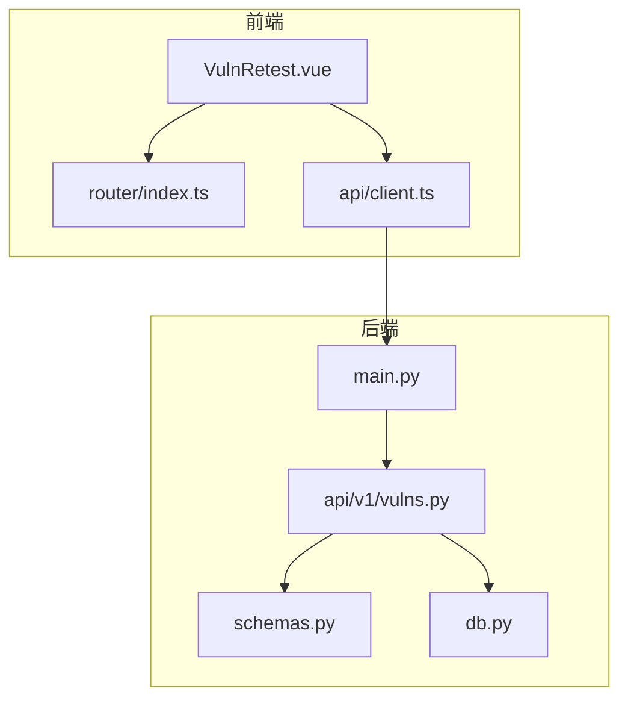
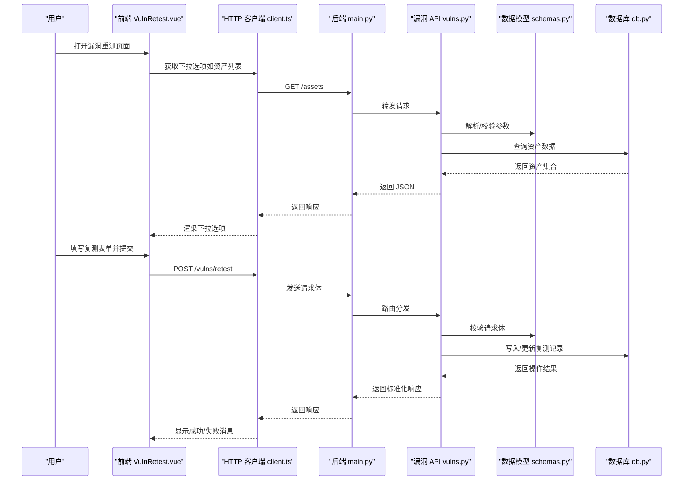
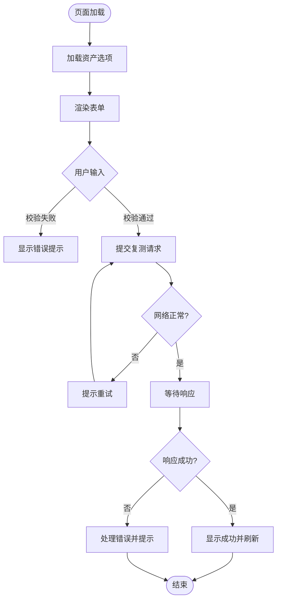
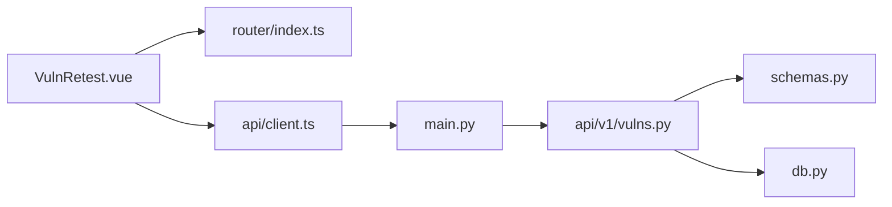

# 漏洞重测页面

<cite>
**本文引用的文件**   
- [VulnRetest.vue](file://frontend/src/views/VulnRetest.vue)
- [client.ts](file://frontend/src/api/client.ts)
- [vulns.py](file://backend/app/api/v1/vulns.py)
- [main.py](file://backend/app/main.py)
- [db.py](file://backend/app/db.py)
- [schemas.py](file://backend/app/schemas.py)
- [router/index.ts](file://frontend/src/router/index.ts)
</cite>

## 目录
1. [简介](#简介)
2. [项目结构](#项目结构)
3. [核心组件](#核心组件)
4. [架构总览](#架构总览)
5. [详细组件分析](#详细组件分析)
6. [依赖关系分析](#依赖关系分析)
7. [性能考虑](#性能考虑)
8. [故障排查指南](#故障排查指南)
9. [结论](#结论)
10. [附录](#附录)

## 简介
本文件围绕“漏洞重测页面”进行系统化文档化，涵盖前后端交互、数据模型、处理流程与常见问题定位。该功能用于对已发现的安全漏洞发起复测任务，支持选择目标资产、填写复测信息、提交任务并查看结果状态。前端基于 Vue 3 + TypeScript，后端基于 FastAPI + SQLAlchemy，通过 RESTful API 完成数据交换。

## 项目结构
与“漏洞重测页面”直接相关的代码分布在以下位置：
- 前端视图与路由：
  - 视图组件：frontend/src/views/VulnRetest.vue
  - 路由配置：frontend/src/router/index.ts
  - HTTP 客户端封装：frontend/src/api/client.ts
- 后端接口与数据层：
  - 漏洞相关 API：backend/app/api/v1/vulns.py
  - 应用入口与中间件：backend/app/main.py
  - 数据库会话管理：backend/app/db.py
  - Pydantic 数据模型：backend/app/schemas.py

图表来源
- [VulnRetest.vue](file://frontend/src/views/VulnRetest.vue)
- [router/index.ts](file://frontend/src/router/index.ts)
- [client.ts](file://frontend/src/api/client.ts)
- [main.py](file://backend/app/main.py)
- [vulns.py](file://backend/app/api/v1/vulns.py)
- [schemas.py](file://backend/app/schemas.py)
- [db.py](file://backend/app/db.py)

章节来源
- [VulnRetest.vue](file://frontend/src/views/VulnRetest.vue)
- [client.ts](file://frontend/src/api/client.ts)
- [vulns.py](file://backend/app/api/v1/vulns.py)
- [main.py](file://backend/app/main.py)
- [db.py](file://backend/app/db.py)
- [schemas.py](file://backend/app/schemas.py)
- [router/index.ts](file://frontend/src/router/index.ts)

## 核心组件
- 前端漏洞重测页面（VulnRetest.vue）
  - 负责展示复测表单、收集用户输入、调用后端 API、处理响应与错误提示。
  - 关键职责包括：表单校验、加载下拉选项（如资产列表）、提交复测请求、渲染结果或错误信息。
- 前端 HTTP 客户端（client.ts）
  - 统一封装 HTTP 请求，设置基础 URL、请求头、拦截器（鉴权、错误处理）。
- 后端漏洞 API（vulns.py）
  - 定义与漏洞重测相关的接口，接收请求体、校验参数、执行业务逻辑、返回标准化响应。
- 数据模型（schemas.py）
  - 使用 Pydantic 定义请求/响应的数据结构，确保类型安全与自动校验。
- 数据库访问（db.py）
  - 提供数据库会话、连接管理与事务控制。
- 应用入口（main.py）
  - 注册路由、挂载中间件、配置跨域与全局异常处理。

章节来源
- [VulnRetest.vue](file://frontend/src/views/VulnRetest.vue)
- [client.ts](file://frontend/src/api/client.ts)
- [vulns.py](file://backend/app/api/v1/vulns.py)
- [schemas.py](file://backend/app/schemas.py)
- [db.py](file://backend/app/db.py)
- [main.py](file://backend/app/main.py)

## 架构总览
下图展示了从前端触发“漏洞重测”到后端处理并返回结果的完整调用链。

图表来源
- [VulnRetest.vue](file://frontend/src/views/VulnRetest.vue)
- [client.ts](file://frontend/src/api/client.ts)
- [main.py](file://backend/app/main.py)
- [vulns.py](file://backend/app/api/v1/vulns.py)
- [schemas.py](file://backend/app/schemas.py)
- [db.py](file://backend/app/db.py)

## 详细组件分析

### 前端漏洞重测页面（VulnRetest.vue）
- 功能要点
  - 表单字段：漏洞标识、复测说明、目标资产选择、优先级等。
  - 数据加载：在页面初始化时拉取资产列表作为下拉选项。
  - 提交逻辑：对表单进行本地校验后，调用后端接口提交复测任务。
  - 反馈处理：根据响应码与消息展示成功或错误提示；必要时刷新列表或跳转。
- 交互流程
  - 页面进入 → 加载资产选项 → 用户编辑表单 → 提交 → 等待响应 → 结果展示。
- 错误处理
  - 网络异常：捕获超时、断网等错误，提示用户重试。
  - 业务异常：根据后端返回的错误码与消息进行友好提示。
  - 表单校验：必填项、格式限制等在前端即时反馈。

图表来源
- [VulnRetest.vue](file://frontend/src/views/VulnRetest.vue)

章节来源
- [VulnRetest.vue](file://frontend/src/views/VulnRetest.vue)

### 前端 HTTP 客户端（client.ts）
- 职责
  - 统一基础 URL、请求头（如 Authorization）。
  - 请求拦截：附加令牌、序列化请求体。
  - 响应拦截：统一错误处理、权限不足提示、通用错误弹窗。
- 与页面集成
  - 页面通过导入客户端方法发起请求，避免重复逻辑。
  - 错误信息集中处理，提升用户体验一致性。

章节来源
- [client.ts](file://frontend/src/api/client.ts)

### 后端漏洞 API（vulns.py）
- 接口设计
  - 定义与漏洞重测相关的端点，例如提交复测任务、查询复测记录等。
  - 使用 Pydantic 模型校验请求体，确保字段类型与约束正确。
- 业务流程
  - 接收请求 → 校验参数 → 执行业务逻辑（如创建复测任务、关联资产）→ 持久化到数据库 → 返回标准响应。
- 错误处理
  - 参数校验失败返回 422。
  - 业务异常（如资产不存在、权限不足）返回 4xx。
  - 系统异常返回 5xx 并记录日志。

章节来源
- [vulns.py](file://backend/app/api/v1/vulns.py)
- [schemas.py](file://backend/app/schemas.py)

### 数据模型（schemas.py）
- 作用
  - 定义请求与响应的数据结构，包含字段类型、默认值、校验规则。
  - 为 FastAPI 自动生成文档与校验逻辑。
- 常见模型
  - 漏洞复测请求模型：包含漏洞 ID、复测说明、目标资产 ID、优先级等。
  - 资产列表响应模型：包含资产 ID、名称、IP、分组等。
  - 通用响应包装：包含状态码、消息、数据体。

章节来源
- [schemas.py](file://backend/app/schemas.py)

### 数据库访问（db.py）
- 职责
  - 管理数据库连接与会话生命周期。
  - 提供事务上下文，确保数据一致性。
- 使用方式
  - API 层通过依赖注入获取会话，执行查询与更新。
  - 异常捕获与回滚策略保证稳定性。

章节来源
- [db.py](file://backend/app/db.py)

### 应用入口（main.py）
- 职责
  - 注册路由模块（如 v1 下的 vulns）。
  - 配置中间件（CORS、认证、日志）。
  - 全局异常处理器与错误响应格式化。
- 与前端对接
  - 暴露统一的 API 前缀，便于前端统一调用。

章节来源
- [main.py](file://backend/app/main.py)

## 依赖关系分析
- 前端依赖
  - VulnRetest.vue 依赖 router/index.ts 进行路由导航。
  - 所有 API 调用通过 api/client.ts 统一封装。
- 后端依赖
  - vulns.py 依赖 schemas.py 进行数据校验。
  - 数据读写通过 db.py 提供的会话与连接管理。
  - main.py 聚合路由与中间件，对外暴露 API。

图表来源
- [VulnRetest.vue](file://frontend/src/views/VulnRetest.vue)
- [router/index.ts](file://frontend/src/router/index.ts)
- [client.ts](file://frontend/src/api/client.ts)
- [main.py](file://backend/app/main.py)
- [vulns.py](file://backend/app/api/v1/vulns.py)
- [schemas.py](file://backend/app/schemas.py)
- [db.py](file://backend/app/db.py)

章节来源
- [VulnRetest.vue](file://frontend/src/views/VulnRetest.vue)
- [router/index.ts](file://frontend/src/router/index.ts)
- [client.ts](file://frontend/src/api/client.ts)
- [main.py](file://backend/app/main.py)
- [vulns.py](file://backend/app/api/v1/vulns.py)
- [schemas.py](file://backend/app/schemas.py)
- [db.py](file://backend/app/db.py)

## 性能考虑
- 前端优化
  - 下拉选项缓存：资产列表可缓存一段时间，减少重复请求。
  - 表单防抖：提交按钮防抖，避免重复提交。
  - 懒加载：仅在需要时加载详情或历史复测记录。
- 后端优化
  - 数据库索引：对常用查询字段建立索引（如资产 ID、漏洞 ID）。
  - 分页与过滤：资产列表与复测记录采用分页与过滤，降低负载。
  - 异步任务：耗时操作（如触发外部扫描）放入队列异步执行。

## 故障排查指南
- 前端问题
  - 页面空白或报错：检查浏览器控制台是否有 JS 错误或网络请求失败。
  - 下拉选项为空：确认资产接口是否可达，检查鉴权头是否正确。
  - 提交无响应：检查网络拦截器与后端返回状态码。
- 后端问题
  - 422 参数错误：核对请求体字段是否符合 schemas.py 定义。
  - 404 未找到：确认路由注册与路径前缀是否正确。
  - 500 服务器错误：查看日志定位异常堆栈，检查数据库连接与事务。
- 常见问题
  - 跨域问题：确认 CORS 配置允许前端域名与端口。
  - 鉴权失败：检查 Token 是否过期或传递方式不正确。
  - 数据不一致：检查事务是否回滚，是否存在并发写冲突。

章节来源
- [client.ts](file://frontend/src/api/client.ts)
- [vulns.py](file://backend/app/api/v1/vulns.py)
- [schemas.py](file://backend/app/schemas.py)
- [db.py](file://backend/app/db.py)
- [main.py](file://backend/app/main.py)

## 结论
“漏洞重测页面”通过清晰的前后端分离架构实现了完整的复测工作流。前端聚焦于用户体验与交互，后端专注于数据校验与业务处理。通过统一的客户端封装与标准化的数据模型，提升了系统的可维护性与扩展性。建议在生产环境中加强监控与日志采集，持续优化性能与稳定性。

## 附录
- 术语表
  - 漏洞重测：对已识别的漏洞再次进行测试以验证修复效果。
  - 资产：被测试的目标系统或服务。
  - 复测记录：一次复测任务的持久化数据。
- 参考文件
  - 前端视图：frontend/src/views/VulnRetest.vue
  - 前端路由：frontend/src/router/index.ts
  - 前端客户端：frontend/src/api/client.ts
  - 后端 API：backend/app/api/v1/vulns.py
  - 数据模型：backend/app/schemas.py
  - 数据库访问：backend/app/db.py
  - 应用入口：backend/app/main.py