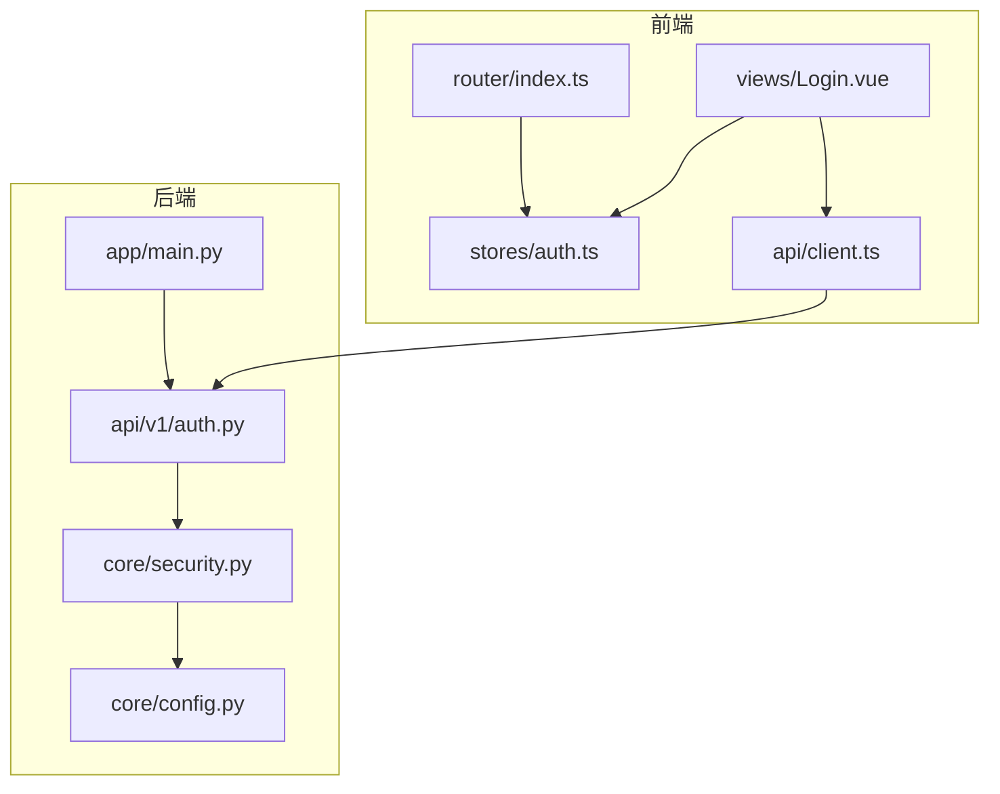
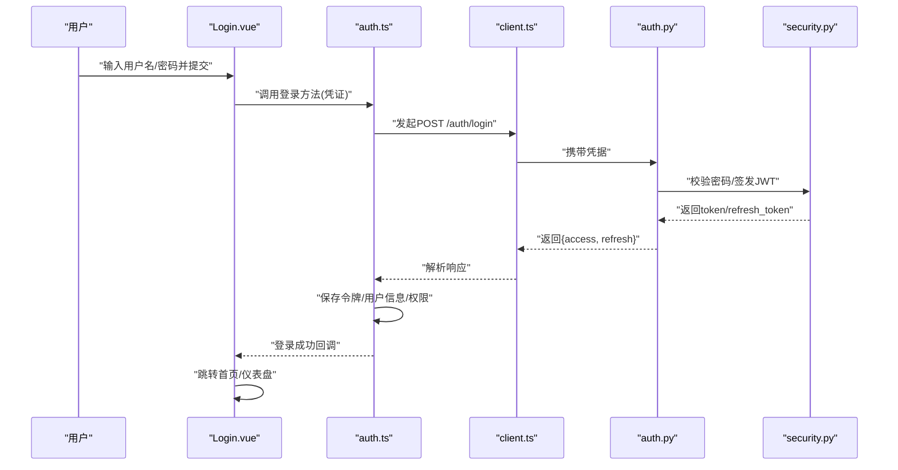
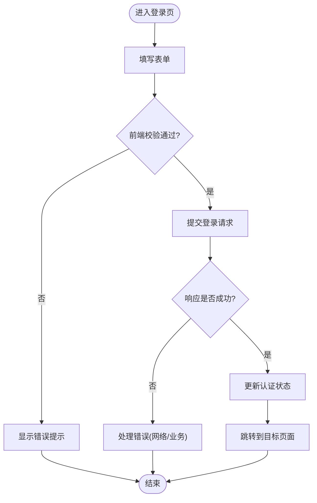
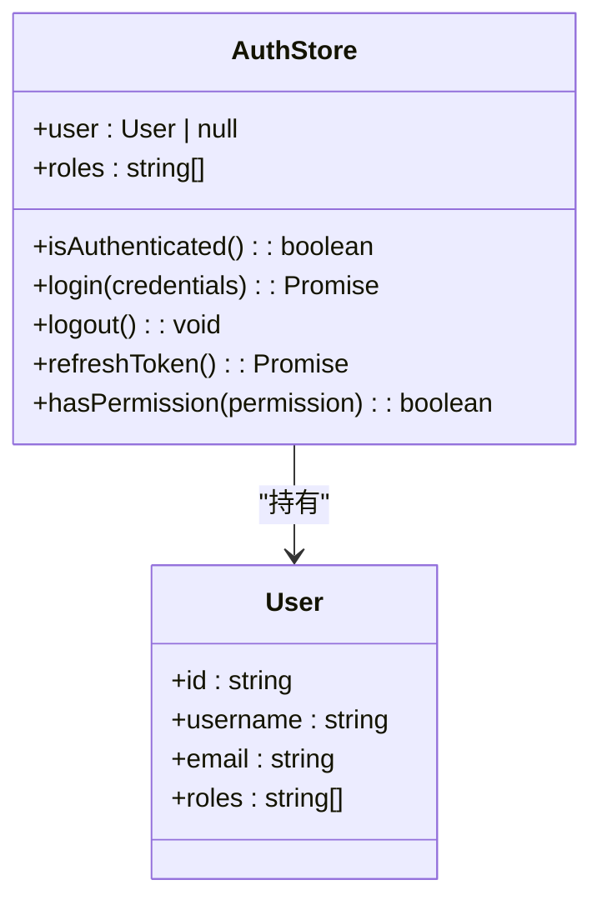
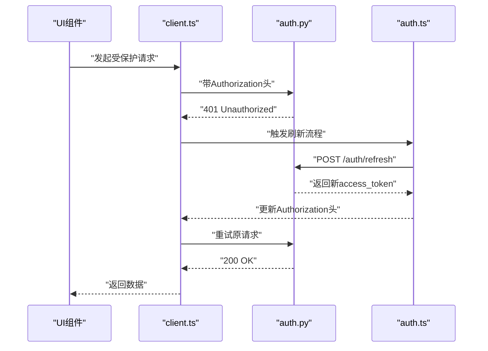
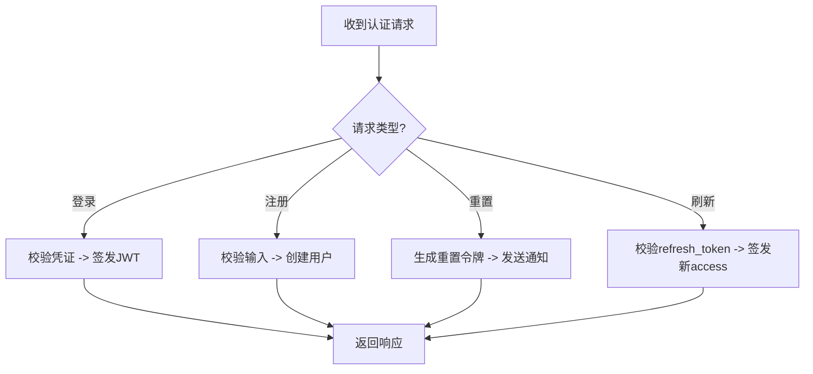
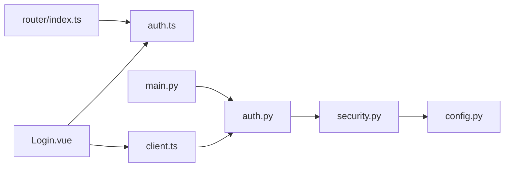

# 认证页面

<cite>
**本文引用的文件**   
- [Login.vue](file://frontend/src/views/Login.vue)
- [auth.ts](file://frontend/src/stores/auth.ts)
- [client.ts](file://frontend/src/api/client.ts)
- [index.ts](file://frontend/src/router/index.ts)
- [auth.py](file://backend/app/api/v1/auth.py)
- [security.py](file://backend/app/core/security.py)
- [config.py](file://backend/app/core/config.py)
- [main.py](file://backend/app/main.py)
</cite>

## 目录
1. [简介](#简介)
2. [项目结构](#项目结构)
3. [核心组件](#核心组件)
4. [架构总览](#架构总览)
5. [详细组件分析](#详细组件分析)
6. [依赖关系分析](#依赖关系分析)
7. [性能考虑](#性能考虑)
8. [故障排查指南](#故障排查指南)
9. [结论](#结论)
10. [附录](#附录)

## 简介
本文件面向Talos项目的认证子系统，聚焦前端登录页面与认证状态管理，以及后端认证API与安全策略。文档将详细说明：
- Login.vue登录页面的实现要点：表单处理、用户身份验证、错误提示与交互流程
- auth.ts认证状态管理模块：会话管理、权限控制、自动登录机制
- JWT令牌的处理、刷新机制与安全存储策略
- 多因素认证（MFA）、密码重置与用户注册功能的扩展方案
- 认证安全最佳实践与常见安全问题防护建议

## 项目结构
认证相关的前端代码位于 frontend/src 下，包含视图、路由、状态管理与HTTP客户端；后端认证逻辑位于 backend/app 下的API与核心安全模块。

图表来源
- [Login.vue](file://frontend/src/views/Login.vue)
- [auth.ts](file://frontend/src/stores/auth.ts)
- [client.ts](file://frontend/src/api/client.ts)
- [index.ts](file://frontend/src/router/index.ts)
- [auth.py](file://backend/app/api/v1/auth.py)
- [security.py](file://backend/app/core/security.py)
- [config.py](file://backend/app/core/config.py)
- [main.py](file://backend/app/main.py)

章节来源
- [Login.vue](file://frontend/src/views/Login.vue)
- [auth.ts](file://frontend/src/stores/auth.ts)
- [client.ts](file://frontend/src/api/client.ts)
- [index.ts](file://frontend/src/router/index.ts)
- [auth.py](file://backend/app/api/v1/auth.py)
- [security.py](file://backend/app/core/security.py)
- [config.py](file://backend/app/core/config.py)
- [main.py](file://backend/app/main.py)

## 核心组件
- 登录页面（Login.vue）：负责收集用户名/密码等凭证，调用认证接口，处理成功与失败响应，展示错误信息，并在成功后跳转至受保护页面。
- 认证状态管理（auth.ts）：维护登录态、用户信息与权限，提供登录/登出方法，处理JWT的存取与刷新，支持自动登录与会话恢复。
- HTTP客户端（client.ts）：封装请求拦截器，统一附加Authorization头、处理401未授权、触发令牌刷新或登出。
- 认证API（auth.py）：提供登录、注册、密码重置、令牌签发与刷新等接口，校验输入并返回标准响应。
- 安全模块（security.py）：JWT签发与验证、密码哈希与校验、令牌黑名单/撤销、速率限制等。
- 配置（config.py）：JWT密钥、过期时间、刷新策略、安全头等。
- 应用入口（main.py）：挂载认证路由、全局中间件（如CORS、CSRF、限流）。

章节来源
- [Login.vue](file://frontend/src/views/Login.vue)
- [auth.ts](file://frontend/src/stores/auth.ts)
- [client.ts](file://frontend/src/api/client.ts)
- [auth.py](file://backend/app/api/v1/auth.py)
- [security.py](file://backend/app/core/security.py)
- [config.py](file://backend/app/core/config.py)
- [main.py](file://backend/app/main.py)

## 架构总览
下图展示了从用户提交登录到后端签发JWT，再到前端状态更新与路由守卫的整体流程。

图表来源
- [Login.vue](file://frontend/src/views/Login.vue)
- [auth.ts](file://frontend/src/stores/auth.ts)
- [client.ts](file://frontend/src/api/client.ts)
- [auth.py](file://backend/app/api/v1/auth.py)
- [security.py](file://backend/app/core/security.py)

## 详细组件分析

### 登录页面（Login.vue）
- 表单处理
  - 字段：用户名、密码（可扩展邮箱、验证码等）
  - 校验：前端基础校验（非空、格式），提交前阻止无效提交
  - 交互：加载状态、禁用提交按钮防止重复提交
- 身份验证
  - 调用认证状态管理的登录方法，传递凭证
  - 根据响应结果决定跳转或显示错误
- 错误提示
  - 网络错误、服务端错误、业务错误（如账号不存在、密码错误、账户锁定）
  - 使用统一的错误消息映射，避免泄露敏感信息
- 成功路径
  - 更新认证状态，记录用户角色/权限
  - 重定向到目标页面或默认首页
- 可访问性与体验
  - 键盘导航、ARIA标签、错误焦点定位

图表来源
- [Login.vue](file://frontend/src/views/Login.vue)
- [auth.ts](file://frontend/src/stores/auth.ts)
- [client.ts](file://frontend/src/api/client.ts)

章节来源
- [Login.vue](file://frontend/src/views/Login.vue)
- [auth.ts](file://frontend/src/stores/auth.ts)
- [client.ts](file://frontend/src/api/client.ts)

### 认证状态管理（auth.ts）
- 会话管理
  - 维护当前用户信息、角色/权限、登录态
  - 监听路由变化，确保受保护路由仅已登录用户访问
- 登录/登出
  - 登录：调用API获取令牌，持久化存储，设置全局鉴权头
  - 登出：清除本地存储，失效令牌，重定向到登录页
- 自动登录
  - 应用启动时检查本地令牌有效性，必要时刷新后恢复会话
  - 若令牌无效或过期，强制登出并提示重新登录
- 权限控制
  - 基于角色的访问控制（RBAC），在路由守卫与组件级进行权限判断
  - 动态菜单与功能开关依据用户权限渲染
- 令牌刷新
  - 捕获401响应，尝试使用refresh_token换取新access_token
  - 刷新失败则清理会话并重定向

图表来源
- [auth.ts](file://frontend/src/stores/auth.ts)

章节来源
- [auth.ts](file://frontend/src/stores/auth.ts)

### HTTP客户端（client.ts）
- 请求拦截器
  - 自动附加Authorization头（Bearer token）
  - 统一错误处理与重试策略
- 响应拦截器
  - 处理401未授权：触发令牌刷新或登出
  - 处理403禁止访问：提示无权限
  - 处理网络异常：友好提示与重试
- 令牌刷新流程
  - 防抖并发刷新请求，避免多次刷新
  - 刷新失败清理会话并跳转登录页

图表来源
- [client.ts](file://frontend/src/api/client.ts)
- [auth.ts](file://frontend/src/stores/auth.ts)
- [auth.py](file://backend/app/api/v1/auth.py)

章节来源
- [client.ts](file://frontend/src/api/client.ts)
- [auth.ts](file://frontend/src/stores/auth.ts)
- [auth.py](file://backend/app/api/v1/auth.py)

### 认证API（auth.py）
- 登录接口
  - 校验用户名/密码，生成access_token与refresh_token
  - 返回标准响应体，包含用户基本信息与权限
- 注册接口
  - 校验唯一性（用户名/邮箱）、密码强度
  - 创建用户并返回必要信息
- 密码重置
  - 发送重置链接或一次性验证码
  - 校验重置令牌有效期与使用次数
- 令牌刷新
  - 校验refresh_token，签发新的access_token
  - 支持令牌轮换与黑名单机制

图表来源
- [auth.py](file://backend/app/api/v1/auth.py)
- [security.py](file://backend/app/core/security.py)

章节来源
- [auth.py](file://backend/app/api/v1/auth.py)
- [security.py](file://backend/app/core/security.py)

### 安全模块（security.py）
- JWT签发与验证
  - 使用强随机密钥与合适的算法（如RS256/HS256）
  - 设置合理的过期时间与刷新策略
- 密码安全
  - 使用bcrypt/argon2进行哈希与盐值管理
  - 拒绝弱口令与常见字典密码
- 令牌管理
  - 支持令牌黑名单、撤销与审计日志
  - 限制令牌签发频率与设备绑定（可选）
- 安全头与防护
  - CORS严格白名单、CSRF防护、XSS防护、HSTS等

章节来源
- [security.py](file://backend/app/core/security.py)
- [config.py](file://backend/app/core/config.py)

### 配置（config.py）
- JWT相关：密钥、算法、过期时间、刷新令牌有效期
- 安全策略：密码复杂度、登录失败锁定、IP限流
- 跨域与Cookie策略：SameSite、Secure、HttpOnly

章节来源
- [config.py](file://backend/app/core/config.py)

### 应用入口（main.py）
- 挂载认证路由与中间件
- 全局错误处理与日志记录
- 健康检查与监控指标

章节来源
- [main.py](file://backend/app/main.py)

## 依赖关系分析
- 前端依赖
  - Login.vue依赖auth.ts与client.ts
  - router/index.ts依赖auth.ts进行路由守卫
- 后端依赖
  - auth.py依赖security.py进行JWT与密码处理
  - security.py依赖config.py读取安全参数
  - main.py挂载auth.py路由与全局中间件

图表来源
- [Login.vue](file://frontend/src/views/Login.vue)
- [auth.ts](file://frontend/src/stores/auth.ts)
- [client.ts](file://frontend/src/api/client.ts)
- [index.ts](file://frontend/src/router/index.ts)
- [auth.py](file://backend/app/api/v1/auth.py)
- [security.py](file://backend/app/core/security.py)
- [config.py](file://backend/app/core/config.py)
- [main.py](file://backend/app/main.py)

章节来源
- [Login.vue](file://frontend/src/views/Login.vue)
- [auth.ts](file://frontend/src/stores/auth.ts)
- [client.ts](file://frontend/src/api/client.ts)
- [index.ts](file://frontend/src/router/index.ts)
- [auth.py](file://backend/app/api/v1/auth.py)
- [security.py](file://backend/app/core/security.py)
- [config.py](file://backend/app/core/config.py)
- [main.py](file://backend/app/main.py)

## 性能考虑
- 前端
  - 表单防抖与节流，减少重复提交
  - 懒加载与按需加载路由，提升首屏性能
  - 错误提示去重与合并，避免频繁DOM操作
- 后端
  - 缓存热点数据（如用户权限）
  - 数据库查询优化与索引
  - 令牌刷新采用异步队列与批量处理

[本节为通用指导，不直接分析具体文件]

## 故障排查指南
- 常见问题
  - 401未授权：检查Authorization头是否正确、令牌是否过期、刷新流程是否正常
  - 403禁止访问：确认用户权限与路由守卫配置
  - 登录失败：核对用户名/密码、账户锁定策略、后端日志
- 调试建议
  - 启用详细日志与追踪ID
  - 使用浏览器开发者工具检查请求/响应与存储
  - 在后端开启认证相关日志，定位问题根因

章节来源
- [client.ts](file://frontend/src/api/client.ts)
- [auth.ts](file://frontend/src/stores/auth.ts)
- [auth.py](file://backend/app/api/v1/auth.py)
- [security.py](file://backend/app/core/security.py)

## 结论
Talos的认证体系以前端Login.vue与auth.ts为核心，结合后端auth.py与security.py实现完整的登录、注册、密码重置与JWT生命周期管理。通过严格的配置与中间件保障安全性，同时提供清晰的错误处理与用户体验。建议在后续迭代中引入多因素认证、设备指纹与更细粒度的权限模型，进一步提升系统的安全性与可维护性。

[本节为总结，不直接分析具体文件]

## 附录

### 多因素认证（MFA）扩展方案
- 流程设计
  - 首次登录成功后要求绑定MFA（TOTP或短信/邮件验证码）
  - 后续登录需输入一次验证码，降低暴力破解风险
- 实现要点
  - 后端生成并验证一次性验证码或TOTP码
  - 前端增加MFA输入步骤与倒计时
  - 支持备用验证码与恢复码管理

[本节为概念性内容，不直接分析具体文件]

### 密码重置与用户注册
- 密码重置
  - 发送重置链接或验证码，限制有效期与使用次数
  - 校验重置令牌与用户一致性，更新密码后失效旧令牌
- 用户注册
  - 校验唯一性与密码强度，发送欢迎邮件
  - 可选邮箱验证与激活流程

[本节为概念性内容，不直接分析具体文件]

### 安全最佳实践
- 传输层
  - 全站HTTPS，启用HSTS与强加密套件
  - 正确配置CORS与CSRF防护
- 存储层
  - 敏感数据加密存储，最小化暴露面
  - 定期轮换密钥与证书
- 应用层
  - 输入校验与输出编码，防范注入与XSS
  - 限流与账户锁定，抵御暴力破解
  - 审计日志与告警，及时发现问题

[本节为通用指导，不直接分析具体文件]