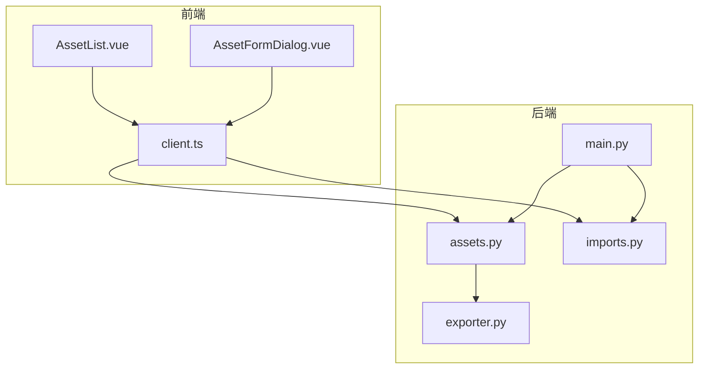
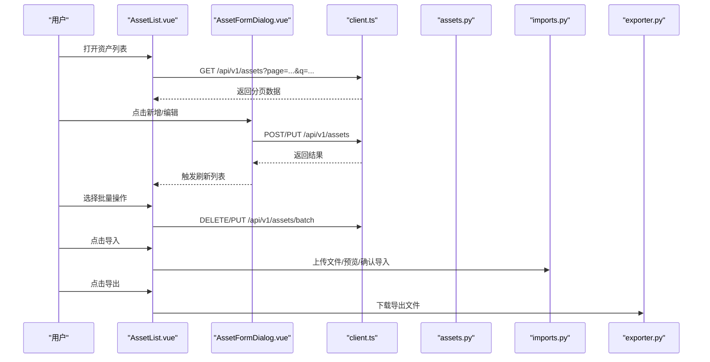
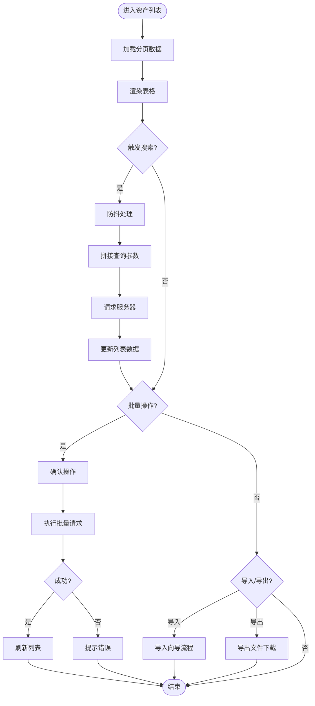
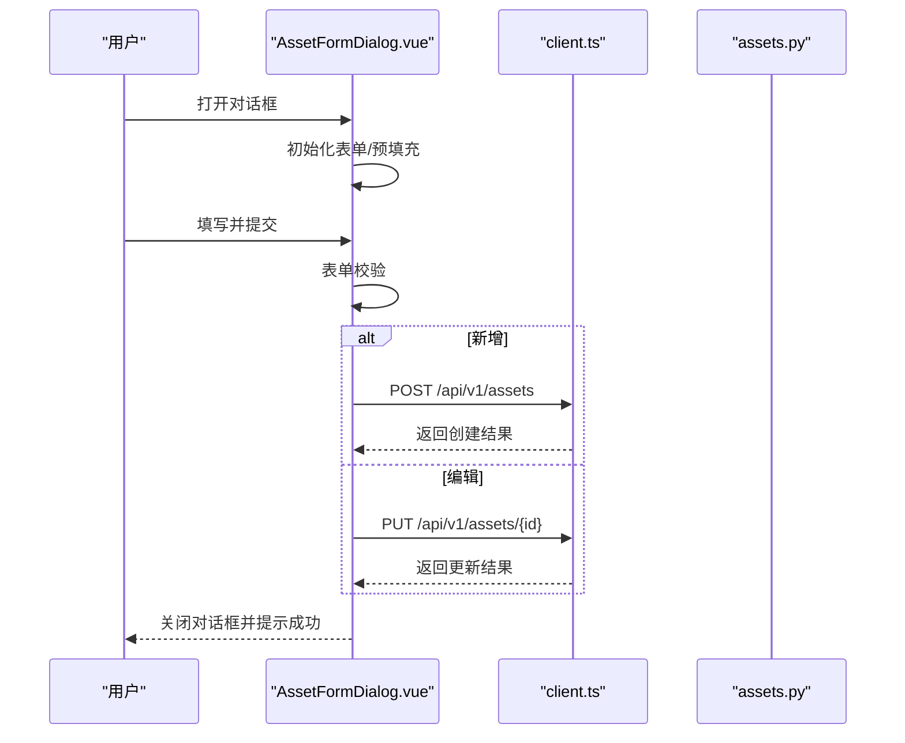
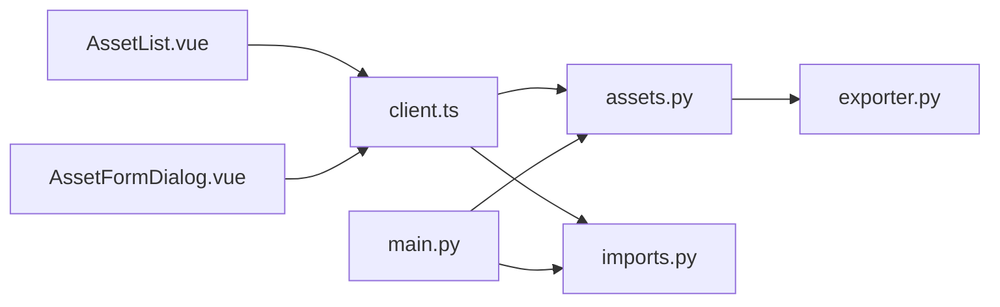

# 资产管理页面

<cite>
**本文档引用的文件**   
- [AssetList.vue](file://frontend/src/views/AssetList.vue)
- [AssetFormDialog.vue](file://frontend/src/components/AssetFormDialog.vue)
- [client.ts](file://frontend/src/api/client.ts)
- [assets.py](file://backend/app/api/v1/assets.py)
- [imports.py](file://backend/app/api/v1/imports.py)
- [exporter.py](file://backend/app/services/exporter.py)
- [main.py](file://backend/app/main.py)
</cite>

## 目录
1. [简介](#简介)
2. [项目结构](#项目结构)
3. [核心组件](#核心组件)
4. [架构总览](#架构总览)
5. [详细组件分析](#详细组件分析)
6. [依赖关系分析](#依赖关系分析)
7. [性能考虑](#性能考虑)
8. [故障排查指南](#故障排查指南)
9. [结论](#结论)
10. [附录](#附录)

## 简介
本文件面向Talos系统的资产管理模块，聚焦前端资产列表与表单对话框的实现，以及后端资产API、导入导出能力。文档涵盖：
- 资产列表的数据展示、搜索过滤、分页交互
- 资产表单对话框的增删改查（CRUD）流程与表单验证
- 批量操作、导入导出功能与权限控制要点
- 最佳实践与常见问题解决方案

## 项目结构
资产管理相关的前后端文件组织如下：
- 前端视图与组件
  - views/AssetList.vue：资产列表页，负责数据加载、筛选、分页、批量操作与导入导出入口
  - components/AssetFormDialog.vue：资产新增/编辑对话框，封装表单校验与提交逻辑
  - api/client.ts：HTTP客户端封装，统一请求拦截、错误处理与接口调用
- 后端API与服务
  - app/api/v1/assets.py：资产CRUD、搜索、分页、批量操作的REST接口
  - app/api/v1/imports.py：资产导入相关接口（预览、确认导入等）
  - app/services/exporter.py：资产导出服务（如CSV/Excel）
  - app/main.py：应用启动、路由注册、中间件配置

图表来源
- [AssetList.vue](file://frontend/src/views/AssetList.vue)
- [AssetFormDialog.vue](file://frontend/src/components/AssetFormDialog.vue)
- [client.ts](file://frontend/src/api/client.ts)
- [assets.py](file://backend/app/api/v1/assets.py)
- [imports.py](file://backend/app/api/v1/imports.py)
- [exporter.py](file://backend/app/services/exporter.py)
- [main.py](file://backend/app/main.py)

章节来源
- [AssetList.vue](file://frontend/src/views/AssetList.vue)
- [AssetFormDialog.vue](file://frontend/src/components/AssetFormDialog.vue)
- [client.ts](file://frontend/src/api/client.ts)
- [assets.py](file://backend/app/api/v1/assets.py)
- [imports.py](file://backend/app/api/v1/imports.py)
- [exporter.py](file://backend/app/services/exporter.py)
- [main.py](file://backend/app/main.py)

## 核心组件
- 资产列表页（AssetList.vue）
  - 数据展示：表格渲染资产字段，支持排序与状态标识
  - 搜索过滤：按名称、类型、标签等多条件组合查询
  - 分页：服务端分页，页码与每页条数可配置
  - 批量操作：选中多条记录进行删除、更新状态或导出
  - 导入导出：触发导入向导或下载导出文件
  - 权限控制：根据用户角色动态显示按钮与操作项
- 资产表单对话框（AssetFormDialog.vue）
  - 新增/编辑：复用同一对话框，通过模式切换区分
  - 表单验证：必填项、格式校验、唯一性检查
  - 提交逻辑：调用API创建或更新，成功后刷新列表并关闭对话框
  - 错误处理：捕获后端错误并提示用户

章节来源
- [AssetList.vue](file://frontend/src/views/AssetList.vue)
- [AssetFormDialog.vue](file://frontend/src/components/AssetFormDialog.vue)

## 架构总览
前后端交互采用REST风格，前端通过统一的HTTP客户端发起请求，后端由FastAPI提供API，结合数据库模型与导出服务完成业务逻辑。

图表来源
- [AssetList.vue](file://frontend/src/views/AssetList.vue)
- [AssetFormDialog.vue](file://frontend/src/components/AssetFormDialog.vue)
- [client.ts](file://frontend/src/api/client.ts)
- [assets.py](file://backend/app/api/v1/assets.py)
- [imports.py](file://backend/app/api/v1/imports.py)
- [exporter.py](file://backend/app/services/exporter.py)

## 详细组件分析

### 资产列表页（AssetList.vue）
- 数据加载与展示
  - 使用分页参数向服务器请求资产数据，并在表格中渲染关键字段
  - 支持列排序与状态高亮
- 搜索与过滤
  - 将用户输入转换为查询参数，包含关键词、类型、标签、时间范围等
  - 防抖优化避免频繁请求
- 分页
  - 页码变化时重新拉取数据，保持当前筛选条件
- 批量操作
  - 多选后执行批量删除或状态更新，失败时保留已选状态并提示
- 导入导出
  - 导入：打开导入向导，支持文件上传、预览差异、确认导入
  - 导出：根据当前筛选条件生成并下载文件
- 权限控制
  - 基于用户角色隐藏/禁用敏感操作按钮（如删除、批量修改）

图表来源
- [AssetList.vue](file://frontend/src/views/AssetList.vue)
- [client.ts](file://frontend/src/api/client.ts)
- [assets.py](file://backend/app/api/v1/assets.py)
- [imports.py](file://backend/app/api/v1/imports.py)
- [exporter.py](file://backend/app/services/exporter.py)

章节来源
- [AssetList.vue](file://frontend/src/views/AssetList.vue)
- [client.ts](file://frontend/src/api/client.ts)
- [assets.py](file://backend/app/api/v1/assets.py)
- [imports.py](file://backend/app/api/v1/imports.py)
- [exporter.py](file://backend/app/services/exporter.py)

### 资产表单对话框（AssetFormDialog.vue）
- 新增/编辑模式
  - 通过传入的资产对象判断是否为编辑模式
  - 编辑模式下预填充表单字段
- 表单验证
  - 必填项校验、格式校验（如IP、域名）、唯一性检查
  - 实时反馈与提交前二次校验
- 提交逻辑
  - 新增：POST创建，成功后关闭对话框并通知父组件刷新
  - 编辑：PUT更新，成功后同步列表数据
- 错误处理
  - 捕获网络异常与后端校验错误，显示友好提示

图表来源
- [AssetFormDialog.vue](file://frontend/src/components/AssetFormDialog.vue)
- [client.ts](file://frontend/src/api/client.ts)
- [assets.py](file://backend/app/api/v1/assets.py)

章节来源
- [AssetFormDialog.vue](file://frontend/src/components/AssetFormDialog.vue)
- [client.ts](file://frontend/src/api/client.ts)
- [assets.py](file://backend/app/api/v1/assets.py)

### 资产数据CRUD与数据同步机制
- 增删改查逻辑
  - 新增：表单提交后插入新记录，返回列表顶部或指定位置
  - 删除：单条删除与批量删除，确认后执行
  - 更新：编辑保存后局部更新或全量刷新
  - 查询：支持关键词、类型、标签、时间范围等组合条件
- 数据同步机制
  - 乐观更新：在成功响应后立即更新UI，失败时回滚
  - 事件驱动：对话框提交后触发列表刷新事件
  - 缓存策略：对不常变的基础数据做本地缓存

章节来源
- [AssetList.vue](file://frontend/src/views/AssetList.vue)
- [AssetFormDialog.vue](file://frontend/src/components/AssetFormDialog.vue)
- [assets.py](file://backend/app/api/v1/assets.py)

### 批量操作、导入导出与权限控制
- 批量操作
  - 支持批量删除、批量更新状态、批量导出
  - 失败重试与部分成功提示
- 导入功能
  - 文件上传、预览差异、冲突检测、确认导入
  - 进度反馈与错误定位
- 导出功能
  - 根据筛选条件生成文件，支持多种格式
- 权限控制
  - 基于角色的访问控制（RBAC），隐藏或禁用无权限操作
  - 前端按钮级控制与后端接口鉴权双重保障

章节来源
- [AssetList.vue](file://frontend/src/views/AssetList.vue)
- [imports.py](file://backend/app/api/v1/imports.py)
- [exporter.py](file://backend/app/services/exporter.py)
- [assets.py](file://backend/app/api/v1/assets.py)

## 依赖关系分析
- 前端依赖
  - AssetList.vue依赖client.ts进行HTTP请求
  - AssetFormDialog.vue依赖client.ts与父组件的事件通信
- 后端依赖
  - assets.py提供资产CRUD与批量操作接口
  - imports.py处理导入流程
  - exporter.py提供导出服务
  - main.py注册路由与中间件

图表来源
- [AssetList.vue](file://frontend/src/views/AssetList.vue)
- [AssetFormDialog.vue](file://frontend/src/components/AssetFormDialog.vue)
- [client.ts](file://frontend/src/api/client.ts)
- [assets.py](file://backend/app/api/v1/assets.py)
- [imports.py](file://backend/app/api/v1/imports.py)
- [exporter.py](file://backend/app/services/exporter.py)
- [main.py](file://backend/app/main.py)

章节来源
- [AssetList.vue](file://frontend/src/views/AssetList.vue)
- [AssetFormDialog.vue](file://frontend/src/components/AssetFormDialog.vue)
- [client.ts](file://frontend/src/api/client.ts)
- [assets.py](file://backend/app/api/v1/assets.py)
- [imports.py](file://backend/app/api/v1/imports.py)
- [exporter.py](file://backend/app/services/exporter.py)
- [main.py](file://backend/app/main.py)

## 性能考虑
- 前端优化
  - 搜索防抖与节流，减少无效请求
  - 分页加载大数据集，避免一次性渲染
  - 虚拟滚动（可选）提升长列表性能
- 后端优化
  - 数据库索引优化（名称、类型、标签等常用查询字段）
  - 分页查询限制返回字段，减少传输体积
  - 导出任务异步化，避免阻塞请求

[本节为通用指导，无需具体文件引用]

## 故障排查指南
- 常见前端问题
  - 列表不刷新：检查事件绑定与刷新方法调用
  - 表单校验失效：确认校验规则与提交前校验逻辑
  - 权限按钮未隐藏：检查角色判断与条件渲染
- 常见后端问题
  - 接口404：检查路由注册与路径匹配
  - 数据不一致：检查事务与并发更新逻辑
  - 导入失败：查看错误日志与数据格式校验

章节来源
- [AssetList.vue](file://frontend/src/views/AssetList.vue)
- [AssetFormDialog.vue](file://frontend/src/components/AssetFormDialog.vue)
- [assets.py](file://backend/app/api/v1/assets.py)
- [imports.py](file://backend/app/api/v1/imports.py)

## 结论
资产管理模块通过清晰的前后端分离架构，实现了高效的资产数据管理。列表页与表单对话框协同工作，配合导入导出与权限控制，满足日常运维需求。建议持续优化查询性能与用户体验，确保系统稳定可靠。

[本节为总结性内容，无需具体文件引用]

## 附录
- 最佳实践
  - 统一错误处理与用户提示
  - 表单校验在前端与后端同时实现
  - 关键操作增加二次确认
  - 导出任务异步化并支持进度反馈
- 常见问题解决方案
  - 搜索无结果：检查查询参数拼接与后端过滤逻辑
  - 分页错乱：确认页码与每页条数一致性
  - 导入冲突：提供冲突解决策略与回滚机制

[本节为补充信息，无需具体文件引用]