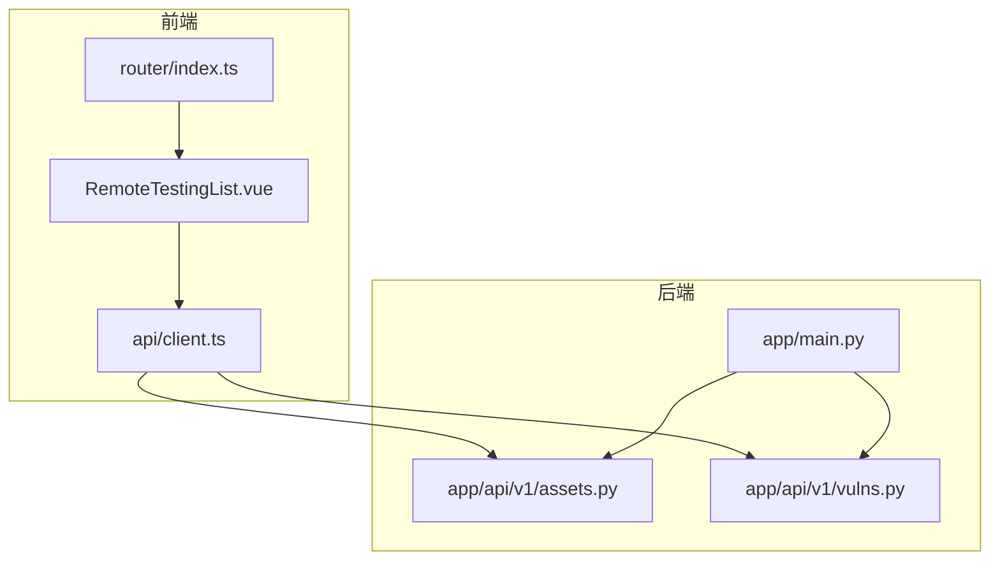
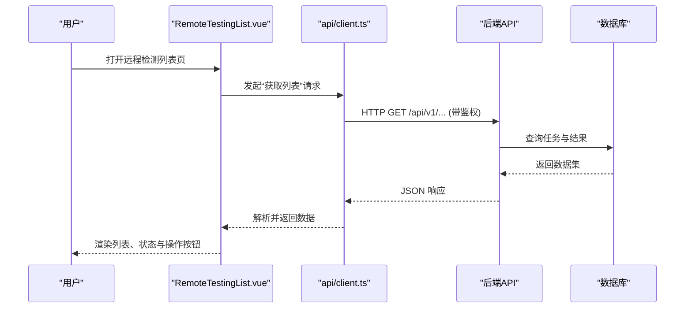
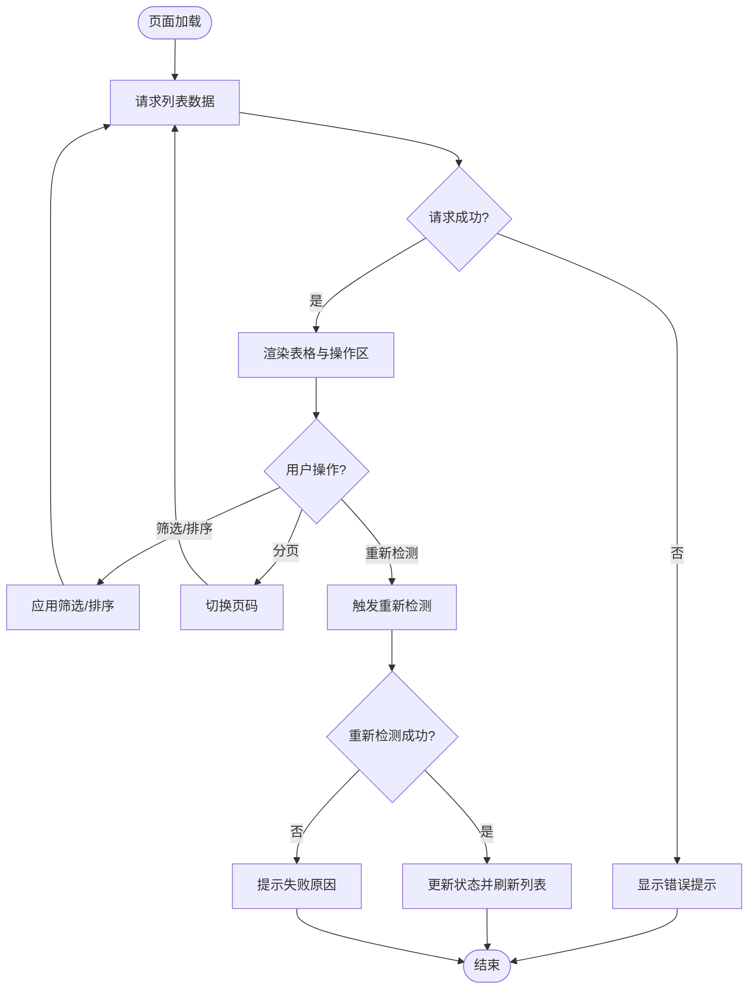
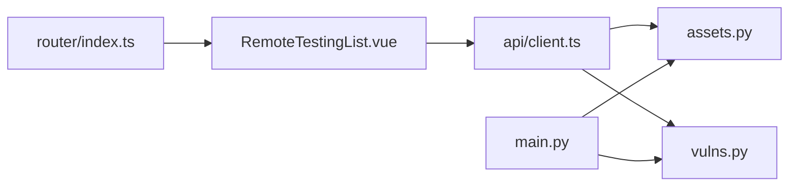

# 远程检测列表页面

<cite>
**本文引用的文件**   
- [RemoteTestingList.vue](file://frontend/src/views/RemoteTestingList.vue)
- [client.ts](file://frontend/src/api/client.ts)
- [router/index.ts](file://frontend/src/router/index.ts)
- [main.py](file://backend/app/main.py)
- [vulns.py](file://backend/app/api/v1/vulns.py)
- [assets.py](file://backend/app/api/v1/assets.py)
</cite>

## 目录
1. [简介](#简介)
2. [项目结构](#项目结构)
3. [核心组件](#核心组件)
4. [架构总览](#架构总览)
5. [详细组件分析](#详细组件分析)
6. [依赖分析](#依赖分析)
7. [性能考虑](#性能考虑)
8. [故障排查指南](#故障排查指南)
9. [结论](#结论)
10. [附录](#附录)

## 简介
本文件面向“远程检测列表页面”的前后端实现与交互，聚焦以下目标：
- 前端页面如何展示远程检测结果、支持筛选与分页、触发重新检测等关键操作。
- 前后端接口契约（请求/响应）及数据模型约定。
- 路由配置与权限控制要点。
- 常见问题的定位方法与优化建议。

## 项目结构
围绕该页面的代码主要分布在：
- 前端视图层：Vue 单文件组件负责渲染与交互。
- 前端 API 客户端：封装 HTTP 调用与错误处理。
- 前端路由：定义页面访问路径与导航守卫。
- 后端 API：提供远程检测相关的数据查询与操作接口。
- 后端主应用：注册路由与中间件。

图表来源
- [RemoteTestingList.vue](file://frontend/src/views/RemoteTestingList.vue)
- [client.ts](file://frontend/src/api/client.ts)
- [router/index.ts](file://frontend/src/router/index.ts)
- [main.py](file://backend/app/main.py)
- [assets.py](file://backend/app/api/v1/assets.py)
- [vulns.py](file://backend/app/api/v1/vulns.py)

章节来源
- [RemoteTestingList.vue](file://frontend/src/views/RemoteTestingList.vue)
- [client.ts](file://frontend/src/api/client.ts)
- [router/index.ts](file://frontend/src/router/index.ts)
- [main.py](file://backend/app/main.py)
- [assets.py](file://backend/app/api/v1/assets.py)
- [vulns.py](file://backend/app/api/v1/vulns.py)

## 核心组件
- 远程检测列表页面（RemoteTestingList.vue）
  - 功能职责：加载远程检测任务列表、展示状态与结果、支持筛选与分页、触发重新检测或导出等操作。
  - 交互流程：页面挂载时发起列表请求；用户操作触发筛选/分页/动作；根据后端返回更新视图。
- API 客户端（client.ts）
  - 功能职责：统一封装 HTTP 请求、鉴权头注入、错误码处理与重试策略。
- 路由（router/index.ts）
  - 功能职责：定义远程检测列表页的路由路径、元信息（如标题、权限）、以及可能的导航守卫。

章节来源
- [RemoteTestingList.vue](file://frontend/src/views/RemoteTestingList.vue)
- [client.ts](file://frontend/src/api/client.ts)
- [router/index.ts](file://frontend/src/router/index.ts)

## 架构总览
远程检测列表页面采用典型的前后端分离架构：
- 前端通过 API 客户端向后端发起 RESTful 请求，获取远程检测任务与结果数据。
- 后端将业务逻辑与数据访问解耦，暴露统一的 API 接口。
- 路由与权限在后端集中管理，前端通过路由元信息与守卫进行访问控制。

图表来源
- [RemoteTestingList.vue](file://frontend/src/views/RemoteTestingList.vue)
- [client.ts](file://frontend/src/api/client.ts)
- [assets.py](file://backend/app/api/v1/assets.py)
- [vulns.py](file://backend/app/api/v1/vulns.py)

## 详细组件分析

### 前端：RemoteTestingList.vue
- 数据流
  - 初始化：页面加载时拉取列表数据，包含分页参数与筛选条件。
  - 渲染：将后端返回的任务列表映射为表格行，展示关键字段（如资产、状态、时间、结果摘要）。
  - 交互：筛选、排序、分页、重新检测、导出等动作通过 API 客户端调用后端接口。
- 错误处理
  - 网络异常：提示用户并重试。
  - 业务错误：根据错误码显示具体原因（如权限不足、任务不存在）。
- 性能优化
  - 防抖搜索：对输入框变更进行节流/防抖，减少频繁请求。
  - 分页加载：避免一次性加载大量数据。
  - 缓存策略：对静态字典或枚举值做本地缓存。

图表来源
- [RemoteTestingList.vue](file://frontend/src/views/RemoteTestingList.vue)

章节来源
- [RemoteTestingList.vue](file://frontend/src/views/RemoteTestingList.vue)

### 前端：API 客户端 client.ts
- 职责
  - 统一封装 fetch/axios 调用，自动附加鉴权头。
  - 统一错误处理：区分网络错误、HTTP 错误码、业务错误消息。
  - 可选的重试与超时配置。
- 使用方式
  - 页面组件通过导入客户端方法，传入参数后获得 Promise 结果。
  - 在组件中捕获异常并给出用户友好的提示。

章节来源
- [client.ts](file://frontend/src/api/client.ts)

### 前端：路由 router/index.ts
- 职责
  - 定义远程检测列表页的路由路径与元信息（如页面标题、是否需要登录）。
  - 结合导航守卫实现权限校验与跳转。
- 注意事项
  - 确保路由名称与组件路径一致，便于调试与日志追踪。
  - 敏感页面需配合后端权限校验，防止越权访问。

章节来源
- [router/index.ts](file://frontend/src/router/index.ts)

### 后端：API 接口 assets.py 与 vulns.py
- 设计原则
  - 资源导向的 RESTful 风格，按资产与漏洞维度组织接口。
  - 统一响应格式与错误码，便于前端处理。
- 典型接口
  - 列表查询：支持分页、筛选、排序。
  - 操作接口：如触发重新检测、导出报告等。
- 安全与鉴权
  - 基于令牌或会话的鉴权机制，确保仅授权用户可访问。
  - 输入校验与参数白名单，防止注入与非法参数。

章节来源
- [assets.py](file://backend/app/api/v1/assets.py)
- [vulns.py](file://backend/app/api/v1/vulns.py)

### 后端：主应用 main.py
- 职责
  - 注册 API 路由、全局中间件（如 CORS、日志、鉴权）。
  - 统一异常处理与错误响应格式化。
- 扩展点
  - 新增 API 模块时，需在主应用中注册路由前缀与版本信息。

章节来源
- [main.py](file://backend/app/main.py)

## 依赖分析
- 前端依赖
  - RemoteTestingList.vue 依赖 api/client.ts 进行网络请求。
  - 路由模块负责页面导航与权限控制。
- 后端依赖
  - API 模块依赖数据库与业务服务（如报告生成、任务调度）。
  - 主应用聚合所有 API 路由并提供全局能力。

图表来源
- [RemoteTestingList.vue](file://frontend/src/views/RemoteTestingList.vue)
- [client.ts](file://frontend/src/api/client.ts)
- [router/index.ts](file://frontend/src/router/index.ts)
- [assets.py](file://backend/app/api/v1/assets.py)
- [vulns.py](file://backend/app/api/v1/vulns.py)
- [main.py](file://backend/app/main.py)

章节来源
- [RemoteTestingList.vue](file://frontend/src/views/RemoteTestingList.vue)
- [client.ts](file://frontend/src/api/client.ts)
- [router/index.ts](file://frontend/src/router/index.ts)
- [assets.py](file://backend/app/api/v1/assets.py)
- [vulns.py](file://backend/app/api/v1/vulns.py)
- [main.py](file://backend/app/main.py)

## 性能考虑
- 前端
  - 使用分页与虚拟滚动减少首屏渲染压力。
  - 对高频操作（搜索、筛选）增加防抖与节流。
  - 合理缓存静态数据与字典项，降低重复请求。
- 后端
  - 数据库查询添加必要索引，避免全表扫描。
  - 对耗时操作引入异步任务队列与进度反馈。
  - 启用响应压缩与缓存策略（如 ETag、Cache-Control）。

## 故障排查指南
- 常见问题
  - 列表为空：检查后端接口是否返回空集或存在过滤条件过严。
  - 权限错误：确认前端鉴权头是否正确携带，后端权限校验是否放行。
  - 重新检测失败：查看任务状态与错误日志，确认依赖服务可用。
- 定位步骤
  - 浏览器开发者工具查看网络请求与响应。
  - 后端日志输出关键参数与异常堆栈。
  - 数据库慢查询分析与索引优化。

章节来源
- [client.ts](file://frontend/src/api/client.ts)
- [assets.py](file://backend/app/api/v1/assets.py)
- [vulns.py](file://backend/app/api/v1/vulns.py)
- [main.py](file://backend/app/main.py)

## 结论
远程检测列表页面通过清晰的前后端分层与接口契约，实现了稳定的数据展示与交互能力。建议在后续迭代中持续优化性能与用户体验，完善错误提示与监控告警，提升系统的可维护性与可靠性。

## 附录
- 术语说明
  - 远程检测：指对远端资产执行的安全检测任务。
  - 任务状态：表示检测任务的当前阶段（如待执行、执行中、已完成、失败）。
- 参考文件
  - 前端视图与客户端、路由配置。
  - 后端 API 与主应用入口。