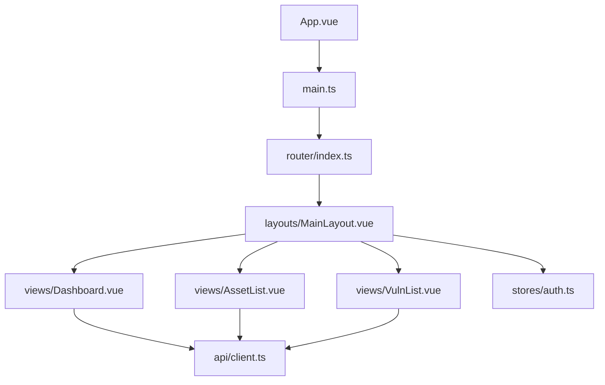
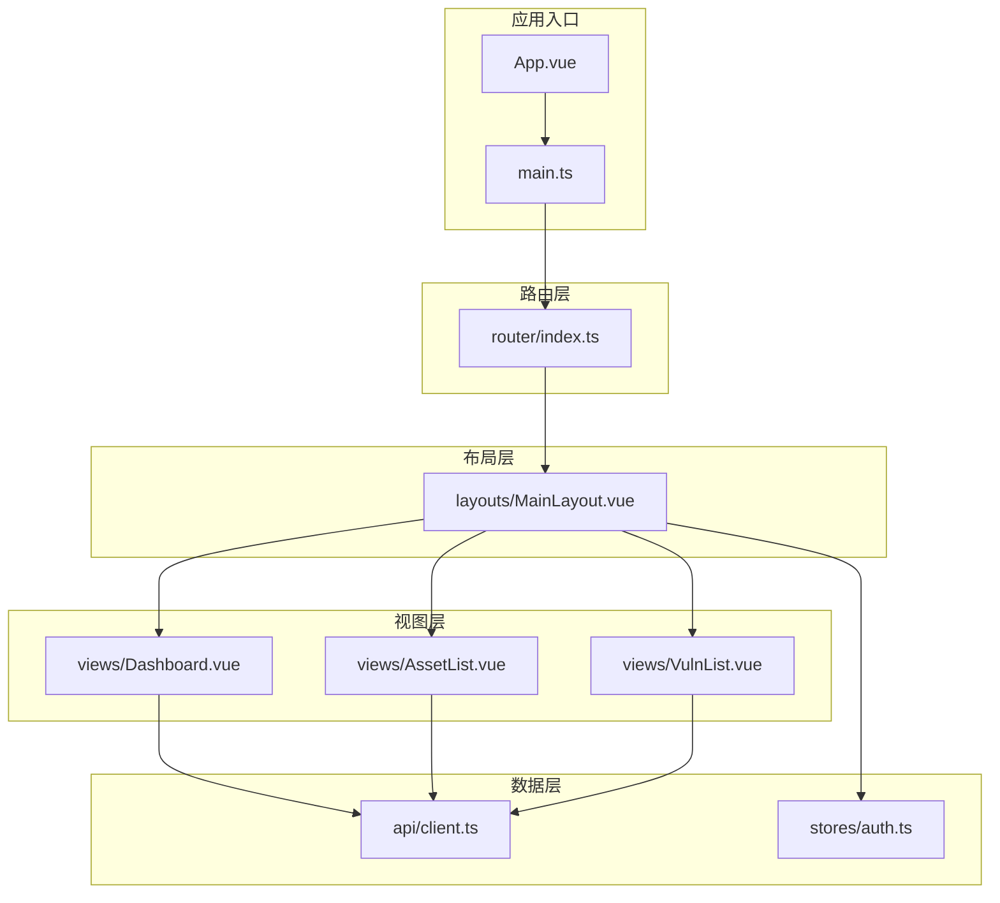
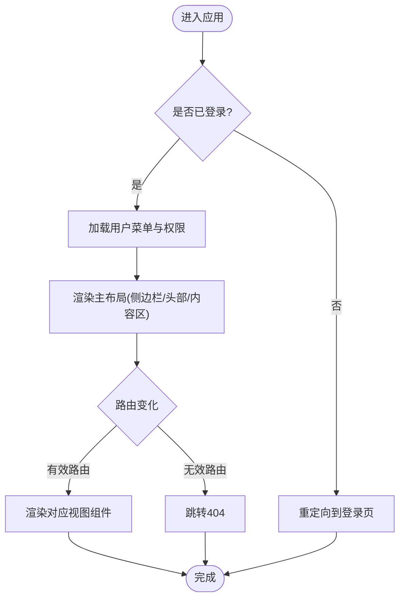
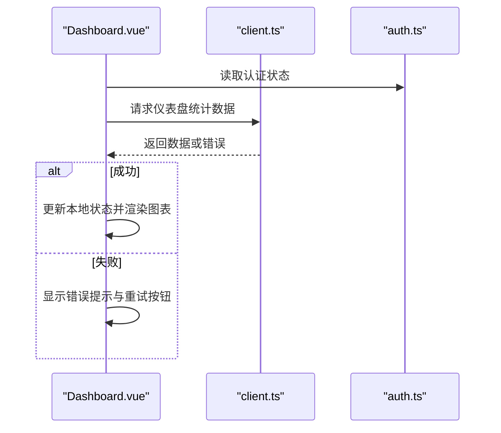
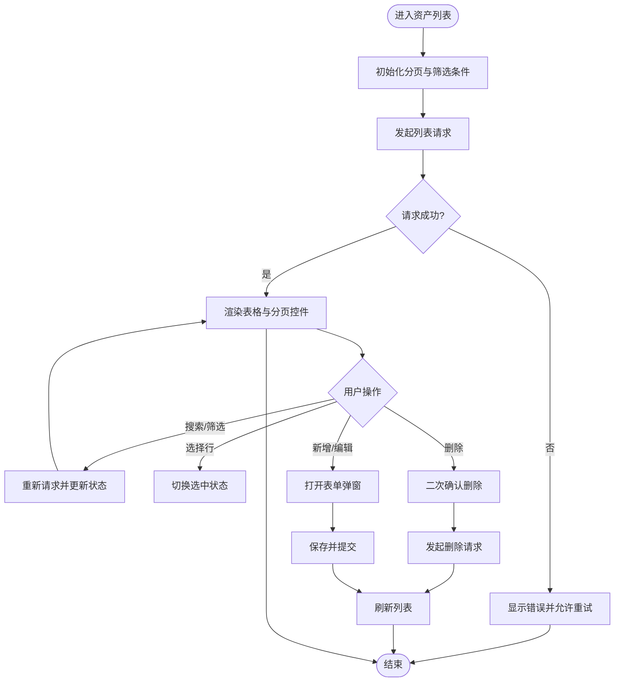
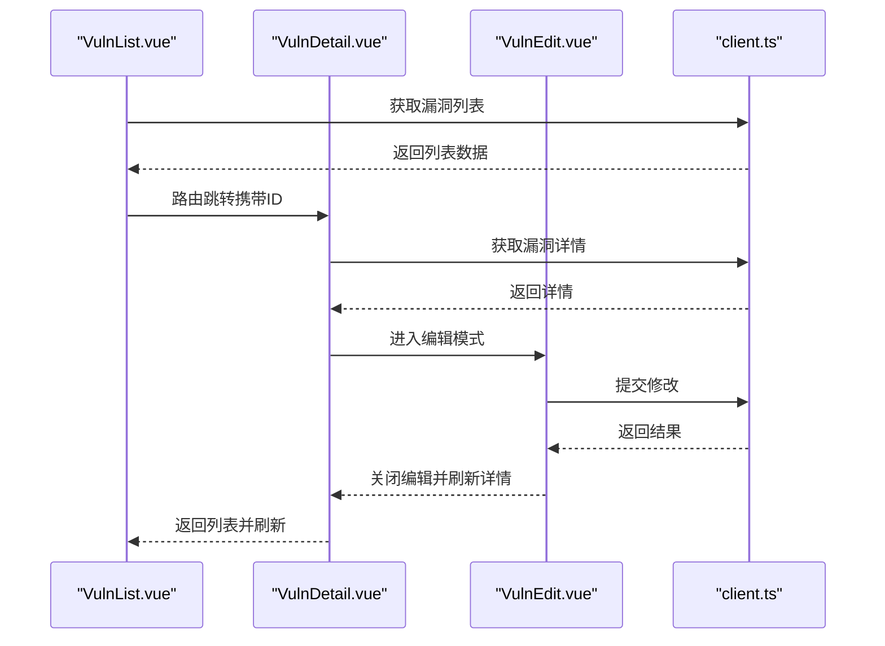
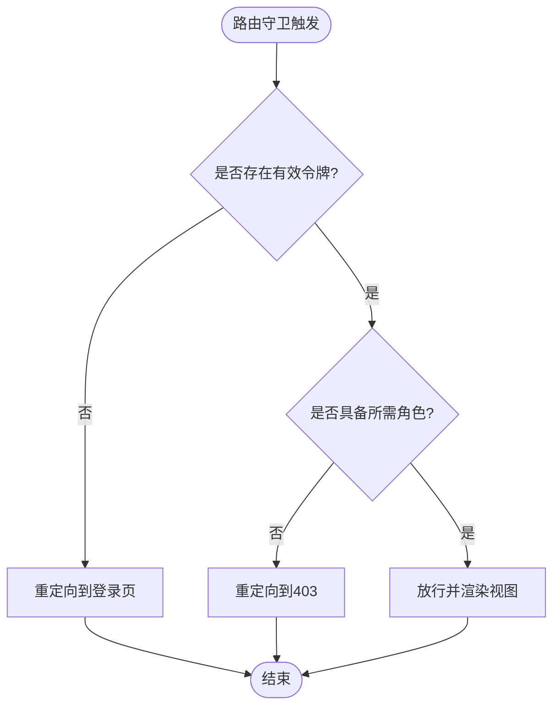
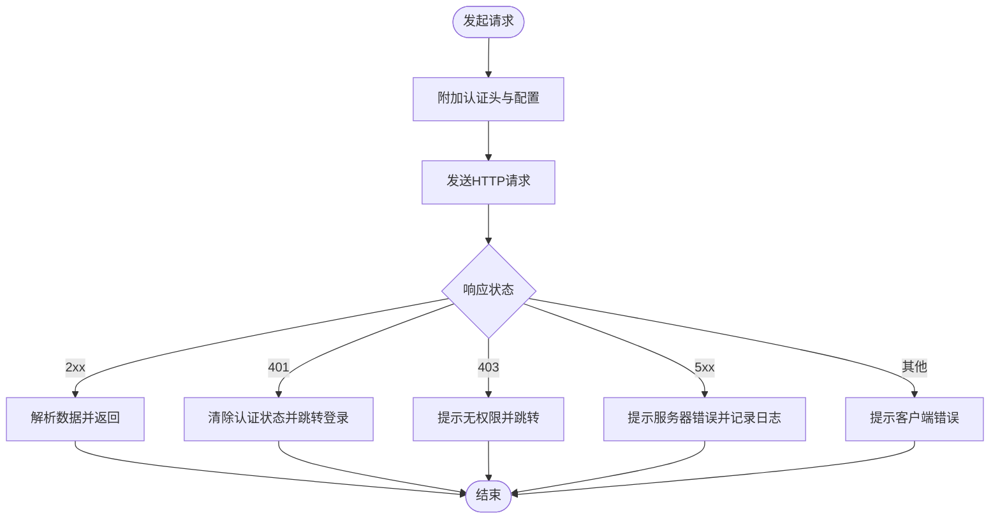
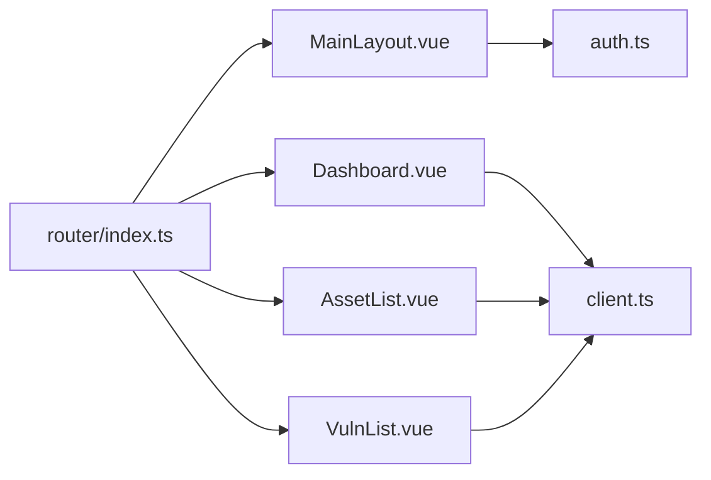

# 页面组件结构

<cite>
**本文引用的文件**   
- [frontend/src/App.vue](file://frontend/src/App.vue)
- [frontend/src/main.ts](file://frontend/src/main.ts)
- [frontend/src/router/index.ts](file://frontend/src/router/index.ts)
- [frontend/src/layouts/MainLayout.vue](file://frontend/src/layouts/MainLayout.vue)
- [frontend/src/views/Dashboard.vue](file://frontend/src/views/Dashboard.vue)
- [frontend/src/views/AssetList.vue](file://frontend/src/views/AssetList.vue)
- [frontend/src/views/VulnList.vue](file://frontend/src/views/VulnList.vue)
- [frontend/src/api/client.ts](file://frontend/src/api/client.ts)
- [frontend/src/stores/auth.ts](file://frontend/src/stores/auth.ts)
</cite>

## 目录
1. [简介](#简介)
2. [项目结构](#项目结构)
3. [核心组件](#核心组件)
4. [架构总览](#架构总览)
5. [详细组件分析](#详细组件分析)
6. [依赖分析](#依赖分析)
7. [性能考虑](#性能考虑)
8. [故障排查指南](#故障排查指南)
9. [结论](#结论)
10. [附录](#附录)

## 简介
本文件面向Talos前端（基于Vue3）的页面级组件结构与布局架构，重点说明：
- 页面组织方式与路由配置
- 主布局MainLayout的结构与导航实现
- 核心业务页面Dashboard、AssetList、VulnList的数据获取、状态管理与交互逻辑
- 权限控制与错误处理机制
- 页面间数据传递与通信的最佳实践

## 项目结构
前端采用按功能域划分的目录组织：
- src/api：HTTP客户端封装与接口调用
- src/components：可复用UI组件（如表单对话框、富文本编辑器等）
- src/layouts：应用级布局（主布局MainLayout）
- src/router：路由定义与守卫
- src/stores：全局状态管理（如认证状态）
- src/views：页面级视图组件（仪表盘、资产列表、漏洞管理等）
- src/utils：工具函数与常量

图表来源
- [frontend/src/App.vue](file://frontend/src/App.vue)
- [frontend/src/main.ts](file://frontend/src/main.ts)
- [frontend/src/router/index.ts](file://frontend/src/router/index.ts)
- [frontend/src/layouts/MainLayout.vue](file://frontend/src/layouts/MainLayout.vue)
- [frontend/src/views/Dashboard.vue](file://frontend/src/views/Dashboard.vue)
- [frontend/src/views/AssetList.vue](file://frontend/src/views/AssetList.vue)
- [frontend/src/views/VulnList.vue](file://frontend/src/views/VulnList.vue)
- [frontend/src/api/client.ts](file://frontend/src/api/client.ts)
- [frontend/src/stores/auth.ts](file://frontend/src/stores/auth.ts)

章节来源
- [frontend/src/App.vue](file://frontend/src/App.vue)
- [frontend/src/main.ts](file://frontend/src/main.ts)
- [frontend/src/router/index.ts](file://frontend/src/router/index.ts)
- [frontend/src/layouts/MainLayout.vue](file://frontend/src/layouts/MainLayout.vue)
- [frontend/src/views/Dashboard.vue](file://frontend/src/views/Dashboard.vue)
- [frontend/src/views/AssetList.vue](file://frontend/src/views/AssetList.vue)
- [frontend/src/views/VulnList.vue](file://frontend/src/views/VulnList.vue)
- [frontend/src/api/client.ts](file://frontend/src/api/client.ts)
- [frontend/src/stores/auth.ts](file://frontend/src/stores/auth.ts)

## 核心组件
- App.vue：应用根组件，挂载路由与全局样式
- main.ts：初始化Vue应用、注册插件与全局配置
- router/index.ts：集中式路由表、导航守卫与权限控制
- layouts/MainLayout.vue：主布局容器，包含侧边栏、顶部导航、内容区与页脚
- views/*：页面级组件，承载具体业务视图与交互
- api/client.ts：统一的HTTP客户端封装（请求拦截、响应拦截、错误处理）
- stores/auth.ts：认证状态管理（登录态、用户信息、权限）

章节来源
- [frontend/src/App.vue](file://frontend/src/App.vue)
- [frontend/src/main.ts](file://frontend/src/main.ts)
- [frontend/src/router/index.ts](file://frontend/src/router/index.ts)
- [frontend/src/layouts/MainLayout.vue](file://frontend/src/layouts/MainLayout.vue)
- [frontend/src/views/Dashboard.vue](file://frontend/src/views/Dashboard.vue)
- [frontend/src/views/AssetList.vue](file://frontend/src/views/AssetList.vue)
- [frontend/src/views/VulnList.vue](file://frontend/src/views/VulnList.vue)
- [frontend/src/api/client.ts](file://frontend/src/api/client.ts)
- [frontend/src/stores/auth.ts](file://frontend/src/stores/auth.ts)

## 架构总览
整体采用“布局 + 视图 + API客户端 + 状态管理”的分层架构。路由驱动视图渲染，视图通过API客户端与后端交互，状态管理统一维护认证与跨页面共享数据。

图表来源
- [frontend/src/App.vue](file://frontend/src/App.vue)
- [frontend/src/main.ts](file://frontend/src/main.ts)
- [frontend/src/router/index.ts](file://frontend/src/router/index.ts)
- [frontend/src/layouts/MainLayout.vue](file://frontend/src/layouts/MainLayout.vue)
- [frontend/src/views/Dashboard.vue](file://frontend/src/views/Dashboard.vue)
- [frontend/src/views/AssetList.vue](file://frontend/src/views/AssetList.vue)
- [frontend/src/views/VulnList.vue](file://frontend/src/views/VulnList.vue)
- [frontend/src/api/client.ts](file://frontend/src/api/client.ts)
- [frontend/src/stores/auth.ts](file://frontend/src/stores/auth.ts)

## 详细组件分析

### 主布局 MainLayout
- 职责：提供应用壳结构（侧边栏、头部、内容区、页脚），承载路由出口与全局导航
- 导航实现：侧边栏菜单与路由联动，支持高亮当前路由；头部展示用户信息与退出操作
- 权限控制：根据认证状态与角色动态显示菜单项或隐藏受限路由
- 错误处理：未登录重定向到登录页；无权限跳转至403；未知路由跳转至404

图表来源
- [frontend/src/layouts/MainLayout.vue](file://frontend/src/layouts/MainLayout.vue)
- [frontend/src/router/index.ts](file://frontend/src/router/index.ts)
- [frontend/src/stores/auth.ts](file://frontend/src/stores/auth.ts)

章节来源
- [frontend/src/layouts/MainLayout.vue](file://frontend/src/layouts/MainLayout.vue)
- [frontend/src/router/index.ts](file://frontend/src/router/index.ts)
- [frontend/src/stores/auth.ts](file://frontend/src/stores/auth.ts)

### 仪表盘 Dashboard
- 职责：展示系统概览指标（如资产数量、漏洞统计、最近活动）
- 数据获取：在组件生命周期中发起聚合查询，使用API客户端拉取统计数据
- 状态管理：本地状态缓存最近一次数据，避免重复请求；失败时降级展示空状态
- 交互逻辑：支持下拉刷新、时间范围筛选、点击指标跳转详情

图表来源
- [frontend/src/views/Dashboard.vue](file://frontend/src/views/Dashboard.vue)
- [frontend/src/api/client.ts](file://frontend/src/api/client.ts)
- [frontend/src/stores/auth.ts](file://frontend/src/stores/auth.ts)

章节来源
- [frontend/src/views/Dashboard.vue](file://frontend/src/views/Dashboard.vue)
- [frontend/src/api/client.ts](file://frontend/src/api/client.ts)
- [frontend/src/stores/auth.ts](file://frontend/src/stores/auth.ts)

### 资产列表 AssetList
- 职责：资产数据的分页列表、搜索过滤、批量操作与导出
- 数据获取：分页参数化请求，支持关键词搜索、分类筛选、排序
- 状态管理：分页、筛选条件、选中行、加载态与错误态统一管理
- 交互逻辑：新增/编辑资产通过弹窗组件；删除确认；批量导入预览

图表来源
- [frontend/src/views/AssetList.vue](file://frontend/src/views/AssetList.vue)
- [frontend/src/api/client.ts](file://frontend/src/api/client.ts)

章节来源
- [frontend/src/views/AssetList.vue](file://frontend/src/views/AssetList.vue)
- [frontend/src/api/client.ts](file://frontend/src/api/client.ts)

### 漏洞管理 VulnList
- 职责：漏洞条目列表、详情查看、编辑与处置流程
- 数据获取：列表分页与筛选；详情单条查询；编辑提交变更
- 状态管理：列表状态、详情缓存、编辑草稿与校验结果
- 交互逻辑：从列表跳转到详情；详情页内触发编辑；处置动作（标记修复、忽略、升级）

图表来源
- [frontend/src/views/VulnList.vue](file://frontend/src/views/VulnList.vue)
- [frontend/src/api/client.ts](file://frontend/src/api/client.ts)

章节来源
- [frontend/src/views/VulnList.vue](file://frontend/src/views/VulnList.vue)
- [frontend/src/api/client.ts](file://frontend/src/api/client.ts)

### 路由配置与权限控制
- 路由表：集中定义所有页面路由与元信息（标题、图标、是否需要登录、角色权限）
- 导航守卫：在进入路由前检查认证状态与权限，未授权则重定向到登录或403
- 懒加载：视图组件按需加载，提升首屏性能

图表来源
- [frontend/src/router/index.ts](file://frontend/src/router/index.ts)
- [frontend/src/stores/auth.ts](file://frontend/src/stores/auth.ts)

章节来源
- [frontend/src/router/index.ts](file://frontend/src/router/index.ts)
- [frontend/src/stores/auth.ts](file://frontend/src/stores/auth.ts)

### 错误处理机制
- 请求拦截：统一添加认证头、超时设置、重试策略
- 响应拦截：解析后端错误码，转换为前端友好提示；对401自动登出并重定向
- 组件级错误：捕获异步异常，展示错误边界与重试入口；空数据降级展示占位

图表来源
- [frontend/src/api/client.ts](file://frontend/src/api/client.ts)
- [frontend/src/stores/auth.ts](file://frontend/src/stores/auth.ts)

章节来源
- [frontend/src/api/client.ts](file://frontend/src/api/client.ts)
- [frontend/src/stores/auth.ts](file://frontend/src/stores/auth.ts)

### 页面间数据传递与通信最佳实践
- 路由传参：通过query或params传递轻量标识（如ID、筛选条件）
- 全局状态：使用store管理认证、主题、语言等跨页面共享数据
- 事件总线：小范围组件通信可使用事件总线或provide/inject
- 表单与弹窗：父组件持有表单状态，子组件仅负责展示与回调
- 列表与详情：列表页保持筛选与分页状态，详情页只读展示与编辑提交

章节来源
- [frontend/src/stores/auth.ts](file://frontend/src/stores/auth.ts)
- [frontend/src/router/index.ts](file://frontend/src/router/index.ts)
- [frontend/src/views/AssetList.vue](file://frontend/src/views/AssetList.vue)
- [frontend/src/views/VulnList.vue](file://frontend/src/views/VulnList.vue)

## 依赖分析
- 组件耦合度：视图组件依赖API客户端与状态管理，布局组件依赖路由与认证状态
- 外部依赖：HTTP客户端封装、路由库、状态管理库
- 循环依赖：避免在视图与API之间直接相互引用，通过store或事件解耦

图表来源
- [frontend/src/views/Dashboard.vue](file://frontend/src/views/Dashboard.vue)
- [frontend/src/views/AssetList.vue](file://frontend/src/views/AssetList.vue)
- [frontend/src/views/VulnList.vue](file://frontend/src/views/VulnList.vue)
- [frontend/src/layouts/MainLayout.vue](file://frontend/src/layouts/MainLayout.vue)
- [frontend/src/router/index.ts](file://frontend/src/router/index.ts)
- [frontend/src/api/client.ts](file://frontend/src/api/client.ts)
- [frontend/src/stores/auth.ts](file://frontend/src/stores/auth.ts)

章节来源
- [frontend/src/views/Dashboard.vue](file://frontend/src/views/Dashboard.vue)
- [frontend/src/views/AssetList.vue](file://frontend/src/views/AssetList.vue)
- [frontend/src/views/VulnList.vue](file://frontend/src/views/VulnList.vue)
- [frontend/src/layouts/MainLayout.vue](file://frontend/src/layouts/MainLayout.vue)
- [frontend/src/router/index.ts](file://frontend/src/router/index.ts)
- [frontend/src/api/client.ts](file://frontend/src/api/client.ts)
- [frontend/src/stores/auth.ts](file://frontend/src/stores/auth.ts)

## 性能考虑
- 路由懒加载：视图组件按需加载，减少初始包体积
- 数据缓存：对频繁访问的静态或半静态数据做本地缓存与失效策略
- 请求优化：合并请求、去抖与节流、分页与增量更新
- UI渲染：虚拟列表与分页避免大量DOM节点；图表按需渲染与销毁

[本节为通用指导，不直接分析具体文件]

## 故障排查指南
- 登录问题：检查认证状态与令牌有效性；确认导航守卫是否正确重定向
- 权限问题：核对路由元信息与用户角色；确认菜单项权限过滤
- 网络错误：查看请求拦截器与响应拦截器日志；检查后端返回的错误码
- 页面空白：检查路由匹配与组件加载；确认错误边界与占位逻辑
- 数据不一致：检查本地状态与后端数据同步；确认缓存失效与刷新时机

章节来源
- [frontend/src/router/index.ts](file://frontend/src/router/index.ts)
- [frontend/src/api/client.ts](file://frontend/src/api/client.ts)
- [frontend/src/stores/auth.ts](file://frontend/src/stores/auth.ts)

## 结论
Talos前端采用清晰的布局与视图分层，结合集中式路由与状态管理，实现了可扩展、易维护的页面组件结构。通过统一的API客户端与错误处理机制，提升了稳定性与用户体验。建议在后续迭代中继续强化数据缓存、懒加载与错误边界，以进一步优化性能与健壮性。

[本节为总结性内容，不直接分析具体文件]

## 附录
- 术语说明
  - 视图组件：页面级组件，承载具体业务场景
  - 布局组件：应用壳结构，提供导航与页面框架
  - 状态管理：跨组件共享的状态存储与更新机制
  - 路由守卫：在进入路由前进行鉴权与跳转控制

[本节为概念性内容，不直接分析具体文件]