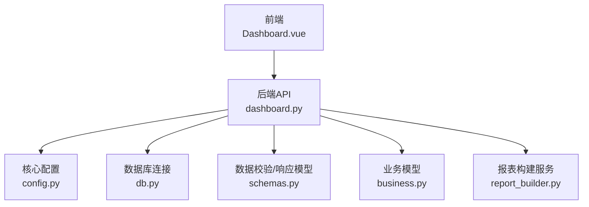
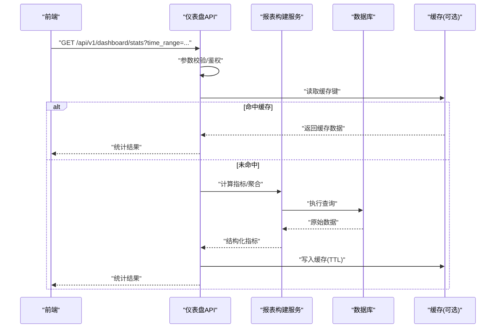
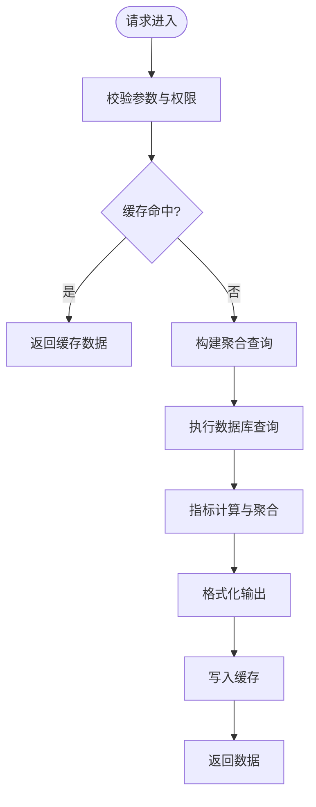
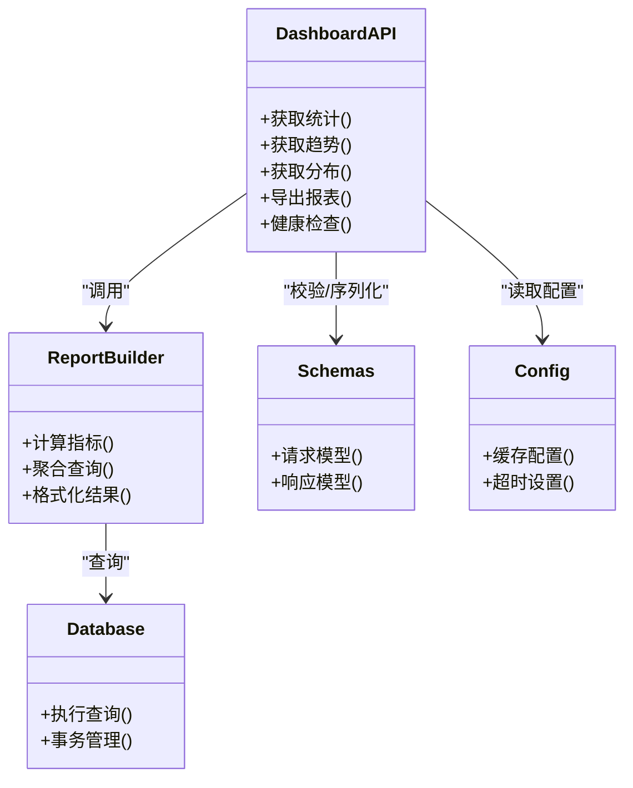

# 仪表盘分析API

<cite>
**本文引用的文件**   
- [backend/app/api/v1/dashboard.py](file://backend/app/api/v1/dashboard.py)
- [backend/app/main.py](file://backend/app/main.py)
- [backend/app/core/config.py](file://backend/app/core/config.py)
- [backend/app/db.py](file://backend/app/db.py)
- [backend/app/schemas.py](file://backend/app/schemas.py)
- [backend/app/models/business.py](file://backend/app/models/business.py)
- [backend/app/services/report_builder.py](file://backend/app/services/report_builder.py)
- [frontend/src/views/Dashboard.vue](file://frontend/src/views/Dashboard.vue)
- [frontend/src/api/client.ts](file://frontend/src/api/client.ts)
</cite>

## 目录
1. [简介](#简介)
2. [项目结构](#项目结构)
3. [核心组件](#核心组件)
4. [架构总览](#架构总览)
5. [详细组件分析](#详细组件分析)
6. [依赖关系分析](#依赖关系分析)
7. [性能考量](#性能考量)
8. [故障排查指南](#故障排查指南)
9. [结论](#结论)
10. [附录](#附录)

## 简介
本文件面向Talos项目的“仪表盘分析API”，聚焦数据统计与分析接口，涵盖关键指标计算、可视化数据提供、实时数据更新与缓存机制、筛选条件与聚合查询、性能监控与系统状态查询，以及完整的API调用示例。文档力求在技术细节与可读性之间取得平衡，帮助开发者快速理解并高效使用相关能力。

## 项目结构
后端采用FastAPI框架组织API路由，仪表盘相关接口位于v1版本下；前端通过Vue页面发起请求，使用统一的HTTP客户端封装。数据库访问由db模块管理，配置集中在core.config中，数据模型定义于models，业务服务层包含报表构建等逻辑。

图表来源 
- [backend/app/api/v1/dashboard.py](file://backend/app/api/v1/dashboard.py)
- [backend/app/main.py](file://backend/app/main.py)
- [backend/app/core/config.py](file://backend/app/core/config.py)
- [backend/app/db.py](file://backend/app/db.py)
- [backend/app/schemas.py](file://backend/app/schemas.py)
- [backend/app/models/business.py](file://backend/app/models/business.py)
- [backend/app/services/report_builder.py](file://backend/app/services/report_builder.py)

章节来源
- [backend/app/main.py](file://backend/app/main.py)
- [backend/app/api/v1/dashboard.py](file://backend/app/api/v1/dashboard.py)
- [frontend/src/views/Dashboard.vue](file://frontend/src/views/Dashboard.vue)
- [frontend/src/api/client.ts](file://frontend/src/api/client.ts)

## 核心组件
- 仪表盘API路由：提供统计概览、趋势、分布、明细列表、导出等端点，支持时间范围、资产类型、漏洞等级等多维筛选与聚合。
- 数据模型与Schema：定义输入参数校验与输出数据结构，确保前后端契约一致。
- 数据库访问层：统一会话管理与查询执行，支撑高并发读取。
- 报表构建服务：封装复杂聚合与指标计算逻辑，便于复用与测试。
- 前端集成：Dashboard页面按时间维度轮询或增量拉取数据，结合缓存策略降低服务端压力。

章节来源
- [backend/app/api/v1/dashboard.py](file://backend/app/api/v1/dashboard.py)
- [backend/app/schemas.py](file://backend/app/schemas.py)
- [backend/app/db.py](file://backend/app/db.py)
- [backend/app/models/business.py](file://backend/app/models/business.py)
- [backend/app/services/report_builder.py](file://backend/app/services/report_builder.py)

## 架构总览
仪表盘分析API遵循“控制器-服务-数据”分层模式。前端通过REST接口获取统计数据，后端在控制器层完成参数校验与权限控制，服务层负责指标计算与聚合，数据层负责持久化查询。缓存层（如Redis）可选用于热点数据加速。

图表来源 
- [backend/app/api/v1/dashboard.py](file://backend/app/api/v1/dashboard.py)
- [backend/app/services/report_builder.py](file://backend/app/services/report_builder.py)
- [backend/app/db.py](file://backend/app/db.py)

## 详细组件分析

### 仪表盘统计接口（概览与趋势）
- 功能说明：提供总体统计（如资产总数、漏洞数、修复率）、趋势数据（按日/周/月聚合）、分布（按等级/类型）。
- 筛选条件：时间范围、资产分类、漏洞等级、标签、状态等。
- 聚合方式：COUNT/SUM/AVG/GROUP BY/HAVING等，支持多字段分组与排序。
- 精度与频率：数值型指标保留两位小数；趋势数据默认按天聚合，可按配置调整粒度。
- 缓存策略：热点统计结果缓存TTL可配置，避免重复计算。

图表来源 
- [backend/app/api/v1/dashboard.py](file://backend/app/api/v1/dashboard.py)
- [backend/app/services/report_builder.py](file://backend/app/services/report_builder.py)
- [backend/app/db.py](file://backend/app/db.py)

章节来源
- [backend/app/api/v1/dashboard.py](file://backend/app/api/v1/dashboard.py)
- [backend/app/services/report_builder.py](file://backend/app/services/report_builder.py)

### 明细列表与分页
- 功能说明：返回满足筛选条件的实体列表，支持分页、排序、字段选择。
- 筛选条件：关键字搜索、时间范围、状态、等级、标签等。
- 性能优化：索引覆盖查询字段，限制返回字段，避免N+1查询。

章节来源
- [backend/app/api/v1/dashboard.py](file://backend/app/api/v1/dashboard.py)
- [backend/app/db.py](file://backend/app/db.py)

### 导出与报表生成
- 功能说明：将统计数据导出为CSV/Excel或生成PDF报表。
- 触发方式：异步任务队列处理大体积导出，前端轮询任务状态。
- 数据一致性：导出快照基于事务时间点，保证一致性。

章节来源
- [backend/app/api/v1/dashboard.py](file://backend/app/api/v1/dashboard.py)
- [backend/app/services/report_builder.py](file://backend/app/services/report_builder.py)

### 实时数据更新与缓存机制
- 实时更新：支持WebSocket推送或短轮询（SSE/Polling），根据配置选择。
- 缓存策略：多级缓存（内存+分布式缓存），热点键优先；失效策略包括TTL与主动失效。
- 一致性保障：写操作后失效相关缓存键，读路径优先命中缓存。

章节来源
- [backend/app/api/v1/dashboard.py](file://backend/app/api/v1/dashboard.py)
- [backend/app/core/config.py](file://backend/app/core/config.py)

### 性能监控与系统状态查询
- 监控指标：QPS、延迟分位、错误率、缓存命中率、数据库慢查询。
- 系统状态：健康检查、依赖服务可用性、资源使用率。
- 暴露方式：独立健康与监控端点，供运维平台采集。

章节来源
- [backend/app/api/v1/dashboard.py](file://backend/app/api/v1/dashboard.py)
- [backend/app/core/config.py](file://backend/app/core/config.py)

### 前端集成与调用示例
- 调用流程：Dashboard页面初始化时拉取概览与趋势，用户切换筛选条件后重新请求；支持增量更新。
- 客户端封装：统一拦截器处理鉴权、重试、错误提示；请求体与响应体遵循schemas定义。
- 典型场景：
  - 按时间范围查看漏洞趋势
  - 按资产类型统计修复率
  - 导出某时间段的风险报告

章节来源
- [frontend/src/views/Dashboard.vue](file://frontend/src/views/Dashboard.vue)
- [frontend/src/api/client.ts](file://frontend/src/api/client.ts)

## 依赖关系分析
- 控制器依赖服务层进行指标计算，服务层依赖数据模型与数据库访问层。
- Schema用于输入校验与输出序列化，确保契约稳定。
- 配置模块集中管理缓存、超时、分页大小等参数。

图表来源 
- [backend/app/api/v1/dashboard.py](file://backend/app/api/v1/dashboard.py)
- [backend/app/services/report_builder.py](file://backend/app/services/report_builder.py)
- [backend/app/db.py](file://backend/app/db.py)
- [backend/app/schemas.py](file://backend/app/schemas.py)
- [backend/app/core/config.py](file://backend/app/core/config.py)

章节来源
- [backend/app/api/v1/dashboard.py](file://backend/app/api/v1/dashboard.py)
- [backend/app/services/report_builder.py](file://backend/app/services/report_builder.py)
- [backend/app/db.py](file://backend/app/db.py)
- [backend/app/schemas.py](file://backend/app/schemas.py)
- [backend/app/core/config.py](file://backend/app/core/config.py)

## 性能考量
- 查询优化：合理使用索引、投影字段、分页游标，避免全表扫描。
- 缓存命中：热点统计结果缓存TTL合理设置，减少重复计算。
- 异步处理：大体积导出与复杂计算走异步队列，避免阻塞主线程。
- 限流与熔断：对高频接口实施限流，保护下游依赖。
- 监控告警：关键指标异常阈值告警，快速定位瓶颈。

## 故障排查指南
- 常见问题：
  - 参数校验失败：检查时间格式、枚举值、必填项。
  - 缓存未命中：确认缓存键生成规则与服务端缓存状态。
  - 数据库慢查询：启用慢查询日志，分析执行计划。
  - 导出失败：检查磁盘空间、模板渲染、队列消费状态。
- 诊断步骤：
  - 查看接口日志与错误堆栈
  - 检查缓存命中率与TTL
  - 验证数据库索引与查询语句
  - 核对前端请求参数与后端Schema约束

章节来源
- [backend/app/api/v1/dashboard.py](file://backend/app/api/v1/dashboard.py)
- [backend/app/core/config.py](file://backend/app/core/config.py)

## 结论
仪表盘分析API以清晰的分层架构与完善的缓存策略，提供了高效、稳定的数据统计与分析能力。通过灵活的筛选与聚合、可靠的导出与监控，能够满足多样化的业务场景。建议在生产环境完善监控与告警，持续优化查询与缓存策略，提升整体性能与稳定性。

## 附录
- 常用筛选字段：时间范围、资产类型、漏洞等级、标签、状态、关键字。
- 指标精度：数值型保留两位小数，百分比保留一位小数。
- 更新频率：趋势数据默认按天聚合，可按配置调整为小时/周/月。
- 健康检查：/health与/metrics端点用于系统状态与监控数据采集。