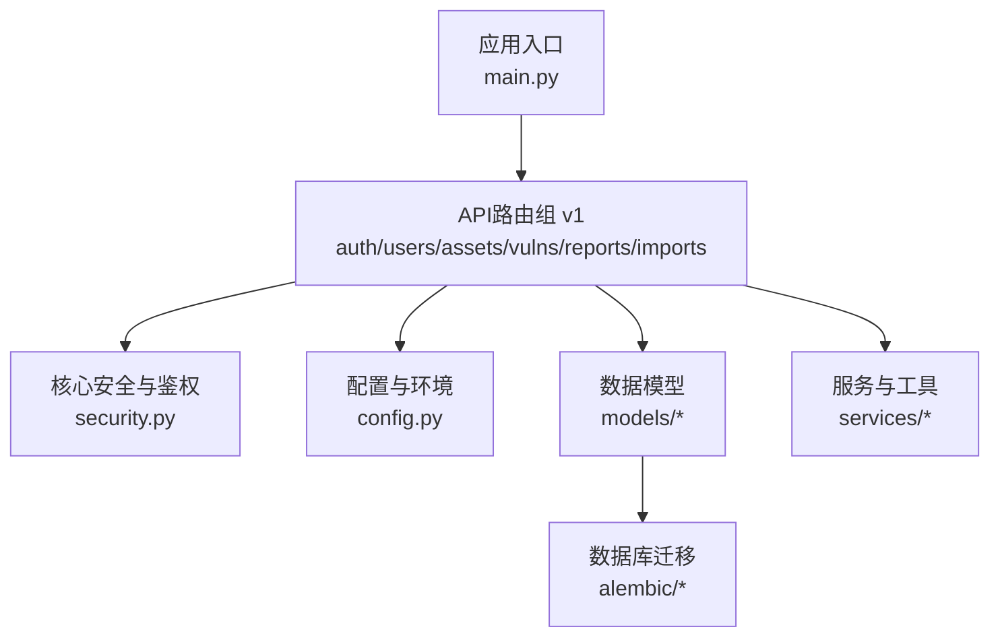
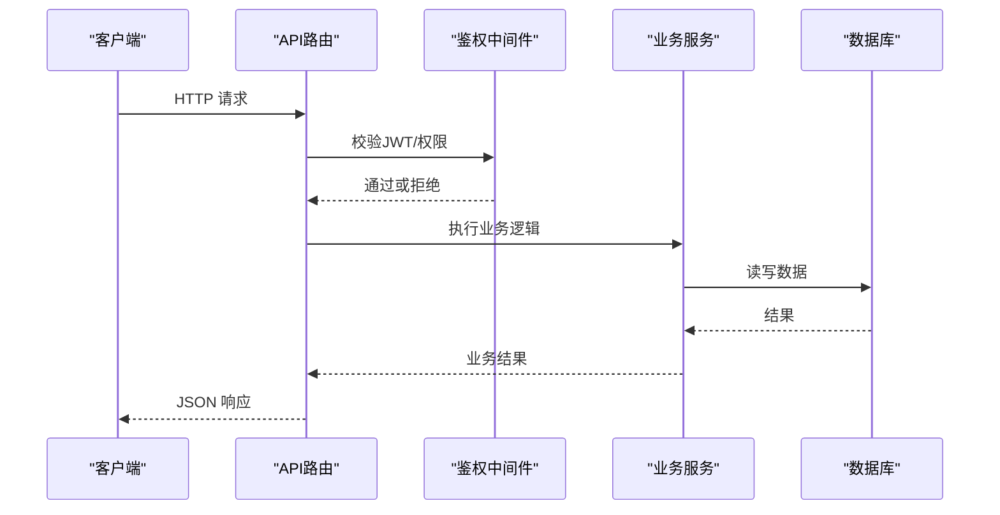
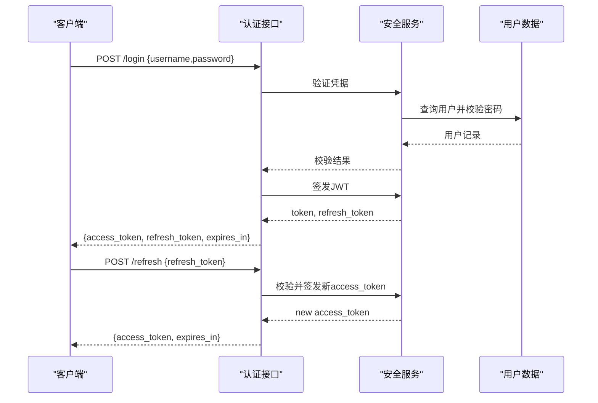
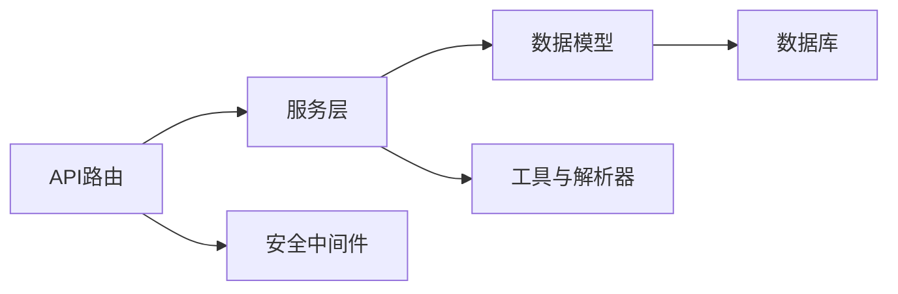

# 后端API文档

<cite>
**本文档引用的文件**   
- [backend/app/main.py](file://backend/app/main.py)
- [backend/app/api/v1/auth.py](file://backend/app/api/v1/auth.py)
- [backend/app/api/v1/users.py](file://backend/app/api/v1/users.py)
- [backend/app/api/v1/assets.py](file://backend/app/api/v1/assets.py)
- [backend/app/api/v1/vulns.py](file://backend/app/api/v1/vulns.py)
- [backend/app/api/v1/reports.py](file://backend/app/api/v1/reports.py)
- [backend/app/api/v1/imports.py](file://backend/app/api/v1/imports.py)
- [backend/app/core/security.py](file://backend/app/core/security.py)
- [backend/app/core/config.py](file://backend/app/core/config.py)
- [backend/app/models/user.py](file://backend/app/models/user.py)
- [backend/app/schemas.py](file://backend/app/schemas.py)
</cite>

## 目录
1. [简介](#简介)
2. [项目结构](#项目结构)
3. [核心组件](#核心组件)
4. [架构总览](#架构总览)
5. [详细组件分析](#详细组件分析)
6. [依赖关系分析](#依赖关系分析)
7. [性能考虑](#性能考虑)
8. [故障排查指南](#故障排查指南)
9. [结论](#结论)
10. [附录](#附录)

## 简介
本文件为Talos后端RESTful API的完整技术文档，覆盖认证、用户管理、资产管理、漏洞管理、报告生成与导入导出等能力。文档面向开发者与集成方，提供端点说明、请求/响应示例、错误码约定、最佳实践与常见问题排查建议。

## 项目结构
后端采用模块化分层设计：
- API路由层：按功能划分模块（auth、users、assets、vulns、reports、imports等）
- 核心服务层：安全、配置、依赖注入等
- 数据模型层：数据库模型与业务实体
- 服务与工具层：报告构建、导出、解析等
- 入口与装配：应用启动、中间件挂载、路由注册

图表来源
- [backend/app/main.py](file://backend/app/main.py)
- [backend/app/api/v1/auth.py](file://backend/app/api/v1/auth.py)
- [backend/app/core/security.py](file://backend/app/core/security.py)
- [backend/app/core/config.py](file://backend/app/core/config.py)

章节来源
- [backend/app/main.py](file://backend/app/main.py)
- [backend/app/core/config.py](file://backend/app/core/config.py)

## 核心组件
- 认证与安全
  - JWT令牌签发、刷新与校验
  - 基于角色的访问控制（RBAC）
  - 密码哈希与敏感信息保护
- 用户管理
  - 用户注册、登录、登出、状态查询
  - 角色与权限分配
- 资产管理
  - 资产CRUD、分类管理、批量导入导出
- 漏洞管理
  - 漏洞录入、状态跟踪、关联分析
- 报告生成
  - 模板渲染、导出格式选择、异步任务
- 导入服务
  - 多格式解析、预览与确认提交

章节来源
- [backend/app/core/security.py](file://backend/app/core/security.py)
- [backend/app/core/config.py](file://backend/app/core/config.py)
- [backend/app/models/user.py](file://backend/app/models/user.py)
- [backend/app/schemas.py](file://backend/app/schemas.py)

## 架构总览
整体调用链遵循“请求进入 -> 路由分发 -> 鉴权中间件 -> 控制器处理 -> 服务层逻辑 -> 数据持久化 -> 响应返回”的标准模式。

图表来源
- [backend/app/main.py](file://backend/app/main.py)
- [backend/app/core/security.py](file://backend/app/core/security.py)

## 详细组件分析

### 认证API（JWT）
- 端点概览
  - POST /api/v1/auth/login：获取访问令牌
  - POST /api/v1/auth/refresh：刷新访问令牌
  - POST /api/v1/auth/logout：注销会话
  - GET /api/v1/auth/me：当前用户信息
- 请求参数
  - login：用户名/邮箱、密码
  - refresh：刷新令牌
  - logout：无（需携带有效访问令牌）
  - me：无（需携带有效访问令牌）
- 响应格式
  - 成功：包含访问令牌、刷新令牌、过期时间、用户基本信息
  - 失败：标准错误体，含错误码与消息
- 错误码
  - 401：未认证或令牌无效
  - 403：权限不足
  - 400：参数校验失败
  - 500：服务器内部错误
- 安全要点
  - 令牌有效期与刷新策略
  - 密码存储使用强哈希算法
  - 敏感头与跨域设置由配置中心统一管控

章节来源
- [backend/app/api/v1/auth.py](file://backend/app/api/v1/auth.py)
- [backend/app/core/security.py](file://backend/app/core/security.py)
- [backend/app/core/config.py](file://backend/app/core/config.py)

#### 认证流程时序图

图表来源
- [backend/app/api/v1/auth.py](file://backend/app/api/v1/auth.py)
- [backend/app/core/security.py](file://backend/app/core/security.py)

### 用户管理API
- 端点概览
  - POST /api/v1/users/register：用户注册
  - POST /api/v1/users/login：用户登录（若与认证分离）
  - GET /api/v1/users/{id}：获取用户详情
  - PUT /api/v1/users/{id}：更新用户信息
  - DELETE /api/v1/users/{id}：删除用户
  - GET /api/v1/users：分页列表
  - PATCH /api/v1/users/{id}/roles：分配角色
- 权限控制
  - 管理员可创建、修改、删除用户与分配角色
  - 普通用户仅能查看自身信息
- 请求参数
  - register：用户名、邮箱、密码、可选角色
  - update：字段增量更新
  - roles：角色集合
- 响应格式
  - 成功：返回用户对象或操作结果
  - 失败：标准错误体
- 错误码
  - 400：参数校验失败
  - 401：未认证
  - 403：权限不足
  - 404：用户不存在
  - 409：资源冲突（如重复邮箱）
  - 500：服务器错误

章节来源
- [backend/app/api/v1/users.py](file://backend/app/api/v1/users.py)
- [backend/app/models/user.py](file://backend/app/models/user.py)
- [backend/app/schemas.py](file://backend/app/schemas.py)

### 资产管理API
- 端点概览
  - POST /api/v1/assets：创建资产
  - GET /api/v1/assets：分页列表（支持过滤、排序）
  - GET /api/v1/assets/{id}：获取资产详情
  - PUT /api/v1/assets/{id}：更新资产
  - DELETE /api/v1/assets/{id}：删除资产
  - POST /api/v1/assets/categories：创建分类
  - GET /api/v1/assets/categories：分类列表
  - PUT /api/v1/assets/categories/{id}：更新分类
  - DELETE /api/v1/assets/categories/{id}：删除分类
  - POST /api/v1/assets/import：批量导入
  - GET /api/v1/assets/export：批量导出
- 请求参数
  - 创建/更新：名称、类型、IP/域名、标签、分类ID、描述等
  - 导入：CSV/Excel文件、映射规则、去重策略
  - 导出：筛选条件、字段选择、格式（CSV/JSON）
- 响应格式
  - 成功：返回对象或分页结果；导入返回任务ID与进度
  - 失败：标准错误体
- 错误码
  - 400：参数校验失败
  - 401：未认证
  - 403：权限不足
  - 404：资产或分类不存在
  - 409：唯一性冲突
  - 422：导入数据格式错误
  - 500：服务器错误

章节来源
- [backend/app/api/v1/assets.py](file://backend/app/api/v1/assets.py)
- [backend/app/schemas.py](file://backend/app/schemas.py)

### 漏洞管理API
- 端点概览
  - POST /api/v1/vulns：录入漏洞
  - GET /api/v1/vulns：分页列表（支持按严重级别、状态、资产过滤）
  - GET /api/v1/vulns/{id}：漏洞详情
  - PUT /api/v1/vulns/{id}：更新漏洞状态与修复信息
  - DELETE /api/v1/vulns/{id}：删除漏洞
  - POST /api/v1/vulns/batch：批量操作（状态变更、指派）
  - GET /api/v1/vulns/{id}/associations：关联分析（资产、扫描任务、修复记录）
- 请求参数
  - 录入：标题、描述、严重级别、CVSS、受影响资产、复现步骤、修复建议
  - 更新：状态、修复版本、责任人、备注
  - 批量：操作类型、目标ID集合、参数
- 响应格式
  - 成功：返回对象或操作结果；关联分析返回结构化关系
  - 失败：标准错误体
- 错误码
  - 400：参数校验失败
  - 401：未认证
  - 403：权限不足
  - 404：漏洞不存在
  - 409：状态转换非法
  - 500：服务器错误

章节来源
- [backend/app/api/v1/vulns.py](file://backend/app/api/v1/vulns.py)
- [backend/app/services/vuln_service.py](file://backend/app/services/vuln_service.py)

### 报告生成API
- 端点概览
  - POST /api/v1/reports/generate：生成报告（同步/异步）
  - GET /api/v1/reports/{id}：查询报告状态与下载链接
  - GET /api/v1/reports/templates：模板列表
  - POST /api/v1/reports/templates：新增模板
  - PUT /api/v1/reports/templates/{id}：更新模板
  - DELETE /api/v1/reports/templates/{id}：删除模板
- 请求参数
  - 生成：报告名称、模板ID、范围（资产/漏洞/时间）、输出格式（PDF/DOCX/HTML）
  - 模板：名称、内容、变量定义、默认样式
- 响应格式
  - 成功：返回报告ID、状态、下载URL（完成后）
  - 失败：标准错误体
- 错误码
  - 400：参数校验失败
  - 401：未认证
  - 403：权限不足
  - 404：模板或报告不存在
  - 422：模板渲染失败
  - 500：服务器错误

章节来源
- [backend/app/api/v1/reports.py](file://backend/app/api/v1/reports.py)
- [backend/app/services/report_builder.py](file://backend/app/services/report_builder.py)

### 导入服务API
- 端点概览
  - POST /api/v1/imports/upload：上传导入文件
  - GET /api/v1/imports/{id}/preview：预览导入数据
  - POST /api/v1/imports/{id}/confirm：确认并提交导入
  - GET /api/v1/imports/{id}/status：查询导入任务状态
- 请求参数
  - 上传：文件、类型（资产/漏洞）、映射规则
  - 预览：无需额外参数
  - 确认：字段映射、去重策略、忽略错误选项
- 响应格式
  - 成功：返回任务ID、预览数据、状态
  - 失败：标准错误体
- 错误码
  - 400：参数校验失败
  - 401：未认证
  - 403：权限不足
  - 404：任务不存在
  - 422：文件格式错误或映射不合法
  - 500：服务器错误

章节来源
- [backend/app/api/v1/imports.py](file://backend/app/api/v1/imports.py)
- [backend/app/services/docx_parser.py](file://backend/app/services/docx_parser.py)

## 依赖关系分析
- 路由到服务：各API路由模块依赖对应的服务层进行业务编排
- 安全依赖：所有受保护端点依赖安全中间件进行JWT校验与权限检查
- 数据依赖：模型层与数据库驱动交互，迁移脚本维护Schema演进
- 外部依赖：导入解析器、报告构建器、导出器等工具模块

图表来源
- [backend/app/main.py](file://backend/app/main.py)
- [backend/app/core/security.py](file://backend/app/core/security.py)
- [backend/app/models/user.py](file://backend/app/models/user.py)

章节来源
- [backend/app/main.py](file://backend/app/main.py)
- [backend/app/core/security.py](file://backend/app/core/security.py)

## 性能考虑
- 分页与过滤：列表接口默认分页，避免全量拉取
- 缓存策略：对热点数据（如分类、模板）启用缓存
- 异步任务：大文件导入与报告生成走异步队列，前端轮询状态
- 索引优化：高频查询字段建立索引（如资产类型、漏洞严重级别）
- 连接池：数据库连接池大小与超时合理配置

[本节为通用指导，不直接分析具体文件]

## 故障排查指南
- 认证失败
  - 检查JWT是否过期、刷新流程是否正确
  - 核对服务端签名密钥与时区配置
- 权限不足
  - 确认用户角色与端点所需权限匹配
  - 检查中间件是否拦截了请求
- 导入失败
  - 检查文件格式与字段映射
  - 查看预览阶段的错误提示
- 报告生成失败
  - 检查模板变量与占位符
  - 查看渲染日志与依赖库版本

章节来源
- [backend/app/core/security.py](file://backend/app/core/security.py)
- [backend/app/api/v1/imports.py](file://backend/app/api/v1/imports.py)
- [backend/app/api/v1/reports.py](file://backend/app/api/v1/reports.py)

## 结论
Talos后端API以清晰的模块化设计与完善的安全机制为基础，提供用户、资产、漏洞、报告与导入导出的全链路能力。建议集成方严格遵循认证与权限规范，合理使用分页与异步任务，确保系统稳定与高效。

[本节为总结性内容，不直接分析具体文件]

## 附录

### 通用错误响应格式
- 结构
  - code：错误码
  - message：错误消息
  - details：附加信息（可选）
- 常见HTTP状态码
  - 200：成功
  - 400：参数错误
  - 401：未认证
  - 403：权限不足
  - 404：资源不存在
  - 409：冲突
  - 422：数据校验失败
  - 500：服务器错误

### 最佳实践
- 始终在请求头中携带Authorization: Bearer <token>
- 使用刷新令牌续期，避免频繁登录
- 列表接口务必使用分页与过滤参数
- 大文件导入与报告生成采用异步方式
- 对敏感字段进行脱敏与最小化传输

[本节为通用指导，不直接分析具体文件]