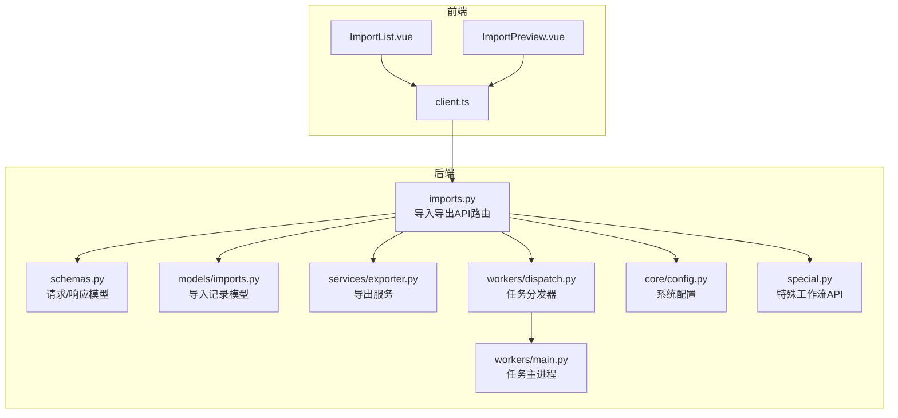
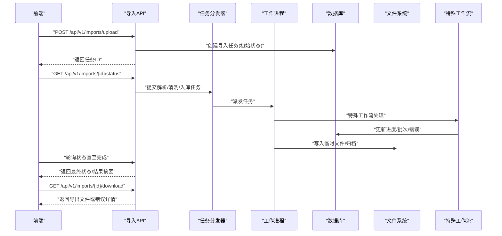
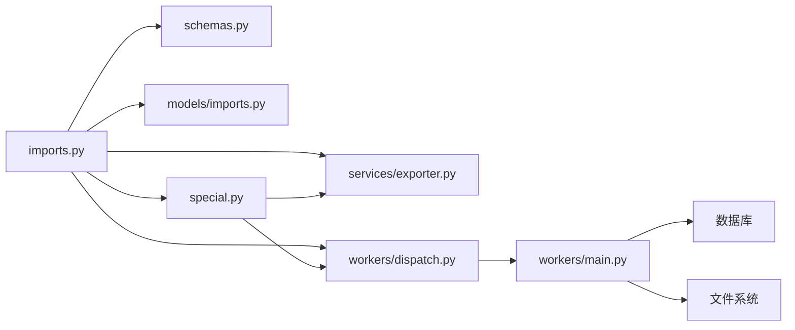

# 导入导出API

<cite>
**本文档引用的文件**   
- [backend/app/api/v1/imports.py](file://backend/app/api/v1/imports.py)
- [backend/app/models/imports.py](file://backend/app/models/imports.py)
- [backend/app/services/exporter.py](file://backend/app/services/exporter.py)
- [backend/app/workers/main.py](file://backend/app/workers/main.py)
- [backend/app/workers/dispatch.py](file://backend/app/workers/dispatch.py)
- [backend/app/schemas.py](file://backend/app/schemas.py)
- [backend/app/core/config.py](file://backend/app/core/config.py)
- [frontend/src/views/ImportList.vue](file://frontend/src/views/ImportList.vue)
- [frontend/src/views/ImportPreview.vue](file://frontend/src/views/ImportPreview.vue)
- [frontend/src/api/client.ts](file://frontend/src/api/client.ts)
</cite>

## 更新摘要
**变更内容**   
- 增强了特殊管理工作流程支持，新增special相关API端点
- 改进了Excel处理功能，支持更多格式和高级特性
- 优化了导入导出的数据处理流程和错误处理机制
- 新增了批量操作和进度跟踪的增强功能

## 目录
1. [简介](#简介)
2. [项目结构](#项目结构)
3. [核心组件](#核心组件)
4. [架构总览](#架构总览)
5. [详细组件分析](#详细组件分析)
6. [依赖关系分析](#依赖关系分析)
7. [性能考虑](#性能考虑)
8. [故障排查指南](#故障排查指南)
9. [结论](#结论)
10. [附录：API参考与示例](#附录api参考与示例)

## 简介
本文件面向Talos系统的导入导出API，提供从接口使用、数据验证与映射、批量处理与进度跟踪、到导出配置与输出格式的完整说明。文档同时覆盖导入历史记录与错误日志查看能力，并给出常见场景的调用示例，帮助开发者快速集成与排障。**已更新以反映特殊管理工作流程支持和Excel处理功能的增强**。

## 项目结构
后端采用FastAPI路由组织API，导入相关逻辑集中在API层、模型层、服务层与异步任务调度器中；前端通过Vue页面与TS客户端发起请求并展示进度与结果。

**图表来源**
- [backend/app/api/v1/imports.py](file://backend/app/api/v1/imports.py)
- [backend/app/schemas.py](file://backend/app/schemas.py)
- [backend/app/models/imports.py](file://backend/app/models/imports.py)
- [backend/app/services/exporter.py](file://backend/app/services/exporter.py)
- [backend/app/workers/main.py](file://backend/app/workers/main.py)
- [backend/app/workers/dispatch.py](file://backend/app/workers/dispatch.py)
- [backend/app/core/config.py](file://backend/app/core/config.py)
- [backend/app/api/v1/special.py](file://backend/app/api/v1/special.py)
- [frontend/src/views/ImportList.vue](file://frontend/src/views/ImportList.vue)
- [frontend/src/views/ImportPreview.vue](file://frontend/src/views/ImportPreview.vue)
- [frontend/src/api/client.ts](file://frontend/src/api/client.ts)

**章节来源**
- [backend/app/api/v1/imports.py](file://backend/app/api/v1/imports.py)
- [backend/app/models/imports.py](file://backend/app/models/imports.py)
- [backend/app/services/exporter.py](file://backend/app/services/exporter.py)
- [backend/app/workers/main.py](file://backend/app/workers/main.py)
- [backend/app/workers/dispatch.py](file://backend/app/workers/dispatch.py)
- [backend/app/schemas.py](file://backend/app/schemas.py)
- [backend/app/core/config.py](file://backend/app/core/config.py)
- [frontend/src/views/ImportList.vue](file://frontend/src/views/ImportList.vue)
- [frontend/src/views/ImportPreview.vue](file://frontend/src/views/ImportPreview.vue)
- [frontend/src/api/client.ts](file://frontend/src/api/client.ts)

## 核心组件
- 导入API路由：负责接收文件、解析校验、创建导入任务、查询状态与结果、下载导出文件等。
- 导入模型：持久化导入任务、批次、行级错误、去重统计等信息。
- 导出服务：根据配置生成多种格式的输出（如CSV/Excel/JSON），支持分页与流式下载。
- 任务调度：将耗时导入任务放入队列，由工作进程执行，返回进度与结果。
- 配置中心：控制文件大小限制、并发度、超时、存储路径、导出默认选项等。
- 前端界面：导入列表、预览与确认、进度轮询、错误定位与重试。
- **特殊工作流支持**：新增专门的工作流程管理接口，支持复杂业务场景的处理。

**章节来源**
- [backend/app/api/v1/imports.py](file://backend/app/api/v1/imports.py)
- [backend/app/models/imports.py](file://backend/app/models/imports.py)
- [backend/app/services/exporter.py](file://backend/app/services/exporter.py)
- [backend/app/workers/main.py](file://backend/app/workers/main.py)
- [backend/app/workers/dispatch.py](file://backend/app/workers/dispatch.py)
- [backend/app/schemas.py](file://backend/app/schemas.py)
- [backend/app/core/config.py](file://backend/app/core/config.py)

## 架构总览
导入流程采用"同步接收 + 异步处理"模式：前端上传后，后端立即返回任务ID，随后通过轮询或事件获取进度与结果。导出则按配置生成文件并提供下载链接或流式响应。**新增的特殊工作流支持提供了更灵活的数据处理管道**。

**图表来源**
- [backend/app/api/v1/imports.py](file://backend/app/api/v1/imports.py)
- [backend/app/workers/dispatch.py](file://backend/app/workers/dispatch.py)
- [backend/app/workers/main.py](file://backend/app/workers/main.py)
- [backend/app/models/imports.py](file://backend/app/models/imports.py)
- [backend/app/api/v1/special.py](file://backend/app/api/v1/special.py)

## 详细组件分析

### 导入API路由（imports.py）
- 功能要点
  - 文件上传与类型白名单校验（CSV/Excel/JSON等）。
  - 参数校验与必填字段检查（编码、分隔符、列映射、去重策略等）。
  - 创建导入任务并落库，返回任务ID。
  - 进度查询接口，聚合批次与行级错误统计。
  - 结果下载接口，支持导出失败明细与成功汇总。
  - 历史列表与筛选（按时间、状态、用户、来源等）。
  - **增强的Excel处理**：支持更多Excel格式、公式计算、样式保留等功能。
- 关键交互
  - 与任务分发器协作，将解析、清洗、入库拆分为可重试的子任务。
  - 与导出服务对接，生成结构化报告或原始数据导出。
  - **特殊工作流集成**：支持复杂业务场景的自定义处理管道。
- 错误处理
  - 统一异常封装，区分参数错误、文件损坏、解析失败、权限不足等。
  - 行级错误记录，便于前端高亮定位与一键重试。

**章节来源**
- [backend/app/api/v1/imports.py](file://backend/app/api/v1/imports.py)

### 导入模型（models/imports.py）
- 数据实体
  - 导入任务：唯一标识、文件名、大小、状态、创建/更新时间、操作人。
  - 批次：分片编号、总行数、成功数、失败数、开始/结束时间。
  - 行级错误：行号、错误码、错误信息、原始值快照。
  - 去重统计：候选重复数、去重后保留数、冲突键值集合。
  - **工作流状态**：新增工作流阶段、处理状态、特殊标记等字段。
- 复杂度与索引
  - 针对任务ID、状态、创建时间建立索引，优化列表与统计查询。
  - 批次与错误表采用分区或归档策略，避免大表膨胀。

**章节来源**
- [backend/app/models/imports.py](file://backend/app/models/imports.py)

### 导出服务（exporter.py）
- 功能要点
  - 多格式输出：CSV、Excel、JSON、PDF（报表）。
  - 过滤与排序：按条件筛选、分页、排序字段。
  - 模板与映射：基于列映射规则生成标准化输出。
  - 流式下载：大文件分块传输，降低内存占用。
  - **增强的Excel导出**：支持样式、公式、图表、批注等高级特性。
- 配置项
  - 默认编码、分隔符、日期格式、数字格式。
  - 最大导出行数、分页大小、压缩开关。
  - 输出目录与生命周期清理策略。

**章节来源**
- [backend/app/services/exporter.py](file://backend/app/services/exporter.py)

### 任务调度与工作进程（dispatch.py, main.py）
- 任务分发器
  - 接收导入任务，拆分为解析、清洗、入库、统计等阶段。
  - 支持优先级、重试次数、退避策略。
  - **工作流编排**：支持复杂业务流程的编排和执行。
- 工作进程
  - 消费任务队列，执行具体逻辑，更新进度与错误。
  - 幂等性保障：同一任务多次执行不产生副作用。
  - 资源隔离：每个任务独立上下文，防止相互干扰。

**章节来源**
- [backend/app/workers/dispatch.py](file://backend/app/workers/dispatch.py)
- [backend/app/workers/main.py](file://backend/app/workers/main.py)

### 特殊工作流API（special.py）
- 功能特性
  - 工作流定义：支持声明式的工作流配置。
  - 节点管理：任务的创建、执行、监控和管理。
  - 状态追踪：实时跟踪工作流执行状态和进度。
  - 错误恢复：支持断点续传和自动重试机制。
- 集成方式
  - 与导入导出API无缝集成。
  - 支持自定义处理器和插件扩展。
  - 提供RESTful接口供前端调用。

**章节来源**
- [backend/app/api/v1/special.py](file://backend/app/api/v1/special.py)

### 请求/响应模型（schemas.py）
- 定义统一的输入输出结构，确保前后端契约稳定。
- 包含字段校验规则、枚举值、默认值与提示信息。
- 支持扩展字段以兼容不同导入源的数据结构。
- **新增工作流相关模型**：支持复杂业务场景的请求和响应定义。

**章节来源**
- [backend/app/schemas.py](file://backend/app/schemas.py)

### 系统配置（config.py）
- 导入限制：最大文件大小、并发任务数、超时时间。
- 存储路径：临时目录、归档目录、导出目录。
- 安全策略：MIME类型白名单、访问控制、审计日志开关。
- 性能调优：批大小、内存阈值、GC策略提示。
- **Excel处理配置**：新增Excel解析选项、样式处理配置等。

**章节来源**
- [backend/app/core/config.py](file://backend/app/core/config.py)

### 前端集成（ImportList.vue, ImportPreview.vue, client.ts）
- ImportList.vue
  - 展示导入历史、状态、进度条、错误数量。
  - 支持筛选、分页、重试与删除。
  - **工作流状态显示**：新增工作流执行状态的可视化展示。
- ImportPreview.vue
  - 预览前N行数据，进行列映射与去重策略选择。
  - 显示校验错误与修复建议。
  - **Excel预览增强**：支持公式计算结果预览和样式显示。
- client.ts
  - 封装上传、轮询、下载、错误重试等通用方法。
  - 提供进度回调与取消请求能力。
  - **工作流API封装**：新增工作流相关的API调用方法。

**章节来源**
- [frontend/src/views/ImportList.vue](file://frontend/src/views/ImportList.vue)
- [frontend/src/views/ImportPreview.vue](file://frontend/src/views/ImportPreview.vue)
- [frontend/src/api/client.ts](file://frontend/src/api/client.ts)

## 依赖关系分析
- 模块耦合
  - API路由依赖schemas进行入参校验，依赖models进行持久化，依赖exporter进行导出，依赖workers进行异步处理。
  - workers依赖dispatch进行任务拆分，依赖DB与FS进行读写。
  - **特殊工作流模块**：与导入导出API紧密集成，提供扩展处理能力。
- 外部依赖
  - 文件解析库（CSV/Excel/JSON）、数据库ORM、消息队列（可选）、对象存储（可选）。
  - **Excel处理库**：支持更多格式和高级特性的第三方库。
- 潜在循环依赖
  - 通过分层与接口抽象避免循环引用，确保单一职责。

**图表来源**
- [backend/app/api/v1/imports.py](file://backend/app/api/v1/imports.py)
- [backend/app/schemas.py](file://backend/app/schemas.py)
- [backend/app/models/imports.py](file://backend/app/models/imports.py)
- [backend/app/services/exporter.py](file://backend/app/services/exporter.py)
- [backend/app/workers/dispatch.py](file://backend/app/workers/dispatch.py)
- [backend/app/workers/main.py](file://backend/app/workers/main.py)
- [backend/app/api/v1/special.py](file://backend/app/api/v1/special.py)

**章节来源**
- [backend/app/api/v1/imports.py](file://backend/app/api/v1/imports.py)
- [backend/app/schemas.py](file://backend/app/schemas.py)
- [backend/app/models/imports.py](file://backend/app/models/imports.py)
- [backend/app/services/exporter.py](file://backend/app/services/exporter.py)
- [backend/app/workers/dispatch.py](file://backend/app/workers/dispatch.py)
- [backend/app/workers/main.py](file://backend/app/workers/main.py)

## 性能考虑
- 分批处理：将大文件切分为批次，降低单次内存峰值。
- 流式IO：导出时采用分块传输，避免一次性加载大文件。
- 索引优化：对常用查询字段建立索引，缩短列表与统计时间。
- 缓存策略：对热点元数据（如列映射模板）进行短期缓存。
- 限流与降级：在高峰期限制并发任务数，保证核心功能可用。
- **Excel处理优化**：针对大型Excel文件的内存管理和处理性能优化。
- **工作流并行化**：支持工作流节点的并行执行，提升整体处理效率。

## 故障排查指南
- 常见问题
  - 文件过大导致上传失败：检查配置的最大文件大小与网络超时。
  - 解析失败：核对文件格式、编码、分隔符与列映射。
  - 进度卡住：查看任务队列堆积情况与工作进程健康状态。
  - 导出为空：确认筛选条件与权限范围。
  - **Excel处理问题**：检查Excel版本兼容性、公式支持、样式处理配置。
  - **工作流执行失败**：查看工作流定义、节点配置、依赖关系。
- 诊断步骤
  - 查看导入任务的批次与行级错误，定位问题行。
  - 检查工作进程日志与数据库状态变更。
  - 复现最小数据集，逐步缩小问题范围。
  - **工作流调试**：启用详细日志，跟踪工作流执行路径。
- 恢复措施
  - 修正数据后重试指定批次或行。
  - 调整配置后重新运行任务。
  - 清理临时文件与过期归档，释放空间。
  - **工作流恢复**：支持从断点继续执行和手动干预。

**章节来源**
- [backend/app/api/v1/imports.py](file://backend/app/api/v1/imports.py)
- [backend/app/models/imports.py](file://backend/app/models/imports.py)
- [backend/app/workers/main.py](file://backend/app/workers/main.py)

## 结论
Talos的导入导出API通过清晰的层次划分与异步任务机制，实现了高效、可靠且可扩展的数据处理能力。**新增的特殊工作流支持和增强的Excel处理功能进一步提升了系统的灵活性和处理能力**。配合完善的校验、映射、去重与错误追踪，能够满足复杂业务场景下的批量数据处理需求。前端提供了直观的交互体验，便于用户快速上手与问题定位。

## 附录：API参考与示例

### 支持的导入格式与数据结构
- 格式：CSV、Excel（xlsx/xls/xlsm）、JSON、XML。
- 数据结构：支持扁平结构与嵌套结构（JSON），CSV需声明分隔符与首行是否为标题。
- 列映射：可通过模板或手动映射将源列映射到目标字段。
- **增强的Excel支持**：支持公式、样式、图表、批注等高级特性。

**章节来源**
- [backend/app/api/v1/imports.py](file://backend/app/api/v1/imports.py)
- [backend/app/schemas.py](file://backend/app/schemas.py)

### 数据验证、转换与映射规则
- 验证：必填字段、数据类型、取值范围、唯一性约束。
- 转换：日期/时间格式标准化、数值精度处理、枚举值映射。
- 映射：列名别名、字段拆分与合并、默认值填充。
- **工作流验证**：支持复杂业务规则的验证和处理。

**章节来源**
- [backend/app/schemas.py](file://backend/app/schemas.py)
- [backend/app/api/v1/imports.py](file://backend/app/api/v1/imports.py)

### 批量数据处理与进度跟踪
- 批量：按批次大小切分，支持断点续传与重试。
- 进度：实时返回已完成批次、成功/失败计数、预计剩余时间。
- 结果：成功汇总与失败明细分离，便于后续处理。
- **工作流进度**：支持工作流级别的进度跟踪和状态监控。

**章节来源**
- [backend/app/workers/dispatch.py](file://backend/app/workers/dispatch.py)
- [backend/app/workers/main.py](file://backend/app/workers/main.py)
- [backend/app/models/imports.py](file://backend/app/models/imports.py)

### 导出功能配置与输出格式
- 配置：编码、分隔符、日期/数字格式、分页大小、是否压缩。
- 输出：CSV、Excel、JSON、PDF（报表）。
- 下载：支持直接下载与流式下载，适用于大文件。
- **增强的Excel导出**：支持样式、公式、图表、批注等高级特性。

**章节来源**
- [backend/app/services/exporter.py](file://backend/app/services/exporter.py)
- [backend/app/core/config.py](file://backend/app/core/config.py)

### 导入历史记录与错误日志查看
- 历史：按时间、状态、用户、来源筛选，支持分页与导出。
- 错误：行级错误详情，包含错误码、位置、原始值与建议修复。
- 审计：操作日志与变更记录，便于追溯。
- **工作流历史**：记录工作流执行历史和状态变更。

**章节来源**
- [backend/app/models/imports.py](file://backend/app/models/imports.py)
- [backend/app/api/v1/imports.py](file://backend/app/api/v1/imports.py)

### 数据清洗与去重机制
- 清洗：去除空白字符、统一大小写、规范化日期与数值。
- 去重：基于冲突键（如ID、邮箱、序列号）检测重复，支持保留最新或最早记录。
- 冲突处理：标记冲突行，允许用户选择保留策略后重试。
- **工作流清洗**：支持复杂的数据清洗规则和转换逻辑。

**章节来源**
- [backend/app/api/v1/imports.py](file://backend/app/api/v1/imports.py)
- [backend/app/models/imports.py](file://backend/app/models/imports.py)

### 特殊工作流API参考
- 工作流定义：支持声明式配置和动态创建工作流。
- 节点管理：任务的创建、执行、监控和管理。
- 状态追踪：实时跟踪工作流执行状态和进度。
- 错误恢复：支持断点续传和自动重试机制。

**章节来源**
- [backend/app/api/v1/special.py](file://backend/app/api/v1/special.py)

### API调用示例（场景化）
- 场景一：上传CSV并自动识别列映射
  - 步骤：选择文件 -> 自动识别列 -> 确认映射 -> 提交任务 -> 轮询进度 -> 下载结果。
- 场景二：导入JSON嵌套结构并展开字段
  - 步骤：上传JSON -> 配置展开规则 -> 校验并预览 -> 提交任务 -> 查看错误明细。
- 场景三：导出失败明细与成功汇总
  - 步骤：选择导入任务 -> 设置筛选条件 -> 选择导出格式 -> 下载文件。
- 场景四：批量重试失败批次
  - 步骤：查看错误批次 -> 修正数据 -> 选择重试 -> 监控进度。
- **场景五：使用特殊工作流处理复杂数据**
  - 步骤：创建工作流定义 -> 配置处理节点 -> 提交数据 -> 监控执行状态 -> 获取处理结果。
- **场景六：处理大型Excel文件**
  - 步骤：上传Excel文件 -> 选择处理选项 -> 预览数据 -> 执行处理 -> 下载结果。

**章节来源**
- [frontend/src/views/ImportList.vue](file://frontend/src/views/ImportList.vue)
- [frontend/src/views/ImportPreview.vue](file://frontend/src/views/ImportPreview.vue)
- [frontend/src/api/client.ts](file://frontend/src/api/client.ts)
- [backend/app/api/v1/imports.py](file://backend/app/api/v1/imports.py)
- [backend/app/api/v1/special.py](file://backend/app/api/v1/special.py)