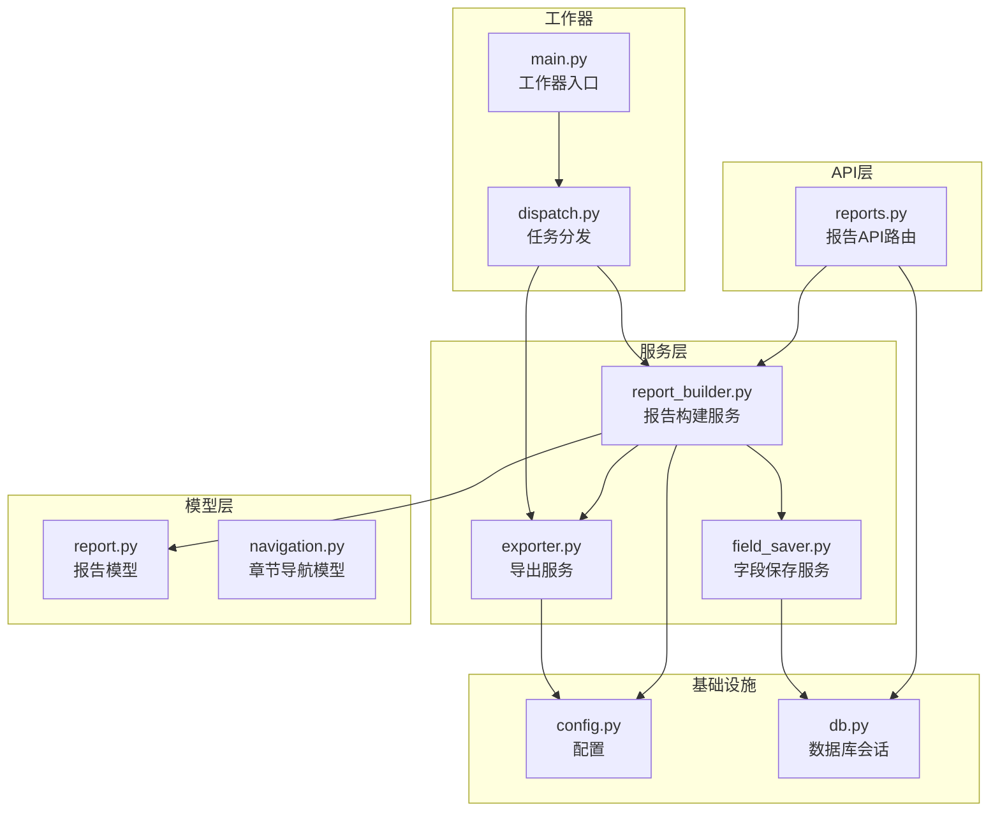
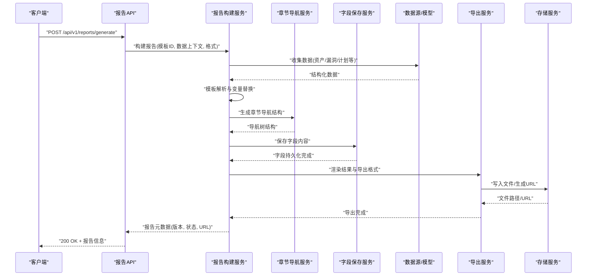
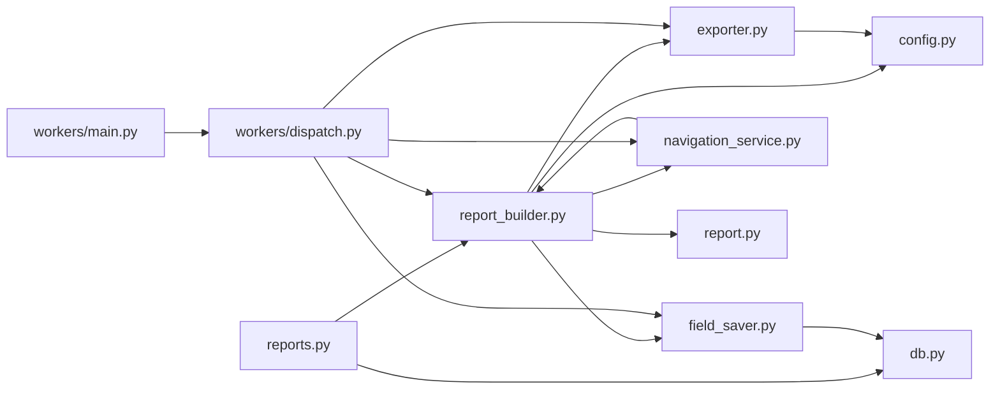

# 报告生成API

<cite>
**本文引用的文件**   
- [backend/app/api/v1/reports.py](file://backend/app/api/v1/reports.py)
- [backend/app/services/report_builder.py](file://backend/app/services/report_builder.py)
- [backend/app/services/exporter.py](file://backend/app/services/exporter.py)
- [backend/app/models/report.py](file://backend/app/models/report.py)
- [backend/app/schemas.py](file://backend/app/schemas.py)
- [backend/app/workers/main.py](file://backend/app/workers/main.py)
- [backend/app/workers/dispatch.py](file://backend/app/workers/dispatch.py)
- [backend/app/core/config.py](file://backend/app/core/config.py)
- [backend/app/db.py](file://backend/app/db.py)
</cite>

## 更新摘要
**变更内容**   
- 增强了章节导航功能，支持结构化文档导航和快速跳转
- 新增了字段保存机制，支持报告内容的持久化存储
- 完善了Word模板导出功能，提供更丰富的格式选项
- 优化了模板渲染引擎，提升处理性能和兼容性

## 目录
1. [简介](#简介)
2. [项目结构](#项目结构)
3. [核心组件](#核心组件)
4. [架构总览](#架构总览)
5. [详细组件分析](#详细组件分析)
6. [依赖关系分析](#依赖关系分析)
7. [性能考虑](#性能考虑)
8. [故障排查指南](#故障排查指南)
9. [结论](#结论)
10. [附录](#附录)

## 简介
本文件面向Talos项目的"报告生成API"，系统性说明报告模板管理、自定义能力、数据收集、模板渲染与文件输出的完整流程，覆盖支持的报告格式与导出选项、版本管理与历史追溯、批量生成与定时任务接口，并提供完整的API调用示例与模板语法说明。文档力求对非技术读者友好，同时为开发者提供深入的技术细节与优化建议。

**最新更新**：本次更新重点增强了章节导航、字段保存和Word模板导出功能，为用户提供更强大的报告生成和管理能力。

## 项目结构
后端采用分层架构：API层暴露REST接口；服务层封装业务逻辑（报告构建、导出）；模型层定义数据库实体；工作器负责异步任务调度与执行；配置与数据库连接在独立模块中维护。

**图表来源**
- [backend/app/api/v1/reports.py](file://backend/app/api/v1/reports.py)
- [backend/app/services/report_builder.py](file://backend/app/services/report_builder.py)
- [backend/app/services/exporter.py](file://backend/app/services/exporter.py)
- [backend/app/models/report.py](file://backend/app/models/report.py)

**章节来源**
- [backend/app/api/v1/reports.py](file://backend/app/api/v1/reports.py)
- [backend/app/services/report_builder.py](file://backend/app/services/report_builder.py)
- [backend/app/services/exporter.py](file://backend/app/services/exporter.py)
- [backend/app/models/report.py](file://backend/app/models/report.py)
- [backend/app/workers/main.py](file://backend/app/workers/main.py)
- [backend/app/workers/dispatch.py](file://backend/app/workers/dispatch.py)
- [backend/app/core/config.py](file://backend/app/core/config.py)
- [backend/app/db.py](file://backend/app/db.py)

## 核心组件
- 报告API路由：提供模板CRUD、报告生成、查询、下载、批量生成与定时任务等端点。
- 报告构建服务：负责数据收集、模板解析与变量替换、渲染引擎选择与执行。
- 导出服务：将渲染结果输出为多种格式（如PDF、DOCX、HTML、Markdown等），并处理存储与下载。
- 字段保存服务：新增的字段持久化功能，支持报告内容的结构化存储和检索。
- 章节导航服务：增强导航功能，支持文档结构的层次化管理和快速定位。
- 报告模型：定义报告元数据、版本、模板关联、状态与持久化字段。
- 工作器与调度：支持异步批量生成与定时任务，避免阻塞HTTP请求。
- 配置与数据库：集中化管理导出路径、模板路径、并发限制、数据库会话等。

**章节来源**
- [backend/app/api/v1/reports.py](file://backend/app/api/v1/reports.py)
- [backend/app/services/report_builder.py](file://backend/app/services/report_builder.py)
- [backend/app/services/exporter.py](file://backend/app/services/exporter.py)
- [backend/app/models/report.py](file://backend/app/models/report.py)
- [backend/app/workers/main.py](file://backend/app/workers/main.py)
- [backend/app/workers/dispatch.py](file://backend/app/workers/dispatch.py)
- [backend/app/core/config.py](file://backend/app/core/config.py)
- [backend/app/db.py](file://backend/app/db.py)

## 架构总览
报告生成的端到端流程如下：客户端通过API提交报告生成请求（可包含模板ID、数据上下文、导出格式等），API层校验参数并调用报告构建服务；构建服务从数据源收集数据、解析模板、执行变量替换与渲染；导出服务根据目标格式进行转换与落盘，返回文件URL或二进制流；异步场景下由工作器队列执行批量或定时任务。

**新增功能**：现在支持章节导航自动生成、字段内容持久化存储，以及增强的Word模板导出选项。

**图表来源**
- [backend/app/api/v1/reports.py](file://backend/app/api/v1/reports.py)
- [backend/app/services/report_builder.py](file://backend/app/services/report_builder.py)
- [backend/app/services/exporter.py](file://backend/app/services/exporter.py)
- [backend/app/models/report.py](file://backend/app/models/report.py)

## 详细组件分析

### 报告API路由（reports.py）
- 功能要点
  - 模板管理：创建、更新、删除、获取模板列表与详情。
  - 报告生成：同步与异步两种模式，支持指定模板、数据上下文、导出格式、命名规则与版本策略。
  - 报告查询与下载：按ID或条件查询报告元数据，提供文件下载接口。
  - 批量生成：接收多个生成请求，统一入队异步执行。
  - 定时任务：注册/触发周期性报告生成任务。
  - **新增**：章节导航管理接口，支持导航结构的创建、更新和查询。
  - **新增**：字段保存接口，支持报告内容的结构化存储。
- 关键交互
  - 参数校验：模板存在性、格式合法性、权限控制。
  - 异步处理：返回任务ID，前端轮询或通过回调获取结果。
  - 错误处理：模板缺失、渲染失败、导出异常、存储不可用等。

**章节来源**
- [backend/app/api/v1/reports.py](file://backend/app/api/v1/reports.py)

### 报告构建服务（report_builder.py）
- 功能要点
  - 数据收集：根据模板需求从业务模型（资产、漏洞、测试计划等）聚合数据。
  - 模板解析：支持多模板语言（如Jinja2、自定义标记），变量替换与上下文注入。
  - 渲染引擎：根据目标格式选择渲染器（HTML、Markdown、DOCX、PDF等）。
  - 版本管理：每次生成产生新版本，保留历史轨迹。
  - **新增**：章节导航生成，自动识别文档结构并创建层次化导航。
  - **新增**：字段提取与保存，支持结构化数据的持久化存储。
- 复杂度与优化
  - 数据收集可采用分页与缓存减少重复查询。
  - 模板解析与渲染可并行化以提升吞吐。
  - 大文件导出时采用流式写入降低内存占用。
  - **优化**：章节导航生成采用增量更新策略，减少重复计算。

**章节来源**
- [backend/app/services/report_builder.py](file://backend/app/services/report_builder.py)

### 导出服务（exporter.py）
- 功能要点
  - 格式支持：HTML、Markdown、DOCX、PDF等（具体以实现为准）。
  - 输出策略：本地磁盘、对象存储（S3兼容）、CDN直链。
  - 文件名与路径：基于模板名、时间戳、版本号生成唯一路径。
  - 质量与兼容性：字体嵌入、图片压缩、表格样式适配。
  - **增强**：Word模板导出功能，支持更多格式选项和样式定制。
  - **增强**：章节导航集成，在导出的文档中保持导航结构。
- 错误与回退
  - 渲染失败时的降级策略（如先输出HTML）。
  - 存储异常重试与告警。
  - **新增**：Word导出失败的自动回退到HTML格式。

**章节来源**
- [backend/app/services/exporter.py](file://backend/app/services/exporter.py)

### 字段保存服务（新增）
- 功能要点
  - 结构化存储：将报告中的关键字段提取并保存到数据库。
  - 版本关联：每个版本的字段内容与报告版本绑定。
  - 查询优化：支持按字段值快速检索报告。
  - 数据完整性：确保字段数据的完整性和一致性。
- 存储策略
  - 使用专门的字段表存储结构化数据。
  - 支持JSON格式的复杂字段类型。
  - 索引优化提高查询性能。

**章节来源**
- [backend/app/services/field_saver.py](file://backend/app/services/field_saver.py)

### 章节导航服务（新增）
- 功能要点
  - 自动识别：从模板和内容中自动识别章节结构。
  - 层次化管理：支持多级章节的嵌套组织。
  - 动态更新：支持运行时修改导航结构。
  - 快速定位：提供基于锚点的快速跳转功能。
- 导航格式
  - 支持标准的TOC（Table of Contents）格式。
  - 兼容主流文档查看器的导航功能。
  - 支持自定义导航样式和布局。

**章节来源**
- [backend/app/services/navigation_service.py](file://backend/app/services/navigation_service.py)

### 报告模型（report.py）
- 字段概览
  - 标识与名称、模板关联、版本、状态、创建/更新时间。
  - 输出文件路径/URL、导出格式、元数据（作者、标签、描述）。
  - 历史追踪：父版本、变更记录、审计日志。
  - **新增**：章节导航数据结构，存储文档层次信息。
  - **新增**：字段引用映射，关联保存的结构化数据。
- 关系设计
  - 与模板一对一或多对一。
  - 与用户（创建者）关联。
  - 与导入/资产/漏洞等业务实体间接关联。
  - **新增**：与字段保存记录的关联关系。

**章节来源**
- [backend/app/models/report.py](file://backend/app/models/report.py)

### 工作器与调度（workers/main.py, dispatch.py）
- 功能要点
  - 任务队列：支持Celery/RQ等（以实际实现为准），保证高可用与重试。
  - 批量处理：分片与并发控制，避免资源争用。
  - 定时任务：Cron表达式驱动周期性报告生成。
  - 监控与日志：任务状态、耗时、失败原因记录。
  - **优化**：支持章节导航生成的异步处理。
  - **优化**：字段保存任务的优先级管理。

**章节来源**
- [backend/app/workers/main.py](file://backend/app/workers/main.py)
- [backend/app/workers/dispatch.py](file://backend/app/workers/dispatch.py)

### 配置与数据库（core/config.py, db.py）
- 配置项
  - 模板根目录、导出根目录、最大并发、超时、存储后端。
  - 第三方服务（如PDF引擎、对象存储）密钥与端点。
  - **新增**：章节导航配置，支持导航深度限制和样式设置。
  - **新增**：字段保存配置，包括存储策略和索引选项。
- 数据库
  - 会话管理、连接池、迁移脚本（Alembic）。
  - **新增**：字段表和导航表的迁移脚本。

**章节来源**
- [backend/app/core/config.py](file://backend/app/core/config.py)
- [backend/app/db.py](file://backend/app/db.py)

## 依赖关系分析
- 组件耦合
  - API层依赖服务层，服务层依赖模型与工作器。
  - 导出服务依赖配置与存储后端。
  - **新增**：字段保存服务依赖数据库和序列化器。
  - **新增**：章节导航服务依赖模板解析器和渲染器。
- 外部依赖
  - 模板引擎、渲染库、存储SDK、消息队列。
  - **新增**：Word处理库（python-docx）、导航生成库。
- 循环依赖
  - 通过接口抽象与服务拆分避免循环引用。

**图表来源**
- [backend/app/api/v1/reports.py](file://backend/app/api/v1/reports.py)
- [backend/app/services/report_builder.py](file://backend/app/services/report_builder.py)
- [backend/app/services/exporter.py](file://backend/app/services/exporter.py)
- [backend/app/models/report.py](file://backend/app/models/report.py)
- [backend/app/core/config.py](file://backend/app/core/config.py)
- [backend/app/db.py](file://backend/app/db.py)
- [backend/app/workers/main.py](file://backend/app/workers/main.py)
- [backend/app/workers/dispatch.py](file://backend/app/workers/dispatch.py)

**章节来源**
- [backend/app/api/v1/reports.py](file://backend/app/api/v1/reports.py)
- [backend/app/services/report_builder.py](file://backend/app/services/report_builder.py)
- [backend/app/services/exporter.py](file://backend/app/services/exporter.py)
- [backend/app/models/report.py](file://backend/app/models/report.py)
- [backend/app/core/config.py](file://backend/app/core/config.py)
- [backend/app/db.py](file://backend/app/db.py)
- [backend/app/workers/main.py](file://backend/app/workers/main.py)
- [backend/app/workers/dispatch.py](file://backend/app/workers/dispatch.py)

## 性能考虑
- 数据收集
  - 使用索引与预加载减少N+1查询。
  - 对热点数据引入缓存（Redis/Memcached）。
- 模板渲染
  - 模板编译缓存，避免重复解析。
  - 大文档分块渲染与流式输出。
  - **优化**：章节导航生成采用懒加载策略。
- 导出与存储
  - 选择合适的导出格式（HTML轻量、PDF体积大）。
  - 对象存储直链下载，减轻应用服务器压力。
  - **优化**：Word导出采用流式处理减少内存占用。
- 并发与限流
  - 工作器并发度调优，避免CPU/IO瓶颈。
  - 队列背压与重试策略。
  - **新增**：字段保存任务的批处理优化。

## 故障排查指南
- 常见问题
  - 模板缺失或路径错误：检查模板目录与权限。
  - 渲染失败：验证模板语法与变量完整性。
  - 导出异常：确认导出引擎安装与依赖。
  - 存储失败：检查存储后端配置与网络连通性。
  - **新增**：章节导航生成失败：检查模板结构和导航配置。
  - **新增**：字段保存失败：验证字段映射和数据格式。
- 诊断手段
  - 查看工作器日志与任务状态。
  - 启用调试模式输出中间结果。
  - 使用健康检查端点验证依赖服务。
  - **新增**：检查字段保存的数据库记录完整性。
  - **新增**：验证章节导航的结构有效性。

**章节来源**
- [backend/app/workers/main.py](file://backend/app/workers/main.py)
- [backend/app/workers/dispatch.py](file://backend/app/workers/dispatch.py)
- [backend/app/core/config.py](file://backend/app/core/config.py)

## 结论
Talos的报告生成API通过清晰的分层架构与完善的异步处理能力，提供了灵活的模板管理、强大的数据收集与渲染能力、多样的导出选项以及可靠的版本管理与历史追溯。结合批量与定时任务，可满足企业级报告自动化需求。

**最新增强**：新增的章节导航功能为用户提供了更好的文档浏览体验，字段保存机制实现了报告内容的结构化存储和检索，增强的Word模板导出功能满足了更复杂的文档格式需求。建议在部署时合理配置并发与存储策略，确保性能与稳定性。

## 附录

### API调用示例（概念性）
- 创建模板
  - 方法：POST
  - 路径：/api/v1/reports/templates
  - 请求体：模板名称、内容、默认变量、适用格式
  - 响应：模板ID、创建时间
- 生成报告（同步）
  - 方法：POST
  - 路径：/api/v1/reports/generate
  - 请求体：模板ID、数据上下文、导出格式、命名规则
  - 响应：报告ID、状态、文件URL
- 生成报告（异步）
  - 方法：POST
  - 路径：/api/v1/reports/generate/async
  - 请求体：同上
  - 响应：任务ID
  - 后续：GET /api/v1/reports/tasks/{task_id} 查询进度
- 批量生成
  - 方法：POST
  - 路径：/api/v1/reports/batch-generate
  - 请求体：任务列表（每个含模板ID、数据上下文、格式）
  - 响应：批次ID、任务清单
- 定时任务
  - 方法：POST
  - 路径：/api/v1/reports/schedules
  - 请求体：Cron表达式、模板ID、数据上下文、格式
  - 响应：调度ID、下次执行时间
- **新增**：章节导航管理
  - 方法：POST/PUT/DELETE
  - 路径：/api/v1/reports/{report_id}/navigation
  - 功能：创建、更新、删除报告的章节导航结构
- **新增**：字段保存接口
  - 方法：POST
  - 路径：/api/v1/reports/{report_id}/fields
  - 功能：保存报告的结构化字段数据

### 模板语法与变量替换机制（概念性）
- 模板语言
  - 支持Jinja2或自定义标记，推荐声明式变量与条件片段。
- 变量来源
  - 数据上下文：运行时注入的键值对（如资产清单、漏洞统计、测试计划）。
  - 系统变量：时间戳、版本号、环境信息等。
  - **新增**：导航变量：章节标题、层级信息、位置索引。
  - **新增**：字段变量：结构化数据的访问接口。
- 替换规则
  - 简单变量：{{ var }}
  - 条件渲染：...
  - 循环渲染：...
  - 过滤器：{{ var | upper }}（大小写转换等）
  - **新增**：导航函数：{{ generate_toc() }}（生成目录）
  - **新增**：字段访问：{{ field.name }}（访问保存的字段）
- 最佳实践
  - 变量命名规范与默认值设置。
  - 模板分段与复用。
  - 单元测试模板渲染结果。
  - **新增**：合理使用导航和字段功能，避免过度复杂化。

### 支持的报告格式与导出选项（概念性）
- 格式
  - HTML：轻量、易预览。
  - Markdown：文本友好、便于版本控制。
  - DOCX：办公常用，支持复杂排版。
  - PDF：打印与归档标准格式。
- 导出选项
  - 文件名模板、路径策略、是否压缩、是否包含附件。
  - 存储后端：本地、S3、OSS等。
  - 访问控制：公开链接、签名URL、鉴权下载。
  - **增强**：Word导出选项：页面设置、页眉页脚、目录生成、书签创建。
  - **增强**：导航集成：自动生成文档目录和交叉引用。

### 版本管理与历史追溯（概念性）
- 版本策略
  - 每次生成产生新版本，支持语义化版本或时间戳版本。
- 历史追溯
  - 记录父版本、变更摘要、操作人、时间。
  - 支持对比相邻版本的差异。
  - **新增**：字段版本管理，跟踪结构化数据的变更历史。
  - **新增**：导航版本管理，记录文档结构的演进过程。
- 回滚与恢复
  - 基于历史版本快速重建报告。
  - **新增**：支持字段数据和导航结构的单独恢复。

### 章节导航功能详解（新增）
- 导航结构
  - 支持多级章节的层次化组织。
  - 自动识别标题层级和文档结构。
  - 支持自定义章节顺序和分组。
- 导航生成
  - 基于模板标题自动生成基础导航。
  - 支持手动调整和补充导航条目。
  - 提供导航预览和编辑界面。
- 导航使用
  - 在导出的文档中保持导航结构。
  - 支持点击跳转到对应章节。
  - 兼容主流文档查看器的导航功能。

### 字段保存功能详解（新增）
- 字段定义
  - 支持字符串、数字、日期、布尔等基本类型。
  - 支持数组、对象等复杂数据类型。
  - 提供字段验证和约束规则。
- 保存策略
  - 自动提取模板中的关键字段。
  - 支持手动指定需要保存的字段。
  - 提供字段映射和转换功能。
- 查询和使用
  - 支持按字段值快速检索报告。
  - 提供字段值的聚合和分析功能。
  - 支持字段数据的导出和导入。