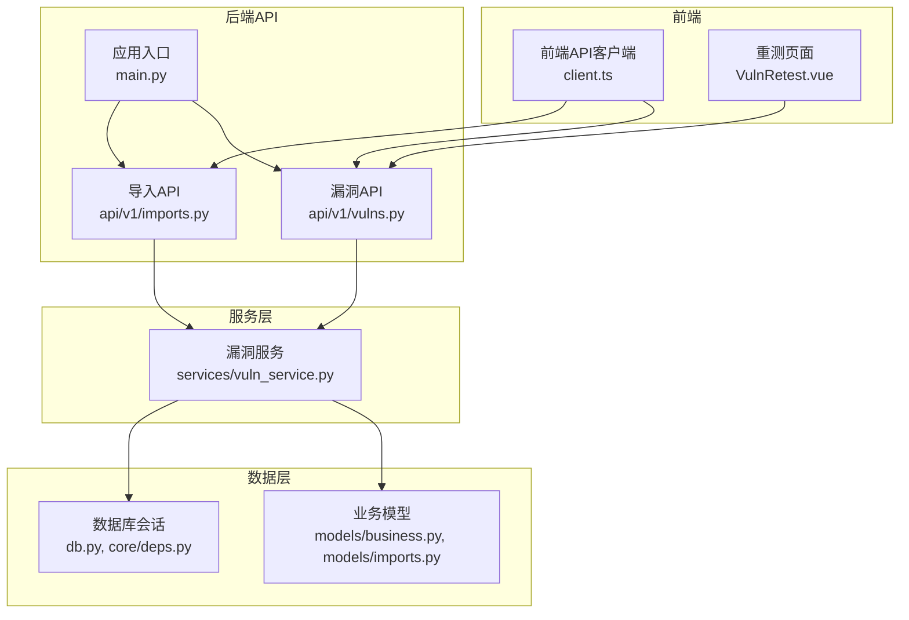
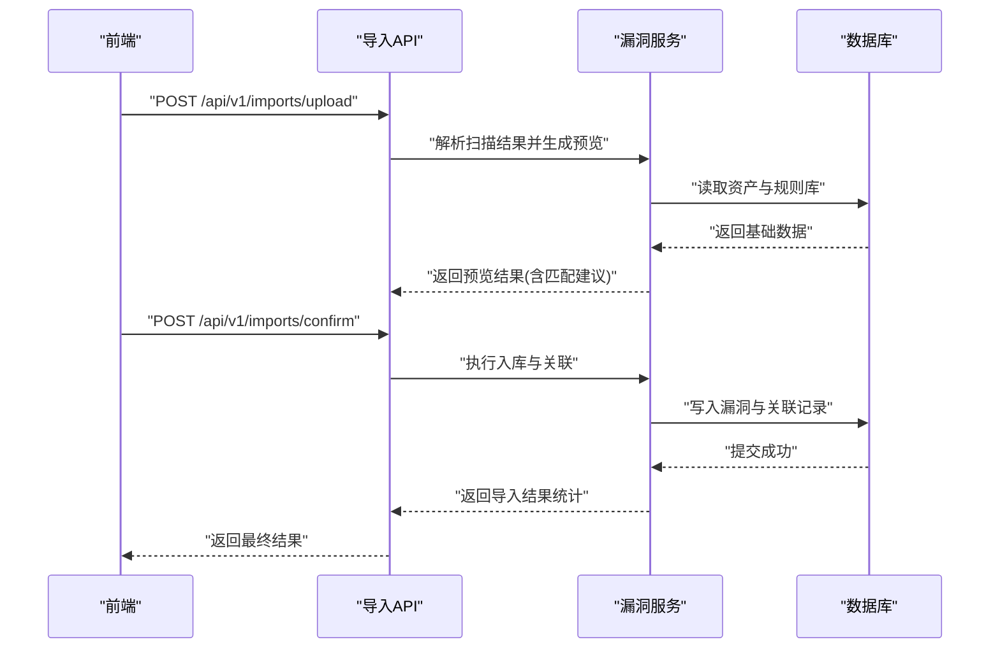
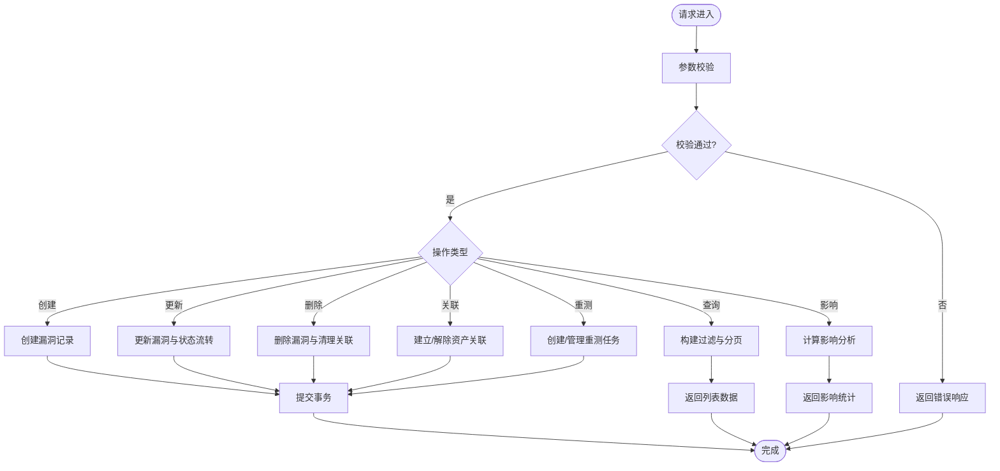
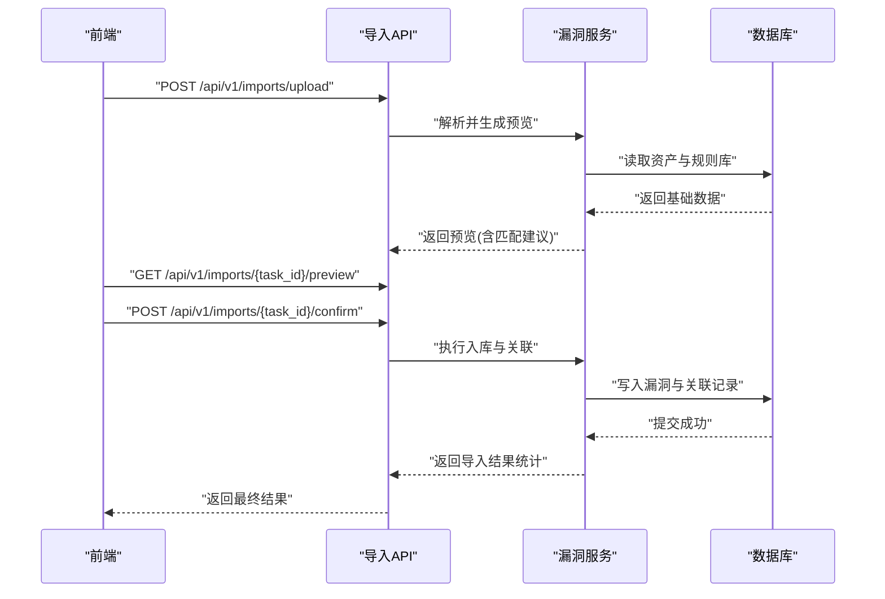
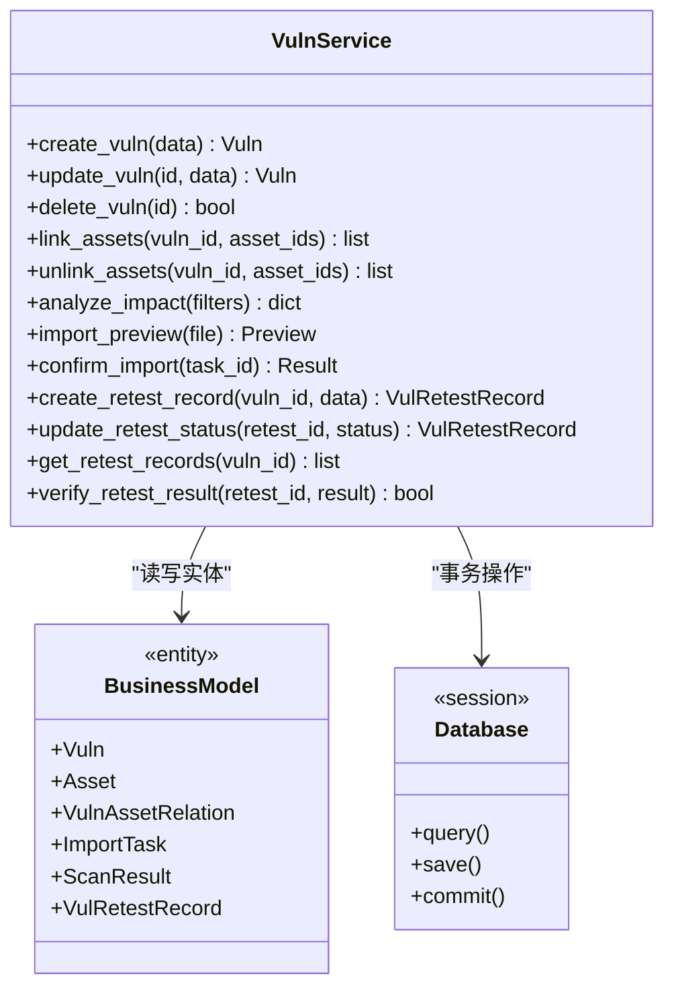
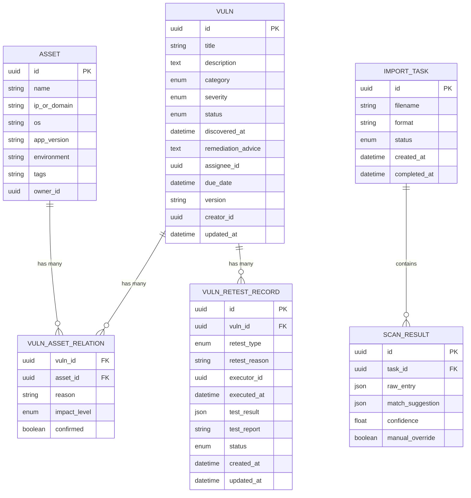
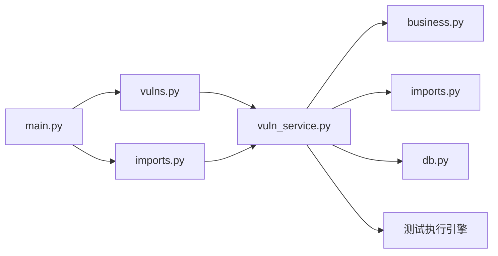

# 漏洞管理API

<cite>
**本文档引用的文件**
- [backend/app/api/v1/vulns.py](file://backend/app/api/v1/vulns.py)
- [backend/app/models/business.py](file://backend/app/models/business.py)
- [backend/app/schemas.py](file://backend/app/schemas.py)
- [backend/app/services/vuln_service.py](file://backend/app/services/vuln_service.py)
- [backend/app/api/v1/imports.py](file://backend/app/api/v1/imports.py)
- [backend/app/models/imports.py](file://backend/app/models/imports.py)
- [backend/app/main.py](file://backend/app/main.py)
- [backend/app/core/deps.py](file://backend/app/core/deps.py)
- [backend/app/db.py](file://backend/app/db.py)
- [frontend/src/api/client.ts](file://frontend/src/api/client.ts)
- [frontend/src/views/VulnRetest.vue](file://frontend/src/views/VulnRetest.vue)
</cite>

## 更新摘要
**变更内容**
- 新增重测工作流功能，支持漏洞修复后的重新验证
- 新增VulRetestRecord模型用于记录重测任务信息
- 扩展漏洞服务以支持重测流程管理
- 前端增加重测页面和API调用封装

## 目录
1. [简介](#简介)
2. [项目结构](#项目结构)
3. [核心组件](#核心组件)
4. [架构总览](#架构总览)
5. [详细组件分析](#详细组件分析)
6. [依赖关系分析](#依赖关系分析)
7. [性能考虑](#性能考虑)
8. [故障排查指南](#故障排查指南)
9. [结论](#结论)
10. [附录](#附录)

## 简介
本文件为Talos漏洞管理系统的API完整文档，覆盖漏洞录入、查询、更新与删除的接口规范；系统化说明漏洞分类体系、严重级别与状态管理；阐述漏洞与资产的关联关系及影响分析能力；详述扫描结果导入与自动匹配机制；提供修复跟踪与验证流程；并给出完整的API调用示例与数据结构、业务规则说明。读者无需深入代码即可理解系统能力与使用方式。

**更新** 本次更新新增了重测工作流功能，支持漏洞修复后的重新验证流程，包括重测任务创建、执行、结果记录和验证闭环管理。

## 项目结构
后端采用FastAPI框架，按功能分层组织：
- API层：路由与请求校验（vulns、imports等）
- 服务层：业务逻辑封装（vuln_service）
- 模型层：数据库实体定义（business、imports等）
- 数据访问：SQLAlchemy会话与连接配置（db、deps）
- 前端：Vue+TS客户端调用封装（client.ts）

图表来源
- [backend/app/main.py](file://backend/app/main.py)
- [backend/app/api/v1/vulns.py](file://backend/app/api/v1/vulns.py)
- [backend/app/api/v1/imports.py](file://backend/app/api/v1/imports.py)
- [backend/app/services/vuln_service.py](file://backend/app/services/vuln_service.py)
- [backend/app/models/business.py](file://backend/app/models/business.py)
- [backend/app/models/imports.py](file://backend/app/models/imports.py)
- [backend/app/db.py](file://backend/app/db.py)
- [backend/app/core/deps.py](file://backend/app/core/deps.py)
- [frontend/src/views/VulnRetest.vue](file://frontend/src/views/VulnRetest.vue)

章节来源
- [backend/app/main.py](file://backend/app/main.py)
- [backend/app/api/v1/vulns.py](file://backend/app/api/v1/vulns.py)
- [backend/app/api/v1/imports.py](file://backend/app/api/v1/imports.py)
- [backend/app/services/vuln_service.py](file://backend/app/services/vuln_service.py)
- [backend/app/models/business.py](file://backend/app/models/business.py)
- [backend/app/models/imports.py](file://backend/app/models/imports.py)
- [backend/app/db.py](file://backend/app/db.py)
- [backend/app/core/deps.py](file://backend/app/core/deps.py)
- [frontend/src/views/VulnRetest.vue](file://frontend/src/views/VulnRetest.vue)

## 核心组件
- 漏洞API（vulns.py）：提供CRUD与批量操作、过滤排序、分页、资产关联查询、影响分析等端点。
- 导入API（imports.py）：接收扫描结果文件，解析后进入预览与确认流程，支持自动匹配与入库。
- 漏洞服务（vuln_service.py）：封装漏洞生命周期、匹配策略、状态流转、修复跟踪与验证等业务逻辑。
- 数据模型（business.py、imports.py）：定义漏洞、资产、导入任务、扫描结果等实体与关系。
- 依赖注入（deps.py）与数据库（db.py）：统一会话管理与事务控制。

**更新** 新增重测记录模型（VulRetestRecord），用于管理漏洞修复后的重新验证流程，包括重测任务创建、执行状态跟踪、结果记录等功能。

章节来源
- [backend/app/api/v1/vulns.py](file://backend/app/api/v1/vulns.py)
- [backend/app/api/v1/imports.py](file://backend/app/api/v1/imports.py)
- [backend/app/services/vuln_service.py](file://backend/app/services/vuln_service.py)
- [backend/app/models/business.py](file://backend/app/models/business.py)
- [backend/app/models/imports.py](file://backend/app/models/imports.py)
- [backend/app/core/deps.py](file://backend/app/core/deps.py)
- [backend/app/db.py](file://backend/app/db.py)

## 架构总览
整体采用"API层 -> 服务层 -> 数据层"的分层架构，前后端通过RESTful接口交互。导入流程引入"预览-确认-入库"的双阶段处理，确保数据质量与可追溯性。重测工作流作为漏洞修复验证的重要环节，提供了完整的重测任务管理和结果追踪能力。

图表来源
- [backend/app/api/v1/imports.py](file://backend/app/api/v1/imports.py)
- [backend/app/services/vuln_service.py](file://backend/app/services/vuln_service.py)
- [backend/app/models/imports.py](file://backend/app/models/imports.py)
- [backend/app/models/business.py](file://backend/app/models/business.py)

## 详细组件分析

### 漏洞API（vulns.py）
- 功能范围
  - 创建漏洞：支持单条与批量创建，包含标题、描述、分类、严重级别、状态、发现时间、修复建议等字段。
  - 查询列表：支持多条件过滤（分类、严重级别、状态、资产ID、时间范围）、排序与分页。
  - 获取详情：根据ID获取漏洞详情，包括资产关联、修复进度、验证记录。
  - 更新：支持状态流转（如从"待修复"到"修复中"再到"已修复"），以及备注、修复计划、验证信息更新。
  - 删除：软删除或硬删除（依据业务策略），同时清理关联关系。
  - 资产关联：新增/移除漏洞与资产的关联，支持批量关联。
  - 影响分析：基于资产维度统计受影响主机、暴露面、风险等级分布。
  - **重测管理**：创建重测任务、查询重测记录、更新重测状态、获取重测结果。
- 典型端点
  - POST /api/v1/vulns：创建漏洞
  - GET /api/v1/vulns：查询列表
  - GET /api/v1/vulns/{id}：获取详情
  - PUT /api/v1/vulns/{id}：更新漏洞
  - DELETE /api/v1/vulns/{id}：删除漏洞
  - POST /api/v1/vulns/{id}/assets：关联资产
  - DELETE /api/v1/vulns/{id}/assets/{asset_id}：解除关联
  - GET /api/v1/vulns/{id}/impact：影响分析
  - **POST /api/v1/vulns/{id}/retest**：创建重测任务
  - **GET /api/v1/vulns/{id}/retests**：查询重测记录
  - **PUT /api/v1/retests/{retest_id}**：更新重测状态

图表来源
- [backend/app/api/v1/vulns.py](file://backend/app/api/v1/vulns.py)
- [backend/app/services/vuln_service.py](file://backend/app/services/vuln_service.py)

章节来源
- [backend/app/api/v1/vulns.py](file://backend/app/api/v1/vulns.py)
- [backend/app/services/vuln_service.py](file://backend/app/services/vuln_service.py)

### 导入API（imports.py）
- 功能范围
  - 上传扫描结果：支持多种格式（如JSON、XML、CSV等），服务端解析并生成预览。
  - 预览与匹配：展示解析后的条目，结合规则库进行自动匹配（漏洞名称、CVE、CVSS、资产指纹等）。
  - 确认入库：用户确认后批量写入数据库，生成导入任务记录与审计日志。
- 典型端点
  - POST /api/v1/imports/upload：上传并解析
  - GET /api/v1/imports/{task_id}/preview：查看预览与匹配建议
  - POST /api/v1/imports/{task_id}/confirm：确认并入库

图表来源
- [backend/app/api/v1/imports.py](file://backend/app/api/v1/imports.py)
- [backend/app/services/vuln_service.py](file://backend/app/services/vuln_service.py)
- [backend/app/models/imports.py](file://backend/app/models/imports.py)

章节来源
- [backend/app/api/v1/imports.py](file://backend/app/api/v1/imports.py)
- [backend/app/services/vuln_service.py](file://backend/app/services/vuln_service.py)
- [backend/app/models/imports.py](file://backend/app/models/imports.py)

### 漏洞服务（vuln_service.py）
- 功能范围
  - 生命周期管理：创建、更新、删除、状态流转（新建、待修复、修复中、已修复、已关闭、误报等）。
  - 匹配策略：基于名称、CVE、CVSS、技术栈、资产指纹等多维度匹配规则。
  - 资产关联：维护漏洞与资产的关联表，支持批量操作与去重。
  - 影响分析：统计受影响资产数量、风险等级分布、修复优先级建议。
  - 修复跟踪：记录修复计划、责任人、截止时间、修复版本、验证结果。
  - **重测管理**：创建重测任务、跟踪重测状态、记录重测结果、验证修复有效性。
- 关键方法
  - create_vuln：创建漏洞并初始化状态
  - update_vuln：更新漏洞信息与状态流转校验
  - delete_vuln：删除漏洞与清理关联
  - link_assets：批量关联资产
  - unlink_assets：批量解除关联
  - analyze_impact：计算影响分析指标
  - import_preview：解析导入数据并生成匹配建议
  - confirm_import：确认导入并持久化
  - **create_retest_record**：创建重测任务记录
  - **update_retest_status**：更新重测任务状态
  - **get_retest_records**：查询重测记录列表
  - **verify_retest_result**：验证重测结果

图表来源
- [backend/app/services/vuln_service.py](file://backend/app/services/vuln_service.py)
- [backend/app/models/business.py](file://backend/app/models/business.py)
- [backend/app/models/imports.py](file://backend/app/models/imports.py)
- [backend/app/db.py](file://backend/app/db.py)

章节来源
- [backend/app/services/vuln_service.py](file://backend/app/services/vuln_service.py)
- [backend/app/models/business.py](file://backend/app/models/business.py)
- [backend/app/models/imports.py](file://backend/app/models/imports.py)
- [backend/app/db.py](file://backend/app/db.py)

### 数据模型与数据结构
- 漏洞（Vuln）
  - 字段：id、标题、描述、分类、严重级别、状态、发现时间、修复建议、责任人、截止时间、版本号、创建人、更新时间等。
  - 状态枚举：新建、待修复、修复中、已修复、已关闭、误报。
  - 严重级别：致命、高危、中危、低危、信息。
  - 分类：软件漏洞、配置缺陷、权限问题、供应链风险、其他。
- 资产（Asset）
  - 字段：id、名称、IP/域名、操作系统、应用版本、环境、标签、负责人等。
- 漏洞-资产关联（VulnAssetRelation）
  - 字段：漏洞ID、资产ID、关联原因、影响程度、是否确认。
- 导入任务（ImportTask）
  - 字段：任务ID、文件名、格式、状态（解析中、预览就绪、已确认、失败）、创建时间、完成时间。
- 扫描结果（ScanResult）
  - 字段：任务ID、原始条目、匹配建议、置信度、人工修正标记。
- **重测记录（VulRetestRecord）**
  - 字段：id、漏洞ID、重测类型、重测原因、执行人、执行时间、测试结果、测试报告、状态、创建时间、更新时间。
  - 状态枚举：待执行、执行中、已完成、失败。
  - 重测类型：自动重测、手动重测、定时重测。

图表来源
- [backend/app/models/business.py](file://backend/app/models/business.py)
- [backend/app/models/imports.py](file://backend/app/models/imports.py)

章节来源
- [backend/app/models/business.py](file://backend/app/models/business.py)
- [backend/app/models/imports.py](file://backend/app/models/imports.py)

### 业务规则与约束
- 状态流转规则
  - 新建 -> 待修复：创建后默认进入待修复。
  - 待修复 -> 修复中：分配责任人并开始修复。
  - 修复中 -> 已修复：修复完成并提交验证。
  - 已修复 -> 已关闭：验证通过后关闭。
  - 任意状态 -> 误报：经安全团队确认为误报。
  - **已修复 -> 待重测 -> 重测中 -> 重测完成**：修复后进行重测验证。
- 严重级别与分类
  - 严重级别：致命、高危、中危、低危、信息。
  - 分类：软件漏洞、配置缺陷、权限问题、供应链风险、其他。
- 资产关联规则
  - 同一漏洞可对多个资产进行关联，需避免重复关联。
  - 关联时需填写关联原因与影响程度。
- 导入匹配规则
  - 优先基于CVE与名称精确匹配，其次基于CVSS与技术栈模糊匹配。
  - 匹配置信度低于阈值时要求人工确认。
- 修复跟踪规则
  - 必须记录责任人与截止时间。
  - 修复版本与验证结果必填。
- **重测工作流规则**
  - 只有"已修复"状态的漏洞才能发起重测。
  - 重测任务必须指定重测类型和原因。
  - 重测结果必须包含测试数据和报告。
  - 重测失败需要重新修复并再次验证。

章节来源
- [backend/app/services/vuln_service.py](file://backend/app/services/vuln_service.py)
- [backend/app/models/business.py](file://backend/app/models/business.py)
- [backend/app/models/imports.py](file://backend/app/models/imports.py)

### API调用示例与使用场景
以下为常见使用场景的调用步骤与要点（以路径与参数说明为主，不展示具体代码内容）：
- 创建漏洞
  - 端点：POST /api/v1/vulns
  - 输入：标题、描述、分类、严重级别、状态、发现时间、修复建议等。
  - 输出：创建的漏洞对象。
- 查询漏洞列表
  - 端点：GET /api/v1/vulns
  - 过滤：分类、严重级别、状态、资产ID、时间范围。
  - 排序：按发现时间、严重级别、状态等。
  - 分页：页码与每页数量。
- 获取漏洞详情
  - 端点：GET /api/v1/vulns/{id}
  - 输出：漏洞详情、资产关联、修复进度、验证记录。
- 更新漏洞
  - 端点：PUT /api/v1/vulns/{id}
  - 输入：需要更新的字段，状态变更需符合流转规则。
- 删除漏洞
  - 端点：DELETE /api/v1/vulns/{id}
  - 行为：软删除或硬删除（依配置）。
- 关联资产
  - 端点：POST /api/v1/vulns/{id}/assets
  - 输入：资产ID列表、关联原因、影响程度。
- 解除关联
  - 端点：DELETE /api/v1/vulns/{id}/assets/{asset_id}
- 影响分析
  - 端点：GET /api/v1/vulns/{id}/impact
  - 输出：受影响资产数量、风险分布、修复优先级建议。
- 导入扫描结果
  - 端点：POST /api/v1/imports/upload
  - 输入：扫描结果文件（JSON/XML/CSV）。
  - 输出：任务ID与解析状态。
- 预览导入结果
  - 端点：GET /api/v1/imports/{task_id}/preview
  - 输出：解析条目、匹配建议、置信度。
- 确认导入
  - 端点：POST /api/v1/imports/{task_id}/confirm
  - 输出：入库统计、失败条目明细。
- **创建重测任务**
  - 端点：POST /api/v1/vulns/{id}/retests
  - 输入：重测类型、重测原因、执行人、测试计划等。
  - 输出：重测任务ID与创建状态。
- **查询重测记录**
  - 端点：GET /api/v1/vulns/{id}/retests
  - 过滤：重测类型、状态、时间范围。
  - 输出：重测记录列表。
- **更新重测状态**
  - 端点：PUT /api/v1/retests/{retest_id}
  - 输入：新状态、测试结果、测试报告。
  - 输出：更新后的重测记录。

章节来源
- [backend/app/api/v1/vulns.py](file://backend/app/api/v1/vulns.py)
- [backend/app/api/v1/imports.py](file://backend/app/api/v1/imports.py)
- [frontend/src/api/client.ts](file://frontend/src/api/client.ts)
- [frontend/src/views/VulnRetest.vue](file://frontend/src/views/VulnRetest.vue)

## 依赖关系分析
- 模块耦合
  - API层依赖服务层，服务层依赖数据模型与数据库会话。
  - 导入流程依赖解析器与规则库，服务层协调匹配与入库。
  - **重测流程依赖漏洞状态检查、测试执行器和结果验证模块**。
- 外部依赖
  - FastAPI用于HTTP路由与请求校验。
  - SQLAlchemy用于ORM与事务管理。
  - 文件解析库用于导入格式处理。
  - **测试执行引擎用于自动化重测任务**。
- 潜在循环依赖
  - 服务层不应直接依赖API层，避免反向调用。
  - 模型层仅定义实体，不包含业务逻辑。

图表来源
- [backend/app/api/v1/vulns.py](file://backend/app/api/v1/vulns.py)
- [backend/app/api/v1/imports.py](file://backend/app/api/v1/imports.py)
- [backend/app/services/vuln_service.py](file://backend/app/services/vuln_service.py)
- [backend/app/models/business.py](file://backend/app/models/business.py)
- [backend/app/models/imports.py](file://backend/app/models/imports.py)
- [backend/app/db.py](file://backend/app/db.py)
- [backend/app/main.py](file://backend/app/main.py)

章节来源
- [backend/app/api/v1/vulns.py](file://backend/app/api/v1/vulns.py)
- [backend/app/api/v1/imports.py](file://backend/app/api/v1/imports.py)
- [backend/app/services/vuln_service.py](file://backend/app/services/vuln_service.py)
- [backend/app/models/business.py](file://backend/app/models/business.py)
- [backend/app/models/imports.py](file://backend/app/models/imports.py)
- [backend/app/db.py](file://backend/app/db.py)
- [backend/app/main.py](file://backend/app/main.py)

## 性能考虑
- 查询优化
  - 对常用过滤字段建立索引（分类、严重级别、状态、发现时间、资产ID）。
  - 分页查询限制每页数量，避免大结果集。
- 导入处理
  - 大文件分块解析，减少内存占用。
  - 异步任务处理导入与匹配，提升响应速度。
- 事务与锁
  - 批量操作使用事务保证一致性。
  - 并发导入时使用行级锁避免冲突。
- 缓存策略
  - 规则库与资产指纹可缓存，减少重复查询。
- **重测优化**
  - 重测任务异步执行，避免阻塞主线程。
  - 测试结果缓存，避免重复测试。
  - 批量重测支持并行执行。

[本节为通用指导，不涉及具体文件分析]

## 故障排查指南
- 常见问题
  - 导入失败：检查文件格式与字段映射，查看预览中的错误条目。
  - 匹配不准确：调整匹配规则阈值，补充规则库与资产指纹。
  - 状态流转异常：检查状态机规则与权限控制。
  - 关联冲突：检查资产唯一性与重复关联。
  - **重测失败：检查测试环境配置、依赖项完整性、权限设置**。
- 调试建议
  - 启用详细日志，记录导入与匹配过程。
  - 使用预览功能逐步确认数据质量。
  - 通过影响分析定位高风险漏洞。
  - **监控重测任务执行状态和错误日志**。

章节来源
- [backend/app/api/v1/imports.py](file://backend/app/api/v1/imports.py)
- [backend/app/services/vuln_service.py](file://backend/app/services/vuln_service.py)
- [backend/app/models/imports.py](file://backend/app/models/imports.py)

## 结论
Talos漏洞管理系统提供了完整的漏洞管理能力，涵盖录入、查询、更新、删除、资产关联、影响分析、导入匹配与修复跟踪。通过清晰的分层架构与严格的业务规则，确保数据安全与流程可控。**新增的重测工作流功能进一步完善了漏洞修复验证闭环，提升了系统的安全性和可靠性**。建议在生产环境中启用异步导入与缓存策略，以提升性能与稳定性。

[本节为总结性内容，不涉及具体文件分析]

## 附录
- 术语表
  - 漏洞：系统中存在的安全缺陷或风险点。
  - 资产：被管理的IT资源，如主机、应用、服务等。
  - 导入：将外部扫描结果解析并入库的过程。
  - 影响分析：评估漏洞对资产的影响与风险分布。
  - **重测：漏洞修复后的重新验证过程，确保修复有效性**。
- 参考文件
  - 前端客户端：frontend/src/api/client.ts
  - 后端主入口：backend/app/main.py
  - 依赖注入：backend/app/core/deps.py
  - 数据库配置：backend/app/db.py
  - **重测页面：frontend/src/views/VulnRetest.vue**

[本节为补充信息，不涉及具体文件分析]