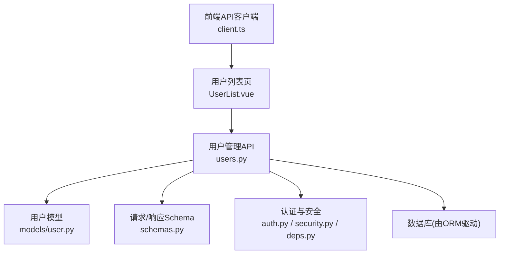
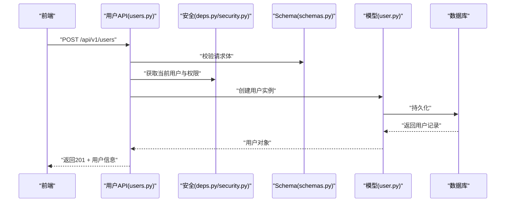
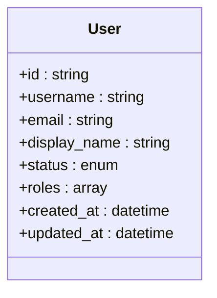
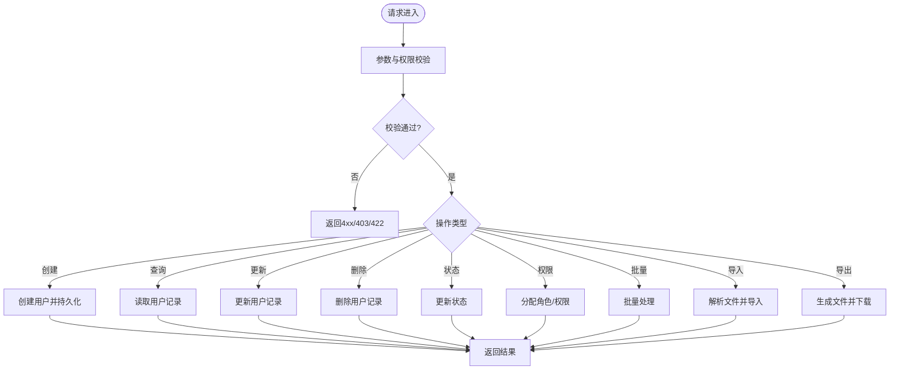
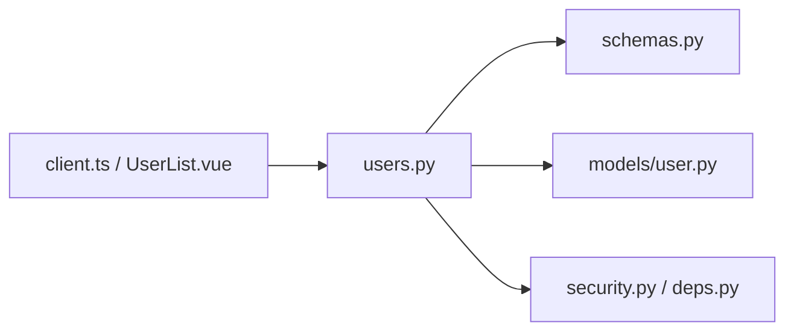

# 用户管理API

<cite>
**本文档引用的文件**   
- [users.py](file://backend/app/api/v1/users.py)
- [user.py](file://backend/app/models/user.py)
- [schemas.py](file://backend/app/schemas.py)
- [auth.py](file://backend/app/api/v1/auth.py)
- [security.py](file://backend/app/core/security.py)
- [deps.py](file://backend/app/core/deps.py)
- [main.py](file://backend/app/main.py)
- [client.ts](file://frontend/src/api/client.ts)
- [UserList.vue](file://frontend/src/views/UserList.vue)
</cite>

## 目录
1. [简介](#简介)
2. [项目结构](#项目结构)
3. [核心组件](#核心组件)
4. [架构总览](#架构总览)
5. [详细组件分析](#详细组件分析)
6. [依赖关系分析](#依赖关系分析)
7. [性能考虑](#性能考虑)
8. [故障排查指南](#故障排查指南)
9. [结论](#结论)
10. [附录](#附录)

## 简介
本文件面向Talos系统的“用户管理API”，提供完整的接口说明与实现要点，覆盖用户的创建、查询、更新、删除（CRUD）、状态管理与权限分配机制、批量操作、导入导出能力，以及错误处理与异常场景。文档同时给出调用示例与最佳实践，帮助开发者快速集成并稳定使用用户管理能力。

## 项目结构
用户管理相关代码主要位于后端API层、数据模型与Schema定义中，前端通过API客户端与页面组件进行交互。关键路径如下：
- API路由与控制器：backend/app/api/v1/users.py
- 数据模型：backend/app/models/user.py
- 请求/响应Schema：backend/app/schemas.py
- 认证与安全：backend/app/api/v1/auth.py、backend/app/core/security.py、backend/app/core/deps.py
- 应用入口与路由挂载：backend/app/main.py
- 前端API客户端与用户列表页：frontend/src/api/client.ts、frontend/src/views/UserList.vue

图表来源
- [users.py](file://backend/app/api/v1/users.py)
- [user.py](file://backend/app/models/user.py)
- [schemas.py](file://backend/app/schemas.py)
- [auth.py](file://backend/app/api/v1/auth.py)
- [security.py](file://backend/app/core/security.py)
- [deps.py](file://backend/app/core/deps.py)
- [client.ts](file://frontend/src/api/client.ts)
- [UserList.vue](file://frontend/src/views/UserList.vue)

章节来源
- [users.py](file://backend/app/api/v1/users.py)
- [user.py](file://backend/app/models/user.py)
- [schemas.py](file://backend/app/schemas.py)
- [auth.py](file://backend/app/api/v1/auth.py)
- [security.py](file://backend/app/core/security.py)
- [deps.py](file://backend/app/core/deps.py)
- [main.py](file://backend/app/main.py)
- [client.ts](file://frontend/src/api/client.ts)
- [UserList.vue](file://frontend/src/views/UserList.vue)

## 核心组件
- 用户模型（Model）：定义用户实体字段、约束与关联关系，支撑数据的持久化与校验。
- 请求/响应Schema：统一输入输出结构，包含字段类型、必填项、长度限制、枚举值等验证规则。
- 用户API路由：暴露RESTful接口，涵盖用户CRUD、状态切换、角色/权限分配、批量操作、导入导出等。
- 认证与安全：基于令牌鉴权、依赖注入当前用户上下文、密码哈希与权限检查。
- 前端集成：API客户端封装HTTP调用，用户列表页负责展示与交互。

章节来源
- [user.py](file://backend/app/models/user.py)
- [schemas.py](file://backend/app/schemas.py)
- [users.py](file://backend/app/api/v1/users.py)
- [auth.py](file://backend/app/api/v1/auth.py)
- [security.py](file://backend/app/core/security.py)
- [deps.py](file://backend/app/core/deps.py)

## 架构总览
用户管理API采用分层架构：
- 表现层（API）：接收HTTP请求，参数校验，调用服务逻辑，返回标准化响应。
- 领域层（模型/业务）：用户模型与业务规则（如状态流转、权限判定）。
- 基础设施层（安全/依赖注入）：认证、授权、数据库访问。
- 前端层：通过API客户端发起请求，渲染用户列表与表单。

图表来源
- [users.py](file://backend/app/api/v1/users.py)
- [schemas.py](file://backend/app/schemas.py)
- [user.py](file://backend/app/models/user.py)
- [deps.py](file://backend/app/core/deps.py)
- [security.py](file://backend/app/core/security.py)

## 详细组件分析

### 用户模型与数据结构
- 用户实体字段通常包括：唯一标识、用户名、邮箱、显示名、状态（启用/禁用）、角色/权限集合、时间戳（创建/更新）等。
- 字段约束：
  - 用户名/邮箱唯一性
  - 密码加密存储（不直接暴露明文）
  - 状态为枚举值（如 active/inactive）
  - 时间戳自动维护
- 复杂度与性能：
  - 单条查询O(1)~O(log n)（主键或索引）
  - 列表分页查询需结合索引优化
  - 批量操作建议分批提交，避免长事务

图表来源
- [user.py](file://backend/app/models/user.py)

章节来源
- [user.py](file://backend/app/models/user.py)

### 请求/响应Schema与数据验证
- 输入Schema：
  - 创建用户：用户名、邮箱、初始密码、显示名、角色/权限、状态等
  - 更新用户：可更新字段子集，支持部分更新
  - 批量操作：数组形式的用户数据
- 输出Schema：
  - 用户详情：隐藏敏感字段（如密码），包含状态与权限集合
  - 列表：分页元数据+用户摘要
- 验证规则：
  - 必填字段校验、格式校验（邮箱、手机号等）
  - 唯一性校验（用户名、邮箱）
  - 长度与范围限制
  - 自定义业务规则（如状态变更合法性）

章节来源
- [schemas.py](file://backend/app/schemas.py)

### 用户API接口设计（CRUD与扩展）
- 用户创建：POST /api/v1/users
  - 请求体：遵循创建Schema
  - 响应：201 Created + 用户信息
- 用户查询：GET /api/v1/users/{id}
  - 路径参数：用户ID
  - 响应：200 OK + 用户详情
- 用户更新：PUT/PATCH /api/v1/users/{id}
  - 请求体：遵循更新Schema
  - 响应：200 OK + 用户详情
- 用户删除：DELETE /api/v1/users/{id}
  - 响应：204 No Content 或 200 OK + 确认信息
- 状态管理：PATCH /api/v1/users/{id}/status
  - 请求体：新状态
  - 权限：仅管理员或具备用户管理权限
- 权限分配：PATCH /api/v1/users/{id}/roles
  - 请求体：角色/权限集合
  - 权限：仅管理员或具备用户管理权限
- 批量操作：POST /api/v1/users/batch
  - 请求体：用户数组（创建/更新）
  - 响应：成功/失败统计与明细
- 导入导出：
  - 导入：POST /api/v1/users/import（CSV/Excel）
  - 导出：GET /api/v1/users/export（CSV/Excel）

图表来源
- [users.py](file://backend/app/api/v1/users.py)
- [schemas.py](file://backend/app/schemas.py)
- [user.py](file://backend/app/models/user.py)

章节来源
- [users.py](file://backend/app/api/v1/users.py)
- [schemas.py](file://backend/app/schemas.py)
- [user.py](file://backend/app/models/user.py)

### 认证与权限控制
- 认证方式：基于令牌（如JWT）的无状态鉴权，登录成功后颁发令牌。
- 依赖注入：通过依赖注入获取当前用户上下文，用于权限判断。
- 权限模型：
  - 角色（Role）与权限（Permission）分离
  - 用户可拥有多个角色，角色聚合权限
  - 接口级权限注解或中间件检查
- 安全策略：
  - 密码哈希存储
  - 最小权限原则
  - 审计日志（可选）

章节来源
- [auth.py](file://backend/app/api/v1/auth.py)
- [security.py](file://backend/app/core/security.py)
- [deps.py](file://backend/app/core/deps.py)

### 前端集成与调用示例
- API客户端：封装基础URL、拦截器（添加Authorization头）、错误处理。
- 用户列表页：
  - 加载用户列表（分页、搜索、筛选）
  - 打开创建/编辑对话框
  - 执行删除、状态切换、角色分配
  - 导入/导出按钮触发文件上传/下载

章节来源
- [client.ts](file://frontend/src/api/client.ts)
- [UserList.vue](file://frontend/src/views/UserList.vue)

## 依赖关系分析
- API层依赖Schema进行输入校验，依赖模型进行数据持久化，依赖安全模块进行鉴权。
- 前端依赖API客户端，间接依赖后端路由与中间件。
- 可能的循环依赖应避免（如API与模型之间单向依赖）。

图表来源
- [users.py](file://backend/app/api/v1/users.py)
- [schemas.py](file://backend/app/schemas.py)
- [user.py](file://backend/app/models/user.py)
- [security.py](file://backend/app/core/security.py)
- [deps.py](file://backend/app/core/deps.py)
- [client.ts](file://frontend/src/api/client.ts)
- [UserList.vue](file://frontend/src/views/UserList.vue)

章节来源
- [users.py](file://backend/app/api/v1/users.py)
- [schemas.py](file://backend/app/schemas.py)
- [user.py](file://backend/app/models/user.py)
- [security.py](file://backend/app/core/security.py)
- [deps.py](file://backend/app/core/deps.py)
- [client.ts](file://frontend/src/api/client.ts)
- [UserList.vue](file://frontend/src/views/UserList.vue)

## 性能考虑
- 分页与索引：用户列表应分页，对常用查询字段建立索引（用户名、邮箱、状态）。
- 批量操作：分批提交，避免单次过大事务；失败重试与幂等性设计。
- 导入导出：大文件流式处理，异步任务队列（可选）提升响应速度。
- 缓存策略：只读热点数据可缓存（如角色/权限字典）。
- 连接池：数据库连接池配置合理，避免连接耗尽。

[本节为通用指导，无需特定文件来源]

## 故障排查指南
- 常见错误码：
  - 400 Bad Request：请求体格式错误或必填字段缺失
  - 401 Unauthorized：未携带有效令牌或令牌过期
  - 403 Forbidden：无权限执行该操作
  - 404 Not Found：用户不存在
  - 409 Conflict：用户名或邮箱重复
  - 422 Unprocessable Entity：自定义校验失败（如状态非法）
  - 500 Internal Server Error：服务器内部错误
- 排查步骤：
  - 检查请求体是否符合Schema定义
  - 确认令牌是否有效且具备所需权限
  - 查看服务端日志定位具体异常堆栈
  - 对导入/导出问题检查文件格式与编码
- 调试技巧：
  - 开启详细日志（开发环境）
  - 使用API测试工具（如Postman）构造最小用例
  - 逐步缩小问题范围（先单条后批量）

章节来源
- [users.py](file://backend/app/api/v1/users.py)
- [auth.py](file://backend/app/api/v1/auth.py)
- [security.py](file://backend/app/core/security.py)

## 结论
Talos的用户管理API提供了完善的CRUD、状态与权限管理、批量操作与导入导出能力。通过清晰的Schema定义、严格的鉴权与错误处理，确保系统的安全性与稳定性。建议在生产环境中结合监控与审计，持续优化性能与用户体验。

[本节为总结，无需特定文件来源]

## 附录
- 接口清单（示例）：
  - POST /api/v1/users：创建用户
  - GET /api/v1/users/{id}：查询用户
  - PUT/PATCH /api/v1/users/{id}：更新用户
  - DELETE /api/v1/users/{id}：删除用户
  - PATCH /api/v1/users/{id}/status：更新状态
  - PATCH /api/v1/users/{id}/roles：分配角色/权限
  - POST /api/v1/users/batch：批量操作
  - POST /api/v1/users/import：导入用户
  - GET /api/v1/users/export：导出用户
- 调用示例（概念性）：
  - 创建用户：发送JSON包含用户名、邮箱、密码、显示名、角色与状态
  - 查询用户：GET请求带用户ID
  - 更新用户：PATCH请求携带需要更新的字段
  - 删除用户：DELETE请求带用户ID
  - 批量操作：POST请求携带用户数组
  - 导入：上传CSV/Excel文件
  - 导出：GET请求下载文件

[本节为补充信息，无需特定文件来源]