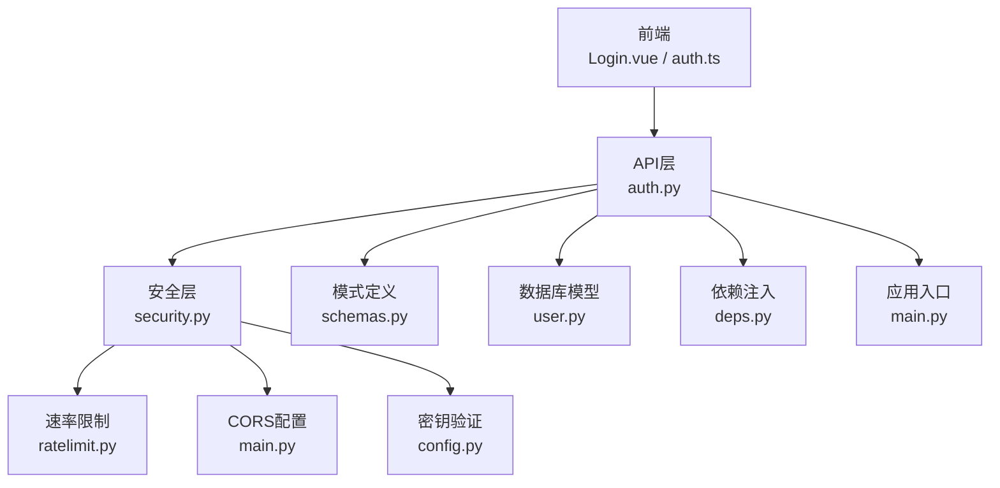
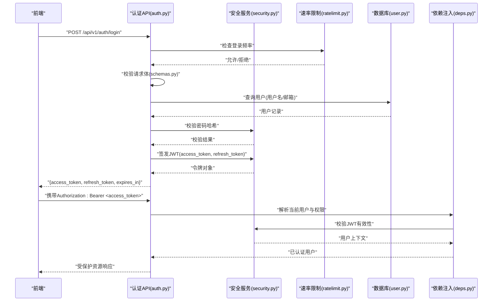
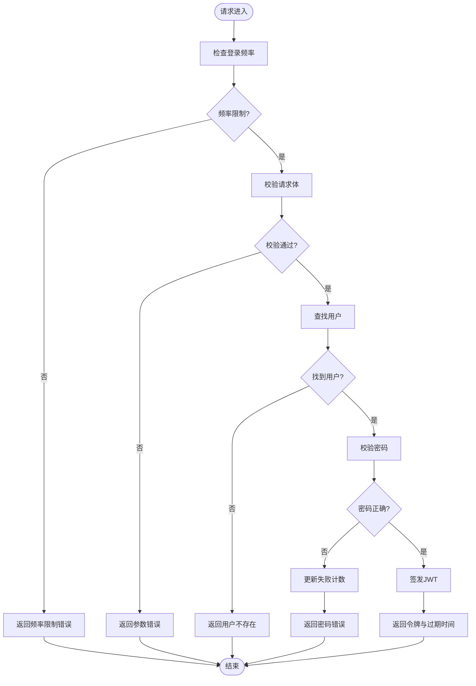
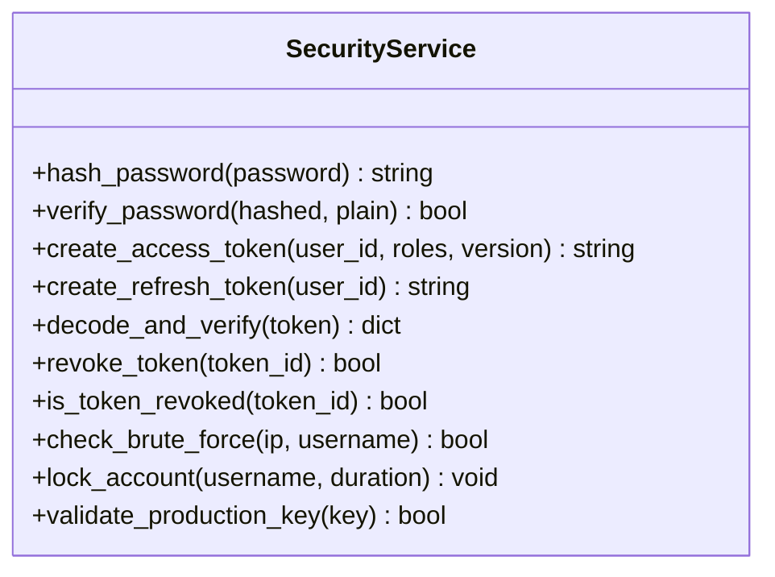
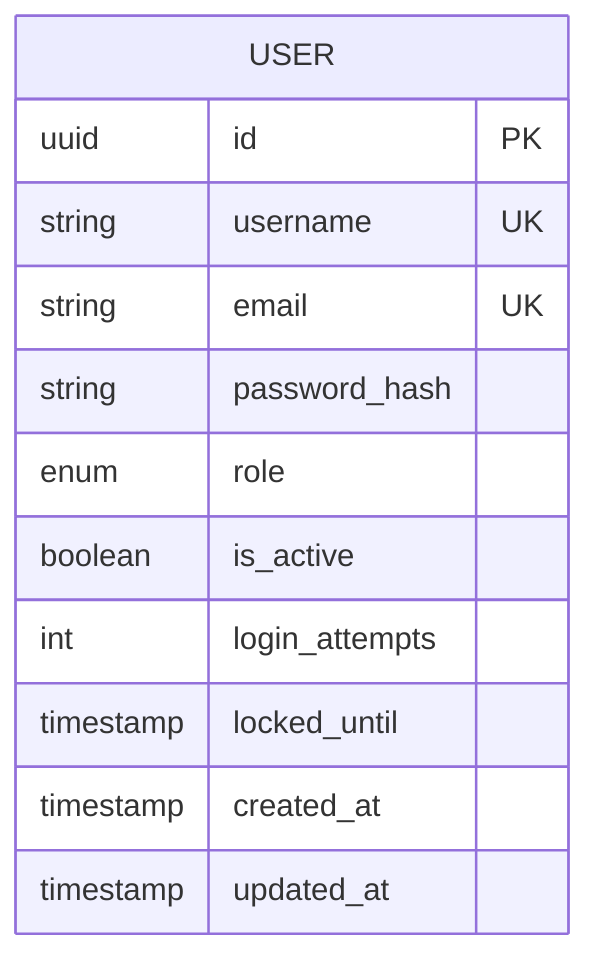
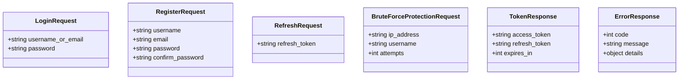
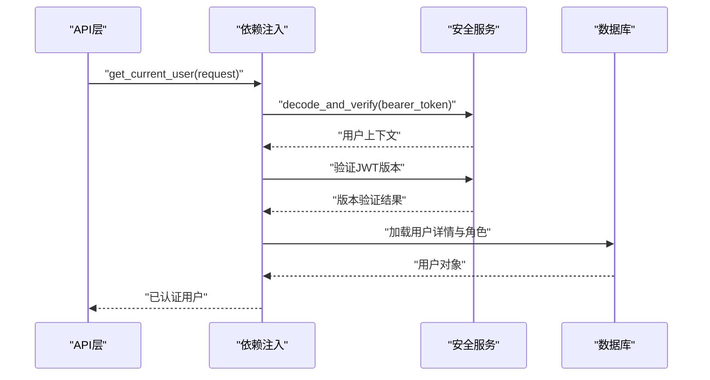
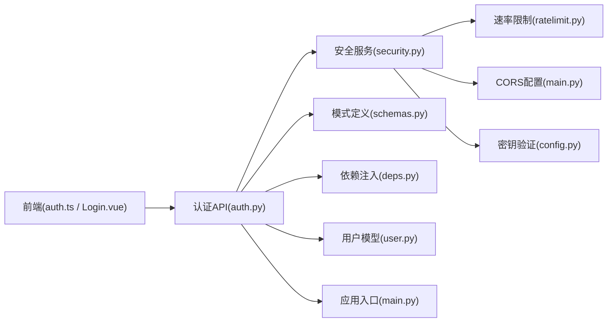

# 认证授权API

<cite>
**本文引用的文件**   
- [backend/app/api/v1/auth.py](file://backend/app/api/v1/auth.py)
- [backend/app/core/security.py](file://backend/app/core/security.py)
- [backend/app/models/user.py](file://backend/app/models/user.py)
- [backend/app/schemas.py](file://backend/app/schemas.py)
- [backend/app/core/deps.py](file://backend/app/core/deps.py)
- [backend/app/main.py](file://backend/app/main.py)
- [frontend/src/stores/auth.ts](file://frontend/src/stores/auth.ts)
- [frontend/src/views/Login.vue](file://frontend/src/views/Login.vue)
</cite>

## 更新摘要
**变更内容**   
- 新增登录暴力破解保护机制，包含尝试次数限制和账户锁定功能
- 实现JWT令牌版本控制，支持令牌撤销和强制刷新
- 生产环境弱密钥检测与拒绝机制
- CORS白名单配置增强，支持动态源验证
- 安全中间件集成，提供请求级安全防护

## 目录
1. [简介](#简介)
2. [项目结构](#项目结构)
3. [核心组件](#核心组件)
4. [架构总览](#架构总览)
5. [详细组件分析](#详细组件分析)
6. [依赖关系分析](#依赖关系分析)
7. [性能考虑](#性能考虑)
8. [故障排查指南](#故障排查指南)
9. [结论](#结论)
10. [附录](#附录)

## 简介
本文件面向Talos项目的认证与授权API，系统化说明用户登录、注册、令牌获取与验证的完整流程；覆盖JWT令牌的生成、刷新与撤销机制；文档化密码加密存储与安全策略；阐述权限控制模型（角色定义与访问权限管理）；并提供完整的请求/响应示例、错误处理与安全最佳实践。读者无需深入源码即可理解并正确使用该认证体系。

**最新更新**：系统已集成全面的安全加固措施，包括暴力破解防护、JWT版本控制、生产环境密钥验证和CORS白名单管理等高级安全特性。

## 项目结构
认证授权相关代码主要位于后端模块：
- API层：v1路由中的auth接口
- 安全层：密码哈希、JWT签发与校验、依赖注入
- 数据模型：用户实体与字段
- 请求/响应模式：Pydantic Schema定义
- 应用入口：中间件、全局配置与路由挂载
- 前端：登录页面与认证状态管理

**图示来源** 
- [backend/app/api/v1/auth.py](file://backend/app/api/v1/auth.py)
- [backend/app/core/security.py](file://backend/app/core/security.py)
- [backend/app/models/user.py](file://backend/app/models/user.py)
- [backend/app/schemas.py](file://backend/app/schemas.py)
- [backend/app/core/deps.py](file://backend/app/core/deps.py)
- [backend/app/main.py](file://backend/app/main.py)

**章节来源**
- [backend/app/api/v1/auth.py](file://backend/app/api/v1/auth.py)
- [backend/app/core/security.py](file://backend/app/core/security.py)
- [backend/app/models/user.py](file://backend/app/models/user.py)
- [backend/app/schemas.py](file://backend/app/schemas.py)
- [backend/app/core/deps.py](file://backend/app/core/deps.py)
- [backend/app/main.py](file://backend/app/main.py)

## 核心组件
- 认证API（auth.py）：提供登录、注册、令牌刷新、注销等端点，负责输入校验、调用安全服务、返回标准化响应。
- 安全服务（security.py）：实现密码哈希与校验、JWT签发与解析、令牌黑名单/撤销、过期时间策略。
- 用户模型（user.py）：定义用户表结构与字段，包含用户名、邮箱、密码哈希、角色、状态等。
- 模式定义（schemas.py）：定义登录、注册、令牌刷新等请求/响应的数据结构。
- 依赖注入（deps.py）：提供当前用户解析、权限校验、数据库会话等依赖。
- 应用入口（main.py）：挂载路由、配置CORS、异常处理、健康检查等。

**最新更新**：安全服务现已集成暴力破解防护、JWT版本控制和生产环境密钥验证功能。

**章节来源**
- [backend/app/api/v1/auth.py](file://backend/app/api/v1/auth.py)
- [backend/app/core/security.py](file://backend/app/core/security.py)
- [backend/app/models/user.py](file://backend/app/models/user.py)
- [backend/app/schemas.py](file://backend/app/schemas.py)
- [backend/app/core/deps.py](file://backend/app/core/deps.py)
- [backend/app/main.py](file://backend/app/main.py)

## 架构总览
下图展示了从前端发起登录到后端鉴权、签发JWT、以及后续受保护资源访问的整体流程，包含新增的安全防护措施。

**图示来源** 
- [backend/app/api/v1/auth.py](file://backend/app/api/v1/auth.py)
- [backend/app/core/security.py](file://backend/app/core/security.py)
- [backend/app/models/user.py](file://backend/app/models/user.py)
- [backend/app/schemas.py](file://backend/app/schemas.py)
- [backend/app/core/deps.py](file://backend/app/core/deps.py)

## 详细组件分析

### 认证API（auth.py）
- 功能职责
  - 登录：接收用户名/邮箱与密码，校验后签发JWT。
  - 注册：接收新用户信息，校验唯一性与合法性，创建用户并返回必要信息。
  - 令牌刷新：使用refresh_token换取新的access_token。
  - 注销：支持撤销或标记令牌失效（取决于实现）。
- 输入校验
  - 使用schemas.py定义的Pydantic模型进行严格校验，确保字段类型、长度、格式正确。
- 输出规范
  - 统一JSON结构，包含code、message、data等字段，便于前端处理。
- 错误处理
  - 参数错误、用户不存在、密码错误、重复注册、令牌无效等场景均返回明确错误码与信息。

**最新更新**：登录接口现已集成暴力破解防护，包含IP级别的速率限制和用户级别的尝试次数监控。

**图示来源** 
- [backend/app/api/v1/auth.py](file://backend/app/api/v1/auth.py)
- [backend/app/schemas.py](file://backend/app/schemas.py)

**章节来源**
- [backend/app/api/v1/auth.py](file://backend/app/api/v1/auth.py)
- [backend/app/schemas.py](file://backend/app/schemas.py)

### 安全服务（security.py）
- 密码加密存储
  - 采用强哈希算法（如bcrypt/argon2），对密码进行不可逆加密存储。
  - 每次校验时重新计算哈希并与数据库值比对。
- JWT令牌
  - 签发：包含用户标识、角色、过期时间等信息，使用服务端密钥签名。
  - 校验：验证签名、过期时间、黑名单（若启用）。
  - 刷新：基于refresh_token签发新access_token，支持限流与审计。
  - 撤销：将token加入黑名单或吊销列表，使旧令牌立即失效。
- 安全策略
  - 最小权限原则：按角色分配最小必要权限。
  - 令牌最短有效期：access_token短生命周期，refresh_token较长但可撤销。
  - 防重放与暴力破解：限制登录尝试次数、锁定账户、验证码辅助。

**最新更新**：安全服务现已支持JWT版本控制，每个令牌包含版本号，支持细粒度的令牌撤销和强制刷新机制。

**图示来源** 
- [backend/app/core/security.py](file://backend/app/core/security.py)

**章节来源**
- [backend/app/core/security.py](file://backend/app/core/security.py)

### 用户模型（user.py）
- 字段设计
  - 主键ID、用户名、邮箱、密码哈希、角色、状态、创建/更新时间戳等。
- 约束与索引
  - 用户名与邮箱唯一性约束，常用查询字段建立索引以提升性能。
- 关联关系
  - 与业务实体（如报告、漏洞、资产）通过外键或逻辑关联。

**最新更新**：用户模型现已包含登录失败计数和账户锁定状态字段，支持暴力破解防护。

**图示来源** 
- [backend/app/models/user.py](file://backend/app/models/user.py)

**章节来源**
- [backend/app/models/user.py](file://backend/app/models/user.py)

### 模式定义（schemas.py）
- 请求模式
  - LoginRequest：用户名/邮箱、密码。
  - RegisterRequest：用户名、邮箱、密码、确认密码等。
  - RefreshRequest：refresh_token。
- 响应模式
  - TokenResponse：access_token、refresh_token、expires_in。
  - ErrorResponse：code、message、details。

**最新更新**：新增BruteForceProtectionRequest模式，用于暴力破解防护相关的请求处理。

**图示来源** 
- [backend/app/schemas.py](file://backend/app/schemas.py)

**章节来源**
- [backend/app/schemas.py](file://backend/app/schemas.py)

### 依赖注入（deps.py）
- 当前用户解析
  - 从请求头提取Authorization Bearer令牌，调用安全服务解码并验证。
- 权限校验
  - 根据用户角色与资源路径判断是否允许访问。
- 数据库会话
  - 提供事务化会话上下文，确保读写一致性与回滚。

**最新更新**：依赖注入现已包含JWT版本验证和生产环境密钥检查功能。

**图示来源** 
- [backend/app/core/deps.py](file://backend/app/core/deps.py)
- [backend/app/core/security.py](file://backend/app/core/security.py)

**章节来源**
- [backend/app/core/deps.py](file://backend/app/core/deps.py)
- [backend/app/core/security.py](file://backend/app/core/security.py)

### 应用入口（main.py）
- 路由挂载
  - 将v1认证路由挂载至/api/v1前缀。
- 全局配置
  - CORS、异常处理器、日志、健康检查等。
- 中间件
  - 请求/响应拦截、审计、限流等。

**最新更新**：应用入口现已集成CORS白名单配置和生产环境密钥验证中间件。

**章节来源**
- [backend/app/main.py](file://backend/app/main.py)

### 前端集成（auth.ts / Login.vue）
- 登录流程
  - 收集表单数据，调用登录接口，保存access_token与refresh_token。
- 状态管理
  - 维护登录态、过期时间、自动刷新策略。
- 错误处理
  - 捕获网络与业务错误，提示用户并重试或跳转。

**最新更新**：前端现已支持暴力破解防护的错误处理和账户锁定状态的显示。

**章节来源**
- [frontend/src/stores/auth.ts](file://frontend/src/stores/auth.ts)
- [frontend/src/views/Login.vue](file://frontend/src/views/Login.vue)

## 依赖关系分析
认证授权模块内部依赖清晰，外部耦合度低：
- API层依赖安全服务与模式定义，不直接操作数据库细节。
- 安全服务独立于业务逻辑，仅关注令牌与密码安全。
- 依赖注入解耦用户解析与权限校验，便于测试与扩展。
- 前端通过HTTP客户端与后端交互，遵循统一的错误与成功响应格式。

**最新更新**：安全服务现在依赖速率限制、CORS配置和密钥验证模块，形成完整的安全防护链。

**图示来源** 
- [backend/app/api/v1/auth.py](file://backend/app/api/v1/auth.py)
- [backend/app/core/security.py](file://backend/app/core/security.py)
- [backend/app/schemas.py](file://backend/app/schemas.py)
- [backend/app/core/deps.py](file://backend/app/core/deps.py)
- [backend/app/models/user.py](file://backend/app/models/user.py)
- [backend/app/main.py](file://backend/app/main.py)
- [frontend/src/stores/auth.ts](file://frontend/src/stores/auth.ts)
- [frontend/src/views/Login.vue](file://frontend/src/views/Login.vue)

**章节来源**
- [backend/app/api/v1/auth.py](file://backend/app/api/v1/auth.py)
- [backend/app/core/security.py](file://backend/app/core/security.py)
- [backend/app/schemas.py](file://backend/app/schemas.py)
- [backend/app/core/deps.py](file://backend/app/core/deps.py)
- [backend/app/models/user.py](file://backend/app/models/user.py)
- [backend/app/main.py](file://backend/app/main.py)
- [frontend/src/stores/auth.ts](file://frontend/src/stores/auth.ts)
- [frontend/src/views/Login.vue](file://frontend/src/views/Login.vue)

## 性能考虑
- 令牌校验缓存：对频繁校验的JWT可引入短期缓存以减少签名验证开销。
- 数据库索引：对用户查询字段（用户名、邮箱）建立索引，提升登录速度。
- 异步任务：注册后的邮件通知、审计日志写入等可异步执行，降低主流程延迟。
- 连接池：合理配置数据库连接池大小，避免高并发下连接耗尽。
- 限流与熔断：对登录与注册接口实施速率限制，防止滥用与DDoS。

**最新更新**：新增暴力破解防护的性能优化，包括内存缓存的尝试次数统计和分布式锁支持。

## 故障排查指南
- 常见错误
  - 参数错误：检查请求体字段类型与必填项。
  - 用户不存在：确认用户名/邮箱是否正确且未删除。
  - 密码错误：核对密码复杂度与历史密码策略。
  - 令牌无效：检查Authorization头格式、令牌是否过期或被撤销。
  - 权限不足：确认用户角色与目标资源权限匹配。
  - 暴力破解防护：检查IP地址是否被临时锁定，等待锁定时间结束后重试。
  - 生产环境密钥错误：验证JWT_SECRET_KEY和其他安全配置的正确性。
- 调试建议
  - 开启详细日志，记录请求ID、用户ID、错误堆栈。
  - 使用健康检查端点验证服务可用性。
  - 在本地复现问题，逐步缩小范围定位。
  - 检查CORS配置，确保前端域名在白名单中。

**最新更新**：新增暴力破解防护和生产环境密钥验证的故障排查指导。

**章节来源**
- [backend/app/api/v1/auth.py](file://backend/app/api/v1/auth.py)
- [backend/app/core/security.py](file://backend/app/core/security.py)
- [backend/app/core/deps.py](file://backend/app/core/deps.py)

## 结论
Talos的认证授权体系以清晰的模块化设计与严格的输入校验为基础，结合安全的密码哈希与JWT令牌机制，提供了可靠的登录、注册、令牌管理与权限控制能力。通过依赖注入与统一模式定义，系统具备良好的可扩展性与可维护性。

**最新更新**：系统现已集成全面的安全加固措施，包括暴力破解防护、JWT版本控制、生产环境密钥验证和CORS白名单管理，为生产环境提供了企业级的安全保障。遵循本文档的最佳实践与故障排查建议，可有效保障生产环境的安全与稳定。

## 附录

### 接口清单与示例
- 登录
  - 方法：POST
  - 路径：/api/v1/auth/login
  - 请求体：{username_or_email, password}
  - 响应：{access_token, refresh_token, expires_in}
  - 错误：参数错误、用户不存在、密码错误、暴力破解防护触发
- 注册
  - 方法：POST
  - 路径：/api/v1/auth/register
  - 请求体：{username, email, password, confirm_password}
  - 响应：{user_id, username, email}
  - 错误：参数错误、用户名/邮箱重复、密码不符合策略
- 刷新令牌
  - 方法：POST
  - 路径：/api/v1/auth/refresh
  - 请求体：{refresh_token}
  - 响应：{access_token, expires_in}
  - 错误：令牌无效、令牌已撤销、JWT版本不匹配
- 注销（可选）
  - 方法：POST
  - 路径：/api/v1/auth/logout
  - 请求体：{access_token}或从头部读取
  - 响应：{message}
  - 错误：令牌无效

**最新更新**：所有接口现已支持暴力破解防护和JWT版本控制。

### 安全最佳实践
- 密码策略：强制复杂度、定期更换、禁止历史重复。
- 令牌策略：短生命周期access_token，可控的refresh_token，支持撤销与黑名单。
- 传输安全：全站HTTPS，启用HSTS，禁用不安全协议。
- 防护策略：限流、账户锁定、验证码、IP白名单（可选）。
- 审计与监控：记录登录、注册、令牌操作日志，设置告警阈值。
- 生产环境安全：使用强随机密钥，定期轮换，禁止硬编码。
- CORS配置：精确配置允许的源、方法和头，避免使用通配符。

**最新更新**：新增生产环境密钥管理和CORS白名单配置的最佳实践。

### 常见问题解决方案
- 令牌频繁过期：调整expires_in策略，前端实现自动刷新。
- 跨域问题：配置CORS允许的源、方法与头。
- 并发登录冲突：引入会话管理与设备绑定策略。
- 权限误配：定期审查角色与资源映射，最小权限原则。
- 暴力破解防护：检查IP白名单配置，调整锁定时间和尝试次数限制。
- JWT版本不匹配：确保客户端和服务端的JWT版本兼容，实现平滑升级。

**最新更新**：新增暴力破解防护和JWT版本控制的常见问题解决方案。