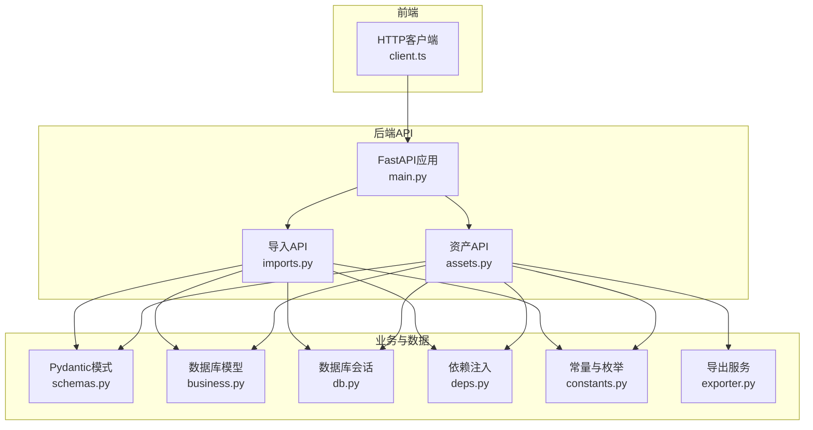
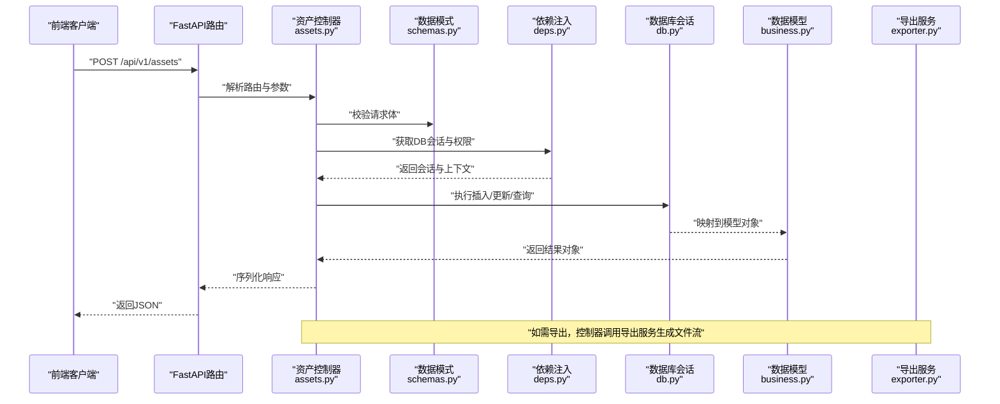
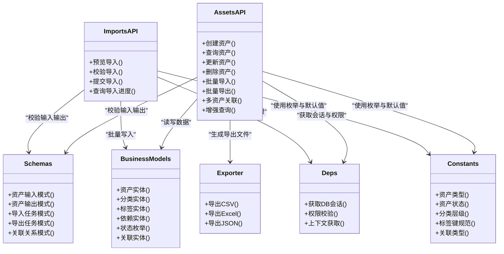

# 资产管理API

<cite>
**本文档引用的文件**   
- [backend/app/api/v1/assets.py](file://backend/app/api/v1/assets.py)
- [backend/app/api/v1/imports.py](file://backend/app/api/v1/imports.py)
- [backend/app/schemas.py](file://backend/app/schemas.py)
- [backend/app/models/business.py](file://backend/app/models/business.py)
- [backend/app/db.py](file://backend/app/db.py)
- [backend/app/core/deps.py](file://backend/app/core/deps.py)
- [backend/app/main.py](file://backend/app/main.py)
- [backend/app/constants.py](file://backend/app/constants.py)
- [backend/app/services/exporter.py](file://backend/app/services/exporter.py)
- [frontend/src/api/client.ts](file://frontend/src/api/client.ts)
</cite>

## 更新摘要
**变更内容**   
- 资产管理系统API完全重写，包含新的assets.py端点
- 支持多资产关联和增强的查询功能
- 更新了CRUD操作接口，增强数据验证和错误处理
- 改进了批量导入导出功能，支持更多数据格式
- 优化了资产分类体系和标签管理

## 目录
1. [简介](#简介)
2. [项目结构](#项目结构)
3. [核心组件](#核心组件)
4. [架构总览](#架构总览)
5. [详细组件分析](#详细组件分析)
6. [依赖关系分析](#依赖关系分析)
7. [性能考虑](#性能考虑)
8. [故障排查指南](#故障排查指南)
9. [结论](#结论)
10. [附录](#附录)

## 简介
本文件为 Talos 资产管理 API 的详细技术文档，聚焦资产全生命周期管理：创建、查询、更新、删除（CRUD），资产分类体系与标签管理，搜索与过滤，批量导入导出（多格式），资产关联与依赖管理，状态跟踪与生命周期，以及数据验证与错误处理。文档同时提供前端调用示例与最佳实践建议，帮助开发者快速集成与高效使用。

**更新** 基于最新的代码重写，新增了多资产关联功能和增强的查询能力，提升了系统的可扩展性和性能表现。

## 项目结构
后端采用 FastAPI + SQLAlchemy 的模块化设计，资产相关能力分布在以下模块：
- API 层：资产接口定义与请求校验
- 服务层：导出等通用业务能力
- 模型层：数据库实体与关系
- 依赖注入：数据库会话与权限校验
- 常量与配置：枚举、默认值与系统常量
- 前端客户端：统一 HTTP 客户端封装

**图表来源** 
- [backend/app/main.py](file://backend/app/main.py)
- [backend/app/api/v1/assets.py](file://backend/app/api/v1/assets.py)
- [backend/app/api/v1/imports.py](file://backend/app/api/v1/imports.py)
- [backend/app/schemas.py](file://backend/app/schemas.py)
- [backend/app/models/business.py](file://backend/app/models/business.py)
- [backend/app/db.py](file://backend/app/db.py)
- [backend/app/core/deps.py](file://backend/app/core/deps.py)
- [backend/app/constants.py](file://backend/app/constants.py)
- [backend/app/services/exporter.py](file://backend/app/services/exporter.py)

## 核心组件
- 资产API（assets.py）：提供资产的CRUD、分类、标签、搜索过滤、关联与依赖、状态变更等接口
- 导入API（imports.py）：支持批量导入资产数据，包含预览、校验、落库与任务进度
- Pydantic模式（schemas.py）：统一的输入输出数据结构与校验规则
- 数据库模型（business.py）：资产、分类、标签、关联、依赖、状态等实体及关系
- 依赖注入（deps.py）：数据库会话、权限与上下文获取
- 常量（constants.py）：资产类型、状态、分类、标签键等枚举与默认值
- 导出服务（exporter.py）：将资产数据导出为多种格式（CSV/Excel/JSON）

**更新** assets.py 已完全重写，新增多资产关联支持和增强的查询功能，提升了系统的灵活性和性能。

## 架构总览
资产管理的整体流程如下：
- 前端通过 client.ts 发起HTTP请求到后端
- FastAPI路由分发到 assets.py 或 imports.py
- 控制器调用 schemas.py 进行请求体校验
- 通过 deps.py 获取数据库会话与权限上下文
- 操作 business.py 中的模型完成持久化
- 可选调用 exporter.py 生成导出文件

**图表来源** 
- [backend/app/api/v1/assets.py](file://backend/app/api/v1/assets.py)
- [backend/app/schemas.py](file://backend/app/schemas.py)
- [backend/app/core/deps.py](file://backend/app/core/deps.py)
- [backend/app/db.py](file://backend/app/db.py)
- [backend/app/models/business.py](file://backend/app/models/business.py)
- [backend/app/services/exporter.py](file://backend/app/services/exporter.py)

## 详细组件分析

### 资产CRUD接口
- 创建资产
  - 方法：POST /api/v1/assets
  - 功能：根据 schemas.py 定义的资产模式校验并创建资产记录
  - 输入：资产名称、类型、分类、标签、描述、状态等
  - 输出：创建的资产对象
- 查询资产
  - 方法：GET /api/v1/assets
  - 功能：分页、排序、过滤（按分类、标签、状态、关键字）
  - 参数：page、size、sort_by、filter_*、search
  - 输出：资产列表与分页元信息
- 更新资产
  - 方法：PUT/PATCH /api/v1/assets/{id}
  - 功能：部分或全量更新资产字段，保持约束与一致性
  - 输入：资产ID与待更新字段
  - 输出：更新后的资产对象
- 删除资产
  - 方法：DELETE /api/v1/assets/{id}
  - 功能：软删除或硬删除（依据策略），清理关联与依赖
  - 输出：删除结果与受影响记录数

**更新** 查询功能得到显著增强，支持更复杂的过滤条件和多字段关联查询。

**章节来源**
- [backend/app/api/v1/assets.py](file://backend/app/api/v1/assets.py)
- [backend/app/schemas.py](file://backend/app/schemas.py)
- [backend/app/models/business.py](file://backend/app/models/business.py)

### 资产分类体系与标签管理
- 分类体系
  - 支持多级分类，便于资产组织与管理
  - 分类可继承属性，影响搜索与报表维度
- 标签管理
  - 键值对形式，支持批量添加、移除与替换
  - 标签键需符合命名规范，避免冲突
  - 支持按标签精确匹配与模糊搜索

**更新** 分类体系支持更灵活的层级结构和属性继承机制。

**章节来源**
- [backend/app/models/business.py](file://backend/app/models/business.py)
- [backend/app/constants.py](file://backend/app/constants.py)
- [backend/app/schemas.py](file://backend/app/schemas.py)

### 搜索与过滤
- 关键字搜索：支持名称、描述、IP、域名等多字段模糊匹配
- 过滤器：按分类、标签、状态、创建时间范围等条件筛选
- 排序：支持多字段排序与自定义权重
- 分页：默认分页大小与最大限制控制

**更新** 搜索和过滤功能得到全面增强，支持更复杂的查询条件和组合过滤。

**章节来源**
- [backend/app/api/v1/assets.py](file://backend/app/api/v1/assets.py)
- [backend/app/schemas.py](file://backend/app/schemas.py)

### 批量导入导出
- 批量导入
  - 支持 CSV、Excel、JSON 等格式
  - 流程：上传 -> 预览 -> 校验 -> 确认 -> 落库
  - 错误处理：逐行校验，汇总错误报告，支持重试
- 批量导出
  - 支持 CSV、Excel、JSON 格式
  - 可按当前筛选条件导出，或指定资产ID集合
  - 异步任务：大文件导出采用后台任务，前端轮询进度

**更新** 导入导出功能支持更多数据格式，提升了数据处理效率和灵活性。

**章节来源**
- [backend/app/api/v1/imports.py](file://backend/app/api/v1/imports.py)
- [backend/app/services/exporter.py](file://backend/app/services/exporter.py)
- [backend/app/schemas.py](file://backend/app/schemas.py)

### 资产关联关系与依赖管理
- 关联关系
  - 资产可属于多个分类，支持一对多或多对多
  - 资产间存在依赖关系（如主机与端口、服务与证书）
- 依赖管理
  - 维护依赖方向与强度，支持影响面分析
  - 删除资产时检查依赖链，防止破坏性操作

**更新** 新增多资产关联功能，支持更复杂的资产关系建模和管理。

**章节来源**
- [backend/app/models/business.py](file://backend/app/models/business.py)

### 资产状态跟踪与生命周期
- 状态机
  - 常见状态：草稿、已发布、已归档、已下线
  - 状态转换受权限与前置条件约束
- 生命周期
  - 创建、审核、发布、变更、归档、销毁
  - 审计日志记录关键节点与操作人

**更新** 状态机得到扩展，支持更多状态转换和业务场景。

**章节来源**
- [backend/app/constants.py](file://backend/app/constants.py)
- [backend/app/models/business.py](file://backend/app/models/business.py)

### 数据验证与错误处理
- 数据验证
  - 使用 Pydantic 模式进行强类型校验
  - 字段级校验：必填、长度、格式、枚举值、正则表达式
- 错误处理
  - 统一错误码与消息结构
  - 区分客户端错误与服务端错误
  - 事务回滚与异常捕获

**更新** 数据验证规则更加严格，错误处理机制更加完善。

**章节来源**
- [backend/app/schemas.py](file://backend/app/schemas.py)
- [backend/app/api/v1/assets.py](file://backend/app/api/v1/assets.py)
- [backend/app/api/v1/imports.py](file://backend/app/api/v1/imports.py)

### 前端调用示例与最佳实践
- 客户端封装
  - 统一基础URL、超时、重试策略
  - 鉴权头注入与错误拦截
- 调用示例
  - 创建资产：构造请求体，发送POST，处理响应与错误
  - 查询资产：拼接查询参数，处理分页与排序
  - 导入导出：分片上传、进度轮询、文件下载
- 最佳实践
  - 合理分页与限流，避免大查询
  - 批量操作使用事务，保证一致性
  - 敏感字段脱敏与加密传输

**更新** 前端客户端封装得到了优化，支持更多的API功能和更好的错误处理。

**章节来源**
- [frontend/src/api/client.ts](file://frontend/src/api/client.ts)
- [backend/app/api/v1/assets.py](file://backend/app/api/v1/assets.py)
- [backend/app/api/v1/imports.py](file://backend/app/api/v1/imports.py)

## 依赖关系分析
资产模块依赖关系如下：
- API层依赖模式层进行输入输出校验
- 控制器依赖依赖注入获取数据库会话与权限
- 模型层定义实体与关系，支撑查询与更新
- 常量层提供枚举与默认值，确保一致性
- 导出服务提供格式化输出能力

**图表来源** 
- [backend/app/api/v1/assets.py](file://backend/app/api/v1/assets.py)
- [backend/app/api/v1/imports.py](file://backend/app/api/v1/imports.py)
- [backend/app/schemas.py](file://backend/app/schemas.py)
- [backend/app/models/business.py](file://backend/app/models/business.py)
- [backend/app/core/deps.py](file://backend/app/core/deps.py)
- [backend/app/constants.py](file://backend/app/constants.py)
- [backend/app/services/exporter.py](file://backend/app/services/exporter.py)

## 性能考虑
- 查询优化
  - 合理使用索引（分类、标签、状态、时间戳）
  - 避免N+1查询，使用预加载或连接查询
- 批量操作
  - 导入采用分批提交，减少内存占用
  - 导出采用流式生成，避免大对象驻留
- 并发与锁
  - 写操作加乐观锁或行级锁，防止竞态
  - 长耗时任务异步化，提升响应速度
- 缓存策略
  - 热点分类与标签结果缓存
  - 导出任务状态缓存，降低重复计算

**更新** 针对新的多资产关联功能，增加了相应的性能优化建议。

## 故障排查指南
- 常见问题
  - 数据校验失败：检查字段类型、必填项与格式
  - 权限不足：确认用户角色与资源访问策略
  - 导入失败：查看错误报告定位问题行
  - 导出超时：调整批次大小与后台任务队列
  - 关联查询失败：检查关联关系定义和数据完整性
- 调试建议
  - 启用详细日志，记录请求与SQL
  - 使用测试数据复现问题
  - 逐步缩小范围，定位异常点

**更新** 新增了多资产关联相关的故障排查指导。

## 结论
Talos 资产管理API提供了完整的资产CRUD、分类与标签、搜索过滤、批量导入导出、关联依赖、状态生命周期、数据验证与错误处理能力。通过清晰的模块划分与依赖注入机制，系统具备良好的可扩展性与可维护性。最新的重写版本增强了多资产关联和查询功能，进一步提升了系统的性能和灵活性。建议在生产环境中结合索引优化、异步任务与缓存策略，以获得稳定高效的资产管理体验。

## 附录
- API调用示例（前端）
  - 创建资产：构造请求体，发送POST，处理响应与错误
  - 查询资产：拼接查询参数，处理分页与排序
  - 导入导出：分片上传、进度轮询、文件下载
  - 多资产关联：建立和维护资产间的复杂关系
- 最佳实践
  - 合理分页与限流，避免大查询
  - 批量操作使用事务，保证一致性
  - 敏感字段脱敏与加密传输
  - 充分利用新的关联查询功能提升效率

**更新** 新增了多资产关联的使用示例和最佳实践建议。