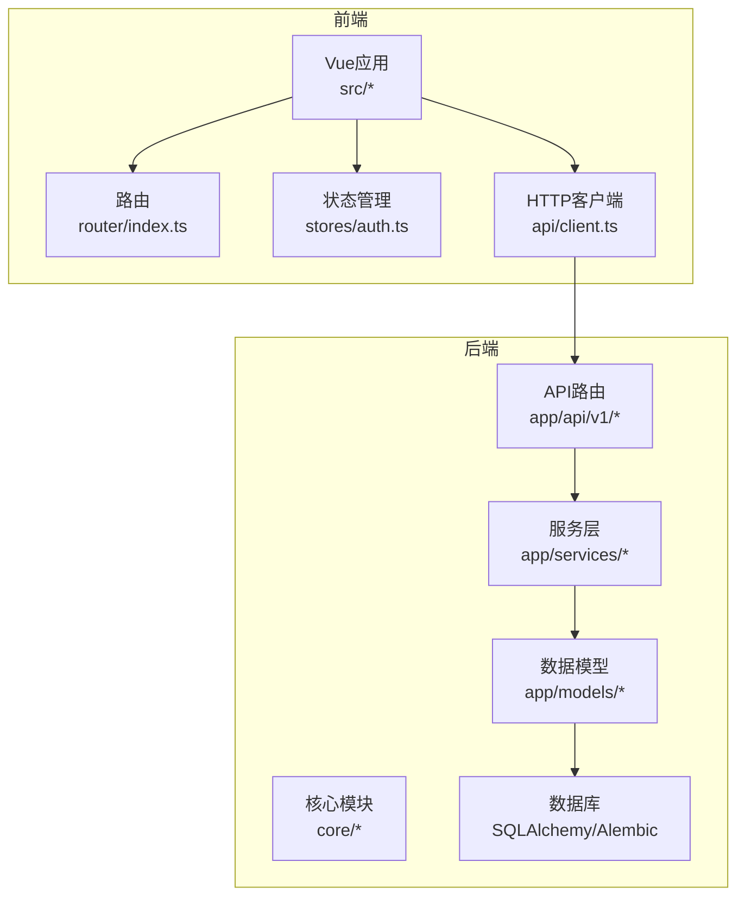
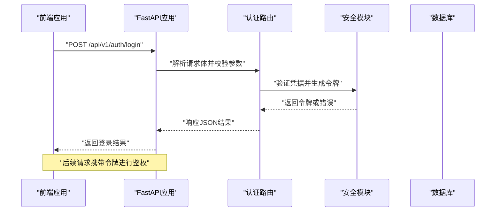
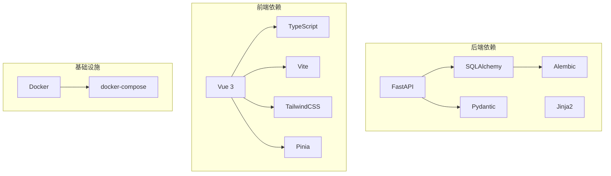

# 代码规范

<cite>
**本文引用的文件**   
- [backend/app/main.py](file://backend/app/main.py)
- [backend/app/core/config.py](file://backend/app/core/config.py)
- [backend/app/core/deps.py](file://backend/app/core/deps.py)
- [backend/app/core/security.py](file://backend/app/core/security.py)
- [backend/app/api/v1/auth.py](file://backend/app/api/v1/auth.py)
- [backend/app/api/v1/users.py](file://backend/app/api/v1/users.py)
- [backend/app/api/v1/assets.py](file://backend/app/api/v1/assets.py)
- [backend/app/api/v1/reports.py](file://backend/app/api/v1/reports.py)
- [backend/app/api/v1/vulns.py](file://backend/app/api/v1/vulns.py)
- [backend/app/models/user.py](file://backend/app/models/user.py)
- [backend/app/models/business.py](file://backend/app/models/business.py)
- [backend/app/schemas.py](file://backend/app/schemas.py)
- [backend/app/db.py](file://backend/app/db.py)
- [backend/requirements.txt](file://backend/requirements.txt)
- [frontend/src/main.ts](file://frontend/src/main.ts)
- [frontend/src/App.vue](file://frontend/src/App.vue)
- [frontend/src/router/index.ts](file://frontend/src/router/index.ts)
- [frontend/src/stores/auth.ts](file://frontend/src/stores/auth.ts)
- [frontend/src/api/client.ts](file://frontend/src/api/client.ts)
- [frontend/package.json](file://frontend/package.json)
- [frontend/tsconfig.json](file://frontend/tsconfig.json)
- [frontend/tailwind.config.js](file://frontend/tailwind.config.js)
- [docker-compose.yml](file://docker-compose.yml)
</cite>

## 目录
1. [简介](#简介)
2. [项目结构](#项目结构)
3. [核心组件](#核心组件)
4. [架构总览](#架构总览)
5. [详细组件分析](#详细组件分析)
6. [依赖分析](#依赖分析)
7. [性能考虑](#性能考虑)
8. [故障排查指南](#故障排查指南)
9. [结论](#结论)
10. [附录](#附录)

## 简介
本文件为Talos项目的代码规范与开发约定，覆盖Python后端、TypeScript/Vue前端、API设计原则、Git工作流、代码质量检查工具配置以及重构与安全编码最佳实践。目标是让不同背景的开发者都能遵循统一标准，提升可维护性、可读性与安全性。

## 项目结构
- 后端采用FastAPI + SQLAlchemy（Alembic迁移）+ Celery/Redis（workers）的典型分层：API路由层、服务层、数据模型层、核心配置与安全模块。
- 前端基于Vue 3 + TypeScript + Vite + TailwindCSS，按功能域组织视图与组件，使用Pinia进行状态管理，通过统一的HTTP客户端访问后端API。
- 容器化部署由docker-compose编排前后端服务。

**图示来源** 
- [backend/app/main.py](file://backend/app/main.py)
- [backend/app/api/v1/auth.py](file://backend/app/api/v1/auth.py)
- [backend/app/api/v1/users.py](file://backend/app/api/v1/users.py)
- [backend/app/api/v1/assets.py](file://backend/app/api/v1/assets.py)
- [backend/app/api/v1/reports.py](file://backend/app/api/v1/reports.py)
- [backend/app/api/v1/vulns.py](file://backend/app/api/v1/vulns.py)
- [backend/app/services/plan_service.py](file://backend/app/services/plan_service.py)
- [backend/app/services/report_builder.py](file://backend/app/services/report_builder.py)
- [backend/app/services/vuln_service.py](file://backend/app/services/vuln_service.py)
- [backend/app/models/user.py](file://backend/app/models/user.py)
- [backend/app/models/business.py](file://backend/app/models/business.py)
- [backend/app/db.py](file://backend/app/db.py)
- [frontend/src/main.ts](file://frontend/src/main.ts)
- [frontend/src/App.vue](file://frontend/src/App.vue)
- [frontend/src/router/index.ts](file://frontend/src/router/index.ts)
- [frontend/src/stores/auth.ts](file://frontend/src/stores/auth.ts)
- [frontend/src/api/client.ts](file://frontend/src/api/client.ts)

**章节来源**
- [backend/app/main.py](file://backend/app/main.py)
- [frontend/src/main.ts](file://frontend/src/main.ts)
- [docker-compose.yml](file://docker-compose.yml)

## 核心组件
- 后端入口与中间件：FastAPI应用初始化、CORS、鉴权中间件、异常处理等。
- API路由：按资源划分v1接口，包含认证、用户、资产、报告、漏洞等。
- 服务层：业务逻辑封装，如计划服务、报告构建、漏洞服务等。
- 数据模型：SQLAlchemy模型定义与关系映射。
- 核心模块：配置、依赖注入、安全策略（密码哈希、令牌签发）。
- 前端应用：Vue应用初始化、路由、状态管理、HTTP客户端封装。

**章节来源**
- [backend/app/main.py](file://backend/app/main.py)
- [backend/app/core/config.py](file://backend/app/core/config.py)
- [backend/app/core/deps.py](file://backend/app/core/deps.py)
- [backend/app/core/security.py](file://backend/app/core/security.py)
- [backend/app/api/v1/auth.py](file://backend/app/api/v1/auth.py)
- [backend/app/api/v1/users.py](file://backend/app/api/v1/users.py)
- [backend/app/api/v1/assets.py](file://backend/app/api/v1/assets.py)
- [backend/app/api/v1/reports.py](file://backend/app/api/v1/reports.py)
- [backend/app/api/v1/vulns.py](file://backend/app/api/v1/vulns.py)
- [backend/app/services/plan_service.py](file://backend/app/services/plan_service.py)
- [backend/app/services/report_builder.py](file://backend/app/services/report_builder.py)
- [backend/app/services/vuln_service.py](file://backend/app/services/vuln_service.py)
- [backend/app/models/user.py](file://backend/app/models/user.py)
- [backend/app/models/business.py](file://backend/app/models/business.py)
- [backend/app/schemas.py](file://backend/app/schemas.py)
- [backend/app/db.py](file://backend/app/db.py)
- [frontend/src/main.ts](file://frontend/src/main.ts)
- [frontend/src/App.vue](file://frontend/src/App.vue)
- [frontend/src/router/index.ts](file://frontend/src/router/index.ts)
- [frontend/src/stores/auth.ts](file://frontend/src/stores/auth.ts)
- [frontend/src/api/client.ts](file://frontend/src/api/client.ts)

## 架构总览
后端采用分层架构：API路由接收请求，调用服务层执行业务逻辑，服务层操作数据模型并通过ORM访问数据库；核心模块提供配置、依赖注入与安全能力。前端通过HTTP客户端调用后端REST API，路由与状态管理驱动页面渲染与交互。

**图示来源** 
- [backend/app/api/v1/auth.py](file://backend/app/api/v1/auth.py)
- [backend/app/core/security.py](file://backend/app/core/security.py)
- [backend/app/main.py](file://backend/app/main.py)

## 详细组件分析

### Python后端代码规范
- PEP8与风格
  - 使用一致的缩进（4空格）、行宽限制（建议≤120字符）、空行分隔逻辑块。
  - 导入顺序：标准库、第三方库、本地模块，按字母排序。
  - 常量使用全大写蛇形命名，变量与函数使用小写蛇形命名，类名使用大驼峰命名。
- 文件组织结构
  - app/api/v1：按资源划分的API路由文件，每个文件对应一个领域（auth、users、assets、reports、vulns等）。
  - app/services：业务逻辑封装，避免在路由中直接实现复杂逻辑。
  - app/models：数据模型定义，保持单一职责，明确字段类型与约束。
  - app/core：核心配置、依赖注入、安全策略等横切关注点。
  - app/schemas：Pydantic模型用于请求/响应校验与序列化。
- 注释标准
  - 模块级docstring说明用途、作者、版本。
  - 公共函数/类必须包含描述性docstring，参数与返回值说明清晰。
  - 复杂逻辑添加行内注释解释“为什么”，而非“做了什么”。
- 错误处理
  - 使用HTTPException抛出标准化错误，包含状态码与消息。
  - 对输入校验失败统一返回422，业务错误返回4xx/5xx。
  - 全局异常处理器捕获未预期异常并记录日志。
- 配置与环境
  - 使用环境变量加载配置，敏感信息不硬编码。
  - 配置文件集中管理，支持多环境切换。
- 数据库与迁移
  - 使用SQLAlchemy ORM，模型变更通过Alembic迁移脚本管理。
  - 事务边界清晰，避免长事务与N+1查询。
- 依赖注入
  - 使用FastAPI的Depends进行依赖注入，提高可测试性与解耦。
- 异步与并发
  - I/O密集型任务使用async/await，CPU密集型任务交由Celery workers处理。
- 测试
  - 使用pytest编写单元测试与集成测试，覆盖关键路径与边界条件。
  - 测试数据隔离，使用fixture管理共享数据。

**章节来源**
- [backend/app/api/v1/auth.py](file://backend/app/api/v1/auth.py)
- [backend/app/api/v1/users.py](file://backend/app/api/v1/users.py)
- [backend/app/api/v1/assets.py](file://backend/app/api/v1/assets.py)
- [backend/app/api/v1/reports.py](file://backend/app/api/v1/reports.py)
- [backend/app/api/v1/vulns.py](file://backend/app/api/v1/vulns.py)
- [backend/app/services/plan_service.py](file://backend/app/services/plan_service.py)
- [backend/app/services/report_builder.py](file://backend/app/services/report_builder.py)
- [backend/app/services/vuln_service.py](file://backend/app/services/vuln_service.py)
- [backend/app/models/user.py](file://backend/app/models/user.py)
- [backend/app/models/business.py](file://backend/app/models/business.py)
- [backend/app/schemas.py](file://backend/app/schemas.py)
- [backend/app/core/config.py](file://backend/app/core/config.py)
- [backend/app/core/deps.py](file://backend/app/core/deps.py)
- [backend/app/core/security.py](file://backend/app/core/security.py)
- [backend/app/db.py](file://backend/app/db.py)
- [backend/requirements.txt](file://backend/requirements.txt)

### TypeScript/Vue前端代码规范
- 组件命名
  - 组件文件名使用大驼峰（PascalCase），如AssetFormDialog.vue。
  - 组件内部默认导出，props与emits使用TypeScript接口定义。
- 样式组织
  - 使用TailwindCSS原子类，避免自定义CSS冲突。
  - 主题色与颜色变量集中在utils/colors.ts管理。
- 导入导出
  - 使用ES模块语法，按需导入减少包体积。
  - 相对路径导入，避免深层嵌套路径。
- 路由与布局
  - 路由定义在router/index.ts，按功能域划分路由组。
  - 布局组件复用，如MainLayout.vue统一管理导航与侧边栏。
- 状态管理
  - 使用Pinia stores管理全局状态，如auth.ts负责认证状态。
  - 状态变更通过actions触发，保持单向数据流。
- HTTP客户端
  - 统一封装在api/client.ts，处理请求拦截、错误重试与Token注入。
- 类型安全
  - 启用严格模式，定义API响应类型与表单数据结构。
- 构建与优化
  - 使用Vite进行快速构建，按需加载组件与插件。
  - 生产环境启用压缩与缓存策略。

**章节来源**
- [frontend/src/App.vue](file://frontend/src/App.vue)
- [frontend/src/router/index.ts](file://frontend/src/router/index.ts)
- [frontend/src/stores/auth.ts](file://frontend/src/stores/auth.ts)
- [frontend/src/api/client.ts](file://frontend/src/api/client.ts)
- [frontend/src/utils/colors.ts](file://frontend/src/utils/colors.ts)
- [frontend/package.json](file://frontend/package.json)
- [frontend/tsconfig.json](file://frontend/tsconfig.json)
- [frontend/tailwind.config.js](file://frontend/tailwind.config.js)

### API设计原则
- RESTful规范
  - 使用名词表示资源，动词表示操作（GET/POST/PUT/DELETE）。
  - 资源层级清晰，如/api/v1/users/{id}/assets。
  - 使用HTTP状态码表达结果，成功2xx，客户端错误4xx，服务器错误5xx。
- 错误处理
  - 统一错误响应格式，包含code、message、details字段。
  - 输入校验失败返回422，业务规则违反返回400/403。
- 版本管理
  - URL中包含版本号（/api/v1），向后兼容升级。
  - 废弃接口标记deprecated，保留过渡期。
- 认证与授权
  - 使用JWT令牌进行身份验证，敏感操作需权限校验。
  - 支持刷新令牌机制，提升用户体验。
- 分页与过滤
  - 列表接口支持分页参数（page、size），过滤参数使用查询字符串。
  - 排序字段与方向可配置，避免全量数据返回。

**章节来源**
- [backend/app/api/v1/auth.py](file://backend/app/api/v1/auth.py)
- [backend/app/api/v1/users.py](file://backend/app/api/v1/users.py)
- [backend/app/api/v1/assets.py](file://backend/app/api/v1/assets.py)
- [backend/app/api/v1/reports.py](file://backend/app/api/v1/reports.py)
- [backend/app/api/v1/vulns.py](file://backend/app/api/v1/vulns.py)
- [backend/app/schemas.py](file://backend/app/schemas.py)

### Git提交信息规范
- 提交类型
  - feat：新功能
  - fix：修复bug
  - docs：文档更新
  - style：代码格式调整
  - refactor：重构代码
  - test：测试相关
  - chore：构建过程或辅助工具变动
- 提交格式
  - <type>(<scope>): <subject>
  - 主体简洁明了，不超过50字符。
  - 详细描述可选，说明动机与变更影响。
- 分支命名
  - feature/<功能名>：新功能开发
  - bugfix/<问题号>：缺陷修复
  - hotfix/<紧急修复>：线上紧急修复
  - release/<版本号>：发布分支
- 代码审查流程
  - 所有变更需通过Pull Request审查。
  - 至少一名维护者批准后方可合并。
  - 自动化检查通过后才能合并。

### 代码质量检查工具配置
- 后端（Python）
  - flake8：代码风格检查，配置忽略规则与最大行长。
  - black：代码格式化，确保一致性。
  - mypy：类型检查，提升类型安全。
  - pytest：单元测试框架，覆盖率统计。
- 前端（TypeScript/Vue）
  - eslint：代码风格与错误检查，集成Vue插件。
  - prettier：代码格式化，统一风格。
  - vue-tsc：Vue组件类型检查。
  - vitest：单元测试框架，快速执行。
- 集成CI/CD
  - 在GitHub Actions或GitLab CI中运行检查任务。
  - 失败时阻止合并，确保代码质量。

### 代码重构最佳实践
- 小步快跑，频繁提交，保持每次变更最小化。
- 提取函数与类，提高内聚性与可复用性。
- 使用依赖注入降低耦合度，便于测试。
- 逐步替换遗留代码，避免一次性大规模重写。
- 添加单元测试保护重构过程，确保行为不变。

### 安全编码指南
- 输入验证与输出编码，防止注入攻击。
- 敏感信息加密存储，如密码使用bcrypt哈希。
- 使用HTTPS传输，启用HSTS与CSP策略。
- 最小权限原则，限制数据库与文件系统访问。
- 定期依赖扫描，及时修复已知漏洞。

## 依赖分析
后端依赖FastAPI、SQLAlchemy、Alembic、Pydantic、Jinja2等；前端依赖Vue 3、TypeScript、Vite、TailwindCSS、Pinia等。容器化部署通过docker-compose编排服务。

**图示来源** 
- [backend/requirements.txt](file://backend/requirements.txt)
- [frontend/package.json](file://frontend/package.json)
- [docker-compose.yml](file://docker-compose.yml)

**章节来源**
- [backend/requirements.txt](file://backend/requirements.txt)
- [frontend/package.json](file://frontend/package.json)
- [docker-compose.yml](file://docker-compose.yml)

## 性能考虑
- 后端
  - 使用连接池管理数据库连接，避免频繁创建销毁。
  - 缓存热点数据，减少数据库压力。
  - 异步处理I/O操作，提升吞吐量。
  - 优化SQL查询，避免N+1问题。
- 前端
  - 懒加载组件与路由，减少初始包体积。
  - 使用虚拟滚动处理大数据列表。
  - 图片与静态资源压缩与CDN加速。
  - 防抖与节流优化高频事件处理。

## 故障排查指南
- 后端
  - 查看应用日志定位异常堆栈。
  - 使用调试器断点跟踪请求链路。
  - 检查数据库连接与迁移状态。
  - 验证环境变量与配置文件正确性。
- 前端
  - 打开浏览器开发者工具查看网络请求与错误。
  - 检查控制台日志与警告信息。
  - 验证API响应格式与数据类型。
  - 使用Vue DevTools调试组件状态。

## 结论
本规范为Talos项目提供了全面的代码标准与开发约定，涵盖后端、前端、API设计、Git工作流、质量检查与安全编码等方面。遵循这些规范将显著提升代码质量、团队协作效率与系统稳定性。建议团队定期回顾与更新规范，适应技术演进与业务需求变化。

## 附录
- 参考链接
  - PEP8官方文档
  - FastAPI官方文档
  - Vue 3官方文档
  - TypeScript官方文档
  - TailwindCSS官方文档
- 工具安装与配置示例
  - 后端：flake8、black、mypy、pytest配置
  - 前端：eslint、prettier、vue-tsc、vitest配置
- 模板与脚手架
  - API路由模板
  - Vue组件模板
  - 测试用例模板