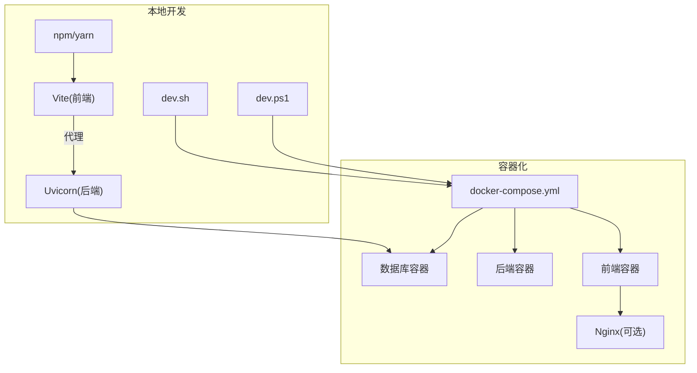
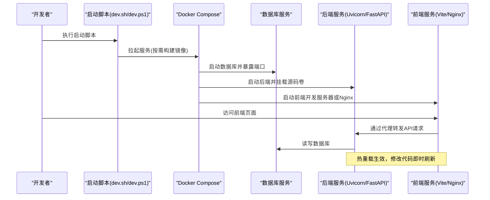
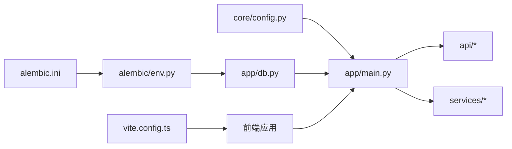

# 开发工作流

<cite>
**本文引用的文件**   
- [dev.sh](file://dev.sh)
- [dev.ps1](file://dev.ps1)
- [docker-compose.yml](file://docker-compose.yml)
- [backend/app/main.py](file://backend/app/main.py)
- [backend/alembic.ini](file://backend/alembic.ini)
- [backend/alembic/env.py](file://backend/alembic/env.py)
- [backend/app/core/config.py](file://backend/app/core/config.py)
- [backend/app/db.py](file://backend/app/db.py)
- [frontend/vite.config.ts](file://frontend/vite.config.ts)
- [frontend/package.json](file://frontend/package.json)
- [frontend/Dockerfile](file://frontend/Dockerfile)
- [frontend/nginx.conf](file://frontend/nginx.conf)
- [backend/Dockerfile](file://backend/Dockerfile)
</cite>

## 目录
1. [简介](#简介)
2. [项目结构](#项目结构)
3. [核心组件](#核心组件)
4. [架构总览](#架构总览)
5. [详细组件分析](#详细组件分析)
6. [依赖关系分析](#依赖关系分析)
7. [性能考虑](#性能考虑)
8. [故障排查指南](#故障排查指南)
9. [结论](#结论)
10. [附录](#附录)

## 简介
本文件面向Talos项目的开发者，系统化说明本地开发工作流与调试方法。内容涵盖：
- 使用 dev.sh / dev.ps1 脚本快速启动本地开发环境
- Docker Compose 一键部署前后端与数据库
- 前端热重载配置与调试技巧
- 后端开发服务器、环境变量管理、数据库迁移执行
- API 接口测试（Swagger UI / Postman）
- 日志查看与调试技巧
- 性能分析与内存泄漏排查
- 常见问题与解决方案

## 项目结构
Talos采用前后端分离架构：
- 后端：Python + FastAPI + Alembic 数据迁移
- 前端：Vue + Vite + TypeScript
- 容器化：Docker + Docker Compose 编排服务

图表来源
- [docker-compose.yml](file://docker-compose.yml)
- [backend/Dockerfile](file://backend/Dockerfile)
- [frontend/Dockerfile](file://frontend/Dockerfile)
- [frontend/nginx.conf](file://frontend/nginx.conf)
- [dev.sh](file://dev.sh)
- [dev.ps1](file://dev.ps1)

章节来源
- [docker-compose.yml](file://docker-compose.yml)
- [backend/Dockerfile](file://backend/Dockerfile)
- [frontend/Dockerfile](file://frontend/Dockerfile)
- [frontend/nginx.conf](file://frontend/nginx.conf)
- [dev.sh](file://dev.sh)
- [dev.ps1](file://dev.ps1)

## 核心组件
- 启动脚本
  - dev.sh：Linux/macOS 下的一键启动入口
  - dev.ps1：Windows 下的等效启动入口
- 容器编排
  - docker-compose.yml：定义数据库、后端、前端等服务的运行方式
- 后端服务
  - main.py：FastAPI 应用入口与路由注册
  - core/config.py：环境变量与配置加载
  - db.py：数据库连接与会话管理
  - alembic.ini / alembic/env.py：迁移工具配置与环境初始化
- 前端服务
  - vite.config.ts：开发服务器、代理、热重载配置
  - package.json：脚本命令与依赖声明
  - Dockerfile / nginx.conf：生产镜像与反向代理配置

章节来源
- [dev.sh](file://dev.sh)
- [dev.ps1](file://dev.ps1)
- [docker-compose.yml](file://docker-compose.yml)
- [backend/app/main.py](file://backend/app/main.py)
- [backend/app/core/config.py](file://backend/app/core/config.py)
- [backend/app/db.py](file://backend/app/db.py)
- [backend/alembic.ini](file://backend/alembic.ini)
- [backend/alembic/env.py](file://backend/alembic/env.py)
- [frontend/vite.config.ts](file://frontend/vite.config.ts)
- [frontend/package.json](file://frontend/package.json)
- [frontend/Dockerfile](file://frontend/Dockerfile)
- [frontend/nginx.conf](file://frontend/nginx.conf)

## 架构总览
下图展示本地开发与容器化两种路径的交互关系，以及关键配置文件的作用点。

图表来源
- [docker-compose.yml](file://docker-compose.yml)
- [backend/app/main.py](file://backend/app/main.py)
- [frontend/vite.config.ts](file://frontend/vite.config.ts)

## 详细组件分析

### 启动脚本与环境准备
- dev.sh / dev.ps1
  - 作用：统一封装本地开发环境的启动流程，包括检查依赖、设置环境变量、调用 Docker Compose 或直接启动前后端进程
  - 建议：在首次使用前确保已安装 Docker、Node.js、Python 及必要依赖；根据操作系统选择对应脚本
- 环境变量
  - 常见变量：数据库连接串、JWT密钥、CORS白名单、日志级别等
  - 位置：通常由 .env 文件或系统环境变量注入到各服务中

章节来源
- [dev.sh](file://dev.sh)
- [dev.ps1](file://dev.ps1)

### Docker Compose 编排
- 服务划分
  - 数据库：提供持久化存储
  - 后端：运行 FastAPI 应用，挂载源码目录以便热重载
  - 前端：开发模式使用 Vite HMR；生产模式使用 Nginx 静态资源服务
- 网络与端口
  - 内部网络隔离服务间通信
  - 对外暴露前端端口供浏览器访问，后端端口可仅对内暴露或通过反向代理访问

章节来源
- [docker-compose.yml](file://docker-compose.yml)
- [backend/Dockerfile](file://backend/Dockerfile)
- [frontend/Dockerfile](file://frontend/Dockerfile)
- [frontend/nginx.conf](file://frontend/nginx.conf)

### 后端开发服务器与热重载
- 入口与路由
  - main.py：创建 FastAPI 应用实例、注册中间件与路由、配置跨域与安全策略
- 热重载
  - 使用 Uvicorn 的 --reload 参数配合源码卷挂载，实现代码变更自动重启
- 调试技巧
  - 断点调试：IDE 附加到 Uvicorn 进程
  - 日志输出：调整日志级别，集中查看请求与错误信息

章节来源
- [backend/app/main.py](file://backend/app/main.py)

### 环境变量管理与配置
- 配置加载
  - core/config.py：从环境变量读取配置项并提供类型安全的访问接口
- 最佳实践
  - 敏感信息不入库，统一通过环境变量注入
  - 为不同环境提供默认值与校验逻辑

章节来源
- [backend/app/core/config.py](file://backend/app/core/config.py)

### 数据库连接与迁移
- 连接与会话
  - db.py：负责数据库引擎创建、会话工厂与依赖注入
- 迁移工具
  - alembic.ini：迁移脚本路径、数据库连接字符串来源
  - alembic/env.py：初始化Alembic环境、生成/执行迁移脚本
- 常用操作
  - 初始化迁移：生成初始版本
  - 增量迁移：模型变更后生成新版本
  - 执行迁移：将变更应用到数据库

章节来源
- [backend/app/db.py](file://backend/app/db.py)
- [backend/alembic.ini](file://backend/alembic.ini)
- [backend/alembic/env.py](file://backend/alembic/env.py)

### 前端开发服务器与热重载
- Vite 配置
  - vite.config.ts：开发服务器端口、HMR、代理后端接口、静态资源处理
- 脚本命令
  - package.json：定义开发、构建、预览等命令
- 调试技巧
  - 浏览器开发者工具：Network面板观察请求、Console面板查看错误
  - 代理问题：确认后端地址与端口一致，避免跨域

章节来源
- [frontend/vite.config.ts](file://frontend/vite.config.ts)
- [frontend/package.json](file://frontend/package.json)

### API 接口测试
- Swagger UI
  - 启动后端后访问内置文档界面，可直接在线发起请求验证
- Postman
  - 导入集合或手动构造请求，注意鉴权头与跨域设置
- 自动化测试
  - 使用 pytest 编写接口用例，结合测试数据库与夹具

章节来源
- [backend/app/main.py](file://backend/app/main.py)

### 日志查看与调试
- 后端日志
  - 控制台输出与文件输出结合，按级别过滤
- 前端日志
  - console.log/debugger 断点，Network面板抓包
- 容器日志
  - 使用 docker logs 查看各服务运行状态与错误堆栈

章节来源
- [backend/app/main.py](file://backend/app/main.py)
- [docker-compose.yml](file://docker-compose.yml)

### 性能分析与内存泄漏排查
- 后端
  - 使用性能剖析工具定位热点函数与慢查询
  - 监控内存占用，排查未释放对象与循环引用
- 前端
  - 使用浏览器性能面板分析渲染瓶颈与内存增长
  - 检查事件监听器与定时器是否正确清理

[本节为通用指导，不直接分析具体文件]

## 依赖关系分析
下图展示关键模块之间的依赖关系与调用方向。

图表来源
- [backend/app/core/config.py](file://backend/app/core/config.py)
- [backend/app/main.py](file://backend/app/main.py)
- [backend/app/db.py](file://backend/app/db.py)
- [backend/alembic.ini](file://backend/alembic.ini)
- [backend/alembic/env.py](file://backend/alembic/env.py)
- [frontend/vite.config.ts](file://frontend/vite.config.ts)

章节来源
- [backend/app/core/config.py](file://backend/app/core/config.py)
- [backend/app/main.py](file://backend/app/main.py)
- [backend/app/db.py](file://backend/app/db.py)
- [backend/alembic.ini](file://backend/alembic.ini)
- [backend/alembic/env.py](file://backend/alembic/env.py)
- [frontend/vite.config.ts](file://frontend/vite.config.ts)

## 性能考虑
- 后端
  - 合理设置并发与线程池大小
  - 数据库连接池与慢查询优化
  - 缓存热点数据，减少重复计算
- 前端
  - 懒加载与代码分割
  - 图片与静态资源压缩
  - 避免不必要的重渲染

[本节为通用指导，不直接分析具体文件]

## 故障排查指南
- 启动失败
  - 检查端口占用、环境变量是否完整、镜像构建是否成功
- 数据库连接异常
  - 核对连接串、用户名密码、网络连通性
- 接口返回404/500
  - 查看后端日志与路由注册，确认路径与方法匹配
- 前端无法访问后端
  - 检查代理配置、CORS设置、跨域与鉴权头
- 热重载不生效
  - 确认源码卷挂载、Uvicorn --reload、Vite HMR 配置正确

章节来源
- [docker-compose.yml](file://docker-compose.yml)
- [backend/app/main.py](file://backend/app/main.py)
- [frontend/vite.config.ts](file://frontend/vite.config.ts)

## 结论
通过统一的启动脚本与 Docker Compose 编排，Talos 提供了高效的本地开发与容器化部署能力。结合 Vite 与 Uvicorn 的热重载机制，开发者可以快速迭代与调试。遵循本文的配置与调试建议，能够显著提升开发效率与问题定位速度。

[本节为总结性内容，不直接分析具体文件]

## 附录
- 常用命令参考
  - 启动开发环境：执行 dev.sh 或 dev.ps1
  - 构建与运行容器：使用 docker-compose up
  - 执行数据库迁移：通过 Alembic 命令
  - 查看服务日志：docker logs 或 IDE 控制台
- 推荐工具
  - 浏览器开发者工具、Postman、pytest、性能剖析工具

[本节为补充信息，不直接分析具体文件]