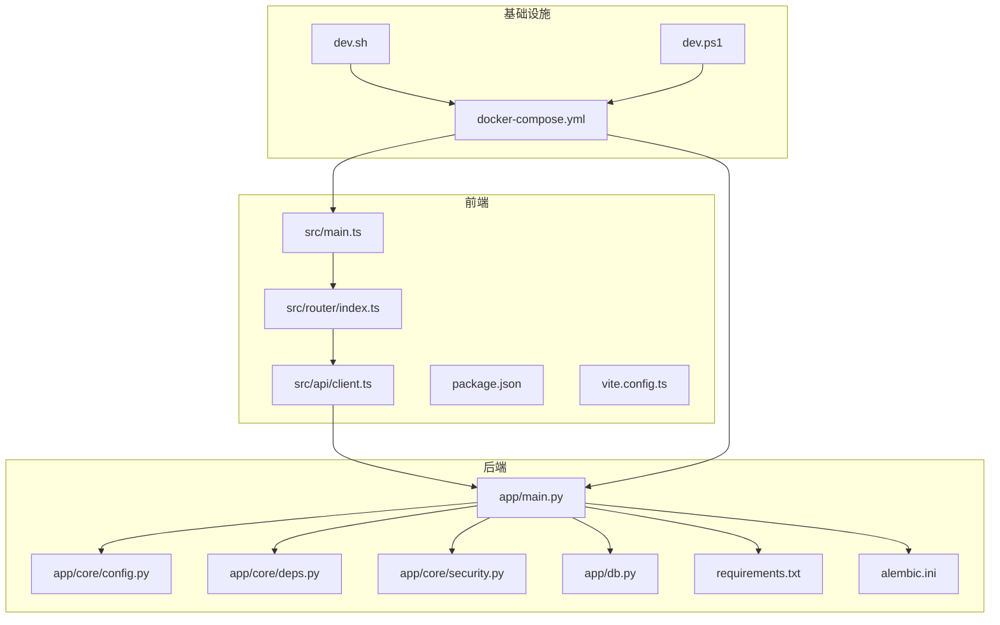
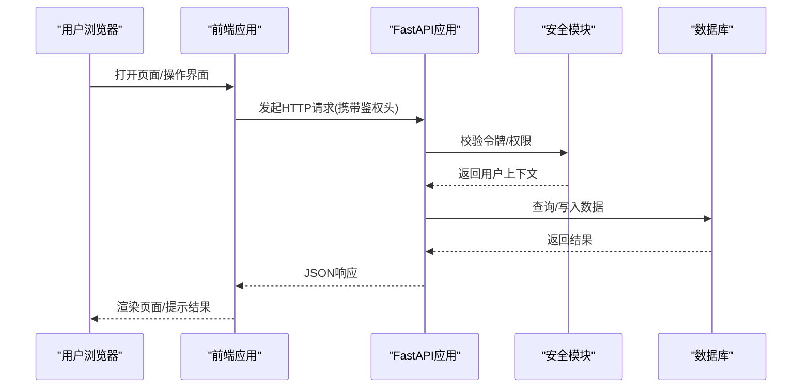
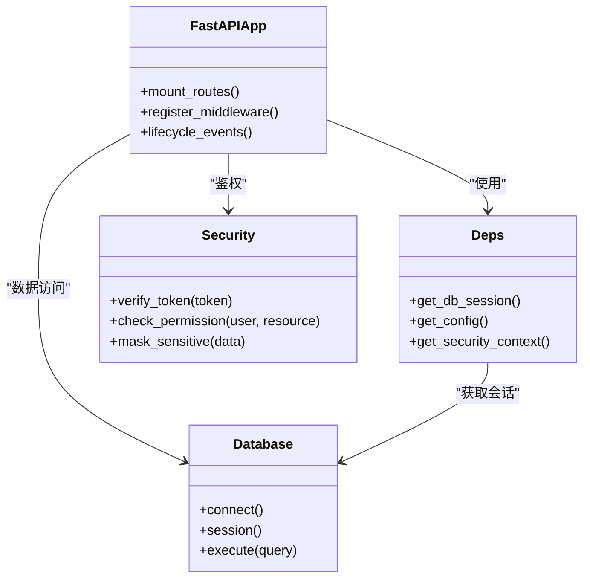
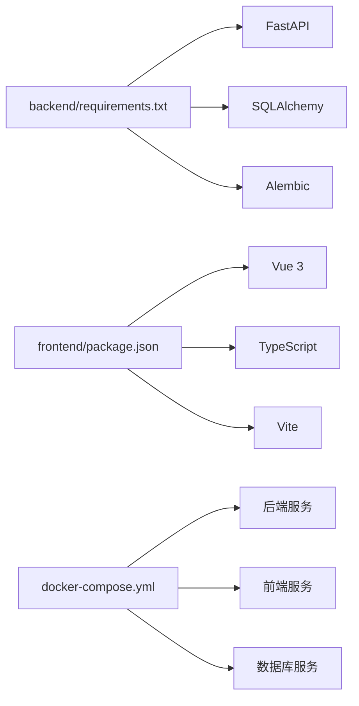

# 开发指南

<cite>
**本文引用的文件**   
- [backend/app/main.py](file://backend/app/main.py)
- [backend/app/core/config.py](file://backend/app/core/config.py)
- [backend/app/core/deps.py](file://backend/app/core/deps.py)
- [backend/app/core/security.py](file://backend/app/core/security.py)
- [backend/app/db.py](file://backend/app/db.py)
- [backend/alembic.ini](file://backend/alembic.ini)
- [backend/requirements.txt](file://backend/requirements.txt)
- [backend/requirements-dev.txt](file://backend/requirements-dev.txt)
- [backend/pytest.ini](file://backend/pytest.ini)
- [backend/tests/conftest.py](file://backend/tests/conftest.py)
- [backend/tests/test_api.py](file://backend/tests/test_api.py)
- [backend/tests/test_parser.py](file://backend/tests/test_parser.py)
- [frontend/package.json](file://frontend/package.json)
- [frontend/vite.config.ts](file://frontend/vite.config.ts)
- [frontend/tsconfig.json](file://frontend/tsconfig.json)
- [frontend/src/main.ts](file://frontend/src/main.ts)
- [frontend/src/router/index.ts](file://frontend/src/router/index.ts)
- [frontend/src/api/client.ts](file://frontend/src/api/client.ts)
- [docker-compose.yml](file://docker-compose.yml)
- [dev.sh](file://dev.sh)
- [dev.ps1](file://dev.ps1)
</cite>

## 目录
1. [简介](#简介)
2. [项目结构](#项目结构)
3. [核心组件](#核心组件)
4. [架构总览](#架构总览)
5. [详细组件分析](#详细组件分析)
6. [依赖关系分析](#依赖关系分析)
7. [性能考虑](#性能考虑)
8. [故障排查指南](#故障排查指南)
9. [结论](#结论)
10. [附录](#附录)

## 简介
本指南面向Talos项目的开发者，涵盖从环境搭建、代码规范、前后端工作流、测试策略、Git与版本管理，到性能分析与常见问题排查的完整流程。目标是帮助新成员快速上手并高效协作，同时为资深开发者提供可追溯的实现细节与优化建议。

## 项目结构
Talos采用前后端分离架构：
- 后端（Python/FastAPI）：位于 backend 目录，包含应用入口、配置、数据库、模型、服务层、API路由、异步任务等。
- 前端（Vue 3 + Vite + TypeScript）：位于 frontend 目录，包含页面、组件、路由、状态、API客户端等。
- 容器化与本地开发脚本：根目录提供 docker-compose.yml、dev.sh、dev.ps1 用于一键启动开发与调试。

图表来源 
- [backend/app/main.py](file://backend/app/main.py)
- [backend/app/core/config.py](file://backend/app/core/config.py)
- [backend/app/core/deps.py](file://backend/app/core/deps.py)
- [backend/app/core/security.py](file://backend/app/core/security.py)
- [backend/app/db.py](file://backend/app/db.py)
- [backend/requirements.txt](file://backend/requirements.txt)
- [backend/alembic.ini](file://backend/alembic.ini)
- [frontend/src/main.ts](file://frontend/src/main.ts)
- [frontend/src/router/index.ts](file://frontend/src/router/index.ts)
- [frontend/src/api/client.ts](file://frontend/src/api/client.ts)
- [frontend/package.json](file://frontend/package.json)
- [frontend/vite.config.ts](file://frontend/vite.config.ts)
- [docker-compose.yml](file://docker-compose.yml)
- [dev.sh](file://dev.sh)
- [dev.ps1](file://dev.ps1)

章节来源
- [backend/app/main.py](file://backend/app/main.py)
- [backend/app/core/config.py](file://backend/app/core/config.py)
- [backend/app/core/deps.py](file://backend/app/core/deps.py)
- [backend/app/core/security.py](file://backend/app/core/security.py)
- [backend/app/db.py](file://backend/app/db.py)
- [backend/requirements.txt](file://backend/requirements.txt)
- [backend/alembic.ini](file://backend/alembic.ini)
- [frontend/src/main.ts](file://frontend/src/main.ts)
- [frontend/src/router/index.ts](file://frontend/src/router/index.ts)
- [frontend/src/api/client.ts](file://frontend/src/api/client.ts)
- [frontend/package.json](file://frontend/package.json)
- [frontend/vite.config.ts](file://frontend/vite.config.ts)
- [docker-compose.yml](file://docker-compose.yml)
- [dev.sh](file://dev.sh)
- [dev.ps1](file://dev.ps1)

## 核心组件
- 后端应用入口与路由挂载：FastAPI应用初始化、中间件注册、API路由分组。
- 配置与安全：集中式配置加载、环境变量注入、认证与授权逻辑。
- 数据访问：数据库连接、会话管理、迁移工具集成。
- 前端应用入口与路由：Vite构建、TypeScript编译、路由与页面组织。
- API客户端：统一HTTP封装、错误处理、鉴权头注入。

章节来源
- [backend/app/main.py](file://backend/app/main.py)
- [backend/app/core/config.py](file://backend/app/core/config.py)
- [backend/app/core/deps.py](file://backend/app/core/deps.py)
- [backend/app/core/security.py](file://backend/app/core/security.py)
- [backend/app/db.py](file://backend/app/db.py)
- [frontend/src/main.ts](file://frontend/src/main.ts)
- [frontend/src/router/index.ts](file://frontend/src/router/index.ts)
- [frontend/src/api/client.ts](file://frontend/src/api/client.ts)

## 架构总览
Talos采用分层架构与模块化设计：
- 表现层：前端通过REST API与后端交互，使用统一的客户端封装。
- 接口层：FastAPI路由按功能域划分，清晰解耦业务边界。
- 服务层：封装领域逻辑、外部解析与导出能力。
- 数据层：ORM模型与数据库会话，配合Alembic进行迁移管理。
- 支撑层：配置、安全、依赖注入、异步任务调度。

图表来源 
- [backend/app/main.py](file://backend/app/main.py)
- [backend/app/core/security.py](file://backend/app/core/security.py)
- [backend/app/db.py](file://backend/app/db.py)
- [frontend/src/api/client.ts](file://frontend/src/api/client.ts)

## 详细组件分析

### 后端应用与依赖注入
- 应用初始化：创建FastAPI实例，注册生命周期事件、中间件、CORS、路由前缀等。
- 依赖注入：通过deps模块提供数据库会话、配置对象、安全上下文等共享依赖。
- 安全模块：实现JWT或Token校验、角色权限检查、敏感信息脱敏。

图表来源 
- [backend/app/main.py](file://backend/app/main.py)
- [backend/app/core/deps.py](file://backend/app/core/deps.py)
- [backend/app/core/security.py](file://backend/app/core/security.py)
- [backend/app/db.py](file://backend/app/db.py)

章节来源
- [backend/app/main.py](file://backend/app/main.py)
- [backend/app/core/deps.py](file://backend/app/core/deps.py)
- [backend/app/core/security.py](file://backend/app/core/security.py)
- [backend/app/db.py](file://backend/app/db.py)

### 配置与环境变量
- 集中式配置：通过config模块加载环境变量、默认值、类型校验。
- 安全配置：密钥、令牌过期时间、跨域策略、日志级别等。
- 运行时切换：支持开发、测试、生产环境的差异化配置。

章节来源
- [backend/app/core/config.py](file://backend/app/core/config.py)

### 数据库与迁移
- 连接与会话：db模块负责引擎创建、会话生命周期管理、连接池参数。
- 迁移管理：Alembic配置文件与迁移脚本目录，支持版本控制与回滚。

章节来源
- [backend/app/db.py](file://backend/app/db.py)
- [backend/alembic.ini](file://backend/alembic.ini)

### 前端应用与路由
- 应用入口：main.ts初始化Vue应用、插件、全局样式、路由。
- 路由组织：router/index.ts定义页面路由、导航守卫、懒加载。
- 构建配置：vite.config.ts配置代理、别名、压缩、插件链。

章节来源
- [frontend/src/main.ts](file://frontend/src/main.ts)
- [frontend/src/router/index.ts](file://frontend/src/router/index.ts)
- [frontend/vite.config.ts](file://frontend/vite.config.ts)

### API客户端与错误处理
- 统一封装：client.ts封装fetch/axios调用、拦截器、重试、超时。
- 鉴权注入：自动附加Authorization头、刷新令牌逻辑。
- 错误处理：统一错误码映射、用户友好提示、日志上报。

章节来源
- [frontend/src/api/client.ts](file://frontend/src/api/client.ts)

## 依赖关系分析
- 后端依赖：FastAPI、SQLAlchemy、Alembic、Pydantic、加密库、任务队列等。
- 前端依赖：Vue 3、TypeScript、Vite、TailwindCSS、UI框架、HTTP客户端。
- 容器化：docker-compose编排后端、前端、数据库、缓存等服务。

图表来源 
- [backend/requirements.txt](file://backend/requirements.txt)
- [frontend/package.json](file://frontend/package.json)
- [docker-compose.yml](file://docker-compose.yml)

章节来源
- [backend/requirements.txt](file://backend/requirements.txt)
- [frontend/package.json](file://frontend/package.json)
- [docker-compose.yml](file://docker-compose.yml)

## 性能考虑
- 后端性能
  - 数据库连接池：合理设置最大连接数、超时、回收策略。
  - 异步处理：将耗时任务放入异步队列，避免阻塞请求线程。
  - 缓存策略：热点数据缓存、分页查询优化、索引设计。
  - 序列化优化：减少不必要的字段传输、批量接口设计。
- 前端性能
  - 代码分割：路由级懒加载、组件按需引入。
  - 资源优化：图片压缩、静态资源CDN、缓存策略。
  - 渲染优化：虚拟列表、防抖节流、避免重排重绘。
- 监控与剖析
  - 指标采集：QPS、延迟、错误率、内存占用。
  - 链路追踪：请求ID贯穿前后端，定位瓶颈。
  - 内存泄漏：定期GC、对象引用检查、长连接释放。

[本节为通用指导，不直接分析具体文件]

## 故障排查指南
- 启动失败
  - 检查端口冲突、环境变量缺失、依赖未安装。
  - 查看容器日志与服务健康检查。
- 数据库问题
  - 连接失败：网络、用户名密码、权限、迁移未执行。
  - 查询慢：索引缺失、锁等待、连接池耗尽。
- 前端问题
  - 构建失败：依赖版本冲突、TS配置错误。
  - 运行时错误：API路径错误、跨域、令牌失效。
- 调试技巧
  - 后端：启用调试模式、断点调试、结构化日志。
  - 前端：浏览器开发者工具、网络面板、源码映射。

章节来源
- [backend/pytest.ini](file://backend/pytest.ini)
- [backend/tests/conftest.py](file://backend/tests/conftest.py)
- [backend/tests/test_api.py](file://backend/tests/test_api.py)
- [backend/tests/test_parser.py](file://backend/tests/test_parser.py)

## 结论
Talos项目采用清晰的分层架构与模块化设计，结合容器化与自动化脚本，提供了高效的开发体验。遵循本指南的环境搭建、代码规范、测试策略与Git工作流，可显著提升团队协作效率与代码质量。持续的性能监控与故障排查机制有助于保障系统稳定性。

[本节为总结性内容，不直接分析具体文件]

## 附录

### 开发环境搭建
- Python虚拟环境
  - 创建虚拟环境并激活。
  - 安装后端依赖：requirements.txt与requirements-dev.txt。
  - 初始化数据库与运行迁移。
- Node.js开发环境
  - 安装Node.js与包管理器。
  - 安装前端依赖：package.json。
  - 配置Vite代理与开发服务器。
- IDE配置
  - Python：Pylance、Flake8、Black、isort。
  - TypeScript/Vue：Volar、ESLint、Prettier。
  - Docker：Docker Compose集成。

章节来源
- [backend/requirements.txt](file://backend/requirements.txt)
- [backend/requirements-dev.txt](file://backend/requirements-dev.txt)
- [frontend/package.json](file://frontend/package.json)
- [frontend/vite.config.ts](file://frontend/vite.config.ts)

### 代码规范与约定
- 命名规范
  - Python：snake_case函数与变量，CamelCase类名。
  - TypeScript：camelCase变量与方法，PascalCase组件与类。
  - 文件命名：小写下划线分隔，模块职责单一。
- 文件组织
  - 后端：按功能域划分API路由，服务层独立，模型与Schema分离。
  - 前端：视图、组件、路由、状态、工具函数分层清晰。
- 注释标准
  - 公共接口添加文档字符串与类型注解。
  - 复杂逻辑添加行内注释说明意图与边界条件。

[本节为通用规范，不直接分析具体文件]

### 前后端开发工作流程
- 热重载
  - 后端：使用uvicorn --reload启用热重载。
  - 前端：Vite开发服务器自动刷新。
- 调试技巧
  - 后端：pdb/IDE断点、结构化日志、请求回放。
  - 前端：Source Map、Network面板、Mock数据。
- 单元测试编写
  - 后端：pytest用例、夹具、模拟依赖、覆盖率统计。
  - 前端：Vitest/Jest组件测试、API Mock、快照测试。

章节来源
- [backend/pytest.ini](file://backend/pytest.ini)
- [backend/tests/conftest.py](file://backend/tests/conftest.py)
- [backend/tests/test_api.py](file://backend/tests/test_api.py)
- [backend/tests/test_parser.py](file://backend/tests/test_parser.py)
- [frontend/vite.config.ts](file://frontend/vite.config.ts)

### 测试策略
- 单元测试：覆盖核心逻辑、边界条件、异常路径。
- 集成测试：验证API端到端流程、数据库交互、第三方服务。
- 端到端测试：关键用户旅程自动化、UI交互验证。
- 执行命令：本地运行测试套件、生成报告、CI集成。

章节来源
- [backend/pytest.ini](file://backend/pytest.ini)
- [backend/tests/conftest.py](file://backend/tests/conftest.py)
- [backend/tests/test_api.py](file://backend/tests/test_api.py)
- [backend/tests/test_parser.py](file://backend/tests/test_parser.py)

### Git工作流与版本管理
- 分支管理
  - main：稳定发布分支。
  - develop：集成开发分支。
  - feature/*：功能分支。
  - hotfix/*：紧急修复分支。
- 提交规范
  - 类型+作用域+描述，如feat(api): 新增用户导入接口。
  - 变更影响范围与关联Issue编号。
- 代码审查
  - Pull Request模板、检查清单、评论反馈。
  - 自动化检查：lint、test、build。

[本节为通用流程，不直接分析具体文件]

### 贡献代码流程
- Fork仓库并创建功能分支。
- 遵循代码规范与测试要求。
- 提交PR并等待审查与合并。
- 更新文档与CHANGELOG。

[本节为通用流程，不直接分析具体文件]

### 性能分析与内存泄漏排查
- 性能分析
  - 后端：cProfile、py-spy、APM工具。
  - 前端：Chrome Performance、Lighthouse、Bundle Analyzer。
- 内存泄漏排查
  - 后端：tracemalloc、objgraph、GC调优。
  - 前端：Memory面板、闭包引用、事件监听器清理。
- 监控告警
  - 指标采集、阈值告警、容量规划。

[本节为通用指导，不直接分析具体文件]

### 常用命令与脚本
- 本地开发
  - 启动后端：uvicorn app.main:app --reload
  - 启动前端：npm run dev
  - 运行测试：pytest / npm test
- 容器化
  - 启动服务：docker-compose up
  - 构建镜像：docker-compose build
  - 查看日志：docker-compose logs -f

章节来源
- [docker-compose.yml](file://docker-compose.yml)
- [dev.sh](file://dev.sh)
- [dev.ps1](file://dev.ps1)