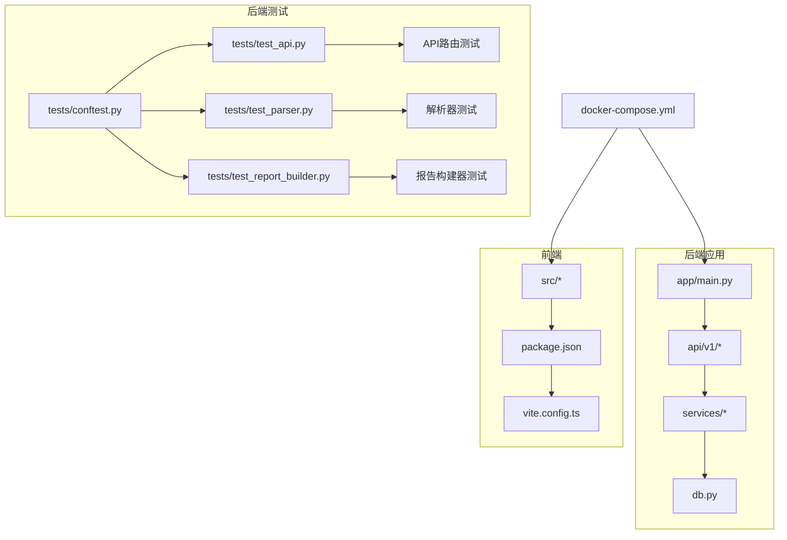
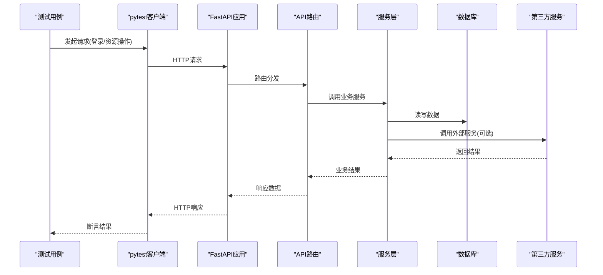
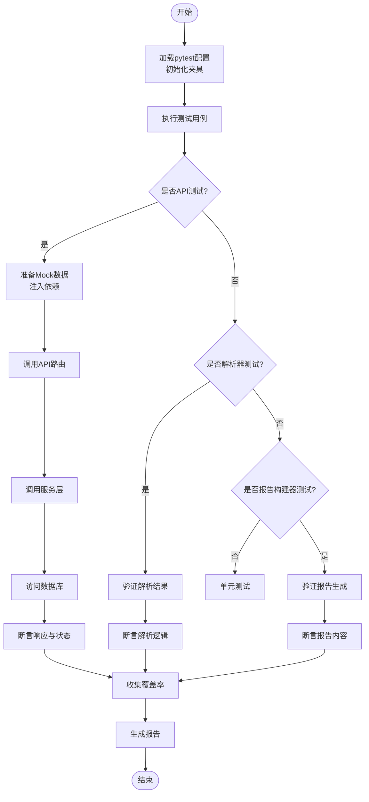
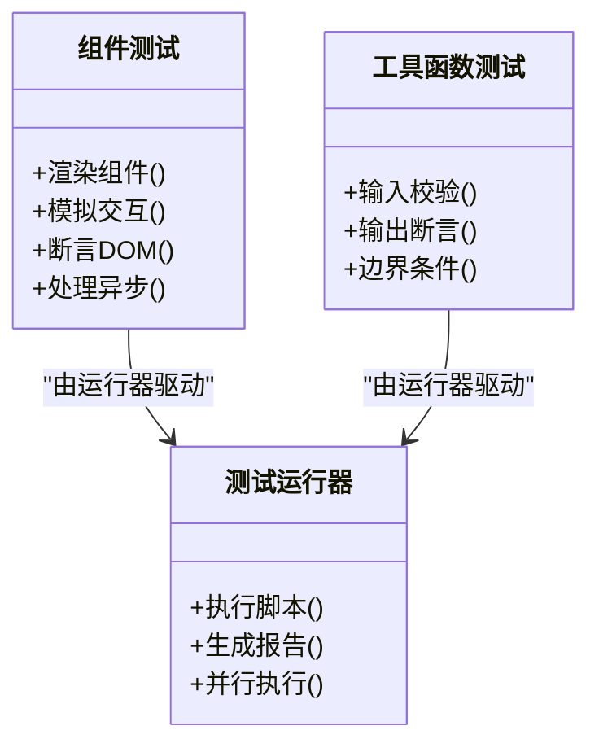
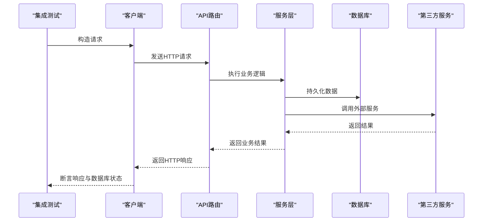
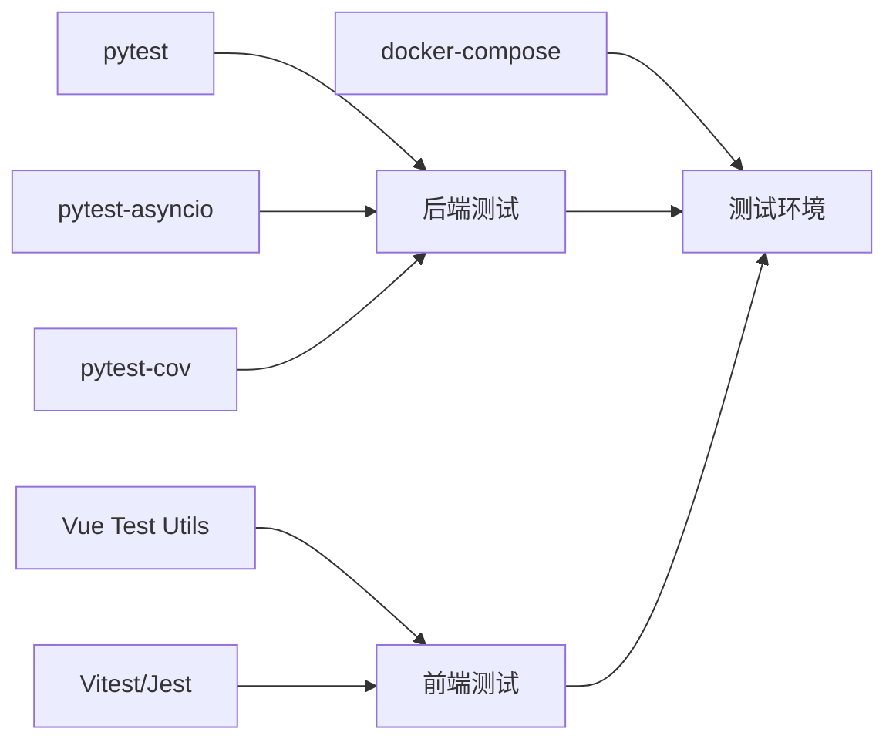

# 测试指南

<cite>
**本文引用的文件**   
- [backend/tests/conftest.py](file://backend/tests/conftest.py)
- [backend/tests/test_api.py](file://backend/tests/test_api.py)
- [backend/tests/test_parser.py](file://backend/tests/test_parser.py)
- [backend/tests/test_report_builder.py](file://backend/tests/test_report_builder.py)
- [backend/pytest.ini](file://backend/pytest.ini)
- [backend/app/main.py](file://backend/app/main.py)
- [backend/app/api/v1/auth.py](file://backend/app/api/v1/auth.py)
- [backend/app/api/v1/assets.py](file://backend/app/api/v1/assets.py)
- [backend/app/services/docx_parser.py](file://backend/app/services/docx_parser.py)
- [backend/app/services/report_builder.py](file://backend/app/services/report_builder.py)
- [backend/app/db.py](file://backend/app/db.py)
- [frontend/package.json](file://frontend/package.json)
- [frontend/vite.config.ts](file://frontend/vite.config.ts)
- [docker-compose.yml](file://docker-compose.yml)
</cite>

## 更新摘要
**所做更改**
- 新增报告构建器测试章节，详细介绍test_report_builder.py的测试策略和实现
- 扩展API测试部分，包含完整的认证、资源管理和导入导出功能测试
- 增强解析器测试说明，涵盖docx文档解析的完整验证流程
- 标准化测试夹具和实用工具的使用规范
- 更新测试框架架构，反映最新的测试覆盖范围和最佳实践

## 目录
1. [简介](#简介)
2. [项目结构](#项目结构)
3. [核心组件](#核心组件)
4. [架构总览](#架构总览)
5. [详细组件分析](#详细组件分析)
6. [依赖分析](#依赖分析)
7. [性能考虑](#性能考虑)
8. [故障排查指南](#故障排查指南)
9. [结论](#结论)
10. [附录](#附录)

## 简介
本指南面向Talos项目的测试实践，覆盖后端与前端测试策略、框架选择、单元测试与集成测试编写规范、覆盖率与报告、测试数据与环境隔离、持续集成自动化以及调试技巧。后端采用pytest进行API与业务逻辑测试；前端基于Vue Test Utils进行组件与交互测试。文档旨在帮助开发者快速上手并建立稳定可靠的测试体系。

**更新** 本次更新重点反映了测试框架的显著扩展，包括完整的API测试套件、报告构建器测试和解析器测试，以及标准化的测试夹具和实用工具。

## 项目结构
Talos为前后端分离项目：
- 后端位于 backend 目录，使用FastAPI构建API，测试集中在 backend/tests，配置在 pytest.ini。
- 前端位于 frontend 目录，使用Vite与TypeScript，测试脚本定义在 package.json 中，可通过Vite或独立测试运行器执行。
- 容器编排通过 docker-compose.yml 统一管理服务，便于本地与CI环境一致化。

图表来源
- [backend/tests/conftest.py](file://backend/tests/conftest.py)
- [backend/tests/test_api.py](file://backend/tests/test_api.py)
- [backend/tests/test_parser.py](file://backend/tests/test_parser.py)
- [backend/tests/test_report_builder.py](file://backend/tests/test_report_builder.py)
- [backend/app/main.py](file://backend/app/main.py)
- [backend/app/api/v1/auth.py](file://backend/app/api/v1/auth.py)
- [backend/app/api/v1/assets.py](file://backend/app/api/v1/assets.py)
- [backend/app/services/docx_parser.py](file://backend/app/services/docx_parser.py)
- [backend/app/services/report_builder.py](file://backend/app/services/report_builder.py)
- [backend/app/db.py](file://backend/app/db.py)
- [frontend/package.json](file://frontend/package.json)
- [frontend/vite.config.ts](file://frontend/vite.config.ts)
- [docker-compose.yml](file://docker-compose.yml)

章节来源
- [backend/pytest.ini](file://backend/pytest.ini)
- [backend/tests/conftest.py](file://backend/tests/conftest.py)
- [backend/tests/test_api.py](file://backend/tests/test_api.py)
- [backend/tests/test_parser.py](file://backend/tests/test_parser.py)
- [backend/tests/test_report_builder.py](file://backend/tests/test_report_builder.py)
- [frontend/package.json](file://frontend/package.json)
- [frontend/vite.config.ts](file://frontend/vite.config.ts)
- [docker-compose.yml](file://docker-compose.yml)

## 核心组件
- 后端测试基础设施
  - pytest配置与插件：通过 pytest.ini 统一参数（如缓存、日志、异步支持等）。
  - 共享夹具：conftest.py 提供客户端、数据库会话、Mock对象等，确保用例一致性。
  - API测试：test_api.py 覆盖认证、资源CRUD、导入导出等关键路径。
  - 解析器测试：test_parser.py 针对docx解析服务进行输入输出验证。
  - 报告构建器测试：test_report_builder.py 验证报告生成逻辑和数据完整性。
- 前端测试基础
  - 测试脚本：package.json 中定义测试命令，通常结合Vitest或Jest与Vue Test Utils。
  - Vite配置：vite.config.ts 可启用测试相关插件与别名，便于组件与工具函数测试。

**更新** 新增了报告构建器测试组件，完善了后端测试的完整性。

章节来源
- [backend/pytest.ini](file://backend/pytest.ini)
- [backend/tests/conftest.py](file://backend/tests/conftest.py)
- [backend/tests/test_api.py](file://backend/tests/test_api.py)
- [backend/tests/test_parser.py](file://backend/tests/test_parser.py)
- [backend/tests/test_report_builder.py](file://backend/tests/test_report_builder.py)
- [frontend/package.json](file://frontend/package.json)
- [frontend/vite.config.ts](file://frontend/vite.config.ts)

## 架构总览
下图展示从测试入口到后端API与服务层的调用链，以及数据库与外部服务的交互点。

图表来源
- [backend/app/main.py](file://backend/app/main.py)
- [backend/app/api/v1/auth.py](file://backend/app/api/v1/auth.py)
- [backend/app/api/v1/assets.py](file://backend/app/api/v1/assets.py)
- [backend/app/services/docx_parser.py](file://backend/app/services/docx_parser.py)
- [backend/app/services/report_builder.py](file://backend/app/services/report_builder.py)
- [backend/app/db.py](file://backend/app/db.py)

## 详细组件分析

### 后端测试策略与实现
- 框架与配置
  - 使用pytest作为测试框架，pytest.ini集中管理参数与插件。
  - 推荐启用异步支持（如pytest-asyncio）以覆盖异步API。
- 夹具与共享状态
  - conftest.py 提供统一的客户端、数据库连接、事务回滚、Mock对象等。
  - 建议将数据库会话与事务隔离，保证用例间独立性。
- API测试
  - test_api.py 覆盖认证流程、资源创建/查询/更新/删除、错误码与边界条件。
  - 建议使用工厂模式生成Mock数据，避免硬编码。
- 解析器测试
  - test_parser.py 针对docx解析服务进行结构化输入输出验证，包含异常路径。
- 报告构建器测试
  - test_report_builder.py 验证报告生成逻辑、模板渲染和数据组装。
  - 测试各种报告格式和复杂数据结构的处理能力。
- 异步测试
  - 对异步接口使用异步夹具与异步断言，确保事件循环正确初始化。
- 覆盖率与报告
  - 使用pytest-cov生成覆盖率报告，设置阈值并在CI中阻断低覆盖率提交。

**更新** 新增了报告构建器测试的详细描述，完善了测试覆盖范围。

图表来源
- [backend/pytest.ini](file://backend/pytest.ini)
- [backend/tests/conftest.py](file://backend/tests/conftest.py)
- [backend/tests/test_api.py](file://backend/tests/test_api.py)
- [backend/tests/test_parser.py](file://backend/tests/test_parser.py)
- [backend/tests/test_report_builder.py](file://backend/tests/test_report_builder.py)

章节来源
- [backend/pytest.ini](file://backend/pytest.ini)
- [backend/tests/conftest.py](file://backend/tests/conftest.py)
- [backend/tests/test_api.py](file://backend/tests/test_api.py)
- [backend/tests/test_parser.py](file://backend/tests/test_parser.py)
- [backend/tests/test_report_builder.py](file://backend/tests/test_report_builder.py)

### 前端测试策略与实现
- 框架选择
  - 使用Vue Test Utils进行组件测试，配合Vitest或Jest运行。
  - 通过package.json中的脚本统一执行测试命令。
- 组件测试
  - 渲染组件、模拟用户交互、断言DOM变化与事件触发。
  - 使用本地Mock替代API调用，确保组件测试的稳定性。
- 工具函数测试
  - 对utils目录下的纯函数进行输入输出断言，提高代码质量。
- 异步测试
  - 对异步组件或网络请求使用await与flushPromises，确保状态更新完成后再断言。
- 覆盖率与报告
  - 配置Vitest/Jest的覆盖率选项，生成HTML与JSON报告，便于CI集成。

章节来源
- [frontend/package.json](file://frontend/package.json)
- [frontend/vite.config.ts](file://frontend/vite.config.ts)

### 集成测试方法
- 数据库测试
  - 使用事务回滚或内存数据库（如SQLite）隔离测试数据。
  - 在conftest.py中提供数据库会话与迁移脚本执行。
- API接口测试
  - 通过TestClient或HTTP客户端发送请求，断言状态码、响应体与副作用。
  - 覆盖成功、失败、权限不足、参数校验等场景。
- 第三方服务集成测试
  - 使用Mock或本地代理（如WireMock）模拟外部服务响应。
  - 在网络不可用或超时情况下验证降级与重试逻辑。

图表来源
- [backend/app/api/v1/auth.py](file://backend/app/api/v1/auth.py)
- [backend/app/api/v1/assets.py](file://backend/app/api/v1/assets.py)
- [backend/app/services/docx_parser.py](file://backend/app/services/docx_parser.py)
- [backend/app/services/report_builder.py](file://backend/app/services/report_builder.py)
- [backend/app/db.py](file://backend/app/db.py)

章节来源
- [backend/tests/conftest.py](file://backend/tests/conftest.py)
- [backend/tests/test_api.py](file://backend/tests/test_api.py)

### 测试数据管理与环境隔离
- 数据工厂与Fixture
  - 在conftest.py中定义数据工厂，按需生成不同状态的实体。
  - 使用fixture作用域控制数据生命周期（函数级、模块级、会话级）。
- 环境隔离
  - 使用环境变量区分测试与生产配置。
  - 通过docker-compose启动独立的测试数据库与依赖服务。
- 清理与重置
  - 每个测试用例结束后自动回滚事务或清空临时表。
  - 对外部依赖使用Mock，避免真实网络请求。

**更新** 增强了测试数据管理的标准化规范，确保测试的一致性和可重复性。

章节来源
- [backend/tests/conftest.py](file://backend/tests/conftest.py)
- [docker-compose.yml](file://docker-compose.yml)

### 持续集成中的测试自动化
- 后端CI
  - 安装依赖后执行pytest，生成覆盖率报告。
  - 失败时阻断合并请求，确保代码质量。
- 前端CI
  - 安装Node依赖后执行测试脚本，生成覆盖率与快照。
  - 并行执行提升速度，归档报告供审查。
- 容器化测试
  - 使用docker-compose启动完整环境，执行端到端测试。
  - 在CI中拉取镜像并运行测试套件。

**更新** 更新了持续集成的测试自动化配置，反映最新的测试框架扩展。

章节来源
- [backend/pytest.ini](file://backend/pytest.ini)
- [frontend/package.json](file://frontend/package.json)
- [docker-compose.yml](file://docker-compose.yml)

## 依赖分析
- 后端测试依赖
  - pytest及其插件（如pytest-asyncio、pytest-cov）。
  - FastAPI测试客户端与数据库ORM客户端。
- 前端测试依赖
  - Vue Test Utils、Vitest或Jest、@vue/test-utils。
  - 浏览器模拟库（如jsdom）用于无头环境。
- 外部依赖
  - 数据库（PostgreSQL/SQLite）、消息队列、第三方API。

图表来源
- [backend/pytest.ini](file://backend/pytest.ini)
- [frontend/package.json](file://frontend/package.json)
- [docker-compose.yml](file://docker-compose.yml)

章节来源
- [backend/pytest.ini](file://backend/pytest.ini)
- [frontend/package.json](file://frontend/package.json)
- [docker-compose.yml](file://docker-compose.yml)

## 性能考虑
- 测试并行化
  - 使用pytest-xdist并行执行用例，缩短反馈时间。
  - 前端测试按文件或组件并行运行。
- 数据库优化
  - 使用内存数据库或轻量级引擎加速写入。
  - 批量插入与事务合并减少I/O。
- Mock与Stub
  - 对慢速外部服务使用Mock，避免网络延迟。
  - 合理设计Stub以减少不必要的计算。

[本节为通用指导，不直接分析具体文件]

## 故障排查指南
- 常见问题
  - 数据库连接失败：检查环境变量与docker-compose服务状态。
  - 异步测试挂起：确认事件循环已正确初始化，必要时添加超时。
  - 前端组件渲染失败：检查依赖注入与Mock是否正确。
  - 报告构建器测试失败：验证模板文件和数据结构的一致性。
- 调试技巧
  - 使用pytest -s打印日志，定位问题。
  - 前端使用浏览器开发者工具或Vitest调试模式。
  - 逐步缩小范围，先单测再集成测试。
- 恢复策略
  - 清理测试数据与缓存，重新运行最小用例集。
  - 查看覆盖率报告定位未覆盖分支。

**更新** 新增了报告构建器测试相关的故障排查内容。

章节来源
- [backend/tests/conftest.py](file://backend/tests/conftest.py)
- [backend/tests/test_api.py](file://backend/tests/test_api.py)
- [backend/tests/test_report_builder.py](file://backend/tests/test_report_builder.py)
- [frontend/package.json](file://frontend/package.json)

## 结论
通过统一的测试策略与工具链，Talos项目能够保障前后端代码质量与稳定性。建议持续完善测试覆盖率、强化集成测试与CI自动化，形成闭环的质量保障体系。

**更新** 随着测试框架的显著扩展，项目现在拥有更全面的测试覆盖，包括API测试、解析器测试和报告构建器测试，为代码质量提供了更强的保障。

[本节为总结性内容，不直接分析具体文件]

## 附录
- 最佳实践清单
  - 用例命名清晰，描述行为而非实现。
  - 优先测试公共接口与边界条件。
  - 保持测试数据独立与可重复。
  - 及时更新Mock与依赖版本。
  - 标准化测试夹具和实用工具的使用。
- 参考文件
  - 后端测试配置与用例：pytest.ini、conftest.py、test_api.py、test_parser.py、test_report_builder.py
  - 前端测试脚本与配置：package.json、vite.config.ts
  - 环境编排：docker-compose.yml

**更新** 新增了报告构建器测试文件的参考，完善了测试相关的文件索引。

[本节为补充信息，不直接分析具体文件]