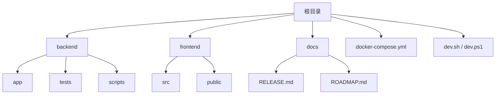
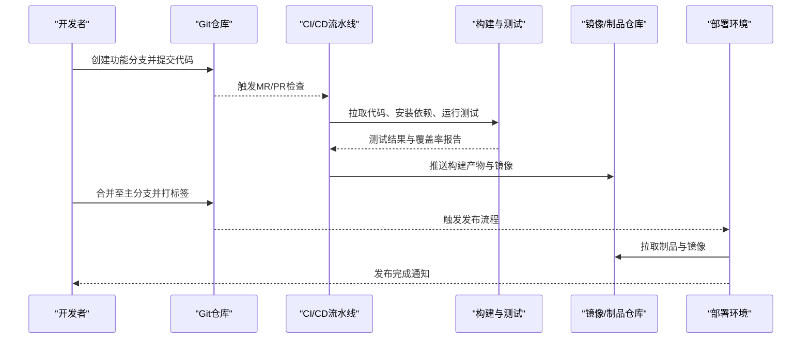
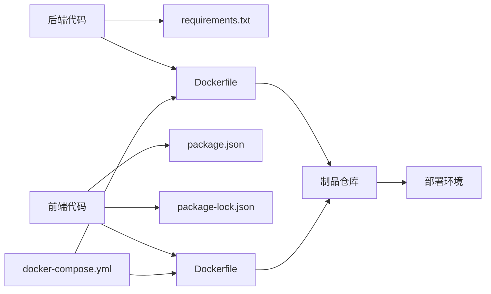

# 版本管理

<cite>
**本文引用的文件**   
- [RELEASE.md](file://docs/RELEASE.md)
- [ROADMAP.md](file://docs/ROADMAP.md)
- [docker-compose.yml](file://docker-compose.yml)
- [backend/Dockerfile](file://backend/Dockerfile)
- [frontend/Dockerfile](file://frontend/Dockerfile)
- [backend/requirements.txt](file://backend/requirements.txt)
- [backend/requirements-dev.txt](file://backend/requirements-dev.txt)
- [frontend/package.json](file://frontend/package.json)
- [frontend/package-lock.json](file://frontend/package-lock.json)
- [backend/app/main.py](file://backend/app/main.py)
- [backend/app/core/config.py](file://backend/app/core/config.py)
- [backend/app/api/v1/__init__.py](file://backend/app/api/v1/__init__.py)
- [backend/tests/conftest.py](file://backend/tests/conftest.py)
- [dev.sh](file://dev.sh)
- [dev.ps1](file://dev.ps1)
</cite>

## 目录
1. [简介](#简介)
2. [项目结构](#项目结构)
3. [核心组件](#核心组件)
4. [架构总览](#架构总览)
5. [详细组件分析](#详细组件分析)
6. [依赖关系分析](#依赖关系分析)
7. [性能考虑](#性能考虑)
8. [故障排查指南](#故障排查指南)
9. [结论](#结论)
10. [附录](#附录)

## 简介
本文件为Talos项目的版本管理与发布流程规范，覆盖Git分支策略、语义化版本控制、变更日志维护、代码审查与Pull Request模板、发布流程（含标签与回滚）、依赖版本与安全更新、里程碑与路线图管理，以及协作开发与冲突解决最佳实践。目标是让不同技术背景的成员都能理解并遵循统一的版本与发布流程，确保交付质量与可追溯性。

## 项目结构
Talos采用前后端分离的模块化结构：
- backend：Python后端服务，包含API、模型、服务层、数据库迁移与测试等。
- frontend：Vue前端应用，包含页面、组件、路由、状态管理等。
- docs：文档目录，包含发布说明与路线图。
- 根目录：容器编排与开发脚本。

图表来源
- [docker-compose.yml](file://docker-compose.yml)
- [backend/app/main.py](file://backend/app/main.py)
- [frontend/src/main.ts](file://frontend/src/main.ts)
- [docs/RELEASE.md](file://docs/RELEASE.md)
- [docs/ROADMAP.md](file://docs/ROADMAP.md)

章节来源
- [docker-compose.yml](file://docker-compose.yml)
- [backend/app/main.py](file://backend/app/main.py)
- [frontend/src/main.ts](file://frontend/src/main.ts)
- [docs/RELEASE.md](file://docs/RELEASE.md)
- [docs/ROADMAP.md](file://docs/ROADMAP.md)

## 核心组件
- 版本标识与配置
  - 后端通过配置文件集中管理运行期参数，便于在构建与部署时注入版本号与环境变量。
  - 前端通过包管理工具声明依赖与脚本命令，统一构建与发布行为。
- 容器化与编排
  - Dockerfile定义镜像构建步骤，确保构建可重复；docker-compose协调多服务启动。
- 依赖管理
  - Python使用requirements系列文件锁定依赖；前端使用package.json与lock文件锁定依赖。
- 测试与质量
  - 后端pytest框架组织测试用例与夹具，保障回归质量。

章节来源
- [backend/app/core/config.py](file://backend/app/core/config.py)
- [backend/Dockerfile](file://backend/Dockerfile)
- [frontend/Dockerfile](file://frontend/Dockerfile)
- [backend/requirements.txt](file://backend/requirements.txt)
- [backend/requirements-dev.txt](file://backend/requirements-dev.txt)
- [frontend/package.json](file://frontend/package.json)
- [frontend/package-lock.json](file://frontend/package-lock.json)
- [backend/tests/conftest.py](file://backend/tests/conftest.py)

## 架构总览
下图展示从开发者提交到生产发布的端到端流程，包括分支策略、CI/CD、制品与标签管理。

图表来源
- [docker-compose.yml](file://docker-compose.yml)
- [backend/Dockerfile](file://backend/Dockerfile)
- [frontend/Dockerfile](file://frontend/Dockerfile)
- [backend/requirements.txt](file://backend/requirements.txt)
- [frontend/package.json](file://frontend/package.json)

## 详细组件分析

### Git分支管理策略
- 主分支保护
  - main/master为受保护分支，禁止直接推送；所有变更必须通过合并请求进入。
  - 启用至少一名评审者批准、通过自动化测试与安全检查后方可合并。
- 分支命名规范
  - 功能分支：feature/<模块>-<描述>
  - 修复分支：fix/<问题编号或描述>
  - 发布分支：release/<版本号>
  - 热修复分支：hotfix/<问题编号或描述>
- 合并请求流程
  - 提交前：本地运行测试与静态检查。
  - MR/PR：填写变更说明、影响范围、测试验证结果。
  - 评审：关注代码质量、兼容性、安全性与可维护性。
  - 合并：保持提交历史清晰，必要时进行squash合并。

章节来源
- [docs/RELEASE.md](file://docs/RELEASE.md)
- [docs/ROADMAP.md](file://docs/ROADMAP.md)

### 语义化版本控制规范
- 版本号规则
  - 主版本：不兼容的API或数据结构变更。
  - 次版本：向后兼容的功能新增。
  - 修订号：向后兼容的问题修复。
- 变更日志维护
  - 每次合并需更新CHANGELOG或RELEASE说明，分类记录新增、修复、破坏性变更。
  - 变更日志按时间倒序排列，标注关联的MR/PR编号。
- 向后兼容性保证
  - API契约优先，避免破坏性变更；如需破坏性变更，提供过渡期与迁移指引。
  - 数据库迁移需具备回滚能力，确保升级与降级安全。

章节来源
- [docs/RELEASE.md](file://docs/RELEASE.md)

### 代码审查与Pull Request模板
- 审查要点
  - 正确性：逻辑与边界条件是否完备。
  - 可读性：命名、结构与注释是否清晰。
  - 可维护性：是否引入不必要的复杂度。
  - 安全性：输入校验、权限控制与敏感信息处理。
  - 性能：是否存在明显瓶颈或资源泄漏。
- PR模板建议字段
  - 变更类型（新增/修复/优化/破坏性变更）
  - 影响范围（模块、接口、数据模型）
  - 测试覆盖（单元、集成、端到端）
  - 风险与回滚方案
  - 相关工单与文档链接

章节来源
- [docs/RELEASE.md](file://docs/RELEASE.md)

### 发布流程
- 版本标签
  - 在稳定分支上创建语义化版本标签（如v1.2.3），并附带发布说明。
  - 标签应指向最终合并后的提交，确保可重现构建。
- 发布说明
  - 列出新增功能、问题修复、已知问题与升级注意事项。
  - 明确依赖更新与破坏性变更的影响。
- 回滚策略
  - 支持快速回滚至上一稳定版本标签。
  - 数据库迁移需具备向下兼容或回滚脚本。
  - 灰度发布与蓝绿部署可降低回滚成本。

章节来源
- [docs/RELEASE.md](file://docs/RELEASE.md)

### 依赖版本管理与安全更新策略
- Python依赖
  - 使用requirements.txt锁定生产依赖，requirements-dev.txt用于开发环境。
  - 定期扫描依赖漏洞，及时升级安全补丁。
- 前端依赖
  - package.json声明依赖版本，package-lock.json锁定精确版本。
  - 使用安全扫描工具检测高危漏洞，制定修复优先级。
- 容器镜像
  - Dockerfile基于最小基础镜像，固定基础镜像版本。
  - 构建过程缓存依赖，提升构建速度与一致性。

章节来源
- [backend/requirements.txt](file://backend/requirements.txt)
- [backend/requirements-dev.txt](file://backend/requirements-dev.txt)
- [frontend/package.json](file://frontend/package.json)
- [frontend/package-lock.json](file://frontend/package-lock.json)
- [backend/Dockerfile](file://backend/Dockerfile)
- [frontend/Dockerfile](file://frontend/Dockerfile)

### 里程碑规划与路线图管理
- 里程碑划分
  - 按季度或月度设定目标，明确交付范围与验收标准。
  - 将大目标拆分为可独立交付的小里程碑。
- 路线图管理
  - ROADMAP.md记录长期规划、当前迭代与已完成项。
  - 定期回顾与调整路线图，确保与业务目标一致。

章节来源
- [docs/ROADMAP.md](file://docs/ROADMAP.md)

### 协作开发与冲突解决指南
- 协作最佳实践
  - 小步快跑，频繁提交与合并，减少冲突概率。
  - 使用特性开关逐步上线新功能，降低风险。
  - 文档与代码同步更新，确保知识共享。
- 冲突解决
  - 先沟通再合并，必要时召开短会对齐方案。
  - 使用rebase或merge策略保持历史整洁。
  - 遇到阻塞问题时及时上报并寻求协助。

章节来源
- [docs/RELEASE.md](file://docs/RELEASE.md)
- [docs/ROADMAP.md](file://docs/ROADMAP.md)

## 依赖关系分析
下图展示后端与前端的关键依赖关系及构建产物流向。

图表来源
- [backend/requirements.txt](file://backend/requirements.txt)
- [backend/Dockerfile](file://backend/Dockerfile)
- [frontend/package.json](file://frontend/package.json)
- [frontend/package-lock.json](file://frontend/package-lock.json)
- [frontend/Dockerfile](file://frontend/Dockerfile)
- [docker-compose.yml](file://docker-compose.yml)

章节来源
- [backend/requirements.txt](file://backend/requirements.txt)
- [backend/Dockerfile](file://backend/Dockerfile)
- [frontend/package.json](file://frontend/package.json)
- [frontend/package-lock.json](file://frontend/package-lock.json)
- [frontend/Dockerfile](file://frontend/Dockerfile)
- [docker-compose.yml](file://docker-compose.yml)

## 性能考虑
- 构建优化
  - 分层构建与缓存依赖，缩短CI时间。
  - 并行执行测试与构建任务。
- 运行时优化
  - 合理设置容器资源限制，避免资源争用。
  - 监控关键指标（CPU、内存、I/O）并调优。
- 依赖优化
  - 移除未使用的依赖，减小镜像体积。
  - 使用CDN加速前端资源加载。

[本节为通用指导，无需特定文件来源]

## 故障排查指南
- 常见问题
  - 依赖冲突：检查requirements与package-lock是否一致，清理缓存后重试。
  - 构建失败：查看CI日志，定位具体错误阶段。
  - 运行时异常：检查环境变量与配置文件是否正确注入。
- 调试工具
  - 使用本地开发脚本快速复现问题。
  - 开启详细日志与追踪ID，便于问题定位。
- 回滚操作
  - 切换至上一稳定标签并重新部署。
  - 数据库回滚至前一迁移版本。

章节来源
- [dev.sh](file://dev.sh)
- [dev.ps1](file://dev.ps1)
- [backend/app/core/config.py](file://backend/app/core/config.py)

## 结论
通过统一的分支策略、语义化版本控制、严格的代码审查与自动化发布流程，Talos项目能够持续交付高质量软件。配合完善的依赖管理与安全更新机制，以及清晰的里程碑与路线图，团队可以高效协作并快速响应变化。建议在实践中不断优化流程，结合监控与反馈持续改进。

[本节为总结性内容，无需特定文件来源]

## 附录
- 术语表
  - 语义化版本：SemVer，一种版本编号规范。
  - 合并请求：MR/PR，用于代码审查与合并的流程。
  - 制品：构建产物，如镜像、压缩包等。
- 参考链接
  - 内部文档：RELEASE.md、ROADMAP.md
  - 外部规范：SemVer官方文档、GitFlow最佳实践

[本节为补充信息，无需特定文件来源]