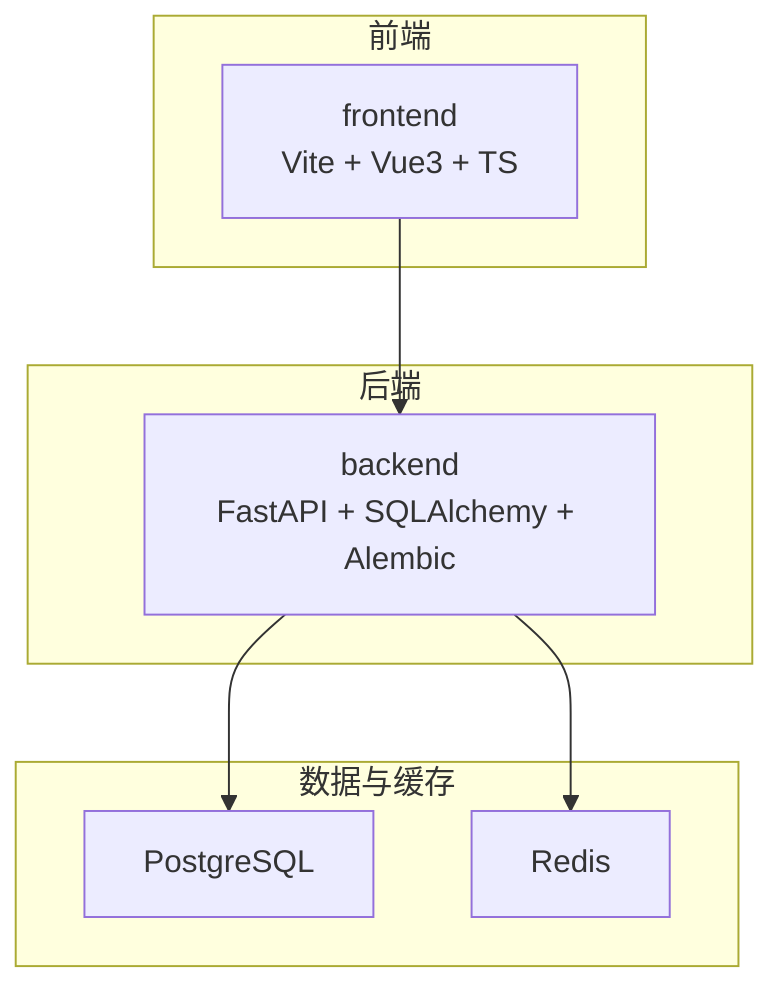
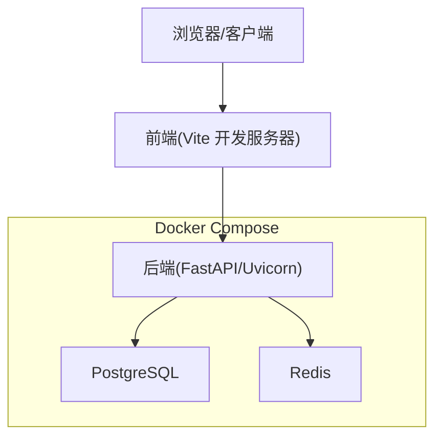
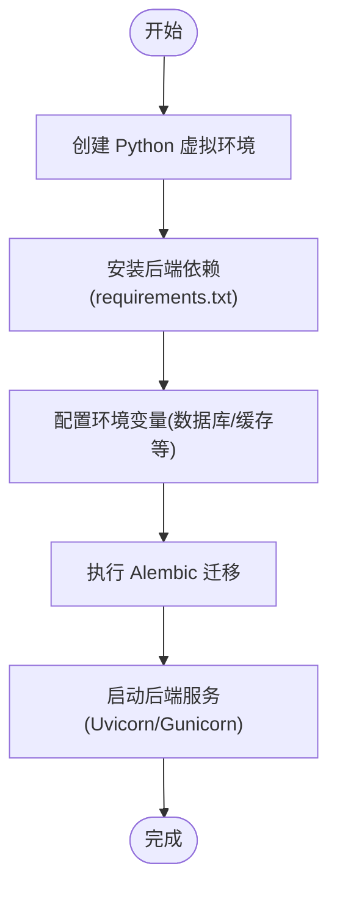
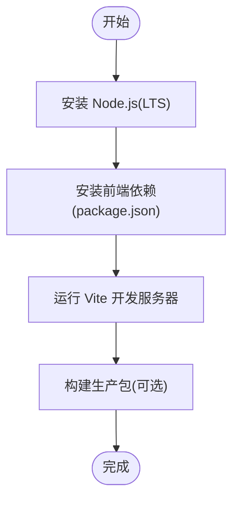
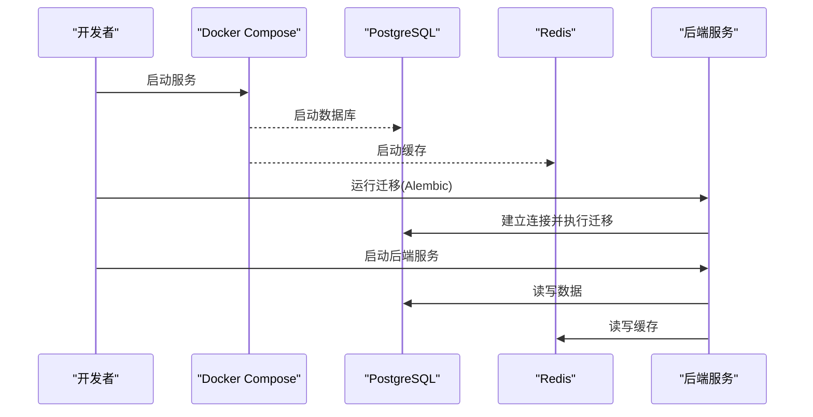
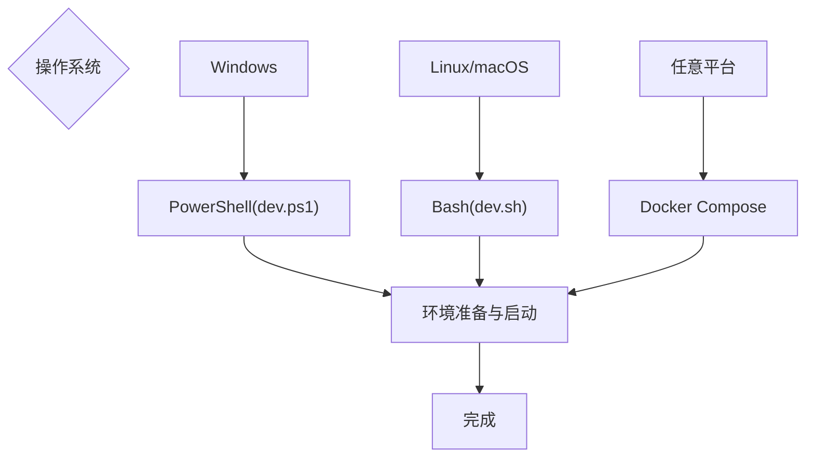
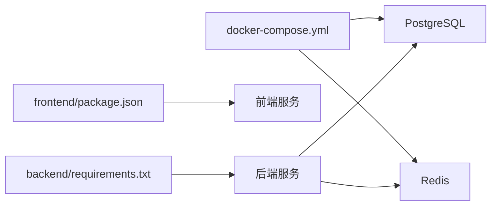

# 环境搭建

<cite>
**本文引用的文件**   
- [backend/requirements.txt](file://backend/requirements.txt)
- [backend/alembic.ini](file://backend/alembic.ini)
- [backend/app/core/config.py](file://backend/app/core/config.py)
- [backend/app/db.py](file://backend/app/db.py)
- [backend/Dockerfile](file://backend/Dockerfile)
- [frontend/package.json](file://frontend/package.json)
- [frontend/vite.config.ts](file://frontend/vite.config.ts)
- [frontend/Dockerfile](file://frontend/Dockerfile)
- [docker-compose.yml](file://docker-compose.yml)
- [dev.sh](file://dev.sh)
- [dev.ps1](file://dev.ps1)
</cite>

## 目录
1. [简介](#简介)
2. [项目结构](#项目结构)
3. [核心组件](#核心组件)
4. [架构总览](#架构总览)
5. [详细组件分析](#详细组件分析)
6. [依赖关系分析](#依赖关系分析)
7. [性能注意事项](#性能注意事项)
8. [故障排查指南](#故障排查指南)
9. [结论](#结论)
10. [附录](#附录)

## 简介
本指南面向首次接触 Talos 项目的开发者，提供从本地到容器化的完整环境搭建说明。内容覆盖：
- Python 虚拟环境与后端依赖（FastAPI、SQLAlchemy、Alembic 等）
- Node.js 与前端依赖管理（npm/yarn）
- Docker 与 docker-compose 一键启动数据库、缓存与服务
- PostgreSQL 连接与 Redis 缓存配置
- IDE 推荐与调试器设置
- Windows 与 Linux/macOS 平台差异
- 常见环境问题定位与解决

## 项目结构
Talos 采用前后端分离架构：
- backend：Python FastAPI 应用，包含 API、模型、服务、任务调度、迁移脚本等
- frontend：Vue 3 + TypeScript + Vite 前端工程
- docker-compose.yml：编排后端、数据库、缓存及可选的 Nginx 反向代理
- dev.sh / dev.ps1：开发辅助脚本（Linux/macOS / Windows PowerShell）

[本节为概念性概述，不直接分析具体文件]

## 核心组件
- 后端运行环境
  - Python 版本建议：3.10+（以 requirements.txt 为准）
  - 包管理器：pip + venv（或 pipenv/poetry）
  - 关键框架：FastAPI、SQLAlchemy、Alembic、Pydantic、Uvicorn/Gunicorn（由 Dockerfile 决定）
- 前端运行环境
  - Node.js 版本建议：18+（LTS）
  - 包管理器：npm 或 yarn（package.json 中定义）
  - 构建工具：Vite（vite.config.ts）
- 基础设施
  - PostgreSQL：持久化存储
  - Redis：缓存与会话（如使用）
  - Docker Compose：一键拉起所有服务

**章节来源**
- [backend/requirements.txt](file://backend/requirements.txt)
- [frontend/package.json](file://frontend/package.json)
- [frontend/vite.config.ts](file://frontend/vite.config.ts)

## 架构总览
下图展示开发环境中的主要组件与交互关系，包括前端请求如何到达后端 API，以及后端对数据库和缓存的访问路径。

**图示来源**
- [docker-compose.yml](file://docker-compose.yml)
- [backend/Dockerfile](file://backend/Dockerfile)
- [frontend/Dockerfile](file://frontend/Dockerfile)

## 详细组件分析

### 后端环境搭建（Python + FastAPI + SQLAlchemy + Alembic）
- 安装 Python 并创建虚拟环境
  - 推荐使用 venv 隔离依赖；确保 Python 版本满足 requirements.txt 要求
- 安装后端依赖
  - 在 backend 目录下执行依赖安装命令（参考 requirements.txt）
- 初始化数据库与迁移
  - 使用 Alembic 进行数据库迁移（参考 alembic.ini 与 alembic 目录）
- 环境变量与配置
  - 数据库连接、缓存地址等通过配置文件加载（参考 app/core/config.py）
  - db.py 中定义数据库会话与引擎（参考 app/db.py）
- 运行后端服务
  - 开发模式可使用 Uvicorn 热重载；生产模式建议使用 Gunicorn（由 Dockerfile 决定）

**图示来源**
- [backend/requirements.txt](file://backend/requirements.txt)
- [backend/alembic.ini](file://backend/alembic.ini)
- [backend/app/core/config.py](file://backend/app/core/config.py)
- [backend/app/db.py](file://backend/app/db.py)

**章节来源**
- [backend/requirements.txt](file://backend/requirements.txt)
- [backend/alembic.ini](file://backend/alembic.ini)
- [backend/app/core/config.py](file://backend/app/core/config.py)
- [backend/app/db.py](file://backend/app/db.py)

### 前端环境搭建（Node.js + Vite + Vue3 + TypeScript）
- 安装 Node.js（建议 LTS 版本）
- 进入 frontend 目录安装依赖
  - 使用 npm 或 yarn（依据 package.json 的脚本与锁文件）
- 开发与构建
  - 开发模式：Vite 开发服务器（参考 vite.config.ts）
  - 构建产物：用于生产部署或 Nginx 托管
- Docker 镜像（可选）
  - 使用 frontend/Dockerfile 构建前端镜像

**图示来源**
- [frontend/package.json](file://frontend/package.json)
- [frontend/vite.config.ts](file://frontend/vite.config.ts)
- [frontend/Dockerfile](file://frontend/Dockerfile)

**章节来源**
- [frontend/package.json](file://frontend/package.json)
- [frontend/vite.config.ts](file://frontend/vite.config.ts)
- [frontend/Dockerfile](file://frontend/Dockerfile)

### 数据库与缓存配置（PostgreSQL + Redis）
- PostgreSQL
  - 通过 docker-compose 启动或使用本地实例
  - 连接参数由后端配置加载（app/core/config.py）
  - 数据库会话与引擎在 app/db.py 中定义
- Redis
  - 通过 docker-compose 启动或使用本地实例
  - 连接参数由后端配置加载（app/core/config.py）
- 迁移与初始化
  - 使用 Alembic 执行迁移（alembic.ini 与 alembic 目录）

**图示来源**
- [docker-compose.yml](file://docker-compose.yml)
- [backend/app/core/config.py](file://backend/app/core/config.py)
- [backend/app/db.py](file://backend/app/db.py)
- [backend/alembic.ini](file://backend/alembic.ini)

**章节来源**
- [docker-compose.yml](file://docker-compose.yml)
- [backend/app/core/config.py](file://backend/app/core/config.py)
- [backend/app/db.py](file://backend/app/db.py)
- [backend/alembic.ini](file://backend/alembic.ini)

### IDE 推荐与调试器设置
- VS Code
  - 安装 Python、Pylance、ESLint、Volar/Vue 插件
  - 配置 Python 解释器指向虚拟环境
  - 配置前端调试（Chrome/Edge 调试器）
- PyCharm
  - 选择虚拟环境作为解释器
  - 配置 Django/FastAPI 运行配置（Uvicorn）
  - 启用断点调试与日志输出
- 通用建议
  - 统一代码风格（Black、isort、pre-commit）
  - 开启 ESLint/Prettier（前端）
  - 配置 .env 文件管理敏感信息

[本节为通用指导，不直接分析具体文件]

### 跨平台安装步骤（Windows 与 Linux/macOS）
- Windows
  - 使用 PowerShell 执行 dev.ps1（如可用）
  - 或通过命令行手动创建虚拟环境、安装依赖、启动服务
- Linux/macOS
  - 使用 bash 执行 dev.sh（如可用）
  - 或通过命令行手动创建虚拟环境、安装依赖、启动服务
- Docker Compose
  - 在所有平台均可通过 docker-compose 一键启动数据库、缓存与后端

**图示来源**
- [dev.ps1](file://dev.ps1)
- [dev.sh](file://dev.sh)
- [docker-compose.yml](file://docker-compose.yml)

**章节来源**
- [dev.ps1](file://dev.ps1)
- [dev.sh](file://dev.sh)
- [docker-compose.yml](file://docker-compose.yml)

## 依赖关系分析
- 后端依赖
  - 由 backend/requirements.txt 统一管理，包含 Web 框架、ORM、迁移工具、任务队列等
- 前端依赖
  - 由 frontend/package.json 统一管理，包含 UI 框架、构建工具、类型定义等
- 运行时依赖
  - docker-compose.yml 编排数据库、缓存与后端服务

**图示来源**
- [backend/requirements.txt](file://backend/requirements.txt)
- [frontend/package.json](file://frontend/package.json)
- [docker-compose.yml](file://docker-compose.yml)

**章节来源**
- [backend/requirements.txt](file://backend/requirements.txt)
- [frontend/package.json](file://frontend/package.json)
- [docker-compose.yml](file://docker-compose.yml)

## 性能注意事项
- 数据库连接池
  - 合理配置 SQLAlchemy 连接池大小，避免连接耗尽
- 缓存策略
  - 合理使用 Redis 缓存热点数据，减少数据库压力
- 构建优化
  - 前端按需引入与懒加载，减少首屏体积
- 进程与线程
  - 后端使用多进程/多线程时注意资源竞争与锁机制

[本节为通用指导，不直接分析具体文件]

## 故障排查指南
- 无法连接数据库
  - 检查 PostgreSQL 是否启动、端口与凭据是否正确
  - 确认后端环境变量与 config.py 配置一致
- 缓存连接失败
  - 检查 Redis 是否启动、地址与端口是否正确
- 迁移失败
  - 查看 alembic 日志，确认迁移脚本与数据库状态一致
- 前端构建错误
  - 清理 node_modules 后重新安装依赖
  - 检查 Node.js 版本与 package.json 脚本
- 端口冲突
  - 修改 docker-compose 或本地服务的端口映射

**章节来源**
- [backend/app/core/config.py](file://backend/app/core/config.py)
- [backend/app/db.py](file://backend/app/db.py)
- [backend/alembic.ini](file://backend/alembic.ini)
- [frontend/package.json](file://frontend/package.json)

## 结论
通过本指南，你可以在 Windows、Linux 与 macOS 上快速搭建 Talos 的开发环境。使用 Docker Compose 可简化数据库与缓存的部署，结合 IDE 调试能力提升开发效率。遇到问题时，优先检查环境变量、端口与依赖版本一致性。

[本节为总结性内容，不直接分析具体文件]

## 附录
- 常用命令（示例）
  - 后端：创建虚拟环境、安装依赖、运行迁移、启动服务
  - 前端：安装依赖、运行开发服务器、构建生产包
  - 容器：启动/停止服务、查看日志
- 环境变量模板
  - 数据库连接、缓存地址、密钥等建议通过 .env 管理

[本节为补充信息，不直接分析具体文件]