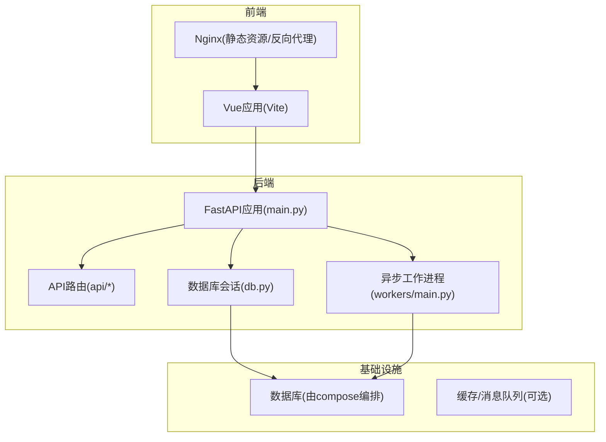
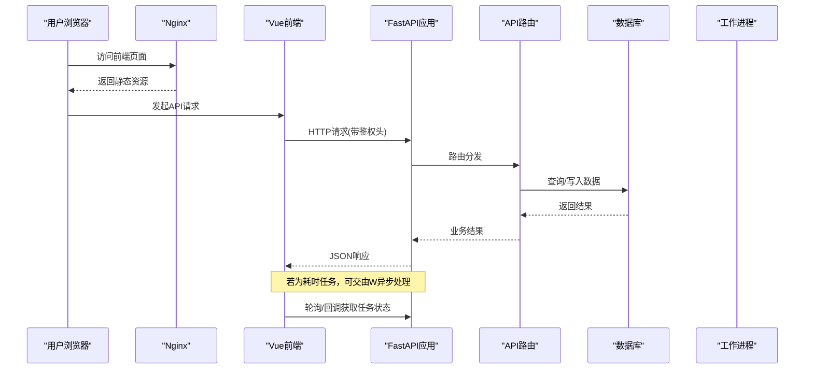
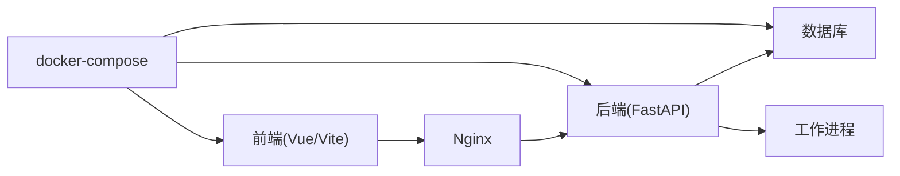

# 调试与故障排查

<cite>
**本文引用的文件**   
- [backend/app/main.py](file://backend/app/main.py)
- [backend/app/core/config.py](file://backend/app/core/config.py)
- [backend/app/db.py](file://backend/app/db.py)
- [backend/app/api/v1/auth.py](file://backend/app/api/v1/auth.py)
- [backend/app/workers/main.py](file://backend/app/workers/main.py)
- [backend/Dockerfile](file://backend/Dockerfile)
- [frontend/src/main.ts](file://frontend/src/main.ts)
- [frontend/src/router/index.ts](file://frontend/src/router/index.ts)
- [frontend/src/api/client.ts](file://frontend/src/api/client.ts)
- [frontend/Dockerfile](file://frontend/Dockerfile)
- [frontend/nginx.conf](file://frontend/nginx.conf)
- [docker-compose.yml](file://docker-compose.yml)
- [dev.sh](file://dev.sh)
- [dev.ps1](file://dev.ps1)
</cite>

## 目录
1. [简介](#简介)
2. [项目结构](#项目结构)
3. [核心组件](#核心组件)
4. [架构总览](#架构总览)
5. [详细组件分析](#详细组件分析)
6. [依赖关系分析](#依赖关系分析)
7. [性能注意事项](#性能注意事项)
8. [故障排查指南](#故障排查指南)
9. [结论](#结论)
10. [附录](#附录)

## 简介
本指南面向Talos项目的开发与运维人员，聚焦于调试与故障排查。内容覆盖开发环境下的Python断点调试、Vue浏览器调试、数据库查询优化；生产环境的日志分析、性能监控、错误追踪；常见问题诊断（数据库连接、API超时、前端资源加载失败）；Docker容器调试与网络问题排查；内存泄漏检测与CPU性能分析工具使用；以及监控系统配置与告警设置建议。

## 项目结构
Talos采用前后端分离架构：
- 后端：基于FastAPI的Python服务，包含API路由、数据模型、服务层、异步任务工作进程、数据库会话管理、配置与安全模块。
- 前端：基于Vue + TypeScript + Vite构建，Nginx作为静态资源服务器与反向代理。
- 部署：通过docker-compose编排后端、前端与外部依赖（如数据库）。
- 开发脚本：提供跨平台的本地启动脚本。

图表来源
- [backend/app/main.py](file://backend/app/main.py)
- [backend/app/api/v1/auth.py](file://backend/app/api/v1/auth.py)
- [backend/app/db.py](file://backend/app/db.py)
- [backend/app/workers/main.py](file://backend/app/workers/main.py)
- [frontend/nginx.conf](file://frontend/nginx.conf)
- [docker-compose.yml](file://docker-compose.yml)

章节来源
- [backend/app/main.py](file://backend/app/main.py)
- [frontend/src/main.ts](file://frontend/src/main.ts)
- [frontend/src/router/index.ts](file://frontend/src/router/index.ts)
- [frontend/src/api/client.ts](file://frontend/src/api/client.ts)
- [frontend/nginx.conf](file://frontend/nginx.conf)
- [docker-compose.yml](file://docker-compose.yml)

## 核心组件
- FastAPI主应用入口：负责中间件注册、路由挂载、生命周期钩子、CORS与请求日志等。
- API路由层：按功能划分模块（认证、资产、报告、导入、漏洞等），集中处理HTTP请求与响应。
- 数据库层：统一会话管理与连接池配置，支持事务与查询优化。
- 工作进程：异步任务调度与执行，用于耗时操作（如文档解析、报表生成）。
- 前端客户端：统一的API调用封装，处理鉴权头、错误重试与超时。
- Nginx：静态资源服务与反向代理，转发API请求到后端。
- Docker编排：统一拉起前后端与依赖服务，暴露端口与环境变量。

章节来源
- [backend/app/main.py](file://backend/app/main.py)
- [backend/app/api/v1/auth.py](file://backend/app/api/v1/auth.py)
- [backend/app/db.py](file://backend/app/db.py)
- [backend/app/workers/main.py](file://backend/app/workers/main.py)
- [frontend/src/api/client.ts](file://frontend/src/api/client.ts)
- [frontend/nginx.conf](file://frontend/nginx.conf)
- [docker-compose.yml](file://docker-compose.yml)

## 架构总览
下图展示从浏览器到后端API及数据库的完整请求链路，并标注关键调试节点。

图表来源
- [frontend/src/api/client.ts](file://frontend/src/api/client.ts)
- [backend/app/main.py](file://backend/app/main.py)
- [backend/app/api/v1/auth.py](file://backend/app/api/v1/auth.py)
- [backend/app/db.py](file://backend/app/db.py)
- [backend/app/workers/main.py](file://backend/app/workers/main.py)

## 详细组件分析

### 后端FastAPI应用与中间件
- 作用：初始化应用、注册中间件（CORS、请求日志、异常处理）、挂载路由、定义生命周期事件。
- 调试要点：
  - 在应用启动阶段打印关键配置与环境变量，确认端口、数据库URL、密钥等。
  - 开启请求级日志，记录方法、路径、状态码、耗时。
  - 对异常进行全局捕获，输出结构化错误信息。
- 常见故障：
  - CORS未正确配置导致跨域失败。
  - 环境变量缺失或格式错误导致启动失败。
  - 路由冲突或未挂载。

章节来源
- [backend/app/main.py](file://backend/app/main.py)

### API路由层（以认证为例）
- 作用：接收HTTP请求，校验参数，调用服务层，返回JSON响应。
- 调试要点：
  - 在入参校验处增加断点，检查字段类型与必填项。
  - 记录鉴权流程的关键步骤（令牌签发、刷新、失效）。
  - 对敏感操作记录审计日志（脱敏后）。
- 常见故障：
  - 令牌过期或签名不匹配。
  - 权限不足导致403。
  - 输入验证失败导致422。

章节来源
- [backend/app/api/v1/auth.py](file://backend/app/api/v1/auth.py)

### 数据库会话与连接管理
- 作用：维护连接池、会话生命周期、事务边界。
- 调试要点：
  - 监控连接池大小、活跃连接数、等待队列长度。
  - 对慢查询启用SQL日志，定位瓶颈。
  - 确保会话在请求结束时释放，避免连接泄漏。
- 常见故障：
  - 连接耗尽导致请求阻塞。
  - 事务未提交/回滚导致数据不一致。
  - 索引缺失导致全表扫描。

章节来源
- [backend/app/db.py](file://backend/app/db.py)

### 异步工作进程
- 作用：处理耗时任务（如文档解析、报表生成），避免阻塞API线程。
- 调试要点：
  - 监控任务队列长度、消费速率、失败重试次数。
  - 记录任务开始/结束时间、异常堆栈。
  - 对幂等性进行保障，避免重复执行。
- 常见故障：
  - 队列堆积导致延迟升高。
  - 任务失败无重试或重试风暴。
  - 资源竞争（文件锁、DB连接）导致死锁。

章节来源
- [backend/app/workers/main.py](file://backend/app/workers/main.py)

### 前端API客户端与路由
- 作用：封装HTTP请求，统一处理鉴权头、错误提示、超时与重试。
- 调试要点：
  - 在Network面板查看请求头、响应体、耗时。
  - 对拦截器增加日志，记录失败原因与重试策略。
  - 路由跳转时检查鉴权状态与重定向逻辑。
- 常见故障：
  - 401未登录或令牌过期。
  - 跨域被浏览器拦截。
  - 资源加载失败（CDN不可用、路径错误）。

章节来源
- [frontend/src/api/client.ts](file://frontend/src/api/client.ts)
- [frontend/src/router/index.ts](file://frontend/src/router/index.ts)

### Nginx反向代理与静态资源
- 作用：提供静态资源服务，将API请求转发至后端。
- 调试要点：
  - 查看access.log与error.log，定位4xx/5xx错误。
  - 检查upstream配置与负载均衡策略。
  - 确认缓存策略与压缩选项。
- 常见故障：
  - 502/504后端不可达或超时。
  - 静态资源404（路径映射错误）。
  - 跨域或Cookie丢失。

章节来源
- [frontend/nginx.conf](file://frontend/nginx.conf)

### Docker与Compose编排
- 作用：统一拉起服务，暴露端口，注入环境变量，管理网络。
- 调试要点：
  - 使用docker logs查看容器日志。
  - 进入容器内部执行命令排查（如curl、ping、nslookup）。
  - 检查端口占用、网络连通性与DNS解析。
- 常见故障：
  - 端口冲突或服务未就绪。
  - 环境变量未生效。
  - 卷挂载权限问题。

章节来源
- [backend/Dockerfile](file://backend/Dockerfile)
- [frontend/Dockerfile](file://frontend/Dockerfile)
- [docker-compose.yml](file://docker-compose.yml)

## 依赖关系分析
- 前端依赖：Vue生态（Vite、TypeScript、Tailwind等），通过Nginx发布。
- 后端依赖：FastAPI、ORM/驱动、任务队列（可选）、数据库驱动。
- 基础设施：数据库、缓存、消息队列（可选）。
- 编排与开发：docker-compose、开发脚本（dev.sh/dev.ps1）。

图表来源
- [frontend/src/main.ts](file://frontend/src/main.ts)
- [frontend/nginx.conf](file://frontend/nginx.conf)
- [backend/app/main.py](file://backend/app/main.py)
- [backend/app/workers/main.py](file://backend/app/workers/main.py)
- [docker-compose.yml](file://docker-compose.yml)

章节来源
- [docker-compose.yml](file://docker-compose.yml)
- [dev.sh](file://dev.sh)
- [dev.ps1](file://dev.ps1)

## 性能注意事项
- 后端
  - 启用数据库查询计划分析与慢查询日志。
  - 合理设置连接池大小与超时，避免饥饿与泄露。
  - 对热点接口添加缓存（Redis/Memcached）。
  - 使用异步I/O与并发控制，避免阻塞。
- 前端
  - 代码分割与懒加载，减少首屏体积。
  - 图片与静态资源CDN加速与缓存策略。
  - 网络请求合并与去抖/节流。
- 基础设施
  - 监控指标：CPU、内存、磁盘IO、网络带宽、连接数。
  - 告警阈值：错误率、延迟P95/P99、队列积压。

[本节为通用指导，不直接分析具体文件]

## 故障排查指南

### 开发环境调试技巧
- Python断点调试
  - 使用IDE断点与条件断点，逐步跟踪函数调用链。
  - 结合print/log输出关键变量与上下文。
  - 针对异步代码，使用专用调试器或日志标记。
- Vue浏览器调试
  - 使用开发者工具的Sources面板设置断点，Network面板观察请求。
  - 利用Vue DevTools检查组件状态与路由变化。
  - 对API客户端拦截器增加日志，记录失败与重试。
- 数据库查询优化
  - 启用慢查询日志，分析执行计划，补充索引。
  - 避免N+1查询，使用预加载或批量查询。
  - 分页与投影字段，减少数据传输量。

章节来源
- [backend/app/main.py](file://backend/app/main.py)
- [backend/app/db.py](file://backend/app/db.py)
- [frontend/src/api/client.ts](file://frontend/src/api/client.ts)
- [frontend/src/router/index.ts](file://frontend/src/router/index.ts)

### 生产环境问题排查
- 日志分析
  - 收集应用日志、Nginx访问/错误日志、系统日志。
  - 使用结构化日志与TraceID关联请求链路。
  - 建立日志聚合平台（ELK/Loki）与检索规则。
- 性能监控
  - 采集APM指标（请求耗时、错误率、QPS、GC停顿）。
  - 监控数据库连接池、慢查询、锁等待。
  - 前端性能指标（FCP、LCP、TTI、JS错误率）。
- 错误追踪
  - 集成错误上报（Sentry等），捕获异常堆栈与上下文。
  - 建立告警规则与通知渠道（邮件、IM）。

章节来源
- [backend/app/main.py](file://backend/app/main.py)
- [frontend/nginx.conf](file://frontend/nginx.conf)
- [docker-compose.yml](file://docker-compose.yml)

### 常见问题诊断与解决方案
- 数据库连接问题
  - 症状：连接超时、连接池耗尽、频繁重连。
  - 排查：检查连接池配置、最大连接数、网络连通性、防火墙。
  - 解决：调整池大小、增加超时、优化查询、补充索引。
- API超时
  - 症状：504网关超时、前端请求长时间无响应。
  - 排查：查看后端耗时、数据库慢查询、上游服务可用性。
  - 解决：拆分任务为异步、增加缓存、优化SQL、扩容实例。
- 前端资源加载失败
  - 症状：404静态资源、跨域错误、CDN不可用。
  - 排查：检查Nginx映射、CORS配置、CDN健康状态。
  - 解决：修正路径、配置CORS、切换备用源或降级策略。

章节来源
- [backend/app/db.py](file://backend/app/db.py)
- [backend/app/api/v1/auth.py](file://backend/app/api/v1/auth.py)
- [frontend/nginx.conf](file://frontend/nginx.conf)
- [frontend/src/api/client.ts](file://frontend/src/api/client.ts)

### Docker容器调试与网络排查
- 容器调试
  - 使用docker logs查看标准输出与错误。
  - 进入容器执行命令（bash/sh）进行网络探测（ping/curl/nslookup）。
  - 检查环境变量、卷挂载权限、端口映射。
- 网络排查
  - 确认服务间DNS解析与端口可达。
  - 检查防火墙与安全组规则。
  - 使用tcpdump或Wireshark抓包分析丢包与重传。

章节来源
- [backend/Dockerfile](file://backend/Dockerfile)
- [frontend/Dockerfile](file://frontend/Dockerfile)
- [docker-compose.yml](file://docker-compose.yml)

### 内存泄漏检测与CPU性能分析
- 内存泄漏检测
  - Python：使用tracemalloc、memory_profiler定位增长对象。
  - Node/Vue：Chrome Performance面板分析堆快照与分配。
- CPU性能分析
  - Python：cProfile/py-spy采样热点函数。
  - 前端：Performance面板录制火焰图，识别长任务与重渲染。
- 建议
  - 定期压测与基准测试，建立性能基线。
  - 对热点路径进行优化与缓存。

[本节为通用指导，不直接分析具体文件]

### 监控系统配置与告警设置
- 指标采集
  - 后端：APM（请求耗时、错误率、QPS）、JVM/Python运行时指标。
  - 数据库：连接数、慢查询、锁等待、复制延迟。
  - 前端：错误率、加载耗时、用户行为埋点。
- 告警规则
  - 错误率突增、延迟P99超过阈值、队列积压、磁盘空间不足。
  - 多通道通知（邮件、企业微信、钉钉、PagerDuty）。
- 可视化
  - Grafana仪表盘聚合关键指标，设置阈值颜色与注解。

[本节为通用指导，不直接分析具体文件]

## 结论
通过系统化地掌握前后端调试技巧、生产环境监控与告警、常见问题诊断与容器化排障，可以显著提升Talos项目的稳定性与可观测性。建议在日常开发中固化调试流程，在生产环境中持续完善监控与告警体系，形成闭环的问题发现与修复机制。

## 附录
- 快速启动与本地调试
  - 使用dev.sh或dev.ps1启动开发环境，确保端口与环境变量正确。
  - 在IDE中配置断点与日志级别，逐步验证接口与页面交互。
- 常用命令
  - docker-compose up/down/logs/exec
  - curl -v 测试接口连通性与响应头
  - tail -f 实时查看日志

章节来源
- [dev.sh](file://dev.sh)
- [dev.ps1](file://dev.ps1)
- [docker-compose.yml](file://docker-compose.yml)