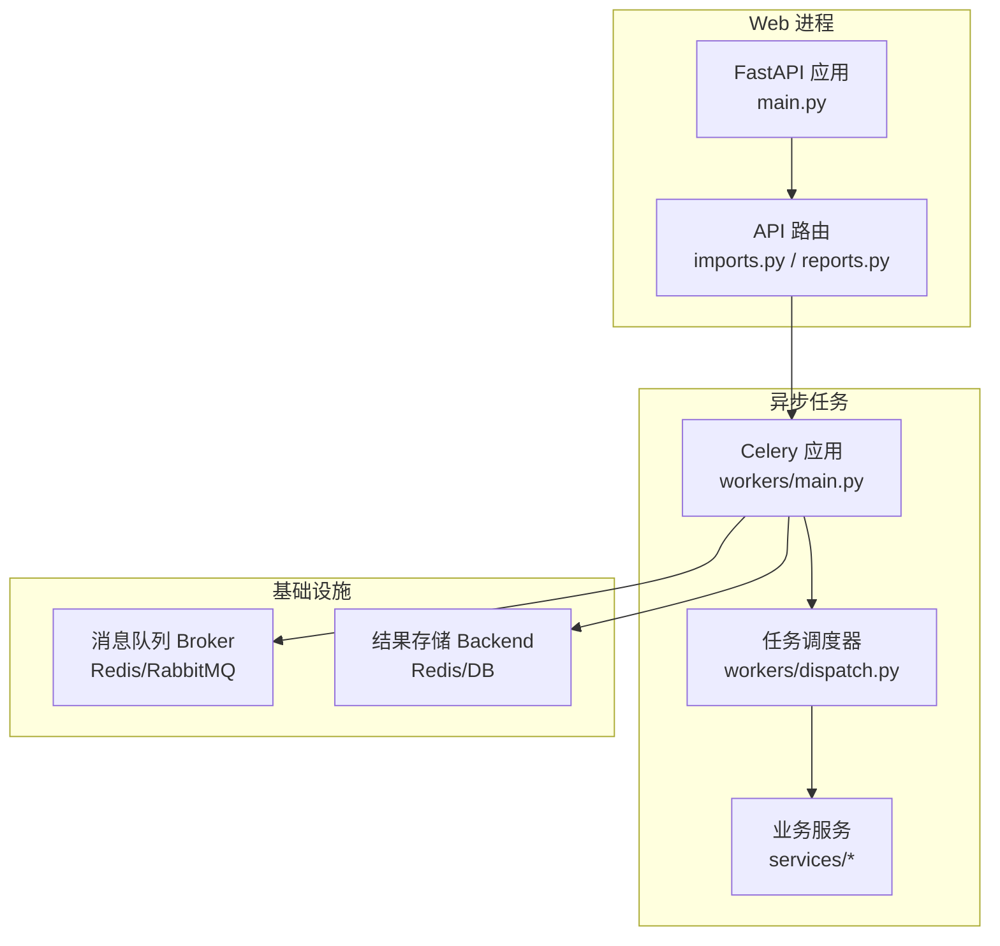
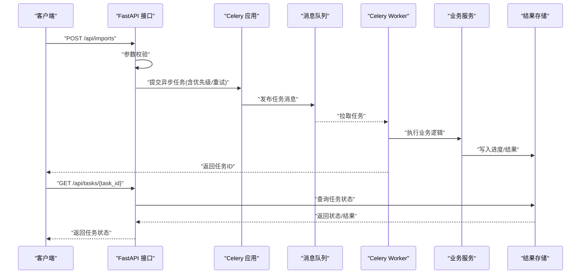
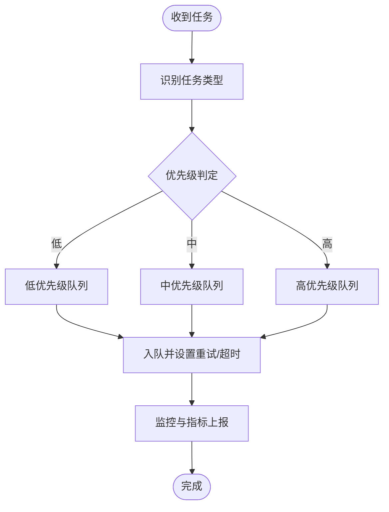
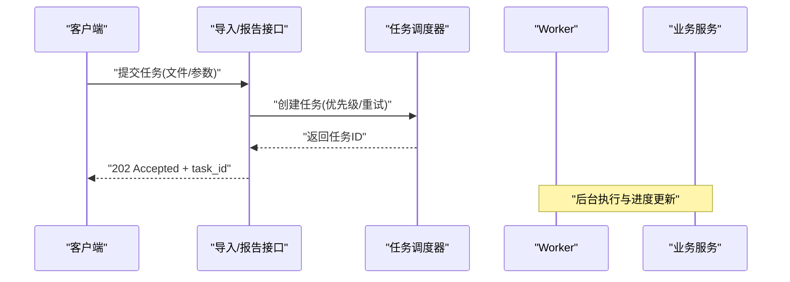
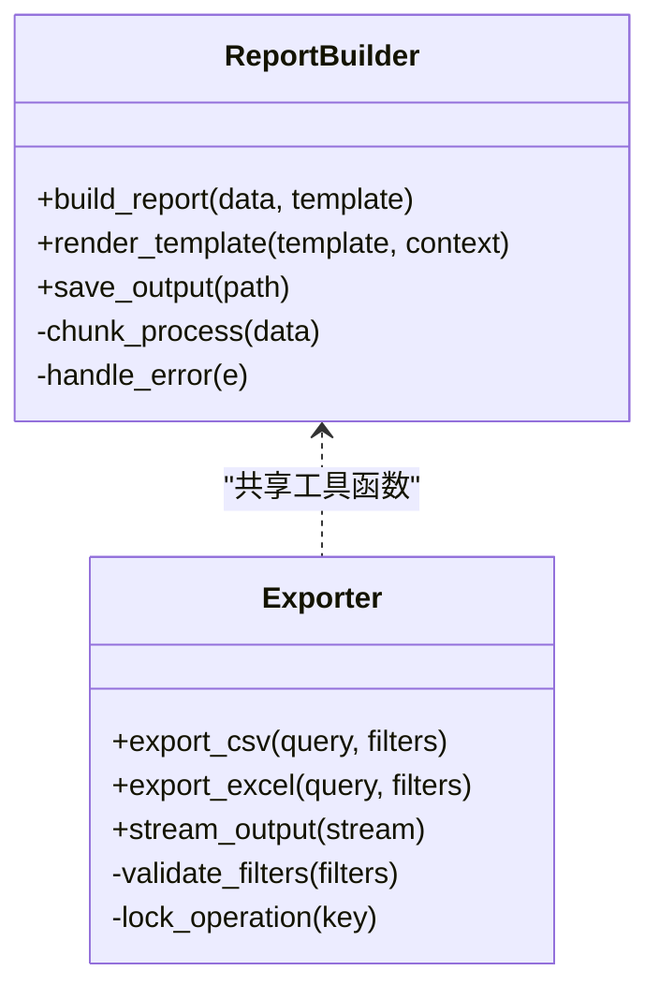
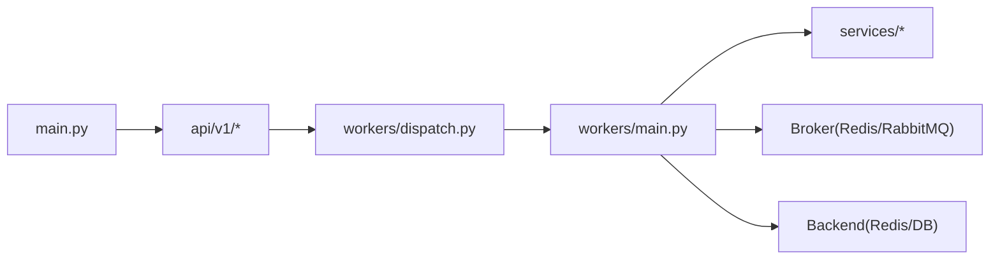

# 异步任务处理

<cite>
**本文引用的文件**   
- [backend/app/main.py](file://backend/app/main.py)
- [backend/app/workers/main.py](file://backend/app/workers/main.py)
- [backend/app/workers/dispatch.py](file://backend/app/workers/dispatch.py)
- [backend/app/api/v1/imports.py](file://backend/app/api/v1/imports.py)
- [backend/app/api/v1/reports.py](file://backend/app/api/v1/reports.py)
- [backend/app/services/report_builder.py](file://backend/app/services/report_builder.py)
- [backend/app/services/exporter.py](file://backend/app/services/exporter.py)
- [backend/app/core/config.py](file://backend/app/core/config.py)
- [docker-compose.yml](file://docker-compose.yml)
</cite>

## 目录
1. [简介](#简介)
2. [项目结构](#项目结构)
3. [核心组件](#核心组件)
4. [架构总览](#架构总览)
5. [详细组件分析](#详细组件分析)
6. [依赖关系分析](#依赖关系分析)
7. [性能考量](#性能考量)
8. [故障排查指南](#故障排查指南)
9. [结论](#结论)
10. [附录](#附录)

## 简介
本文件面向Talos项目的异步任务处理系统，围绕基于Celery的异步架构与消息队列配置展开，重点说明：
- 任务调度器工作机制：任务分发、负载均衡、失败重试策略
- 任务监控与管理：状态跟踪、执行日志、性能统计
- 长耗时任务模式：大规模数据导入、报告生成、漏洞扫描等
- 优先级设置与资源限制
- 调试与故障排查方法
- 扩展与自定义任务开发指南
- 分布式部署与水平扩展配置

## 项目结构
后端采用FastAPI作为HTTP入口，通过Celery Worker执行异步任务；消息中间件由外部服务提供（如Redis或RabbitMQ），结果存储与Broker配置由环境变量驱动。关键目录与职责如下：
- backend/app/main.py：Web应用启动、路由注册、生命周期钩子
- backend/app/workers/main.py：Celery应用初始化、Worker启动参数
- backend/app/workers/dispatch.py：任务调度与分发逻辑
- backend/app/api/v1/*：REST API接口，触发异步任务
- backend/app/services/*：业务服务层，封装复杂处理流程
- docker-compose.yml：容器编排，包含Web、Worker、Broker、Result Backend等

**图表来源** 
- [backend/app/main.py](file://backend/app/main.py)
- [backend/app/workers/main.py](file://backend/app/workers/main.py)
- [backend/app/workers/dispatch.py](file://backend/app/workers/dispatch.py)
- [backend/app/api/v1/imports.py](file://backend/app/api/v1/imports.py)
- [backend/app/api/v1/reports.py](file://backend/app/api/v1/reports.py)
- [backend/app/services/report_builder.py](file://backend/app/services/report_builder.py)
- [backend/app/services/exporter.py](file://backend/app/services/exporter.py)
- [docker-compose.yml](file://docker-compose.yml)

**章节来源**
- [backend/app/main.py](file://backend/app/main.py)
- [backend/app/workers/main.py](file://backend/app/workers/main.py)
- [backend/app/workers/dispatch.py](file://backend/app/workers/dispatch.py)
- [backend/app/api/v1/imports.py](file://backend/app/api/v1/imports.py)
- [backend/app/api/v1/reports.py](file://backend/app/api/v1/reports.py)
- [backend/app/services/report_builder.py](file://backend/app/services/report_builder.py)
- [backend/app/services/exporter.py](file://backend/app/services/exporter.py)
- [docker-compose.yml](file://docker-compose.yml)

## 核心组件
- Web应用与API层：负责接收请求、参数校验、触发异步任务并返回任务ID，供前端轮询或回调查询状态。
- Celery应用与Worker：初始化Celery实例，加载配置，启动Worker进程池，消费队列中的任务。
- 任务调度器：统一的任务分发入口，支持按类型路由到不同队列、设置优先级、重试策略、超时控制。
- 业务服务层：实现具体任务逻辑，如报告构建、导出、数据导入等，保证幂等性与可恢复性。
- 基础设施：Broker用于任务消息传递，Backend用于持久化任务结果与状态。

**章节来源**
- [backend/app/workers/main.py](file://backend/app/workers/main.py)
- [backend/app/workers/dispatch.py](file://backend/app/workers/dispatch.py)
- [backend/app/api/v1/imports.py](file://backend/app/api/v1/imports.py)
- [backend/app/api/v1/reports.py](file://backend/app/api/v1/reports.py)
- [backend/app/services/report_builder.py](file://backend/app/services/report_builder.py)
- [backend/app/services/exporter.py](file://backend/app/services/exporter.py)

## 架构总览
下图展示从HTTP请求到任务执行的完整链路，包括任务入队、Worker消费、业务处理、结果落库与状态查询。

**图表来源** 
- [backend/app/api/v1/imports.py](file://backend/app/api/v1/imports.py)
- [backend/app/workers/main.py](file://backend/app/workers/main.py)
- [backend/app/workers/dispatch.py](file://backend/app/workers/dispatch.py)
- [backend/app/services/report_builder.py](file://backend/app/services/report_builder.py)
- [backend/app/services/exporter.py](file://backend/app/services/exporter.py)

## 详细组件分析

### 任务调度器（workers/dispatch.py）
- 功能要点
  - 统一任务入口，根据任务类型选择队列与路由键
  - 支持优先级设置（低/中/高），映射到不同队列或消息属性
  - 失败重试策略：指数退避、最大重试次数、死信队列
  - 超时控制：单任务最大运行时间，避免阻塞Worker
  - 幂等性保障：基于任务ID去重，防止重复执行
- 设计建议
  - 将任务分类为“导入”、“报告”、“扫描”等，分别绑定独立队列
  - 使用延迟队列处理定时任务与削峰填谷
  - 结合指标采集记录任务耗时、成功率、失败率

**图表来源** 
- [backend/app/workers/dispatch.py](file://backend/app/workers/dispatch.py)

**章节来源**
- [backend/app/workers/dispatch.py](file://backend/app/workers/dispatch.py)

### 任务入口与API（api/v1/imports.py, api/v1/reports.py）
- 导入接口
  - 接收文件/数据源，进行格式校验与权限检查
  - 调用调度器提交“导入”任务，返回任务ID
  - 支持批量导入的分片与进度上报
- 报告接口
  - 接收报告模板与数据范围，提交“报告生成”任务
  - 支持分页预览与增量更新
- 通用能力
  - 统一的错误码与异常处理
  - 审计日志与操作追踪

**图表来源** 
- [backend/app/api/v1/imports.py](file://backend/app/api/v1/imports.py)
- [backend/app/api/v1/reports.py](file://backend/app/api/v1/reports.py)
- [backend/app/workers/dispatch.py](file://backend/app/workers/dispatch.py)

**章节来源**
- [backend/app/api/v1/imports.py](file://backend/app/api/v1/imports.py)
- [backend/app/api/v1/reports.py](file://backend/app/api/v1/reports.py)

### 业务服务（services/report_builder.py, services/exporter.py）
- 报告构建
  - 组装数据、渲染模板、输出PDF/DOCX
  - 分块处理大文档，避免内存峰值过高
  - 失败回滚与断点续传
- 数据导出
  - 流式导出CSV/Excel，支持分页与过滤
  - 并发安全与锁机制，避免重复导出
- 监控与可观测性
  - 记录关键步骤耗时与错误堆栈
  - 上报任务指标（CPU/内存/IO）

**图表来源** 
- [backend/app/services/report_builder.py](file://backend/app/services/report_builder.py)
- [backend/app/services/exporter.py](file://backend/app/services/exporter.py)

**章节来源**
- [backend/app/services/report_builder.py](file://backend/app/services/report_builder.py)
- [backend/app/services/exporter.py](file://backend/app/services/exporter.py)

### Celery应用与Worker（workers/main.py）
- 初始化Celery实例，加载配置（Broker、Backend、序列化方式）
- 定义Worker进程数、并发度、预取数量
- 注册任务模块，启用监控插件（如Flower）
- 优雅关闭与信号处理，确保任务完整性

**章节来源**
- [backend/app/workers/main.py](file://backend/app/workers/main.py)

### 配置与环境（core/config.py）
- 环境变量管理：Broker URL、Backend URL、Worker并发、重试策略
- 安全配置：认证密钥、加密算法、访问控制
- 运行时开关：调试模式、日志级别、指标采集开关

**章节来源**
- [backend/app/core/config.py](file://backend/app/core/config.py)

## 依赖关系分析
- Web应用依赖API路由与调度器，不直接耦合Worker实现
- Worker依赖调度器与业务服务，解耦HTTP与异步执行
- Broker与Backend通过Celery配置注入，支持多环境切换
- 服务层之间通过接口抽象降低耦合，便于替换实现

**图表来源** 
- [backend/app/main.py](file://backend/app/main.py)
- [backend/app/api/v1/imports.py](file://backend/app/api/v1/imports.py)
- [backend/app/api/v1/reports.py](file://backend/app/api/v1/reports.py)
- [backend/app/workers/dispatch.py](file://backend/app/workers/dispatch.py)
- [backend/app/workers/main.py](file://backend/app/workers/main.py)
- [backend/app/services/report_builder.py](file://backend/app/services/report_builder.py)
- [backend/app/services/exporter.py](file://backend/app/services/exporter.py)

**章节来源**
- [backend/app/main.py](file://backend/app/main.py)
- [backend/app/workers/main.py](file://backend/app/workers/main.py)
- [backend/app/workers/dispatch.py](file://backend/app/workers/dispatch.py)

## 性能考量
- 队列隔离：按任务类型划分队列，避免热点任务阻塞其他任务
- 并发控制：合理设置Worker进程数与预取数量，平衡吞吐与资源占用
- 批处理与分片：大文件导入与报告生成采用分块处理，降低内存峰值
- 缓存与索引：热点数据缓存，数据库索引优化，减少I/O等待
- 监控告警：基于指标阈值触发告警，及时发现瓶颈与异常

[本节为通用指导，不直接分析具体文件]

## 故障排查指南
- 常见问题定位
  - 任务未执行：检查Broker连接、Worker是否在线、队列是否正确
  - 任务失败：查看Worker日志、错误堆栈、重试次数与死信队列
  - 性能问题：监控CPU/内存/IO，分析慢查询与锁竞争
- 调试技巧
  - 本地模拟：使用Celery的Eager模式进行单元测试
  - 日志增强：在关键路径添加结构化日志，便于检索与分析
  - 指标采集：集成Prometheus/Grafana，可视化任务健康度
- 恢复策略
  - 幂等重试：对失败任务进行自动重试，必要时人工介入
  - 断点续传：支持任务中断后从最近检查点恢复
  - 降级方案：临时关闭非关键任务，保障核心流程

**章节来源**
- [backend/app/workers/main.py](file://backend/app/workers/main.py)
- [backend/app/workers/dispatch.py](file://backend/app/workers/dispatch.py)

## 结论
Talos的异步任务处理系统以Celery为核心，结合消息队列与结果存储，实现了高可用、可扩展的异步执行框架。通过合理的队列隔离、优先级与重试策略、以及完善的监控与调试手段，能够有效支撑大规模数据导入、报告生成、漏洞扫描等长耗时场景。未来可进一步引入动态扩缩容、任务依赖图与更细粒度的资源配额，提升整体稳定性与效率。

[本节为总结性内容，不直接分析具体文件]

## 附录
- 分布式部署与水平扩展
  - 多Worker节点：通过容器编排（Docker Compose/Kubernetes）横向扩展Worker
  - Broker高可用：使用集群版Redis或RabbitMQ，确保消息可靠传输
  - Backend持久化：选择高性能KV或关系型数据库，保障结果一致性
  - 配置管理：集中化管理环境变量与密钥，支持多环境快速切换

**章节来源**
- [docker-compose.yml](file://docker-compose.yml)
- [backend/app/core/config.py](file://backend/app/core/config.py)