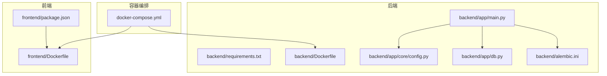
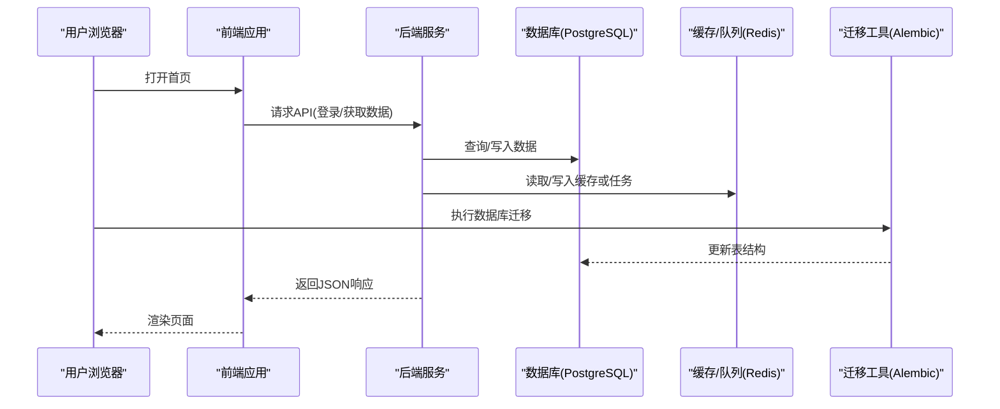
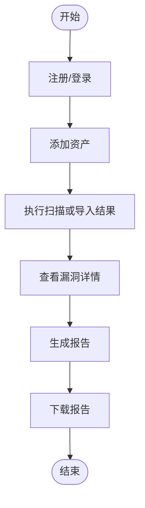
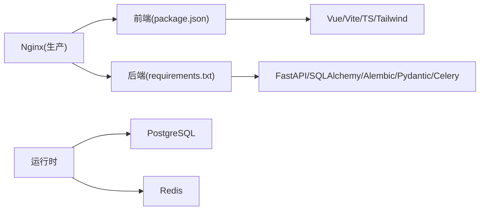

# 快速开始

<cite>
**本文引用的文件**   
- [docker-compose.yml](file://docker-compose.yml)
- [dev.sh](file://dev.sh)
- [dev.ps1](file://dev.ps1)
- [backend/requirements.txt](file://backend/requirements.txt)
- [backend/Dockerfile](file://backend/Dockerfile)
- [frontend/package.json](file://frontend/package.json)
- [frontend/Dockerfile](file://frontend/Dockerfile)
- [backend/app/main.py](file://backend/app/main.py)
- [backend/app/core/config.py](file://backend/app/core/config.py)
- [backend/app/db.py](file://backend/app/db.py)
- [backend/alembic.ini](file://backend/alembic.ini)
</cite>

## 目录
1. [简介](#简介)
2. [项目结构](#项目结构)
3. [核心组件](#核心组件)
4. [架构总览](#架构总览)
5. [详细组件分析](#详细组件分析)
6. [依赖分析](#依赖分析)
7. [性能考虑](#性能考虑)
8. [故障排查指南](#故障排查指南)
9. [结论](#结论)
10. [附录](#附录)

## 简介
本快速开始指南面向首次接触 Talos 漏洞管理平台的用户，帮助你从零搭建本地开发环境、理解开发与生产模式的差异，并顺利完成一次完整的漏洞扫描与报告生成流程。通过容器化部署与脚本辅助，你可以快速体验平台的核心能力：资产管理、漏洞录入与编辑、报告导出等。

## 项目结构
Talos 采用前后端分离的架构：
- 后端（Python/FastAPI）：提供 REST API、数据库迁移、异步任务处理等能力
- 前端（Vue/Vite）：提供 Web 界面与交互逻辑
- 容器编排（Docker Compose）：统一启动后端、数据库、Redis 等依赖服务
- 开发脚本（Shell/PowerShell）：一键初始化环境与启动开发服务

**图表来源** 
- [docker-compose.yml](file://docker-compose.yml)
- [backend/Dockerfile](file://backend/Dockerfile)
- [frontend/Dockerfile](file://frontend/Dockerfile)
- [backend/app/main.py](file://backend/app/main.py)
- [backend/app/core/config.py](file://backend/app/core/config.py)
- [backend/app/db.py](file://backend/app/db.py)
- [backend/alembic.ini](file://backend/alembic.ini)

**章节来源**
- [docker-compose.yml](file://docker-compose.yml)
- [backend/Dockerfile](file://backend/Dockerfile)
- [frontend/Dockerfile](file://frontend/Dockerfile)

## 核心组件
- 后端服务（FastAPI）：负责业务逻辑、数据持久化、任务调度与报告构建
- 数据库与缓存：PostgreSQL 用于持久化存储，Redis 用于缓存与任务队列
- 前端应用（Vue + Vite）：提供可视化操作界面
- 迁移工具（Alembic）：管理数据库版本与结构变更
- 容器化与编排：Docker 与 Docker Compose 统一运行环境

**章节来源**
- [backend/app/main.py](file://backend/app/main.py)
- [backend/app/core/config.py](file://backend/app/core/config.py)
- [backend/app/db.py](file://backend/app/db.py)
- [backend/alembic.ini](file://backend/alembic.ini)

## 架构总览
下图展示了本地开发时各组件之间的交互关系：浏览器访问前端页面，前端调用后端 API；后端读写数据库，并通过 Redis 进行任务协调；Alembic 负责数据库迁移。

**图表来源** 
- [backend/app/main.py](file://backend/app/main.py)
- [backend/app/db.py](file://backend/app/db.py)
- [backend/alembic.ini](file://backend/alembic.ini)

## 详细组件分析

### 环境准备
- Python：建议使用与后端依赖兼容的版本（参考 requirements.txt）
- Node.js：建议使用与前端构建工具兼容的版本（参考 package.json）
- Docker 与 Docker Compose：用于容器化运行后端、数据库、缓存等服务

安装建议：
- 使用系统包管理器或官方安装包安装 Python、Node.js、Docker、Docker Compose
- 验证安装成功：python --version、node -v、docker --version、docker compose version

**章节来源**
- [backend/requirements.txt](file://backend/requirements.txt)
- [frontend/package.json](file://frontend/package.json)

### 本地开发环境搭建
步骤概览：
1. 克隆仓库到本地
2. 配置环境变量（如数据库连接、Redis 地址、密钥等）
3. 初始化数据库（执行 Alembic 迁移）
4. 启动后端与前端服务（可使用开发脚本）
5. 访问前端页面完成注册/登录并体验功能

详细说明：
- 环境变量：在根目录创建 .env 文件，填写数据库 URL、Redis URL、JWT 密钥等（参考后端配置模块）
- 数据库初始化：运行 Alembic 迁移以创建表结构与初始数据
- 启动服务：
  - 使用 docker-compose 启动所有依赖服务
  - 使用 dev.sh（Linux/macOS）或 dev.ps1（Windows）一键启动前后端开发模式

**章节来源**
- [backend/app/core/config.py](file://backend/app/core/config.py)
- [backend/alembic.ini](file://backend/alembic.ini)
- [dev.sh](file://dev.sh)
- [dev.ps1](file://dev.ps1)
- [docker-compose.yml](file://docker-compose.yml)

### 开发模式与生产模式
- 开发模式：
  - 热重载：修改代码后自动重启服务
  - 调试日志：输出详细日志便于定位问题
  - 前端代理：直接指向后端开发端口
- 生产模式：
  - 静态资源预构建：前端打包为静态文件由 Nginx 提供服务
  - 多阶段构建：后端镜像精简体积，提升部署效率
  - 环境变量：通过 .env 或容器编排注入敏感配置

切换方式：
- 使用不同的 docker-compose 配置文件或环境变量标识
- 前端构建命令区分 development 与 production

**章节来源**
- [backend/Dockerfile](file://backend/Dockerfile)
- [frontend/Dockerfile](file://frontend/Dockerfile)
- [docker-compose.yml](file://docker-compose.yml)

### 第一个漏洞扫描与报告生成示例
目标：完成一次从资产录入到漏洞扫描再到报告导出的完整流程。

步骤：
1. 注册账号并登录
2. 添加资产（主机/IP/域名等）
3. 选择扫描器或导入扫描结果（支持常见格式）
4. 查看漏洞列表与详情
5. 生成报告（PDF/Word），下载并审阅

流程图：

**图表来源** 
- [backend/app/main.py](file://backend/app/main.py)
- [backend/app/services/report_builder.py](file://backend/app/services/report_builder.py)

**章节来源**
- [backend/app/main.py](file://backend/app/main.py)
- [backend/app/services/report_builder.py](file://backend/app/services/report_builder.py)

## 依赖分析
Talos 的依赖关系清晰分层：
- 前端依赖：Vue、Vite、TypeScript、TailwindCSS 等
- 后端依赖：FastAPI、SQLAlchemy、Alembic、Pydantic、Celery/Redis 等
- 运行时依赖：PostgreSQL、Redis、Nginx（生产模式）

**图表来源** 
- [frontend/package.json](file://frontend/package.json)
- [backend/requirements.txt](file://backend/requirements.txt)

**章节来源**
- [frontend/package.json](file://frontend/package.json)
- [backend/requirements.txt](file://backend/requirements.txt)

## 性能考虑
- 数据库连接池：合理设置连接数与超时，避免连接耗尽
- 缓存策略：热点数据缓存至 Redis，减少数据库压力
- 异步任务：将耗时操作（如扫描、报告生成）放入队列，提升响应速度
- 前端优化：按需加载、代码分割、静态资源压缩

[本节为通用指导，不直接分析具体文件]

## 故障排查指南
常见问题与解决方案：
- 数据库连接失败：检查数据库 URL、用户名、密码、网络连通性
- Redis 连接失败：确认 Redis 地址与端口，检查防火墙规则
- 迁移失败：查看 Alembic 日志，确保迁移脚本无冲突
- 前端无法访问后端：检查 CORS 配置、代理设置、端口占用
- 权限不足：确认运行用户对目录与文件的读写权限

排查步骤：
1. 查看容器日志：docker logs <容器名>
2. 检查环境变量：确认 .env 文件内容正确
3. 手动执行迁移：alembic upgrade head
4. 重启服务：docker-compose restart

**章节来源**
- [backend/alembic.ini](file://backend/alembic.ini)
- [backend/app/core/config.py](file://backend/app/core/config.py)

## 结论
通过本指南，你已掌握 Talos 漏洞管理平台的环境搭建、开发与生产模式切换、以及核心功能的初步使用。建议进一步阅读后端 API 文档与前端组件说明，深入定制与扩展平台能力。

[本节为总结性内容，不直接分析具体文件]

## 附录
- 常用命令：
  - 启动所有服务：docker-compose up -d
  - 停止服务：docker-compose down
  - 查看日志：docker-compose logs -f
  - 进入容器：docker exec -it <容器名> bash
- 配置文件位置：
  - 后端配置：backend/app/core/config.py
  - 数据库迁移：backend/alembic.ini
  - 前端构建：frontend/vite.config.ts

[本节为补充信息，不直接分析具体文件]